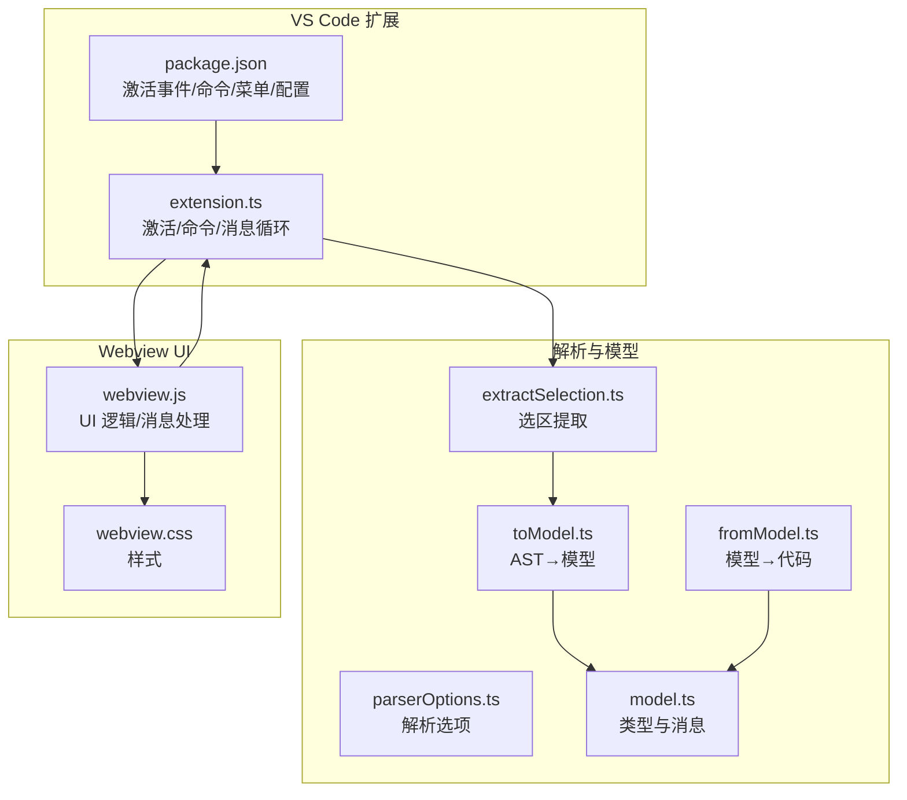
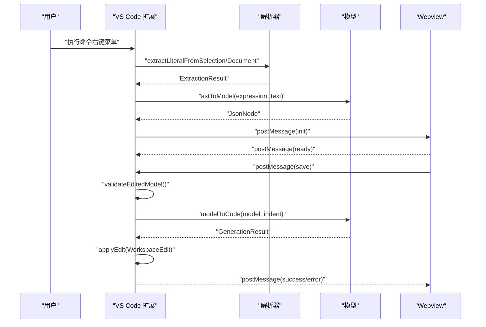
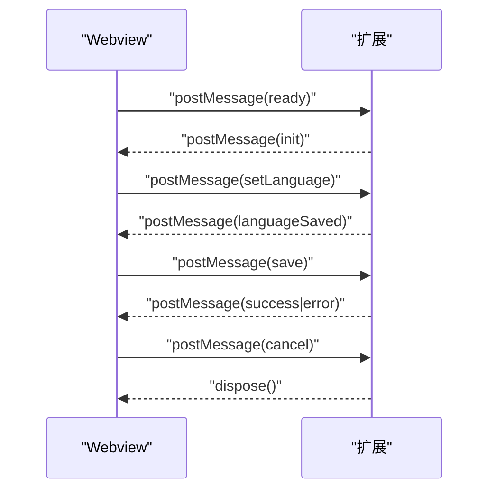
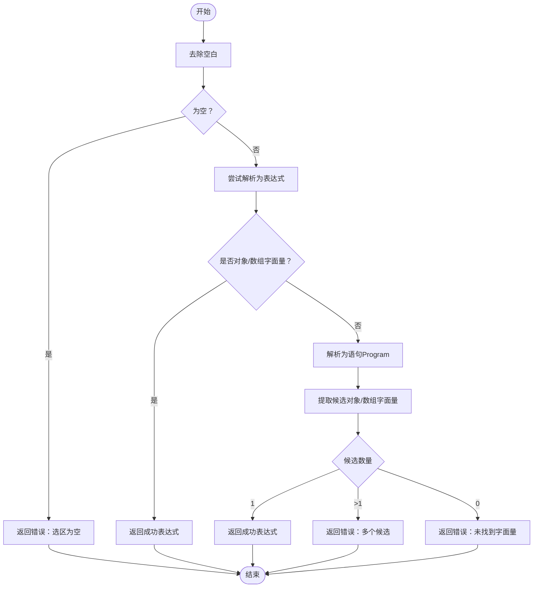
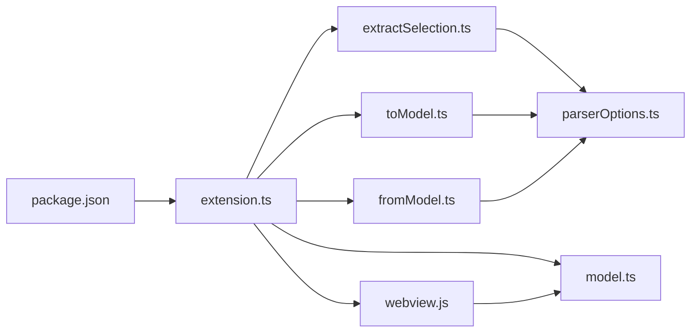

# API 参考文档

<cite>
**本文档引用的文件**
- [package.json](file://package.json)
- [extension.ts](file://src/extension.ts)
- [model.ts](file://src/model.ts)
- [extractSelection.ts](file://src/parser/extractSelection.ts)
- [toModel.ts](file://src/parser/toModel.ts)
- [fromModel.ts](file://src/parser/fromModel.ts)
- [parserOptions.ts](file://src/parser/parserOptions.ts)
- [webview.js](file://media/webview.js)
- [webview.css](file://media/webview.css)
- [测试计划.md](file://测试计划.md)
- [todo.md](file://todo.md)
</cite>

## 目录
1. [简介](#简介)
2. [项目结构](#项目结构)
3. [核心组件](#核心组件)
4. [架构总览](#架构总览)
5. [详细组件分析](#详细组件分析)
6. [依赖关系分析](#依赖关系分析)
7. [性能考量](#性能考量)
8. [故障排除指南](#故障排除指南)
9. [结论](#结论)
10. [附录](#附录)

## 简介
本文件为 JSONOKOK VS Code 扩展的完整 API 参考文档，涵盖以下内容：
- 公共接口与数据结构定义：JsonNode 类型系统、SourceInfo 元数据结构、统一的消息通信协议与响应类型
- 扩展 API 方法：命令注册、消息通信协议、事件监听机制
- VS Code 集成点：激活事件、命令贡献、菜单与国际化、配置项
- 生命周期钩子与扩展点：激活/停用、Webview 初始化与消息循环、保存/取消流程
- 消息通信格式、数据序列化与反序列化规则
- 最佳实践与常见陷阱
- 版本兼容性与迁移指南

## 项目结构
该扩展采用分层结构：
- 扩展入口与生命周期：src/extension.ts
- 类型与消息协议：src/model.ts
- 解析与转换：src/parser/*.ts（提取、AST 转模型、模型转代码）
- Webview UI：media/webview.js、media/webview.css
- 扩展元数据与贡献：package.json



**图表来源**
- [extension.ts:1-600](file://src/extension.ts#L1-L600)
- [model.ts:1-103](file://src/model.ts#L1-L103)
- [extractSelection.ts:1-385](file://src/parser/extractSelection.ts#L1-L385)
- [toModel.ts:1-230](file://src/parser/toModel.ts#L1-L230)
- [fromModel.ts:1-305](file://src/parser/fromModel.ts#L1-L305)
- [parserOptions.ts:1-36](file://src/parser/parserOptions.ts#L1-L36)
- [webview.js:1-800](file://media/webview.js#L1-L800)
- [webview.css:1-1166](file://media/webview.css#L1-L1166)
- [package.json:1-93](file://package.json#L1-L93)

**章节来源**
- [package.json:1-93](file://package.json#L1-L93)
- [extension.ts:1-600](file://src/extension.ts#L1-L600)
- [model.ts:1-103](file://src/model.ts#L1-L103)
- [extractSelection.ts:1-385](file://src/parser/extractSelection.ts#L1-L385)
- [toModel.ts:1-230](file://src/parser/toModel.ts#L1-L230)
- [fromModel.ts:1-305](file://src/parser/fromModel.ts#L1-L305)
- [parserOptions.ts:1-36](file://src/parser/parserOptions.ts#L1-L36)
- [webview.js:1-800](file://media/webview.js#L1-L800)
- [webview.css:1-1166](file://media/webview.css#L1-L1166)

## 核心组件
- JsonNode 类型系统：抽象 JSON/JS 数据的中间表示，支持对象、数组、基本类型、codeText 以及写回模式与可编辑性标记
- SourceInfo 元数据：记录源文件 URI、选区文本、位置范围、文档版本、缩进与原始行等，用于安全写回
- Webview 消息协议：InitMessage、SaveMessage、PreviewMessage、CancelMessage 与 ExtensionResponse
- 扩展命令与菜单：右键菜单命令、语言偏好设置、文档版本检查与 WorkspaceEdit 写回

**章节来源**
- [model.ts:6-103](file://src/model.ts#L6-L103)
- [extension.ts:46-490](file://src/extension.ts#L46-L490)

## 架构总览
扩展工作流概览：
- 用户在编辑器中选择 JS/TS 数据或在任意文本中定位光标
- 扩展解析选区/光标处的表达式，提取对象/数组字面量
- 将 AST 转换为 JsonNode 模型，准备 SourceInfo
- 创建 Webview 并发送 init 消息，UI 加载数据
- 用户编辑后，Webview 发送 save 消息，扩展校验并生成代码，应用 WorkspaceEdit 写回



**图表来源**
- [extension.ts:46-490](file://src/extension.ts#L46-L490)
- [extractSelection.ts:34-101](file://src/parser/extractSelection.ts#L34-L101)
- [toModel.ts:10-90](file://src/parser/toModel.ts#L10-L90)
- [fromModel.ts:20-57](file://src/parser/fromModel.ts#L20-L57)
- [webview.js:375-377](file://media/webview.js#L375-L377)

## 详细组件分析

### JsonNode 类型系统
- JsonNodeKind：对象、数组、字符串、数字、布尔、null、codeText
- JsonNode 字段：
  - kind/value/raw/originalRaw/sourceKind/editable/writeMode/warning/children/items
- codeText 节点用于保留非 JSON 表达式（函数、Date、Symbol 等），写回时以 code 模式处理
- 模型验证：validateModelCode 递归校验 codeText 节点的 JS 语法有效性

```mermaid
classDiagram
class JsonNode {
+kind : JsonNodeKind
+value : any
+raw? : string
+originalRaw? : string
+sourceKind? : "json"|"code"|"objectMethod"|"spread"
+editable : boolean
+writeMode : "json"|"code"
+warning? : string
+children? : Record~string, JsonNode~
+items? : JsonNode[]
}
class SourceInfo {
+uri : string
+selectedText : string
+start : {line : number, character : number}
+end : {line : number, character : number}
+version : number
+indent : string
+originalLines? : string[]
}
class InitMessage {
+type : "init"
+rootModel : JsonNode
+sourceInfo : SourceInfo
+readonlyWarnings? : string[]
}
class SaveMessage {
+type : "save"
+model : JsonNode
}
class PreviewMessage {
+type : "preview"
+model : JsonNode
}
class CancelMessage {
+type : "cancel"
}
class ExtensionResponse {
+type : "success"|"error"|"preview"
+message? : string
+generatedCode? : string
}
```

**图表来源**
- [model.ts:6-103](file://src/model.ts#L6-L103)

**章节来源**
- [model.ts:6-103](file://src/model.ts#L6-L103)

### SourceInfo 元数据结构
- 记录源文件 URI、选区文本、起止位置、文档版本、缩进与原始行
- 用于写回前的版本一致性检查与精确替换

**章节来源**
- [model.ts:39-54](file://src/model.ts#L39-L54)
- [extension.ts:133-147](file://src/extension.ts#L133-L147)

### Webview 消息协议与事件监听
- Webview 初始化：发送 ready，扩展回复 init（rootModel、sourceInfo、语言偏好）
- 语言设置：setLanguage → 更新全局状态与上下文键
- 保存：save → 校验模型、生成代码、应用 WorkspaceEdit
- 取消：cancel → 关闭面板
- 响应：success/error/preview，携带消息与生成代码



**图表来源**
- [extension.ts:349-377](file://src/extension.ts#L349-L377)
- [extension.ts:404-418](file://src/extension.ts#L404-L418)
- [extension.ts:420-490](file://src/extension.ts#L420-L490)
- [webview.js:275-277](file://media/webview.js#L275-L277)
- [webview.js:418-438](file://media/webview.js#L418-L438)

**章节来源**
- [extension.ts:349-490](file://src/extension.ts#L349-L490)
- [webview.js:375-438](file://media/webview.js#L375-L438)

### 解析与转换模块

#### 选区提取（extractLiteralFromSelection）
- 支持三种策略：直接表达式、变量初始化、容错多候选
- 返回 ExtractionResult，包含表达式、错误与偏移
- 文档级提取：基于 AST 遍历与变量初始化优先策略，回退到括号扫描



**图表来源**
- [extractSelection.ts:34-101](file://src/parser/extractSelection.ts#L34-L101)

**章节来源**
- [extractSelection.ts:13-101](file://src/parser/extractSelection.ts#L13-L101)
- [extractSelection.ts:108-229](file://src/parser/extractSelection.ts#L108-L229)

#### AST 到模型（toModel）
- 支持对象、数组、字符串、数字、布尔、null
- 非 JSON 表达式（函数、Date、Symbol、标识符、调用等）转换为 codeText 节点
- 对象方法与展开运算符特殊处理，保留原始代码文本

**章节来源**
- [toModel.ts:10-90](file://src/parser/toModel.ts#L10-L90)
- [toModel.ts:92-158](file://src/parser/toModel.ts#L92-L158)
- [toModel.ts:160-209](file://src/parser/toModel.ts#L160-L209)

#### 模型到代码（fromModel）
- validateModelCode 递归校验 codeText 节点的 JS 语法
- emitNodeCode/emitObjectCode/emitArrayCode 生成格式化代码
- indent 处理与多行属性/数组项缩进

**章节来源**
- [fromModel.ts:10-57](file://src/parser/fromModel.ts#L10-L57)
- [fromModel.ts:67-90](file://src/parser/fromModel.ts#L67-L90)
- [fromModel.ts:119-180](file://src/parser/fromModel.ts#L119-L180)
- [fromModel.ts:182-305](file://src/parser/fromModel.ts#L182-L305)

### 扩展 API 与 VS Code 集成

#### 命令注册与菜单
- 命令：JSONOKOK.openSelection、JSONOKOK.openSelectionEnglish
- 菜单：编辑器上下文菜单，根据语言与上下文键控制显示
- 国际化：菜单标题由包贡献文件提供，支持本地化

**章节来源**
- [package.json:27-51](file://package.json#L27-L51)
- [extension.ts:22-38](file://src/extension.ts#L22-L38)

#### 激活事件与生命周期
- activationEvents：onCommand:JSONOKOK.openSelection、onCommand:JSONOKOK.openSelectionEnglish
- activate/deactivate：注册命令、日志输出
- Webview 生命周期：创建面板、注入 HTML、监听消息、处理保存/取消

**章节来源**
- [package.json:23-26](file://package.json#L23-L26)
- [extension.ts:19-44](file://src/extension.ts#L19-L44)
- [extension.ts:329-378](file://src/extension.ts#L329-L378)

#### 语言偏好与上下文键
- 用户语言偏好存储于 globalState，扩展点：setContext JSONOKOK.lang 控制菜单显示
- Webview 语言选择：Auto/English/中文，变更后通过 setLanguage 消息同步

**章节来源**
- [extension.ts:312-326](file://src/extension.ts#L312-L326)
- [extension.ts:404-418](file://src/extension.ts#L404-L418)
- [webview.js:418-438](file://media/webview.js#L418-L438)

#### 配置项
- JSONOKOK.supportedLanguages：控制右键菜单显示的语言集合

**章节来源**
- [package.json:52-66](file://package.json#L52-L66)

### 数据序列化与反序列化规则
- JsonNode 序列化：用于 Webview 传输，包含 kind/value/raw/sourceKind/children/items 等
- SourceInfo 序列化：用于 init 消息，包含位置、版本、缩进与原始行
- 代码生成：modelToCode 输出规范化 JS/JSON 代码，支持缩进与多行属性
- 语法校验：validateModelCode 使用 Babel 解析表达式，确保 codeText 节点有效

**章节来源**
- [model.ts:59-103](file://src/model.ts#L59-L103)
- [fromModel.ts:20-57](file://src/parser/fromModel.ts#L20-L57)
- [fromModel.ts:67-117](file://src/parser/fromModel.ts#L67-L117)

## 依赖关系分析



**图表来源**
- [package.json:1-93](file://package.json#L1-L93)
- [extension.ts:1-16](file://src/extension.ts#L1-L16)
- [extractSelection.ts:1-11](file://src/parser/extractSelection.ts#L1-L11)
- [toModel.ts:1-8](file://src/parser/toModel.ts#L1-L8)
- [fromModel.ts:1-8](file://src/parser/fromModel.ts#L1-L8)
- [parserOptions.ts:1-36](file://src/parser/parserOptions.ts#L1-L36)
- [model.ts:1-16](file://src/model.ts#L1-L16)
- [webview.js:1-10](file://media/webview.js#L1-L10)

**章节来源**
- [package.json:1-93](file://package.json#L1-L93)
- [extension.ts:1-16](file://src/extension.ts#L1-L16)

## 性能考量
- 选区提取：文档级提取采用 AST 遍历与变量初始化优先策略，回退到括号扫描，限制扫描窗口以平衡性能
- 代码生成：按层级缩进拼接，避免不必要的字符串处理
- UI 状态：Webview 使用 localStorage 存储 UI 状态，减少每次初始化开销
- 并发写回：通过文档版本检查防止覆盖，避免昂贵的冲突解决

**章节来源**
- [extractSelection.ts:237-343](file://src/parser/extractSelection.ts#L237-L343)
- [fromModel.ts:33-45](file://src/parser/fromModel.ts#L33-L45)
- [webview.js:279-333](file://media/webview.js#L279-L333)
- [extension.ts:424-430](file://src/extension.ts#L424-L430)

## 故障排除指南
- 无法识别选区中的数据结构
  - 可能原因：选区包含多个对象/数组字面量、非字面量表达式
  - 处理：精确选择单一对象/数组字面量，或选择包含初始化的语句
- 保存失败或写回失败
  - 可能原因：文档版本变化、模型包含无效代码文本、生成代码失败
  - 处理：重新打开编辑器、修复 codeText 节点、检查生成结果
- 语言设置未生效
  - 可能原因：setContext 执行失败
  - 处理：检查命令执行权限与日志

**章节来源**
- [extractSelection.ts:74-100](file://src/parser/extractSelection.ts#L74-L100)
- [extension.ts:420-490](file://src/extension.ts#L420-L490)
- [extension.ts:424-486](file://src/extension.ts#L424-L486)

## 结论
JSONOKOK 提供了从 VS Code 编辑器中提取与可视化编辑 JS/TS 数据的完整链路，通过中间模型与严格的语法校验，确保可逆性与安全性。其消息协议清晰、扩展点明确，适合进一步增强（如撤销/重做、代码高亮、更多数据类型支持）。

## 附录

### API 一览（按模块）

- 扩展入口与生命周期
  - activate(context)
  - deactivate()
  - handleOpenSelection()
  - handleWebviewMessage(message, editor, document, sourceInfo, panel)

- 解析与转换
  - extractLiteralFromSelection(text) → ExtractionResult
  - extractLiteralFromDocument(text, offset) → ExtractionResult
  - astToModel(node, originalSource?) → JsonNode
  - modelToCode(model, indent?) → GenerationResult
  - validateModelCode(model) → ValidationResult

- 类型与消息
  - JsonNodeKind、JsonNode、SourceInfo
  - InitMessage、SaveMessage、PreviewMessage、CancelMessage、ExtensionResponse

- Webview 事件与消息
  - ready → init
  - setLanguage → languageSaved
  - save → success/error
  - cancel → dispose()

**章节来源**
- [extension.ts:19-490](file://src/extension.ts#L19-L490)
- [extractSelection.ts:34-229](file://src/parser/extractSelection.ts#L34-L229)
- [toModel.ts:10-230](file://src/parser/toModel.ts#L10-L230)
- [fromModel.ts:10-305](file://src/parser/fromModel.ts#L10-L305)
- [model.ts:6-103](file://src/model.ts#L6-L103)
- [webview.js:275-438](file://media/webview.js#L275-L438)

### 版本兼容性与迁移指南
- VS Code 引擎要求：^1.85.0
- 迁移要点：
  - 保持 JsonNode 结构稳定，新增字段需向后兼容
  - Webview 消息类型扩展需在两端一致
  - 语言偏好与上下文键保持一致，避免菜单显示异常
  - 代码生成与校验规则保持严格，避免破坏现有数据

**章节来源**
- [package.json:8-10](file://package.json#L8-L10)
- [extension.ts:312-326](file://src/extension.ts#L312-L326)
- [webview.js:418-438](file://media/webview.js#L418-L438)

### 最佳实践与常见陷阱
- 最佳实践
  - 选区精确：确保选区仅包含一个对象/数组字面量
  - 代码文本节点：仅在必要时编辑，确保语法有效
  - 缩进与格式：利用 indent 参数保持与源文件一致
  - 并发安全：避免在扩展外部修改源文件，防止版本冲突
- 常见陷阱
  - 多候选选区导致失败
  - codeText 节点语法无效导致保存失败
  - Webview 中的多选拖拽需结合 document 级事件处理
  - 非编辑态 cell 的文本选择样式需禁用，避免视觉干扰

**章节来源**
- [测试计划.md:95-122](file://测试计划.md#L95-L122)
- [webview.js:375-524](file://media/webview.js#L375-L524)