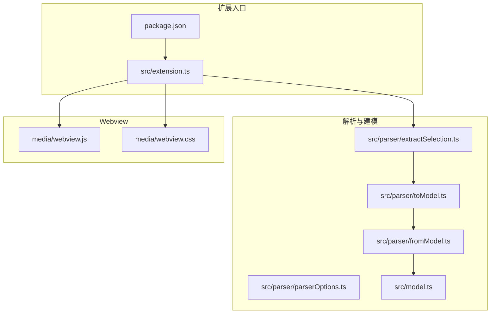
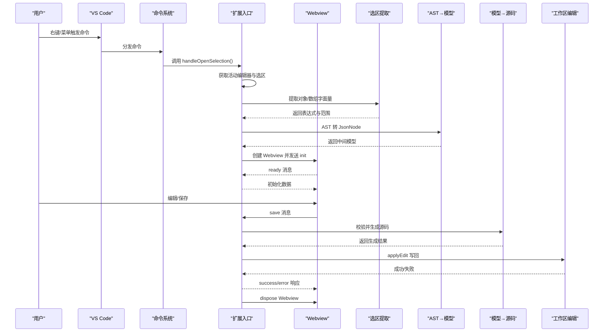
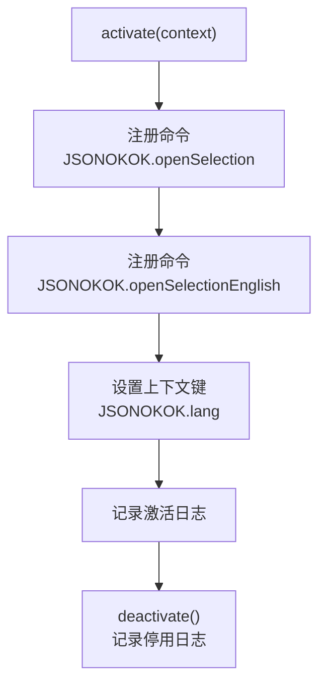
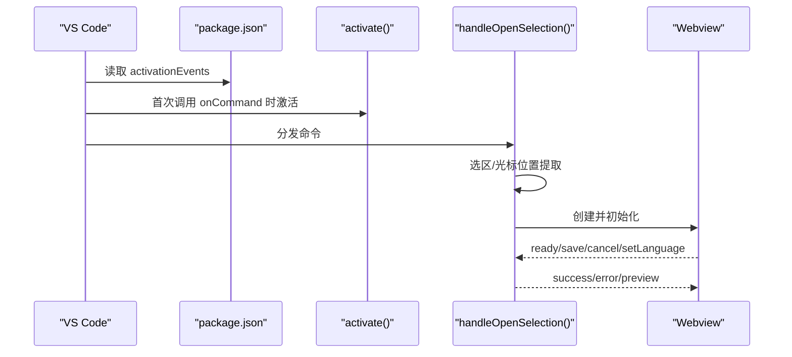
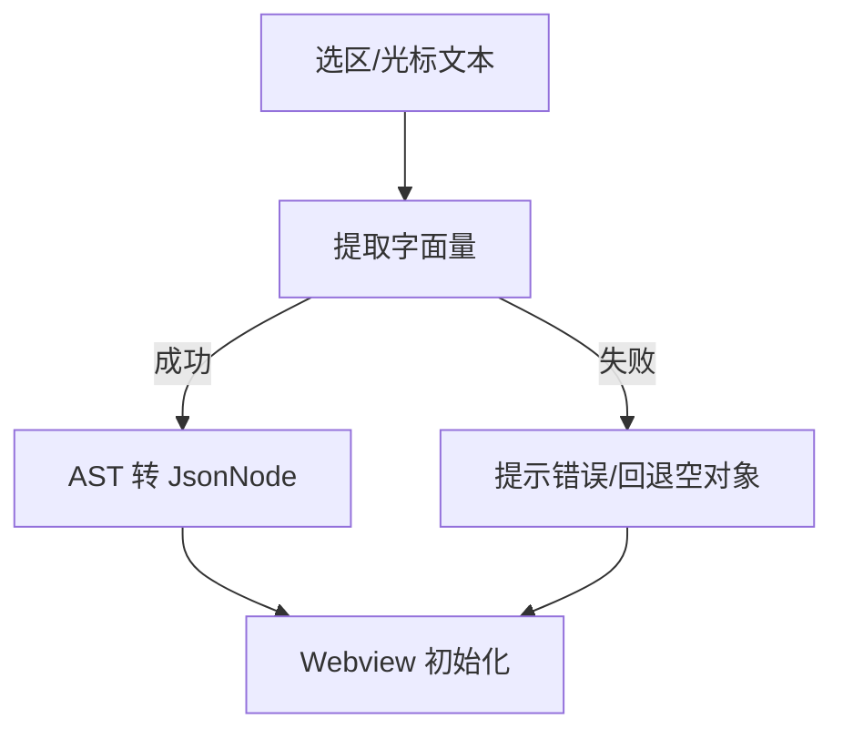
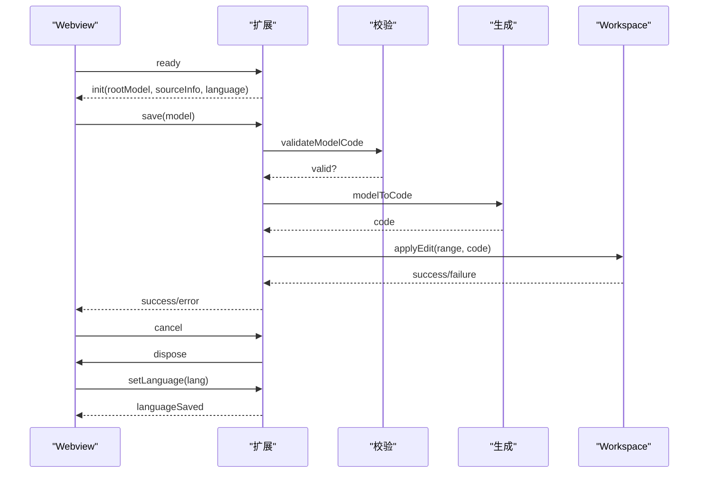
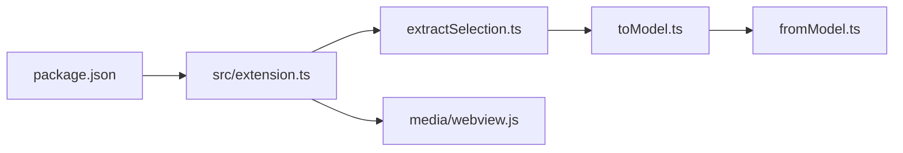

# 扩展生命周期钩子

<cite>
**本文引用的文件**
- [src/extension.ts](file://src/extension.ts)
- [package.json](file://package.json)
- [src/parser/extractSelection.ts](file://src/parser/extractSelection.ts)
- [src/parser/toModel.ts](file://src/parser/toModel.ts)
- [src/parser/fromModel.ts](file://src/parser/fromModel.ts)
- [src/parser/parserOptions.ts](file://src/parser/parserOptions.ts)
- [src/model.ts](file://src/model.ts)
- [media/webview.js](file://media/webview.js)
- [media/webview.css](file://media/webview.css)
- [测试计划.md](file://测试计划.md)
- [todo.md](file://todo.md)
</cite>

## 目录
1. [简介](#简介)
2. [项目结构](#项目结构)
3. [核心组件](#核心组件)
4. [架构总览](#架构总览)
5. [详细组件分析](#详细组件分析)
6. [依赖关系分析](#依赖关系分析)
7. [性能考量](#性能考量)
8. [故障排查指南](#故障排查指南)
9. [结论](#结论)
10. [附录](#附录)

## 简介
本文件系统性梳理 JSONOKOK VS Code 扩展的生命周期钩子与命令注册机制，覆盖扩展激活与停用流程、命令注册与调用、onCommand 事件监听、VS Code API 集成点、扩展点与贡献点、状态管理与资源清理、错误处理与异常恢复、开发模板与最佳实践，以及性能监控与调试建议。目标是帮助开发者快速理解并高效维护该扩展。

## 项目结构
- 入口与主逻辑：src/extension.ts
- 扩展元信息与贡献点：package.json
- 解析与建模：src/parser/*（选区提取、AST→模型、模型→源码）
- 数据模型：src/model.ts
- Webview 资源：media/webview.js、media/webview.css
- 测试与规划：测试计划.md、todo.md

图表来源
- [src/extension.ts:1-600](file://src/extension.ts#L1-L600)
- [package.json:1-93](file://package.json#L1-L93)
- [src/parser/extractSelection.ts:1-385](file://src/parser/extractSelection.ts#L1-L385)
- [src/parser/toModel.ts:1-230](file://src/parser/toModel.ts#L1-L230)
- [src/parser/fromModel.ts:1-305](file://src/parser/fromModel.ts#L1-L305)
- [src/parser/parserOptions.ts:1-36](file://src/parser/parserOptions.ts#L1-L36)
- [src/model.ts:1-103](file://src/model.ts#L1-L103)
- [media/webview.js:1-800](file://media/webview.js#L1-L800)
- [media/webview.css:1-800](file://media/webview.css#L1-L800)

章节来源
- [src/extension.ts:1-600](file://src/extension.ts#L1-L600)
- [package.json:1-93](file://package.json#L1-L93)

## 核心组件
- 生命周期钩子
  - activate(context): 注册命令、设置上下文键、创建 Webview、初始化语言偏好
  - deactivate(): 日志输出（当前无资源清理）
- 命令注册与调用
  - JSONOKOK.openSelection：默认本地化菜单命令
  - JSONOKOK.openSelectionEnglish：英文菜单命令（受上下文键控制）
- Webview 通信
  - onDidReceiveMessage：接收来自 Webview 的消息（ready/save/cancel/setLanguage 等）
  - postMessage：向 Webview 发送初始化数据与响应
- 解析与建模
  - 选区提取：从选中文本或光标位置提取对象/数组字面量
  - AST→模型：将 Babel AST 转换为中间 JsonNode 模型
  - 模型→源码：校验并生成 JavaScript 源码，支持缩进与格式化
- VS Code API 集成
  - commands.registerCommand：注册命令
  - commands.executeCommand：设置上下文键
  - window.activeTextEditor/window.createWebviewPanel：获取活动编辑器与创建 Webview
  - workspace.applyEdit：应用 WorkspaceEdit 写回源文件
  - globalState：持久化用户语言偏好

章节来源
- [src/extension.ts:19-44](file://src/extension.ts#L19-L44)
- [src/extension.ts:22-38](file://src/extension.ts#L22-L38)
- [src/extension.ts:349-377](file://src/extension.ts#L349-L377)
- [src/extension.ts:397-490](file://src/extension.ts#L397-L490)
- [src/parser/extractSelection.ts:34-101](file://src/parser/extractSelection.ts#L34-L101)
- [src/parser/toModel.ts:10-90](file://src/parser/toModel.ts#L10-L90)
- [src/parser/fromModel.ts:20-57](file://src/parser/fromModel.ts#L20-L57)

## 架构总览
扩展采用“入口层 + 解析层 + 建模层 + Webview 展示层 + 源码回写层”的分层架构。入口层负责生命周期与命令注册；解析层负责从选区或光标位置提取 JSON/JS 字面量；建模层将 AST 转为中间模型；Webview 展示表格并交互；最终通过 WorkspaceEdit 回写源文件。

图表来源
- [src/extension.ts:46-378](file://src/extension.ts#L46-L378)
- [src/extension.ts:397-490](file://src/extension.ts#L397-L490)
- [src/parser/extractSelection.ts:108-229](file://src/parser/extractSelection.ts#L108-L229)
- [src/parser/toModel.ts:10-90](file://src/parser/toModel.ts#L10-L90)
- [src/parser/fromModel.ts:20-57](file://src/parser/fromModel.ts#L20-L57)

## 详细组件分析

### 生命周期钩子与命令注册
- activate(context)
  - 注册两条命令：JSONOKOK.openSelection 与 JSONOKOK.openSelectionEnglish
  - 将命令实例加入 context.subscriptions，确保卸载时自动释放
  - 设置扩展上下文键 JSONOKOK.lang，用于控制菜单显示语言
  - 记录激活日志
- deactivate()
  - 输出停用日志（当前无显式资源清理）

图表来源
- [src/extension.ts:19-44](file://src/extension.ts#L19-L44)

章节来源
- [src/extension.ts:19-44](file://src/extension.ts#L19-L44)
- [package.json:23-26](file://package.json#L23-L26)

### onCommand 事件监听与命令调用流程
- package.json 中 activationEvents 仅包含 onCommand:*，因此扩展在首次调用命令时才被激活
- 用户右键或通过命令面板触发命令时，VS Code 分发到扩展入口
- handleOpenSelection() 是两条命令共享的处理函数，负责：
  - 获取活动编辑器与选区
  - 选区存在：提取字面量、转换为模型、准备 SourceInfo
  - 选区为空：基于光标位置检测 Markdown 代码块或全文件结构，提取字面量
  - 创建 Webview 并发送初始化数据
  - 监听 Webview 消息，处理保存、取消、语言切换等

图表来源
- [package.json:23-26](file://package.json#L23-L26)
- [src/extension.ts:19-44](file://src/extension.ts#L19-L44)
- [src/extension.ts:46-378](file://src/extension.ts#L46-L378)

章节来源
- [package.json:23-26](file://package.json#L23-L26)
- [src/extension.ts:46-378](file://src/extension.ts#L46-L378)

### VS Code API 集成点
- commands.registerCommand / commands.executeCommand
  - 注册两条命令，并在运行时设置上下文键 JSONOKOK.lang 控制菜单显示
- window.activeTextEditor / window.createWebviewPanel
  - 获取当前编辑器与创建 Webview 面板
- window.onDidReceiveMessage
  - 监听 Webview 发来的消息，区分 ready/init/save/cancel/setLanguage 等类型
- workspace.applyEdit
  - 使用 WorkspaceEdit 精确替换源文件指定范围内的文本
- globalState.update / globalState.get
  - 持久化用户语言偏好，影响 Webview 初始语言与菜单显示

章节来源
- [src/extension.ts:22-38](file://src/extension.ts#L22-L38)
- [src/extension.ts:322-326](file://src/extension.ts#L322-L326)
- [src/extension.ts:349-377](file://src/extension.ts#L349-L377)
- [src/extension.ts:420-486](file://src/extension.ts#L420-L486)
- [src/extension.ts:404-418](file://src/extension.ts#L404-L418)

### 扩展点与贡献点
- activationEvents
  - onCommand:JSONOKOK.openSelection
  - onCommand:JSONOKOK.openSelectionEnglish
- commands
  - JSONOKOK.openSelection：本地化标题
  - JSONOKOK.openSelectionEnglish：英文标题
- menus.editor/context
  - editor/context 菜单项根据上下文键 JSONOKOK.lang 显示中文或英文
- configuration
  - JSONOKOK.supportedLanguages：控制右键菜单显示的语言列表

章节来源
- [package.json:23-67](file://package.json#L23-L67)

### 选区提取与 AST 转模型
- 选区提取策略
  - 直接解析表达式（对象/数组字面量）
  - 从变量声明中提取初始化值
  - 多候选时提示用户精确选择
  - Markdown 代码块内优先提取内部代码
- AST→模型
  - 对象/数组/字符串/数字/布尔/null 直接映射
  - 其他 JS 表达式保留为 codeText 节点，标记为不可直接编辑（writeMode=code）
  - 支持对象方法与扩展运算符的特殊处理
- 模型→源码
  - 校验 codeText 节点是否为合法 JS 表达式
  - 生成格式化源码，支持缩进与换行

图表来源
- [src/parser/extractSelection.ts:34-101](file://src/parser/extractSelection.ts#L34-L101)
- [src/parser/extractSelection.ts:108-229](file://src/parser/extractSelection.ts#L108-L229)
- [src/parser/toModel.ts:10-90](file://src/parser/toModel.ts#L10-L90)
- [src/parser/fromModel.ts:20-57](file://src/parser/fromModel.ts#L20-L57)

章节来源
- [src/parser/extractSelection.ts:34-101](file://src/parser/extractSelection.ts#L34-L101)
- [src/parser/extractSelection.ts:108-229](file://src/parser/extractSelection.ts#L108-L229)
- [src/parser/toModel.ts:10-90](file://src/parser/toModel.ts#L10-L90)
- [src/parser/fromModel.ts:20-57](file://src/parser/fromModel.ts#L20-L57)

### Webview 通信与消息处理
- 初始化
  - Webview 加载完成后发送 ready，扩展发送 init 消息（rootModel、sourceInfo、语言等）
- 保存流程
  - 校验文档版本一致性
  - 校验编辑后的模型合法性
  - 生成源码并应用 WorkspaceEdit
  - 成功后短延迟关闭 Webview
- 取消与语言切换
  - cancel：直接关闭
  - setLanguage：更新全局语言偏好与上下文键，刷新 Webview 语言

图表来源
- [src/extension.ts:349-377](file://src/extension.ts#L349-L377)
- [src/extension.ts:397-490](file://src/extension.ts#L397-L490)
- [src/parser/fromModel.ts:20-57](file://src/parser/fromModel.ts#L20-L57)

章节来源
- [src/extension.ts:349-377](file://src/extension.ts#L349-L377)
- [src/extension.ts:397-490](file://src/extension.ts#L397-L490)
- [src/parser/fromModel.ts:20-57](file://src/parser/fromModel.ts#L20-L57)

### 状态管理与资源清理
- 状态管理
  - 用户语言偏好：globalState.JSONOKOK.language
  - 上下文键：JSONOKOK.lang 控制菜单显示
  - Webview 生命周期：创建、消息处理、dispose
- 资源清理
  - activate 中注册的命令已加入 subscriptions，随扩展卸载自动释放
  - deactivate 当前无显式清理逻辑

章节来源
- [src/extension.ts:312-326](file://src/extension.ts#L312-L326)
- [src/extension.ts:322-326](file://src/extension.ts#L322-L326)
- [src/extension.ts:42-44](file://src/extension.ts#L42-L44)

### 错误处理与异常恢复
- 选区提取失败
  - 返回错误与提示，必要时给出修复建议
- AST 转模型异常
  - 捕获异常并提示转换失败
- 模型→源码校验失败
  - 返回错误消息，阻止写回
- 写回失败
  - 捕获异常并提示写回失败
- 版本冲突
  - 文档版本不一致时拒绝写回并提示重新打开

章节来源
- [src/extension.ts:111-119](file://src/extension.ts#L111-L119)
- [src/extension.ts:126-131](file://src/extension.ts#L126-L131)
- [src/extension.ts:433-440](file://src/extension.ts#L433-L440)
- [src/extension.ts:467-471](file://src/extension.ts#L467-L471)
- [src/extension.ts:424-430](file://src/extension.ts#L424-L430)

### 开发模板与最佳实践
- 命令注册
  - 使用 registerCommand 注册命令并加入 context.subscriptions
  - 通过 setContext 控制菜单显示（如 JSONOKOK.lang）
- Webview 通信
  - 使用 onDidReceiveMessage 统一处理消息类型
  - 初始化时发送 init，保存时发送 save，取消时发送 cancel
- 解析与建模
  - 选区提取采用多策略容错，优先精确匹配
  - AST→模型保留非 JSON 代码为 codeText，确保可逆性
  - 模型→源码前进行语法校验
- 写回策略
  - 使用 WorkspaceEdit 精确替换范围，避免覆盖其他内容
  - 写回前进行版本检查，防止并发冲突
- 资源管理
  - activate 中注册的命令无需手动 dispose
  - deactivate 中可补充资源清理（如定时器、监听器）

章节来源
- [src/extension.ts:22-38](file://src/extension.ts#L22-L38)
- [src/extension.ts:349-377](file://src/extension.ts#L349-L377)
- [src/extension.ts:420-486](file://src/extension.ts#L420-L486)
- [src/parser/extractSelection.ts:34-101](file://src/parser/extractSelection.ts#L34-L101)
- [src/parser/toModel.ts:10-90](file://src/parser/toModel.ts#L10-L90)
- [src/parser/fromModel.ts:20-57](file://src/parser/fromModel.ts#L20-L57)

## 依赖关系分析
- 扩展入口依赖解析与建模模块
- Webview 依赖扩展入口的消息通道
- package.json 决定激活时机与菜单贡献

图表来源
- [package.json:1-93](file://package.json#L1-L93)
- [src/extension.ts:1-600](file://src/extension.ts#L1-L600)
- [src/parser/extractSelection.ts:1-385](file://src/parser/extractSelection.ts#L1-L385)
- [src/parser/toModel.ts:1-230](file://src/parser/toModel.ts#L1-L230)
- [src/parser/fromModel.ts:1-305](file://src/parser/fromModel.ts#L1-L305)
- [media/webview.js:1-800](file://media/webview.js#L1-L800)

章节来源
- [package.json:1-93](file://package.json#L1-L93)
- [src/extension.ts:1-600](file://src/extension.ts#L1-L600)

## 性能考量
- 选区提取的容错策略与回退算法（如基于括号扫描）需限制扫描窗口，避免对超大文件造成性能问题
- AST 解析与模型转换在大型对象/数组上可能耗时，建议：
  - 限制最大扫描窗口（已实现）
  - 对超大 JSON 采用懒加载策略（见 todo.md 的逐层加载思路）
- Webview 渲染与缩放可通过 CSS zoom 控制，减少频繁重排
- 保存前的源码生成与 WorkspaceEdit 应尽量减少不必要的大范围替换

章节来源
- [src/parser/extractSelection.ts:242-243](file://src/parser/extractSelection.ts#L242-L243)
- [media/webview.js:630-637](file://media/webview.js#L630-L637)
- [todo.md:3-6](file://todo.md#L3-L6)

## 故障排查指南
- 扩展未激活
  - 检查 activationEvents 是否包含 onCommand:*，确认命令 ID 是否正确
- 右键菜单不出现
  - 检查 supportedLanguages 配置与当前文件语言
  - 检查上下文键 JSONOKOK.lang 是否正确设置
- 无法提取选区
  - 确认选区包含唯一对象/数组字面量
  - Markdown 代码块内需确保在围栏内部
- 写回失败
  - 检查文档版本是否变化（并发修改）
  - 检查模型中 codeText 节点是否为合法表达式
- Webview 无法初始化
  - 检查 CSP 与资源路径（CSS/JS）
  - 确认 ready 消息是否到达

章节来源
- [package.json:23-67](file://package.json#L23-L67)
- [src/extension.ts:312-326](file://src/extension.ts#L312-L326)
- [src/extension.ts:420-486](file://src/extension.ts#L420-L486)
- [src/parser/extractSelection.ts:34-101](file://src/parser/extractSelection.ts#L34-L101)
- [media/webview.js:275-277](file://media/webview.js#L275-L277)

## 结论
JSONOKOK 扩展通过清晰的生命周期钩子与命令注册机制，结合稳健的选区提取、AST→模型与模型→源码生成流程，实现了在 VS Code 中对 JS/TS/Markdown/纯文本等文件中 JSON/JS 字面量的可视化编辑与安全回写。其设计强调可逆性与安全性（版本检查、语法校验、codeText 节点保留），并通过上下文键与菜单贡献点实现灵活的本地化体验。未来可在超大 JSON 的懒加载、撤销/重做持久化、代码节点增强等方面持续优化。

## 附录
- 开发与测试
  - 参考测试计划.md 的本地集成测试步骤
- 待办事项
  - 超大 JSON 的逐层加载与未加载节点提示（todo.md）

章节来源
- [测试计划.md:39-100](file://测试计划.md#L39-L100)
- [todo.md:1-11](file://todo.md#L1-L11)