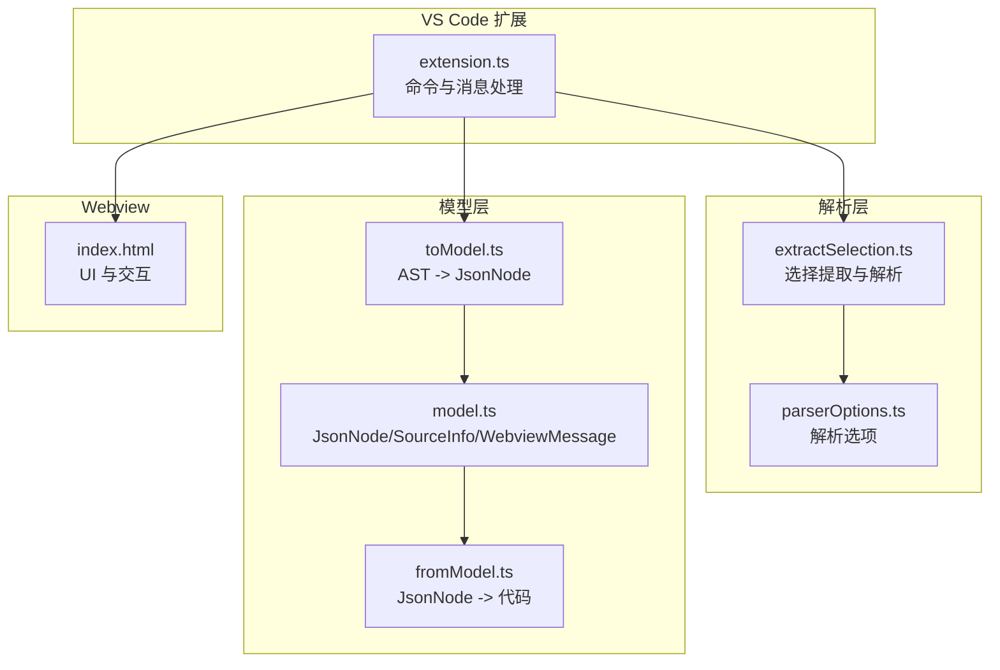
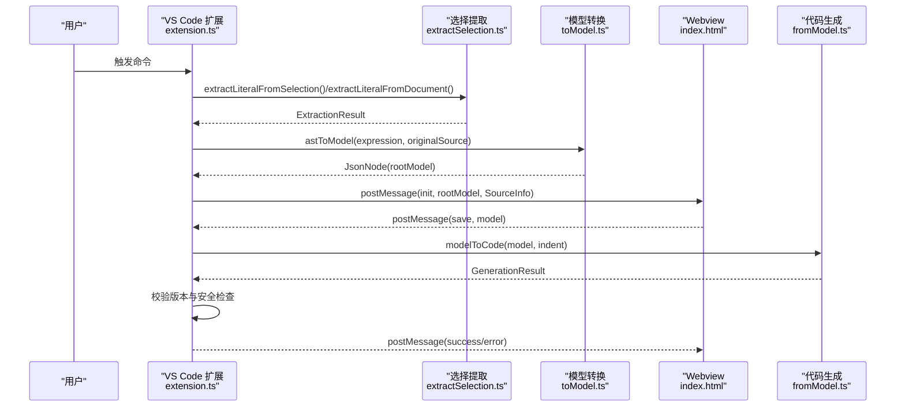
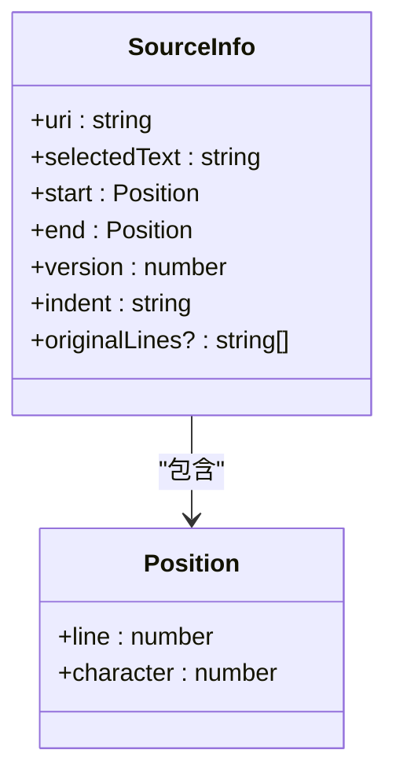
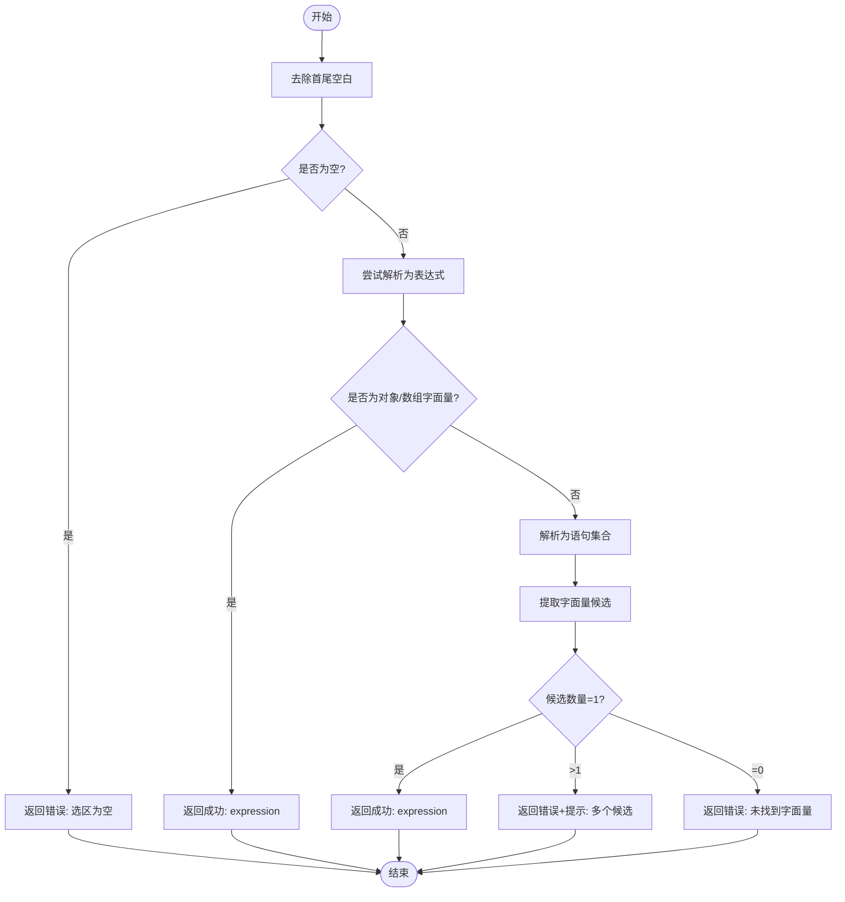
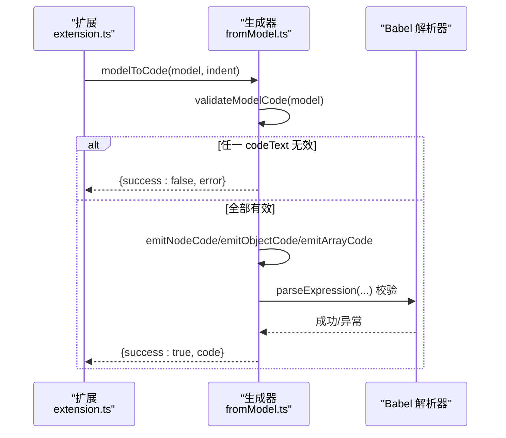
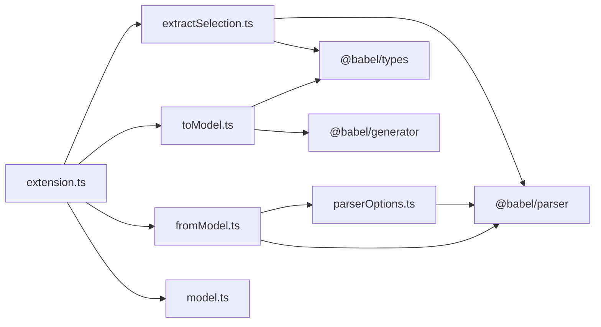

# 核心 API 接口

<cite>
**本文引用的文件**
- [model.ts](file://src/model.ts)
- [fromModel.ts](file://src/parser/fromModel.ts)
- [toModel.ts](file://src/parser/toModel.ts)
- [extractSelection.ts](file://src/parser/extractSelection.ts)
- [parserOptions.ts](file://src/parser/parserOptions.ts)
- [extension.ts](file://src/extension.ts)
- [package.json](file://package.json)
- [index.html](file://index.html)
- [README.md](file://README.md)
</cite>

## 目录
1. [简介](#简介)
2. [项目结构](#项目结构)
3. [核心组件](#核心组件)
4. [架构总览](#架构总览)
5. [详细组件分析](#详细组件分析)
6. [依赖关系分析](#依赖关系分析)
7. [性能考量](#性能考量)
8. [故障排除指南](#故障排除指南)
9. [结论](#结论)
10. [附录](#附录)

## 简介
本文件面向 JSONOKOK 的核心 API 接口，系统性梳理 JsonNode 类型系统、SourceInfo 元数据结构、ExtractionResult 统一接口设计与实现、参数验证规则、默认值与边界条件处理，并提供数据结构图与类型定义说明。文档还包含实际使用场景与示例路径指引，以及向后兼容性与版本演进策略的说明，帮助开发者快速理解并正确使用该核心接口体系。

## 项目结构
本项目采用分层模块化组织：
- 扩展入口与消息协议：VS Code 扩展入口负责从编辑器提取选区、构建中间模型、与 Webview 通信。
- 中间模型与序列化：JsonNode 类型系统作为中间表示，支持 JSON 原子类型与代码文本节点；代码生成器负责将中间模型回写到源码。
- 选择提取与解析：基于 Babel 的选择提取模块，提供从选区或光标位置提取对象/数组字面量的能力，并返回统一的 ExtractionResult。
- 解析选项：集中管理 Babel 解析器插件与通用解析选项，确保跨语言与复杂表达式的兼容性。



**图表来源**
- [extension.ts:19-378](file://src/extension.ts#L19-L378)
- [extractSelection.ts:13-101](file://src/parser/extractSelection.ts#L13-L101)
- [parserOptions.ts:20-35](file://src/parser/parserOptions.ts#L20-L35)
- [toModel.ts:10-90](file://src/parser/toModel.ts#L10-L90)
- [fromModel.ts:20-57](file://src/parser/fromModel.ts#L20-L57)
- [model.ts:6-103](file://src/model.ts#L6-L103)
- [index.html:1-800](file://index.html#L1-L800)

**章节来源**
- [extension.ts:19-378](file://src/extension.ts#L19-L378)
- [extractSelection.ts:13-101](file://src/parser/extractSelection.ts#L13-L101)
- [parserOptions.ts:20-35](file://src/parser/parserOptions.ts#L20-L35)
- [toModel.ts:10-90](file://src/parser/toModel.ts#L10-L90)
- [fromModel.ts:20-57](file://src/parser/fromModel.ts#L20-L57)
- [model.ts:6-103](file://src/model.ts#L6-L103)
- [index.html:1-800](file://index.html#L1-L800)

## 核心组件
本节聚焦于核心 API 的类型定义与职责边界，包括 JsonNode 类型系统、SourceInfo 元数据、Webview 消息协议与 ExtractionResult 统一接口。

- JsonNode 类型系统
  - 节点种类：object、array、string、number、boolean、null、codeText。
  - 结构字段：kind、value、raw、originalRaw、sourceKind、editable、writeMode、warning、children、items。
  - 使用场景：
    - JSON 原子类型：用于表格渲染与编辑，支持直接 JSON 写回。
    - codeText：用于保留非 JSON 的 JavaScript 表达式，如函数、标识符、模板字面量等，支持代码模式写回与语法校验。
  - 默认值与边界条件：
    - value 缺省时按 kind 推断默认值（如 number 缺省为 0，string 为空字符串）。
    - children/items 缺省时为空映射/数组。
    - raw/originalRaw 缺省时由生成器回填。
    - sourceKind 缺省时按 JSON 或代码推断。
    - warning 仅在 codeText 等特殊节点上出现，提示用户语法有效性风险。

- SourceInfo 元数据
  - 字段：uri、selectedText、start、end、version、indent、originalLines。
  - 用途：定位写回范围、版本校验、缩进对齐与安全检查。
  - 边界条件：
    - 版本不一致时拒绝写回。
    - 选区为空或无法识别时返回错误。
    - originalLines 用于写回前的安全检查，避免覆盖非目标区域。

- Webview 消息协议
  - InitMessage：初始化消息，携带 rootModel 与 SourceInfo。
  - SaveMessage：保存消息，携带编辑后的 JsonNode。
  - PreviewMessage：预览消息，请求生成代码预览。
  - CancelMessage：取消消息。
  - ExtensionResponse：扩展响应，包含 success/error/preview 三态与可选生成代码。

- ExtractionResult 统一接口
  - 字段：success、expression、error、hint、start、end。
  - 设计理念：提供“成功/失败”二元结果与可选的表达式与偏移，便于上层进行二次处理（如 AST -> JsonNode 转换、写回范围计算）。
  - 实现方式：优先尝试直接解析表达式，其次解析语句并提取字面量，最后在失败时提供用户提示与回退策略。

**章节来源**
- [model.ts:6-103](file://src/model.ts#L6-L103)
- [extractSelection.ts:13-101](file://src/parser/extractSelection.ts#L13-L101)
- [extension.ts:420-490](file://src/extension.ts#L420-L490)

## 架构总览
下图展示了从 VS Code 编辑器到 Webview 的端到端流程，包括选择提取、模型转换、验证与写回。



**图表来源**
- [extension.ts:46-378](file://src/extension.ts#L46-L378)
- [extractSelection.ts:34-101](file://src/parser/extractSelection.ts#L34-L101)
- [toModel.ts:10-90](file://src/parser/toModel.ts#L10-L90)
- [fromModel.ts:20-57](file://src/parser/fromModel.ts#L20-L57)
- [index.html:1-800](file://index.html#L1-L800)

## 详细组件分析

### JsonNode 类型系统
JsonNode 是 JSONOKOK 的中间数据模型，承载 JSON 原子类型与代码文本节点，支持表格 UI 的可视化与编辑。

```mermaid
classDiagram
class JsonNode {
+kind : JsonNodeKind
+value : any
+raw? : string
+originalRaw? : string
+sourceKind? : "json"|"code"|"objectMethod"|"spread"
+editable : boolean
+writeMode : "json"|"code"
+warning? : string
+children? : Record~string, JsonNode~
+items? : JsonNode[]
}
class JsonNodeKind {
<<enumeration>>
"object"
"array"
"string"
"number"
"boolean"
"null"
"codeText"
}
JsonNode --> JsonNodeKind : "使用"
```

- 使用场景与默认值
  - object/array：children/items 缺省为空映射/数组。
  - string/number/boolean/null：value 缺省时按类型推断默认值。
  - codeText：value/raw/originalRaw 缺省时由生成器回填；warning 提示语法有效性。
- 参数验证与边界条件
  - codeText 节点在保存前需通过语法校验，空内容或无效表达式将导致校验失败。
  - 对象属性键若为标识符则直接输出，否则使用 JSON 序列化包裹。
  - 扩展运算符（...）在对象/数组中不支持编辑，标记为不可编辑并给出警告。

**图表来源**
- [model.ts:6-34](file://src/model.ts#L6-L34)

**章节来源**
- [model.ts:6-34](file://src/model.ts#L6-L34)
- [toModel.ts:92-209](file://src/parser/toModel.ts#L92-L209)
- [fromModel.ts:67-117](file://src/parser/fromModel.ts#L67-L117)

### SourceInfo 元数据结构
SourceInfo 描述源文件与选区信息，用于安全写回与 UI 初始化。



- 关键属性
  - uri：文档 URI，用于 WorkspaceEdit。
  - selectedText/start/end/version：定位与版本校验。
  - indent/originalLines：缩进与原始行，保障写回格式与安全。
- 边界条件
  - 版本不一致时拒绝写回。
  - originalLines 用于写回前的安全检查，避免误覆盖。

**图表来源**
- [model.ts:39-54](file://src/model.ts#L39-L54)
- [extension.ts:133-147](file://src/extension.ts#L133-L147)

**章节来源**
- [model.ts:39-54](file://src/model.ts#L39-L54)
- [extension.ts:133-147](file://src/extension.ts#L133-L147)

### ExtractionResult 统一接口
ExtractionResult 为选择提取模块的统一返回结构，贯穿从选区到光标位置的两种提取策略。



**图表来源**
- [extractSelection.ts:34-101](file://src/parser/extractSelection.ts#L34-L101)

**章节来源**
- [extractSelection.ts:13-101](file://src/parser/extractSelection.ts#L13-L101)

### 代码生成与验证流程
代码生成器负责将 JsonNode 回写为 JavaScript 源码，同时执行语法校验与格式化。



**图表来源**
- [fromModel.ts:20-57](file://src/parser/fromModel.ts#L20-L57)
- [fromModel.ts:67-117](file://src/parser/fromModel.ts#L67-L117)
- [fromModel.ts:119-180](file://src/parser/fromModel.ts#L119-L180)

**章节来源**
- [fromModel.ts:20-57](file://src/parser/fromModel.ts#L20-L57)
- [fromModel.ts:67-117](file://src/parser/fromModel.ts#L67-L117)
- [fromModel.ts:119-180](file://src/parser/fromModel.ts#L119-L180)

### VS Code 扩展集成要点
- 命令注册与消息处理：注册命令、接收 Webview 初始化与保存消息、执行写回与版本校验。
- 选择提取策略：优先选区，其次光标位置；Markdown 筑巢代码块内提取。
- 写回安全：基于 SourceInfo 的 start/end 范围替换，版本不一致时拒绝写回。

**章节来源**
- [extension.ts:19-40](file://src/extension.ts#L19-L40)
- [extension.ts:46-378](file://src/extension.ts#L46-L378)
- [extension.ts:420-490](file://src/extension.ts#L420-L490)

## 依赖关系分析
- 扩展依赖
  - @babel/parser、@babel/types、@babel/generator：用于解析与生成 JavaScript/JSON。
  - monaco-editor：Webview 中的编辑器依赖（在 index.html 中使用）。
- 模块耦合
  - extension.ts 依赖 extractSelection.ts、toModel.ts、fromModel.ts、model.ts。
  - fromModel.ts 依赖 parserOptions.ts 与 Babel。
  - toModel.ts 依赖 @babel/types 与 @babel/generator。
  - extractSelection.ts 依赖 @babel/parser、@babel/types、parserOptions.ts。



**图表来源**
- [extension.ts:8-15](file://src/extension.ts#L8-L15)
- [fromModel.ts:6-8](file://src/parser/fromModel.ts#L6-L8)
- [toModel.ts:6-8](file://src/parser/toModel.ts#L6-L8)
- [extractSelection.ts:6-11](file://src/parser/extractSelection.ts#L6-L11)
- [parserOptions.ts:1-36](file://src/parser/parserOptions.ts#L1-L36)

**章节来源**
- [extension.ts:8-15](file://src/extension.ts#L8-L15)
- [fromModel.ts:6-8](file://src/parser/fromModel.ts#L6-L8)
- [toModel.ts:6-8](file://src/parser/toModel.ts#L6-L8)
- [extractSelection.ts:6-11](file://src/parser/extractSelection.ts#L6-L11)
- [parserOptions.ts:1-36](file://src/parser/parserOptions.ts#L1-L36)

## 性能考量
- 选择提取回退策略：当全文件解析失败时，采用基于括号匹配的轻量扫描，限制扫描窗口以避免性能劣化。
- 代码生成：仅在必要时应用缩进，避免不必要的字符串拼接与分割。
- AST 遍历：对象/数组节点的遍历为线性复杂度，注意避免重复解析与重复生成。

**章节来源**
- [extractSelection.ts:237-343](file://src/parser/extractSelection.ts#L237-L343)
- [fromModel.ts:35-50](file://src/parser/fromModel.ts#L35-L50)

## 故障排除指南
- 选区为空或无法识别
  - 现象：返回错误与提示，建议精确选择。
  - 处理：检查选区是否包含对象/数组字面量或变量初始化。
- 多个候选对象/数组字面量
  - 现象：返回多个候选并提示用户重新选择。
  - 处理：缩小选区范围，确保仅包含一个字面量。
- 文档版本不一致
  - 现象：写回被拒绝，提示重新打开编辑器。
  - 处理：等待用户重新打开，或在扩展中刷新 SourceInfo。
- codeText 节点语法无效
  - 现象：保存时报错，提示无效的 JavaScript 代码。
  - 处理：修正代码文本或降级为 JSON 原子类型。

**章节来源**
- [extractSelection.ts:74-95](file://src/parser/extractSelection.ts#L74-L95)
- [extension.ts:424-430](file://src/extension.ts#L424-L430)
- [fromModel.ts:92-117](file://src/parser/fromModel.ts#L92-L117)

## 结论
JSONOKOK 的核心 API 以 JsonNode 为中心，结合 SourceInfo 与 ExtractionResult，实现了从编辑器选区到表格 UI 的完整链路。通过严格的参数验证、默认值与边界条件处理，以及稳健的选择提取与代码生成机制，系统在保持易用性的同时兼顾了安全性与可维护性。未来版本演进应优先保证向后兼容与解析能力的持续增强。

## 附录

### 数据结构与类型定义速查
- JsonNodeKind：object、array、string、number、boolean、null、codeText
- JsonNode：包含 kind、value、raw、originalRaw、sourceKind、editable、writeMode、warning、children、items
- SourceInfo：包含 uri、selectedText、start、end、version、indent、originalLines
- WebviewMessage：InitMessage、SaveMessage、PreviewMessage、CancelMessage
- ExtensionResponse：success、error、preview 三态与可选生成代码
- ExtractionResult：success、expression、error、hint、start、end

**章节来源**
- [model.ts:6-103](file://src/model.ts#L6-L103)
- [extractSelection.ts:13-22](file://src/parser/extractSelection.ts#L13-L22)

### 实际使用示例（示例路径）
- 从选区提取对象/数组字面量
  - 示例路径：[extractLiteralFromSelection:34-101](file://src/parser/extractSelection.ts#L34-L101)
- 从光标位置提取最深包围的字面量
  - 示例路径：[extractLiteralFromDocument:108-229](file://src/parser/extractSelection.ts#L108-L229)
- 将 AST 转换为 JsonNode
  - 示例路径：[astToModel:10-90](file://src/parser/toModel.ts#L10-L90)
- 将 JsonNode 生成代码
  - 示例路径：[modelToCode:20-57](file://src/parser/fromModel.ts#L20-L57)
- VS Code 扩展写回流程
  - 示例路径：[handleWebviewMessage/save:420-490](file://src/extension.ts#L420-L490)

**章节来源**
- [extractSelection.ts:34-101](file://src/parser/extractSelection.ts#L34-L101)
- [extractSelection.ts:108-229](file://src/parser/extractSelection.ts#L108-L229)
- [toModel.ts:10-90](file://src/parser/toModel.ts#L10-L90)
- [fromModel.ts:20-57](file://src/parser/fromModel.ts#L20-L57)
- [extension.ts:420-490](file://src/extension.ts#L420-L490)

### 向后兼容性与版本演进策略
- 版本号与激活事件
  - 当前版本：0.1.0
  - 激活事件：onCommand 注册
- 演进策略建议
  - 保持 JsonNode 字段向后兼容，新增字段以可选形式存在。
  - SourceInfo 保持核心字段稳定，新增元信息以可选字段扩展。
  - ExtractionResult 保持 success/error/hint 语义不变，新增 start/end 用于更精确的范围定位。
  - 代码生成器在新增节点类型时，提供默认回退策略与警告提示，避免破坏现有行为。

**章节来源**
- [package.json:5-26](file://package.json#L5-L26)
- [README.md:1-80](file://README.md#L1-L80)