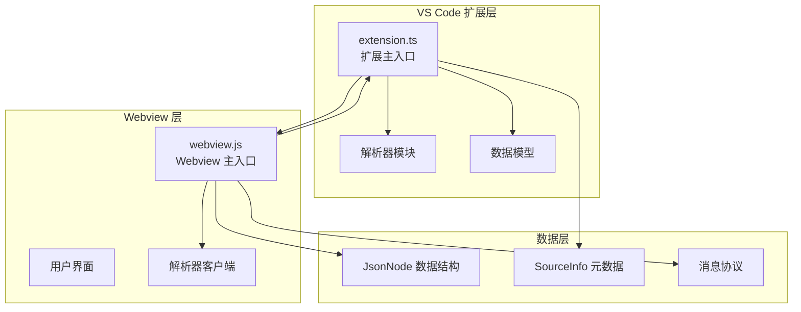
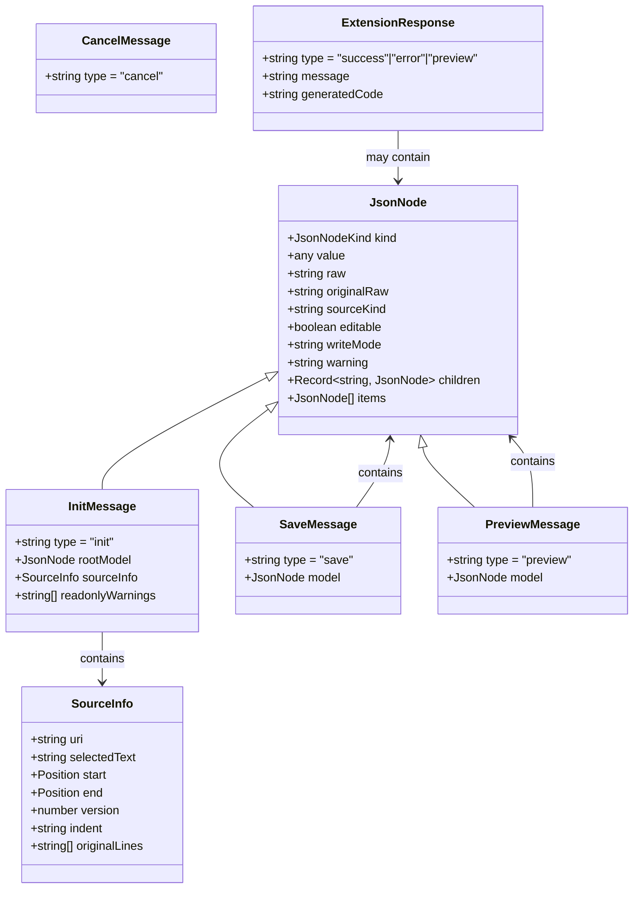
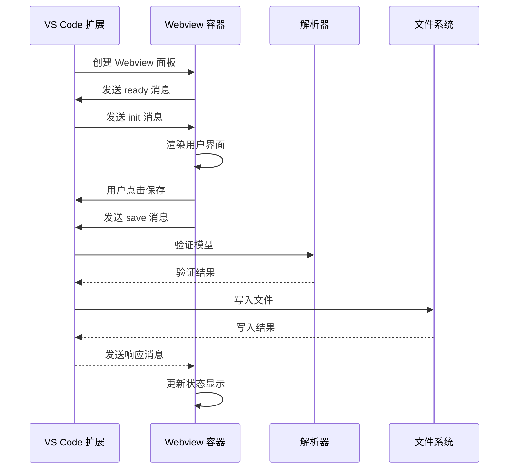
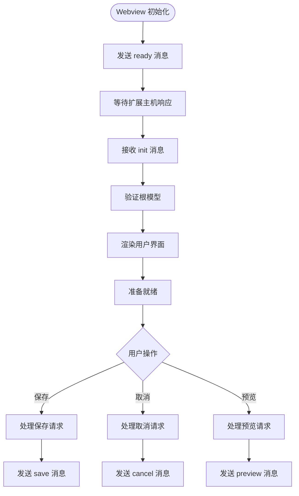
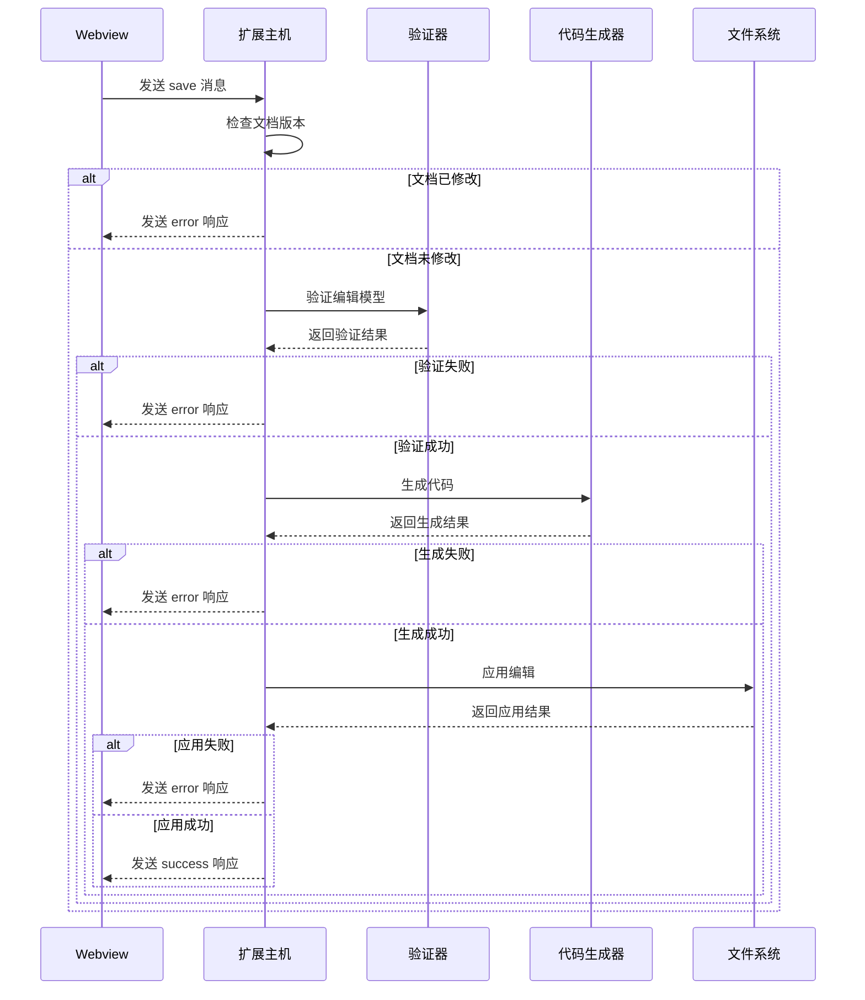
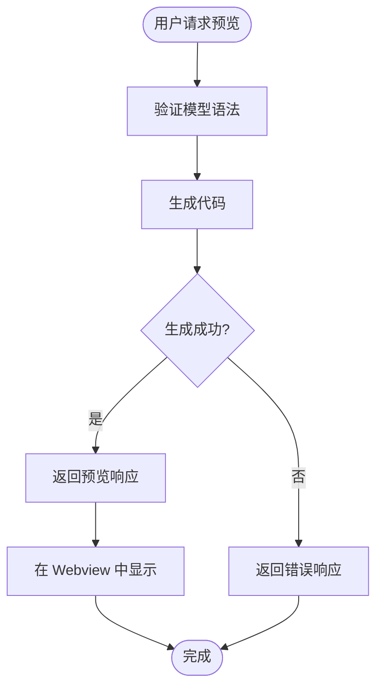
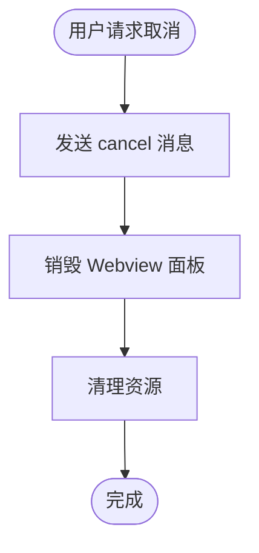
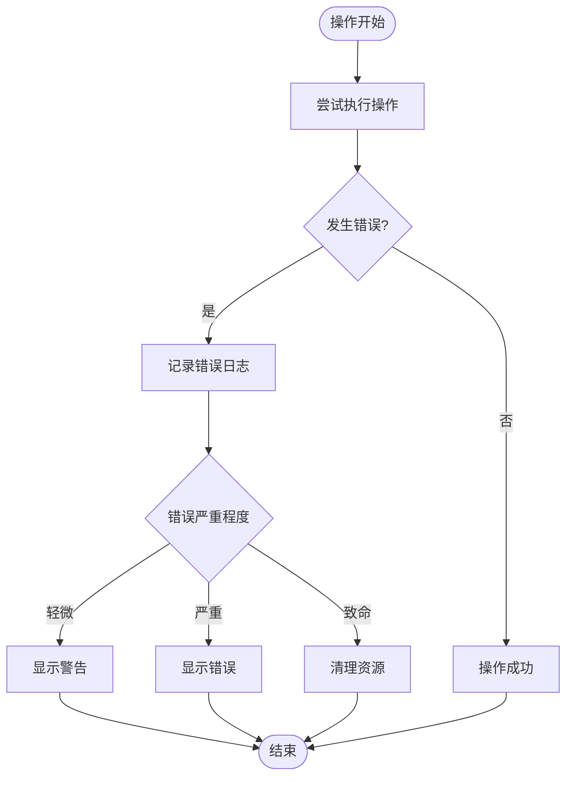

# 消息通信协议

<cite>
**本文档引用的文件**
- [extension.ts](file://src/extension.ts)
- [model.ts](file://src/model.ts)
- [webview.js](file://media/webview.js)
- [fromModel.ts](file://src/parser/fromModel.ts)
- [package.json](file://package.json)
</cite>

## 目录
1. [简介](#简介)
2. [项目结构](#项目结构)
3. [核心组件](#核心组件)
4. [架构概览](#架构概览)
5. [详细组件分析](#详细组件分析)
6. [依赖关系分析](#依赖关系分析)
7. [性能考虑](#性能考虑)
8. [故障排除指南](#故障排除指南)
9. [结论](#结论)

## 简介

JSONOKOK 是一个 VS Code 扩展，提供了嵌套 JSON 数据的可视化编辑功能。该扩展通过 Webview 与扩展主机之间的消息通信协议实现了双向数据交换，允许用户在表格界面中编辑复杂的 JSON 结构，并将其安全地写回到源文件中。

本协议定义了标准的消息格式和处理流程，确保数据在 Webview 和扩展主机之间的一致性和可靠性。

## 项目结构

JSONOKOK 项目采用模块化设计，主要包含以下关键组件：



**图表来源**
- [extension.ts:1-600](file://src/extension.ts#L1-L600)
- [webview.js:1-5209](file://media/webview.js#L1-L5209)

**章节来源**
- [extension.ts:1-600](file://src/extension.ts#L1-L600)
- [package.json:1-93](file://package.json#L1-L93)

## 核心组件

### 消息类型定义

系统定义了四种核心消息类型，每种都有特定的用途和数据结构：

| 消息类型 | 用途 | 发送方 | 必需字段 |
|---------|------|--------|----------|
| `init` | 初始化消息，发送根模型和源信息 | 扩展主机 → Webview | rootModel, sourceInfo |
| `save` | 保存消息，包含编辑后的模型 | Webview → 扩展主机 | model |
| `preview` | 预览消息，请求代码预览 | Webview → 扩展主机 | model |
| `cancel` | 取消消息，终止编辑会话 | Webview → 扩展主机 | 无 |

### 数据模型



**图表来源**
- [model.ts:15-103](file://src/model.ts#L15-L103)

**章节来源**
- [model.ts:15-103](file://src/model.ts#L15-L103)

## 架构概览

JSONOKOK 采用客户端-服务器架构，其中 VS Code 扩展作为服务器端，Webview 作为客户端：



**图表来源**
- [extension.ts:348-490](file://src/extension.ts#L348-L490)
- [webview.js:375-377](file://media/webview.js#L375-L377)

## 详细组件分析

### 初始化流程 (Init)

初始化流程是消息通信的核心起点，负责建立 Webview 与扩展主机之间的连接：



**图表来源**
- [extension.ts:348-377](file://src/extension.ts#L348-L377)
- [webview.js:4895-4928](file://media/webview.js#L4895-L4928)

#### InitMessage 结构详解

InitMessage 包含三个核心参数：

1. **rootModel**: 根 JsonNode 对象，表示要编辑的 JSON 数据的内部表示
2. **sourceInfo**: SourceInfo 对象，包含源文件的元数据信息
3. **readonlyWarnings**: 只读警告数组，用于标记潜在的问题

**章节来源**
- [model.ts:59-64](file://src/model.ts#L59-L64)

### 保存流程 (Save)

保存流程是最复杂的消息处理过程，涉及多个验证步骤：



**图表来源**
- [extension.ts:420-490](file://src/extension.ts#L420-L490)
- [fromModel.ts:20-57](file://src/parser/fromModel.ts#L20-L57)

#### SaveMessage 数据格式

SaveMessage 的数据格式相对简单，但验证规则非常严格：

**验证规则**:
1. **文档版本检查**: 确保源文档自提取以来未被修改
2. **语法验证**: 使用 Babel 解析器验证所有 codeText 节点
3. **代码生成**: 将模型转换为有效的 JavaScript/JSON 代码
4. **原子性写入**: 使用 WorkspaceEdit 确保写入操作的原子性

**章节来源**
- [model.ts:69-72](file://src/model.ts#L69-L72)
- [extension.ts:420-490](file://src/extension.ts#L420-L490)

### 预览流程 (Preview)

预览功能允许用户在实际保存之前查看代码生成结果：



**图表来源**
- [webview.js:5189-5201](file://media/webview.js#L5189-L5201)

**章节来源**
- [model.ts:77-80](file://src/model.ts#L77-L80)

### 取消流程 (Cancel)

取消流程相对简单，主要用于清理资源和关闭 Webview：



**图表来源**
- [webview.js:5199-5201](file://media/webview.js#L5199-L5201)

**章节来源**
- [model.ts:85-87](file://src/model.ts#L85-L87)

### 响应消息 (ExtensionResponse)

扩展主机向 Webview 发送的响应消息有三种状态：

| 状态类型 | 用途 | 数据字段 |
|---------|------|----------|
| `success` | 操作成功 | message, generatedCode |
| `error` | 操作失败 | message |
| `preview` | 预览结果 | message, generatedCode |

**章节来源**
- [model.ts:98-103](file://src/model.ts#L98-L103)

## 依赖关系分析

### 组件耦合度

```mermaid
graph LR
subgraph "核心依赖"
Model[model.ts] --> Extension[extension.ts]
Model --> WebView[webview.js]
Parser[fromModel.ts] --> Extension
end
subgraph "外部依赖"
Babel[@babel/parser] --> Parser
VSCode[VS Code API] --> Extension
VSCode --> WebView
end
subgraph "消息流"
Extension --> WebView
WebView --> Extension
Extension --> Parser
WebView --> Parser
end
```

**图表来源**
- [extension.ts:8-15](file://src/extension.ts#L8-L15)
- [fromModel.ts:6-8](file://src/parser/fromModel.ts#L6-L8)

### 错误处理机制

系统实现了多层次的错误处理机制：



**章节来源**
- [extension.ts:420-490](file://src/extension.ts#L420-L490)

## 性能考虑

### 消息序列化优化

1. **增量更新**: Webview 只在必要时发送消息，避免频繁的轮询
2. **批量处理**: 多个小操作可以合并为批量消息
3. **内存管理**: 及时清理不再使用的模型引用

### 数据传输优化

1. **二进制序列化**: 对大型数据集考虑使用更高效的序列化格式
2. **压缩传输**: 对于大量数据的传输可以考虑压缩
3. **缓存策略**: 实现适当的缓存机制减少重复计算

## 故障排除指南

### 常见问题及解决方案

| 问题类型 | 症状 | 可能原因 | 解决方案 |
|---------|------|----------|----------|
| 初始化失败 | Webview 无法加载数据 | 源文件格式不正确 | 检查源文件是否为有效的 JSON/JavaScript |
| 保存失败 | 提示文档已被修改 | 编辑器中进行了其他更改 | 重新打开编辑器或手动解决冲突 |
| 预览失败 | 代码生成错误 | 模型包含无效的 JavaScript | 检查 codeText 节点的语法 |
| 取消无效 | Webview 无法关闭 | 消息处理异常 | 重启 VS Code 或重新安装扩展 |

### 调试技巧

1. **启用详细日志**: 在开发模式下查看控制台输出
2. **检查消息格式**: 确保所有消息都符合预期的 JSON 结构
3. **验证数据完整性**: 确保模型树的完整性和一致性

**章节来源**
- [extension.ts:420-490](file://src/extension.ts#L420-L490)

## 结论

JSONOKOK 消息通信协议通过精心设计的接口和严格的验证机制，实现了 VS Code 扩展与 Webview 之间的高效、可靠通信。协议的设计充分考虑了以下关键要素：

1. **类型安全**: 所有消息都有明确的类型定义和验证规则
2. **错误处理**: 完善的错误检测和恢复机制
3. **性能优化**: 高效的消息传递和数据处理
4. **用户体验**: 平滑的交互流程和及时的状态反馈

该协议为类似的数据编辑器扩展提供了良好的参考模板，其设计理念和实现细节可以应用于其他需要复杂数据编辑功能的 VS Code 扩展开发中。