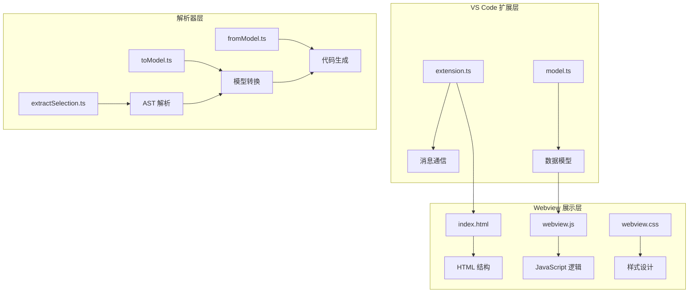
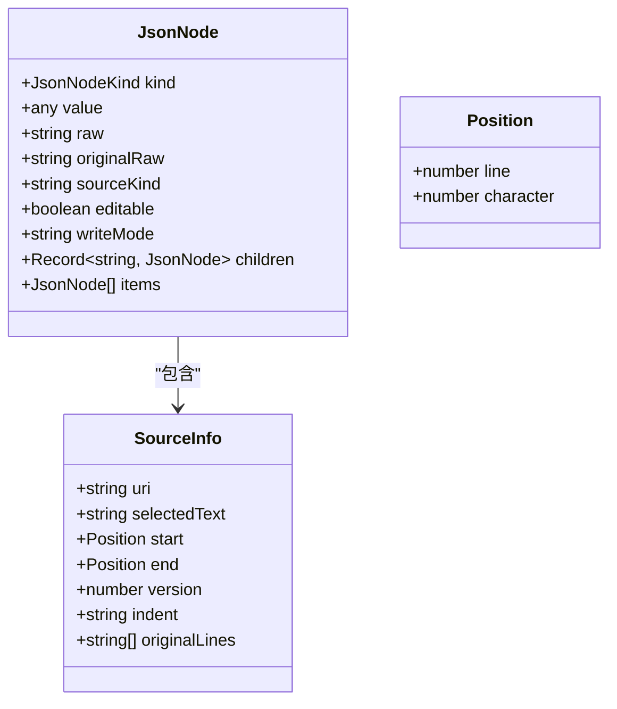
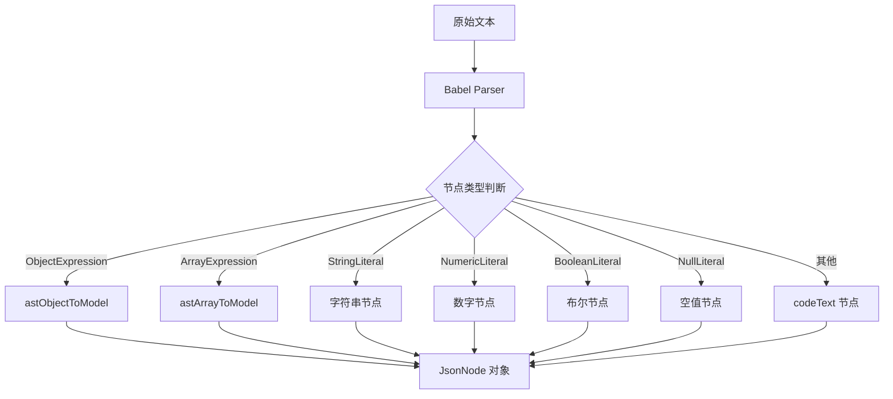
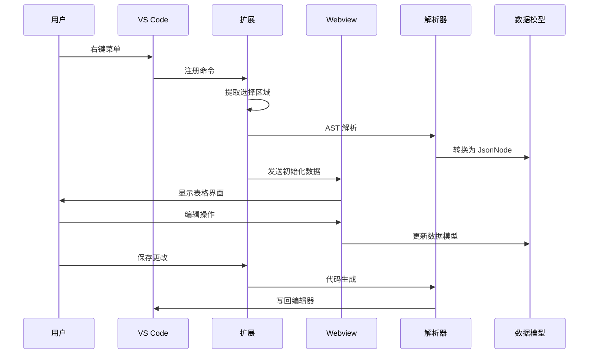
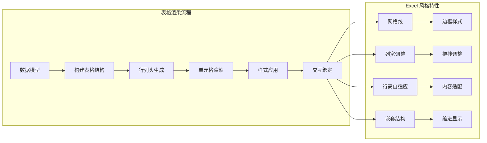
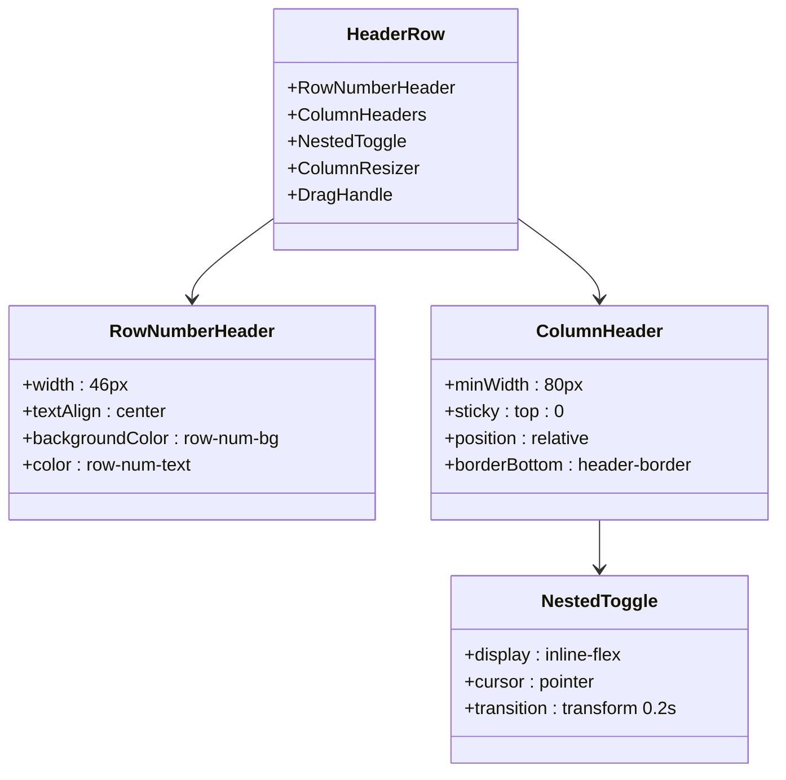
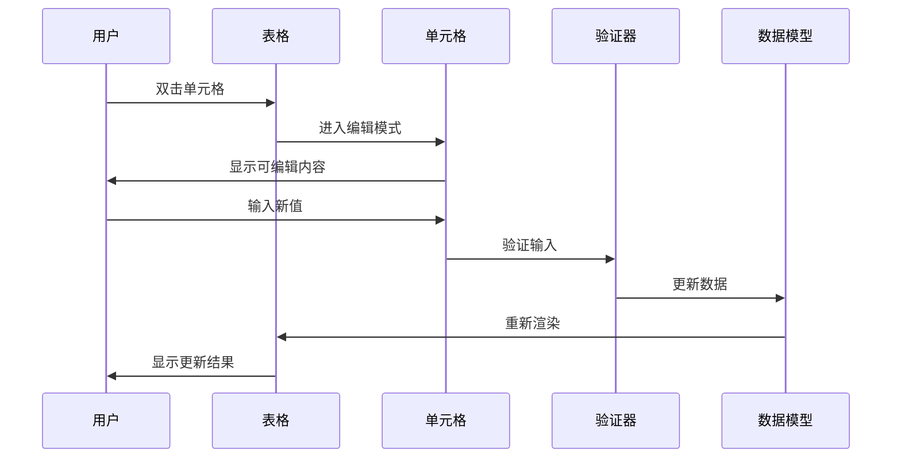
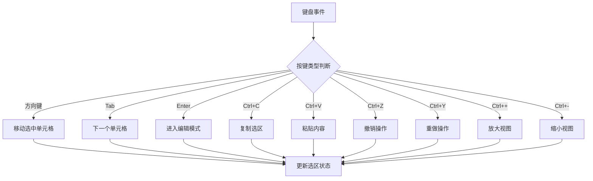
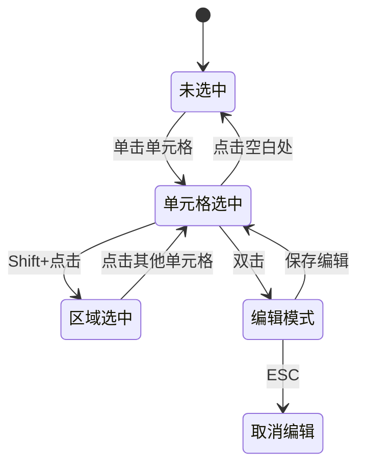
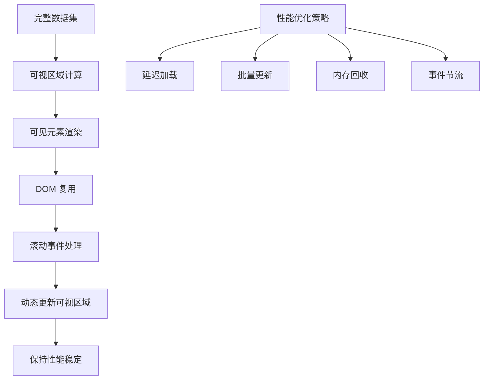

# Excel 风格表格实现

<cite>
**本文档引用的文件**
- [package.json](file://package.json)
- [extension.ts](file://src/extension.ts)
- [model.ts](file://src/model.ts)
- [toModel.ts](file://src/parser/toModel.ts)
- [fromModel.ts](file://src/parser/fromModel.ts)
- [extractSelection.ts](file://src/parser/extractSelection.ts)
- [parserOptions.ts](file://src/parser/parserOptions.ts)
- [index.html](file://index.html)
- [webview.js](file://media/webview.js)
- [webview.css](file://media/webview.css)
</cite>

## 更新摘要
**所做更改**
- 更新了 Excel 风格主题系统的实现细节
- 新增了工具栏重组和面包屑导航的详细说明
- 增强了迷你地图和缩略图功能的技术实现
- 完善了表格样式系统和交互功能的文档
- 添加了新的界面设计元素和交互功能说明

## 目录
1. [项目概述](#项目概述)
2. [项目结构](#项目结构)
3. [核心组件](#核心组件)
4. [架构概览](#架构概览)
5. [详细组件分析](#详细组件分析)
6. [依赖关系分析](#依赖关系分析)
7. [性能考虑](#性能考虑)
8. [故障排除指南](#故障排除指南)
9. [结论](#结论)

## 项目概述

wysJSON 是一个基于 VS Code 扩展的 Excel 风格表格编辑器，专门用于可视化编辑 JavaScript JSON 数据。该项目实现了完整的嵌套 JSON 结构表格化展示，支持丰富的交互功能和 Excel 式的用户体验。

### 主要特性
- Excel 风格的表格界面设计
- 嵌套 JSON 结构的可视化展示
- 实时数据编辑和验证
- 多语言支持（中英文）
- 缩略图和快速跳转功能
- 完整的撤销/重做机制

## 项目结构

项目采用模块化架构，主要分为以下几个核心部分：



**图表来源**
- [extension.ts:19-40](file://src/extension.ts#L19-L40)
- [index.html:1-50](file://index.html#L1-L50)
- [webview.js:11-52](file://media/webview.js#L11-L52)

**章节来源**
- [package.json:1-93](file://package.json#L1-L93)
- [extension.ts:19-600](file://src/extension.ts#L19-L600)

## 核心组件

### 数据模型系统

项目使用统一的数据模型来表示各种 JSON 类型：



**图表来源**
- [model.ts:15-54](file://src/model.ts#L15-L54)

### AST 解析器

项目使用 Babel AST 解析器来处理 JavaScript 代码：



**图表来源**
- [toModel.ts:10-90](file://src/parser/toModel.ts#L10-L90)
- [extractSelection.ts:34-101](file://src/parser/extractSelection.ts#L34-L101)

**章节来源**
- [model.ts:6-34](file://src/model.ts#L6-L34)
- [toModel.ts:10-230](file://src/parser/toModel.ts#L10-L230)
- [extractSelection.ts:13-385](file://src/parser/extractSelection.ts#L13-L385)

## 架构概览

### 整体架构设计



**图表来源**
- [extension.ts:46-378](file://src/extension.ts#L46-L378)
- [webview.js:250-277](file://media/webview.js#L250-L277)

### 表格渲染机制

项目实现了完整的 Excel 风格表格渲染系统：



**图表来源**
- [index.html:531-824](file://index.html#L531-L824)
- [webview.js:1594-1700](file://media/webview.js#L1594-L1700)

**章节来源**
- [index.html:531-1169](file://index.html#L531-L1169)
- [webview.js:1594-1599](file://media/webview.js#L1594-L1599)

## 详细组件分析

### 表格界面设计

#### Excel 风格主题系统

项目实现了完整的 Excel 风格主题，包括：

- **工具栏设计**：模拟 Excel 功能区布局，采用现代化的渐变背景和圆角设计
- **面包屑导航**：类似 Excel 公式栏的路径导航，支持节点聚焦和快速定位
- **表格样式**：网格线、边框、背景色等，使用 CSS 变量实现主题定制
- **状态栏**：显示操作状态和提示信息，支持错误状态高亮

**更新** 工具栏现在采用更现代的设计，包含语言选择器、输入面板控制按钮、格式化工具和状态指示器。

#### 行列头设计



**图表来源**
- [index.html:543-667](file://index.html#L543-L667)
- [webview.css:469-642](file://media/webview.css#L469-L642)

#### 单元格样式系统

单元格采用分层样式设计：

- **基础样式**：边框、内边距、字体设置
- **状态样式**：选中状态、悬停状态、编辑状态
- **类型样式**：不同数据类型的特殊显示
- **嵌套样式**：缩进和层级标识

**章节来源**
- [index.html:668-1091](file://index.html#L668-L1091)
- [webview.css:644-800](file://media/webview.css#L644-L800)

### 单元格编辑功能

#### 文本编辑机制



**图表来源**
- [webview.js:363-524](file://media/webview.js#L363-L524)

#### 类型转换和验证

项目实现了智能的类型转换和验证机制：

- **自动类型检测**：根据输入内容自动识别数据类型
- **格式验证**：确保输入符合目标类型要求
- **语法检查**：对代码文本进行语法验证
- **范围限制**：对数值和日期等类型进行范围检查

**章节来源**
- [webview.js:363-524](file://media/webview.js#L363-L524)
- [fromModel.ts:67-117](file://src/parser/fromModel.ts#L67-L117)

### 表格导航功能

#### 键盘快捷键系统



**图表来源**
- [webview.js:510-524](file://media/webview.js#L510-L524)
- [index.html:1709-1714](file://index.html#L1709-L1714)

#### 鼠标交互系统

- **点击选择**：单击选择单元格，双击进入编辑
- **拖拽选择**：拖拽创建矩形选区
- **拖拽调整**：拖拽列宽和行高
- **右键菜单**：显示上下文相关操作

**章节来源**
- [webview.js:363-524](file://media/webview.js#L363-L524)
- [index.html:1132-1169](file://index.html#L1132-L1169)

### 表格状态管理

#### 选中状态管理



#### 编辑状态管理

- **编辑模式切换**：双击进入编辑，失焦保存
- **输入验证**：实时验证用户输入
- **错误处理**：显示验证错误信息
- **状态回滚**：支持取消编辑操作

**章节来源**
- [webview.js:569-624](file://media/webview.js#L569-L624)
- [webview.js:1594-1700](file://media/webview.js#L1594-L1700)

### 性能优化技术

#### 虚拟滚动实现

项目实现了高效的虚拟滚动机制：



#### 增量渲染策略

- **局部更新**：只更新发生变化的单元格
- **缓存机制**：缓存计算结果和 DOM 元素
- **懒加载**：按需加载嵌套内容
- **防抖处理**：减少频繁操作的影响

**章节来源**
- [webview.js:1594-1700](file://media/webview.js#L1594-L1700)
- [webview.js:1521-1561](file://media/webview.js#L1521-L1561)

### 新增功能：迷你地图和缩略图系统

#### 缩略图系统（Thumbnail）

**更新** 新增了完整的缩略图系统，提供数据结构的可视化概览：

- **缩略图面板**：右侧浮动面板显示数据结构概览
- **缩略图块**：使用彩色块状元素表示不同类型的数据节点
- **活动状态指示**：当前聚焦节点使用高亮显示
- **视口跟踪**：实时显示当前可视区域位置
- **拖拽定位**：支持通过缩略图直接定位到数据区域

#### 快速跳转系统（Quick Jump）

**更新** 迷你地图功能得到显著改进：

- **节点列表**：左侧浮动面板显示可跳转的节点列表
- **层级缩进**：使用缩进显示节点层级关系
- **类型标签**：显示节点数据类型信息
- **焦点控制**：支持 Ctrl+点击进行节点聚焦
- **拖拽调整**：支持调整面板大小和位置

#### 交互功能增强

- **拖拽调整**：支持拖拽调整面板大小和位置
- **平滑滚动**：支持平滑滚动到指定节点
- **状态同步**：缩略图和迷你地图与主表格状态同步
- **响应式布局**：支持动态调整面板尺寸

**章节来源**
- [webview.js:898-950](file://media/webview.js#L898-L950)
- [webview.js:1180-1379](file://media/webview.js#L1180-L1379)
- [index.html:1227-1228](file://index.html#L1227-L1228)

## 依赖关系分析

### 核心依赖关系

```mermaid
graph TB
subgraph "外部依赖"
A[@babel/parser] --> B[AST 解析]
C[@babel/generator] --> D[代码生成]
E[monaco-editor] --> F[编辑器支持]
end
subgraph "内部模块"
G[extractSelection] --> H[AST 解析]
H --> I[toModel]
I --> J[fromModel]
J --> K[代码生成]
end
subgraph "VS Code 集成"
L[extension.ts] --> M[消息通信]
M --> N[Webview 交互]
N --> O[数据同步]
end
A --> G
C --> J
G --> I
I --> J
J --> K
K --> L
```

**图表来源**
- [package.json:86-91](file://package.json#L86-L91)
- [extension.ts:8-15](file://src/extension.ts#L8-L15)

### 模块间耦合分析

项目采用了松耦合的设计原则：

- **解析器独立性**：AST 解析与 UI 层分离
- **数据模型抽象**：统一的数据表示层
- **消息通信机制**：清晰的扩展通信接口
- **样式模块化**：CSS 样式独立维护

**章节来源**
- [package.json:86-91](file://package.json#L86-L91)
- [extension.ts:8-15](file://src/extension.ts#L8-L15)

## 性能考虑

### 内存管理

- **对象池模式**：复用 DOM 元素和样式对象
- **垃圾回收优化**：及时清理不再使用的引用
- **内存泄漏防护**：确保事件监听器正确移除

### 渲染性能

- **requestAnimationFrame**：使用浏览器动画帧优化渲染
- **CSS3 硬件加速**：利用 GPU 加速变换和过渡
- **最小化重排**：批量更新 DOM 属性

### 网络和 I/O

- **本地文件处理**：避免不必要的网络请求
- **缓存策略**：缓存解析结果和样式计算
- **异步操作**：非阻塞的后台处理

## 故障排除指南

### 常见问题诊断

#### 数据解析错误

当遇到数据解析失败时，检查：
- 确认选区包含有效的 JavaScript 对象或数组
- 验证代码语法的正确性
- 检查是否有未闭合的括号或引号

#### 编辑冲突

如果出现编辑冲突：
- 确认文档未被其他进程修改
- 检查文件权限是否正确
- 重新打开编辑器尝试

#### 性能问题

性能问题的常见原因：
- 大型数据集导致的渲染延迟
- 复杂嵌套结构的计算开销
- 样式计算的重复执行

**章节来源**
- [extension.ts:420-490](file://src/extension.ts#L420-L490)
- [fromModel.ts:20-57](file://src/parser/fromModel.ts#L20-L57)

### 调试技巧

- 使用浏览器开发者工具监控性能指标
- 检查控制台错误信息
- 分析内存使用情况
- 监控网络请求和文件 I/O

## 结论

wysJSON 项目成功实现了 Excel 风格的表格编辑功能，具有以下特点：

### 技术优势

- **完整的 Excel 风格体验**：从界面设计到交互行为都高度还原 Excel
- **强大的数据处理能力**：支持复杂的嵌套 JSON 结构和多种数据类型
- **优秀的性能表现**：通过虚拟滚动和增量渲染优化大型数据集处理
- **可靠的扩展集成**：无缝集成 VS Code 生态系统
- **现代化界面设计**：采用最新的 Excel 风格主题和交互模式

### 设计亮点

- **模块化架构**：清晰的分层设计和职责分离
- **灵活的扩展性**：易于添加新的功能和改进现有特性
- **完善的错误处理**：全面的异常处理和用户友好的错误提示
- **多语言支持**：国际化设计支持中英文界面
- **智能导航系统**：缩略图和迷你地图提供直观的数据导航体验

### 应用价值

该项目为开发者提供了一个强大而易用的 JSON 数据编辑工具，特别适用于：
- 配置文件的可视化编辑
- API 响应数据的调试和修改
- 数据结构的探索和分析
- 开发工作流程的自动化

通过持续的优化和功能扩展，wysJSON 有望成为 VS Code 生态系统中不可或缺的数据编辑工具。