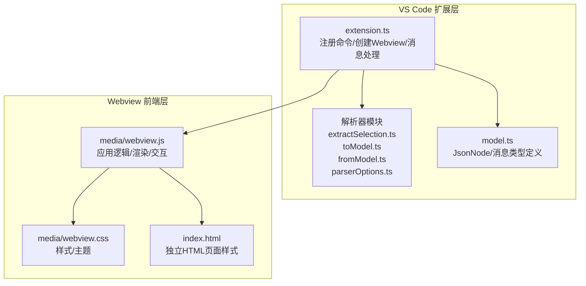
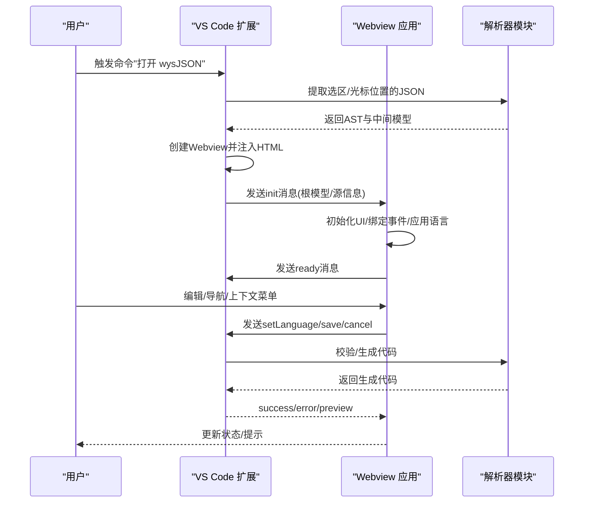
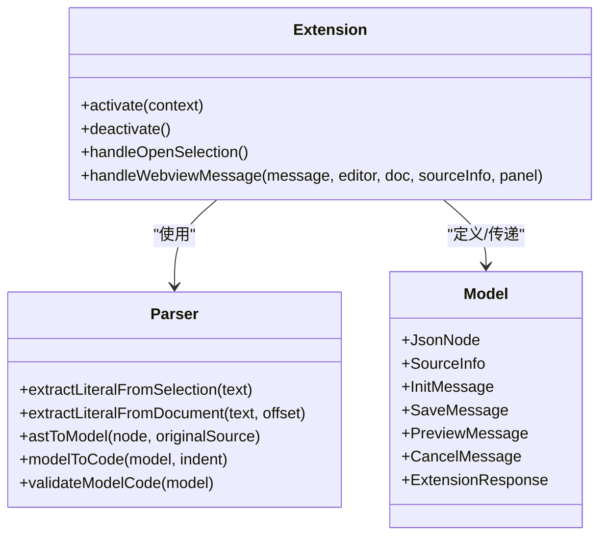
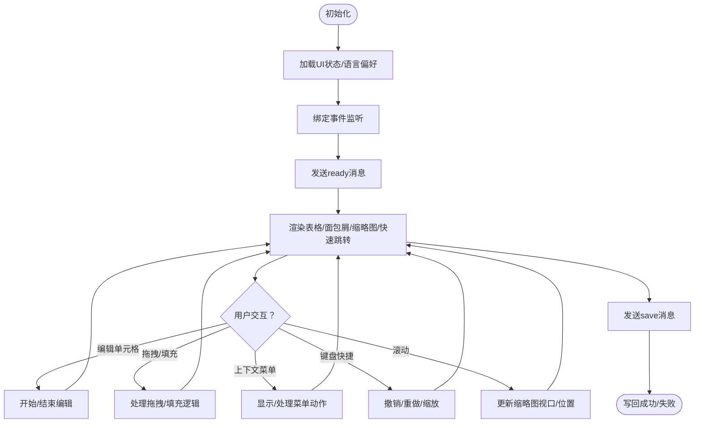
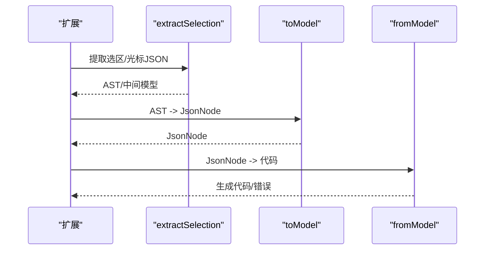
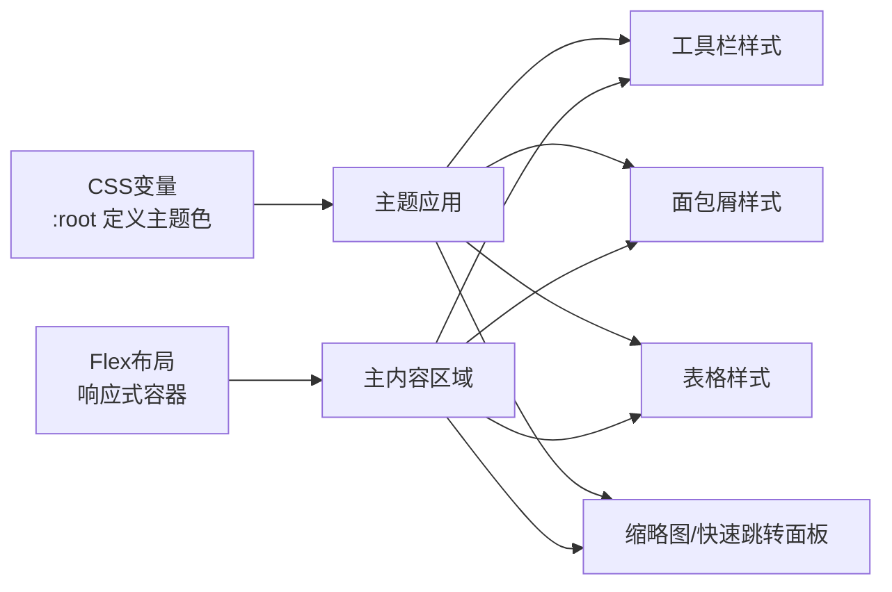
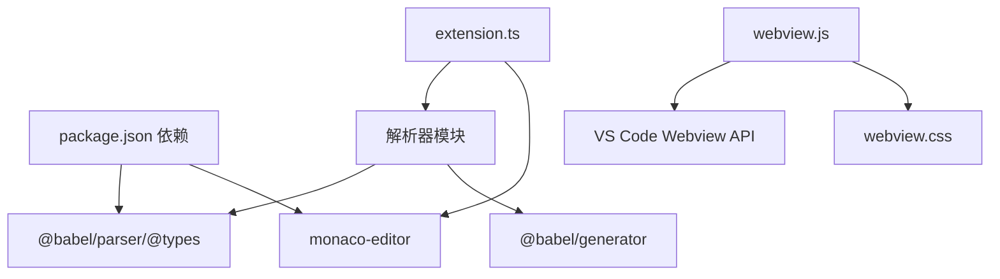

# Webview 界面系统

<cite>
**本文档引用的文件**
- [package.json](file://package.json)
- [extension.ts](file://src/extension.ts)
- [model.ts](file://src/model.ts)
- [extractSelection.ts](file://src/parser/extractSelection.ts)
- [toModel.ts](file://src/parser/toModel.ts)
- [fromModel.ts](file://src/parser/fromModel.ts)
- [parserOptions.ts](file://src/parser/parserOptions.ts)
- [webview.js](file://media/webview.js)
- [webview.css](file://media/webview.css)
- [index.html](file://index.html)
- [package.nls.json](file://package.nls.json)
- [package.nls.zh-CN.json](file://package.nls.zh-CN.json)
</cite>

## 目录
1. [简介](#简介)
2. [项目结构](#项目结构)
3. [核心组件](#核心组件)
4. [架构总览](#架构总览)
5. [详细组件分析](#详细组件分析)
6. [依赖关系分析](#依赖关系分析)
7. [性能考虑](#性能考虑)
8. [故障排除指南](#故障排除指南)
9. [结论](#结论)
10. [附录](#附录)

## 简介
本项目是一个嵌入 VS Code 的 Excel 风格 JSON 表格编辑器，提供所见即所得的表格化编辑体验，支持嵌套对象与数组的行列式展示、单元格编辑、上下文菜单、键盘快捷键、缩略图导航、语言切换与国际化、以及与 VS Code 扩展的消息通信协议。系统采用前端 Webview 技术实现，结合 VS Code 扩展宿主环境，实现从编辑器选区提取 JSON 数据、转换为中间模型、渲染为表格、并在保存时回写到源文件。

## 项目结构
项目采用模块化组织，核心分为 VS Code 扩展层与 Webview 前端层：
- 扩展层负责从 VS Code 编辑器中提取选区或光标位置的 JSON 文本，解析为中间模型，创建 Webview 并传递初始数据。
- Webview 层负责渲染表格、处理用户交互、维护状态、执行撤销/重做、生成缩略图与快速跳转面板，并通过消息协议与扩展通信。

**图表来源**
- [extension.ts:19-378](file://src/extension.ts#L19-L378)
- [webview.js:11-524](file://media/webview.js#L11-L524)
- [webview.css:1-1166](file://media/webview.css#L1-L1166)
- [index.html:1-5203](file://index.html#L1-L5203)

**章节来源**
- [package.json:1-93](file://package.json#L1-L93)
- [extension.ts:19-378](file://src/extension.ts#L19-L378)
- [webview.js:11-524](file://media/webview.js#L11-L524)

## 核心组件
- VS Code 扩展入口与命令注册：负责激活扩展、注册命令、从编辑器提取数据、创建 Webview、处理消息。
- 解析器模块：从选区或光标位置提取 JSON 文本，使用 Babel 解析为 AST，再转换为中间模型；保存时将中间模型转换回源代码。
- 中间模型：统一表示 JSON/JS 对象、数组、原始值、代码文本节点及其元信息。
- Webview 应用：负责渲染 Excel 风格表格、处理用户交互、维护 UI 状态、生成缩略图与快速跳转面板、国际化与主题适配。
- 样式系统：基于 CSS 变量的主题系统，支持浅色主题与响应式布局。
- 国际化与主题：内置英文与中文翻译，支持语言切换；通过 CSS 变量实现主题一致性。

**章节来源**
- [extension.ts:19-378](file://src/extension.ts#L19-L378)
- [extractSelection.ts:34-101](file://src/parser/extractSelection.ts#L34-L101)
- [toModel.ts:10-90](file://src/parser/toModel.ts#L10-L90)
- [fromModel.ts:20-57](file://src/parser/fromModel.ts#L20-L57)
- [model.ts:6-103](file://src/model.ts#L6-L103)
- [webview.js:11-524](file://media/webview.js#L11-L524)
- [webview.css:1-1166](file://media/webview.css#L1-L1166)

## 架构总览
系统采用“扩展 + Webview”的双层架构：
- 扩展层负责数据提取与模型转换，Webview 层负责 UI 渲染与交互。
- 两者通过消息协议通信：扩展发送 init，Webview 发送 ready、setLanguage、save、cancel 等消息。

**图表来源**
- [extension.ts:349-377](file://src/extension.ts#L349-L377)
- [extension.ts:397-490](file://src/extension.ts#L397-L490)
- [webview.js:375-377](file://media/webview.js#L375-L377)

**章节来源**
- [extension.ts:349-490](file://src/extension.ts#L349-L490)
- [webview.js:375-377](file://media/webview.js#L375-L377)

## 详细组件分析

### VS Code 扩展层
- 命令注册与激活：注册打开编辑器命令，设置上下文键控制菜单显示。
- 选区提取与模型转换：根据编辑器语言与选区内容，调用解析器提取 JSON 文本，构建中间模型。
- Webview 创建与消息处理：注入 HTML，监听 Webview 消息，处理 ready、setLanguage、save、cancel。
- 写回机制：校验中间模型合法性，生成代码，应用 WorkspaceEdit 写回源文件。

**图表来源**
- [extension.ts:19-378](file://src/extension.ts#L19-L378)
- [extractSelection.ts:34-101](file://src/parser/extractSelection.ts#L34-L101)
- [toModel.ts:10-90](file://src/parser/toModel.ts#L10-L90)
- [fromModel.ts:20-57](file://src/parser/fromModel.ts#L20-L57)
- [model.ts:6-103](file://src/model.ts#L6-L103)

**章节来源**
- [extension.ts:19-378](file://src/extension.ts#L19-L378)
- [model.ts:6-103](file://src/model.ts#L6-L103)

### Webview 应用层
- 应用状态管理：维护数据、嵌套展开状态、选区、编辑状态、缩略图与快速跳转面板状态、编辑缩放比例等。
- 国际化与主题：内置英文/中文翻译，动态应用语言；通过 CSS 变量实现主题一致性。
- 表格渲染：根据数据类型自动选择行列式表格或简单视图；支持列宽记忆、列头拖拽排序、行拖拽排序、嵌套展开/折叠。
- 用户交互：鼠标选择、拖拽填充、右键上下文菜单、键盘快捷键（撤销/重做）、Ctrl+滚轮缩放、粘贴/复制。
- 辅助功能：缩略图面板与快速跳转面板，支持拖动面板/视口/调整大小/点击定位。

**图表来源**
- [webview.js:250-524](file://media/webview.js#L250-L524)
- [webview.js:1594-1657](file://media/webview.js#L1594-L1657)
- [webview.js:1659-2399](file://media/webview.js#L1659-L2399)

**章节来源**
- [webview.js:250-524](file://media/webview.js#L250-L524)
- [webview.js:1594-2399](file://media/webview.js#L1594-L2399)

### 解析器与模型
- 选区提取：优先尝试直接解析表达式，否则解析为语句并提取字面量；支持 Markdown 代码块内的提取。
- AST 到模型：对象/数组/原始值映射为 JsonNode；代码文本节点保留原始代码以便写回。
- 模型到代码：递归生成代码，处理对象方法、换行缩进、键名格式化；对代码文本节点进行语法验证。

**图表来源**
- [extractSelection.ts:34-101](file://src/parser/extractSelection.ts#L34-L101)
- [toModel.ts:10-90](file://src/parser/toModel.ts#L10-L90)
- [fromModel.ts:20-57](file://src/parser/fromModel.ts#L20-L57)

**章节来源**
- [extractSelection.ts:34-101](file://src/parser/extractSelection.ts#L34-L101)
- [toModel.ts:10-90](file://src/parser/toModel.ts#L10-L90)
- [fromModel.ts:20-57](file://src/parser/fromModel.ts#L20-L57)

### 样式系统与响应式布局
- 主题系统：通过 CSS 变量定义颜色与尺寸，支持浅色主题；表格采用 Excel 风格样式。
- 响应式布局：工具栏、面包屑、主内容区域、输入面板、表格视图采用 Flex 布局，自适应容器尺寸。
- 缩略图与快速跳转：绝对定位面板，支持拖动移动与拖动边缘调整宽度，跟随滚动同步视口。

**图表来源**
- [webview.css:1-1166](file://media/webview.css#L1-L1166)
- [index.html:8-5203](file://index.html#L8-L5203)

**章节来源**
- [webview.css:1-1166](file://media/webview.css#L1-L1166)
- [index.html:8-5203](file://index.html#L8-L5203)

### 国际化与主题适配
- 语言偏好：扩展层持久化用户语言偏好，Webview 层根据用户选择或浏览器语言自动切换。
- 翻译映射：内置英文与中文翻译键值，动态更新按钮、状态栏、面包屑等文本。
- 主题适配：通过 CSS 变量统一主题色，支持缩放与面板拖动，保持一致视觉体验。

**章节来源**
- [extension.ts:312-326](file://src/extension.ts#L312-L326)
- [webview.js:54-187](file://media/webview.js#L54-L187)
- [webview.js:189-243](file://media/webview.js#L189-L243)
- [package.nls.json:1-4](file://package.nls.json#L1-L4)
- [package.nls.zh-CN.json:1-4](file://package.nls.zh-CN.json#L1-L4)

## 依赖关系分析
- 扩展依赖：@babel/parser、@babel/types、monaco-editor（用于编辑器集成）。
- 解析器依赖：@babel/parser、@babel/types、@babel/generator。
- Webview 依赖：VS Code Webview API（acquireVsCodeApi），本地 CSS/JS 资源。

**图表来源**
- [package.json:86-91](file://package.json#L86-L91)
- [parserOptions.ts:3-18](file://src/parser/parserOptions.ts#L3-L18)
- [extension.ts:8-15](file://src/extension.ts#L8-L15)
- [webview.js:5-5](file://media/webview.js#L5-L5)

**章节来源**
- [package.json:86-91](file://package.json#L86-L91)
- [parserOptions.ts:3-18](file://src/parser/parserOptions.ts#L3-L18)
- [extension.ts:8-15](file://src/extension.ts#L8-L15)
- [webview.js:5-5](file://media/webview.js#L5-L5)

## 性能考虑
- 渲染策略：采用一次性渲染表格 DOM，减少频繁重排；缩略图与快速跳转面板按需更新，避免阻塞主线程。
- 事件处理：使用捕获/冒泡阶段事件监听，减少重复处理；拖拽与滚动采用 requestAnimationFrame 优化。
- 状态缓存：列宽记忆、UI 状态持久化到 localStorage，减少重复计算与初始化开销。
- 代码生成：仅在保存时进行语法验证与代码生成，避免频繁解析。

**章节来源**
- [webview.js:1594-1657](file://media/webview.js#L1594-L1657)
- [webview.js:898-950](file://media/webview.js#L898-L950)
- [webview.js:1521-1561](file://media/webview.js#L1521-L1561)

## 故障排除指南
- 无法识别选区中的数据结构：检查选区是否为对象/数组字面量或包含它们的变量初始化；Markdown 代码块内需正确闭合。
- 保存失败：确认中间模型中无无效代码文本；检查文档版本是否被修改导致写回失败。
- 语言切换无效：确认扩展已持久化语言偏好并更新上下文键；Webview 层需发送 setLanguage 消息。
- 缩略图/快速跳转不显示：检查数据是否存在、面板开关是否开启、滚动容器尺寸是否有效。

**章节来源**
- [extractSelection.ts:34-101](file://src/parser/extractSelection.ts#L34-L101)
- [extension.ts:420-490](file://src/extension.ts#L420-L490)
- [webview.js:898-950](file://media/webview.js#L898-L950)

## 结论
本系统通过清晰的分层架构与完善的解析/渲染机制，实现了 VS Code 内嵌的 Excel 风格 JSON 表格编辑器。其消息通信协议简洁可靠，国际化与主题适配完善，交互体验流畅。建议后续可引入虚拟滚动与增量渲染以进一步提升大数据集性能，并扩展更多上下文菜单操作与快捷键以增强可用性。

## 附录
- 消息类型定义：init、save、preview、cancel、setLanguage、languageSaved、ready、error、success。
- 支持的语言：JavaScript、TypeScript、JavaScript React、TypeScript React。
- 国际化键值：标题、按钮文本、状态消息、上下文菜单项、类型标签等。

**章节来源**
- [model.ts:58-103](file://src/model.ts#L58-L103)
- [package.json:55-66](file://package.json#L55-L66)
- [webview.js:54-187](file://media/webview.js#L54-L187)