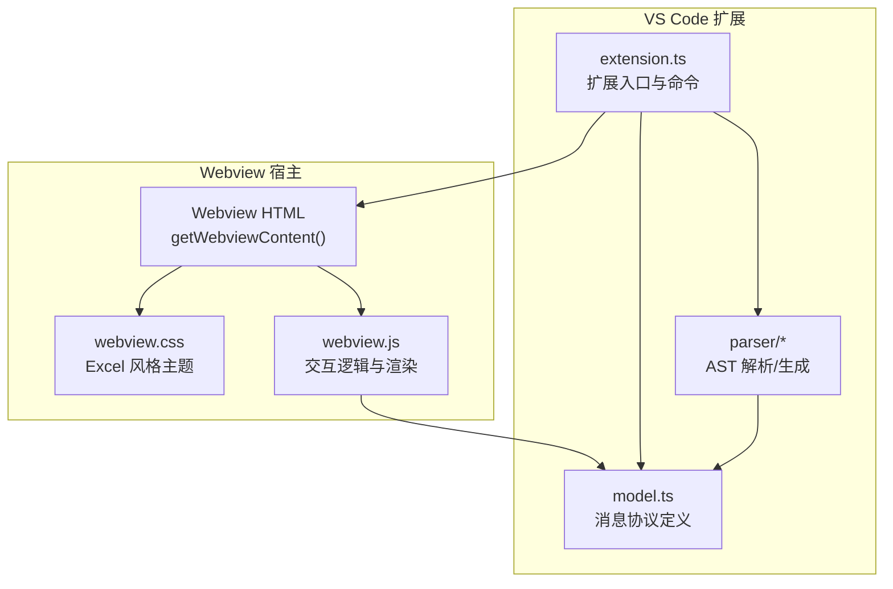
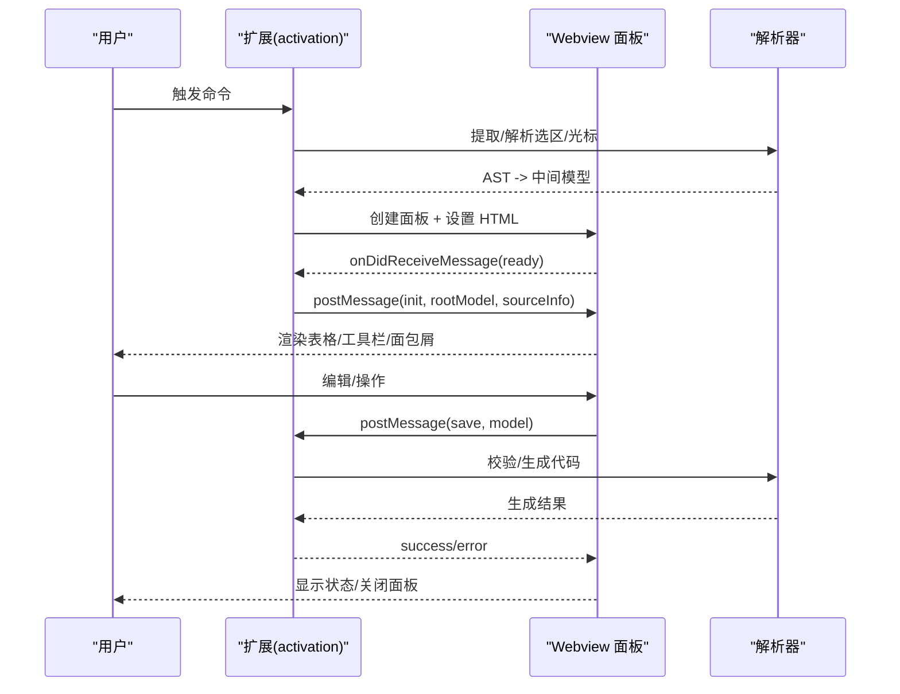
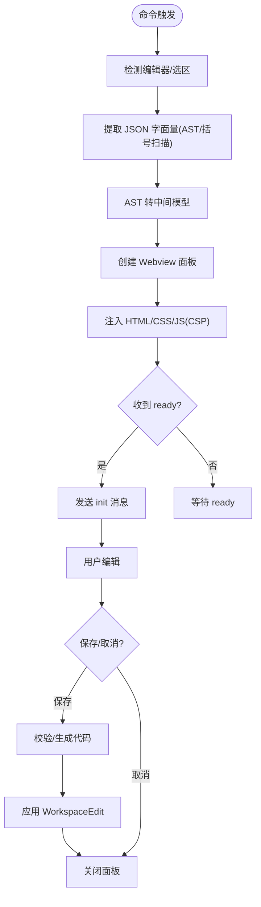
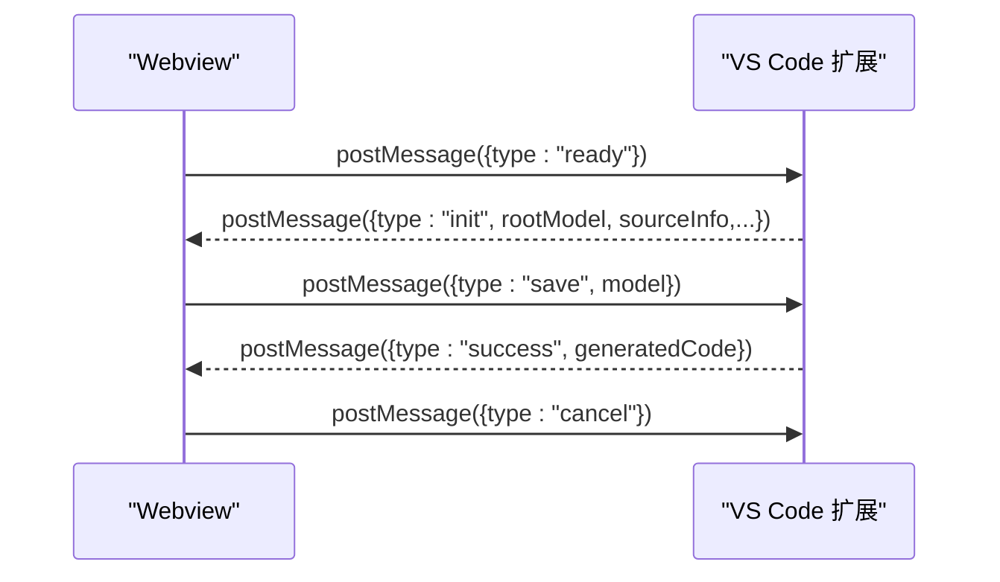
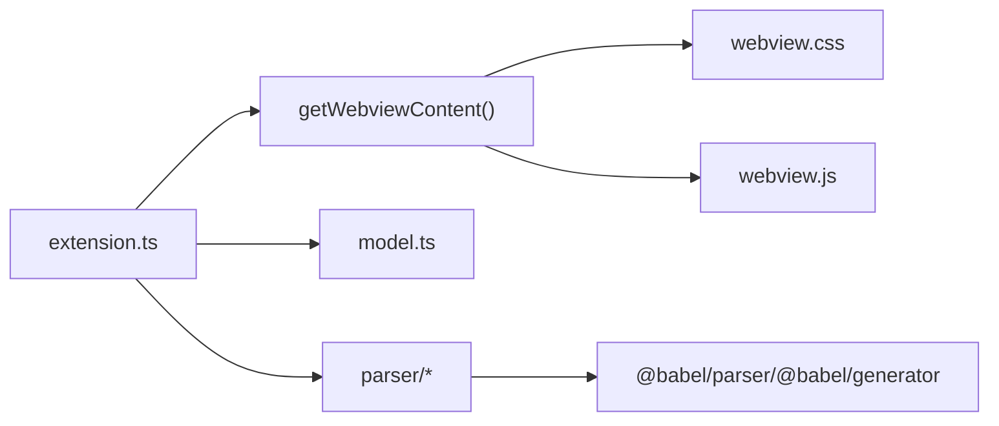

# Webview 面板架构

<cite>
**本文档引用的文件**
- [package.json](file://package.json)
- [extension.ts](file://src/extension.ts)
- [webview.js](file://media/webview.js)
- [webview.css](file://media/webview.css)
- [model.ts](file://src/model.ts)
- [extractSelection.ts](file://src/parser/extractSelection.ts)
- [toModel.ts](file://src/parser/toModel.ts)
- [fromModel.ts](file://src/parser/fromModel.ts)
- [parserOptions.ts](file://src/parser/parserOptions.ts)
- [index.html](file://index.html)
</cite>

## 目录
1. [简介](#简介)
2. [项目结构](#项目结构)
3. [核心组件](#核心组件)
4. [架构总览](#架构总览)
5. [详细组件分析](#详细组件分析)
6. [依赖关系分析](#依赖关系分析)
7. [性能考虑](#性能考虑)
8. [故障排除指南](#故障排除指南)
9. [结论](#结论)

## 简介
本项目为 VS Code 扩展中的 Webview 面板，提供嵌套 JSON 数据的表格化编辑体验。用户可在 VS Code 编辑器中右键选择 JavaScript/TypeScript/Markdown 等文件中的对象或数组字面量，通过 wysJSON 在独立的 Webview 面板中以 Excel 风格的表格进行可视化编辑，并将变更写回源文件。

## 项目结构
该仓库采用 VS Code 扩展标准结构，核心文件分布如下：
- 扩展入口与命令注册：src/extension.ts
- Webview 主题与样式：media/webview.css
- Webview 交互逻辑与渲染：media/webview.js
- 数据模型与消息协议：src/model.ts
- AST 解析与代码生成：src/parser/*
- 扩展元信息与激活事件：package.json
- 本地演示页面（非扩展模式）：index.html

图表来源
- [extension.ts:519-599](file://src/extension.ts#L519-L599)
- [webview.css:1-120](file://media/webview.css#L1-L120)
- [webview.js:11-277](file://media/webview.js#L11-L277)
- [model.ts:59-103](file://src/model.ts#L59-L103)

章节来源
- [package.json:1-93](file://package.json#L1-L93)
- [extension.ts:19-44](file://src/extension.ts#L19-L44)

## 核心组件
- 扩展入口与面板创建：负责注册命令、解析用户选择、构建 Webview、发送初始化数据、处理保存/取消等消息。
- Webview 主题与布局：基于 CSS 变量的 Excel 风格主题，定义工具栏、面包屑、表格视图、缩略图/快速跳转面板等区域。
- 交互逻辑与渲染：实现撤销/重做、单元格编辑、列头拖拽/调整宽度、面包屑导航、缩略图/迷你地图滚动同步等。
- 数据模型与消息协议：定义 JsonNode、SourceInfo、InitMessage、SaveMessage 等类型，规范扩展与 Webview 的消息交换。
- AST 解析与代码生成：使用 Babel 将选区或光标位置的 JSON/JS 文本解析为中间模型，再将模型回写为代码，保持缩进与格式。

章节来源
- [extension.ts:46-378](file://src/extension.ts#L46-L378)
- [webview.js:11-277](file://media/webview.js#L11-L277)
- [model.ts:6-103](file://src/model.ts#L6-L103)
- [extractSelection.ts:34-101](file://src/parser/extractSelection.ts#L34-L101)
- [toModel.ts:10-90](file://src/parser/toModel.ts#L10-L90)
- [fromModel.ts:20-57](file://src/parser/fromModel.ts#L20-L57)

## 架构总览
Webview 面板的初始化与生命周期管理遵循以下流程：
- 用户触发命令 → 扩展解析选区/光标位置 → AST 提取 JSON 对象/数组 → 转换为中间模型 → 创建 Webview 面板 → 注入 HTML/CSS/JS → 发送 init 消息 → Webview 收到 ready 后发送 init 数据 → 用户编辑 → Webview 发送保存请求 → 扩展校验并写回 → 成功后自动关闭。

图表来源
- [extension.ts:328-378](file://src/extension.ts#L328-L378)
- [extension.ts:397-490](file://src/extension.ts#L397-L490)
- [webview.js:375-377](file://media/webview.js#L375-L377)

## 详细组件分析

### 初始化流程与生命周期管理
- 命令注册与激活：扩展在激活时注册命令，监听用户触发。
- 选区/光标解析：根据编辑器语言与 Markdown 代码块规则，提取对象/数组字面量，必要时回退到纯文本括号扫描。
- AST 转模型：将 AST 节点映射为 JsonNode，保留原始代码片段以便回写。
- Webview 创建与注入：设置启用脚本、本地资源根，注入 CSP、CSS、JS，并传入语言偏好。
- 生命周期事件：监听 ready 消息后发送 init；处理保存/取消；文档版本变化时拒绝覆盖写回。

图表来源
- [extension.ts:46-308](file://src/extension.ts#L46-L308)
- [extractSelection.ts:108-229](file://src/parser/extractSelection.ts#L108-L229)
- [toModel.ts:10-90](file://src/parser/toModel.ts#L10-L90)
- [fromModel.ts:20-57](file://src/parser/fromModel.ts#L20-L57)

章节来源
- [extension.ts:46-308](file://src/extension.ts#L46-L308)
- [extractSelection.ts:34-101](file://src/parser/extractSelection.ts#L34-L101)
- [toModel.ts:10-90](file://src/parser/toModel.ts#L10-L90)
- [fromModel.ts:20-57](file://src/parser/fromModel.ts#L20-L57)

### HTML 结构设计与布局架构
- 工具栏：包含保存、取消、聚焦、手型工具、语言切换、撤销/重做、空值处理、缩略图/快速跳转开关等控件。
- 面包屑：显示当前聚焦路径，支持点击返回父级或定位到子节点。
- 主内容区：表格视图容器，内含编辑画布、缩略图面板、迷你地图、空状态提示。
- 状态栏：显示加载/操作状态信息。
- 上下文菜单：右键弹出，支持插入/删除行列、类型转换、聚焦节点等。

章节来源
- [extension.ts:546-598](file://src/extension.ts#L546-L598)
- [webview.js:797-823](file://media/webview.js#L797-L823)
- [webview.js:898-950](file://media/webview.js#L898-L950)

### CSS 变量系统与主题适配
- Excel 风格主题：通过 :root 定义网格、单元格、表头、行号、按钮、选择高亮、悬停、嵌套区域等颜色变量。
- 组件样式：工具栏、面包屑、输入面板、表格视图、迷你地图、缩略图等均使用 CSS 变量统一风格。
- 暗色模式支持：当前仓库未提供暗色主题变量定义，若需暗色模式，可在 :root 中新增暗色变量并在媒体查询中切换。

章节来源
- [webview.css:4-30](file://media/webview.css#L4-L30)
- [webview.css:55-127](file://media/webview.css#L55-L127)
- [webview.css:128-171](file://media/webview.css#L128-L171)
- [webview.css:227-456](file://media/webview.css#L227-L456)

### 响应式布局与屏幕适配
- 弹性布局：body 使用 flex-column，主内容区 flex: 1，表格视图 overflow: auto，确保在不同窗口尺寸下自适应。
- 缩略图/迷你地图：绝对定位，支持拖拽移动与宽度调整，随表格滚动同步更新视口位置。
- 编辑区缩放：支持 Ctrl+滚轮缩放，结合语义缩放在特定阈值时聚焦/回退到父级路径。

章节来源
- [webview.css:38-52](file://media/webview.css#L38-L52)
- [webview.css:173-178](file://media/webview.css#L173-L178)
- [webview.js:1521-1561](file://media/webview.js#L1521-L1561)
- [webview.js:1232-1292](file://media/webview.js#L1232-L1292)

### 与 VS Code 扩展主机的通信机制
- 消息协议：
  - Webview -> 扩展：ready、setLanguage、save、cancel
  - 扩展 -> Webview：init、success、error、languageSaved
- 数据模型：
  - InitMessage：rootModel、sourceInfo、readonlyWarnings、language、userLangPref
  - SaveMessage：model
  - ExtensionResponse：success/error/preview 与 message/generatedCode

图表来源
- [extension.ts:348-377](file://src/extension.ts#L348-L377)
- [extension.ts:397-490](file://src/extension.ts#L397-L490)
- [model.ts:59-103](file://src/model.ts#L59-L103)

章节来源
- [extension.ts:348-377](file://src/extension.ts#L348-L377)
- [model.ts:59-103](file://src/model.ts#L59-L103)

### 数据模型与 AST 处理
- JsonNode：抽象 JSON/JS 值，支持对象、数组、字符串、数字、布尔、null、codeText 等类型，记录原始代码与写回方式。
- SourceInfo：记录源文件 URI、选区范围、文档版本、缩进、原始行等，用于安全写回。
- AST 提取：优先匹配对象/数组字面量，其次变量声明/表达式，最后在纯文本/Markdown 中按括号扫描回退。
- AST 转模型：递归遍历 AST，保留原始代码片段，标注不可编辑的 spread 等节点。
- 代码生成：校验 codeText 节点合法性，生成符合缩进的代码文本，支持对象方法/展开语法的特殊处理。

章节来源
- [model.ts:6-54](file://src/model.ts#L6-L54)
- [extractSelection.ts:34-101](file://src/parser/extractSelection.ts#L34-L101)
- [extractSelection.ts:108-229](file://src/parser/extractSelection.ts#L108-L229)
- [toModel.ts:10-90](file://src/parser/toModel.ts#L10-L90)
- [fromModel.ts:20-57](file://src/parser/fromModel.ts#L20-L57)

## 依赖关系分析
- 扩展对 Webview 的依赖：通过 VS Code Webview API 创建面板、注入资源、收发消息。
- Webview 对扩展的依赖：仅通过消息协议通信，无直接模块导入。
- 解析器依赖：@babel/parser、@babel/generator，配置插件以支持 JSX/TS/装饰器/可选链等。
- 类型与协议：model.ts 定义消息与数据结构，确保双方契约一致。

图表来源
- [extension.ts:519-599](file://src/extension.ts#L519-L599)
- [webview.js:11-277](file://media/webview.js#L11-L277)
- [parserOptions.ts:3-18](file://src/parser/parserOptions.ts#L3-L18)

章节来源
- [parserOptions.ts:3-18](file://src/parser/parserOptions.ts#L3-L18)

## 性能考虑
- 选区提取性能：括号扫描限制窗口大小，避免全文件解析带来的开销。
- 渲染优化：表格按列聚合键名，仅渲染可见区域；缩略图/迷你地图使用 requestAnimationFrame 更新视口。
- 写回保护：检查文档版本，防止并发修改导致覆盖丢失。
- 资源加载：通过 asWebviewUri 加载本地 CSS/JS，配合 CSP 与随机 nonce 提升安全性。

章节来源
- [extractSelection.ts:242-343](file://src/parser/extractSelection.ts#L242-L343)
- [webview.js:898-950](file://media/webview.js#L898-L950)
- [extension.ts:423-430](file://src/extension.ts#L423-L430)
- [extension.ts:524-534](file://src/extension.ts#L524-L534)

## 故障排除指南
- 无法识别选区中的数据结构：检查选区是否为对象/数组字面量或包含于变量初始化；在 Markdown 中确认位于代码块内。
- 保存失败：确认编辑后的模型通过语法校验；检查文档是否被其他进程修改导致版本不一致。
- 语言切换无效：确认 setLanguage 消息已发送并持久化到 globalState；检查上下文键更新是否成功。
- 缩略图/迷你地图不显示：确认数据存在且面板启用；检查滚动事件与位置计算逻辑。

章节来源
- [extractSelection.ts:74-101](file://src/parser/extractSelection.ts#L74-L101)
- [extension.ts:420-490](file://src/extension.ts#L420-L490)
- [webview.js:898-950](file://media/webview.js#L898-L950)

## 结论
本 Webview 面板通过清晰的消息协议、完善的 AST 解析与代码生成、以及 Excel 风格的 UI 设计，实现了 VS Code 中嵌套 JSON 的高效可视化编辑。其模块化设计与 CSS 变量体系便于扩展与主题定制，后续可进一步增强暗色模式支持与更丰富的交互能力。