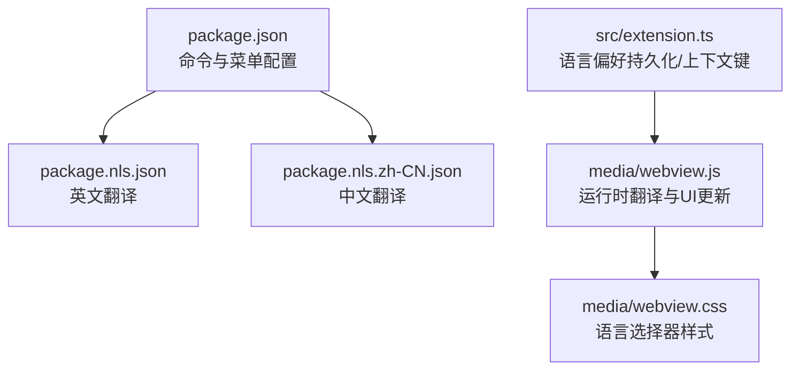
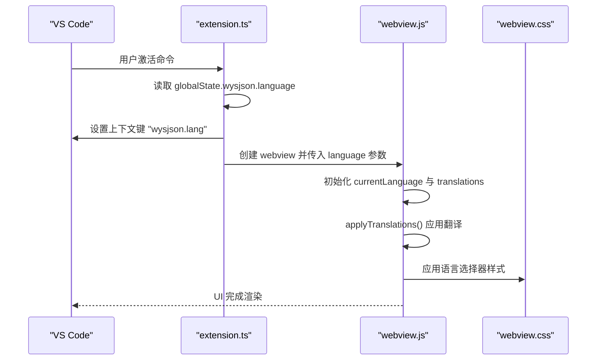
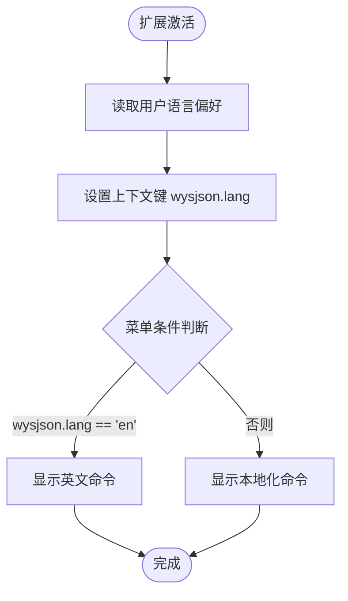
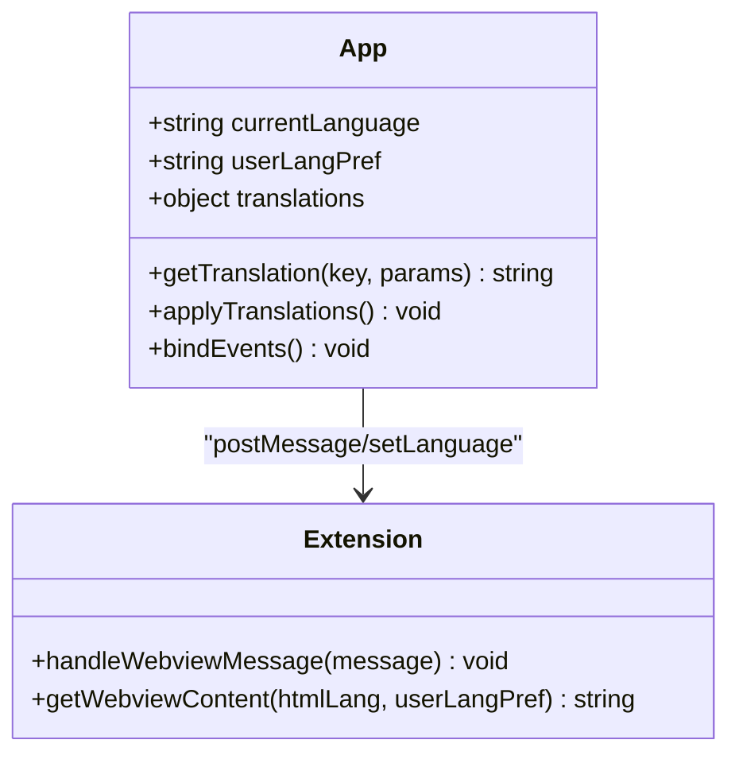
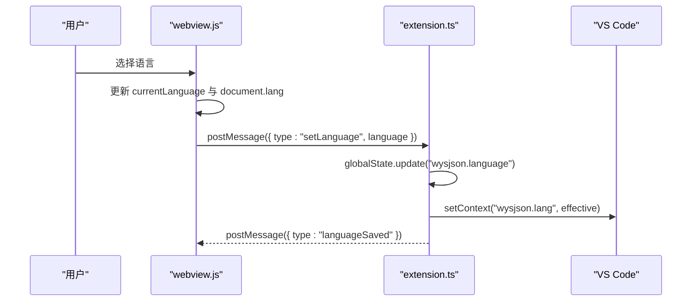
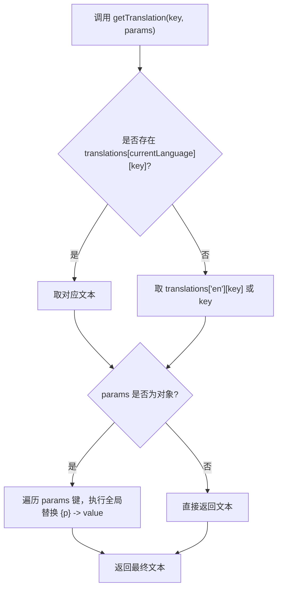
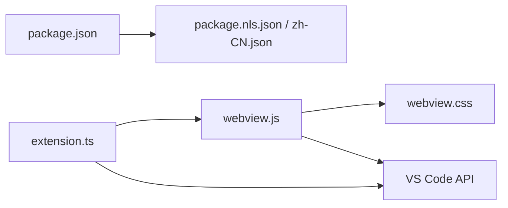

# 国际化支持

<cite>
**本文档引用的文件**
- [package.json](file://package.json)
- [package.nls.json](file://package.nls.json)
- [package.nls.zh-CN.json](file://package.nls.zh-CN.json)
- [extension.ts](file://src/extension.ts)
- [webview.js](file://media/webview.js)
- [webview.css](file://media/webview.css)
</cite>

## 目录
1. [项目概述](#项目概述)
2. [项目结构](#项目结构)
3. [核心组件](#核心组件)
4. [架构总览](#架构总览)
5. [详细组件分析](#详细组件分析)
6. [依赖关系分析](#依赖关系分析)
7. [性能考虑](#性能考虑)
8. [故障排除指南](#故障排除指南)
9. [结论](#结论)
10. [附录](#附录)

## 项目概述
本项目为 VS Code 扩展 wysJSON，提供 JSON 数据的可视化表格编辑能力。国际化支持贯穿扩展的命令标题与 UI 文本，采用 VS Code 官方 NLS（非英语本地化）机制与前端运行时翻译系统相结合的方式，实现命令本地化与界面文本本地化。

## 项目结构
国际化相关的关键文件分布如下：
- 扩展元信息与命令本地化：package.json 中的 commands 配置使用 NLS 占位符，实际翻译内容由 package.nls.json 和 package.nls.zh-CN.json 提供。
- 扩展逻辑与语言状态管理：src/extension.ts 负责语言偏好持久化、上下文键设置与向 webview 传递语言信息。
- Webview 界面与运行时翻译：media/webview.js 内置英文与中文翻译映射，并提供 getTranslation 与 applyTranslations 方法；media/webview.css 包含语言选择器样式。

**图表来源**
- [package.json:27-51](file://package.json#L27-L51)
- [package.nls.json:1-4](file://package.nls.json#L1-L4)
- [package.nls.zh-CN.json:1-4](file://package.nls.zh-CN.json#L1-L4)
- [extension.ts:312-326](file://src/extension.ts#L312-L326)
- [webview.js:54-187](file://media/webview.js#L54-L187)
- [webview.css:113-127](file://media/webview.css#L113-L127)

**章节来源**
- [package.json:27-51](file://package.json#L27-L51)
- [package.nls.json:1-4](file://package.nls.json#L1-L4)
- [package.nls.zh-CN.json:1-4](file://package.nls.zh-CN.json#L1-L4)
- [extension.ts:312-326](file://src/extension.ts#L312-L326)
- [webview.js:54-187](file://media/webview.js#L54-L187)
- [webview.css:113-127](file://media/webview.css#L113-L127)

## 核心组件
- VS Code NLS 翻译文件
  - package.nls.json：默认英文命令标题等键值。
  - package.nls.zh-CN.json：中文命令标题等键值。
- 扩展入口与语言状态
  - extension.ts：读取用户语言偏好（globalState），设置 wysjson.lang 上下文键，向 webview 注入初始语言参数。
- Webview 运行时翻译
  - webview.js：内置 translations 映射，提供 getTranslation 与 applyTranslations，支持占位符替换与动态 UI 更新。
- UI 样式
  - webview.css：定义语言选择器控件样式，确保语言切换按钮在不同语言下一致呈现。

**章节来源**
- [package.nls.json:1-4](file://package.nls.json#L1-L4)
- [package.nls.zh-CN.json:1-4](file://package.nls.zh-CN.json#L1-L4)
- [extension.ts:312-326](file://src/extension.ts#L312-L326)
- [webview.js:54-187](file://media/webview.js#L54-L187)
- [webview.css:113-127](file://media/webview.css#L113-L127)

## 架构总览
国际化实现分为两层：
- 扩展层（VS Code NLS）：用于命令标题与菜单标签的本地化，基于 package.json 的 %key% 占位符与对应的 package.nls.*.json 文件。
- 界面层（Webview 运行时翻译）：用于编辑器 UI 文本的本地化，包括工具栏、面包屑、状态栏、上下文菜单等，通过 webview.js 内置翻译映射与占位符替换实现。

**图表来源**
- [extension.ts:312-326](file://src/extension.ts#L312-L326)
- [extension.ts:404-418](file://src/extension.ts#L404-L418)
- [webview.js:250-277](file://media/webview.js#L250-L277)
- [webview.js:201-243](file://media/webview.js#L201-L243)
- [webview.css:113-127](file://media/webview.css#L113-L127)

## 详细组件分析

### 组件A：命令与菜单本地化（VS Code NLS）
- 功能要点
  - package.json 中的 commands 使用 %key% 占位符引用翻译键。
  - package.nls.json 提供英文默认翻译。
  - package.nls.zh-CN.json 提供中文翻译。
  - extension.ts 注册两个命令：一个带本地化标题，另一个英文标题，通过上下文键 wysjson.lang 控制菜单显示哪条命令。
- 实现细节
  - commands 配置中使用 %command.openSelection% 引用翻译键。
  - menus.editor/context 中根据 wysjson.lang 切换显示英文或本地化命令。
  - extension.ts 在激活时设置上下文键，影响菜单项可见性。

**图表来源**
- [package.json:27-51](file://package.json#L27-L51)
- [extension.ts:312-326](file://src/extension.ts#L312-L326)

**章节来源**
- [package.json:27-51](file://package.json#L27-L51)
- [package.nls.json:1-4](file://package.nls.json#L1-L4)
- [package.nls.zh-CN.json:1-4](file://package.nls.zh-CN.json#L1-L4)
- [extension.ts:312-326](file://src/extension.ts#L312-L326)

### 组件B：Webview 翻译系统（运行时）
- 功能要点
  - translations：包含英文与中文的键值映射。
  - getTranslation(key, params)：按当前语言查找翻译，支持占位符替换 {param}。
  - applyTranslations()：批量更新 UI 文本与提示。
  - 语言选择器：<select id="languageSelect"> 支持自动检测、英文与中文切换。
- 实现细节
  - 初始化时优先使用 window.initialLanguage，否则默认英文。
  - 语言切换事件触发 getTranslation 与 applyTranslations，实时更新 UI。
  - 通过 vscode.postMessage({ type: "setLanguage", language }) 通知扩展保存偏好。

**图表来源**
- [webview.js:54-187](file://media/webview.js#L54-L187)
- [webview.js:250-277](file://media/webview.js#L250-L277)
- [webview.js:417-438](file://media/webview.js#L417-L438)
- [extension.ts:397-418](file://src/extension.ts#L397-L418)

**章节来源**
- [webview.js:54-187](file://media/webview.js#L54-L187)
- [webview.js:189-199](file://media/webview.js#L189-L199)
- [webview.js:201-243](file://media/webview.js#L201-L243)
- [webview.js:417-438](file://media/webview.js#L417-L438)
- [extension.ts:397-418](file://src/extension.ts#L397-L418)

### 组件C：语言切换与动态加载
- 功能要点
  - 语言选择器提供 "Auto"、"English"、"中文 (简体)" 选项。
  - 切换时更新 document.documentElement.lang，确保无障碍与浏览器行为一致。
  - 通过 extensionContext.globalState 持久化用户偏好。
- 实现细节
  - extension.ts 接收 webview 的 setLanguage 消息，更新 globalState 并设置上下文键。
  - webview.js 在 change 事件中调用 vscode.postMessage({ type: "setLanguage" })。

**图表来源**
- [webview.js:417-438](file://media/webview.js#L417-L438)
- [extension.ts:404-418](file://src/extension.ts#L404-L418)

**章节来源**
- [webview.js:417-438](file://media/webview.js#L417-L438)
- [extension.ts:404-418](file://src/extension.ts#L404-L418)

### 组件D：翻译键值管理与占位符替换
- 键值管理
  - translations 对象包含 en 与 zh-CN 两套映射。
  - getTranslation(key, params) 优先当前语言，回退到英文，最后回退到键名本身。
  - applyTranslations() 遍历常用 UI 元素，批量应用翻译。
- 占位符替换
  - 支持 {param} 形式的占位符，按对象键进行全局替换。
  - 示例：占位符用于状态消息、上下文菜单项等。

**图表来源**
- [webview.js:189-199](file://media/webview.js#L189-L199)

**章节来源**
- [webview.js:189-199](file://media/webview.js#L189-L199)

### 组件E：文化适配与本地化处理
- 文本本地化
  - 静态文本：命令标题、菜单项、UI 标签等通过 NLS 与运行时翻译统一管理。
  - 动态文本：状态栏消息、上下文菜单项、面包屑提示等通过 getTranslation 动态生成。
  - 占位符替换：支持 {path}、{key}、{n} 等参数，满足路径导航与计数场景。
- 文化适配现状
  - 项目未实现日期、数字、货币的本地化格式化逻辑。
  - 若需扩展，可在 webview.js 中新增 format 函数族，结合 Intl.NumberFormat 与 Intl.DateTimeFormat。

**章节来源**
- [webview.js:80-186](file://media/webview.js#L80-L186)
- [webview.js:189-199](file://media/webview.js#L189-L199)

## 依赖关系分析
- 扩展层依赖
  - package.json 依赖 package.nls.*.json 提供的翻译键值。
  - extension.ts 依赖 VS Code API 设置上下文键与持久化状态。
- 界面层依赖
  - webview.js 依赖 VS Code webview API 与 acquireVsCodeApi()。
  - webview.css 依赖语言选择器控件样式。
- 运行时交互
  - webview.js 通过 postMessage 与 extension.ts 通信，实现语言偏好同步。

**图表来源**
- [package.json:27-51](file://package.json#L27-L51)
- [package.nls.json:1-4](file://package.nls.json#L1-L4)
- [package.nls.zh-CN.json:1-4](file://package.nls.zh-CN.json#L1-L4)
- [extension.ts:312-326](file://src/extension.ts#L312-L326)
- [webview.js:54-187](file://media/webview.js#L54-L187)
- [webview.css:113-127](file://media/webview.css#L113-L127)

**章节来源**
- [package.json:27-51](file://package.json#L27-L51)
- [extension.ts:312-326](file://src/extension.ts#L312-L326)
- [webview.js:54-187](file://media/webview.js#L54-L187)
- [webview.css:113-127](file://media/webview.css#L113-L127)

## 性能考虑
- 翻译映射缓存：translations 对象在内存中常驻，查询为 O(1)，开销极低。
- DOM 更新策略：applyTranslations() 仅更新必要元素，避免全量重绘。
- 语言切换成本：切换语言时仅更新 document.lang 与少量 UI 文本，无额外网络请求。
- 建议优化：若未来引入更多语言，可考虑按需加载翻译模块，减少初始内存占用。

## 故障排除指南
- 命令标题未本地化
  - 检查 package.json 中 commands 的 %key% 是否与 package.nls.*.json 键一致。
  - 确认 extension.ts 是否正确设置 wysjson.lang 上下文键。
- 语言选择器无效
  - 检查 webview.js 中 languageSelect 事件绑定是否生效。
  - 确认 extension.ts 是否接收并处理 setLanguage 消息。
- 状态栏或菜单文本未更新
  - 确认 getTranslation 是否被调用，applyTranslations() 是否执行。
  - 检查占位符参数是否正确传入。

**章节来源**
- [package.json:27-51](file://package.json#L27-L51)
- [extension.ts:404-418](file://src/extension.ts#L404-L418)
- [webview.js:201-243](file://media/webview.js#L201-L243)

## 结论
本项目通过 VS Code NLS 与 webview 运行时翻译系统实现了完整的国际化支持。命令标题与菜单标签由 NLS 管理，界面文本由运行时翻译系统负责，二者协同工作，既满足了扩展层面的本地化需求，又提供了灵活的 UI 文本本地化能力。对于日期、数字、货币等文化适配场景，项目当前未实现，后续可按需扩展。

## 附录

### 翻译文件组织结构与更新流程
- 组织结构
  - package.nls.json：英文默认翻译。
  - package.nls.zh-CN.json：中文翻译。
  - webview.js：内置英文与中文 UI 文本映射。
- 更新流程
  - 新增/修改键值：在对应 NLS 文件或 translations 中添加。
  - 应用翻译：通过 %key% 或 getTranslation(key) 获取。
  - 验证：检查命令标题、菜单项与 UI 文本是否正确显示。

**章节来源**
- [package.nls.json:1-4](file://package.nls.json#L1-L4)
- [package.nls.zh-CN.json:1-4](file://package.nls.zh-CN.json#L1-L4)
- [webview.js:54-187](file://media/webview.js#L54-L187)

### 新语言添加指南
- 扩展层（VS Code NLS）
  - 在根目录新增 package.nls.<locale>.json，补充缺失的键值。
  - 在 package.json 的 contributes.commands 中使用 %key% 引用新键。
- 界面层（Webview）
  - 在 translations 中新增语言键与映射。
  - 在 languageSelect 中添加选项。
  - 如需文化适配（日期/数字/货币），在 webview.js 中新增 format 函数族并调用。

**章节来源**
- [package.json:27-51](file://package.json#L27-L51)
- [webview.js:54-187](file://media/webview.js#L54-L187)

### 翻译质量保证机制
- 键值一致性：通过 %key% 与 translations 的键保持一致。
- 回退策略：未命中时回退到英文或键名本身，避免 UI 缺失。
- 占位符校验：确保占位符参数传入正确，避免运行时错误。
- 菜单条件控制：通过 wysjson.lang 上下文键控制菜单显示，避免语言冲突。

**章节来源**
- [webview.js:189-199](file://media/webview.js#L189-L199)
- [extension.ts:312-326](file://src/extension.ts#L312-L326)