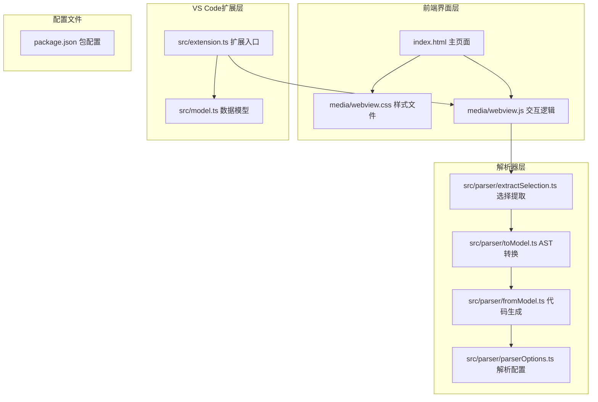
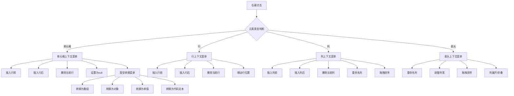
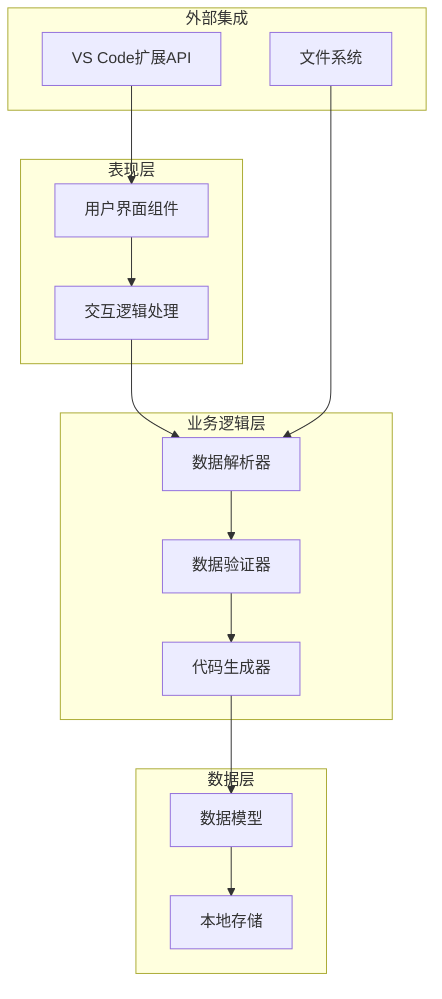
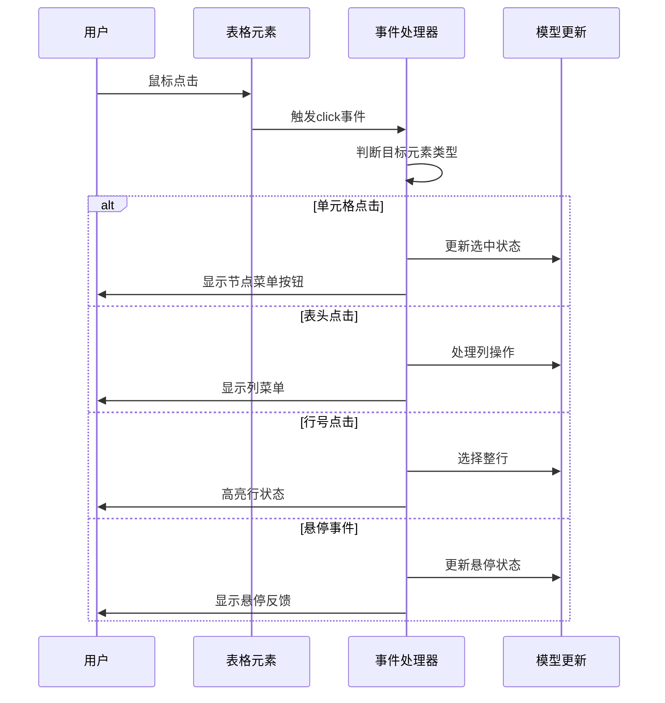
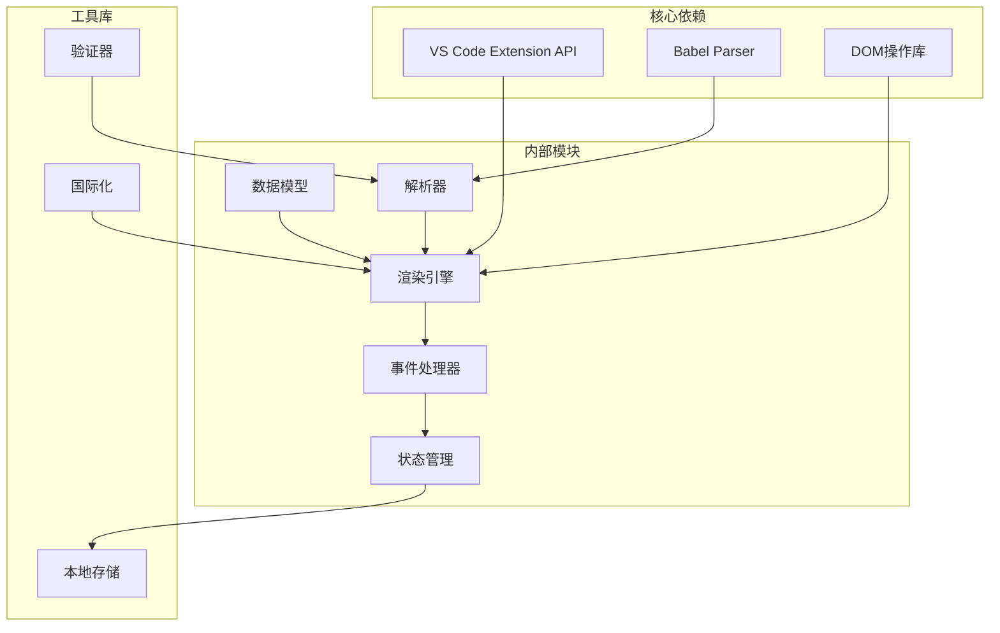

# 用户交互系统

<cite>
**本文档引用的文件**
- [index.html](file://index.html)
- [media/webview.js](file://media/webview.js)
- [media/webview.css](file://media/webview.css)
- [src/extension.ts](file://src/extension.ts)
- [src/model.ts](file://src/model.ts)
- [src/parser/extractSelection.ts](file://src/parser/extractSelection.ts)
- [src/parser/toModel.ts](file://src/parser/toModel.ts)
- [src/parser/fromModel.ts](file://src/parser/fromModel.ts)
- [src/parser/parserOptions.ts](file://src/parser/parserOptions.ts)
- [package.json](file://package.json)
</cite>

## 更新摘要
**所做更改**
- 更新了工具栏重组和按钮样式的描述，反映新的Excel风格交互体验
- 增强了上下文菜单系统的功能说明
- 优化了键盘快捷键支持的详细说明
- 更新了鼠标交互机制的实现细节
- 完善了表单输入处理和手势支持的说明
- 增加了无障碍访问和键盘导航优化的新特性

## 目录
1. [简介](#简介)
2. [项目结构](#项目结构)
3. [核心组件](#核心组件)
4. [架构概览](#架构概览)
5. [详细组件分析](#详细组件分析)
6. [依赖关系分析](#依赖关系分析)
7. [性能考虑](#性能考虑)
8. [故障排除指南](#故障排除指南)
9. [结论](#结论)

## 简介

用户交互系统是一个基于浏览器的嵌入式JSON编辑器，采用Excel风格的表格界面设计。该系统提供了丰富的用户交互功能，包括重组后的工具栏按钮、面包屑导航、增强的上下文菜单系统、优化的键盘快捷键支持、鼠标交互机制、表单输入处理、手势支持和触摸设备适配等。

系统的核心特点：
- **Excel风格的重组工具栏**：采用Ribbon设计，提供直观的Excel风格操作体验
- **多语言本地化支持**：支持中英文界面，动态语言切换
- **增强的上下文菜单**：提供丰富的节点操作选项和类型转换功能
- **优化的键盘导航**：全面的快捷键支持，提升编辑效率
- **高级交互特性**：缩略图导航、快速跳转、拖拽排序等功能
- **实时预览和状态反馈**：完整的撤销/重做功能和状态提示

## 项目结构

该项目采用模块化架构设计，主要分为以下几个核心部分：

**图表来源**
- [index.html:1174-1243](file://index.html#L1174-L1243)
- [media/webview.js:1132-1168](file://media/webview.js#L1132-L1168)
- [src/extension.ts:1-600](file://src/extension.ts#L1-L600)

**章节来源**
- [index.html:1-1599](file://index.html#L1-L1599)
- [media/webview.css:1-1169](file://media/webview.css#L1-L1169)
- [src/extension.ts:1-600](file://src/extension.ts#L1-L600)

## 核心组件

### 工具栏系统（重组版）

工具栏采用全新的Excel风格Ribbon设计，提供了一组完整的操作按钮，经过重大重组以提升用户体验：

**重组后的工具栏按钮**：
- **保存按钮**：将编辑结果写回到源文件，采用强调色设计
- **撤销按钮**：撤销上一步操作，支持快捷键Ctrl+Z
- **重做按钮**：重做被撤销的操作，支持快捷键Ctrl+Y
- **格式化按钮**：格式化JSON数据，支持Ctrl+Shift+F
- **压缩按钮**：压缩JSON数据，支持Ctrl+Shift+M
- **复制按钮**：复制JSON到剪贴板，支持Ctrl+C
- **导出按钮**：下载JSON文件，支持Ctrl+E
- **清除null按钮**：将所有null值转换为空字符串，支持Ctrl+Shift+N

**工具栏样式更新**：
- 采用现代化的圆角设计和阴影效果
- 按钮状态反馈更加直观（悬停、激活状态）
- 支持按钮分组和分隔符，提升视觉层次
- 响应式布局，适配不同屏幕尺寸

### 面包屑导航

面包屑导航提供了层级路径的可视化显示，支持点击跳转到任意层级：

- **路径分段**：自动解析JSON路径并生成可点击的导航段
- **当前状态标识**：使用特殊样式标识当前聚焦的节点
- **焦点状态徽章**：显示当前处于聚焦模式的状态
- **动态更新**：随编辑操作实时更新路径状态

### 上下文菜单系统（增强版）

系统实现了完整的上下文菜单功能，根据不同元素类型提供相应的操作选项，经过重大增强：

**增强功能**：
- **类型转换**：支持将节点转换为不同数据类型
- **批量操作**：支持对选区进行批量转换和操作
- **智能菜单**：根据上下文动态显示相关操作选项
- **快捷操作**：提供常用操作的直接访问

### 键盘快捷键支持（优化版）

系统提供了全面且优化的键盘导航支持：

**编辑快捷键**：
- Ctrl+C：复制选中内容
- Ctrl+V：粘贴内容
- Ctrl+Z：撤销操作
- Ctrl+Y：重做操作
- Enter：开始编辑单元格
- Tab：移动到下一个单元格
- Shift+Tab：移动到上一个单元格
- Esc：取消编辑

**导航快捷键**：
- Ctrl+滚轮：缩放编辑区域
- Ctrl+K：快速跳转到节点
- Ctrl+Shift+F：格式化JSON
- Ctrl+Shift+M：压缩JSON
- Ctrl+Shift+N：清除null值
- Ctrl+E：导出JSON

**操作快捷键**：
- Delete：删除选中内容
- Insert：插入新行/列
- Backspace：清空单元格
- Alt+Enter：在编辑器中换行

**新增快捷键**：
- Ctrl+Alt+方向键：在代码编辑器中进行块选择
- Ctrl+Shift+方向键：扩展选择范围
- Ctrl+Shift+L：锁定列宽
- Ctrl+Shift+R：重置列宽

**章节来源**
- [media/webview.js:510-524](file://media/webview.js#L510-L524)
- [media/webview.js:1521-1561](file://media/webview.js#L1521-L1561)
- [media/webview.js:4215-4414](file://media/webview.js#L4215-L4414)

## 架构概览

系统采用分层架构设计，确保了良好的模块分离和可维护性：

**图表来源**
- [src/extension.ts:349-377](file://src/extension.ts#L349-L377)
- [src/parser/extractSelection.ts:34-101](file://src/parser/extractSelection.ts#L34-L101)
- [src/parser/toModel.ts:10-90](file://src/parser/toModel.ts#L10-L90)

## 详细组件分析

### 表格渲染引擎

表格渲染引擎是系统的核心组件，负责将JSON数据转换为可交互的Excel风格表格：

#### 表头系统
- **动态列生成**：根据JSON数据结构自动生成列定义
- **列宽管理**：支持手动调整列宽和自动宽度计算
- **排序功能**：支持按列进行升序/降序排序
- **类型标识**：在表头显示数据类型标签
- **拖拽排序**：支持列的拖拽重新排列

#### 单元格渲染
- **多类型支持**：支持字符串、数字、布尔值、null、对象、数组等多种数据类型
- **嵌套内容**：对象和数组类型的单元格支持展开/折叠
- **编辑模式**：文本内容支持直接编辑，数值内容支持格式化显示
- **状态指示**：通过CSS类名标识单元格的不同状态
- **代码编辑器**：支持JavaScript代码的专用编辑器

#### 行管理系统
- **行号显示**：左侧显示行号，支持Excel风格的行选择
- **行操作**：支持插入、删除、移动行等操作
- **拖拽支持**：行可以通过拖拽重新排序
- **智能预览**：支持嵌套内容的智能预览

### 交互事件处理

系统实现了完整的事件处理机制，支持多种用户交互方式：

#### 鼠标事件处理

**图表来源**
- [media/webview.js:390-417](file://media/webview.js#L390-L417)
- [media/webview.js:1936-1951](file://media/webview.js#L1936-L1951)

#### 键盘事件处理
- **全局快捷键**：支持Ctrl+Z、Ctrl+Y等全局快捷键
- **单元格编辑**：Enter键开始编辑，Esc键取消编辑
- **导航快捷键**：Arrow键在单元格间导航
- **组合快捷键**：Ctrl+Shift+方向键进行范围选择
- **代码编辑**：支持Tab键进行缩进，Ctrl+Enter完成编辑

#### 触摸和手势支持
- **触摸滚动**：支持在移动设备上的平滑滚动
- **手势缩放**：支持双指缩放操作
- **触摸选择**：支持长按进行选择操作
- **响应式布局**：自动适应不同屏幕尺寸
- **手势导航**：支持滑动手势进行页面导航

### 状态管理和持久化

系统实现了完整的状态管理机制：

#### UI状态持久化
- **布局状态**：记住工具栏、输入面板、缩略图的位置和大小
- **用户偏好**：保存语言偏好、缩放级别等用户设置
- **编辑历史**：保存撤销/重做栈，支持多步操作恢复
- **临时状态**：保存当前编辑状态和选择状态

#### 数据状态同步
- **实时同步**：编辑操作实时反映到数据模型
- **状态检查**：在关键操作前检查数据有效性
- **错误恢复**：提供错误状态下的安全恢复机制
- **模型映射**：维护数据模型与DOM元素的映射关系

**章节来源**
- [media/webview.js:1251-1294](file://media/webview.js#L1251-L1294)
- [media/webview.js:1568-1588](file://media/webview.js#L1568-L1588)

## 依赖关系分析

系统各组件之间的依赖关系如下：

**图表来源**
- [src/extension.ts:6-15](file://src/extension.ts#L6-L15)
- [src/parser/extractSelection.ts:6-11](file://src/parser/extractSelection.ts#L6-L11)
- [package.json:86-91](file://package.json#L86-L91)

### 外部依赖

系统的主要外部依赖包括：

| 依赖包 | 版本 | 用途 |
|--------|------|------|
| @babel/parser | ^7.23.0 | JavaScript代码解析 |
| @babel/generator | ^7.23.0 | 代码生成 |
| @babel/types | ^7.23.0 | 类型定义 |
| monaco-editor | ^0.52.0 | 代码编辑器（可选） |

**章节来源**
- [package.json:78-91](file://package.json#L78-L91)
- [src/parser/parserOptions.ts:3-17](file://src/parser/parserOptions.ts#L3-L17)

## 性能考虑

系统在设计时充分考虑了性能优化：

### 渲染优化
- **虚拟滚动**：对于大型数据集，使用虚拟滚动技术只渲染可见区域
- **增量更新**：只更新发生变化的数据，避免全量重新渲染
- **防抖处理**：对频繁触发的事件进行防抖处理
- **CSS动画优化**：使用transform和opacity属性进行硬件加速

### 内存管理
- **对象池**：复用DOM元素和JavaScript对象
- **垃圾回收**：及时清理不再使用的事件监听器和定时器
- **内存泄漏防护**：确保所有注册的事件都有对应的清理函数
- **状态清理**：在组件销毁时清理相关的状态和事件

### 网络优化
- **懒加载**：非关键资源采用懒加载策略
- **缓存机制**：合理使用浏览器缓存和应用内缓存
- **压缩传输**：对传输的数据进行适当的压缩
- **增量更新**：只传输变化的数据部分

## 故障排除指南

### 常见问题及解决方案

#### 编辑器无法加载
**症状**：页面空白或加载失败  
**可能原因**：
- JavaScript文件加载失败
- CSS样式文件缺失
- 浏览器兼容性问题

**解决步骤**：
1. 检查浏览器控制台是否有JavaScript错误
2. 验证CSS文件是否正确加载
3. 确认浏览器版本满足最低要求

#### 数据解析错误
**症状**：导入JSON时出现解析错误  
**可能原因**：
- JSON格式不正确
- 包含不支持的JavaScript语法
- 文件编码问题

**解决步骤**：
1. 使用在线JSON验证工具检查格式
2. 确认文件编码为UTF-8
3. 移除不支持的JavaScript语法

#### 交互功能异常
**症状**：按钮无响应或菜单无法打开  
**可能原因**：
- 事件监听器冲突
- CSS样式覆盖
- 浏览器扩展干扰

**解决步骤**：
1. 检查事件绑定是否正常
2. 验证CSS选择器优先级
3. 在无扩展模式下测试

### 调试工具

系统提供了内置的调试和诊断功能：

#### 状态监控
- **实时状态显示**：显示当前编辑器状态
- **操作日志**：记录重要的用户操作
- **性能指标**：监控渲染性能和内存使用

#### 错误报告
- **自动错误捕获**：捕获并报告JavaScript异常
- **用户反馈**：提供友好的错误信息
- **日志收集**：收集详细的错误日志用于分析

**章节来源**
- [media/webview.js:526-531](file://media/webview.js#L526-L531)
- [media/webview.js:1526-1561](file://media/webview.js#L1526-L1561)

## 结论

用户交互系统是一个功能完整、设计精良的JSON编辑器，经过重大改进后具有以下显著特点：

### 技术优势
- **现代化架构**：采用模块化设计，易于维护和扩展
- **Excel风格界面**：重组后的工具栏提供直观的Excel风格操作体验
- **丰富功能**：提供完整的JSON编辑和管理功能
- **良好性能**：优化的渲染和交互机制
- **跨平台支持**：既可在浏览器中独立运行，也可作为VS Code扩展使用

### 用户体验特色
- **直观界面**：Excel风格的设计降低了学习成本
- **高效交互**：丰富的快捷键和增强的上下文菜单提升工作效率
- **智能反馈**：实时的状态提示和错误处理
- **个性化定制**：支持多语言和主题定制
- **无障碍访问**：完善的键盘导航和屏幕阅读器支持

### 新增功能亮点
- **重组工具栏**：提供更直观的Excel风格操作界面
- **增强上下文菜单**：支持类型转换和批量操作
- **优化键盘快捷键**：全面的快捷键支持提升编辑效率
- **手势支持**：完善的手势和触摸设备适配
- **无障碍访问**：增强的键盘导航和辅助功能

### 发展前景
系统为未来的功能扩展奠定了良好的基础，可以进一步增强：
- 更强大的数据验证和转换功能
- 更丰富的可视化图表支持
- 更完善的协作编辑功能
- 更智能的代码补全和建议

该系统为用户提供了一个强大而易用的JSON数据编辑解决方案，在开发效率和用户体验方面都达到了较高水平，特别是新的Excel风格交互体验为用户提供了更加专业和高效的编辑环境。