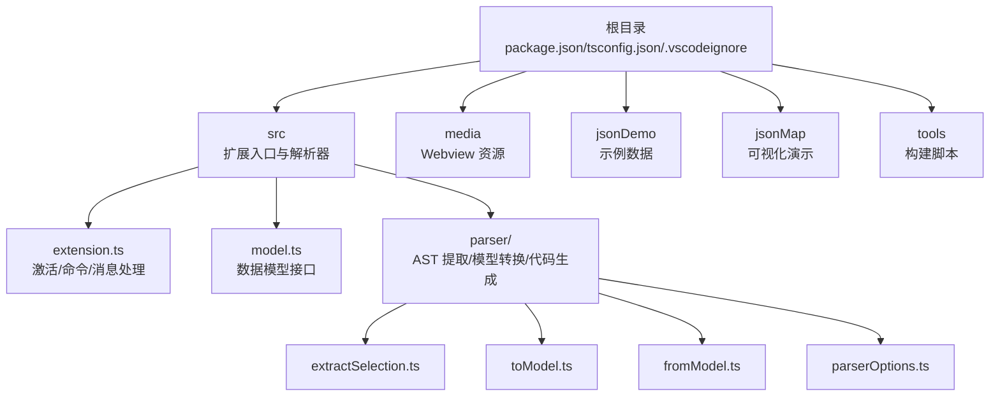
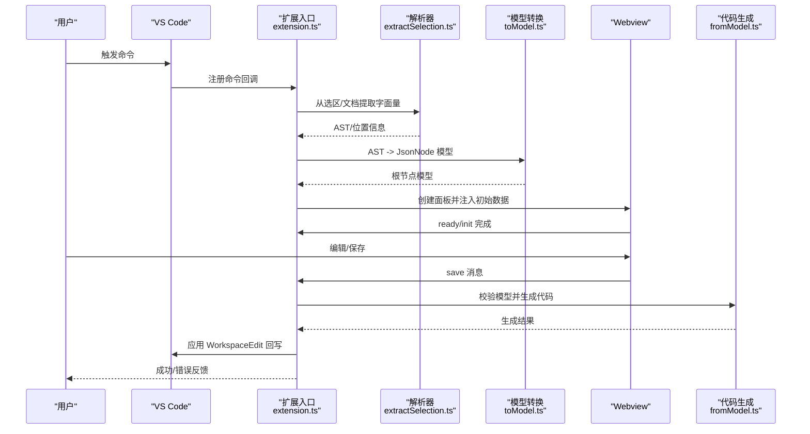
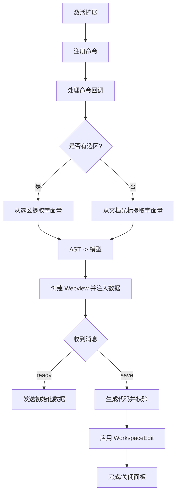
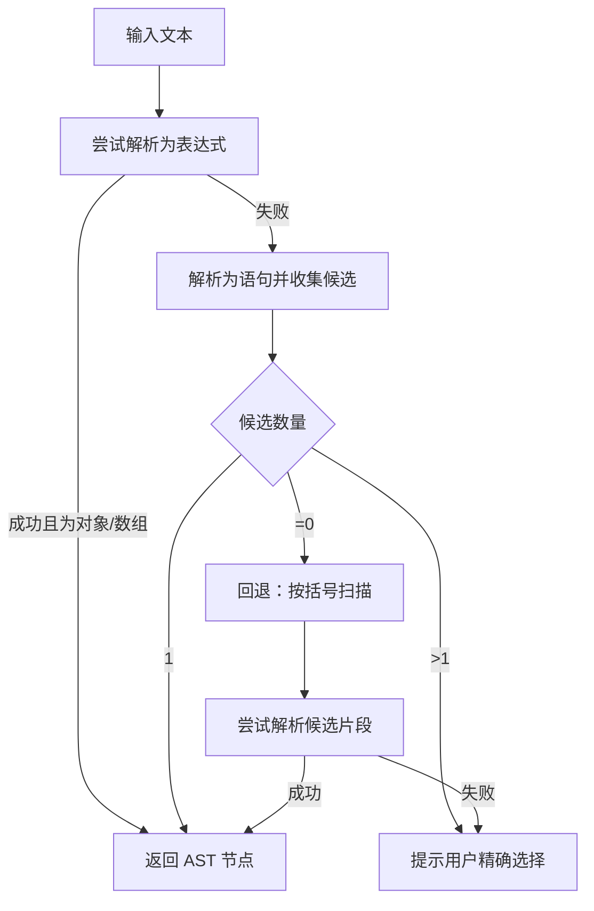
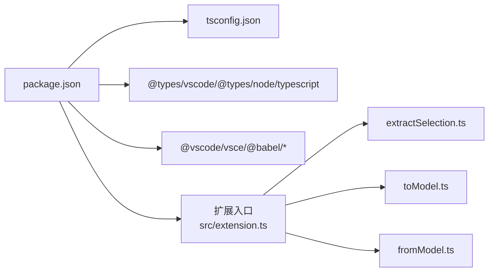

# 开发环境搭建

<cite>
**本文引用的文件**
- [package.json](file://package.json)
- [tsconfig.json](file://tsconfig.json)
- [src/extension.ts](file://src/extension.ts)
- [src/model.ts](file://src/model.ts)
- [src/parser/extractSelection.ts](file://src/parser/extractSelection.ts)
- [src/parser/toModel.ts](file://src/parser/toModel.ts)
- [src/parser/fromModel.ts](file://src/parser/fromModel.ts)
- [src/parser/parserOptions.ts](file://src/parser/parserOptions.ts)
- [.vscodeignore](file://.vscodeignore)
- [package.nls.json](file://package.nls.json)
- [package.nls.zh-CN.json](file://package.nls.zh-CN.json)
- [README.md](file://README.md)
</cite>

## 目录
1. [简介](#简介)
2. [项目结构](#项目结构)
3. [核心组件](#核心组件)
4. [架构总览](#架构总览)
5. [详细组件分析](#详细组件分析)
6. [依赖关系分析](#依赖关系分析)
7. [性能注意事项](#性能注意事项)
8. [故障排除指南](#故障排除指南)
9. [结论](#结论)
10. [附录](#附录)

## 简介
本指南面向希望在本地搭建 JSONOKOK VS Code 扩展开发环境的开发者，涵盖以下内容：
- Node.js 环境要求与安装建议
- VS Code 扩展开发工具包（VSCE）安装与使用
- 项目依赖安装与编译配置
- TypeScript 编译配置（tsconfig.json）关键项说明
- 开发工作流（npm scripts：compile、watch、test）
- 在 VS Code 中调试扩展
- 常见环境问题与验证步骤

## 项目结构
该仓库包含 VS Code 扩展的核心源码、类型定义、解析器模块、国际化资源以及示例 JSON 数据等。关键目录与文件如下：
- 根目录：包管理与构建脚本、国际化文案、忽略规则
- src：扩展入口、数据模型、解析器（AST 提取、模型转换、代码生成）
- media：Webview 资源（CSS/JS）
- jsonDemo：示例 JSON 数据与说明
- jsonMap：可视化演示页面
- tools：构建脚本（PowerShell）

图表来源
- [package.json](file://package.json)
- [src/extension.ts](file://src/extension.ts)
- [src/model.ts](file://src/model.ts)
- [src/parser/extractSelection.ts](file://src/parser/extractSelection.ts)
- [src/parser/toModel.ts](file://src/parser/toModel.ts)
- [src/parser/fromModel.ts](file://src/parser/fromModel.ts)
- [src/parser/parserOptions.ts](file://src/parser/parserOptions.ts)

章节来源
- [package.json](file://package.json)
- [tsconfig.json](file://tsconfig.json)
- [.vscodeignore](file://.vscodeignore)

## 核心组件
- 扩展入口与生命周期：负责注册命令、激活/停用逻辑、Webview 初始化与消息收发。
- 数据模型：统一表示 JSON/JS 值（对象、数组、字符串、数字、布尔、null、代码文本），用于表格 UI 与回写。
- 解析器模块：
  - 从选区/文档中提取对象/数组字面量（AST + 回退括号匹配）
  - 将 AST 转换为中间模型
  - 将修改后的模型生成回写代码并进行语法校验
- 国际化：提供英文与中文文案映射。

章节来源
- [src/extension.ts](file://src/extension.ts)
- [src/model.ts](file://src/model.ts)
- [src/parser/extractSelection.ts](file://src/parser/extractSelection.ts)
- [src/parser/toModel.ts](file://src/parser/toModel.ts)
- [src/parser/fromModel.ts](file://src/parser/fromModel.ts)
- [package.nls.json](file://package.nls.json)
- [package.nls.zh-CN.json](file://package.nls.zh-CN.json)

## 架构总览
下图展示从用户触发命令到 Webview 初始化、消息交互与最终回写的端到端流程。

图表来源
- [src/extension.ts](file://src/extension.ts)
- [src/parser/extractSelection.ts](file://src/parser/extractSelection.ts)
- [src/parser/toModel.ts](file://src/parser/toModel.ts)
- [src/parser/fromModel.ts](file://src/parser/fromModel.ts)

## 详细组件分析

### 组件一：扩展入口（extension.ts）
职责与要点：
- 注册命令（双语菜单支持）
- 从编辑器选区或光标位置提取字面量
- 将 AST 转为中间模型并初始化 Webview
- 处理 Webview 的保存请求，生成代码并应用回写

图表来源
- [src/extension.ts](file://src/extension.ts)

章节来源
- [src/extension.ts](file://src/extension.ts)

### 组件二：解析器（extractSelection.ts）
职责与要点：
- 从选区尝试直接解析表达式
- 若失败则解析为语句，收集候选对象/数组字面量
- 文档级提取：基于 AST 偏移定位最深包裹节点
- 回退策略：按括号匹配扫描并二次解析

图表来源
- [src/parser/extractSelection.ts](file://src/parser/extractSelection.ts)

章节来源
- [src/parser/extractSelection.ts](file://src/parser/extractSelection.ts)

### 组件三：模型转换（toModel.ts）
职责与要点：
- 将 AST 节点映射为 JsonNode
- 对象属性键名支持标识符/字符串/数值；计算属性降级为代码文本
- 数组元素支持普通值与扩展运算符（标记不可编辑）
- 非支持节点降级为代码文本节点并标注警告

章节来源
- [src/parser/toModel.ts](file://src/parser/toModel.ts)
- [src/model.ts](file://src/model.ts)

### 组件四：代码生成与校验（fromModel.ts）
职责与要点：
- 递归生成代码，保持缩进与格式
- 对代码文本节点进行语法校验（表达式/对象方法）
- 支持对象方法与多行代码块的正确缩进输出

章节来源
- [src/parser/fromModel.ts](file://src/parser/fromModel.ts)
- [src/parser/parserOptions.ts](file://src/parser/parserOptions.ts)

### 组件五：TypeScript 编译配置（tsconfig.json）
关键设置说明：
- 目标版本：ES2020
- 模块系统：CommonJS
- 严格模式：开启（提升类型安全）
- 映射与声明：启用 sourceMap、declaration、declarationMap
- 包含/排除：仅编译 src，排除 node_modules、dist、测试文件

章节来源
- [tsconfig.json](file://tsconfig.json)

## 依赖关系分析
- 包管理与脚本：package.json 定义了编译、监听、测试与打包脚本，以及开发与运行时依赖。
- VS Code 引擎兼容：要求 VS Code 版本 ^1.85.0。
- 关键依赖：
  - @types/vscode：VS Code API 类型
  - @types/node：Node.js 类型
  - typescript：编译器
  - @vscode/vsce：打包扩展
  - @babel/*：AST 解析与生成
  - monaco-editor：编辑器（Webview 使用）

图表来源
- [package.json](file://package.json)
- [tsconfig.json](file://tsconfig.json)
- [src/extension.ts](file://src/extension.ts)
- [src/parser/extractSelection.ts](file://src/parser/extractSelection.ts)
- [src/parser/toModel.ts](file://src/parser/toModel.ts)
- [src/parser/fromModel.ts](file://src/parser/fromModel.ts)

章节来源
- [package.json](file://package.json)

## 性能注意事项
- AST 解析与遍历：在大型文档中进行全量解析可能带来开销，建议在文档边界内限制扫描窗口（已在括号回退策略中体现）。
- 生成代码时的缩进处理：对多行代码块进行逐行缩进，避免不必要的字符串拼接成本。
- Webview 初始化：仅在 ready 事件后发送初始化数据，减少不必要的通信。

## 故障排除指南
- Node.js 版本不匹配
  - 症状：安装依赖时报错或编译失败
  - 排查：确认 Node.js 版本满足扩展引擎要求（VS Code ^1.85.0），并确保全局 TypeScript 与 VSCE 可用
  - 验证：执行 npm install 与 tsc -p ./，观察错误信息
- VS Code 扩展打包失败
  - 症状：执行打包脚本报错
  - 排查：检查 package.json 中的 main、activationEvents、contributes 等字段是否正确
  - 验证：使用 VS Code 打开扩展根目录，按 F5 启动调试，确认无报错
- Webview 无法加载或保存失败
  - 症状：面板空白或保存时报错
  - 排查：检查媒体资源路径与 CSP 设置；确认生成代码通过语法校验
  - 验证：在扩展中打开一个 JS/TS 文件，选中对象/数组字面量，确认面板正常初始化与保存
- 国际化文案未生效
  - 症状：菜单标题未本地化
  - 排查：确认 package.nls.json 与 zh-CN 对应键值存在
  - 验证：切换 VS Code 语言后，菜单标题应随之变化

章节来源
- [package.json](file://package.json)
- [src/extension.ts](file://src/extension.ts)
- [package.nls.json](file://package.nls.json)
- [package.nls.zh-CN.json](file://package.nls.zh-CN.json)

## 结论
本指南提供了从环境准备到开发调试的完整路径。遵循上述步骤可快速搭建 JSONOKOK 扩展开发环境，并通过 npm scripts 与 VS Code 调试能力高效迭代。遇到问题时，可依据故障排除章节逐项验证与修复。

## 附录

### 开发环境搭建步骤
- 安装 Node.js（版本需满足 VS Code 引擎要求）
- 安装 VS Code 扩展开发工具包（VSCE）
- 在项目根目录安装依赖
- 使用 npm scripts 进行编译与监听
- 在 VS Code 中按 F5 启动调试

章节来源
- [package.json](file://package.json)
- [README.md](file://README.md)