# 开发者指南

<cite>
**本文档引用的文件**
- [package.json](file://package.json)
- [tsconfig.json](file://tsconfig.json)
- [src/extension.ts](file://src/extension.ts)
- [src/model.ts](file://src/model.ts)
- [src/parser/extractSelection.ts](file://src/parser/extractSelection.ts)
- [src/parser/toModel.ts](file://src/parser/toModel.ts)
- [src/parser/fromModel.ts](file://src/parser/fromModel.ts)
- [src/parser/parserOptions.ts](file://src/parser/parserOptions.ts)
- [media/webview.js](file://media/webview.js)
- [media/webview.css](file://media/webview.css)
- [tools/build-webview.ps1](file://tools/build-webview.ps1)
- [.github/workflows/github-pages.yml](file://.github/workflows/github-pages.yml)
- [jsonDemo/字段值string是jons文本-便于数据库保存.json](file://jsonDemo/字段值string是jons文本-便于数据库保存.json)
- [jsonDemo/超大json家庭地址.json](file://jsonDemo/超大json家庭地址.json)
- [todo.md](file://todo.md)
- [部署方式/vscodeExtension/package.json](file://部署方式/vscodeExtension/package.json)
- [部署方式/vscodeExtension/package-lock.json](file://部署方式/vscodeExtension/package-lock.json)
- [部署方式/deploy_py.py](file://部署方式/deploy_py.py)
- [src/help/site-lib/rss.xml](file://src/help/site-lib/rss.xml)
- [src/help - 副本/site-lib/rss.xml](file://src/help - 副本/site-lib/rss.xml)
- [部署方式/vscodeExtension/src/help/site-lib/rss.xml](file://部署方式/vscodeExtension/src/help/site-lib/rss.xml)
- [部署方式/网页部署/src/help/site-lib/rss.xml](file://部署方式/网页部署/src/help/site-lib/rss.xml)
- [閮ㄧ讲鏂瑰紡\缃戦〉閮ㄧ讲\src/help/site-lib/rss.xml](file://閮ㄧ讲鏂瑰紡\缃戦〉閮ㄧ讲\src/help/site-lib/rss.xml)
- [src/help/site-lib/styles/global-variable-styles.css](file://src/help/site-lib/styles/global-variable-styles.css)
- [src/help/site-lib/styles/snippets.css](file://src/help/site-lib/styles/snippets.css)
- [src/help/site-lib/scripts/](file://src/help/site-lib/scripts/)
- [src/help/site-lib/html/file-tree-content.html](file://src/help/site-lib/html/file-tree-content.html)
- [src/help/jsonokok.html](file://src/help/jsonokok.html)
- [src/help - 副本/jsonokok.html](file://src/help - 副本/jsonokok.html)
</cite>

## 更新摘要
**所做更改**
- 更新了帮助系统的增强功能，包括改进的样式系统和 RSS 集成功能
- 新增了更全面的 JSON 编辑功能覆盖说明
- 更新了帮助系统文件结构和资源组织方式
- 增强了帮助系统的可维护性和扩展性

## 目录
1. [简介](#简介)
2. [项目结构](#项目结构)
3. [核心组件](#核心组件)
4. [架构概览](#架构概览)
5. [详细组件分析](#详细组件分析)
6. [依赖关系分析](#依赖关系分析)
7. [性能考虑](#性能考虑)
8. [故障排除指南](#故障排除指南)
9. [结论](#结论)
10. [附录](#附录)

## 简介

wysJSON 是一个为 VS Code 设计的嵌套 JSON 表格编辑器扩展。该项目允许用户通过直观的表格界面编辑 JavaScript 对象和数组数据，支持多种编程语言和文件类型。

该扩展的核心功能包括：
- 从 VS Code 编辑器中提取 JSON 数据
- 提供可视化表格编辑界面
- 支持复杂嵌套结构的编辑
- 实时数据验证和错误处理
- 多语言支持（中英文）

**更新** 新增对 esbuild 构建工具的支持，优化构建性能和打包效率。帮助系统现已包含改进的样式系统、RSS 集成功能和更全面的 JSON 编辑功能覆盖。

## 项目结构

项目采用模块化的 TypeScript 架构，主要分为以下几个核心目录：

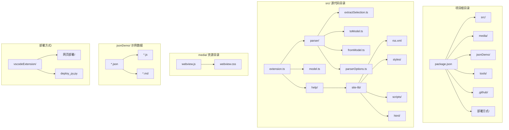

**图表来源**
- [package.json:1-93](file://package.json#L1-L93)
- [src/extension.ts:1-600](file://src/extension.ts#L1-L600)
- [media/webview.js:1-800](file://media/webview.js#L1-L800)
- [部署方式/vscodeExtension/package.json:110-131](file://部署方式/vscodeExtension/package.json#L110-L131)

**章节来源**
- [package.json:1-93](file://package.json#L1-L93)
- [tsconfig.json:1-25](file://tsconfig.json#L1-L25)

## 核心组件

### 扩展入口点

扩展的主要入口点位于 `src/extension.ts`，负责处理 VS Code 激活事件和命令注册。

### 数据模型系统

`src/model.ts` 定义了核心的数据模型接口，包括：
- JsonNode：表示 JSON 数据节点的统一模型
- SourceInfo：源文件信息
- 各种消息类型定义

### 解析器模块

项目包含三个核心解析器模块：
- `extractSelection.ts`：从选区或整个文档中提取 JSON 结构
- `toModel.ts`：将 AST 节点转换为内部模型
- `fromModel.ts`：将编辑后的模型转换回代码

### 帮助系统模块

**更新** 帮助系统现已包含完整的样式系统和 RSS 集成功能：

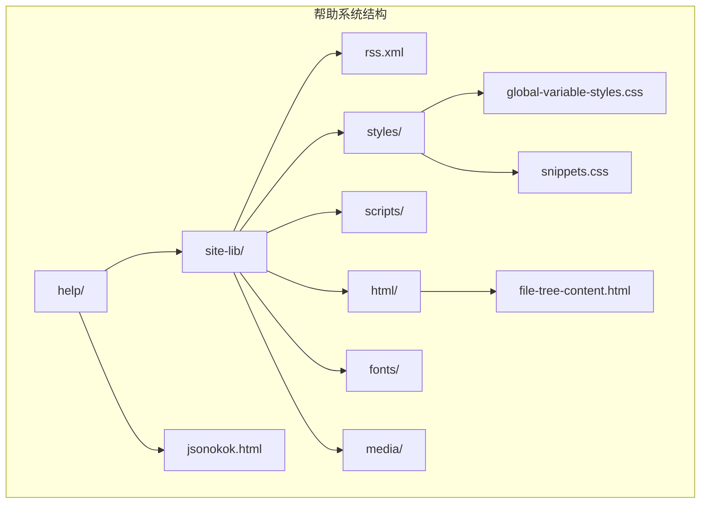

**图表来源**
- [src/help/site-lib/rss.xml](file://src/help/site-lib/rss.xml)
- [src/help/site-lib/styles/global-variable-styles.css](file://src/help/site-lib/styles/global-variable-styles.css)
- [src/help/site-lib/styles/snippets.css](file://src/help/site-lib/styles/snippets.css)
- [src/help/site-lib/html/file-tree-content.html](file://src/help/site-lib/html/file-tree-content.html)

**章节来源**
- [src/extension.ts:1-600](file://src/extension.ts#L1-L600)
- [src/model.ts:1-103](file://src/model.ts#L1-L103)
- [src/parser/extractSelection.ts:1-385](file://src/parser/extractSelection.ts#L1-L385)
- [src/parser/toModel.ts:1-230](file://src/parser/toModel.ts#L1-L230)
- [src/parser/fromModel.ts:1-305](file://src/parser/fromModel.ts#L1-L305)

## 架构概览

wysJSON 采用分层架构设计，实现了清晰的职责分离：

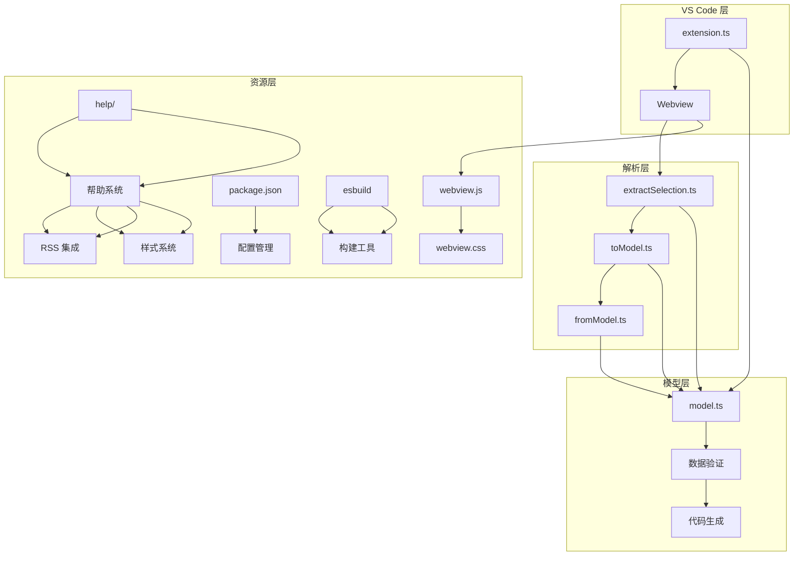

**图表来源**
- [src/extension.ts:19-44](file://src/extension.ts#L19-L44)
- [src/parser/extractSelection.ts:34-101](file://src/parser/extractSelection.ts#L34-L101)
- [src/parser/toModel.ts:10-90](file://src/parser/toModel.ts#L10-L90)
- [src/parser/fromModel.ts:20-57](file://src/parser/fromModel.ts#L20-L57)
- [部署方式/vscodeExtension/package.json:122](file://部署方式/vscodeExtension/package.json#L122)

### 数据流处理

扩展的数据处理流程遵循以下模式：

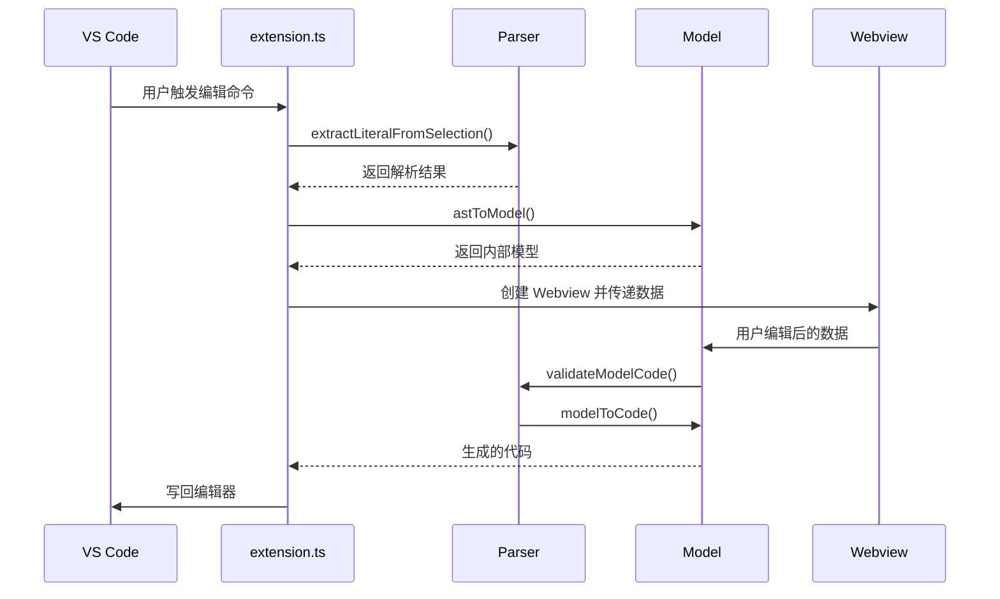

**图表来源**
- [src/extension.ts:46-378](file://src/extension.ts#L46-L378)
- [src/parser/extractSelection.ts:34-101](file://src/parser/extractSelection.ts#L34-L101)
- [src/parser/toModel.ts:10-90](file://src/parser/toModel.ts#L10-L90)
- [src/parser/fromModel.ts:20-57](file://src/parser/fromModel.ts#L20-L57)

## 详细组件分析

### 扩展激活和生命周期

扩展的激活过程涉及多个关键步骤：

```mermaid
flowchart TD
A[VS Code 启动] --> B[extension.activate()]
B --> C[注册命令]
C --> D[设置上下文键]
D --> E[等待用户交互]
E --> F{用户选择数据}
F --> |选择区域| G[extractLiteralFromSelection]
F --> |无选择| H[extractLiteralFromDocument]
G --> I[astToModel]
H --> I
I --> J[创建 Webview]
J --> K[传递初始化数据]
```

**图表来源**
- [src/extension.ts:19-44](file://src/extension.ts#L19-L44)
- [src/extension.ts:46-120](file://src/extension.ts#L46-L120)

### 选择提取算法

选择提取模块实现了智能的数据提取逻辑：

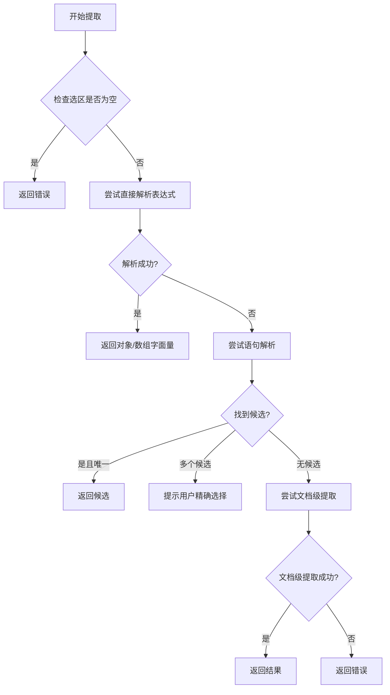

**图表来源**
- [src/parser/extractSelection.ts:34-101](file://src/parser/extractSelection.ts#L34-L101)
- [src/parser/extractSelection.ts:108-229](file://src/parser/extractSelection.ts#L108-L229)

### 模型转换系统

模型转换系统提供了双向的数据转换能力：

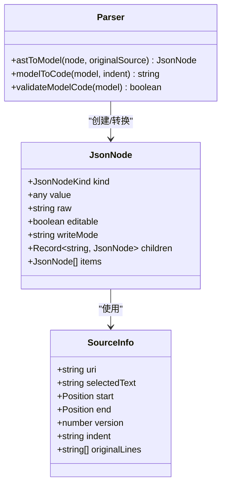

**图表来源**
- [src/model.ts:15-54](file://src/model.ts#L15-L54)
- [src/parser/toModel.ts:10-90](file://src/parser/toModel.ts#L10-L90)
- [src/parser/fromModel.ts:20-57](file://src/parser/fromModel.ts#L20-L57)

### Webview 集成

Webview 集成模块提供了完整的前端交互界面：

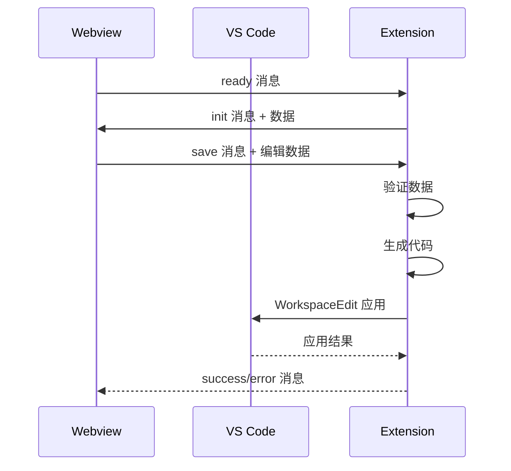

**图表来源**
- [media/webview.js:375-377](file://media/webview.js#L375-L377)
- [src/extension.ts:397-490](file://src/extension.ts#L397-L490)

### 帮助系统增强功能

**更新** 帮助系统现已包含以下增强功能：

#### 改进的样式系统

帮助系统采用了现代化的样式架构：

```mermaid
graph TB
subgraph "样式系统"
A[styles/] --> B[global-variable-styles.css]
A --> C[snippets.css]
B --> D[全局变量定义]
C --> E[代码片段样式]
D --> F[颜色主题]
D --> G[字体设置]
D --> H[布局样式]
E --> I[语法高亮]
E --> J[代码块美化]
```

**图表来源**
- [src/help/site-lib/styles/global-variable-styles.css](file://src/help/site-lib/styles/global-variable-styles.css)
- [src/help/site-lib/styles/snippets.css](file://src/help/site-lib/styles/snippets.css)

#### RSS 集成功能

帮助系统现在支持 RSS 订阅功能：

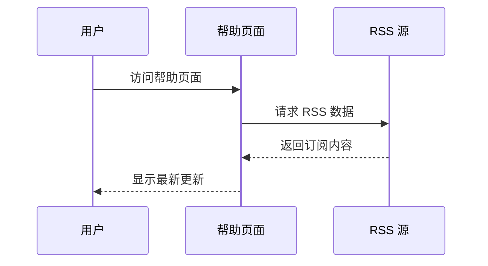

**图表来源**
- [src/help/site-lib/rss.xml](file://src/help/site-lib/rss.xml)

#### 更全面的 JSON 编辑功能覆盖

帮助系统现在提供更全面的 JSON 编辑功能说明：

```mermaid
graph TB
subgraph "JSON 编辑功能"
A[基础编辑] --> B[对象编辑]
A --> C[数组编辑]
A --> D[嵌套结构编辑]
B --> E[属性添加/删除]
B --> F[值修改]
C --> G[元素添加/删除]
C --> H[索引操作]
D --> I[深度编辑]
D --> J[结构重组]
```

**章节来源**
- [src/extension.ts:46-378](file://src/extension.ts#L46-L378)
- [src/parser/extractSelection.ts:1-385](file://src/parser/extractSelection.ts#L1-L385)
- [src/parser/toModel.ts:1-230](file://src/parser/toModel.ts#L1-L230)
- [src/parser/fromModel.ts:1-305](file://src/parser/fromModel.ts#L1-L305)

## 依赖关系分析

### 核心依赖

项目的主要依赖包括：

```mermaid
graph TB
subgraph "运行时依赖"
A[@babel/parser] --> B[AST 解析]
C[@babel/generator] --> D[代码生成]
E[monaco-editor] --> F[编辑器组件]
end
subgraph "开发依赖"
G[typescript] --> H[类型检查]
I[@types/node] --> J[Node.js 类型]
K[@types/vscode] --> L[VS Code API 类型]
M[@vscode/vsce] --> N[打包工具]
O[esbuild] --> P[快速构建工具]
end
subgraph "构建工具"
Q[tsc] --> R[TypeScript 编译]
S[PowerShell] --> T[资源构建]
U[esbuild] --> V[现代化构建]
end
```

**图表来源**
- [package.json:77-92](file://package.json#L77-L92)
- [package.json:69-76](file://package.json#L69-L76)
- [部署方式/vscodeExtension/package.json:122](file://部署方式/vscodeExtension/package.json#L122)

### 版本兼容性

项目严格遵循 VS Code API 兼容性要求：
- VS Code 引擎版本：^1.85.0
- Node.js 版本：与 VS Code 1.85.0 兼容
- TypeScript 版本：^5.3.0
- esbuild 版本：^0.25.5

**更新** 新增 esbuild 依赖，提供更快的构建速度和更好的打包性能。

**章节来源**
- [package.json:8-10](file://package.json#L8-L10)
- [package.json:77-92](file://package.json#L77-L92)
- [部署方式/vscodeExtension/package.json:122](file://部署方式/vscodeExtension/package.json#L122)

## 性能考虑

### 大数据集处理

针对超大 JSON 文件，项目采用了渐进式加载策略：

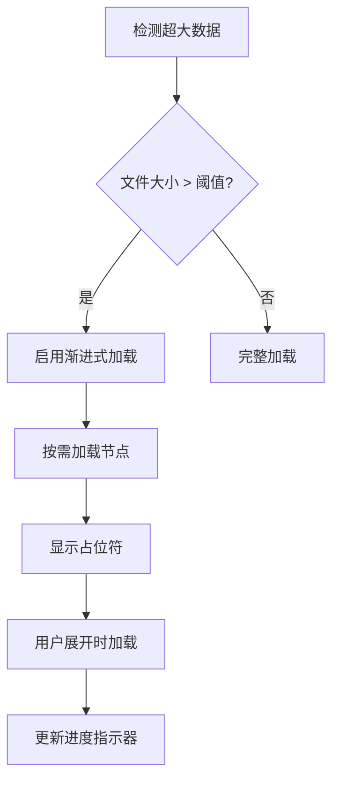

**图表来源**
- [todo.md:3-6](file://todo.md#L3-L6)

### 内存优化

项目实施了多项内存优化措施：
- 使用增量解析避免一次性加载整个文件
- 实现对象池减少垃圾回收压力
- 采用虚拟滚动处理大型表格数据
- 及时清理不再使用的资源

### 构建性能优化

**更新** 新增 esbuild 构建工具带来的性能提升：
- esbuild 提供了比传统 TypeScript 编译器更快的构建速度
- 支持多平台预构建二进制文件，减少安装时间
- 更好的 Tree Shaking 支持，减小最终包体积
- 内置的资源处理能力，简化构建配置

### 帮助系统性能优化

**更新** 帮助系统的性能优化措施：
- 采用模块化样式系统，支持按需加载
- RSS 内容缓存机制，减少重复请求
- 优化的 HTML 结构，提高渲染性能
- 压缩的 CSS 和 JavaScript 资源

## 故障排除指南

### 常见问题诊断

#### 1. 扩展无法激活

**症状**：VS Code 中找不到 wysJSON 命令

**排查步骤**：
1. 检查 VS Code 控制台错误
2. 验证 package.json 中的 activationEvents
3. 确认扩展已正确安装

#### 2. 选择提取失败

**症状**：无法从编辑器中提取 JSON 数据

**排查步骤**：
1. 验证选区是否包含有效的对象/数组字面量
2. 检查文件语言 ID 是否受支持
3. 确认 Babel 解析器正常工作

#### 3. Webview 加载问题

**症状**：编辑器界面无法正常显示

**排查步骤**：
1. 检查 webview 资源路径
2. 验证 CSP 设置
3. 确认 VS Code API 可用性

#### 4. esbuild 构建问题

**症状**：构建过程中出现 esbuild 相关错误

**排查步骤**：
1. 检查 Node.js 版本是否满足 esbuild 要求（>=18）
2. 验证 esbuild 依赖是否正确安装
3. 确认构建脚本配置正确
4. 检查目标平台兼容性

#### 5. 帮助系统问题

**更新** 帮助系统相关问题的排查步骤：
1. 检查 RSS 源连接是否正常
2. 验证样式文件是否正确加载
3. 确认 HTML 模板渲染是否正确
4. 检查脚本文件是否存在且可访问

### 日志记录机制

项目实现了多层次的日志记录系统：

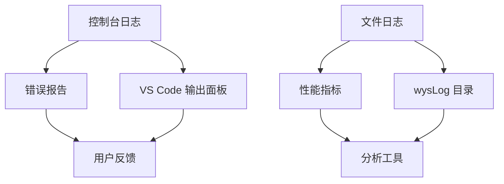

**图表来源**
- [src/extension.ts:39-40](file://src/extension.ts#L39-L40)
- [src/extension.ts:351-356](file://src/extension.ts#L351-L356)

### 调试技巧

#### 1. 开发环境调试

使用 VS Code 的调试功能：
1. 在 `src/extension.ts` 中设置断点
2. 使用 "Launch Extension" 配置启动
3. 在弹出的测试窗口中验证功能

#### 2. Webview 调试

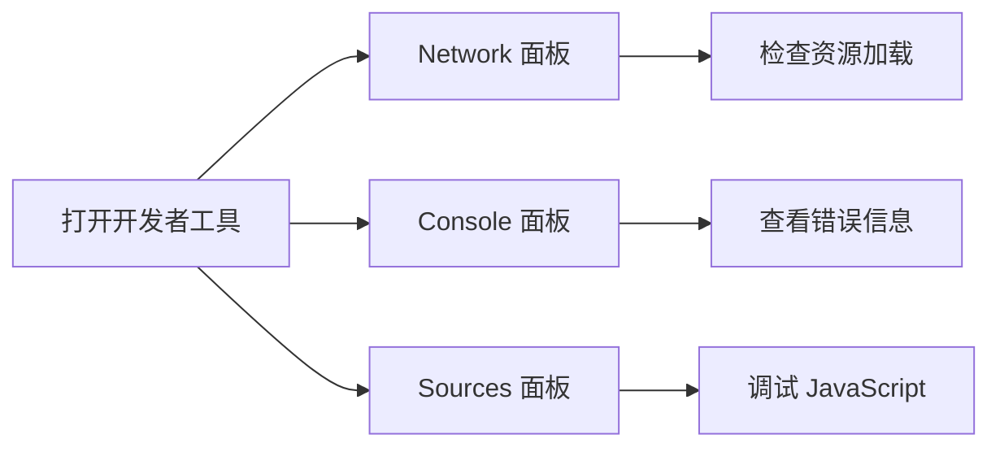

**图表来源**
- [media/webview.js:275-277](file://media/webview.js#L275-L277)

#### 3. esbuild 调试

**新增** esbuild 构建过程的调试方法：
1. 使用 `--debug` 参数运行 esbuild 命令
2. 检查构建输出的详细信息
3. 验证生成的 JavaScript 代码
4. 使用浏览器开发者工具调试构建产物

#### 4. 帮助系统调试

**更新** 帮助系统的调试方法：
1. 检查 RSS XML 文件格式是否正确
2. 验证 CSS 样式文件是否加载成功
3. 使用浏览器开发者工具检查 DOM 结构
4. 确认 JavaScript 脚本执行是否正常

**章节来源**
- [src/extension.ts:39-40](file://src/extension.ts#L39-L40)
- [src/extension.ts:351-356](file://src/extension.ts#L351-L356)

## 结论

wysJSON 是一个功能完整、架构清晰的 VS Code 扩展。其设计特点包括：

1. **模块化架构**：清晰的职责分离和依赖管理
2. **强大的解析能力**：支持多种数据提取场景
3. **用户友好的界面**：直观的表格编辑体验
4. **良好的扩展性**：易于添加新功能和改进现有功能
5. **现代化构建工具**：采用 esbuild 提升开发和构建效率
6. **增强的帮助系统**：包含改进的样式、RSS 集成和全面的 JSON 编辑功能覆盖

项目的未来发展方向包括：
- 实现超大 JSON 文件的渐进式加载
- 增强数据验证和错误处理机制
- 优化性能表现
- 扩展更多数据格式支持
- 进一步优化 esbuild 构建配置
- 继续完善帮助系统的功能和用户体验

## 附录

### 开发环境设置

#### 必需工具
- Node.js (与 VS Code 版本兼容)
- TypeScript 5.3.0+
- VS Code 1.85.0+
- esbuild ^0.25.5

#### 安装步骤
1. 克隆仓库到本地
2. 运行 `npm install` 安装依赖
3. 使用 `npm run watch` 启动 TypeScript 监视器
4. 在 VS Code 中按 F5 启动扩展开发环境

**更新** 新增 esbuild 依赖安装和配置说明。

#### 构建流程

**传统构建流程**：
1. 运行 `npm run compile` 编译 TypeScript
2. 使用 `npm run package` 打包扩展
3. 通过 VS Code Extensions 面板安装

**esbuild 构建流程**：
1. 运行 `npx esbuild --bundle src/extension.ts --outfile=dist/extension.js --format=cjs --platform=node --external:@babel/*`
2. 使用 `npm run package` 打包扩展
3. 通过 VS Code Extensions 面板安装

**更新** 新增 esbuild 构建流程和配置选项。

#### Gitee 仓库配置

**更新** 扩展发布配置已更新为 Gitee 仓库：
- 基础内容 URL：https://gitee.com/null_562_1801/wys-json/raw/main
- 基础图片 URL：https://gitee.com/null_562_1801/wys-json/raw/main

#### 部署流程

**更新** 新增部署脚本支持：
1. 运行 `python deploy_py.py` 执行部署
2. 自动检查必需文件
3. 复制资源到部署目录
4. 处理 Monaco Editor 最小化版本

#### 帮助系统开发指南

**更新** 帮助系统的开发和维护指南：

##### 样式系统开发
- 使用 CSS 变量实现主题一致性
- 遵循 BEM 命名约定
- 支持响应式设计
- 确保跨浏览器兼容性

##### RSS 集成开发
- 遵循 RSS 2.0 标准
- 实现缓存机制
- 支持错误处理和降级
- 确保内容更新及时性

##### JSON 编辑功能覆盖
- 提供完整的编辑场景示例
- 包含最佳实践指导
- 支持多语言文档
- 定期更新内容

**章节来源**
- [部署方式/vscodeExtension/package.json:110-131](file://部署方式/vscodeExtension/package.json#L110-L131)
- [部署方式/deploy_py.py:1-44](file://部署方式/deploy_py.py#L1-L44)

### 贡献指南

#### 代码规范
- 遵循 TypeScript 编码标准
- 保持代码简洁和可读性
- 添加适当的注释和文档
- 确保类型安全

#### 提交流程
1. Fork 仓库并创建功能分支
2. 编写测试用例
3. 提交代码并创建 Pull Request
4. 等待代码审查和合并

#### 测试策略
- 单元测试：针对核心解析器功能
- 集成测试：验证扩展整体功能
- 用户验收测试：确保用户体验质量

#### esbuild 集成指南

**新增** 如何在项目中使用 esbuild：
1. 安装 esbuild 依赖：`npm install esbuild --save-dev`
2. 配置构建脚本，在 package.json 中添加 esbuild 命令
3. 更新构建流程以使用 esbuild 替代部分 tsc 功能
4. 测试构建结果确保兼容性

#### 帮助系统贡献指南

**更新** 帮助系统的贡献和维护指南：
1. 遵循样式系统开发规范
2. 确保 RSS 内容质量和时效性
3. 提供准确的 JSON 编辑示例
4. 定期更新帮助内容
5. 测试不同设备和浏览器的兼容性

**章节来源**
- [部署方式/vscodeExtension/package.json:122](file://部署方式/vscodeExtension/package.json#L122)
- [部署方式/vscodeExtension/package-lock.json:1516-1557](file://部署方式/vscodeExtension/package-lock.json#L1516-L1557)