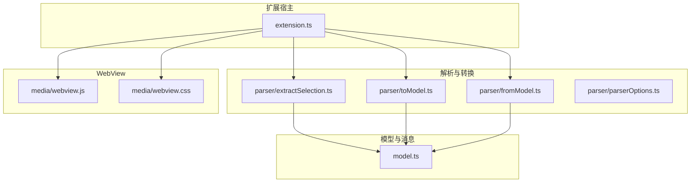
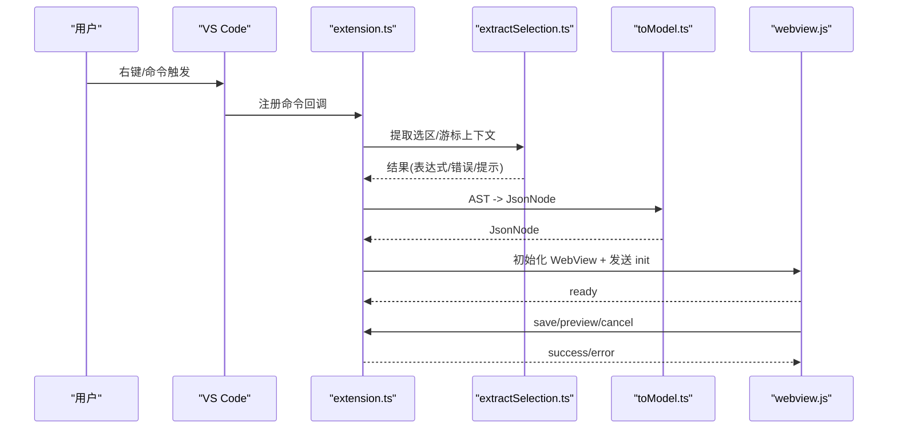
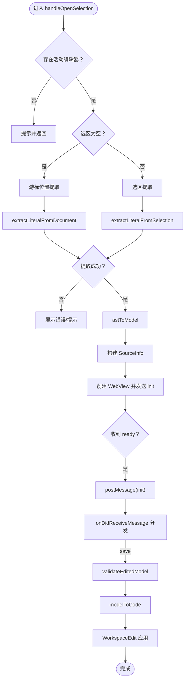
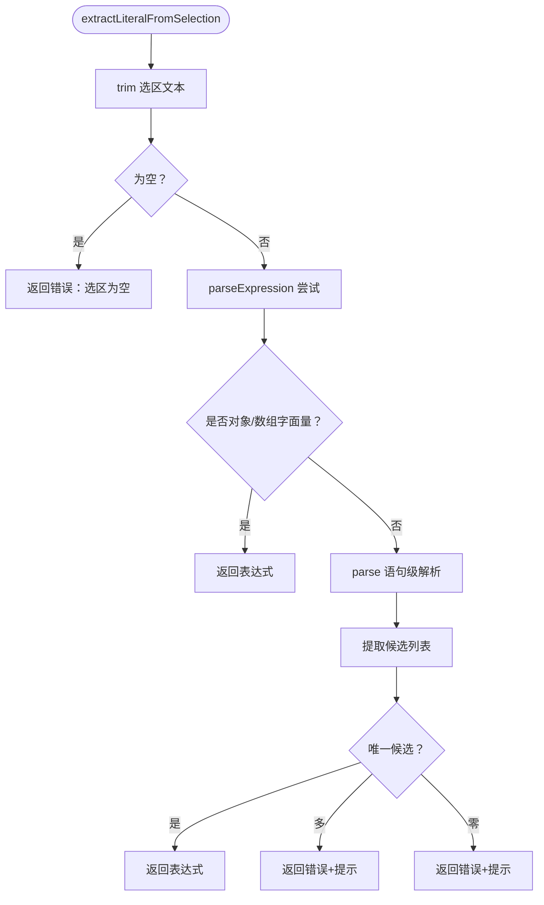
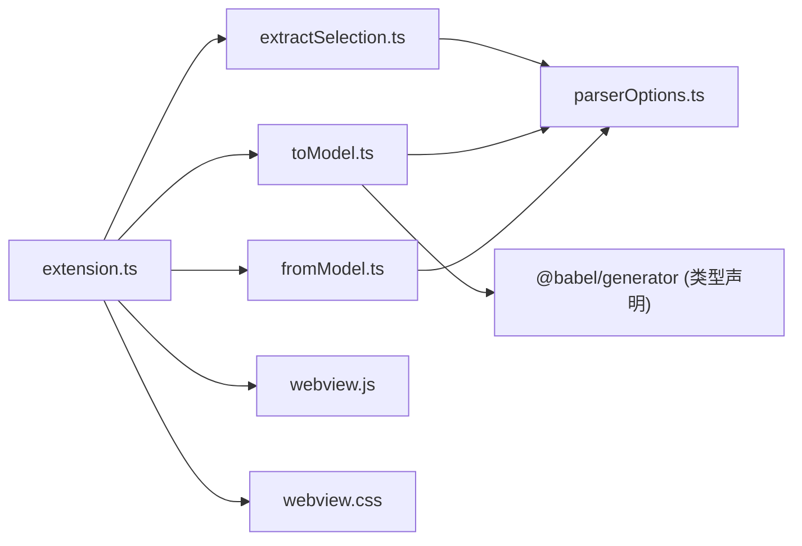

# 扩展开发规范

<cite>
**本文引用的文件**
- [package.json](file://package.json)
- [tsconfig.json](file://tsconfig.json)
- [extension.ts](file://src/extension.ts)
- [model.ts](file://src/model.ts)
- [extractSelection.ts](file://src/parser/extractSelection.ts)
- [toModel.ts](file://src/parser/toModel.ts)
- [fromModel.ts](file://src/parser/fromModel.ts)
- [parserOptions.ts](file://src/parser/parserOptions.ts)
- [babel-generator.d.ts](file://src/types/babel-generator.d.ts)
- [webview.js](file://media/webview.js)
- [webview.css](file://media/webview.css)
- [测试计划.md](file://测试计划.md)
- [todo.md](file://todo.md)
- [testData.js](file://jsonDemo/testData.js)
- [字段值string是jons文本-便于数据库保存.json](file://jsonDemo/字段值string是jons文本-便于数据库保存.json)
</cite>

## 目录
1. [简介](#简介)
2. [项目结构](#项目结构)
3. [核心组件](#核心组件)
4. [架构总览](#架构总览)
5. [详细组件分析](#详细组件分析)
6. [依赖关系分析](#依赖关系分析)
7. [性能考量](#性能考量)
8. [故障排查指南](#故障排查指南)
9. [结论](#结论)
10. [附录](#附录)

## 简介
本规范面向 wysJSON VS Code 扩展的开发者，提供统一的代码风格、模块组织、错误处理与审查要点，帮助团队在 TypeScript/VS Code 扩展生态中高效协作、持续演进。本文档基于仓库现有实现进行提炼与总结，涵盖以下方面：
- TypeScript 编码标准与命名约定
- 模块组织与文件命名规则
- 消息与事件流、错误处理与日志规范
- 代码审查清单与最佳实践
- 具体示例与反例路径指引

## 项目结构
项目采用“分层 + 功能域”结合的组织方式：
- src：核心业务代码
  - parser：解析与转换层（选区提取、AST 到模型、模型到源码）
  - types：第三方类型声明补充
  - webview：VS Code 扩展内嵌 WebView 的前端资源
  - extension.ts：扩展入口与命令、消息处理
  - model.ts：中间数据模型与消息契约
- media：WebView 资源（CSS/JS）
- jsonDemo：演示数据与测试样例
- 根目录配置：package.json、tsconfig.json、测试计划与待办事项

图表来源
- [extension.ts](file://src/extension.ts)
- [extractSelection.ts](file://src/parser/extractSelection.ts)
- [toModel.ts](file://src/parser/toModel.ts)
- [fromModel.ts](file://src/parser/fromModel.ts)
- [model.ts](file://src/model.ts)
- [webview.js](file://media/webview.js)
- [webview.css](file://media/webview.css)

章节来源
- [package.json](file://package.json)
- [tsconfig.json](file://tsconfig.json)

## 核心组件
- 扩展入口与命令注册：负责激活、命令注册、右键菜单、WebView 生命周期与消息收发。
- 选区提取：容错策略三层（直接表达式、变量初始化、候选聚合），支持 Markdown 代码块与普通文本/JS/TS 文件。
- AST 到模型：将 Babel AST 节点映射为 JsonNode，保留 codeText 节点以支持非 JSON 表达式。
- 模型到源码：校验 codeText 语法，生成规范化 JS/JSON 源码，支持缩进与换行。
- 消息契约：定义 Init/Save/Preview/Cancel 等消息类型与响应结构。

章节来源
- [extension.ts](file://src/extension.ts)
- [extractSelection.ts](file://src/parser/extractSelection.ts)
- [toModel.ts](file://src/parser/toModel.ts)
- [fromModel.ts](file://src/parser/fromModel.ts)
- [model.ts](file://src/model.ts)

## 架构总览
扩展采用“选区提取 → AST → 中间模型 → 源码生成 → 写回”的流水线式处理，配合 VS Code WebView 提供表格化编辑体验。消息流以 postMessage/onDidReceiveMessage 为核心，扩展端负责并发保护与错误反馈。

图表来源
- [extension.ts](file://src/extension.ts)
- [extractSelection.ts](file://src/parser/extractSelection.ts)
- [toModel.ts](file://src/parser/toModel.ts)
- [webview.js](file://media/webview.js)

## 详细组件分析

### 组件一：扩展入口与消息处理（extension.ts）
职责与流程
- 激活与命令注册：注册 wysjson.openSelection 与 wysjson.openSelectionEnglish 命令。
- 选区/游标处理：区分 Markdown 代码块与普通文件；支持空选区的光标位置提取。
- AST 转模型与源信息收集：构建 SourceInfo，用于写回时的范围与版本控制。
- WebView 初始化：设置 CSP、注入样式脚本、语言偏好传递。
- 消息处理：ready 初始化、保存/预览/取消；保存时进行版本检查与语法校验，应用 WorkspaceEdit 写回。

关键要点
- 并发保护：通过 document.version 与 originalLines 防止覆盖。
- 错误提示：统一使用 vscode.window.showErrorMessage/showInformationMessage。
- 语言偏好：通过 globalState 与 setContext 控制菜单显示与界面语言。

图表来源
- [extension.ts](file://src/extension.ts)
- [toModel.ts](file://src/parser/toModel.ts)
- [fromModel.ts](file://src/parser/fromModel.ts)

章节来源
- [extension.ts](file://src/extension.ts)

### 组件二：选区提取（extractSelection.ts）
策略与算法
- 直接表达式解析：尝试将选区作为 JS 表达式解析，若为对象/数组字面量则直接使用。
- 语句级提取：解析为 Program，遍历变量声明与表达式语句，收集对象/数组字面量。
- 候选筛选：唯一候选直接返回；多候选给出提示；零候选给出引导。
- 文档级提取：在给定 offset 下，优先变量初始化，其次最外层 JSON-like 节点；失败时回退到基于括号匹配的轻量扫描。

图表来源
- [extractSelection.ts](file://src/parser/extractSelection.ts)

章节来源
- [extractSelection.ts](file://src/parser/extractSelection.ts)

### 组件三：AST 到模型（toModel.ts）
要点
- 支持 ObjectExpression、ArrayExpression、StringLiteral、NumericLiteral、BooleanLiteral、NullLiteral。
- 其他类型（函数、Date、Symbol、标识符、调用等）统一转为 codeText 节点，保留原始代码以便可逆写回。
- 对象属性支持标识符/字符串/数值键，计算属性降级为 codeText。
- SpreadElement 在数组/对象中标记为不可编辑的 codeText 节点并给出警告。

章节来源
- [toModel.ts](file://src/parser/toModel.ts)

### 组件四：模型到源码（fromModel.ts）
要点
- validateModelCode：递归校验 codeText 节点的 JS 表达式合法性；支持对象方法的特殊判断。
- emitNodeCode：根据节点类型输出 JSON/JS 代码；对象/数组递归生成，支持缩进与换行。
- indentRawBlock/indentCodeTextProperty：处理多行 codeText 的缩进与对齐。
- looksLikeObjectMethod/tryParseObjectMethod：识别并校验对象方法简写。

章节来源
- [fromModel.ts](file://src/parser/fromModel.ts)

### 组件五：中间模型与消息契约（model.ts）
要点
- JsonNodeKind：object/array/string/number/boolean/null/codeText。
- JsonNode：节点元信息（kind/value/raw/originalRaw/sourceKind/editable/writeMode/warning/children/items）。
- SourceInfo：源文件 URI、选区文本、起止位置、文档版本、缩进、原始行。
- WebviewMessage/ExtensionResponse：消息类型与响应结构。

章节来源
- [model.ts](file://src/model.ts)

### 组件六：解析选项（parserOptions.ts）
要点
- 统一 Babel Parser 插件集合与默认选项，确保跨文件类型的一致性解析行为。

章节来源
- [parserOptions.ts](file://src/parser/parserOptions.ts)

### 组件七：WebView 交互（webview.js）
要点
- 事件绑定：按钮、键盘、鼠标、粘贴、滚动、缩略图/迷你地图交互。
- 状态管理：撤销/重做栈、UI 状态持久化、语言切换、缩放。
- 与扩展通信：postMessage/onDidReceiveMessage，发送 ready/init/save/setLanguage/cancel 等消息。

章节来源
- [webview.js](file://media/webview.js)

## 依赖关系分析
- 扩展入口依赖解析与转换模块；解析模块依赖 Babel 类型与生成器；模型定义被解析与转换共享；WebView 与扩展通过消息契约耦合。
- 第三方依赖：@babel/parser/@babel/types/@babel/generator、monaco-editor、@types/node、@types/vscode、vsce。

图表来源
- [extension.ts](file://src/extension.ts)
- [extractSelection.ts](file://src/parser/extractSelection.ts)
- [toModel.ts](file://src/parser/toModel.ts)
- [fromModel.ts](file://src/parser/fromModel.ts)
- [parserOptions.ts](file://src/parser/parserOptions.ts)
- [babel-generator.d.ts](file://src/types/babel-generator.d.ts)
- [webview.js](file://media/webview.js)
- [webview.css](file://media/webview.css)

章节来源
- [package.json](file://package.json)

## 性能考量
- 选区提取的回退策略：当全文件解析失败时，采用基于括号匹配的轻量扫描，限定扫描窗口以平衡准确性与性能。
- WebView 渲染：使用缩略图与迷你地图辅助导航，减少大结构浏览成本。
- 代码生成：仅在保存阶段进行语法校验与代码生成，避免频繁重算。

章节来源
- [extractSelection.ts](file://src/parser/extractSelection.ts)
- [webview.js](file://media/webview.js)

## 故障排查指南
常见问题与定位
- 无法识别选区中的数据结构
  - 现象：提示“无法识别选区中的数据结构”，可能包含候选数量提示。
  - 排查：确认选区是否包含唯一对象/数组字面量；避免选择函数调用或非 literal。
  - 参考路径：[extractSelection.ts](file://src/parser/extractSelection.ts)
- 保存失败或写回失败
  - 现象：写回编辑器失败或提示错误。
  - 排查：检查 validateModelCode 是否通过；确认文档版本未变化；查看 WorkspaceEdit 应用结果。
  - 参考路径：[extension.ts](file://src/extension.ts)、[fromModel.ts](file://src/parser/fromModel.ts)
- 语言切换无效
  - 现象：语言选择未生效。
  - 排查：确认 setContext 调用与 globalState 更新；检查 WebView 初始化时的语言参数传递。
  - 参考路径：[extension.ts](file://src/extension.ts)、[webview.js](file://media/webview.js)
- 大数据集加载缓慢
  - 现象：渲染卡顿或内存占用高。
  - 建议：参考 todo.md 中的“超大 JSON 逐层加载”思路，延迟加载未展开节点。
  - 参考路径：[todo.md](file://todo.md)

章节来源
- [extension.ts](file://src/extension.ts)
- [fromModel.ts](file://src/parser/fromModel.ts)
- [extractSelection.ts](file://src/parser/extractSelection.ts)
- [webview.js](file://media/webview.js)
- [todo.md](file://todo.md)

## 结论
本规范以现有实现为基础，明确了 wysJSON 扩展的编码风格、模块边界、消息契约与错误处理策略。建议在后续迭代中：
- 引入统一的日志记录接口与错误分类体系
- 增强 codeText 节点的编辑体验（如语法高亮）
- 完善撤销/重做堆栈与并发冲突处理
- 逐步引入单元测试与集成测试

## 附录

### A. TypeScript 编码标准与命名约定
- 文件命名
  - 解析模块：小驼峰命名，如 extractSelection.ts、toModel.ts、fromModel.ts、parserOptions.ts
  - 类型定义：model.ts
  - 扩展入口：extension.ts
- 函数与变量
  - 使用小驼峰命名（如 handleOpenSelection、validateModelCode）
  - 常量使用大写下划线（如 MAX_WINDOW）
- 接口与类型
  - 接口名使用大驼峰（如 JsonNode、ExtractionResult）
  - 类型别名使用小驼峰（如 JsonNodeKind）
- 导出与导入
  - 优先使用具名导出，便于 Tree Shaking
  - 相对路径导入，避免绝对路径

章节来源
- [extension.ts](file://src/extension.ts)
- [model.ts](file://src/model.ts)
- [extractSelection.ts](file://src/parser/extractSelection.ts)
- [toModel.ts](file://src/parser/toModel.ts)
- [fromModel.ts](file://src/parser/fromModel.ts)
- [parserOptions.ts](file://src/parser/parserOptions.ts)

### B. 模块组织与文件命名规则
- src/parser：按职责拆分，每个文件聚焦单一能力
- src/types：第三方类型声明补充，避免污染全局
- media：WebView 资源，按用途拆分 JS/CSS
- jsonDemo：演示数据与测试样例，便于回归验证

章节来源
- [package.json](file://package.json)
- [tsconfig.json](file://tsconfig.json)

### C. 错误处理标准
- 异常捕获
  - 扩展入口与保存流程中使用 try/catch 包裹关键逻辑
  - 统一通过 vscode.window.showErrorMessage 展示错误
- 错误消息格式
  - 以“模块名 + 冒号 + 具体原因”的结构呈现
  - 附加可选的提示信息（hint），指导用户修正
- 日志记录规范
  - 开发期使用 console.log/console.warn 记录关键状态
  - 生产期建议引入统一日志接口，避免散落 console

章节来源
- [extension.ts](file://src/extension.ts)
- [extractSelection.ts](file://src/parser/extractSelection.ts)
- [fromModel.ts](file://src/parser/fromModel.ts)

### D. 代码审查检查清单
- 功能完整性
  - 选区提取是否覆盖 Markdown/JS/TS/Plain Text 场景
  - AST 转模型是否覆盖对象方法、SpreadElement、计算属性等边界
  - 模型到源码是否保留 codeText 并进行语法校验
  - WebView 交互是否完整（保存/取消/语言切换/缩略图/迷你地图）
- 性能考虑
  - 是否存在不必要的全文件解析
  - 是否使用了合理的回退策略
- 安全性评估
  - 是否存在代码执行风险（当前为静态分析，无运行时执行）
  - 是否对用户输入进行了必要的校验与提示
- 可维护性
  - 导入导出是否清晰、模块边界是否明确
  - 是否存在重复逻辑与冗余代码

章节来源
- [测试计划.md](file://测试计划.md)
- [extension.ts](file://src/extension.ts)
- [extractSelection.ts](file://src/parser/extractSelection.ts)
- [toModel.ts](file://src/parser/toModel.ts)
- [fromModel.ts](file://src/parser/fromModel.ts)
- [webview.js](file://media/webview.js)

### E. 示例与反例路径
- 示例：简单 JSON 对象编辑
  - 路径：[testData.js](file://jsonDemo/testData.js)
- 示例：字符串字段存储 JSON 文本
  - 路径：[字段值string是jons文本-便于数据库保存.json](file://jsonDemo/字段值string是jons文本-便于数据库保存.json)
- 反例：多候选对象/数组字面量
  - 现象：提示“找到 N 个候选对象/数组字面量，请精确选择其中一个”
  - 路径：[extractSelection.ts](file://src/parser/extractSelection.ts)
- 反例：非法表达式保存
  - 现象：提示“代码文本无效”或“编辑后的数据包含无效的代码”
  - 路径：[fromModel.ts](file://src/parser/fromModel.ts)