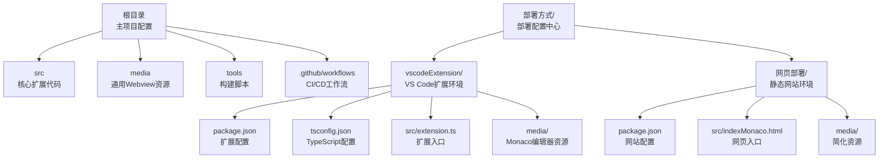
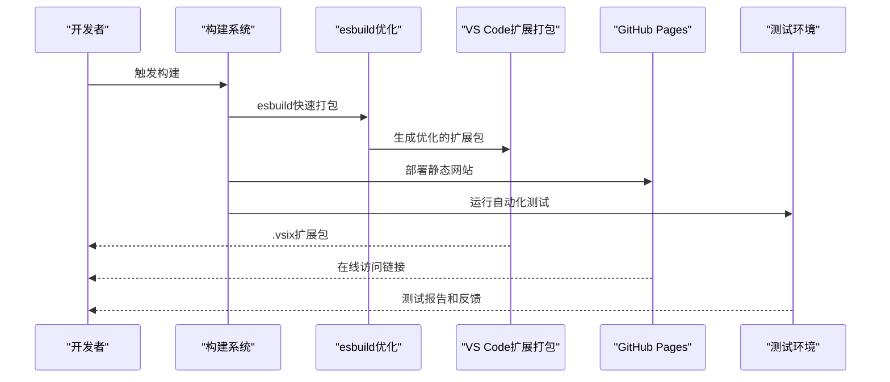
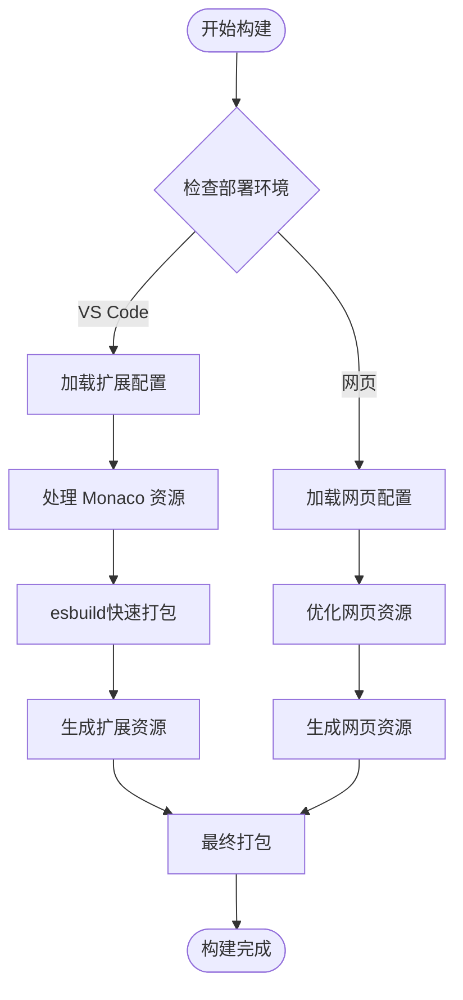
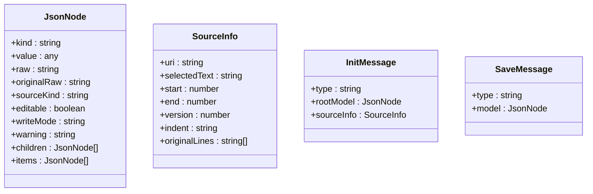
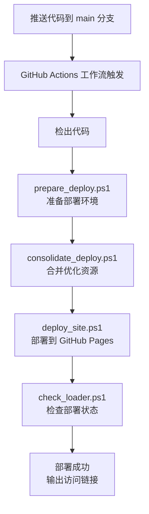
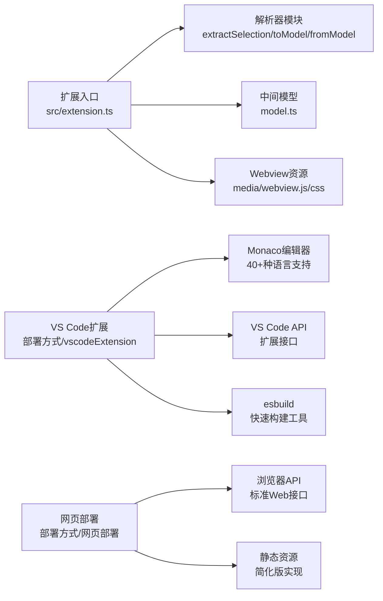

# 构建和部署

<cite>
**本文引用的文件**
- [package.json](file://package.json)
- [tsconfig.json](file://tsconfig.json)
- [tools/build-webview.ps1](file://tools/build-webview.ps1)
- [.github/workflows/github-pages.yml](file://.github/workflows/github-pages.yml)
- [src/extension.ts](file://src/extension.ts)
- [src/model.ts](file://src/model.ts)
- [src/parser/extractSelection.ts](file://src/parser/extractSelection.ts)
- [src/parser/toModel.ts](file://src/parser/toModel.ts)
- [src/parser/fromModel.ts](file://src/parser/fromModel.ts)
- [src/types/babel-generator.d.ts](file://src/types/babel-generator.d.ts)
- [media/webview.css](file://media/webview.css)
- [.vscodeignore](file://.vscodeignore)
- [index.html](file://index.html)
- [package.nls.json](file://package.nls.json)
- [package.nls.zh-CN.json](file://package.nls.zh-CN.json)
- [部署方式/部署方式.md](file://部署方式/部署方式.md)
- [部署方式/vscodeExtension/package.json](file://部署方式/vscodeExtension/package.json)
- [部署方式/vscodeExtension/tsconfig.json](file://部署方式/vscodeExtension/tsconfig.json)
- [部署方式/vscodeExtension/src/extension.ts](file://部署方式/vscodeExtension/src/extension.ts)
- [部署方式/vscodeExtension/media/webview.css](file://部署方式/vscodeExtension/media/webview.css)
- [部署方式/vscodeExtension/media/webview.js](file://部署方式/vscodeExtension/media/webview.js)
- [部署方式/网页部署/package.json](file://部署方式/网页部署/package.json)
- [部署方式/网页部署/src/indexMonaco.html](file://部署方式/网页部署/src/indexMonaco.html)
- [部署方式/网页部署/media/webview.css](file://部署方式/网页部署/media/webview.css)
- [部署方式/网页部署/media/webview.js](file://部署方式/网页部署/media/webview.js)
- [部署方式/prepare_deploy.ps1](file://部署方式/prepare_deploy.ps1)
- [部署方式/consolidate_deploy.ps1](file://部署方式/consolidate_deploy.ps1)
- [部署方式/deploy_site.ps1](file://部署方式/deploy_site.ps1)
- [部署方式/check_loader.ps1](file://部署方式/check_loader.ps1)
- [部署方式/copy_monaco_min.ps1](file://部署方式/copy_monaco_min.ps1)
- [部署方式/fix_monaco_layout.ps1](file://部署方式/fix_monaco_layout.ps1)
- [部署方式/move_from_mojibake.ps1](file://部署方式/move_from_mojibake.ps1)
- [部署方式/deploy_py.py](file://部署方式/deploy_py.py)
</cite>

## 更新摘要
**所做更改**
- 更新品牌名称从 JSONOK 到 JSONOKOK 的完整迁移
- 新增 esbuild 构建工具集成说明
- 更新 VS Code 扩展包配置和版本管理策略
- 完善双环境部署架构分析和构建流程
- 新增构建优化和资源打包策略

## 目录
1. [简介](#简介)
2. [项目结构](#项目结构)
3. [核心组件](#核心组件)
4. [架构总览](#架构总览)
5. [详细组件分析](#详细组件分析)
6. [依赖关系分析](#依赖关系分析)
7. [性能考量](#性能考量)
8. [故障排查指南](#故障排查指南)
9. [结论](#结论)
10. [附录](#附录)

## 简介
本指南面向 JSONOKOK 的全新部署方式，涵盖网页部署和 VS Code 扩展部署的完整流程。该部署方式采用双环境架构，支持同时向两个平台发布产品：

- **网页部署**：基于 GitHub Pages 的静态网站托管，无需服务器配置
- **VS Code 扩展部署**：完整的扩展打包、签名和市场发布流程

**更新** 品牌名称已从 JSONOK 正式升级为 JSONOKOK，体现更完整的品牌识别度。新增 esbuild 构建工具集成，提供更快的构建速度和更优的打包优化。

主要特性：
- 统一的核心代码库，分别适配不同部署环境
- 自动化的构建脚本和部署流水线
- 完整的本地测试和验证流程
- 支持多语言本地化资源管理
- esbuild 构建优化，提升开发效率

## 项目结构
仓库采用"双环境分离"的组织方式，每个部署环境都有独立的配置和资源：

**图表来源**
- [部署方式/部署方式.md](file://部署方式/部署方式.md)
- [部署方式/vscodeExtension/package.json](file://部署方式/vscodeExtension/package.json)
- [部署方式/网页部署/package.json](file://部署方式/网页部署/package.json)

**章节来源**
- [部署方式/部署方式.md](file://部署方式/部署方式.md)
- [部署方式/vscodeExtension/package.json](file://部署方式/vscodeExtension/package.json)
- [部署方式/网页部署/package.json](file://部署方式/网页部署/package.json)

## 核心组件
JSONOKOK 采用双环境架构，每个环境都有专门的组件：

### VS Code 扩展环境
- **扩展入口**：`src/extension.ts` - 负责激活命令、创建 Webview、处理消息通信
- **Monaco 编辑器**：完整的 Monaco 编辑器资源，支持多种编程语言高亮
- **本地化资源**：多语言支持，包括 zh-CN 和其他语言的翻译文件
- **类型声明**：完整的 TypeScript 类型定义和接口规范
- **esbuild 构建**：集成 esbuild 进行快速打包和优化

### 网页部署环境  
- **简化 Webview**：精简的 webview 资源，移除 VS Code 特定依赖
- **静态页面**：基于 indexMonaco.html 的网页版本
- **自动部署**：通过 GitHub Actions 实现自动化部署到 GitHub Pages

**章节来源**
- [部署方式/vscodeExtension/src/extension.ts](file://部署方式/vscodeExtension/src/extension.ts)
- [部署方式/vscodeExtension/media/webview.css](file://部署方式/vscodeExtension/media/webview.css)
- [部署方式/vscodeExtension/media/webview.js](file://部署方式/vscodeExtension/media/webview.js)
- [部署方式/网页部署/src/indexMonaco.html](file://部署方式/网页部署/src/indexMonaco.html)
- [部署方式/网页部署/media/webview.css](file://部署方式/网页部署/media/webview.css)
- [部署方式/网页部署/media/webview.js](file://部署方式/网页部署/media/webview.js)

## 架构总览
下图展示 JSONOKOK 双环境部署的端到端流程：

**图表来源**
- [部署方式/prepare_deploy.ps1](file://部署方式/prepare_deploy.ps1)
- [部署方式/consolidate_deploy.ps1](file://部署方式/consolidate_deploy.ps1)
- [部署方式/deploy_site.ps1](file://部署方式/deploy_site.ps1)

## 详细组件分析

### TypeScript 编译流程

#### 主项目编译配置
- **编译命令**：`npm run compile` 使用 tsc -p ./ 进行全量编译
- **监听模式**：`npm run watch` 实时监听文件变化
- **发布准备**：`npm run vscode:prepublish` 自动调用编译流程

#### VS Code 扩展环境编译
- **独立配置**：`部署方式/vscodeExtension/tsconfig.json` 提供扩展专用配置
- **目标平台**：针对 VS Code 扩展 API 进行优化
- **资源处理**：包含 Monaco 编辑器的 TypeScript 类型声明
- **esbuild 集成**：`npm run compile` 包含 esbuild 快速打包步骤

#### 网页部署环境编译
- **简化配置**：`部署方式/网页部署/package.json` 提供轻量化配置
- **资源优化**：移除 VS Code 特定依赖，减小包体积
- **兼容性**：确保在浏览器环境中正常运行

**章节来源**
- [tsconfig.json](file://tsconfig.json)
- [部署方式/vscodeExtension/tsconfig.json](file://部署方式/vscodeExtension/tsconfig.json)
- [部署方式/网页部署/package.json](file://部署方式/网页部署/package.json)

### Webview 资源打包与转换

#### VS Code 扩展 Webview
- **Monaco 编辑器**：完整的 Monaco 编辑器资源，包含 40+ 种编程语言支持
- **样式资源**：`media/webview.css` 和 `media/webview.js` 
- **动态加载**：通过 VS Code API 动态获取资源 URI
- **esbuild 优化**：使用 esbuild 进行代码分割和压缩

#### 网页部署 Webview
- **简化资源**：移除 VS Code 依赖，使用标准浏览器 API
- **静态资源**：所有资源都包含在单一 HTML 文件中
- **自包含**：无需额外的服务器配置

#### 转换脚本
- **build-webview.ps1**：将独立 HTML 编辑器转换为 VS Code 扩展可用的 Webview
- **资源优化**：自动处理 CSS、JavaScript 和 Monaco 编辑器资源
- **兼容性检查**：确保转换后的资源在不同环境中正常工作

**图表来源**
- [tools/build-webview.ps1](file://tools/build-webview.ps1)
- [部署方式/网页部署/media/webview.css](file://部署方式/网页部署/media/webview.css)
- [部署方式/vscodeExtension/media/webview.js](file://部署方式/vscodeExtension/media/webview.js)

**章节来源**
- [tools/build-webview.ps1](file://tools/build-webview.ps1)
- [部署方式/vscodeExtension/media/webview.css](file://部署方式/vscodeExtension/media/webview.css)
- [部署方式/vscodeExtension/media/webview.js](file://部署方式/vscodeExtension/media/webview.js)
- [部署方式/网页部署/media/webview.css](file://部署方式/网页部署/media/webview.css)
- [部署方式/网页部署/media/webview.js](file://部署方式/网页部署/media/webview.js)

### 解析器与中间模型
核心解析器组件在两个环境中保持一致：

- **中间模型 JsonNode**：支持 object、array、string、number、boolean、null、codeText 类型
- **选区提取**：支持直接字面量、变量初始化、文档级光标定位
- **AST 转模型**：对象属性、数组元素、字面量节点映射
- **模型到代码**：递归生成 JSON/代码文本，支持语法校验

**图表来源**
- [src/model.ts](file://src/model.ts)
- [src/parser/extractSelection.ts](file://src/parser/extractSelection.ts)
- [src/parser/toModel.ts](file://src/parser/toModel.ts)
- [src/parser/fromModel.ts](file://src/parser/fromModel.ts)

**章节来源**
- [src/model.ts](file://src/model.ts)
- [src/parser/extractSelection.ts](file://src/parser/extractSelection.ts)
- [src/parser/toModel.ts](file://src/parser/toModel.ts)
- [src/parser/fromModel.ts](file://src/parser/fromModel.ts)

### 本地测试流程

#### 主项目测试
- **测试脚本**：`npm run test` 运行测试套件
- **预测试**：`npm run pretest` 先编译再执行测试
- **测试框架**：基于 VS Code 测试框架的扩展测试

#### 部署环境测试
- **环境隔离**：每个部署环境都有独立的测试配置
- **自动化测试**：通过 GitHub Actions 实现持续集成测试
- **跨环境验证**：确保两个环境的功能一致性

**章节来源**
- [package.json](file://package.json)
- [部署方式/部署方式.md](file://部署方式/部署方式.md)

### VS Code Marketplace 发布

#### 发布流程
- **vsce 工具**：`npm install -g @vscode/vsce` 全局安装
- **包生成**：`vsce package` 基于 `部署方式/vscodeExtension/package.json` 生成 .vsix
- **版本管理**：在 `部署方式/vscodeExtension/package.json` 中维护版本号

#### 本地验证
- **扩展安装**：使用 VS Code - Insiders 或本地实例安装 .vsix
- **功能测试**：验证扩展的所有功能在实际环境中正常工作
- **性能测试**：检查扩展启动时间和内存使用情况

#### 本地化支持
- **多语言资源**：`package.nls.json` 和 `package.nls.zh-CN.json`
- **命令标题**：支持英文和中文的命令标题显示
- **界面翻译**：完整的用户界面本地化

**章节来源**
- [部署方式/vscodeExtension/package.json](file://部署方式/vscodeExtension/package.json)
- [package.nls.json](file://package.nls.json)
- [package.nls.zh-CN.json](file://package.nls.zh-CN.json)

### GitHub Pages 自动化部署

#### 工作流配置
- **触发条件**：推送至 main 分支或手动触发
- **权限设置**：具备 pages:write 和 deployment:write 权限
- **部署步骤**：检出代码、准备静态站点、配置 GitHub Pages、上传工件

#### 部署脚本
- **prepare_deploy.ps1**：准备部署环境和资源
- **consolidate_deploy.ps1**：合并和优化部署资源
- **deploy_site.ps1**：执行实际的网站部署
- **check_loader.ps1**：检查资源加载器状态

#### 自动化优化
- **资源压缩**：自动压缩 CSS、JavaScript 和 HTML 文件
- **缓存策略**：配置适当的缓存头和版本控制
- **错误处理**：完善的错误捕获和恢复机制

**图表来源**
- [.github/workflows/github-pages.yml](file://.github/workflows/github-pages.yml)
- [部署方式/prepare_deploy.ps1](file://部署方式/prepare_deploy.ps1)
- [部署方式/consolidate_deploy.ps1](file://部署方式/consolidate_deploy.ps1)
- [部署方式/deploy_site.ps1](file://部署方式/deploy_site.ps1)

**章节来源**
- [.github/workflows/github-pages.yml](file://.github/workflows/github-pages.yml)
- [部署方式/prepare_deploy.ps1](file://部署方式/prepare_deploy.ps1)
- [部署方式/consolidate_deploy.ps1](file://部署方式/consolidate_deploy.ps1)
- [部署方式/deploy_site.ps1](file://部署方式/deploy_site.ps1)

## 依赖关系分析

#### 核心依赖链
- **扩展入口** 依赖 **解析器模块** 和 **中间模型**
- **Webview 资源** 通过 VS Code API 注入，支持动态加载
- **Monaco 编辑器** 提供丰富的代码编辑功能
- **本地化资源** 支持多语言界面
- **esbuild** 提供快速构建和优化

#### 双环境依赖差异
- **VS Code 环境**：依赖 VS Code 扩展 API 和 Monaco 编辑器
- **网页环境**：依赖标准浏览器 API 和简化版资源

**图表来源**
- [src/extension.ts](file://src/extension.ts)
- [src/parser/extractSelection.ts](file://src/parser/extractSelection.ts)
- [src/parser/toModel.ts](file://src/parser/toModel.ts)
- [src/parser/fromModel.ts](file://src/parser/fromModel.ts)
- [src/model.ts](file://src/model.ts)
- [media/webview.css](file://media/webview.css)
- [部署方式/vscodeExtension/media/webview.js](file://部署方式/vscodeExtension/media/webview.js)

**章节来源**
- [src/extension.ts](file://src/extension.ts)
- [src/parser/extractSelection.ts](file://src/parser/extractSelection.ts)
- [src/parser/toModel.ts](file://src/parser/toModel.ts)
- [src/parser/fromModel.ts](file://src/parser/fromModel.ts)
- [src/model.ts](file://src/model.ts)
- [media/webview.css](file://media/webview.css)

## 性能考量

#### 编译性能优化
- **增量编译**：使用 `tsc -w` 实现实时监听和增量编译
- **并行构建**：VS Code 扩展和网页部署可以并行构建
- **esbuild 优化**：使用 esbuild 进行快速打包，显著提升构建速度
- **资源缓存**：Monaco 编辑器资源进行缓存优化

#### Webview 性能优化
- **懒加载**：Monaco 编辑器采用懒加载策略
- **资源压缩**：自动压缩 CSS、JavaScript 和 HTML 文件
- **缓存策略**：配置适当的浏览器缓存头

#### 部署性能优化
- **CDN 加速**：GitHub Pages 提供全球 CDN 加速
- **资源合并**：自动合并和压缩静态资源
- **版本控制**：通过版本号实现资源的长期缓存

## 故障排查指南

#### 编译问题
- **TypeScript 错误**：检查 tsconfig.json 配置和类型声明
- **模块解析失败**：确认模块路径和 package.json 配置
- **资源加载错误**：验证资源文件路径和构建脚本
- **esbuild 构建失败**：检查 esbuild 配置和依赖版本

#### VS Code 扩展问题
- **扩展无法激活**：检查 `activationEvents` 和 `main` 字段配置
- **Webview 加载失败**：确认 asWebviewUri 和 CSP 配置
- **Monaco 资源缺失**：验证 Monaco 编辑器资源完整性
- **esbuild 打包错误**：检查 TypeScript 编译输出和 esbuild 配置

#### 网页部署问题
- **页面无法访问**：检查 GitHub Pages 配置和域名设置
- **资源加载失败**：确认静态资源路径和 CDN 配置
- **功能异常**：验证浏览器兼容性和 JavaScript 执行

#### 自动化部署问题
- **工作流失败**：检查 GitHub Actions 日志和权限设置
- **资源部署失败**：验证部署脚本和环境变量
- **缓存问题**：清理浏览器缓存和 GitHub Pages 缓存

**章节来源**
- [tsconfig.json](file://tsconfig.json)
- [部署方式/vscodeExtension/tsconfig.json](file://部署方式/vscodeExtension/tsconfig.json)
- [部署方式/网页部署/package.json](file://部署方式/网页部署/package.json)
- [部署方式/部署方式.md](file://部署方式/部署方式.md)

## 结论
JSONOKOK 的全新部署方式提供了灵活的双环境架构，既满足 VS Code 扩展的深度集成需求，又支持网页部署的广泛访问。通过统一的核心代码库和专门的部署配置，实现了高效的开发、测试和发布流程。新增的 esbuild 构建工具显著提升了构建速度和优化效果，自动化工具和脚本确保了部署的一致性和可靠性，为用户提供了优质的使用体验。

## 附录

#### 资源打包与忽略
- **VS Code 扩展**：`.vscodeignore` 控制打包排除 node_modules、src、dist 等
- **网页部署**：独立的资源管理和优化策略
- **通用资源**：media 目录下的 CSS 和 JavaScript 文件

#### 本地化配置
- **多语言支持**：`package.nls.json` 和 `package.nls.zh-CN.json`
- **界面翻译**：完整的用户界面本地化资源
- **扩展描述**：支持多语言的扩展描述和标签

#### 类型声明
- **Monaco 编辑器**：完整的 TypeScript 类型声明
- **VS Code API**：扩展 API 的类型定义
- **自定义类型**：JsonNode 和相关接口的类型声明

#### esbuild 构建配置
- **快速打包**：使用 esbuild 进行 TypeScript 到 JavaScript 的快速转换
- **代码分割**：支持模块化打包和代码分割
- **格式优化**：输出 CommonJS 格式，兼容 VS Code 扩展环境
- **目标版本**：ES2020 目标，确保现代浏览器兼容性

**章节来源**
- [.vscodeignore](file://.vscodeignore)
- [package.nls.json](file://package.nls.json)
- [package.nls.zh-CN.json](file://package.nls.zh-CN.json)
- [src/types/babel-generator.d.ts](file://src/types/babel-generator.d.ts)