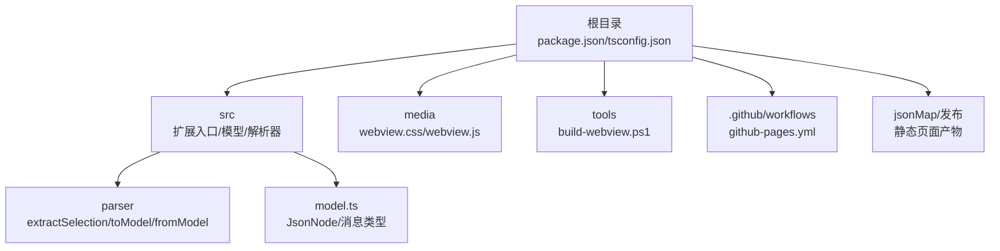
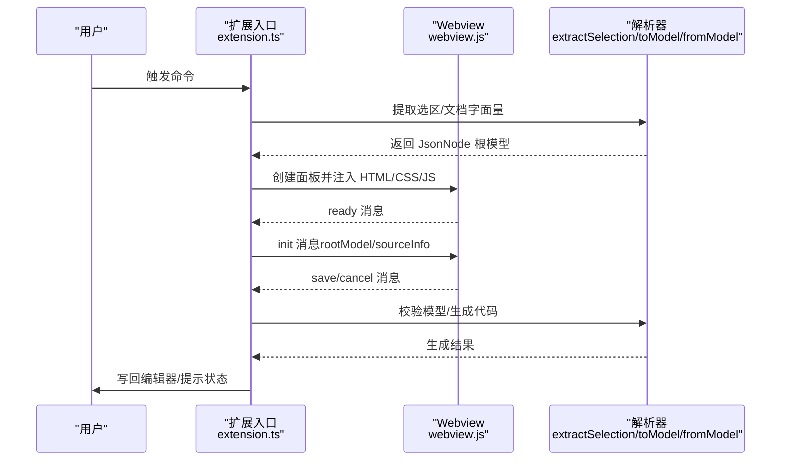
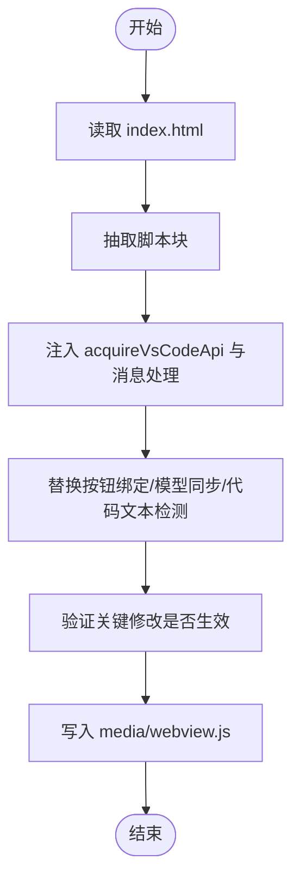
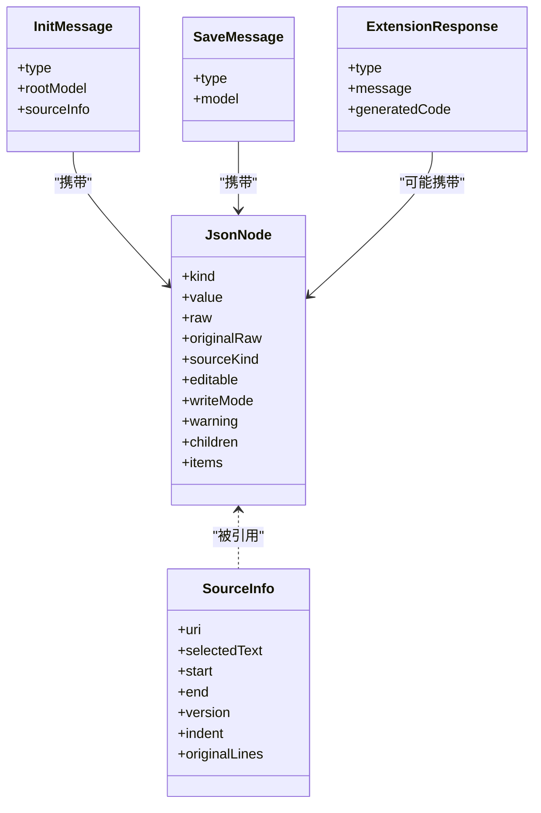
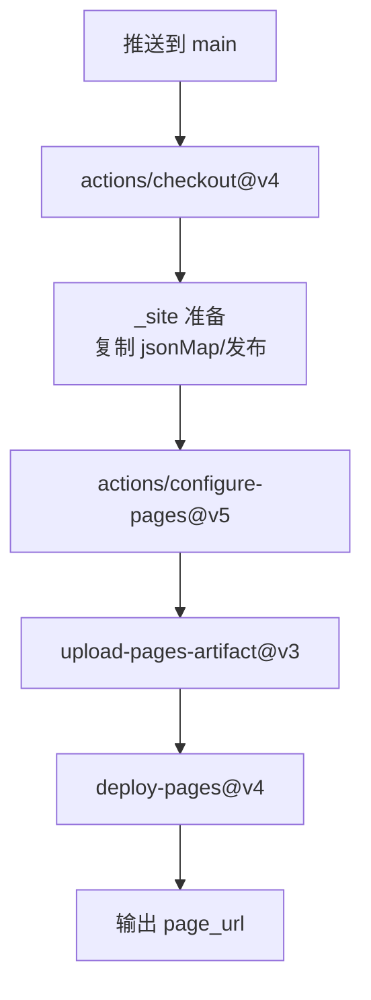
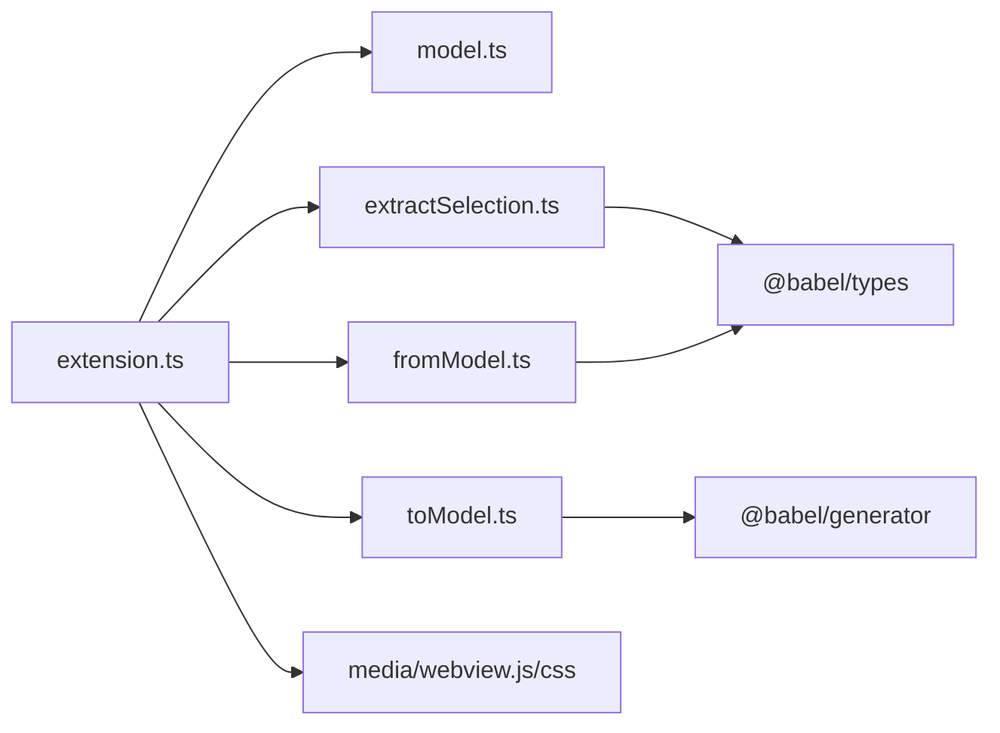

# 构建和部署

<cite>
**本文引用的文件**
- [package.json](file://package.json)
- [tsconfig.json](file://tsconfig.json)
- [tools/build-webview.ps1](file://tools/build-webview.ps1)
- [.github/workflows/github-pages.yml](file://.github/workflows/github-pages.yml)
- [src/extension.ts](file://src/extension.ts)
- [src/model.ts](file://src/model.ts)
- [src/parser/extractSelection.ts](file://src/parser/extractSelection.ts)
- [src/parser/toModel.ts](file://src/parser/toModel.ts)
- [src/parser/fromModel.ts](file://src/parser/fromModel.ts)
- [src/types/babel-generator.d.ts](file://src/types/babel-generator.d.ts)
- [media/webview.css](file://media/webview.css)
- [.vscodeignore](file://.vscodeignore)
- [index.html](file://index.html)
- [package.nls.json](file://package.nls.json)
- [package.nls.zh-CN.json](file://package.nls.zh-CN.json)
</cite>

## 目录
1. [简介](#简介)
2. [项目结构](#项目结构)
3. [核心组件](#核心组件)
4. [架构总览](#架构总览)
5. [详细组件分析](#详细组件分析)
6. [依赖关系分析](#依赖关系分析)
7. [性能考量](#性能考量)
8. [故障排查指南](#故障排查指南)
9. [结论](#结论)
10. [附录](#附录)

## 简介
本指南面向 wysJSON VS Code 扩展的构建与发布流程，涵盖以下主题：
- TypeScript 编译流程：命令参数、输出目录、编译优化与声明文件生成
- 资源打包策略：媒体文件、Webview 资源、静态资源与本地化资源
- 本地测试流程：npm 脚本、测试运行与环境准备
- VS Code Marketplace 发布：vsce 工具、扩展打包与版本管理
- GitHub Actions 自动化：GitHub Pages 部署与 CI 设置

## 项目结构
该仓库采用“按职责分层”的组织方式：
- 根目录包含包配置、类型声明、构建脚本与工作流
- src 目录包含扩展入口、中间模型与解析器模块
- media 目录存放 Webview 的样式与脚本资源
- tools 目录包含将独立 HTML 编辑器转换为 VS Code 扩展可用的 Webview 脚本
- jsonMap/发布 目录用于 GitHub Pages 静态站点内容

图表来源
- [package.json](file://package.json)
- [tsconfig.json](file://tsconfig.json)
- [src/extension.ts](file://src/extension.ts)
- [media/webview.css](file://media/webview.css)
- [tools/build-webview.ps1](file://tools/build-webview.ps1)
- [.github/workflows/github-pages.yml](file://.github/workflows/github-pages.yml)

章节来源
- [package.json](file://package.json)
- [tsconfig.json](file://tsconfig.json)
- [src/extension.ts](file://src/extension.ts)

## 核心组件
- 扩展入口与 Webview 集成：负责激活命令、创建 Webview、传递数据模型与处理消息
- 中间模型与消息协议：定义 JsonNode 结构、消息类型与响应格式
- 解析器模块：从选区/文档中提取字面量、AST 转模型、模型转代码与校验
- Webview 资源：CSS 样式与打包后的 JS（由独立 HTML 通过 PowerShell 脚本转换而来）
- 构建与发布：TypeScript 编译、vsce 打包、GitHub Actions 部署

章节来源
- [src/extension.ts](file://src/extension.ts)
- [src/model.ts](file://src/model.ts)
- [src/parser/extractSelection.ts](file://src/parser/extractSelection.ts)
- [src/parser/toModel.ts](file://src/parser/toModel.ts)
- [src/parser/fromModel.ts](file://src/parser/fromModel.ts)
- [media/webview.css](file://media/webview.css)
- [tools/build-webview.ps1](file://tools/build-webview.ps1)

## 架构总览
下图展示扩展从激活到 Webview 初始化、数据交互与回写编辑器的端到端流程。

图表来源
- [src/extension.ts](file://src/extension.ts)
- [src/parser/extractSelection.ts](file://src/parser/extractSelection.ts)
- [src/parser/toModel.ts](file://src/parser/toModel.ts)
- [src/parser/fromModel.ts](file://src/parser/fromModel.ts)

## 详细组件分析

### TypeScript 编译流程
- 命令与脚本
  - 编译：npm run compile 使用 tsc -p ./ 进行全量编译
  - 监听：npm run watch 使用 tsc -w -p ./ 实时监听
  - 发布前准备：npm run vscode:prepublish 调用 compile
- 关键编译选项
  - 目标与模块：target ES2020、module commonjs
  - 输出目录：outDir ./dist、源码根目录 rootDir ./src
  - 类型与调试：生成声明文件与 sourceMap，严格模式开启
  - 库与检查：lib 包含 ES2020；跳过库检查、一致大小写检查
- 排除规则
  - 默认排除 node_modules、dist、测试文件与示例

章节来源
- [package.json](file://package.json)
- [tsconfig.json](file://tsconfig.json)

### Webview 资源打包与转换
- 资源来源
  - 独立 HTML 编辑器：index.html（包含样式与脚本）
  - Webview 资源：media/webview.css（样式）、media/webview.js（脚本）
- 转换流程
  - PowerShell 脚本从 index.html 抽取脚本块，注入 VS Code API 获取逻辑
  - 修改初始化流程、按钮绑定、事件处理与模型同步逻辑
  - 生成 media/webview.js 并输出统计信息
- 使用方式
  - 扩展入口通过 asWebviewUri 加载 CSS/JS，并注入 CSP 与随机 nonce

图表来源
- [tools/build-webview.ps1](file://tools/build-webview.ps1)
- [index.html](file://index.html)
- [media/webview.css](file://media/webview.css)
- [src/extension.ts](file://src/extension.ts)

章节来源
- [tools/build-webview.ps1](file://tools/build-webview.ps1)
- [index.html](file://index.html)
- [media/webview.css](file://media/webview.css)
- [src/extension.ts](file://src/extension.ts)

### 解析器与中间模型
- 中间模型 JsonNode
  - 支持类型：object、array、string、number、boolean、null、codeText
  - 元信息：原始代码、来源类别、可编辑性、写回模式
- 选区提取
  - 支持直接字面量、变量初始化、文档级光标定位
  - 备选策略：AST 解析失败时采用括号匹配回退
- AST 到模型
  - 对象属性、数组元素、字面量节点映射
  - 方法与展开等不支持特性标记为 codeText 并给出警告
- 模型到代码
  - 递归生成 JSON/代码文本
  - 对 codeText 节点进行语法校验，支持对象方法特殊处理

图表来源
- [src/model.ts](file://src/model.ts)

章节来源
- [src/model.ts](file://src/model.ts)
- [src/parser/extractSelection.ts](file://src/parser/extractSelection.ts)
- [src/parser/toModel.ts](file://src/parser/toModel.ts)
- [src/parser/fromModel.ts](file://src/parser/fromModel.ts)

### 本地测试流程
- 测试脚本
  - pretest：先编译再执行测试
  - test：运行 out/test/runTest.js（需先安装测试框架并在 out 目录生成测试入口）
- 环境准备
  - 安装依赖：npm ci 或 npm install
  - 编译：npm run compile
  - 运行：npm test
- 注意事项
  - 测试入口路径需与 package.json 中 scripts.test 保持一致
  - 若使用 TypeScript 测试文件，确保 tsconfig 的 include/exclude 不影响测试目录

章节来源
- [package.json](file://package.json)

### VS Code Marketplace 发布
- vsce 工具
  - 安装：npm install -g @vscode/vsce
  - 打包：vsce package（基于 package.json 生成 .vsix）
- 版本管理
  - 版本号在 package.json 的 version 字段维护
  - 发布前建议更新版本并提交变更
- 本地验证
  - 使用 Code - Insiders 或本地实例安装 .vsix 进行功能验证
- 本地化资源
  - package.nls.json 与 package.nls.zh-CN.json 提供多语言命令标题

章节来源
- [package.json](file://package.json)
- [package.nls.json](file://package.nls.json)
- [package.nls.zh-CN.json](file://package.nls.zh-CN.json)

### GitHub Actions 自动化部署
- 工作流概述
  - 触发：推送至 main 分支或手动触发
  - 权限：pages 写入与部署权限
  - 步骤：检出代码、准备静态站点、配置 Pages、上传工件、部署
- 静态站点内容
  - 将 jsonMap/发布 下的页面复制到 _site，并添加 .nojekyll
- 访问地址
  - 部署完成后在环境元数据中输出页面 URL

图表来源
- [.github/workflows/github-pages.yml](file://.github/workflows/github-pages.yml)

章节来源
- [.github/workflows/github-pages.yml](file://.github/workflows/github-pages.yml)

## 依赖关系分析
- 扩展入口依赖解析器与模型模块，负责从编辑器选区/文档提取字面量并转换为 JsonNode
- Webview 资源通过 asWebviewUri 注入，CSS 与 JS 同步加载
- vsce 依赖 package.json 中的元数据与资源清单（.vscodeignore 控制打包排除）

图表来源
- [src/extension.ts](file://src/extension.ts)
- [src/model.ts](file://src/model.ts)
- [src/parser/extractSelection.ts](file://src/parser/extractSelection.ts)
- [src/parser/toModel.ts](file://src/parser/toModel.ts)
- [src/parser/fromModel.ts](file://src/parser/fromModel.ts)
- [src/types/babel-generator.d.ts](file://src/types/babel-generator.d.ts)
- [media/webview.css](file://media/webview.css)

章节来源
- [src/extension.ts](file://src/extension.ts)
- [src/parser/extractSelection.ts](file://src/parser/extractSelection.ts)
- [src/parser/toModel.ts](file://src/parser/toModel.ts)
- [src/parser/fromModel.ts](file://src/parser/fromModel.ts)
- [src/types/babel-generator.d.ts](file://src/types/babel-generator.d.ts)
- [media/webview.css](file://media/webview.css)

## 性能考量
- 编译性能
  - 使用 outDir 与 rootDir 明确输出与源目录，减少不必要的扫描
  - 开启 skipLibCheck 与 strict 以平衡正确性与编译速度
- Webview 转换
  - PowerShell 脚本一次性处理，避免重复解析
  - 仅在必要时调整模型同步与事件绑定，减少运行时开销
- 解析性能
  - 文档级提取采用 AST 遍历与括号匹配回退，限制扫描窗口以控制时间复杂度
  - 代码文本节点在生成阶段统一校验，避免运行时反复解析

## 故障排查指南
- 编译失败
  - 检查 tsconfig.json 的 include/exclude 是否误排除源文件
  - 确认 TypeScript 与 @types/vscode 版本兼容
- Webview 无法加载
  - 确认 media/webview.js 是否存在且由 build-webview.ps1 成功生成
  - 检查扩展入口中 asWebviewUri 与 CSP nonce 注入是否正确
- 保存失败
  - 校验模型中是否存在不可解析的 codeText 节点
  - 确认文档版本未变化导致写回被拒绝
- 测试无法运行
  - 确保 pretest 脚本先完成编译
  - 检查 out/test/runTest.js 是否存在且可执行

章节来源
- [tsconfig.json](file://tsconfig.json)
- [tools/build-webview.ps1](file://tools/build-webview.ps1)
- [src/extension.ts](file://src/extension.ts)
- [src/parser/fromModel.ts](file://src/parser/fromModel.ts)
- [package.json](file://package.json)

## 结论
本指南系统梳理了 wysJSON 的构建与部署流程：从 TypeScript 编译、Webview 资源转换，到解析器与中间模型的设计，再到本地测试、VSIX 打包与 GitHub Pages 自动化部署。遵循上述步骤与最佳实践，可高效完成开发、测试与发布的闭环。

## 附录
- 资源打包与忽略
  - .vscodeignore 控制打包时排除 node_modules、src、dist、测试、tsconfig.json、图片等
- 本地化
  - package.nls.json 与 package.nls.zh-CN.json 提供英文与中文命令标题
- 类型声明
  - @babel/generator 的类型声明位于 src/types/babel-generator.d.ts

章节来源
- [.vscodeignore](file://.vscodeignore)
- [package.nls.json](file://package.nls.json)
- [package.nls.zh-CN.json](file://package.nls.zh-CN.json)
- [src/types/babel-generator.d.ts](file://src/types/babel-generator.d.ts)