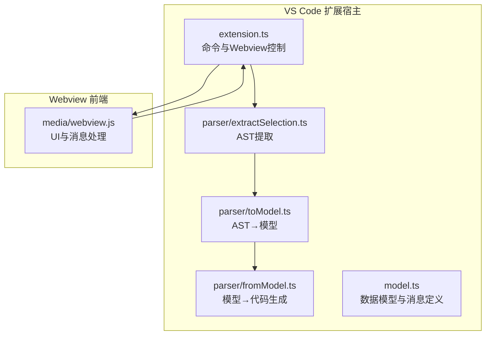
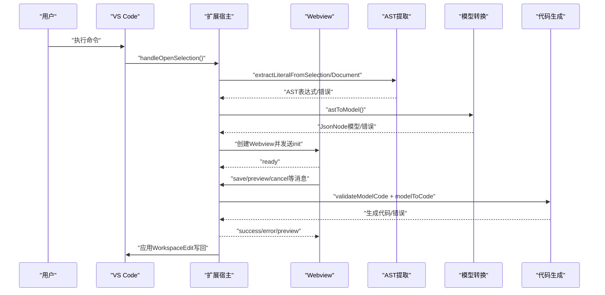
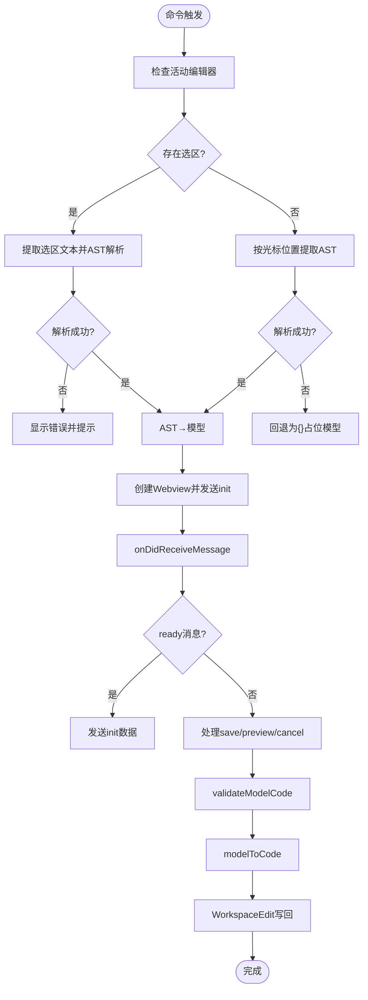
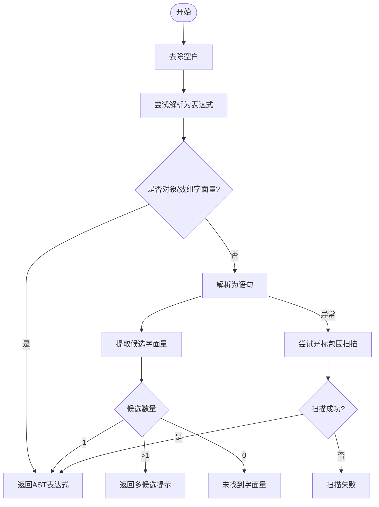
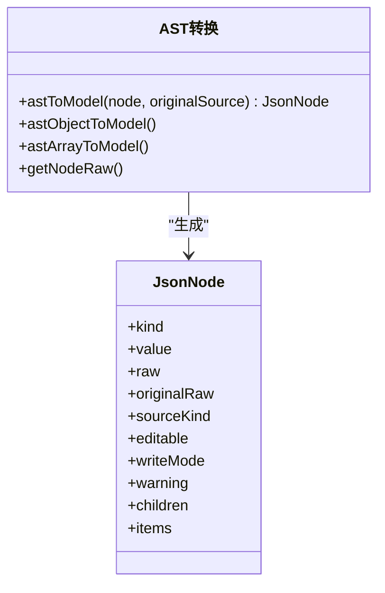
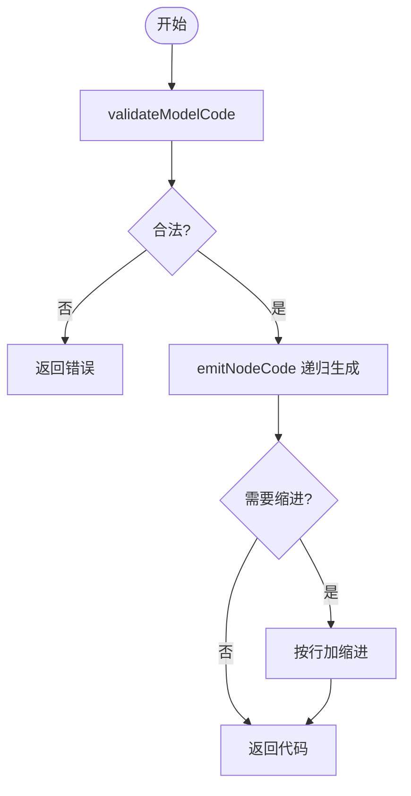
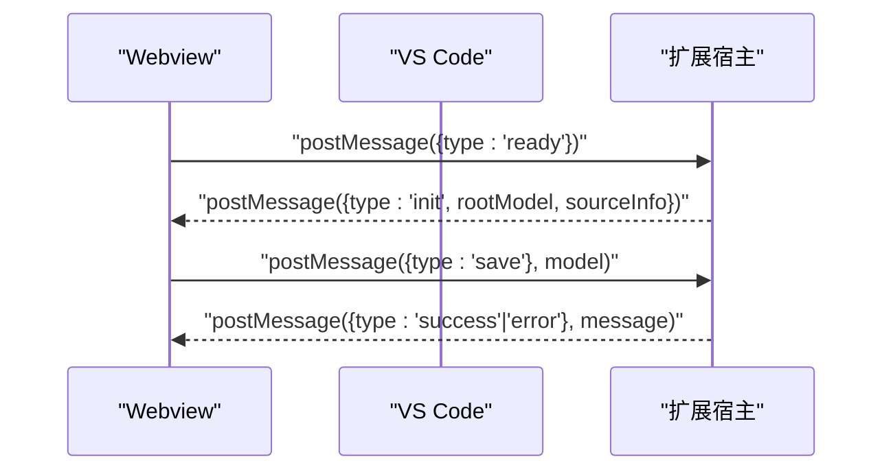
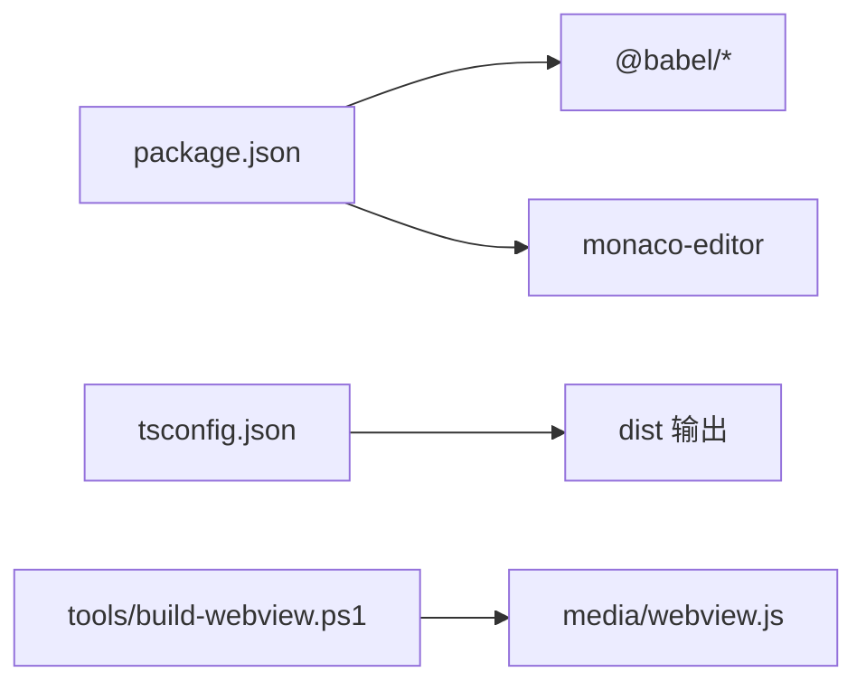

# 调试和故障排除

<cite>
**本文引用的文件**
- [src/extension.ts](file://src/extension.ts)
- [src/model.ts](file://src/model.ts)
- [src/parser/extractSelection.ts](file://src/parser/extractSelection.ts)
- [src/parser/toModel.ts](file://src/parser/toModel.ts)
- [src/parser/fromModel.ts](file://src/parser/fromModel.ts)
- [media/webview.js](file://media/webview.js)
- [package.json](file://package.json)
- [tsconfig.json](file://tsconfig.json)
- [tools/build-webview.ps1](file://tools/build-webview.ps1)
- [todo.md](file://todo.md)
</cite>

## 目录
1. [简介](#简介)
2. [项目结构](#项目结构)
3. [核心组件](#核心组件)
4. [架构总览](#架构总览)
5. [详细组件分析](#详细组件分析)
6. [依赖关系分析](#依赖关系分析)
7. [性能考量](#性能考量)
8. [故障排除指南](#故障排除指南)
9. [结论](#结论)
10. [附录](#附录)

## 简介
本指南面向 JSONOKOK 扩展的使用者与维护者，提供系统化的调试与故障排除方法。内容涵盖：
- VS Code 内置调试器的使用：断点设置、变量监视、调用堆栈分析
- Webview 调试技巧：浏览器开发者工具使用、消息通信调试
- 常见问题诊断流程：扩展激活失败、Webview 加载错误、数据解析异常
- 日志记录机制说明与性能分析工具使用建议
- 具体故障排除案例与解决方案

## 项目结构
该仓库采用“扩展宿主 + Webview 前端”的双层架构：
- 扩展宿主（TypeScript）：负责命令注册、编辑器交互、AST 提取与模型转换、Webview 生命周期与消息编排
- Webview 前端（媒体资源）：负责用户界面、本地状态管理、与扩展宿主的消息通信

图表来源
- [src/extension.ts:19-378](file://src/extension.ts#L19-L378)
- [src/parser/extractSelection.ts:34-101](file://src/parser/extractSelection.ts#L34-L101)
- [src/parser/toModel.ts:10-90](file://src/parser/toModel.ts#L10-L90)
- [src/parser/fromModel.ts:20-57](file://src/parser/fromModel.ts#L20-L57)
- [src/model.ts:15-103](file://src/model.ts#L15-L103)
- [media/webview.js:1-277](file://media/webview.js#L1-L277)

章节来源
- [src/extension.ts:19-378](file://src/extension.ts#L19-L378)
- [package.json:23-26](file://package.json#L23-L26)

## 核心组件
- 扩展入口与命令
  - 注册命令、处理编辑器上下文、创建 Webview 面板、接收并分发消息
- AST 提取与模型转换
  - 从选区或光标位置提取对象/数组字面量，构建中间模型
- 代码生成与校验
  - 将编辑后的模型还原为源码，进行语法校验与缩进处理
- Webview 前端
  - UI 状态、本地存储、键盘/鼠标事件、消息收发、语言切换

章节来源
- [src/extension.ts:23-490](file://src/extension.ts#L23-L490)
- [src/parser/extractSelection.ts:34-229](file://src/parser/extractSelection.ts#L34-L229)
- [src/parser/toModel.ts:10-229](file://src/parser/toModel.ts#L10-L229)
- [src/parser/fromModel.ts:20-305](file://src/parser/fromModel.ts#L20-L305)
- [src/model.ts:15-103](file://src/model.ts#L15-L103)
- [media/webview.js:11-524](file://media/webview.js#L11-L524)

## 架构总览
扩展通过命令触发，解析选区/光标处的数据结构，生成中间模型并通过 Webview 展示；用户编辑完成后，Webview 将模型回传给扩展，扩展进行代码生成与写回。

图表来源
- [src/extension.ts:46-378](file://src/extension.ts#L46-L378)
- [src/parser/extractSelection.ts:34-101](file://src/parser/extractSelection.ts#L34-L101)
- [src/parser/toModel.ts:10-90](file://src/parser/toModel.ts#L10-L90)
- [src/parser/fromModel.ts:20-57](file://src/parser/fromModel.ts#L20-L57)
- [media/webview.js:375-438](file://media/webview.js#L375-L438)

## 详细组件分析

### 组件A：扩展宿主（extension.ts）
职责与关键流程
- 命令注册与上下文菜单
- 编辑器选区/光标检测与文本提取
- AST 提取、模型转换、源信息收集
- Webview 创建、消息监听、写回逻辑

调试要点
- 在命令入口与消息处理函数中设置断点，观察选区/光标上下文
- 监视提取结果、模型种类与源信息字段
- 关注写回前的版本校验与 WorkspaceEdit 应用

图表来源
- [src/extension.ts:46-490](file://src/extension.ts#L46-L490)

章节来源
- [src/extension.ts:19-490](file://src/extension.ts#L19-L490)

### 组件B：AST 提取模块（extractSelection.ts）
职责与关键流程
- 从选区直接解析表达式
- 从文档解析程序，提取候选字面量
- 光标包围式扫描回退策略
- 返回表达式及其在源文本中的偏移

调试要点
- 在解析失败路径设置断点，观察错误提示与回退逻辑
- 对比不同语言（JS/TS/Markdown/纯文本）下的行为差异
- 关注回退扫描窗口大小与性能影响

图表来源
- [src/parser/extractSelection.ts:34-229](file://src/parser/extractSelection.ts#L34-L229)

章节来源
- [src/parser/extractSelection.ts:34-229](file://src/parser/extractSelection.ts#L34-L229)

### 组件C：模型转换（toModel.ts）
职责与关键流程
- 将 AST 节点映射为 JsonNode
- 支持对象、数组、字面量与代码文本节点
- 对象方法与展开运算符的特殊处理

调试要点
- 观察 kind 与 sourceKind 的映射关系
- 关注代码文本节点的 warning 与 writeMode
- 检查原始文本截取与回写一致性

图表来源
- [src/parser/toModel.ts:10-229](file://src/parser/toModel.ts#L10-L229)
- [src/model.ts:15-34](file://src/model.ts#L15-L34)

章节来源
- [src/parser/toModel.ts:10-229](file://src/parser/toModel.ts#L10-L229)
- [src/model.ts:15-34](file://src/model.ts#L15-L34)

### 组件D：代码生成与校验（fromModel.ts）
职责与关键流程
- 校验模型中代码文本节点的合法性
- 递归生成代码，处理缩进与换行
- 包装对象方法与多行代码文本的格式化

调试要点
- 在 validateModelCode 分支设置断点，捕获无效代码文本
- 观察生成代码与缩进策略
- 关注多行属性与数组项的缩进对齐

图表来源
- [src/parser/fromModel.ts:20-117](file://src/parser/fromModel.ts#L20-L117)

章节来源
- [src/parser/fromModel.ts:20-117](file://src/parser/fromModel.ts#L20-L117)

### 组件E：Webview 前端（media/webview.js）
职责与关键流程
- 初始化 UI、语言与本地状态
- 事件绑定：按钮、键盘、滚动、右键菜单
- 与扩展宿主的消息通信：ready/init/save/preview/cancel
- 状态栏提示与错误展示

调试要点
- 在 init → ready 的消息发送处设置断点
- 在 window.onmessage 处观察收到的消息类型与负载
- 使用浏览器开发者工具的网络面板检查媒体资源加载

图表来源
- [media/webview.js:275-377](file://media/webview.js#L275-L377)
- [src/extension.ts:348-377](file://src/extension.ts#L348-L377)

章节来源
- [media/webview.js:250-438](file://media/webview.js#L250-L438)
- [src/extension.ts:348-490](file://src/extension.ts#L348-L490)

## 依赖关系分析
- 运行时依赖
  - @babel/parser、@babel/generator、@babel/types：用于 AST 解析与生成
  - monaco-editor：用于独立模式（非本扩展使用）
- 扩展配置
  - activationEvents：命令触发激活
  - contributes：命令、菜单、国际化键名
- 构建与调试
  - tsconfig：输出目录、源码映射、严格模式
  - build-webview.ps1：对 webview.js 的注入修改（与调试相关）

图表来源
- [package.json:77-91](file://package.json#L77-L91)
- [tsconfig.json:1-25](file://tsconfig.json#L1-L25)
- [tools/build-webview.ps1:44-53](file://tools/build-webview.ps1#L44-L53)

章节来源
- [package.json:77-91](file://package.json#L77-L91)
- [tsconfig.json:1-25](file://tsconfig.json#L1-L25)
- [tools/build-webview.ps1:44-53](file://tools/build-webview.ps1#L44-L53)

## 性能考量
- AST 提取的回退扫描窗口限制（约 40k 字符），避免长文档全量解析带来的开销
- 代码生成阶段的递归遍历与字符串拼接，超大 JSON 建议分层加载（参见任务清单）
- Webview 初始渲染与状态持久化（localStorage）可能影响首屏时间

章节来源
- [src/parser/extractSelection.ts:242-343](file://src/parser/extractSelection.ts#L242-L343)
- [todo.md:3-6](file://todo.md#L3-L6)

## 故障排除指南

### VS Code 内置调试器使用
- 设置断点
  - 在扩展入口函数与消息处理函数中设置断点，如命令入口、AST 提取、模型转换、写回逻辑
  - 在 Webview 初始化与消息处理处设置断点，如 ready/init/save
- 变量监视
  - 观察选区文本、AST 表达式、模型种类、源信息（URI、版本、缩进、原始行）
  - 关注生成代码与错误消息
- 调用堆栈分析
  - 在异常路径（如写回失败、生成失败）查看堆栈，定位具体抛出位置

章节来源
- [src/extension.ts:46-490](file://src/extension.ts#L46-L490)
- [media/webview.js:275-377](file://media/webview.js#L275-L377)

### Webview 调试技巧
- 浏览器开发者工具
  - 打开 Webview 开发者工具，查看 Console、Elements、Network 面板
  - 关注媒体资源加载（CSS/JS）、消息发送与接收
- 消息通信调试
  - 在 Webview 的 ready/init/save 等消息路径设置断点
  - 在扩展宿主的 onDidReceiveMessage 分支设置断点，核对消息类型与负载

章节来源
- [media/webview.js:275-377](file://media/webview.js#L275-L377)
- [src/extension.ts:348-377](file://src/extension.ts#L348-L377)

### 常见问题诊断流程

- 扩展激活失败
  - 现象：命令不可用或无响应
  - 排查步骤
    - 检查激活事件与命令注册是否正确
    - 查看输出面板中的日志（扩展宿主的 console 输出）
    - 确认 package.json 中的 activationEvents 与 commands
  - 相关文件
    - [package.json:23-26](file://package.json#L23-L26)
    - [src/extension.ts:19-44](file://src/extension.ts#L19-L44)

- Webview 加载错误
  - 现象：页面空白、资源 404、脚本未执行
  - 排查步骤
    - 检查 Webview 配置与本地资源根目录
    - 在开发者工具 Network 面板确认 CSS/JS 加载
    - 核对 CSP 与 nonce 注入
  - 相关文件
    - [src/extension.ts:328-346](file://src/extension.ts#L328-L346)
    - [media/webview.js:520-599](file://media/webview.js#L520-L599)

- 数据解析异常
  - 现象：选区提取失败、模型转换异常、写回失败
  - 排查步骤
    - 在 extractSelection 的多分支与回退扫描处设置断点
    - 在 astToModel 与 validateModelCode 处设置断点
    - 核对 WorkspaceEdit 的范围与版本校验
  - 相关文件
    - [src/parser/extractSelection.ts:34-229](file://src/parser/extractSelection.ts#L34-L229)
    - [src/parser/toModel.ts:10-90](file://src/parser/toModel.ts#L10-L90)
    - [src/parser/fromModel.ts:20-57](file://src/parser/fromModel.ts#L20-L57)
    - [src/extension.ts:420-490](file://src/extension.ts#L420-L490)

### 日志记录机制说明
- 扩展宿主日志
  - 使用 console.log/console.warn 记录关键事件与错误
  - 示例：激活、Webview ready、消息类型、写回结果
- Webview 前端日志
  - 初始化与消息发送处的日志，便于前端调试
- 建议
  - 在关键路径增加条件日志，避免过度输出
  - 结合 VS Code 输出面板与浏览器开发者工具定位问题

章节来源
- [src/extension.ts:39-40](file://src/extension.ts#L39-L40)
- [src/extension.ts:351-356](file://src/extension.ts#L351-L356)
- [media/webview.js:275-277](file://media/webview.js#L275-L277)

### 性能分析工具使用建议
- VS Code 内置性能分析
  - 使用“启动扩展”配置，启用源码映射与断点
- 浏览器性能分析
  - 使用开发者工具 Performance 面板，录制 Webview 首屏渲染与交互
- AST 提取与生成
  - 对超大 JSON 场景，结合任务清单中的“逐层加载”思路优化

章节来源
- [src/parser/extractSelection.ts:242-343](file://src/parser/extractSelection.ts#L242-L343)
- [todo.md:3-6](file://todo.md#L3-L6)

### 具体故障排除案例与解决方案

- 案例1：选区未识别为对象/数组字面量
  - 症状：提示“未找到对象/数组字面量”
  - 排查：确认选区是否仅包含字面量或变量初始化；检查回退扫描窗口
  - 解决：缩小选区至单一字面量，或修复初始化语句

- 案例2：写回失败（版本冲突）
  - 症状：提示“文档已被修改，请重新打开编辑器”
  - 排查：检查 sourceInfo.version 与当前文档版本
  - 解决：重新打开编辑器，确保写回前文档未被外部修改

- 案例3：生成代码包含无效的代码文本
  - 症状：validateModelCode 报错
  - 排查：定位 kind 为 codeText 的节点，检查其 raw/value
  - 解决：修正为合法 JavaScript 表达式或移除

- 案例4：Webview 无法接收 ready 消息
  - 症状：前端一直显示“等待数据...”
  - 排查：确认扩展已发送 init；检查 onDidReceiveMessage 分支
  - 解决：修复消息发送与接收逻辑

章节来源
- [src/parser/extractSelection.ts:82-101](file://src/parser/extractSelection.ts#L82-L101)
- [src/extension.ts:423-430](file://src/extension.ts#L423-L430)
- [src/parser/fromModel.ts:67-90](file://src/parser/fromModel.ts#L67-L90)
- [media/webview.js:275-277](file://media/webview.js#L275-L277)

## 结论
通过结合 VS Code 内置调试器与浏览器开发者工具，围绕扩展宿主与 Webview 的消息链路进行分层调试，可高效定位与解决激活、加载与数据解析等问题。建议在关键路径增加日志，并针对超大 JSON 场景引入渐进式加载策略以提升性能与稳定性。

## 附录
- 相关文件索引
  - 扩展入口与命令：[src/extension.ts](file://src/extension.ts)
  - 数据模型与消息定义：[src/model.ts](file://src/model.ts)
  - AST 提取：[src/parser/extractSelection.ts](file://src/parser/extractSelection.ts)
  - AST→模型：[src/parser/toModel.ts](file://src/parser/toModel.ts)
  - 模型→代码生成：[src/parser/fromModel.ts](file://src/parser/fromModel.ts)
  - Webview 前端：[media/webview.js](file://media/webview.js)
  - 扩展配置：[package.json](file://package.json)
  - TypeScript 配置：[tsconfig.json](file://tsconfig.json)
  - Webview 构建注入：[tools/build-webview.ps1](file://tools/build-webview.ps1)
  - 任务清单（性能优化）：[todo.md](file://todo.md)