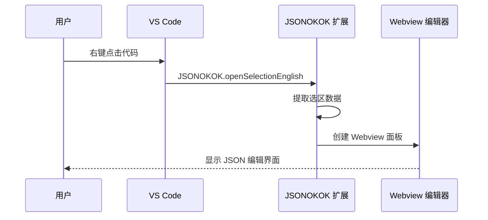
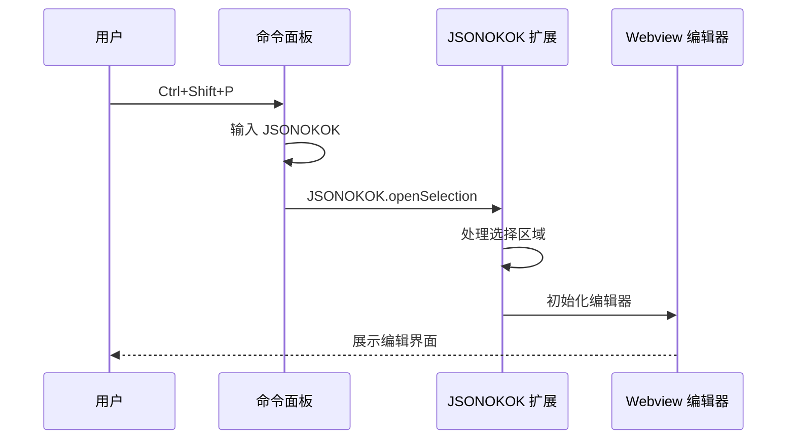

# 快速开始

<cite>
**本文档引用的文件**
- [package.json](file://package.json)
- [src/extension.ts](file://src/extension.ts)
- [src/model.ts](file://src/model.ts)
- [src/parser/extractSelection.ts](file://src/parser/extractSelection.ts)
- [src/parser/toModel.ts](file://src/parser/toModel.ts)
- [src/parser/fromModel.ts](file://src/parser/fromModel.ts)
- [media/webview.js](file://media/webview.js)
- [tsconfig.json](file://tsconfig.json)
- [README.md](file://README.md)
- [jsonDemo/001.json](file://jsonDemo/001.json)
- [jsonDemo/超大json家庭地址.json](file://jsonDemo/超大json家庭地址.json)
- [jsonDemo/小程序/preWx-getPreEmpMb-mbCode=bd_psndoc.json](file://jsonDemo/小程序/preWx-getPreEmpMb-mbCode=bd_psndoc.json)
</cite>

## 目录
1. [简介](#简介)
2. [环境要求](#环境要求)
3. [安装步骤](#安装步骤)
4. [首次使用流程](#首次使用流程)
5. [基本操作演示](#基本操作演示)
6. [典型编辑场景](#典型编辑场景)
7. [常用操作技巧](#常用操作技巧)
8. [性能考虑](#性能考虑)
9. [故障排除](#故障排除)
10. [总结](#总结)

## 简介

JSONOKOK 是一个专为 VS Code 设计的 JSON 编辑器扩展，它提供了类似 Excel 的表格界面来编辑 JavaScript JSON 数据字面量。该扩展能够智能解析复杂的嵌套结构，包括对象、数组和原始类型的混合嵌套，让用户通过直观的表格操作来管理 JSON 数据。

## 环境要求

### VS Code 版本要求
- **最低版本**: VS Code 1.85.0 或更高版本
- **推荐版本**: 最新稳定版 VS Code

### Node.js 环境
- **开发环境**: Node.js 16.x 或更高版本
- **运行时**: VS Code 内置的 Node.js 环境

### 开发工具链
- **TypeScript**: TypeScript 5.3.0 或更高版本
- **编译器**: ES2020 目标
- **包管理**: npm (自动管理依赖)

### 语言支持
扩展支持以下语言的右键菜单显示：
- JavaScript (javascript)
- TypeScript (typescript)
- JavaScript React (javascriptreact)
- TypeScript React (typescriptreact)

**章节来源**
- [package.json:8-10](file://package.json#L8-L10)
- [package.json:55-65](file://package.json#L55-L65)
- [tsconfig.json:2-15](file://tsconfig.json#L2-L15)

## 安装步骤

### 从 VS Code Marketplace 安装

1. 打开 VS Code
2. 进入扩展市场 (Ctrl+Shift+X)
3. 搜索 "JSONOKOK"
4. 点击安装按钮
5. 重启 VS Code 以激活扩展

### 本地开发安装

1. 克隆仓库到本地
2. 在项目根目录执行：
   ```bash
   npm install
   ```
3. 执行编译：
   ```bash
   npm run compile
   ```
4. 在 VS Code 中按 F5 启动调试模式

### 验证安装

1. 打开任意 JavaScript/TypeScript 文件
2. 在代码中右键点击
3. 查看是否出现 "JSONOKOK: Open data in JSONOKOK editor" 菜单项

**章节来源**
- [package.json:69-76](file://package.json#L69-L76)
- [package.json:27-37](file://package.json#L27-L37)

## 首次使用流程

### 步骤 1：准备测试数据
1. 打开 VS Code
2. 创建或打开一个 JavaScript 文件
3. 添加以下示例 JSON 数据：

```javascript
const demoData = {
  name: "示例数据",
  items: [
    { id: 1, title: "项目一" },
    { id: 2, title: "项目二" }
  ],
  metadata: {
    version: "1.0",
    createdAt: "2024-01-01"
  }
};
```

### 步骤 2：打开 JSONOKOK 编辑器
**方法 A：右键菜单**
1. 在代码编辑器中右键点击
2. 选择 "JSONOKOK: Open data in JSONOKOK editor"
3. JSONOKOK 编辑器将在右侧打开

**方法 B：命令面板**
1. 按 `Ctrl+Shift+P` 打开命令面板
2. 输入 "JSONOKOK"
3. 选择 "JSONOKOK: Open data in JSONOKOK editor"

### 步骤 3：编辑数据
1. 在 JSONOKOK 编辑器中查看数据结构
2. 使用表格界面进行编辑
3. 点击 "💾 Save" 保存更改

### 步骤 4：验证结果
1. 返回到代码编辑器
2. 查看修改后的数据
3. 确认格式正确且语法有效

**章节来源**
- [src/extension.ts:46-378](file://src/extension.ts#L46-L378)
- [src/parser/extractSelection.ts:34-101](file://src/parser/extractSelection.ts#L34-L101)

## 基本操作演示

### 打开 JSON 编辑器

#### 右键菜单方式


**图表来源**
- [src/extension.ts:46-378](file://src/extension.ts#L46-L378)

#### 命令面板方式


**图表来源**
- [src/extension.ts:19-44](file://src/extension.ts#L19-L44)

### 编辑界面操作

#### 工具栏功能
- **保存按钮** (`💾 Save`): 保存编辑结果到源文件
- **取消按钮** (`✕ Cancel`): 关闭编辑器不保存
- **撤销/重做**: `↩ Undo` / `↪ Redo`
- **清除空值**: `🧹 Clear null` (将 null 替换为空字符串)
- **空值处理**: `null as string` (勾选时将 null 显示为字符串)
- **缩略图**: `Thumbnail` (显示数据结构概览)
- **快速跳转**: `Quick Jump` (快速导航到指定节点)

#### 语言设置
- **自动检测** (`🌐 Auto`)
- **英文** (`English`)
- **中文简体** (`中文 (简体)`)

**章节来源**
- [src/extension.ts:519-599](file://src/extension.ts#L519-L599)
- [media/webview.js:54-187](file://media/webview.js#L54-L187)

## 典型编辑场景

### 场景 1：编辑简单对象

**输入数据**：
```json
{
  "name": "张三",
  "age": 30,
  "email": "zhangsan@example.com"
}
```

**编辑过程**：
1. 在表格中直接修改单元格值
2. 支持字符串、数字、布尔值的类型转换
3. 添加新字段或删除现有字段

### 场景 2：编辑数组结构

**输入数据**：
```json
[
  { "id": 1, "name": "项目A" },
  { "id": 2, "name": "项目B" }
]
```

**编辑过程**：
1. 点击数组标题展开编辑界面
2. 使用右键菜单添加新项目
3. 删除不需要的项目
4. 修改项目属性

### 场景 3：编辑复杂嵌套结构

**输入数据**：
```json
{
  "users": [
    {
      "personalInfo": {
        "name": "李四",
        "contacts": {
          "phone": "13800000000",
          "email": "lisi@example.com"
        }
      }
    }
  ]
}
```

**编辑过程**：
1. 展开 `users` 数组
2. 展开第一个用户对象
3. 展开 `personalInfo` 对象
4. 展开 `contacts` 对象
5. 修改具体的联系信息

### 场景 4：处理混合数据类型

**输入数据**：
```javascript
const mixedData = {
  stringField: "文本值",
  numberField: 42,
  booleanField: true,
  nullField: null,
  arrayField: [1, 2, 3],
  objectField: { nested: "value" }
};
```

**编辑特点**：
- 字符串、数字、布尔值可直接编辑
- null 值可转换为空字符串
- 数组和对象支持递归编辑
- 代码文本节点保持原样

**章节来源**
- [jsonDemo/001.json:1-23](file://jsonDemo/001.json#L1-L23)
- [jsonDemo/超大json家庭地址.json:1-5](file://jsonDemo/超大json家庭地址.json#L1-L5)
- [src/parser/toModel.ts:10-90](file://src/parser/toModel.ts#L10-L90)

## 常用操作技巧

### 快捷键和快捷操作

#### 基础快捷键
- **Ctrl+S**: 保存编辑结果
- **Ctrl+Z**: 撤销操作
- **Ctrl+Y**: 重做操作
- **Ctrl+F**: 查找功能

#### 高级操作技巧

**1. 批量操作**
- 按住 `Shift` 键进行多选
- 使用 `Ctrl+A` 全选
- 右键菜单支持批量删除

**2. 结构导航**
- 点击对象名称展开/折叠
- 使用面包屑导航器快速定位
- 缩略图面板提供全局概览

**3. 数据验证**
- 自动语法检查
- 类型转换警告
- 保存前的完整性检查

**4. 性能优化**
- 大数据集的延迟加载
- 滚动时的虚拟渲染
- 内存使用优化

### 最佳实践

**1. 数据组织**
- 保持 JSON 结构清晰
- 使用有意义的键名
- 避免过深的嵌套层次

**2. 编辑策略**
- 先编辑简单字段，再处理复杂结构
- 使用撤销功能回退错误操作
- 定期保存中间结果

**3. 格式维护**
- 保持一致的缩进风格
- 避免手动修改生成的代码
- 注意数据类型的一致性

**章节来源**
- [media/webview.js:11-53](file://media/webview.js#L11-L53)
- [src/parser/fromModel.ts:20-57](file://src/parser/fromModel.ts#L20-L57)

## 性能考虑

### 内存管理
- **大数据集处理**: 对于大型 JSON 文件，扩展会采用分页加载策略
- **内存限制**: 设置最大处理大小为 20KB，超出则提示用户
- **垃圾回收**: 及时释放不再使用的数据结构

### 渲染优化
- **虚拟滚动**: 只渲染可见区域的行和列
- **增量更新**: 仅更新发生变化的数据
- **防抖处理**: 避免频繁的 UI 更新

### 处理速度
- **解析缓存**: 缓存 AST 解析结果
- **异步处理**: 长时间操作使用异步执行
- **进度指示**: 大数据操作显示进度条

### 资源使用
- **CPU 使用**: 优化算法减少 CPU 占用
- **网络请求**: 避免不必要的网络访问
- **磁盘 I/O**: 减少文件系统操作频率

**章节来源**
- [src/parser/extractSelection.ts:242-244](file://src/parser/extractSelection.ts#L242-L244)
- [src/parser/extractSelection.ts:237-343](file://src/parser/extractSelection.ts#L237-L343)

## 故障排除

### 常见问题及解决方案

**问题 1：扩展无法启动**
- **症状**: VS Code 报告扩展加载失败
- **原因**: VS Code 版本过低
- **解决**: 升级到 VS Code 1.85.0 或更高版本

**问题 2：右键菜单不显示**
- **症状**: 右键点击代码无 JSONOKOK 选项
- **原因**: 文件语言不支持或配置问题
- **解决**: 
  1. 确认文件语言为支持的类型
  2. 检查 `JSONOKOK.supportedLanguages` 配置
  3. 重启 VS Code

**问题 3：无法解析 JSON**
- **症状**: 提示 "无法识别选区中的数据结构"
- **原因**: 选区包含非 JSON 字面量
- **解决**:
  1. 确保选区包含 `{}` 或 `[]` 字面量
  2. 选择完整的变量声明
  3. 避免选择注释或代码块

**问题 4：保存失败**
- **症状**: 点击保存后报错
- **原因**: 文档已被其他用户修改
- **解决**:
  1. 重新打开编辑器
  2. 合并外部更改
  3. 再次尝试保存

**问题 5：编辑器空白**
- **症状**: 编辑器显示空白或加载失败
- **原因**: 大数据集或语法错误
- **解决**:
  1. 检查 JSON 语法
  2. 减小数据集大小
  3. 清理缓存后重试

### 调试和诊断

**启用详细日志**
1. 打开 VS Code 开发者工具 (Ctrl+Shift+I)
2. 查看控制台输出
3. 检查扩展日志

**检查扩展状态**
1. 打开扩展面板
2. 查看 JSONOKOK 扩展状态
3. 检查激活事件

**验证安装**
1. 在命令面板输入 `>Developer: Reload Window`
2. 重新加载窗口验证扩展正常工作

### 预防措施

**1. 数据备份**
- 在重要编辑前创建文件备份
- 使用版本控制系统管理变更

**2. 测试验证**
- 在开发环境中测试复杂数据结构
- 验证边界条件和异常情况

**3. 性能监控**
- 监控大数据集的处理时间
- 定期清理临时文件和缓存

**章节来源**
- [src/extension.ts:420-490](file://src/extension.ts#L420-L490)
- [src/parser/extractSelection.ts:34-101](file://src/parser/extractSelection.ts#L34-L101)

## 总结

JSONOKOK 扩展为 VS Code 用户提供了一个强大而直观的 JSON 编辑解决方案。通过以下核心特性，用户可以在 5 分钟内掌握基本使用：

### 核心优势
- **即插即用**: 无需额外配置即可使用
- **直观界面**: 类似 Excel 的表格编辑体验
- **智能解析**: 支持复杂的嵌套结构和混合数据类型
- **实时预览**: 编辑过程中即时看到结果

### 学习路径
1. **第1分钟**: 安装扩展并打开示例数据
2. **第2分钟**: 理解基本编辑界面和工具栏功能
3. **第3分钟**: 练习编辑简单对象和数组
4. **第4分钟**: 探索复杂嵌套结构的编辑
5. **第5分钟**: 掌握高级技巧和最佳实践

### 适用场景
- **API 数据调试**: 快速编辑和测试 API 响应
- **配置文件管理**: 直观地编辑各种配置文件
- **数据转换**: 在不同格式间转换和编辑数据
- **原型设计**: 快速迭代和测试数据结构

通过遵循本指南的步骤和技巧，用户可以高效地使用 JSONOKOK 扩展来处理各种 JSON 编辑任务，显著提升开发效率和数据管理能力。