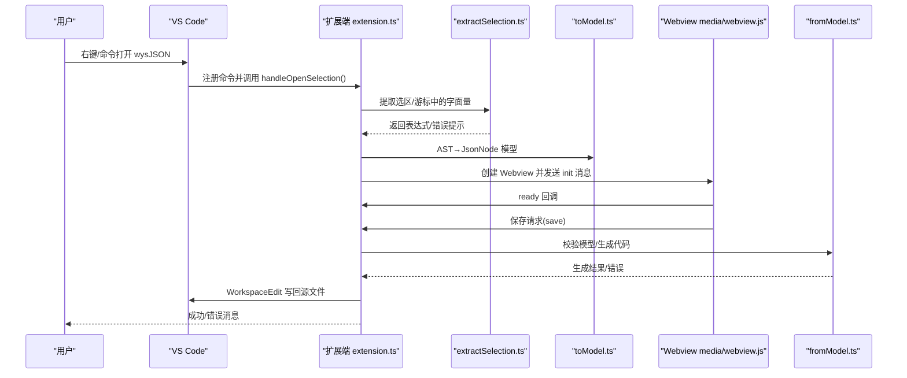
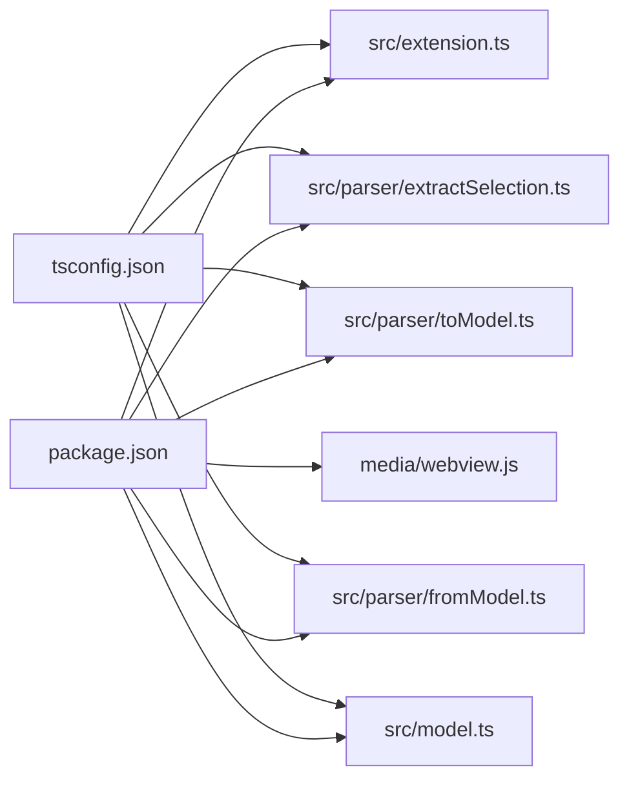

# 故障排除和常见问题

<cite>
**本文引用的文件**
- [package.json](file://package.json)
- [tsconfig.json](file://tsconfig.json)
- [src/extension.ts](file://src/extension.ts)
- [src/model.ts](file://src/model.ts)
- [src/parser/extractSelection.ts](file://src/parser/extractSelection.ts)
- [src/parser/toModel.ts](file://src/parser/toModel.ts)
- [src/parser/fromModel.ts](file://src/parser/fromModel.ts)
- [media/webview.js](file://media/webview.js)
- [index.html](file://index.html)
- [wysJSON.html](file://wysJSON.html)
- [README.md](file://README.md)
- [todo.md](file://todo.md)
- [jsonDemo/aa.md](file://jsonDemo/aa.md)
</cite>

## 目录
1. [简介](#简介)
2. [项目结构](#项目结构)
3. [核心组件](#核心组件)
4. [架构总览](#架构总览)
5. [详细组件分析](#详细组件分析)
6. [依赖关系分析](#依赖关系分析)
7. [性能考虑](#性能考虑)
8. [故障排除指南](#故障排除指南)
9. [结论](#结论)
10. [附录](#附录)

## 简介
本文件面向 wysJSON 用户与维护者，提供系统化的故障排除与常见问题解答。内容涵盖安装与环境兼容性、配置与语言偏好、功能使用问题、性能相关问题、调试与日志分析、错误码与错误信息解释、预防性措施与最佳实践、报告缺陷与获取支持、以及版本兼容性与升级注意事项。

## 项目结构
wysJSON 是一个 VS Code 扩展，核心由 TypeScript 扩展端与 Webview 前端组成。扩展端负责从 VS Code 编辑器中提取 JSON/JS 字面量、转换为中间模型、通过 Webview 展示与交互，并在保存时回写源文件。

```mermaid
graph TB
subgraph "VS Code 扩展端"
EXT["extension.ts<br/>激活与命令处理"]
EX["parser/extractSelection.ts<br/>选区/游标提取"]
TOM["parser/toModel.ts<br/>AST→模型"]
FROM["parser/fromModel.ts<br/>模型→代码生成/校验"]
MODEL["model.ts<br/>JsonNode/SourceInfo/消息类型"]
end
subgraph "Webview 前端"
WVJS["media/webview.js<br/>UI 状态/本地化/消息收发"]
IDX["index.html / wysJSON.html<br/>样式与布局"]
end
EXT --> EX
EX --> TOM
TOM --> MODEL
MODEL --> FROM
EXT <- --> WVJS
WVJS --> IDX
```

**图表来源**
- [src/extension.ts:19-44](file://src/extension.ts#L19-L44)
- [src/parser/extractSelection.ts:34-101](file://src/parser/extractSelection.ts#L34-L101)
- [src/parser/toModel.ts:10-90](file://src/parser/toModel.ts#L10-L90)
- [src/parser/fromModel.ts:20-57](file://src/parser/fromModel.ts#L20-L57)
- [src/model.ts:15-54](file://src/model.ts#L15-L54)
- [media/webview.js:11-51](file://media/webview.js#L11-L51)
- [index.html:1-120](file://index.html#L1-L120)
- [wysJSON.html:1-120](file://wysJSON.html#L1-L120)

**章节来源**
- [package.json:1-93](file://package.json#L1-L93)
- [tsconfig.json:1-25](file://tsconfig.json#L1-L25)
- [README.md:1-80](file://README.md#L1-L80)

## 核心组件
- 扩展入口与命令注册：激活事件、命令注册、Webview 创建与消息通道。
- 选区/游标提取：基于 Babel 的表达式/语句解析，容错提取对象/数组字面量。
- AST 到模型：将 AST 节点映射为 JsonNode，保留原始文本以便回写。
- 模型到代码：生成回写代码，校验 codeText 节点的 JS 语法有效性。
- Webview 交互：UI 状态、本地化、消息收发、保存/取消流程。
- 数据模型：JsonNode、SourceInfo、消息类型定义。

**章节来源**
- [src/extension.ts:19-44](file://src/extension.ts#L19-L44)
- [src/parser/extractSelection.ts:34-101](file://src/parser/extractSelection.ts#L34-L101)
- [src/parser/toModel.ts:10-90](file://src/parser/toModel.ts#L10-L90)
- [src/parser/fromModel.ts:20-57](file://src/parser/fromModel.ts#L20-L57)
- [src/model.ts:15-54](file://src/model.ts#L15-L54)
- [media/webview.js:11-51](file://media/webview.js#L11-L51)

## 架构总览
下图展示从 VS Code 菜单触发到保存回写的完整流程。



**图表来源**
- [src/extension.ts:46-378](file://src/extension.ts#L46-L378)
- [src/parser/extractSelection.ts:34-101](file://src/parser/extractSelection.ts#L34-L101)
- [src/parser/toModel.ts:10-90](file://src/parser/toModel.ts#L10-L90)
- [src/parser/fromModel.ts:20-57](file://src/parser/fromModel.ts#L20-L57)
- [media/webview.js:1-200](file://media/webview.js#L1-L200)

## 详细组件分析

### 组件一：扩展端激活与命令处理
- 激活事件：注册两个命令，分别用于本地化与英文标签。
- Webview 创建：设置 CSP、注入样式与脚本、传递语言偏好。
- 消息处理：接收 ready 初始化数据；处理保存、取消等消息。
- 文档版本检查：保存前校验文档版本，避免覆盖修改。

**章节来源**
- [src/extension.ts:19-44](file://src/extension.ts#L19-L44)
- [src/extension.ts:328-378](file://src/extension.ts#L328-L378)
- [src/extension.ts:397-490](file://src/extension.ts#L397-L490)

### 组件二：选区/游标提取（extractSelection）
- 选区直取：尝试解析为表达式，若命中对象/数组字面量则成功。
- 语句扫描：解析为语句，提取变量声明/表达式语句中的字面量，要求唯一。
- 游标提取：在任意位置查找最外层 JSON-like 节点，支持变量初始化优先。
- 备选策略：全文档解析失败时，采用括号匹配的轻量扫描。

**章节来源**
- [src/parser/extractSelection.ts:34-101](file://src/parser/extractSelection.ts#L34-L101)
- [src/parser/extractSelection.ts:108-229](file://src/parser/extractSelection.ts#L108-L229)
- [src/parser/extractSelection.ts:237-343](file://src/parser/extractSelection.ts#L237-L343)

### 组件三：AST 到模型（toModel）
- 对象/数组：递归转换属性/元素，保留原始 raw 文本。
- 基元：字符串/数字/布尔/null 直接映射。
- 其他：函数、标识符、模板等作为 codeText 节点，标记为“代码文本”。

**章节来源**
- [src/parser/toModel.ts:10-90](file://src/parser/toModel.ts#L10-L90)
- [src/parser/toModel.ts:92-158](file://src/parser/toModel.ts#L92-L158)
- [src/parser/toModel.ts:160-209](file://src/parser/toModel.ts#L160-L209)

### 组件四：模型到代码与校验（fromModel）
- 生成：根据 JsonNode 生成 JS/JSON 代码，处理缩进与换行。
- 校验：对 codeText 节点进行语法校验，支持对象方法的特殊判断。
- 错误包装：统一返回 GenerationResult/ValidationResult。

**章节来源**
- [src/parser/fromModel.ts:20-57](file://src/parser/fromModel.ts#L20-L57)
- [src/parser/fromModel.ts:67-90](file://src/parser/fromModel.ts#L67-L90)
- [src/parser/fromModel.ts:92-117](file://src/parser/fromModel.ts#L92-L117)

### 组件五：Webview 交互与本地化（media/webview.js）
- UI 状态：跟踪折叠/缩略图/迷你地图/填充拖拽等。
- 本地化：支持 en/zh-CN，动态翻译 UI 文案。
- 消息协议：与扩展端通信，发送 setLanguage/save/cancel 等消息。

**章节来源**
- [media/webview.js:11-51](file://media/webview.js#L11-L51)
- [media/webview.js:57-187](file://media/webview.js#L57-L187)
- [media/webview.js:1-200](file://media/webview.js#L1-L200)

### 组件六：数据模型定义（model.ts）
- JsonNode：节点种类、值、原始文本、子节点/数组项、写回模式等。
- SourceInfo：源文件 URI、选区文本、起止位置、文档版本、缩进、原始行。
- 消息类型：Init/Save/Preview/Cancel 及响应类型。

**章节来源**
- [src/model.ts:15-54](file://src/model.ts#L15-L54)
- [src/model.ts:59-103](file://src/model.ts#L59-L103)

## 依赖关系分析
- 运行时依赖：VS Code 引擎版本要求、monaco-editor、@babel/*。
- 开发依赖：TypeScript、@types/vscode、@vscode/vsce。
- 构建与编译：tsconfig 指定 ES2020、commonjs、严格模式、sourceMap 等。



**图表来源**
- [package.json:86-91](file://package.json#L86-L91)
- [tsconfig.json:2-14](file://tsconfig.json#L2-L14)
- [src/extension.ts:6-15](file://src/extension.ts#L6-L15)
- [src/parser/extractSelection.ts:6-11](file://src/parser/extractSelection.ts#L6-L11)
- [src/parser/toModel.ts:6-8](file://src/parser/toModel.ts#L6-L8)
- [src/parser/fromModel.ts:6-8](file://src/parser/fromModel.ts#L6-L8)
- [src/model.ts:1-4](file://src/model.ts#L1-L4)

**章节来源**
- [package.json:86-91](file://package.json#L86-L91)
- [tsconfig.json:2-14](file://tsconfig.json#L2-L14)

## 性能考虑
- 大 JSON 加载：项目计划实现“逐层加载”，未加载部分以空字符串占位并提示，避免一次性渲染超大对象导致卡顿。
- 括号扫描窗口：游标提取的括号扫描限制了搜索窗口大小，防止长文本全量扫描造成性能问题。
- 缩进与格式化：生成代码时按缩进格式化，避免多余空白影响渲染性能。

**章节来源**
- [todo.md:3-6](file://todo.md#L3-L6)
- [src/parser/extractSelection.ts:242-244](file://src/parser/extractSelection.ts#L242-L244)
- [src/parser/fromModel.ts:35-45](file://src/parser/fromModel.ts#L35-L45)

## 故障排除指南

### 一、安装与环境兼容性问题
- VS Code 版本不满足引擎要求
  - 现象：扩展无法激活或功能异常。
  - 排查：检查 engines.vscode 是否满足 ^1.85.0。
  - 处理：升级 VS Code 至满足要求的版本。
  
  **章节来源**
  - [package.json:8-10](file://package.json#L8-L10)

- 依赖缺失或构建失败
  - 现象：编译报错、找不到模块。
  - 排查：确认 node_modules 存在，依赖安装完成；检查 tsconfig 的 target/module/lib 设置。
  - 处理：执行安装与编译命令，确保输出目录与声明文件生成正常。
  
  **章节来源**
  - [tsconfig.json:2-14](file://tsconfig.json#L2-L14)
  - [package.json:69-76](file://package.json#L69-L76)

- Webview CSP 与资源加载
  - 现象：样式/脚本未生效、资源 404。
  - 排查：确认 Webview CSP 策略允许内联样式与脚本；localResourceRoots 指向 media 目录。
  - 处理：修正 CSP 与资源路径，确保扩展打包包含 media 文件。
  
  **章节来源**
  - [src/extension.ts:333-339](file://src/extension.ts#L333-L339)
  - [src/extension.ts:524-533](file://src/extension.ts#L524-L533)

### 二、功能使用问题
- 无法识别选区中的数据结构
  - 现象：弹出“无法识别选区中的数据结构”等错误。
  - 排查：选区是否包含对象/数组字面量；是否被多个候选包围；是否为纯 JS 表达式。
  - 处理：缩小选区至单一对象/数组字面量；或选择包含该字面量的变量初始化语句。
  
  **章节来源**
  - [src/extension.ts:111-119](file://src/extension.ts#L111-L119)
  - [src/parser/extractSelection.ts:74-89](file://src/parser/extractSelection.ts#L74-L89)

- 在 Markdown 代码块中编辑失败
  - 现象：跨 fenced code block 的选区无法正确提取。
  - 排查：确认选区位于同一代码块内；游标是否在 fenced 区间。
  - 处理：确保选区位于同一 ``` 区间；或在代码块外使用普通选区/游标提取。
  
  **章节来源**
  - [src/extension.ts](file://src/extension.ts#L66-L105)
  - [src/extension.ts](file://src/extension.ts#L164-L240)

- 保存时报“文档已被修改”
  - 现象：保存失败并提示需重新打开编辑器。
  - 排查：保存前文档版本发生变化，可能被其他编辑器或自动保存修改。
  - 处理：重新打开编辑器以获取最新版本；避免在编辑期间频繁外部修改。
  
  **章节来源**
  - [src/extension.ts](file://src/extension.ts#L424-L430)

- 代码文本节点语法无效
  - 现象：编辑 codeText 节点后保存失败。
  - 排查：是否为空；是否为对象方法但无法解析；是否为非法 JS 表达式。
  - 处理：补充非空内容；确保对象方法语法正确；修正表达式。
  
  **章节来源**
  - [src/parser/fromModel.ts](file://src/parser/fromModel.ts#L95-L117)

- 本地化与语言偏好
  - 现象：菜单/提示语言不符合预期。
  - 排查：检查全局状态中的语言偏好；context key wysjson.lang 是否正确设置。
  - 处理：通过语言选择器切换；确认 setContext 执行成功。
  
  **章节来源**
  - [src/extension.ts](file://src/extension.ts#L312-L326)
  - [media/webview.js](file://media/webview.js#L57-L187)

### 三、性能相关问题
- 打开超大 JSON 卡顿
  - 现象：界面长时间无响应。
  - 排查：是否为超大对象/数组；是否一次性渲染。
  - 处理：启用“逐层加载”策略；分层展开节点；减少一次性渲染的数据量。
  
  **章节来源**
  - [todo.md](file://todo.md#L3-L6)

- 游标提取缓慢
  - 现象：在长文本中定位字面量耗时较长。
  - 排查：是否触发全文档解析；括号扫描窗口是否过大。
  - 处理：尽量靠近目标字面量；避免在极长文本中反复游标提取。
  
  **章节来源**
  - [src/parser/extractSelection.ts](file://src/parser/extractSelection.ts#L242-L244)

### 四、调试与日志分析
- 使用控制台日志
  - 扩展端：在关键路径打印日志（如激活、初始化、消息类型、错误）。
  - Webview：在 ready/save/cancel 等消息处记录状态变化。
  
  **章节来源**
  - [src/extension.ts](file://src/extension.ts#L39-L40)
  - [src/extension.ts](file://src/extension.ts#L351-L356)
  - [src/extension.ts](file://src/extension.ts#L420-L428)
  - [media/webview.js](file://media/webview.js#L1-L200)

- 开发者工具
  - 在 VS Code 中打开扩展开发主机的开发者工具，查看扩展端与 Webview 的 Console 输出。
  - 检查网络面板，确认媒体资源加载正常。

- 日志与状态
  - Webview 本地存储键：用于持久化 UI 状态（如缩略图开关、快速跳转等）。
  
  **章节来源**
  - [media/webview.js](file://media/webview.js#L11-L13)

### 五、错误码与错误信息解释
- 选区提取类
  - “选区为空”、“未找到对象或数组字面量”、“找到 N 个候选对象/数组字面量，请精确选择其中一个”。
  - 处理：缩小/调整选区；确保仅包含一个字面量。
  
  **章节来源**
  - [src/parser/extractSelection.ts](file://src/parser/extractSelection.ts#L37-L100)

- AST 转模型类
  - “转换模型失败: …”：通常由异常抛出引起。
  - 处理：检查输入表达式的合法性；确认原始文本与 AST 范围一致。
  
  **章节来源**
  - [src/extension.ts](file://src/extension.ts#L126-L131)

- 代码生成与校验类
  - “代码生成失败: …”、“代码文本节点包含无效的 JavaScript 代码”、“代码文本无效: …”、“代码文本不能为空”。
  - 处理：修正 codeText 内容；确保对象方法语法正确；避免空内容。
  
  **章节来源**
  - [src/parser/fromModel.ts](file://src/parser/fromModel.ts#L51-L56)
  - [src/parser/fromModel.ts](file://src/parser/fromModel.ts#L95-L117)

- 写回类
  - “写回编辑器失败: …”、“WorkspaceEdit 应用失败”。
  - 处理：检查权限与文件锁定；避免并发写入；重试或重启 VS Code。
  
  **章节来源**
  - [src/extension.ts](file://src/extension.ts#L481-L486)

- 文档版本类
  - “文档已被修改，请重新打开编辑器以避免覆盖更改”。
  - 处理：重新打开编辑器；避免在编辑期间外部修改。
  
  **章节来源**
  - [src/extension.ts](file://src/extension.ts#L424-L430)

### 六、预防性措施与最佳实践
- 选区与游标
  - 优先选择明确的对象/数组字面量；避免包含多个候选。
  - 在 Markdown 中确保选区位于 fenced code block 内。
  
  **章节来源**
  - [src/parser/extractSelection.ts](file://src/parser/extractSelection.ts#L74-L89)
  - [src/extension.ts](file://src/extension.ts#L66-L105)

- 代码文本节点
  - 保持非空；遵循 JS/对象方法语法；避免非法表达式。
  
  **章节来源**
  - [src/parser/fromModel.ts](file://src/parser/fromModel.ts#L95-L117)

- 写回安全
  - 保存前确保文档未被外部修改；避免并发编辑。
  
  **章节来源**
  - [src/extension.ts](file://src/extension.ts#L424-L430)

- 性能优化
  - 对超大 JSON 使用“逐层加载”；减少一次性渲染；合理使用缩进与换行。
  
  **章节来源**
  - [todo.md](file://todo.md#L3-L6)
  - [src/parser/fromModel.ts](file://src/parser/fromModel.ts#L35-L45)

### 七、报告缺陷与获取支持
- 信息收集
  - VS Code 版本、wysJSON 版本、操作系统、复现步骤、期望与实际结果。
  - 选区/游标上下文、JSON 结构片段（脱敏后）、错误日志。
  
- 提交渠道
  - 依据项目说明，结合仓库提供的 GitHub Pages 工作流与发布产物进行反馈。
  
**章节来源**
- [.github/workflows/github-pages.yml](file://.github/workflows/github-pages.yml)
- [README.md](file://README.md#L1-L80)

### 八、版本兼容性与升级注意事项
- VS Code 引擎版本
  - 当前要求 ^1.85.0；升级 VS Code 时留意 API 变更。
  
  **章节来源**
  - [package.json](file://package.json#L8-L10)

- 依赖版本
  - monaco-editor、@babel/* 等版本变更可能影响构建与运行。
  - 升级前先执行安装与编译，确保无错误。
  
  **章节来源**
  - [package.json](file://package.json#L86-L91)

- 本地化与菜单
  - 语言切换与菜单显示依赖全局状态与 context key；升级后验证语言切换与菜单可见性。
  
  **章节来源**
  - [src/extension.ts](file://src/extension.ts#L312-L326)
  - [media/webview.js](file://media/webview.js#L57-L187)

## 结论
本故障排除文档围绕安装、配置、使用、性能与调试等方面，提供了系统化的问题定位与解决路径。建议在日常使用中遵循最佳实践，出现问题时按“现象—排查—处理”的流程定位根因，并结合日志与开发者工具进行深入分析。对于复杂问题，按“报告缺陷与获取支持”流程提交信息，以便快速获得帮助。

## 附录

### A. 常见问题速查表
- 问：为什么选区提取失败？
  - 答：检查是否包含单一对象/数组字面量；在 Markdown 中确保 fenced 区间。
  
  **章节来源**
  - [src/parser/extractSelection.ts](file://src/parser/extractSelection.ts#L74-L89)
  - [src/extension.ts](file://src/extension.ts#L66-L105)

- 问：保存时报错“文档已被修改”怎么办？
  - 答：重新打开编辑器；避免外部修改；检查自动保存设置。
  
  **章节来源**
  - [src/extension.ts](file://src/extension.ts#L424-L430)

- 问：如何切换语言？
  - 答：使用 Webview 顶部语言选择器；扩展端会更新全局状态与 context key。
  
  **章节来源**
  - [media/webview.js](file://media/webview.js#L57-L187)
  - [src/extension.ts](file://src/extension.ts#L312-L326)

### B. 示例场景与建议
- Markdown fenced code block 场景
  - 建议：确保选区位于同一 ``` 区间；必要时使用变量初始化语句。
  
  **章节来源**
  - [src/extension.ts:66-105](file://src/extension.ts#L66-L105)

- 超大 JSON 场景
  - 建议：启用逐层加载；分层展开；避免一次性渲染。
  
  **章节来源**
  - [todo.md:3-6](file://todo.md#L3-L6)

- 代码文本节点
  - 建议：保持非空；遵循 JS/对象方法语法；避免非法表达式。
  
  **章节来源**
  - [src/parser/fromModel.ts:95-117](file://src/parser/fromModel.ts#L95-L117)