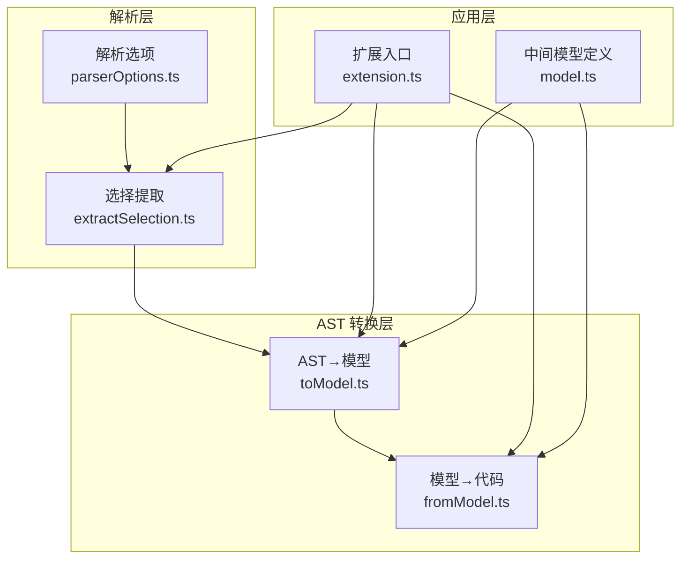
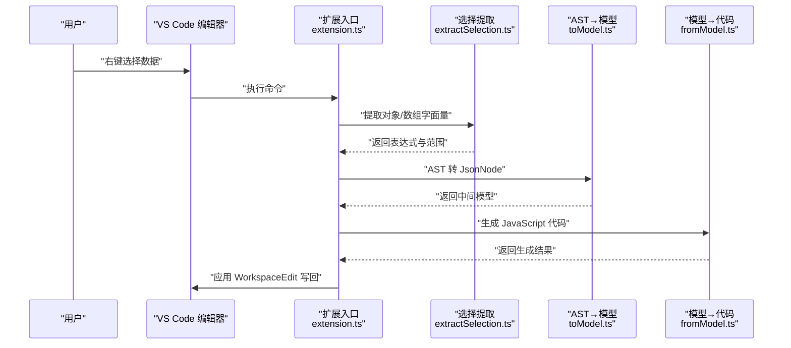
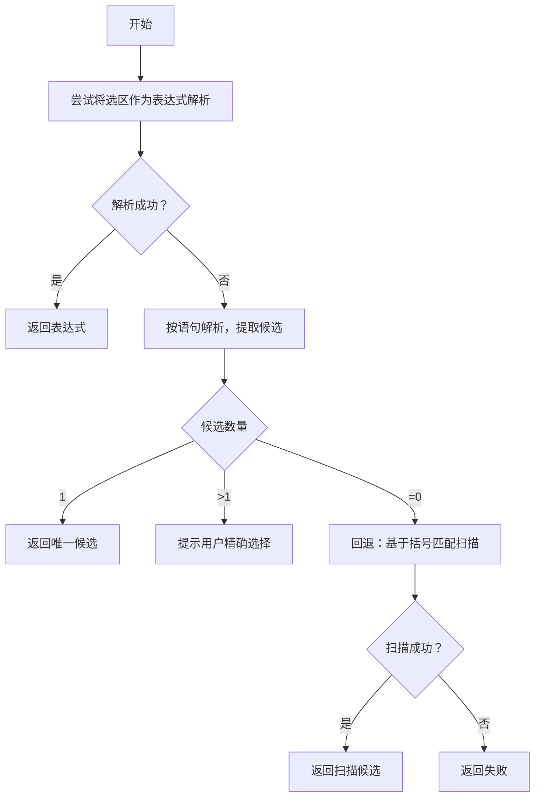
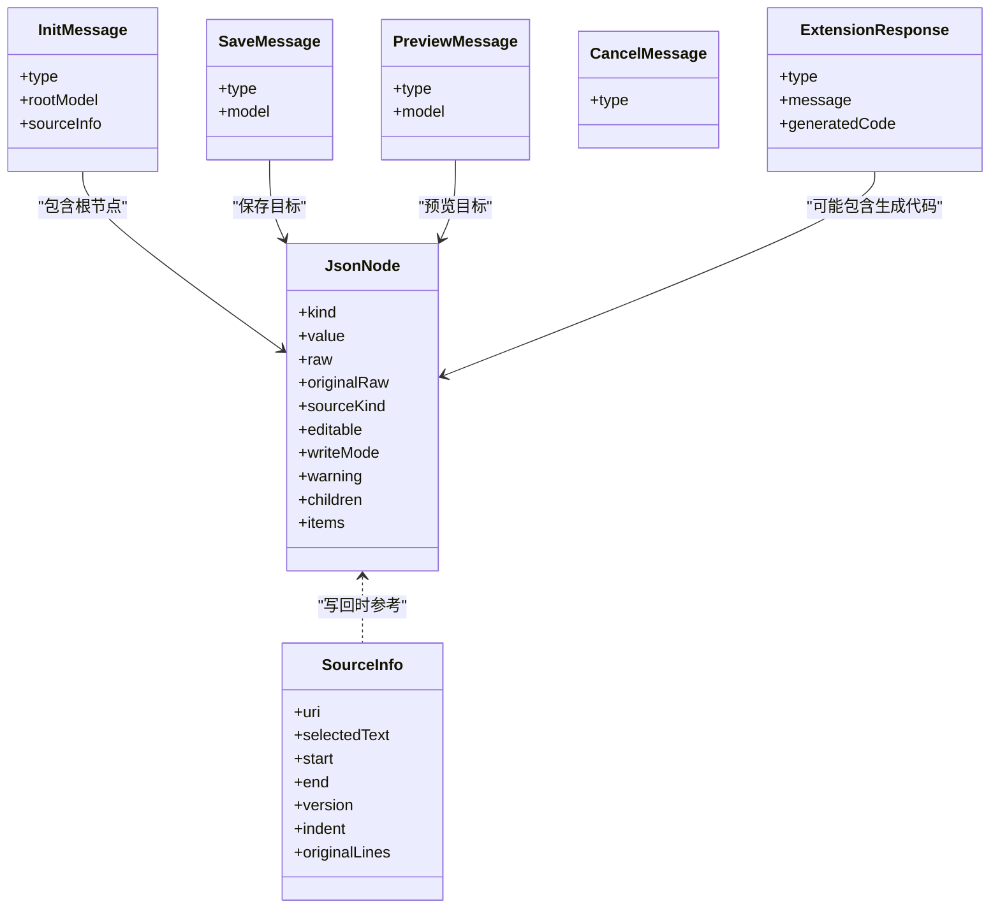
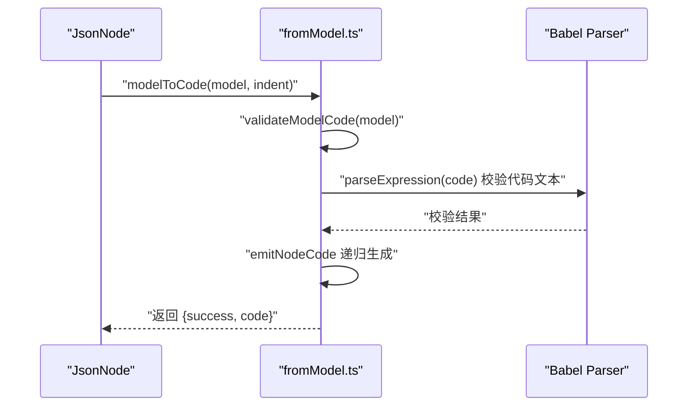
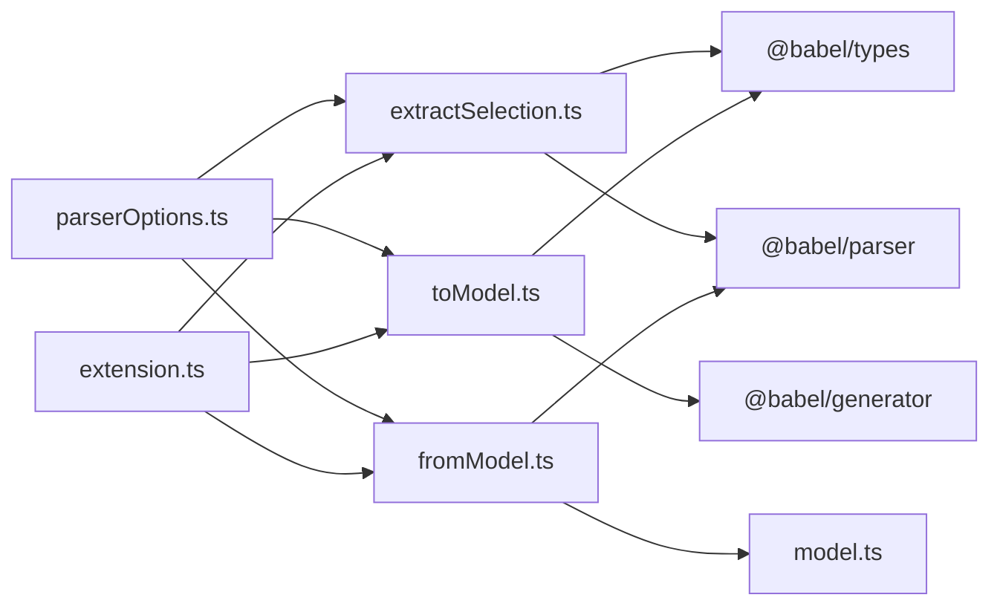

# JavaScript/TypeScript 文件支持

<cite>
**本文引用的文件**
- [src/parser/parserOptions.ts](file://src/parser/parserOptions.ts)
- [src/parser/extractSelection.ts](file://src/parser/extractSelection.ts)
- [src/parser/toModel.ts](file://src/parser/toModel.ts)
- [src/parser/fromModel.ts](file://src/parser/fromModel.ts)
- [src/model.ts](file://src/model.ts)
- [src/extension.ts](file://src/extension.ts)
- [package.json](file://package.json)
- [src/types/babel-generator.d.ts](file://src/types/babel-generator.d.ts)
- [jsonDemo/字面量.js](file://jsonDemo/字面量.js)
- [jsonDemo/testData.js](file://jsonDemo/testData.js)
</cite>

## 目录
1. [引言](#引言)
2. [项目结构](#项目结构)
3. [核心组件](#核心组件)
4. [架构总览](#架构总览)
5. [详细组件分析](#详细组件分析)
6. [依赖关系分析](#依赖关系分析)
7. [性能考量](#性能考量)
8. [故障排查指南](#故障排查指南)
9. [结论](#结论)
10. [附录](#附录)

## 引言
本文件面向希望深入理解 JSONOKOK 在 JavaScript/TypeScript 文件中如何解析与转换 AST 的开发者，系统阐述以下主题：
- Babel 解析器的配置与使用策略
- 代码保留机制：如何在解析过程中保持原始代码格式与注释
- 变量声明初始化器的提取策略与复杂嵌套结构处理
- 类型安全与错误恢复机制
- 典型场景下的解析与转换流程示例
- 性能优化建议与最佳实践

## 项目结构
JSONOKOK 的 JavaScript/TypeScript 支持主要由以下模块构成：
- 解析选项与插件配置：统一管理 Babel 解析器的插件集合与通用解析选项
- 选择区域提取：从用户选区或光标位置提取对象/数组字面量，支持变量初始化器优先策略
- AST 到中间模型：将 Babel AST 转换为 JSONOKOK 的 JsonNode 中间表示，并尽可能保留原始源码
- 中间模型到代码：将编辑后的 JsonNode 写回为 JavaScript 源码，同时进行语法校验与缩进处理
- 扩展入口：VS Code 扩展命令入口，负责提取、转换、验证与写回

图表来源
- [src/parser/parserOptions.ts:1-36](file://src/parser/parserOptions.ts#L1-L36)
- [src/parser/extractSelection.ts:1-385](file://src/parser/extractSelection.ts#L1-L385)
- [src/parser/toModel.ts:1-230](file://src/parser/toModel.ts#L1-L230)
- [src/parser/fromModel.ts:1-305](file://src/parser/fromModel.ts#L1-L305)
- [src/extension.ts:1-600](file://src/extension.ts#L1-L600)
- [src/model.ts:1-103](file://src/model.ts#L1-L103)

章节来源
- [src/extension.ts:46-378](file://src/extension.ts#L46-L378)
- [src/parser/extractSelection.ts:34-229](file://src/parser/extractSelection.ts#L34-L229)
- [src/parser/toModel.ts:10-229](file://src/parser/toModel.ts#L10-L229)
- [src/parser/fromModel.ts:20-305](file://src/parser/fromModel.ts#L20-L305)
- [src/parser/parserOptions.ts:3-36](file://src/parser/parserOptions.ts#L3-L36)

## 核心组件
- 解析选项与插件配置
  - 统一维护 Babel 解析器插件集合，确保对 JSX、TypeScript、类属性、装饰器、可选链、空合并、BigInt、顶层 await、import attributes 等特性支持
  - 提供通用解析选项与表达式解析选项，用于不同场景的解析需求
- 选择区域提取
  - 首先尝试将选区作为表达式直接解析；若失败则按语句解析，提取变量初始化器或顶层表达式中的对象/数组字面量
  - 当存在多个候选时，提示用户精确选择；当无候选时，提供基于括号匹配的回退策略
- AST 到中间模型
  - 将对象/数组字面量转换为 JsonNode；属性键根据是否为标识符决定是否加引号
  - 对象方法、扩展运算符等非 JSON 形态保留为“代码文本”节点，以便后续写回
  - 原始源码通过节点起止位置切片保留，确保写回时尽量复用原格式
- 中间模型到代码
  - 递归生成代码，对“代码文本”节点直接输出原始代码
  - 对对象/数组进行缩进与换行控制，保持可读性
  - 写回前对“代码文本”节点进行语法校验，防止引入语法错误
- 扩展入口
  - 处理 VS Code 编辑器上下文菜单命令，完成提取、转换、验证与写回
  - 通过 SourceInfo 记录选区位置、缩进与原始行，保障写回的安全性与一致性

章节来源
- [src/parser/parserOptions.ts:3-36](file://src/parser/parserOptions.ts#L3-L36)
- [src/parser/extractSelection.ts:34-229](file://src/parser/extractSelection.ts#L34-L229)
- [src/parser/toModel.ts:10-229](file://src/parser/toModel.ts#L10-L229)
- [src/parser/fromModel.ts:20-305](file://src/parser/fromModel.ts#L20-L305)
- [src/extension.ts:46-490](file://src/extension.ts#L46-L490)

## 架构总览
下图展示了从用户选区到最终写回的端到端流程，涵盖解析、转换、验证与生成阶段。

图表来源
- [src/extension.ts:46-490](file://src/extension.ts#L46-L490)
- [src/parser/extractSelection.ts:34-229](file://src/parser/extractSelection.ts#L34-L229)
- [src/parser/toModel.ts:10-229](file://src/parser/toModel.ts#L10-L229)
- [src/parser/fromModel.ts:20-305](file://src/parser/fromModel.ts#L20-L305)

## 详细组件分析

### 解析选项与插件配置
- 插件集合
  - jsx、typescript、classProperties、classPrivateProperties、classPrivateMethods、decorators-legacy、objectRestSpread、optionalChaining、nullishCoalescingOperator、bigInt、topLevelAwait、importAttributes
  - 这些插件确保对现代 JavaScript/TypeScript 特性的完整支持
- 通用解析选项
  - sourceType 设为 module，允许导入导出出现在任意位置
  - 合并额外选项，便于上层调用方灵活定制
- 表达式解析选项
  - 与通用选项一致，用于仅解析表达式的场景

章节来源
- [src/parser/parserOptions.ts:3-36](file://src/parser/parserOptions.ts#L3-L36)

### 选择区域提取（变量声明初始化器与复杂嵌套）
- 直接表达式解析
  - 若选区恰好为对象/数组字面量，直接使用
- 语句解析与变量初始化器优先
  - 若选区为更广范围（如函数体），解析为语句后提取候选
  - 当存在变量声明且其初始化器为 JSON-like 时，优先返回该初始化器，提升用户体验
- 多候选与无候选处理
  - 多候选时提示用户精确选择
  - 无候选时采用基于括号匹配的回退策略，扫描左右窗口内的匹配括号，再尝试解析候选表达式
- 性能与健壮性
  - 回退策略限制扫描窗口大小，避免长文本导致性能问题
  - 即使全文件解析失败，也尝试回退策略，提高可用性

图表来源
- [src/parser/extractSelection.ts:34-229](file://src/parser/extractSelection.ts#L34-L229)

章节来源
- [src/parser/extractSelection.ts:34-229](file://src/parser/extractSelection.ts#L34-L229)

### AST 到中间模型（保留原始代码与处理复杂结构）
- 基元与字面量
  - 字符串、数值、布尔、null 字面量优先保留原始 raw 值，确保写回时格式一致
- 对象与数组
  - 对象属性键：若为标识符则不加引号，否则使用 JSON.stringify 包裹
  - 对象方法：保留为“代码文本”节点，标记 sourceKind 为 objectMethod
  - 扩展运算符：保留为“代码文本”节点，标记 sourceKind 为 spread，并给出不可编辑警告
  - 数组中的洞（holes）：映射为 null 节点
- 原始源码保留
  - 通过节点 start/end 与 originalSource 切片，尽可能保留原始格式
  - 无法切片时回退到 @babel/generator 生成代码
- 类型安全与类型定义
  - 使用 @babel/types 进行类型判断，确保分支逻辑正确
  - 通过 TypeScript 类型定义约束中间模型字段与消息协议

图表来源
- [src/model.ts:15-103](file://src/model.ts#L15-L103)

章节来源
- [src/parser/toModel.ts:10-229](file://src/parser/toModel.ts#L10-L229)
- [src/model.ts:15-103](file://src/model.ts#L15-L103)
- [src/types/babel-generator.d.ts:1-28](file://src/types/babel-generator.d.ts#L1-L28)

### 中间模型到代码（保持格式与注释、语法校验）
- 代码生成策略
  - 字面量节点：按 JSON 规范序列化
  - “代码文本”节点：直接输出原始代码，保持原格式
  - 对象/数组：递归生成，处理多行与缩进
  - 对象方法与扩展：特殊处理，确保写回时仍为合法 JavaScript
- 语法校验
  - 对“代码文本”节点进行表达式级解析校验，确保语法有效
  - 对对象方法进行特殊判定：通过包裹为对象字面量的方式验证其合法性
- 错误处理
  - 生成阶段捕获异常并返回错误信息
  - 写回前再次校验，避免引入语法错误

图表来源
- [src/parser/fromModel.ts:20-305](file://src/parser/fromModel.ts#L20-L305)

章节来源
- [src/parser/fromModel.ts:20-305](file://src/parser/fromModel.ts#L20-L305)

### 扩展入口（命令、消息与写回）
- 命令注册
  - 注册“打开 JSONOKOK”命令，处理编辑器上下文菜单触发
- 选区与光标提取
  - 支持 Markdown 代码块内提取、JS/TS 文件光标定位提取、普通文本文件的光标提取
  - 对 JS/TS 文件优先使用 AST 提取，增强准确性
- 写回安全检查
  - 比较文档版本，防止并发修改导致覆盖
  - 写回前二次校验，确保生成代码语法有效
- 生成与应用
  - 使用 SourceInfo 定位替换范围，应用 WorkspaceEdit 写回

章节来源
- [src/extension.ts:46-490](file://src/extension.ts#L46-L490)

## 依赖关系分析
- 外部依赖
  - @babel/parser：解析 JavaScript/TypeScript，支持多种语言特性
  - @babel/types：类型判断与 AST 结构辅助
  - @babel/generator：在无法切片时生成代码
  - monaco-editor：Webview 编辑器（扩展打包时包含）
- 内部模块耦合
  - extension.ts 依赖 extractSelection.ts、toModel.ts、fromModel.ts
  - toModel.ts 依赖 @babel/types 与 @babel/generator
  - fromModel.ts 依赖 @babel/parser 与 model.ts
  - parserOptions.ts 为解析层提供统一配置

图表来源
- [src/extension.ts:1-600](file://src/extension.ts#L1-L600)
- [src/parser/extractSelection.ts:1-385](file://src/parser/extractSelection.ts#L1-L385)
- [src/parser/toModel.ts:1-230](file://src/parser/toModel.ts#L1-L230)
- [src/parser/fromModel.ts:1-305](file://src/parser/fromModel.ts#L1-L305)
- [src/parser/parserOptions.ts:1-36](file://src/parser/parserOptions.ts#L1-L36)
- [package.json:77-92](file://package.json#L77-L92)

章节来源
- [package.json:77-92](file://package.json#L77-L92)

## 性能考量
- 选择提取回退策略
  - 限制扫描窗口大小，避免长文本导致性能问题
  - 仅在必要时启用回退策略，优先使用 AST 解析
- AST 遍历与生成
  - 递归遍历 AST 时避免重复计算，尽量利用节点的 start/end 与 originalSource
  - 生成代码时按需缩进，减少字符串拼接开销
- 并发与版本检查
  - 写回前检查文档版本，避免不必要的重解析与生成
- 最佳实践
  - 在大型文件中优先使用变量初始化器提取，减少解析范围
  - 对于超大对象/数组，建议拆分编辑，降低中间模型规模
  - 合理使用缓存：对已解析的表达式与生成结果进行短期缓存（视具体实现）

## 故障排查指南
- 无法识别选区中的数据结构
  - 现象：选区既不是对象/数组字面量，也不包含变量初始化器
  - 排查：确认选区是否为合法 JavaScript/TypeScript 表达式；必要时缩小选区
- 选区内候选过多
  - 现象：找到多个对象/数组字面量
  - 排查：重新选择，确保选区内仅包含一个目标字面量
- 生成代码失败或语法错误
  - 现象：写回时报错或生成代码不可用
  - 排查：检查“代码文本”节点是否包含语法错误；必要时移除或修正
- 文档已被修改
  - 现象：写回前提示文档版本变化
  - 排查：重新打开编辑器以避免覆盖更改

章节来源
- [src/parser/extractSelection.ts:74-100](file://src/parser/extractSelection.ts#L74-L100)
- [src/parser/fromModel.ts:51-57](file://src/parser/fromModel.ts#L51-L57)
- [src/extension.ts:423-430](file://src/extension.ts#L423-L430)

## 结论
JSONOKOK 通过统一的 Babel 解析配置、稳健的选择提取策略、完善的 AST→模型转换与模型→代码生成机制，实现了对 JavaScript/TypeScript 文件的高质量支持。其核心优势在于：
- 保留原始代码与格式，兼顾可读性与一致性
- 对复杂结构（对象方法、扩展运算符、嵌套数组/对象）提供明确的处理策略
- 在写回前进行双重校验，确保类型安全与语法正确
- 提供回退策略与性能优化，提升在大型文件与复杂场景下的可用性

## 附录

### 示例：不同类型的 JavaScript/TypeScript 代码解析与转换
- 对象字面量示例
  - 参考路径：[jsonDemo/字面量.js:3-9](file://jsonDemo/字面量.js#L3-L9)
  - 解析要点：对象方法保留为“代码文本”，键名根据标识符规则决定是否加引号
- 混合数据示例
  - 参考路径：[jsonDemo/testData.js:38-62](file://jsonDemo/testData.js#L38-L62)
  - 解析要点：函数、箭头函数字符串、BigInt、Symbol 等非 JSON 形态均保留为“代码文本”
- 数组与嵌套结构
  - 参考路径：[jsonDemo/testData.js:24-35](file://jsonDemo/testData.js#L24-L35)、[jsonDemo/testData.js:78-103](file://jsonDemo/testData.js#L78-L103)
  - 解析要点：数组中的洞映射为 null；多层嵌套对象保持层级缩进

章节来源
- [jsonDemo/字面量.js:1-17](file://jsonDemo/字面量.js#L1-L17)
- [jsonDemo/testData.js:1-104](file://jsonDemo/testData.js#L1-L104)