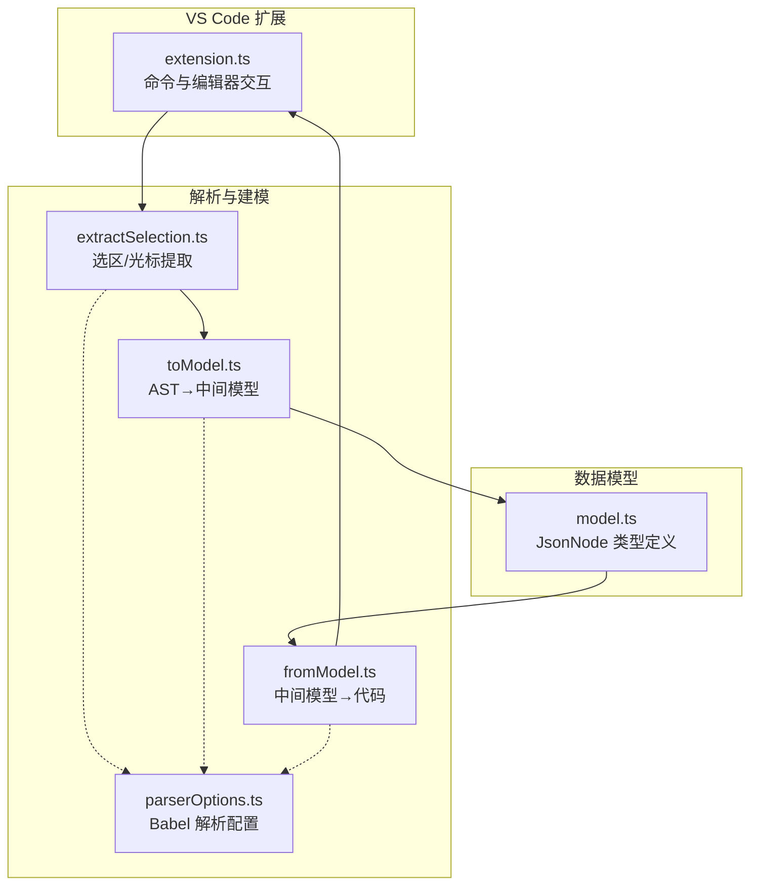
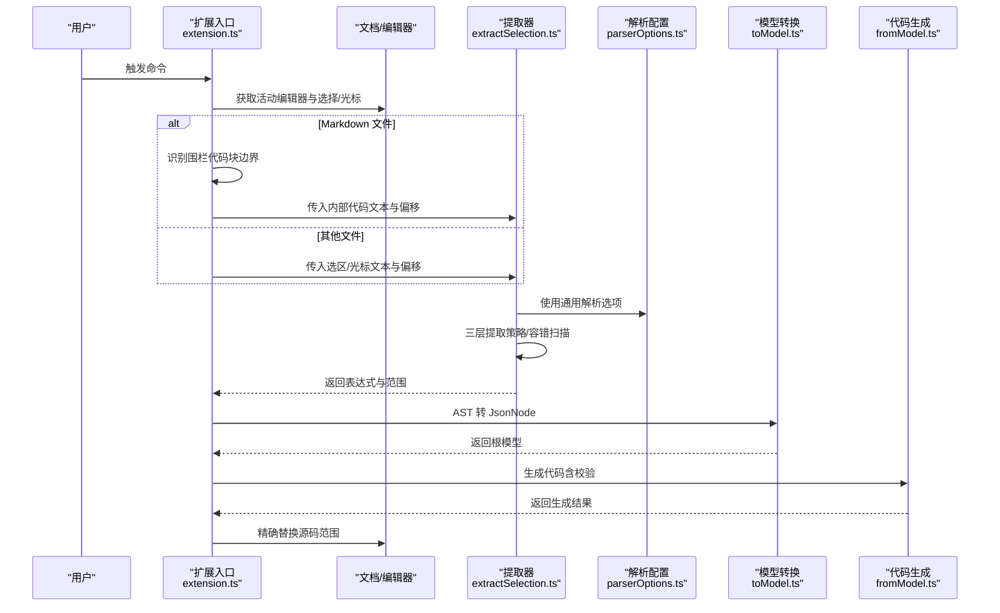
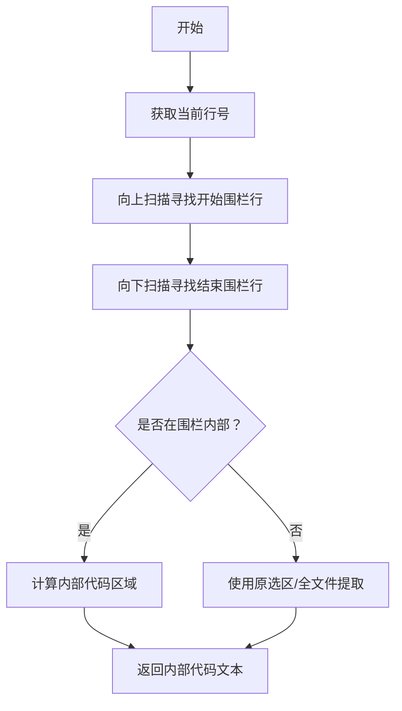
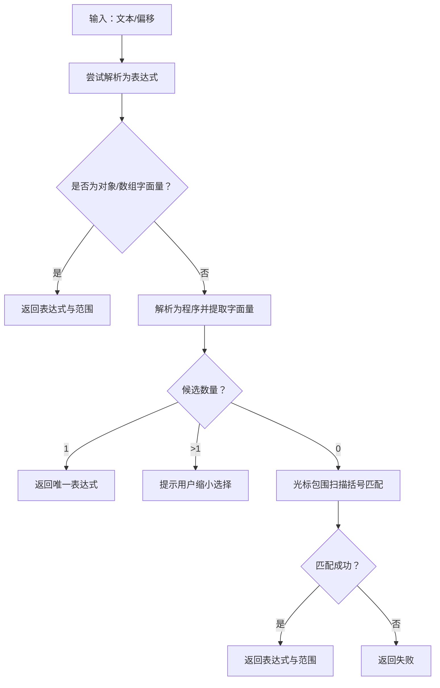
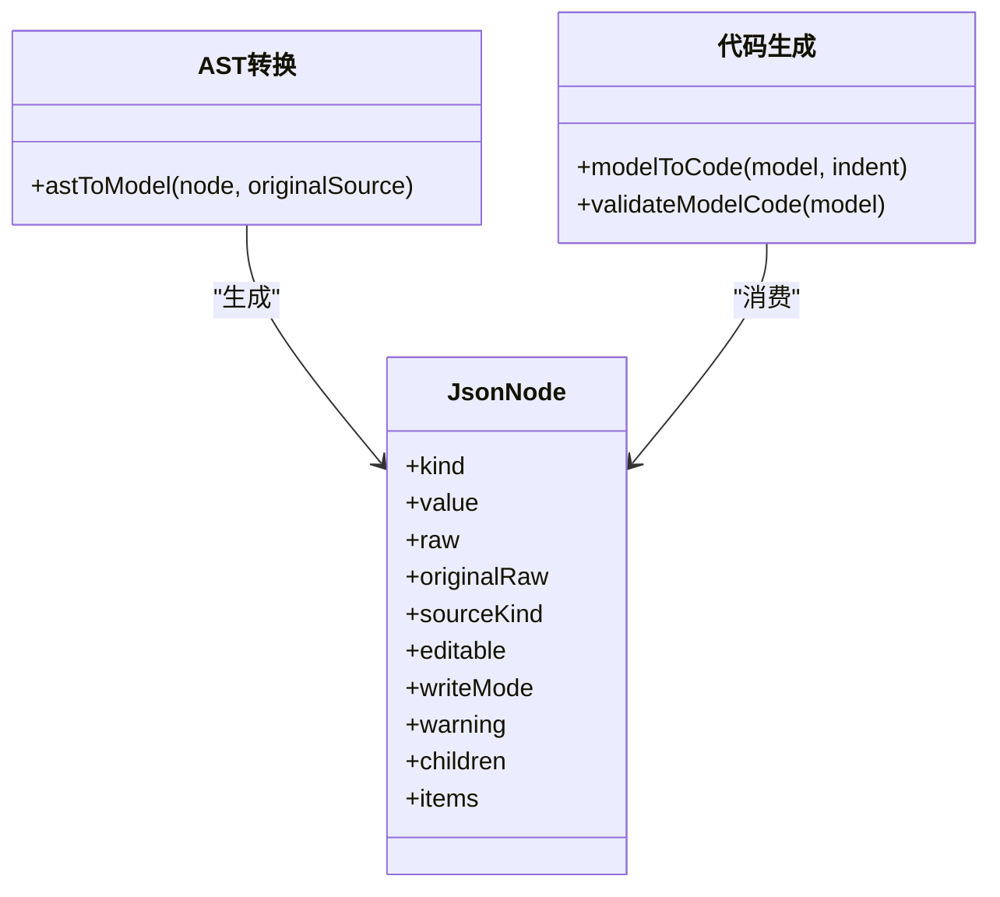
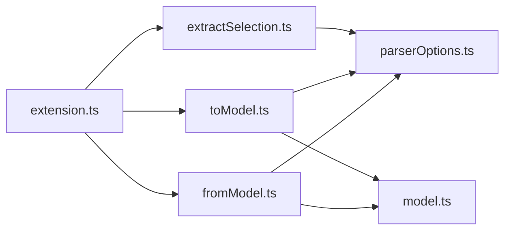

# Markdown 文件支持

<cite>
**本文引用的文件**
- [src/extension.ts](file://src/extension.ts)
- [src/parser/extractSelection.ts](file://src/parser/extractSelection.ts)
- [src/parser/toModel.ts](file://src/parser/toModel.ts)
- [src/parser/fromModel.ts](file://src/parser/fromModel.ts)
- [src/parser/parserOptions.ts](file://src/parser/parserOptions.ts)
- [src/model.ts](file://src/model.ts)
- [package.json](file://package.json)
- [jsonDemo/aa.md](file://jsonDemo/aa.md)
- [jsonDemo/testData.js](file://jsonDemo/testData.js)
- [jsonDemo/001.json](file://jsonDemo/001.json)
- [测试计划.md](file://测试计划.md)
</cite>

## 目录
1. [简介](#简介)
2. [项目结构](#项目结构)
3. [核心组件](#核心组件)
4. [架构总览](#架构总览)
5. [详细组件分析](#详细组件分析)
6. [依赖关系分析](#依赖关系分析)
7. [性能考量](#性能考量)
8. [故障排查指南](#故障排查指南)
9. [结论](#结论)
10. [附录](#附录)

## 简介
本文件系统性说明 wysJSON 在 VS Code 中对 Markdown 文件的支持，尤其是对“围栏代码块（fenced code block）”的识别与提取机制。文档涵盖以下要点：
- Markdown 代码块的识别算法：围栏标记检测、边界确定、语言标识符处理。
- 代码块内 JSON/JS/TS 等内容的提取与解析流程。
- 与 VS Code Markdown 渲染器的协作方式与兼容性。
- 不同语言标识符的代码块处理差异与最佳实践。
- 提取过程中的容错机制与错误处理策略。
- Markdown 中嵌套 JSON 的使用建议与注意事项。

## 项目结构
wysJSON 扩展的核心由三部分组成：
- 扩展入口与 VS Code 集成：负责命令注册、编辑器交互、Markdown 代码块识别与提取。
- 解析与建模：基于 Babel 的语法解析，将代码片段转换为中间模型，并支持回写生成。
- Webview 集成：将中间模型渲染为表格 UI，支持编辑与保存回写。

图表来源
- [src/extension.ts:19-378](file://src/extension.ts#L19-L378)
- [src/parser/extractSelection.ts:34-229](file://src/parser/extractSelection.ts#L34-L229)
- [src/parser/toModel.ts:10-229](file://src/parser/toModel.ts#L10-L229)
- [src/parser/fromModel.ts:20-57](file://src/parser/fromModel.ts#L20-L57)
- [src/parser/parserOptions.ts:20-35](file://src/parser/parserOptions.ts#L20-L35)
- [src/model.ts:15-34](file://src/model.ts#L15-L34)

章节来源
- [src/extension.ts:19-378](file://src/extension.ts#L19-L378)
- [src/parser/extractSelection.ts:34-229](file://src/parser/extractSelection.ts#L34-L229)
- [src/parser/toModel.ts:10-229](file://src/parser/toModel.ts#L10-L229)
- [src/parser/fromModel.ts:20-57](file://src/parser/fromModel.ts#L20-L57)
- [src/parser/parserOptions.ts:20-35](file://src/parser/parserOptions.ts#L20-L35)
- [src/model.ts:15-34](file://src/model.ts#L15-L34)

## 核心组件
- 代码块识别与裁剪：在 Markdown 文件中定位围栏代码块，计算内部代码区域，避免将围栏标记纳入提取范围。
- 结构化提取：对选区或光标位置进行三层容错提取，优先匹配对象/数组字面量，其次变量初始化，最后容错扫描。
- AST 转中间模型：将 Babel AST 节点映射为 JsonNode，保留非 JSON 代码为 codeText 节点。
- 模型回写：校验编辑后的模型，生成格式化代码并精确替换源码范围。

章节来源
- [src/extension.ts:64-108](file://src/extension.ts#L64-L108)
- [src/extension.ts:164-240](file://src/extension.ts#L164-L240)
- [src/parser/extractSelection.ts:34-101](file://src/parser/extractSelection.ts#L34-L101)
- [src/parser/toModel.ts:10-90](file://src/parser/toModel.ts#L10-L90)
- [src/parser/fromModel.ts:20-57](file://src/parser/fromModel.ts#L20-L57)

## 架构总览
下面的时序图展示了在 Markdown 文件中打开代码块的完整流程：从用户选择或光标定位，到围栏识别、内部代码提取、AST 解析、模型转换与回写。

图表来源
- [src/extension.ts:64-108](file://src/extension.ts#L64-L108)
- [src/extension.ts:164-240](file://src/extension.ts#L164-L240)
- [src/parser/extractSelection.ts:34-101](file://src/parser/extractSelection.ts#L34-L101)
- [src/parser/parserOptions.ts:20-35](file://src/parser/parserOptions.ts#L20-L35)
- [src/parser/toModel.ts:10-90](file://src/parser/toModel.ts#L10-L90)
- [src/parser/fromModel.ts:20-57](file://src/parser/fromModel.ts#L20-L57)

## 详细组件分析

### 组件一：Markdown 代码块识别与裁剪
- 围栏检测：向上/向下扫描定位开始与结束围栏行，确保光标位于两者之间。
- 内部裁剪：将选区限制在围栏内部，避免包含围栏标记本身。
- 语言标识符：当前实现未解析语言标识符，直接按围栏内文本进行提取；如需按语言区分，可在扩展入口增加语言判定分支。

图表来源
- [src/extension.ts:64-108](file://src/extension.ts#L64-L108)
- [src/extension.ts:164-240](file://src/extension.ts#L164-L240)

章节来源
- [src/extension.ts:64-108](file://src/extension.ts#L64-L108)
- [src/extension.ts:164-240](file://src/extension.ts#L164-L240)

### 组件二：三层容错提取与光标包围扫描
- 直接表达式解析：尝试将选区/内部代码解析为单一表达式，若为对象/数组字面量则直接采用。
- 语句级提取：若失败，解析为程序并收集所有对象/数组字面量，要求唯一性。
- 光标包围扫描：当 AST 失败或非 JS/TS 文件时，基于括号匹配与字符串/注释跳过策略进行轻量扫描，限定窗口大小以保证性能。

图表来源
- [src/parser/extractSelection.ts:34-101](file://src/parser/extractSelection.ts#L34-L101)
- [src/parser/extractSelection.ts:237-343](file://src/parser/extractSelection.ts#L237-L343)

章节来源
- [src/parser/extractSelection.ts:34-101](file://src/parser/extractSelection.ts#L34-L101)
- [src/parser/extractSelection.ts:237-343](file://src/parser/extractSelection.ts#L237-L343)

### 组件三：AST 到中间模型与回写生成
- AST 转模型：将对象/数组字面量映射为 JsonNode；非 JSON 代码（函数、日期、符号等）保留为 codeText 节点，确保可逆性。
- 模型校验：对 codeText 节点进行语法验证，防止写回非法代码。
- 代码生成：根据 JsonNode 生成格式化代码，支持缩进与换行处理。

图表来源
- [src/parser/toModel.ts:10-229](file://src/parser/toModel.ts#L10-L229)
- [src/parser/fromModel.ts:20-57](file://src/parser/fromModel.ts#L20-L57)
- [src/model.ts:15-34](file://src/model.ts#L15-L34)

章节来源
- [src/parser/toModel.ts:10-229](file://src/parser/toModel.ts#L10-L229)
- [src/parser/fromModel.ts:20-57](file://src/parser/fromModel.ts#L20-L57)
- [src/model.ts:15-34](file://src/model.ts#L15-L34)

### 组件四：与 VS Code Markdown 渲染器的协作
- 语言识别：扩展通过 document.languageId 判断当前文件类型，针对 Markdown 进行围栏识别。
- 菜单与上下文：通过 package.json 的 contributes.menus.editor/context 控制右键菜单显示，支持英文与本地化标签切换。
- 渲染器兼容：VS Code 的 Markdown 渲染器会高亮围栏代码块的语言标识符；wysJSON 当前不解析语言标识符，直接按围栏内文本处理。

章节来源
- [src/extension.ts:19-44](file://src/extension.ts#L19-L44)
- [package.json:38-51](file://package.json#L38-L51)
- [package.json:27-67](file://package.json#L27-L67)

### 组件五：不同语言标识符的代码块处理差异
- 当前行为：扩展未解析围栏语言标识符，统一按内部代码文本进行提取与解析。
- 建议实现：可在扩展入口增加语言判定（如 js/ts/json 等），针对不同语言采用不同的解析策略或提示信息。
- 与 VS Code 协作：VS Code 渲染器会依据语言标识符进行语法高亮；wysJSON 的目标是提取与编辑 JSON/JS 片段，不改变渲染器的高亮行为。

章节来源
- [src/extension.ts:64-108](file://src/extension.ts#L64-L108)
- [src/extension.ts:164-240](file://src/extension.ts#L164-L240)

### 组件六：容错机制与错误处理策略
- 三层提取策略：直接表达式解析 → 语句级提取 → 光标包围扫描，覆盖多种边界情况。
- 语法错误提示：对解析失败、多候选、无候选等情况给出明确错误与提示。
- 写回保护：写回前进行模型校验与版本检查，防止并发覆盖与语法错误写回。

章节来源
- [src/parser/extractSelection.ts:34-101](file://src/parser/extractSelection.ts#L34-L101)
- [src/parser/extractSelection.ts:237-343](file://src/parser/extractSelection.ts#L237-L343)
- [src/extension.ts:420-490](file://src/extension.ts#L420-L490)

## 依赖关系分析
- 扩展入口依赖解析器与建模模块，解析器依赖 Babel 的解析配置。
- 中间模型作为数据契约，贯穿转换与生成阶段。
- VS Code API 用于文档读取、选择管理与编辑应用。

图表来源
- [src/extension.ts:19-378](file://src/extension.ts#L19-L378)
- [src/parser/extractSelection.ts:34-229](file://src/parser/extractSelection.ts#L34-L229)
- [src/parser/toModel.ts:10-229](file://src/parser/toModel.ts#L10-L229)
- [src/parser/fromModel.ts:20-57](file://src/parser/fromModel.ts#L20-L57)
- [src/parser/parserOptions.ts:20-35](file://src/parser/parserOptions.ts#L20-L35)
- [src/model.ts:15-34](file://src/model.ts#L15-L34)

章节来源
- [src/extension.ts:19-378](file://src/extension.ts#L19-L378)
- [src/parser/extractSelection.ts:34-229](file://src/parser/extractSelection.ts#L34-L229)
- [src/parser/toModel.ts:10-229](file://src/parser/toModel.ts#L10-L229)
- [src/parser/fromModel.ts:20-57](file://src/parser/fromModel.ts#L20-L57)
- [src/parser/parserOptions.ts:20-35](file://src/parser/parserOptions.ts#L20-L35)
- [src/model.ts:15-34](file://src/model.ts#L15-L34)

## 性能考量
- 光标包围扫描窗口限制：默认最大扫描窗口为固定上限，避免超大文件导致性能问题。
- AST 解析优先：优先使用 Babel AST 解析，仅在必要时启用轻量扫描。
- 写回范围精确：基于提取的起止偏移进行精确替换，减少不必要的文本变更。

章节来源
- [src/parser/extractSelection.ts:242-244](file://src/parser/extractSelection.ts#L242-L244)
- [src/extension.ts:453-467](file://src/extension.ts#L453-L467)

## 故障排查指南
- 无法识别选区中的数据结构
  - 检查选区是否包含对象/数组字面量，或被变量初始化包裹。
  - 若存在多个候选，缩小选择范围至唯一对象/数组字面量。
- 语法解析失败
  - 确认选区为有效 JavaScript 代码；对于非 JS/TS 文件，考虑使用光标包围扫描策略。
- 写回失败或覆盖冲突
  - 文档版本发生变化时会阻止写回；请重新打开编辑器以避免覆盖更改。
- 代码生成失败
  - 检查编辑后的模型是否包含非法表达式；确保 codeText 节点为合法 JavaScript 代码。

章节来源
- [src/parser/extractSelection.ts:74-100](file://src/parser/extractSelection.ts#L74-L100)
- [src/extension.ts:423-430](file://src/extension.ts#L423-L430)
- [src/extension.ts:442-451](file://src/extension.ts#L442-L451)
- [src/parser/fromModel.ts:49-56](file://src/parser/fromModel.ts#L49-L56)

## 结论
wysJSON 在 VS Code 中对 Markdown 文件的代码块支持以“围栏识别 + 三层提取 + AST 转模型 + 精确回写”为核心路径。当前实现未解析语言标识符，直接按围栏内文本处理，与 VS Code Markdown 渲染器保持良好协作。通过容错提取与严格的写回校验，扩展在复杂场景下仍能提供稳定可靠的 JSON/JS 数据编辑体验。未来可进一步增强语言标识符识别与代码高亮支持，以提升多语言代码块的可用性。

## 附录

### Markdown 文件中代码块格式示例与处理差异
- JSON 代码块：推荐使用 json 语言标识符，便于 VS Code 语法高亮；wysJSON 当前按内部文本处理，不依赖语言标识符。
- JavaScript/TypeScript 代码块：使用 js/ts 语言标识符；wysJSON 会将其作为 JS/TS 片段进行提取与编辑。
- 其他语言：如 yaml、xml 等，扩展默认按光标包围扫描策略处理，可能无法识别对象/数组字面量。

章节来源
- [jsonDemo/aa.md:16-30](file://jsonDemo/aa.md#L16-L30)
- [jsonDemo/testData.js:4-19](file://jsonDemo/testData.js#L4-L19)
- [jsonDemo/001.json:1-23](file://jsonDemo/001.json#L1-L23)

### Markdown 文件中嵌套 JSON 的最佳实践
- 使用围栏代码块包裹 JSON/JS 片段，便于 wysJSON 准确识别与提取。
- 在 JSON 代码块中保持清晰的缩进与换行，有助于生成更易读的回写代码。
- 对于大型 JSON，建议分段编写并在需要时拆分为多个围栏代码块，以提升可维护性与编辑效率。

章节来源
- [测试计划.md:95-121](file://测试计划.md#L95-L121)