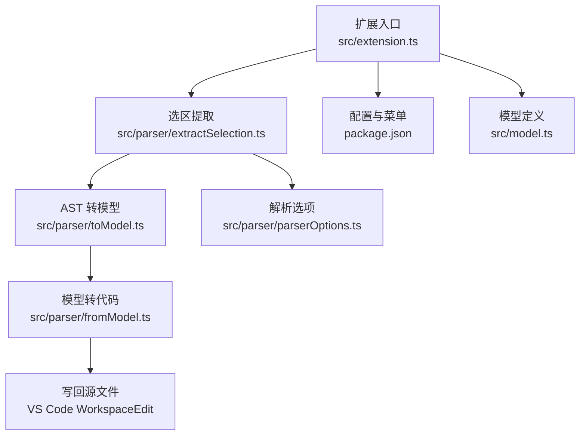
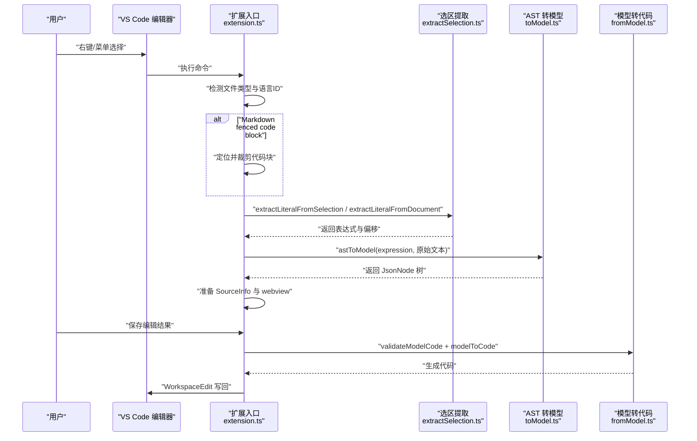
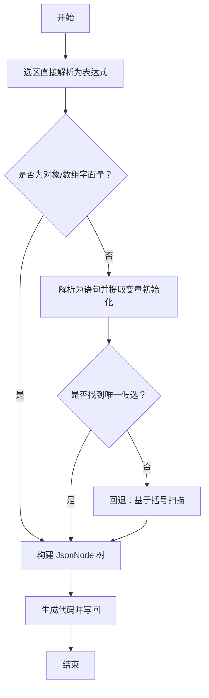
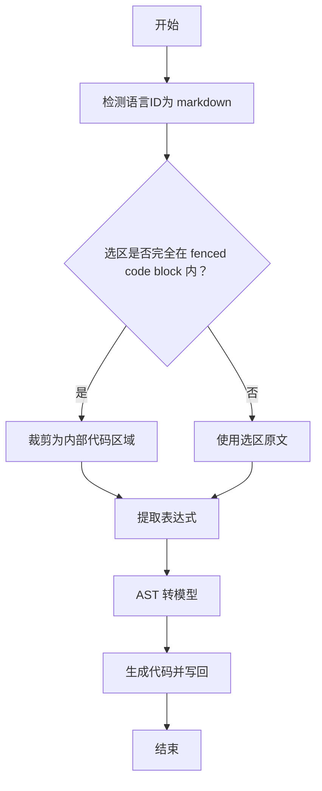
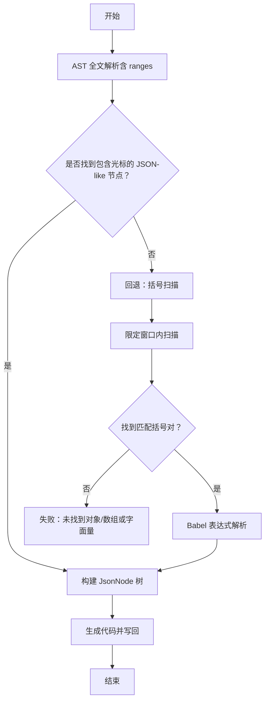
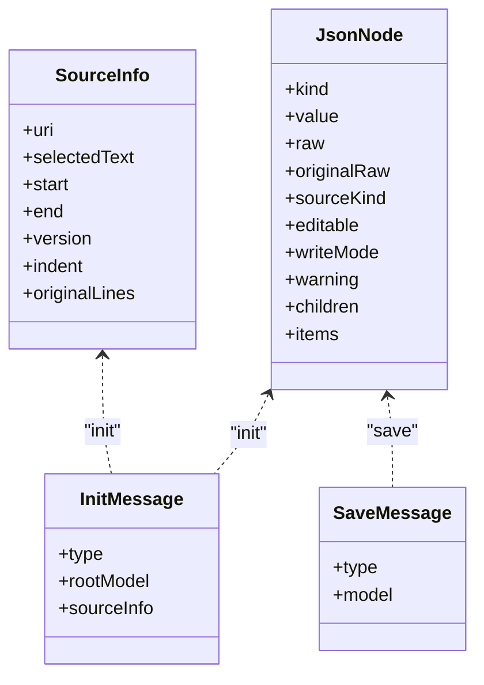

# 文件类型支持

<cite>
**本文引用的文件**
- [src/extension.ts](file://src/extension.ts)
- [src/parser/extractSelection.ts](file://src/parser/extractSelection.ts)
- [src/parser/toModel.ts](file://src/parser/toModel.ts)
- [src/parser/fromModel.ts](file://src/parser/fromModel.ts)
- [src/parser/parserOptions.ts](file://src/parser/parserOptions.ts)
- [src/model.ts](file://src/model.ts)
- [package.json](file://package.json)
- [jsonDemo/testData.js](file://jsonDemo/testData.js)
- [jsonDemo/text.txt](file://jsonDemo/text.txt)
- [jsonDemo/aa.md](file://jsonDemo/aa.md)
- [测试计划.md](file://测试计划.md)
</cite>

## 目录
1. [简介](#简介)
2. [项目结构](#项目结构)
3. [核心组件](#核心组件)
4. [架构总览](#架构总览)
5. [详细组件分析](#详细组件分析)
6. [依赖关系分析](#依赖关系分析)
7. [性能考量](#性能考量)
8. [故障排查指南](#故障排查指南)
9. [结论](#结论)
10. [附录](#附录)

## 简介
本文件系统性阐述 wysJSON 对不同文件类型的处理策略与实现细节，涵盖以下方面：
- JavaScript/TypeScript 文件：基于 AST 的结构识别与代码保留机制
- Markdown 文件：代码块识别与 fenced code block 处理
- 纯文本文件：轻量级括号扫描与容错提取算法
- 文件类型检测、语言模式识别与自动适配
- 特殊处理逻辑、括号匹配策略与性能优化
- 使用示例与最佳实践
- 扩展新文件类型支持的方法与注意事项

## 项目结构
该扩展围绕“选区提取 → AST 转模型 → 模型生成代码”的主流程组织，关键模块如下：
- 扩展入口与命令注册：负责根据当前编辑器上下文判断文件类型并触发相应处理
- 选区提取模块：提供三层容错策略，优先 AST 解析，其次变量初始化提取，最后回退到括号扫描
- AST 到模型转换：将对象/数组/字面量映射为中间模型，并将非 JSON 代码保留为 codeText 节点
- 模型到代码生成：校验 codeText 节点合法性，生成格式化代码并写回源文件
- 模型与消息协议：定义 JsonNode 结构、SourceInfo 元信息及前后端通信消息类型

图表来源
- [src/extension.ts:46-378](file://src/extension.ts#L46-L378)
- [src/parser/extractSelection.ts:34-229](file://src/parser/extractSelection.ts#L34-L229)
- [src/parser/toModel.ts:10-229](file://src/parser/toModel.ts#L10-L229)
- [src/parser/fromModel.ts:20-57](file://src/parser/fromModel.ts#L20-L57)
- [src/parser/parserOptions.ts:20-35](file://src/parser/parserOptions.ts#L20-L35)
- [src/model.ts:15-54](file://src/model.ts#L15-L54)
- [package.json:27-66](file://package.json#L27-L66)

章节来源
- [src/extension.ts:19-44](file://src/extension.ts#L19-L44)
- [package.json:27-66](file://package.json#L27-L66)

## 核心组件
- 文件类型检测与自动适配
  - JS/TS 语言族：通过语言 ID 判断，统一走 AST 提取与模型转换
  - Markdown：针对 fenced code block 进行内外层裁剪，再进行 AST 提取
  - 其他文件（如纯文本）：在非 JS/TS 且非 Markdown 的场景下，采用“光标位置容错提取”策略
- 选区提取与容错策略
  - 直接表达式解析：优先尝试将选区作为 JS 表达式解析
  - 变量初始化提取：若选区包裹变量声明，提取其初始化表达式
  - 多候选与回退：当存在多个对象/数组字面量时提示用户精确选择；否则回退到基于括号的扫描
- AST 到模型转换
  - 对象/数组/字面量：映射为标准 JsonNode
  - 非 JSON 代码：保留为 codeText 节点，携带原始代码与写回模式
- 模型到代码生成与写回
  - 校验 codeText 节点合法性（Babel 解析）
  - 生成格式化代码，应用缩进，定位到 SourceInfo 指定范围并写回

章节来源
- [src/extension.ts:62-308](file://src/extension.ts#L62-L308)
- [src/parser/extractSelection.ts:34-229](file://src/parser/extractSelection.ts#L34-L229)
- [src/parser/toModel.ts:10-229](file://src/parser/toModel.ts#L10-L229)
- [src/parser/fromModel.ts:20-57](file://src/parser/fromModel.ts#L20-L57)

## 架构总览
下图展示从用户操作到最终写回的关键交互流程。

图表来源
- [src/extension.ts:46-378](file://src/extension.ts#L46-L378)
- [src/parser/extractSelection.ts:34-229](file://src/parser/extractSelection.ts#L34-L229)
- [src/parser/toModel.ts:10-229](file://src/parser/toModel.ts#L10-L229)
- [src/parser/fromModel.ts:20-57](file://src/parser/fromModel.ts#L20-L57)

## 详细组件分析

### JavaScript/TypeScript 文件处理策略
- AST 解析与结构识别
  - 选区直接解析为表达式；若失败则解析为语句，提取变量初始化中的对象/数组字面量
  - 若存在多个候选，提示用户精确选择
- AST 到模型转换
  - 对象/数组/字面量映射为标准节点
  - 非 JSON 代码（函数、Date、Symbol、undefined 等）保留为 codeText 节点，写回模式为 code
- 代码生成与写回
  - 校验 codeText 节点合法性（Babel 解析）
  - 生成格式化代码，应用缩进，定位到 SourceInfo 指定范围写回

图表来源
- [src/parser/extractSelection.ts:34-229](file://src/parser/extractSelection.ts#L34-L229)
- [src/parser/toModel.ts:10-229](file://src/parser/toModel.ts#L10-L229)
- [src/parser/fromModel.ts:20-57](file://src/parser/fromModel.ts#L20-L57)

章节来源
- [src/extension.ts:153-251](file://src/extension.ts#L153-L251)
- [src/parser/extractSelection.ts:34-229](file://src/parser/extractSelection.ts#L34-L229)
- [src/parser/toModel.ts:10-229](file://src/parser/toModel.ts#L10-L229)
- [src/parser/fromModel.ts:20-57](file://src/parser/fromModel.ts#L20-L57)

### Markdown 文件处理策略
- fenced code block 识别与裁剪
  - 从选区起点向上查找开始围栏行，向下查找结束围栏行
  - 若选区完全位于围栏内部，则裁剪为内部代码区域，再进行 AST 提取
- 光标位置检测
  - 若光标位于 fenced code block 内部，同样裁剪后提取
  - 否则回退到对整篇 Markdown 文本的光标位置提取
- 代码生成与写回
  - 通过 SourceInfo 计算真实偏移，写回至原文件

图表来源
- [src/extension.ts:66-108](file://src/extension.ts#L66-L108)
- [src/extension.ts:164-240](file://src/extension.ts#L164-L240)

章节来源
- [src/extension.ts:66-108](file://src/extension.ts#L66-L108)
- [src/extension.ts:164-240](file://src/extension.ts#L164-L240)

### 纯文本文件处理策略
- 光标位置容错提取
  - 对于非 JS/TS 且非 Markdown 的文件，采用“光标位置提取”策略
  - 通过 AST 遍历匹配包含光标的 JSON-like 节点，优先变量初始化，其次最外层节点
  - 若 AST 解析失败或未命中，回退到基于括号扫描的轻量算法
- 括号匹配与字符串/注释处理
  - 限定扫描窗口（默认约 40k 字符），避免性能问题
  - 正确处理字符串（单/双/模板）、转义、行注释与块注释
  - 使用栈匹配 {} 与 []，确保跨行与嵌套正确
- 生成与写回
  - 校验 codeText 节点合法性，生成格式化代码并写回

图表来源
- [src/parser/extractSelection.ts:108-229](file://src/parser/extractSelection.ts#L108-L229)
- [src/parser/extractSelection.ts:237-343](file://src/parser/extractSelection.ts#L237-L343)

章节来源
- [src/extension.ts:158-251](file://src/extension.ts#L158-L251)
- [src/parser/extractSelection.ts:108-229](file://src/parser/extractSelection.ts#L108-L229)
- [src/parser/extractSelection.ts:237-343](file://src/parser/extractSelection.ts#L237-L343)

### 代码保留与写回机制
- codeText 节点
  - 非 JSON 代码（函数、Date、Symbol、undefined、对象方法简写等）被保留为 codeText 节点
  - 写回模式为 code，确保表达式原样写回，避免被 JSON 序列化破坏
- 语法校验
  - 生成阶段对 codeText 节点进行 Babel 解析校验，非法表达式阻止写回
- SourceInfo 与版本控制
  - 写回前检查文档版本，防止并发修改导致覆盖
  - 通过 SourceInfo 记录原始行与缩进，确保写回位置与格式一致

章节来源
- [src/parser/toModel.ts:77-89](file://src/parser/toModel.ts#L77-L89)
- [src/parser/fromModel.ts:67-117](file://src/parser/fromModel.ts#L67-L117)
- [src/extension.ts:424-430](file://src/extension.ts#L424-L430)
- [src/extension.ts:133-147](file://src/extension.ts#L133-L147)

### 模型与数据结构
JsonNode 支持多种节点类型，具备可编辑性与写回模式控制，同时保留原始代码以便可逆性。

图表来源
- [src/model.ts:15-103](file://src/model.ts#L15-L103)

章节来源
- [src/model.ts:15-103](file://src/model.ts#L15-L103)

## 依赖关系分析
- 语言与菜单
  - 通过配置项定义支持的语言集合，默认包含 JS/TS 及其 React 变体
  - 菜单在 JS/TS 文件中显示，Markdown 文件通过 fenced code block 识别增强
- 解析插件
  - Babel 解析器启用 JSX、TypeScript、装饰器、可选链、空合并、BigInt、顶层 await 等插件
  - 统一解析选项，保证跨文件类型的兼容性

章节来源
- [package.json:55-66](file://package.json#L55-L66)
- [src/parser/parserOptions.ts:3-18](file://src/parser/parserOptions.ts#L3-L18)
- [src/parser/parserOptions.ts:20-35](file://src/parser/parserOptions.ts#L20-L35)

## 性能考量
- 括号扫描窗口限制
  - 默认扫描窗口约 40k 字符，避免对超大文件全量扫描带来的性能开销
- AST 遍历与回退策略
  - 优先 AST 解析，失败时才进入括号扫描，兼顾准确性与性能
- 缩进与写回范围
  - 通过 SourceInfo 精确替换，减少不必要的文本变更

章节来源
- [src/parser/extractSelection.ts:242-243](file://src/parser/extractSelection.ts#L242-L243)
- [src/extension.ts:424-430](file://src/extension.ts#L424-L430)

## 故障排查指南
- 无法识别选区中的数据结构
  - 可能原因：选区包含多个对象/数组字面量或非字面量表达式
  - 处理建议：精确选择单一对象/数组字面量，或选择包含其初始化的语句
- 保存时报错“编辑后的数据包含无效的代码”
  - 可能原因：codeText 节点中输入了非法 JavaScript 表达式
  - 处理建议：修正表达式语法或恢复原值后再保存
- 写回失败或提示“文档已被修改”
  - 可能原因：在提取后又对文档进行了修改，版本号变化
  - 处理建议：重新打开编辑器以避免覆盖更改
- Markdown fenced code block 外部无法提取
  - 可能原因：非 fenced 区域不包含可识别的字面量
  - 处理建议：在 fenced 区域内进行编辑，或在纯文本文件中使用光标位置提取

章节来源
- [src/parser/extractSelection.ts:74-88](file://src/parser/extractSelection.ts#L74-L88)
- [src/parser/fromModel.ts:67-117](file://src/parser/fromModel.ts#L67-L117)
- [src/extension.ts:424-430](file://src/extension.ts#L424-L430)

## 结论
wysJSON 通过对 JS/TS、Markdown 与纯文本三类文件的差异化处理，实现了稳健的“选区提取 → AST 转模型 → 模型生成代码”的工作流。其核心优势在于：
- 容错性强：三层提取策略与括号扫描回退，提升可用性
- 可逆性好：codeText 节点保留非 JSON 代码，确保写回不破坏表达式
- 安全可靠：静态分析与版本检查，避免运行时风险与并发覆盖

## 附录

### 使用示例与最佳实践
- JavaScript/TypeScript
  - 示例文件：[jsonDemo/testData.js](file://jsonDemo/testData.js)
  - 最佳实践：尽量选择包含完整初始化语句的选区，便于准确提取对象/数组字面量
- Markdown
  - 示例文件：[jsonDemo/aa.md](file://jsonDemo/aa.md)
  - 最佳实践：在 fenced code block 内进行编辑；若需在 Markdown 普通段落中编辑，建议复制到 JS/TS 文件
- 纯文本
  - 示例文件：[jsonDemo/text.txt](file://jsonDemo/text.txt)
  - 最佳实践：在光标附近存在对象/数组字面量时使用“打开 wysJSON”；注意文件过大时的性能影响

章节来源
- [测试计划.md:49-100](file://测试计划.md#L49-L100)
- [jsonDemo/testData.js:1-104](file://jsonDemo/testData.js#L1-L104)
- [jsonDemo/aa.md:1-30](file://jsonDemo/aa.md#L1-L30)
- [jsonDemo/text.txt:1-15](file://jsonDemo/text.txt#L1-L15)

### 扩展新文件类型支持的方法与注意事项
- 新增文件类型支持的步骤
  - 在扩展入口中增加类型检测逻辑，决定是否走 AST 提取或括号扫描
  - 若目标文件语言不具备 AST 全文解析能力，建议采用“光标位置提取 + 括号扫描”的回退策略
  - 为新类型定义合适的 SourceInfo 与写回范围计算方式
- 注意事项
  - 保持与现有模型与消息协议的一致性，避免破坏 codeText 节点的可逆性
  - 对于非 JS/TS 的文件，谨慎设置扫描窗口，避免性能问题
  - 在 UI 层面提供清晰的错误提示与回退路径

章节来源
- [src/extension.ts:153-251](file://src/extension.ts#L153-L251)
- [src/parser/extractSelection.ts:237-343](file://src/parser/extractSelection.ts#L237-L343)
- [src/model.ts:15-54](file://src/model.ts#L15-L54)