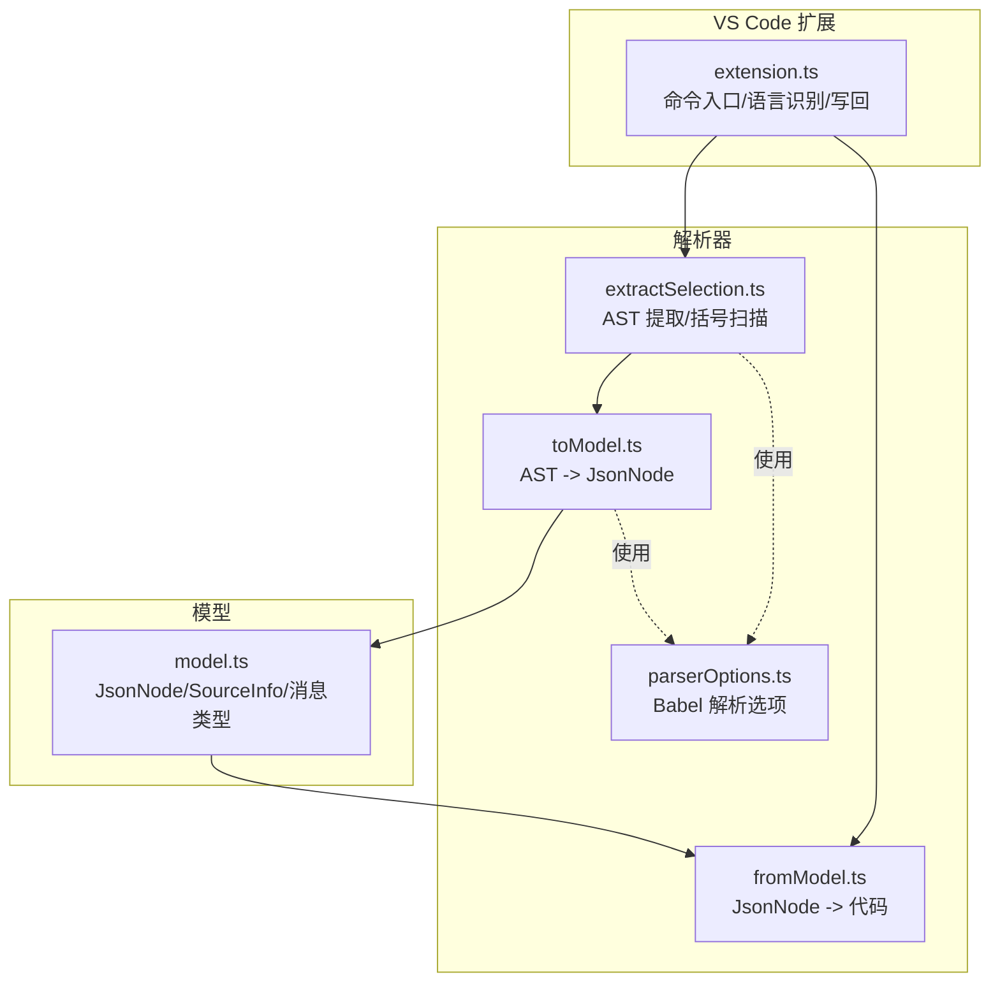
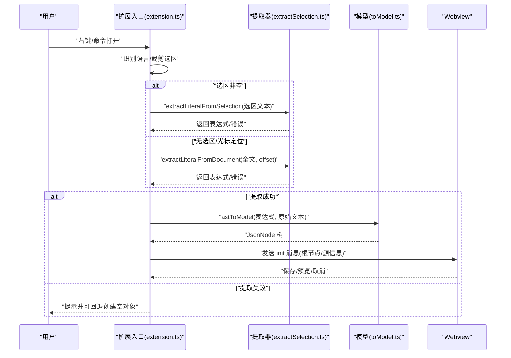
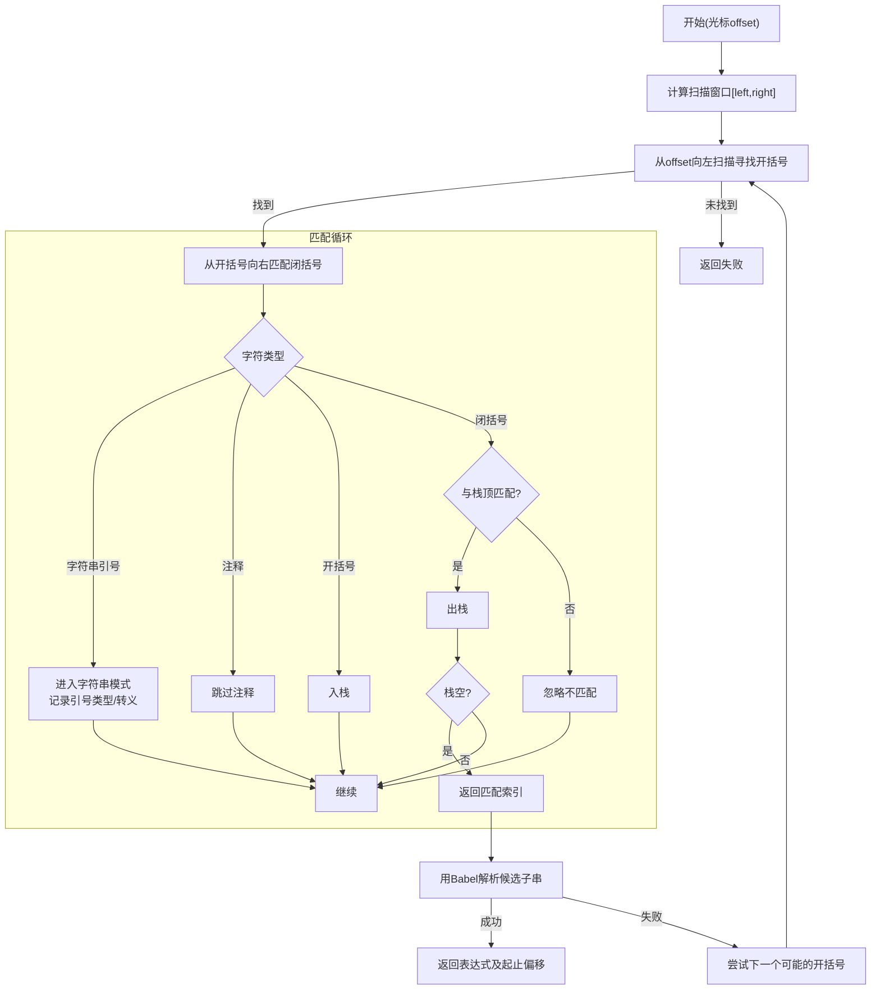
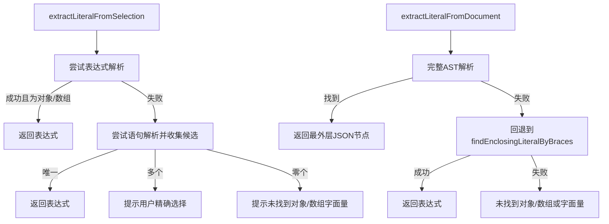
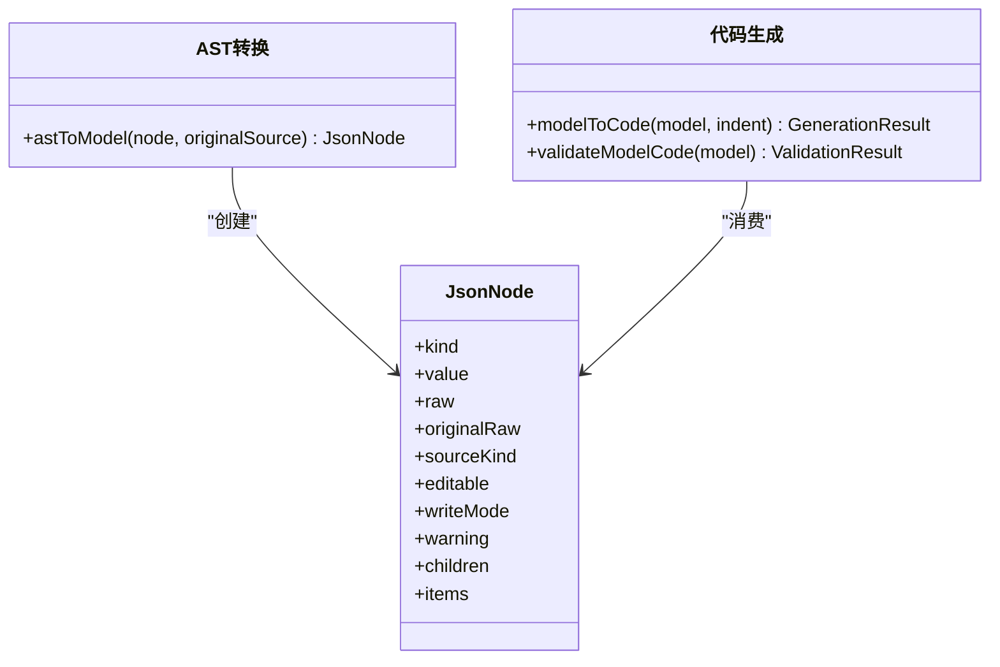
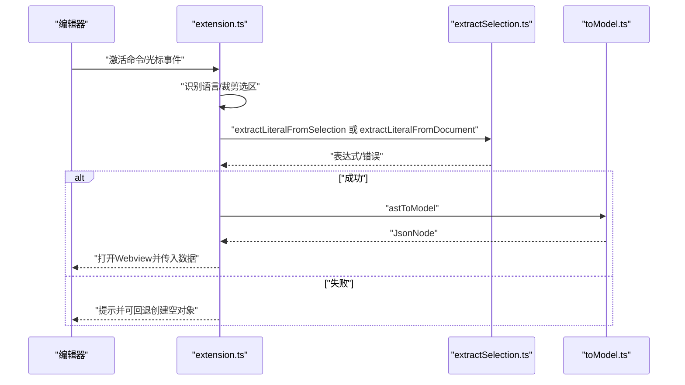
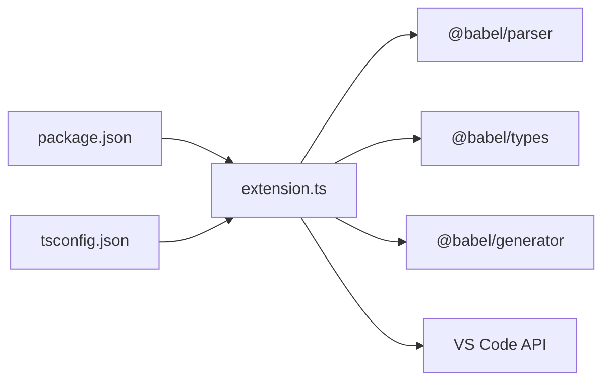

# 纯文本文件支持

<cite>
**本文引用的文件**
- [extractSelection.ts](file://src/parser/extractSelection.ts)
- [fromModel.ts](file://src/parser/fromModel.ts)
- [toModel.ts](file://src/parser/toModel.ts)
- [model.ts](file://src/model.ts)
- [extension.ts](file://src/extension.ts)
- [parserOptions.ts](file://src/parser/parserOptions.ts)
- [text.txt](file://jsonDemo/text.txt)
- [aa.md](file://jsonDemo/aa.md)
- [testData.js](file://jsonDemo/testData.js)
- [package.json](file://package.json)
- [tsconfig.json](file://tsconfig.json)
</cite>

## 目录
1. [简介](#简介)
2. [项目结构](#项目结构)
3. [核心组件](#核心组件)
4. [架构总览](#架构总览)
5. [详细组件分析](#详细组件分析)
6. [依赖关系分析](#依赖关系分析)
7. [性能考量](#性能考量)
8. [故障排除指南](#故障排除指南)
9. [结论](#结论)
10. [附录](#附录)

## 简介
本文件聚焦于 JSONOKOK 在“纯文本文件”场景下的 JSON 数据提取与编辑能力，重点解释以下内容：
- 如何从任意文本（含 Markdown、JS/TS 外的纯文本）中提取 JSON 对象/数组字面量；
- 轻量级括号扫描算法 findEnclosingLiteralByBraces 的工作机制、括号匹配策略与字符串转义处理；
- 性能优化（扫描窗口限制、时间复杂度控制）；
- 注释跳过机制与字符串边界检测；
- 各类 JSON 结构的提取示例（简单对象、嵌套数组、混合数据类型等）；
- 容错处理与边界情况策略；
- 纯文本中 JSON 数据的最佳组织方式与格式建议。

## 项目结构
JSONOKOK 的 VS Code 扩展由“扩展入口 + 解析器 + 模型层 + Webview 编辑器”构成。与纯文本文件支持直接相关的核心模块如下：
- 扩展入口：负责读取编辑器文本、定位选区/光标、调用解析器、打开 Webview 并传递数据。
- 解析器：
  - 提取器：从选区或文档中提取 JSON 对象/数组字面量，支持 AST 与括号扫描两种策略。
  - 模型转换：将 AST 节点映射为中间 JsonNode 模型。
  - 代码生成：将 JsonNode 模型回写为源码。
- 模型定义：统一描述 JSON/JS 值及其可编辑属性。

图表来源
- [extension.ts:19-378](file://src/extension.ts#L19-L378)
- [extractSelection.ts:34-343](file://src/parser/extractSelection.ts#L34-L343)
- [toModel.ts:10-229](file://src/parser/toModel.ts#L10-L229)
- [fromModel.ts:20-305](file://src/parser/fromModel.ts#L20-L305)
- [parserOptions.ts:20-35](file://src/parser/parserOptions.ts#L20-L35)
- [model.ts:15-103](file://src/model.ts#L15-L103)

章节来源
- [extension.ts:19-378](file://src/extension.ts#L19-L378)
- [extractSelection.ts:34-343](file://src/parser/extractSelection.ts#L34-L343)
- [toModel.ts:10-229](file://src/parser/toModel.ts#L10-L229)
- [fromModel.ts:20-305](file://src/parser/fromModel.ts#L20-L305)
- [parserOptions.ts:20-35](file://src/parser/parserOptions.ts#L20-L35)
- [model.ts:15-103](file://src/model.ts#L15-L103)

## 核心组件
- 提取器（extractSelection.ts）
  - extractLiteralFromSelection：从选区尝试提取对象/数组字面量，支持表达式与语句两种解析路径。
  - extractLiteralFromDocument：基于光标位置在整篇文档中查找最深包裹的 JSON 字面量，若 AST 解析失败则回退到括号扫描。
  - findEnclosingLiteralByBraces：轻量级括号扫描算法，限定扫描窗口，跳过注释与字符串，进行括号匹配与回退校验。
- 模型转换（toModel.ts）
  - 将 Babel AST 节点映射为 JsonNode，保留原始源码片段以便回写。
- 代码生成（fromModel.ts）
  - 校验 JsonNode 中的代码文本节点合法性，生成最终源码并应用缩进。
- 模型定义（model.ts）
  - JsonNode 种类、可编辑属性、写回模式、原始源信息等。
- 扩展入口（extension.ts）
  - 识别语言类型（JS/TS、Markdown、纯文本），在 Markdown 代码块内外部正确裁剪选区，调用提取器并处理写回。

章节来源
- [extractSelection.ts:34-343](file://src/parser/extractSelection.ts#L34-L343)
- [toModel.ts:10-229](file://src/parser/toModel.ts#L10-L229)
- [fromModel.ts:20-305](file://src/parser/fromModel.ts#L20-L305)
- [model.ts:15-103](file://src/model.ts#L15-L103)
- [extension.ts:46-308](file://src/extension.ts#L46-L308)

## 架构总览
下图展示了从用户在任意文本中选择或定位光标，到提取 JSON 字面量并进入 JSONOKOK 编辑器的关键流程。

图表来源
- [extension.ts:46-308](file://src/extension.ts#L46-L308)
- [extractSelection.ts:34-229](file://src/parser/extractSelection.ts#L34-L229)
- [toModel.ts:10-90](file://src/parser/toModel.ts#L10-L90)

## 详细组件分析

### 组件一：括号扫描算法 findEnclosingLiteralByBraces
该函数是“纯文本文件支持”的关键回退机制，用于在无法进行完整 AST 解析时，基于光标位置向左右扫描，寻找最内层匹配的花括号/方括号包裹的 JSON 字面量。

- 扫描窗口限制
  - 以光标为中心，设置最大窗口大小，避免对超长文本进行线性扫描导致性能问题。
- 左侧扫描
  - 从光标位置向左查找最近的开括号（{ 或 [），一旦发现即进入右侧匹配。
- 匹配策略
  - 使用栈跟踪未闭合的开括号，遇到闭括号时与栈顶匹配；若栈清空，则找到匹配闭括号。
- 字符串转义与注释跳过
  - 进入字符串时记录引号类型与转义状态；遇到反斜杠置转义标志，遇到同类型引号且未转义则退出字符串。
  - 遇到注释（行注释或块注释）时跳过整段注释内容，不参与括号匹配。
- 回退校验
  - 成功找到候选子串后，使用 Babel 解析其为 JS 表达式，仅当解析成功才视为有效 JSON 字面量。

图表来源
- [extractSelection.ts:237-343](file://src/parser/extractSelection.ts#L237-L343)

章节来源
- [extractSelection.ts:237-343](file://src/parser/extractSelection.ts#L237-L343)

### 组件二：AST 提取与回退策略
- extractLiteralFromSelection
  - 先尝试将选区作为表达式解析；若失败则作为语句解析，收集对象/数组字面量候选；若唯一则返回，否则提示用户精确选择。
- extractLiteralFromDocument
  - 先尝试完整 AST 解析，收集包含光标的 JSON 类型节点与变量初始化节点；若无 AST 匹配则回退到括号扫描。
  - 若仍失败，返回“在光标处未找到对象/数组或字面量”。

图表来源
- [extractSelection.ts:34-229](file://src/parser/extractSelection.ts#L34-L229)

章节来源
- [extractSelection.ts:34-229](file://src/parser/extractSelection.ts#L34-L229)

### 组件三：模型转换与代码生成
- astToModel
  - 将对象/数组/字面量映射为 JsonNode；对于非 JSON 的代码表达式，保留为 codeText 节点并标注 sourceKind。
  - 保留原始源码片段，便于回写时保持格式与注释。
- modelToCode
  - 递归生成代码，支持缩进；对 codeText 节点进行语法校验，确保回写后代码有效。
  - 对对象方法与多行代码进行特殊处理，保持缩进与可读性。

图表来源
- [toModel.ts:10-229](file://src/parser/toModel.ts#L10-L229)
- [fromModel.ts:20-305](file://src/parser/fromModel.ts#L20-L305)
- [model.ts:15-34](file://src/model.ts#L15-L34)

章节来源
- [toModel.ts:10-229](file://src/parser/toModel.ts#L10-L229)
- [fromModel.ts:20-305](file://src/parser/fromModel.ts#L20-L305)
- [model.ts:15-34](file://src/model.ts#L15-L34)

### 组件四：扩展入口与语言识别
- 语言识别
  - JS/TS：直接使用完整 AST 提取。
  - Markdown：在代码块内外部正确裁剪选区，避免将代码块标记纳入提取。
  - 纯文本：将非 JS/TS/Markdown 的文件视作“纯文本”，允许光标定位提取。
- 写回安全
  - 保存前检查文档版本，防止并发修改导致覆盖错误；对编辑后的模型进行语法校验。

图表来源
- [extension.ts:46-308](file://src/extension.ts#L46-L308)
- [extractSelection.ts:34-229](file://src/parser/extractSelection.ts#L34-L229)
- [toModel.ts:10-90](file://src/parser/toModel.ts#L10-L90)

章节来源
- [extension.ts:46-308](file://src/extension.ts#L46-L308)

## 依赖关系分析
- Babel 生态
  - @babel/parser：AST 解析（表达式与完整程序）。
  - @babel/types：AST 类型判断与遍历辅助。
  - @babel/generator：代码生成（回写时生成源码）。
- VS Code 扩展框架
  - 文档读取、选区/光标管理、写回 WorkspaceEdit。
- 语言识别与配置
  - package.json 中声明激活事件与命令菜单贡献。
  - tsconfig.json 指定编译目标与严格模式。

图表来源
- [extension.ts:6-15](file://src/extension.ts#L6-L15)
- [package.json:1-93](file://package.json#L1-L93)
- [tsconfig.json:1-25](file://tsconfig.json#L1-L25)

章节来源
- [extension.ts:6-15](file://src/extension.ts#L6-L15)
- [package.json:1-93](file://package.json#L1-L93)
- [tsconfig.json:1-25](file://tsconfig.json#L1-L25)

## 性能考量
- 扫描窗口限制
  - findEnclosingLiteralByBraces 使用固定窗口大小限制扫描范围，避免对超长文本进行 O(N) 线性扫描，从而将时间复杂度控制在近似常数级窗口内。
- 单次匹配与回退校验
  - 一旦找到候选子串，立即用 Babel 进行表达式解析，若失败则继续尝试下一个可能的开括号，避免对每个候选都进行昂贵的 AST 解析。
- AST 解析优先
  - 在 JS/TS/Markdown 文件中优先使用完整 AST 解析，仅在失败时回退到括号扫描，兼顾准确性与性能。
- 字符串与注释跳过
  - 在括号扫描过程中跳过字符串与注释，减少误判与无效比较次数。

章节来源
- [extractSelection.ts:242-244](file://src/parser/extractSelection.ts#L242-L244)
- [extractSelection.ts:283-302](file://src/parser/extractSelection.ts#L283-L302)
- [extractSelection.ts:328-339](file://src/parser/extractSelection.ts#L328-L339)

## 故障排除指南
- 未找到对象/数组字面量
  - 检查选区是否包含 {...} 或 [...]；若为变量声明需确保选区仅包含初始化表达式。
  - 在纯文本中，确认光标位于有效 JSON 结构内部。
- 语法解析失败
  - 选区包含非 JSON/JS 代码（如函数、Date、Symbol 等），此类节点会被转换为 codeText，编辑时需保持语法有效。
- 写回失败或覆盖冲突
  - 文档版本发生变化时会阻止写回；请重新打开编辑器以避免覆盖更改。
- Markdown 代码块
  - 在 fenced code block 内部提取时，需确保选区位于代码块边界之内；扩展会自动裁剪选区。

章节来源
- [extractSelection.ts:74-88](file://src/parser/extractSelection.ts#L74-L88)
- [fromModel.ts:494-507](file://src/parser/fromModel.ts#L494-L507)
- [extension.ts:423-430](file://src/extension.ts#L423-L430)
- [extension.ts:164-240](file://src/extension.ts#L164-L240)

## 结论
JSONOKOK 在“纯文本文件支持”方面采用“AST 优先 + 括号扫描回退”的双轨策略：
- 在 JS/TS/Markdown 中优先使用 AST 提取，保证准确性；
- 在纯文本中通过限定窗口的括号扫描快速定位 JSON 字面量，并以 Babel 回退校验确保有效性；
- 通过字符串转义与注释跳过机制提升鲁棒性；
- 通过模型层保留原始源码片段，实现安全可靠的写回。

## 附录

### 纯文本中 JSON 结构提取示例
- 简单对象
  - 示例文件：[text.txt](file://jsonDemo/text.txt)
  - 说明：在任意文本中包含对象字面量时，可直接提取。
- 嵌套数组
  - 示例文件：[text.txt](file://jsonDemo/text.txt)
  - 说明：数组内部可包含对象与基本类型，括号扫描可正确匹配。
- Markdown 代码块
  - 示例文件：[aa.md](file://jsonDemo/aa.md)
  - 说明：扩展会识别 fenced code block 并在其中提取 JSON。
- 混合数据类型
  - 示例文件：[testData.js](file://jsonDemo/testData.js)
  - 说明：对象中混入函数、箭头函数、方法等非 JSON 节点会被转换为 codeText，编辑时需保持语法有效。

章节来源
- [text.txt:1-15](file://jsonDemo/text.txt#L1-L15)
- [aa.md:1-30](file://jsonDemo/aa.md#L1-L30)
- [testData.js:37-62](file://jsonDemo/testData.js#L37-L62)

### 最佳组织方式与格式建议
- 在纯文本中嵌入 JSON 时，建议：
  - 使用清晰的缩进与换行，便于 JSONOKOK 展示与编辑。
  - 避免在 JSON 结构中混入大量注释，以免影响括号扫描的准确性。
  - 对于需要保留的函数/方法等非 JSON 片段，建议单独放置在 JSON 外部或使用字符串存储。
- 在 Markdown 中：
  - 使用 fenced code block 包裹 JSON，确保提取准确。
  - 代码块语言标识可帮助识别，但 JSONOKOK 更依赖结构而非语言标识。