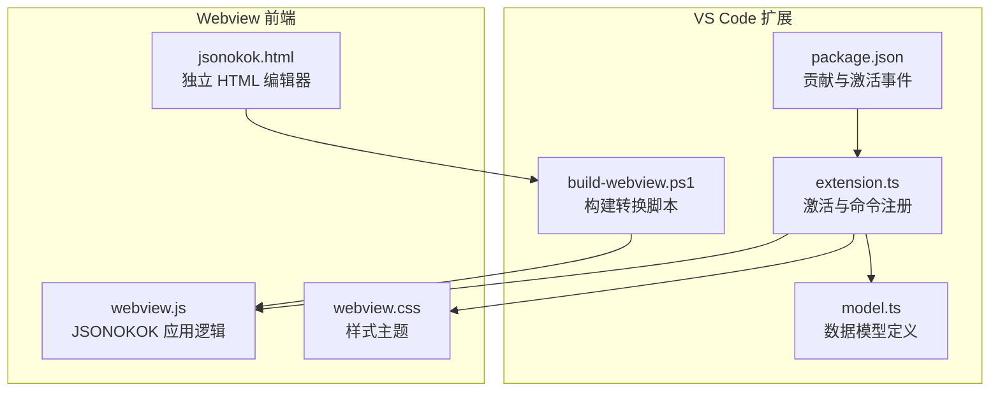
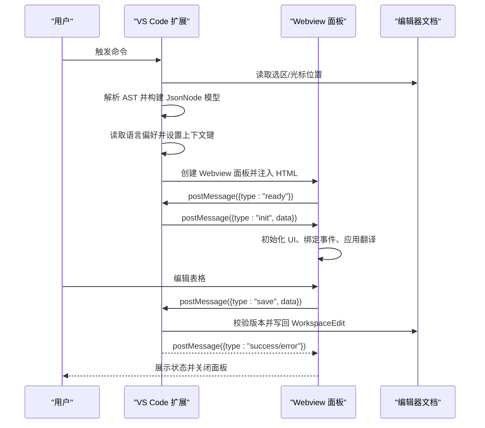
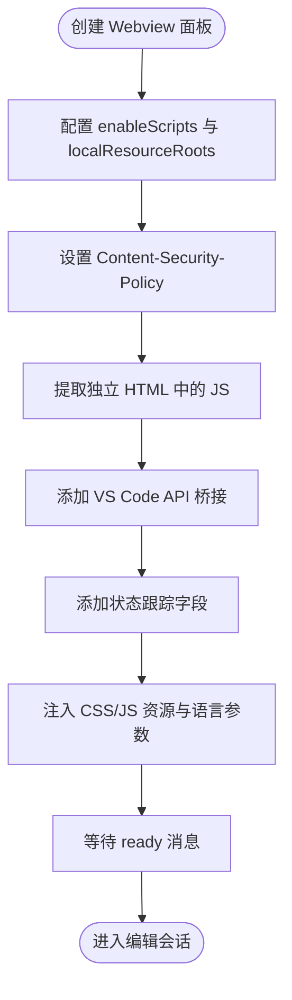
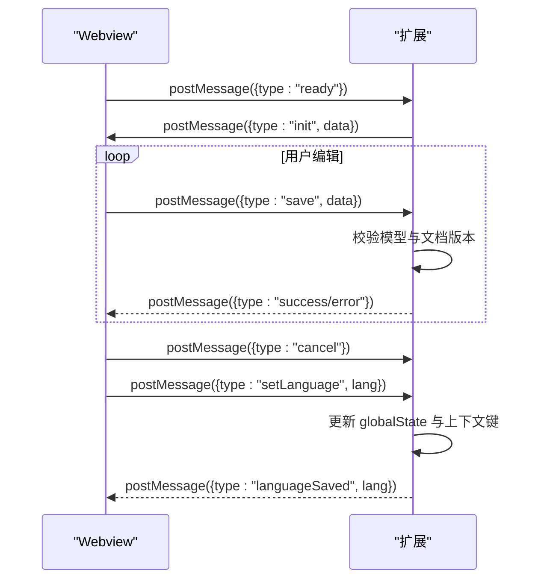
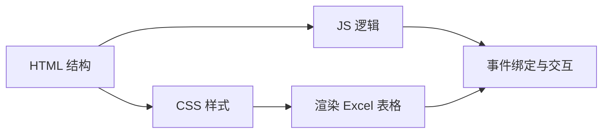
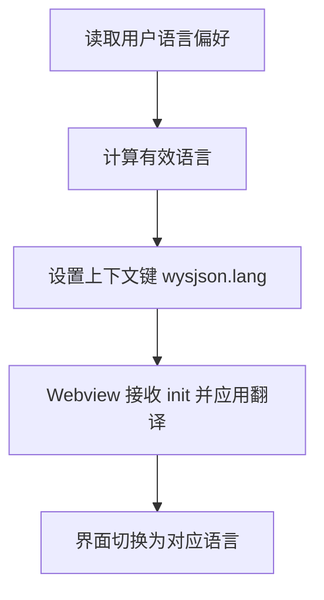
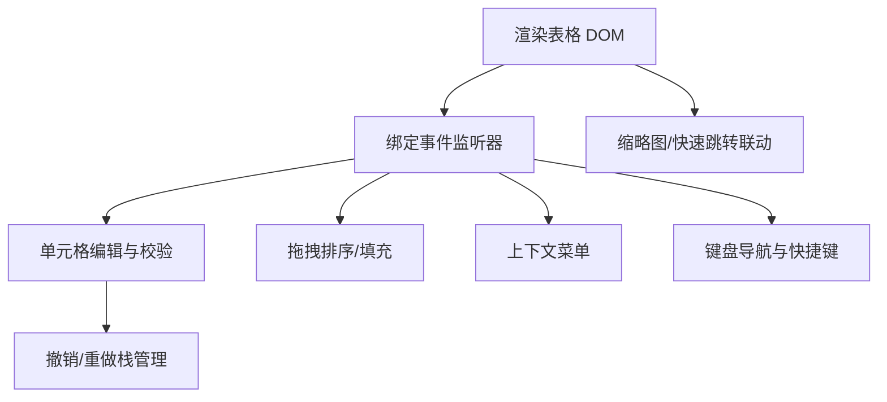
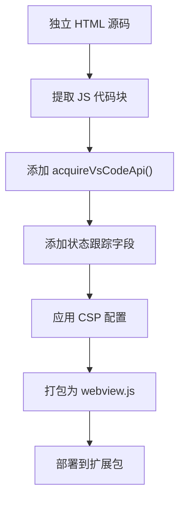
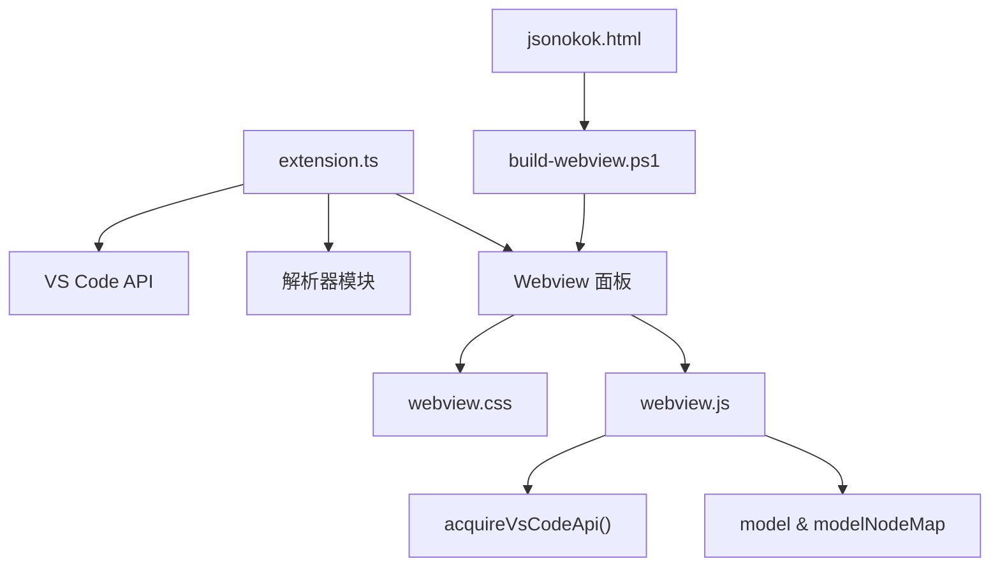

# Webview 集成架构

<cite>
**本文档引用的文件**
- [src/extension.ts](file://src/extension.ts)
- [media/webview.js](file://media/webview.js)
- [media/webview.css](file://media/webview.css)
- [package.json](file://package.json)
- [package.nls.json](file://package.nls.json)
- [package.nls.zh-CN.json](file://package.nls.zh-CN.json)
- [src/model.ts](file://src/model.ts)
- [tools/build-webview.ps1](file://tools/build-webview.ps1)
- [部署方式/vscodeExtension/src/help/jsonokok.html](file://部署方式/vscodeExtension/src/help/jsonokok.html)
- [部署方式/vscodeExtension/media/webview.js](file://部署方式/vscodeExtension/media/webview.js)
</cite>

## 更新摘要
**所做更改**
- 更新了 Webview 面板创建与配置部分，反映 JSONOKOK 新实现的消息通信协议
- 修订了消息通信机制章节，新增了 JSONOKOK 特有的消息类型和状态管理
- 更新了 Excel 风格表格界面实现，反映新的桥接脚本和状态跟踪机制
- 新增了构建流程章节，说明从独立 HTML 到 VS Code 集成的转换过程
- 更新了依赖关系分析，反映新的架构组件

## 目录
1. [简介](#简介)
2. [项目结构](#项目结构)
3. [核心组件](#核心组件)
4. [架构总览](#架构总览)
5. [详细组件分析](#详细组件分析)
6. [构建与部署流程](#构建与部署流程)
7. [依赖关系分析](#依赖关系分析)
8. [性能考虑](#性能考虑)
9. [故障排除指南](#故障排除指南)
10. [结论](#结论)

## 简介
本文件系统性梳理 wysJSON 在 VS Code 扩展中的 Webview 集成架构，涵盖以下主题：
- VS Code Webview 面板的创建与配置（内容安全策略、本地资源根目录、脚本启用）
- 扩展与 Webview 的消息通信机制（JSONOKOK 新实现的消息协议）
- Webview 内容的动态生成（HTML/CSS/JS 集成）
- 国际化支持（语言偏好存储、上下文键设置、界面切换）
- Excel 风格表格界面的实现原理（DOM 操作、事件处理、交互响应）
- 性能优化与安全最佳实践
- 从独立 HTML 到 VS Code 集成的构建转换流程

## 项目结构
该仓库采用"扩展主进程 + Webview 前端"的双层架构，现已升级为基于 JSONOKOK 的全新实现：
- 扩展主进程负责解析选区、构建中间模型、创建 Webview 面板、与编辑器交互
- Webview 前端基于 JSONOKOK 的独立 HTML 编辑器，通过桥接脚本适配 VS Code 环境
- 新增构建流程将独立 HTML 转换为 VS Code 兼容的 webview.js

**图表来源**
- [src/extension.ts:328-378](file://src/extension.ts#L328-L378)
- [media/webview.js:1-120](file://media/webview.js#L1-L120)
- [media/webview.css:1-60](file://media/webview.css#L1-L60)
- [package.json:23-26](file://package.json#L23-L26)
- [tools/build-webview.ps1:1-53](file://tools/build-webview.ps1#L1-L53)
- [部署方式/vscodeExtension/src/help/jsonokok.html:1-50](file://部署方式/vscodeExtension/src/help/jsonokok.html#L1-L50)

**章节来源**
- [src/extension.ts:19-44](file://src/extension.ts#L19-L44)
- [package.json:23-26](file://package.json#L23-L26)
- [tools/build-webview.ps1:1-53](file://tools/build-webview.ps1#L1-L53)

## 核心组件
- 扩展入口与命令
  - 注册命令：打开 wysJSON 编辑器
  - 英文菜单命令：用于在用户偏好为英文时显示非本地化标签
- Webview 面板创建
  - 启用脚本、限制本地资源根目录、设置内容安全策略
  - 通过构建脚本将独立 HTML 转换为 VS Code 兼容格式
- 消息通信（JSONOKOK 新实现）
  - 扩展发送 init 数据；Webview 发送 ready、save、cancel、setLanguage 等消息
  - 新增 model 和 modelNodeMap 状态跟踪字段
- 国际化
  - 用户语言偏好持久化于 globalState，上下文键控制菜单显示
- 数据模型
  - 中间 JsonNode 模型承载对象/数组/原始值等，支持代码文本模式

**章节来源**
- [src/extension.ts:22-39](file://src/extension.ts#L22-L39)
- [src/extension.ts:328-346](file://src/extension.ts#L328-L346)
- [src/extension.ts:348-377](file://src/extension.ts#L348-L377)
- [src/extension.ts:404-418](file://src/extension.ts#L404-L418)
- [src/model.ts:6-34](file://src/model.ts#L6-L34)
- [tools/build-webview.ps1:24-53](file://tools/build-webview.ps1#L24-L53)

## 架构总览
下图展示扩展与 Webview 的端到端交互流程，反映 JSONOKOK 新实现的消息协议。

**图表来源**
- [src/extension.ts:46-308](file://src/extension.ts#L46-L308)
- [src/extension.ts:348-377](file://src/extension.ts#L348-L377)
- [src/extension.ts:397-490](file://src/extension.ts#L397-L490)
- [media/webview.js:250-277](file://media/webview.js#L250-L277)

## 详细组件分析

### Webview 面板创建与配置
- 脚本启用：enableScripts=true
- 本地资源根目录：指向扩展 media 目录，确保 CSS/JS 安全加载
- 内容安全策略：仅允许内联样式（'unsafe-inline'），脚本使用一次性 nonce，限制默认源
- HTML 注入：动态拼接 CSS/JS 资源与语言参数
- **新增** 构建转换：通过 build-webview.ps1 将独立 HTML 转换为 VS Code 兼容格式

**图表来源**
- [src/extension.ts:328-339](file://src/extension.ts#L328-L339)
- [src/extension.ts:519-599](file://src/extension.ts#L519-L599)
- [tools/build-webview.ps1:13-53](file://tools/build-webview.ps1#L13-L53)

**章节来源**
- [src/extension.ts:328-346](file://src/extension.ts#L328-L346)
- [src/extension.ts:519-599](file://src/extension.ts#L519-L599)
- [tools/build-webview.ps1:13-53](file://tools/build-webview.ps1#L13-L53)

### 消息通信机制（JSONOKOK 新实现）
- 扩展 -> Webview
  - init：传递 rootModel、sourceInfo、语言偏好、只读警告
  - success/error：写回结果反馈
- Webview -> 扩展
  - ready：初始化完成，请求数据
  - save：提交编辑后的模型，触发校验与写回
  - cancel：取消编辑，关闭面板
  - setLanguage：更新语言偏好并持久化
- **新增** 状态管理
  - model：当前编辑的 JSON 模型
  - modelNodeMap：节点映射表，用于快速定位

**图表来源**
- [src/extension.ts:348-377](file://src/extension.ts#L348-L377)
- [src/extension.ts:397-490](file://src/extension.ts#L397-L490)
- [media/webview.js:250-277](file://media/webview.js#L250-L277)
- [tools/build-webview.ps1:34-43](file://tools/build-webview.ps1#L34-L43)

**章节来源**
- [src/extension.ts:348-377](file://src/extension.ts#L348-L377)
- [src/extension.ts:397-490](file://src/extension.ts#L397-L490)
- [src/model.ts:59-103](file://src/model.ts#L59-L103)
- [tools/build-webview.ps1:34-43](file://tools/build-webview.ps1#L34-L43)

### Webview 内容动态生成
- HTML 结构：工具栏、面包屑、主内容区、状态栏、上下文菜单
- CSS 主题：Excel 风格配色与网格样式，支持缩略图与快速跳转小地图
- JavaScript 集成：Acquire VS Code API，接收 init 数据，渲染表格，绑定事件，处理键盘与鼠标交互
- **新增** 独立 HTML 来源：基于 jsonokok.html 的独立编辑器实现

**图表来源**
- [src/extension.ts:519-599](file://src/extension.ts#L519-L599)
- [media/webview.css:1-120](file://media/webview.css#L1-L120)
- [media/webview.js:250-277](file://media/webview.js#L250-L277)
- [部署方式/vscodeExtension/src/help/jsonokok.html:1-50](file://部署方式/vscodeExtension/src/help/jsonokok.html#L1-L50)

**章节来源**
- [src/extension.ts:519-599](file://src/extension.ts#L519-L599)
- [media/webview.css:1-120](file://media/webview.css#L1-L120)
- [media/webview.js:250-277](file://media/webview.js#L250-L277)
- [部署方式/vscodeExtension/src/help/jsonokok.html:1-50](file://部署方式/vscodeExtension/src/help/jsonokok.html#L1-L50)

### 国际化支持
- 语言偏好存储：globalState 键 wysjson.language，默认 auto
- 上下文键：wysjson.lang，用于控制菜单显示英文或本地化标签
- Webview 翻译：内置中英双语映射，按用户选择动态应用
- 包贡献：通过 package.nls.json 与 package.nls.zh-CN.json 提供标题翻译

**图表来源**
- [src/extension.ts:312-326](file://src/extension.ts#L312-L326)
- [src/extension.ts:404-418](file://src/extension.ts#L404-L418)
- [media/webview.js:54-187](file://media/webview.js#L54-L187)
- [package.json:28-51](file://package.json#L28-L51)
- [package.nls.json:1-4](file://package.nls.json#L1-L4)
- [package.nls.zh-CN.json:1-4](file://package.nls.zh-CN.json#L1-L4)

**章节来源**
- [src/extension.ts:312-326](file://src/extension.ts#L312-L326)
- [src/extension.ts:404-418](file://src/extension.ts#L404-L418)
- [media/webview.js:54-187](file://media/webview.js#L54-L187)
- [package.json:28-51](file://package.json#L28-L51)
- [package.nls.json:1-4](file://package.nls.json#L1-L4)
- [package.nls.zh-CN.json:1-4](file://package.nls.zh-CN.json#L1-L4)

### Excel 风格表格界面实现
- DOM 结构
  - 表头行：列名、类型徽标、拖拽手柄、列宽调整器、嵌套展开开关
  - 数据行：行号列、可编辑单元格、嵌套预览/展开区域
  - 辅助控件：缩略图、快速跳转小地图、面包屑导航
- 事件处理
  - 鼠标：点击/双击、拖拽排序、拖拽填充、右键上下文菜单
  - 键盘：方向键导航、Shift 扩展选择、Tab 切换、Ctrl+Z/Y 撤销/重做
  - 粘贴：制表符分隔矩阵粘贴
- 交互响应
  - 单元格编辑：原生 contenteditable 或代码编辑器
  - 类型转换：将节点转换为 array/object/single/string/number/boolean/null/codeText
  - 焦点路径：面包屑与缩略图联动，支持快速定位
- **新增** 状态跟踪
  - model 字段：当前编辑的 JSON 模型
  - modelNodeMap 字段：节点映射表，用于快速定位

**图表来源**
- [media/webview.js:2000-2190](file://media/webview.js#L2000-L2190)
- [media/webview.js:4110-4244](file://media/webview.js#L4110-L4244)
- [media/webview.js:4380-4451](file://media/webview.js#L4380-L4451)
- [media/webview.js:4894-4928](file://media/webview.js#L4894-L4928)

**章节来源**
- [media/webview.js:2000-2190](file://media/webview.js#L2000-L2190)
- [media/webview.js:4110-4244](file://media/webview.js#L4110-L4244)
- [media/webview.js:4380-4451](file://media/webview.js#L4380-L4451)
- [media/webview.js:4894-4928](file://media/webview.js#L4894-L4928)

## 构建与部署流程
**新增** 从独立 HTML 到 VS Code 集成的完整构建流程：

**图表来源**
- [tools/build-webview.ps1:13-53](file://tools/build-webview.ps1#L13-L53)

**章节来源**
- [tools/build-webview.ps1:1-53](file://tools/build-webview.ps1#L1-L53)

## 依赖关系分析
- 扩展主进程依赖
  - VS Code API：命令注册、Webview 创建、编辑器文档访问、工作区编辑应用
  - 解析器：AST 抽取与模型转换
- Webview 前端依赖
  - VS Code Webview API：acquireVsCodeApi 与 postMessage
  - 独立 HTML 编辑器：基于 JSONOKOK 的独立实现
  - 构建工具：PowerShell 脚本用于转换和优化
- **新增** 状态管理依赖
  - model 和 modelNodeMap 字段用于状态跟踪
  - 与数据模型紧密集成

**图表来源**
- [src/extension.ts:6-15](file://src/extension.ts#L6-L15)
- [media/webview.js:5](file://media/webview.js#L5)
- [media/webview.css:1-60](file://media/webview.css#L1-L60)
- [tools/build-webview.ps1:1-53](file://tools/build-webview.ps1#L1-L53)

**章节来源**
- [src/extension.ts:6-15](file://src/extension.ts#L6-L15)
- [media/webview.js:5](file://media/webview.js#L5)
- [tools/build-webview.ps1:1-53](file://tools/build-webview.ps1#L1-L53)

## 性能考虑
- 渲染优化
  - 使用 requestAnimationFrame 控制缩略图视口拖拽刷新，减少抖动
  - 惰性展开嵌套内容，仅在列头展开时渲染子表
  - 选择范围与拖拽视觉反馈最小化 DOM 操作
- 事件处理
  - 使用捕获阶段与冒泡阶段分离，避免重复处理
  - 对高频滚动与拖拽场景，采用节流/防抖策略（如缩略图视口更新）
- 数据结构
  - 使用 modelNodeMap 快速定位节点，降低路径查找成本
  - 撤销栈仅保存必要快照，限制最大深度
- 资源加载
  - 本地资源根目录限定，配合 CSP 与 nonce，提升安全性同时避免跨域问题
- **新增** 构建优化
  - 通过构建脚本提取和优化 JS 代码，减少运行时开销
  - 状态字段预初始化，避免运行时动态属性创建

## 故障排除指南
- 写回失败
  - 现象：postMessage("error")，提示写回失败
  - 可能原因：文档版本变化导致覆盖保护生效；模型包含语法错误；WorkspaceEdit 应用失败
  - 处理建议：重新打开编辑器；检查模型合法性；确认编辑器未被外部修改
- 语言切换无效
  - 现象：语言未更新或菜单未切换
  - 可能原因：上下文键设置失败；Webview 未收到 init 语言参数
  - 处理建议：检查 globalState 写入；确认 setContext 命令执行；重启面板
- 表格无响应
  - 现象：点击/键盘无反应
  - 可能原因：未收到 ready/init；事件绑定异常；编辑器焦点丢失
  - 处理建议：确认 Webview 已发送 ready；检查控制台日志；重新聚焦编辑器
- **新增** 构建相关问题
  - 现象：webview.js 加载失败或功能异常
  - 可能原因：构建脚本执行失败；JS 代码提取不完整；VS Code API 注入错误
  - 处理建议：检查 build-webview.ps1 执行日志；验证独立 HTML 文件完整性；确认 acquireVsCodeApi 调用正确

**章节来源**
- [src/extension.ts:420-486](file://src/extension.ts#L420-L486)
- [src/extension.ts:404-418](file://src/extension.ts#L404-L418)
- [media/webview.js:4894-4928](file://media/webview.js#L4894-L4928)
- [tools/build-webview.ps1:1-53](file://tools/build-webview.ps1#L1-L53)

## 结论
wysJSON 的 Webview 集成架构已成功升级为基于 JSONOKOK 的全新实现，以清晰的职责划分实现了 VS Code 与前端交互的无缝衔接：
- 面板创建与安全策略配置确保资源可控
- JSONOKOK 新消息协议简洁可靠，扩展与 Webview 各司其职
- Excel 风格表格提供直观的数据编辑体验
- 国际化与上下文键设计兼顾多语言与菜单控制
- **新增** 完整的构建流程确保从独立 HTML 到 VS Code 集成的平滑转换
- **新增** 状态管理机制提升应用的稳定性和用户体验
- 性能与安全最佳实践贯穿渲染、事件与数据流