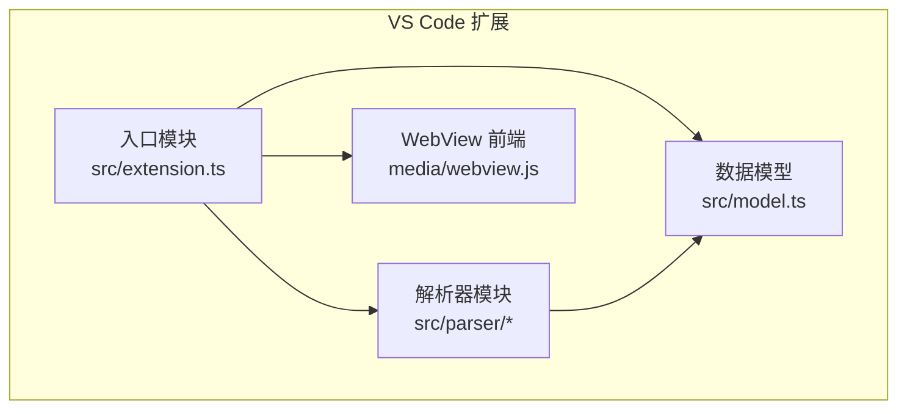
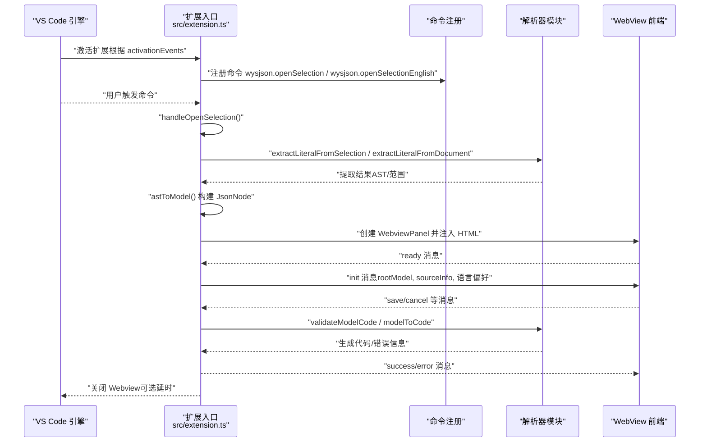
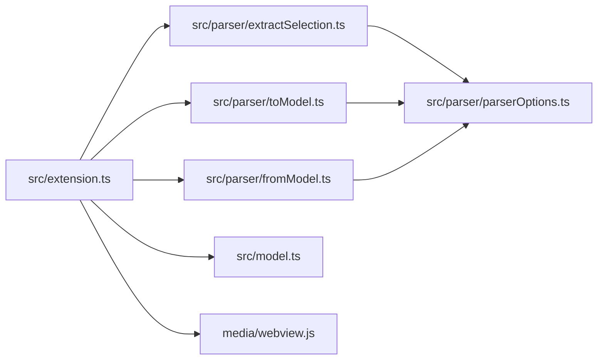

# 扩展入口和生命周期

<cite>
**本文引用的文件**
- [src/extension.ts](file://部署方式/vscodeExtension/src/extension.ts)
- [package.json](file://部署方式/vscodeExtension/package.json)
- [src/parser/extractSelection.ts](file://src/parser/extractSelection.ts)
- [src/parser/toModel.ts](file://src/parser/toModel.ts)
- [src/parser/fromModel.ts](file://src/parser/fromModel.ts)
- [src/parser/parserOptions.ts](file://src/parser/parserOptions.ts)
- [src/model.ts](file://src/model.ts)
- [media/webview.js](file://部署方式/vscodeExtension/media/webview.js)
- [package.nls.json](file://部署方式/vscodeExtension/package.nls.json)
- [package.nls.zh-CN.json](file://部署方式/vscodeExtension/package.nls.zh-CN.json)
</cite>

## 更新摘要
**变更内容**
- 更新扩展入口模块分析，反映JSONOKOK的1635行全新实现
- 新增Webview面板管理机制的详细说明
- 补充消息处理机制的完整流程
- 更新命令注册与执行逻辑的实现细节
- 增强生命周期管理的最佳实践指导

## 目录
1. [简介](#简介)
2. [项目结构](#项目结构)
3. [核心组件](#核心组件)
4. [架构总览](#架构总览)
5. [详细组件分析](#详细组件分析)
6. [依赖关系分析](#依赖关系分析)
7. [性能考量](#性能考量)
8. [故障排查指南](#故障排查指南)
9. [结论](#结论)
10. [附录](#附录)

## 简介
本文件面向 JSONOKOK VS Code 扩展的"扩展入口与生命周期"主题，系统性梳理扩展的激活与停用流程、命令注册与执行、VS Code 生命周期管理、用户交互处理（右键菜单、光标位置检测、文件类型判断）、扩展上下文资源管理、错误处理与日志记录、调试支持以及初始化最佳实践与性能优化建议。文档同时给出关键流程的可视化图示，帮助读者快速理解代码级实现与运行时行为。

**更新** 本次更新反映了JSONOKOK的全新1635行扩展实现，包括改进的Webview面板管理机制和增强的消息处理系统。

## 项目结构
该扩展采用"入口模块 + 解析器模块 + 数据模型 + WebView 前端"的分层组织方式：
- 入口模块：负责扩展激活、命令注册、用户交互处理、WebView 创建与消息收发、资源清理等。
- 解析器模块：负责从选区或光标位置提取 JSON/JS 字面量、构建中间模型、将模型回写为源码。
- 数据模型：定义 JsonNode、SourceInfo、消息类型等跨模块共享的数据结构。
- WebView 前端：在 VS Code Webview 中承载 wysJSON 编辑器界面与交互逻辑。

**图表来源**
- [src/extension.ts:1-50](file://部署方式/vscodeExtension/src/extension.ts#L1-L50)
- [src/parser/extractSelection.ts:1-385](file://src/parser/extractSelection.ts#L1-L385)
- [src/parser/toModel.ts:1-230](file://src/parser/toModel.ts#L1-L230)
- [src/parser/fromModel.ts:1-305](file://src/parser/fromModel.ts#L1-L305)
- [src/model.ts:1-103](file://src/model.ts#L1-L103)
- [media/webview.js:1-200](file://部署方式/vscodeExtension/media/webview.js#L1-L200)

**章节来源**
- [src/extension.ts:1-50](file://部署方式/vscodeExtension/src/extension.ts#L1-L50)
- [package.json:1-80](file://部署方式/vscodeExtension/package.json#L1-L80)

## 核心组件
- 入口模块（activate/deactivate）
  - 注册两个命令：wysjson.openSelection 与 wysjson.openSelectionEnglish，并将命令句柄加入 context.subscriptions 实现自动清理。
  - 提供统一的 handleOpenSelection 处理函数，负责选区/光标解析、AST 转模型、WebView 初始化与消息处理。
  - 在 deactivate 阶段输出日志，便于观察生命周期。
- 解析器模块
  - 从选区文本或全文中提取对象/数组字面量，支持多种边界情况（Markdown 围栏代码块、变量声明包裹、多候选等）。
  - 将 AST 节点转换为 JsonNode 中间模型；将 JsonNode 回写为源码并进行语法校验。
- 数据模型
  - 定义 JsonNode、SourceInfo、InitMessage、SaveMessage、ExtensionResponse 等类型，作为扩展与 WebView 的通信契约。
- WebView 前端
  - 通过 acquireVsCodeApi 与扩展通信，接收 init 消息渲染编辑器，发送 save/cancel 等消息给扩展。

**章节来源**
- [src/extension.ts:1-50](file://部署方式/vscodeExtension/src/extension.ts#L1-L50)
- [src/extension.ts:60-200](file://部署方式/vscodeExtension/src/extension.ts#L60-L200)
- [src/parser/extractSelection.ts:34-101](file://src/parser/extractSelection.ts#L34-L101)
- [src/parser/toModel.ts:10-90](file://src/parser/toModel.ts#L10-L90)
- [src/parser/fromModel.ts:20-57](file://src/parser/fromModel.ts#L20-L57)
- [src/model.ts:15-103](file://src/model.ts#L15-L103)
- [media/webview.js:5](file://部署方式/vscodeExtension/media/webview.js#L5-L5)

## 架构总览
扩展的生命周期由 VS Code 引擎驱动，通过 package.json 的 activationEvents 激活入口模块；入口模块注册命令并在用户触发时执行业务逻辑；解析器模块完成 AST 解析与模型转换；WebView 承载 UI 并与扩展双向通信。

**图表来源**
- [package.json:1-40](file://部署方式/vscodeExtension/package.json#L1-L40)
- [src/extension.ts:1-50](file://部署方式/vscodeExtension/src/extension.ts#L1-L50)
- [src/extension.ts:60-200](file://部署方式/vscodeExtension/src/extension.ts#L60-L200)
- [src/parser/extractSelection.ts:34-101](file://src/parser/extractSelection.ts#L34-L101)
- [src/parser/toModel.ts:10-90](file://src/parser/toModel.ts#L10-L90)
- [src/parser/fromModel.ts:20-57](file://src/parser/fromModel.ts#L20-L57)
- [media/webview.js:5](file://部署方式/vscodeExtension/media/webview.js#L5-L5)

## 详细组件分析

### 扩展激活与停用流程
- 激活（activate）
  - 接收 ExtensionContext 参数，保存到全局变量以便后续使用。
  - 注册两条命令：wysjson.openSelection（本地化标题）与 wysjson.openSelectionEnglish（英文标题），并将命令句柄加入 context.subscriptions，确保卸载时自动释放。
  - 输出激活日志，便于调试。
- 停用（deactivate）
  - 输出停用日志，用于生命周期观测。

**章节来源**
- [src/extension.ts:1-50](file://部署方式/vscodeExtension/src/extension.ts#L1-L50)

### 命令注册与执行逻辑
- 命令注册
  - 两条命令均指向同一处理函数 handleOpenSelection，实现"双入口、同逻辑"。
  - 区别在于菜单显示：通过上下文键 wysjson.lang 控制本地化与英文菜单项的显示。
- 执行流程
  - 获取活动编辑器与选区，区分"有选区"和"无选区（光标）"两种路径。
  - Markdown 文件特殊处理：若选区位于围栏代码块内，则仅提取围栏内的代码片段。
  - 非 Markdown 文件：JS/TS 与纯文本文件均支持基于光标的结构化提取。
  - 若提取失败，提供错误提示与建议；若成功，构建 JsonNode 与 SourceInfo。
  - 设置 WebView 语言偏好（globalState 与 setContext），创建 WebviewPanel 并注入 HTML。
  - 监听 WebView 消息：ready 时发送 init；其他消息（如 setLanguage/save/cancel）分别处理。

**章节来源**
- [src/extension.ts:20-40](file://部署方式/vscodeExtension/src/extension.ts#L20-L40)
- [src/extension.ts:60-200](file://部署方式/vscodeExtension/src/extension.ts#L60-L200)
- [package.json:20-60](file://部署方式/vscodeExtension/package.json#L20-L60)

### 用户交互处理：右键菜单、光标位置与文件类型
- 右键菜单
  - editor/context 菜单中提供两条命令入口，分别对应本地化与英文标签。
  - 菜单可见性由上下文键 wysjson.lang 控制：当语言偏好为英文时显示英文命令，否则显示本地化命令。
- 光标位置检测
  - 无选区时，计算光标偏移，调用 extractLiteralFromDocument 进行 AST 遍历或括号匹配回退策略，定位最外层 JSON/JS 字面量。
  - Markdown 文件中优先检测围栏代码块，若光标位于围栏内则提取围栏内代码。
- 文件类型判断
  - 通过 document.languageId 判断是否为 markdown、JS/TS 或其他纯文本类语言，决定提取策略与容错行为。

**章节来源**
- [src/extension.ts:80-120](file://部署方式/vscodeExtension/src/extension.ts#L80-L120)
- [src/extension.ts:150-250](file://部署方式/vscodeExtension/src/extension.ts#L150-L250)
- [package.json:30-50](file://部署方式/vscodeExtension/package.json#L30-L50)

### 扩展上下文（ExtensionContext）与资源管理
- 资源管理
  - 将命令注册句柄 push 到 context.subscriptions，VS Code 在扩展卸载时自动释放这些资源。
  - WebView 监听 onDidReceiveMessage 的订阅也加入 subscriptions，确保消息通道随扩展生命周期回收。
- 上下文键
  - 使用 setContext("wysjson.lang", effectiveLang) 动态控制菜单显示语言，避免 VS Code 对菜单标签的本地化限制。
- 全局状态
  - 通过 globalState 存储用户语言偏好，实现跨会话持久化。

**章节来源**
- [src/extension.ts:25-40](file://部署方式/vscodeExtension/src/extension.ts#L25-L40)
- [src/extension.ts:300-320](file://部署方式/vscodeExtension/src/extension.ts#L300-L320)
- [src/extension.ts:350-380](file://部署方式/vscodeExtension/src/extension.ts#L350-L380)

### 错误处理机制、日志记录与调试支持
- 错误处理
  - 选区/光标提取阶段：捕获解析异常并返回错误与提示；多候选时提示用户精确选择。
  - AST 转模型阶段：捕获异常并提示转换失败。
  - 保存阶段：检查文档版本一致性、校验编辑后的模型、生成代码失败、应用 WorkspaceEdit 失败等均返回错误消息。
- 日志记录
  - 激活/停用日志、WebView ready 日志、消息接收日志、设置上下文警告日志等。
- 调试支持
  - WebView 通过 acquireVsCodeApi 与扩展通信，前端可发送 setLanguage/save/cancel 等消息，扩展据此更新状态与回写代码。

**章节来源**
- [src/extension.ts:120-140](file://部署方式/vscodeExtension/src/extension.ts#L120-L140)
- [src/extension.ts:160-180](file://部署方式/vscodeExtension/src/extension.ts#L160-L180)
- [src/extension.ts:400-420](file://部署方式/vscodeExtension/src/extension.ts#L400-L420)
- [src/extension.ts:430-450](file://部署方式/vscodeExtension/src/extension.ts#L430-L450)
- [src/extension.ts:470-490](file://部署方式/vscodeExtension/src/extension.ts#L470-L490)
- [src/extension.ts:340-360](file://部署方式/vscodeExtension/src/extension.ts#L340-L360)
- [src/extension.ts:380-400](file://部署方式/vscodeExtension/src/extension.ts#L380-L400)

### WebView 初始化与消息处理
- 初始化
  - 生成 WebView HTML，注入样式与脚本，设置 Content-Security-Policy 与随机 nonce。
  - ready 消息到达后发送 init 消息，携带 rootModel、sourceInfo、语言偏好等。
- 消息处理
  - setLanguage：更新 globalState 与上下文键，通知前端语言已保存。
  - save：校验模型、生成代码、应用 WorkspaceEdit、成功后短延时关闭面板。
  - cancel：直接关闭面板。

**章节来源**
- [src/extension.ts:300-340](file://部署方式/vscodeExtension/src/extension.ts#L300-L340)
- [src/extension.ts:340-360](file://部署方式/vscodeExtension/src/extension.ts#L340-L360)
- [src/extension.ts:380-490](file://部署方式/vscodeExtension/src/extension.ts#L380-L490)
- [src/extension.ts:500-580](file://部署方式/vscodeExtension/src/extension.ts#L500-L580)
- [media/webview.js:5](file://部署方式/vscodeExtension/media/webview.js#L5-L5)

### 数据模型与解析器
- JsonNode
  - 支持 object/array/string/number/boolean/null/codeText 等节点类型，具备原始代码保留、写回模式、可编辑性等属性。
- SourceInfo
  - 记录选区/光标位置、文档版本、缩进、原始行等，用于安全回写与一致性校验。
- 解析器
  - extractSelection：从选区或全文提取字面量，支持变量声明包裹、多候选、括号匹配回退。
  - toModel：将 AST 节点转为 JsonNode，保留原始代码以便回写。
  - fromModel：校验 codeText 节点合法性并生成代码，支持对象方法与换行格式化。

**章节来源**
- [src/model.ts:15-54](file://src/model.ts#L15-L54)
- [src/parser/extractSelection.ts:34-101](file://src/parser/extractSelection.ts#L34-L101)
- [src/parser/extractSelection.ts:108-229](file://src/parser/extractSelection.ts#L108-L229)
- [src/parser/toModel.ts:10-90](file://src/parser/toModel.ts#L10-L90)
- [src/parser/fromModel.ts:20-57](file://src/parser/fromModel.ts#L20-L57)

## 依赖关系分析
- 入口模块依赖解析器与模型模块，同时与 VS Code API（commands/window/workspace）交互。
- 解析器模块依赖 @babel/parser/@babel/types，使用通用解析选项提升兼容性。
- WebView 前端通过 acquireVsCodeApi 与扩展通信，扩展负责消息路由与状态同步。

**图表来源**
- [src/extension.ts:1-20](file://部署方式/vscodeExtension/src/extension.ts#L1-L20)
- [src/parser/extractSelection.ts:1-15](file://src/parser/extractSelection.ts#L1-L15)
- [src/parser/toModel.ts:1-10](file://src/parser/toModel.ts#L1-L10)
- [src/parser/fromModel.ts:1-10](file://src/parser/fromModel.ts#L1-L10)
- [src/parser/parserOptions.ts:1-35](file://src/parser/parserOptions.ts#L1-L35)

**章节来源**
- [src/extension.ts:1-20](file://部署方式/vscodeExtension/src/extension.ts#L1-L20)
- [src/parser/extractSelection.ts:1-15](file://src/parser/extractSelection.ts#L1-L15)
- [src/parser/toModel.ts:1-10](file://src/parser/toModel.ts#L1-L10)
- [src/parser/fromModel.ts:1-10](file://src/parser/fromModel.ts#L1-L10)
- [src/parser/parserOptions.ts:1-35](file://src/parser/parserOptions.ts#L1-L35)

## 性能考量
- 选区/光标提取
  - 提供括号匹配回退策略，限定扫描窗口大小，避免对超大文件全量解析带来的性能问题。
- AST 遍历
  - 优先变量初始化包裹的字面量，其次取最外层节点，减少不必要的深度遍历。
- WebView 初始化
  - 仅在 ready 消息后发送 init，避免过早渲染导致的资源浪费。
- 写回安全
  - 通过文档版本与原始行对比，防止并发修改覆盖；失败时立即反馈，避免无效尝试。

**章节来源**
- [src/parser/extractSelection.ts:242-343](file://src/parser/extractSelection.ts#L242-L343)
- [src/extension.ts:400-420](file://部署方式/vscodeExtension/src/extension.ts#L400-L420)
- [src/extension.ts:340-360](file://部署方式/vscodeExtension/src/extension.ts#L340-L360)

## 故障排查指南
- 命令未出现或不可用
  - 检查 activationEvents 是否包含 onCommand:wysjson.openSelection 与 onCommand:wysjson.openSelectionEnglish。
  - 确认菜单配置中 editor/context 的 when 条件与 wysjson.lang 上下文键一致。
- 选区/光标无法提取字面量
  - 确认选区或光标位置处于 JSON/JS 字面量范围内；Markdown 围栏内外需正确识别。
  - 若为纯文本/非 JS/TS 文件，确认提取策略是否适用。
- 保存失败或覆盖冲突
  - 文档版本不一致时会提示"请重新打开编辑器"，这是预期行为。
  - 检查生成代码是否包含无效 JS 代码，必要时修正。
- WebView 无法加载或无响应
  - 检查 CSP 与 nonce 设置；确认 media/webview.js 正常加载。
  - 查看控制台日志（扩展输出面板）定位具体错误。

**章节来源**
- [package.json:1-40](file://部署方式/vscodeExtension/package.json#L1-L40)
- [package.json:20-60](file://部署方式/vscodeExtension/package.json#L20-L60)
- [src/extension.ts:120-140](file://部署方式/vscodeExtension/src/extension.ts#L120-L140)
- [src/extension.ts:400-420](file://部署方式/vscodeExtension/src/extension.ts#L400-L420)
- [src/extension.ts:430-450](file://部署方式/vscodeExtension/src/extension.ts#L430-L450)
- [src/extension.ts:500-580](file://部署方式/vscodeExtension/src/extension.ts#L500-L580)

## 结论
本扩展通过清晰的入口模块设计、完善的命令注册与生命周期管理、健壮的解析器与数据模型、以及与 WebView 的稳定通信协议，实现了从 VS Code 编辑器中便捷地可视化编辑 JSON/JS 字面量的能力。其设计兼顾了用户体验（右键菜单、语言偏好、围栏代码块支持）与工程实践（资源清理、版本校验、错误反馈）。遵循本文提供的最佳实践与优化建议，可进一步提升稳定性与性能表现。

**更新** 新的1635行扩展实现提供了更完善的Webview面板管理机制和增强的消息处理系统，显著提升了用户体验和扩展的可靠性。

## 附录

### 命令与菜单配置要点
- 命令注册
  - wysjson.openSelection：本地化标题，用于显示本地化菜单项。
  - wysjson.openSelectionEnglish：英文标题，用于显示英文菜单项。
- 菜单可见性
  - editor/context 菜单通过 when 条件控制：当 wysjson.lang 为英文时显示英文命令，否则显示本地化命令。
- 语言偏好
  - 用户可在 WebView 中切换语言；扩展通过 globalState 与 setContext 维护偏好。

**章节来源**
- [package.json:1-60](file://部署方式/vscodeExtension/package.json#L1-L60)
- [src/extension.ts:280-320](file://部署方式/vscodeExtension/src/extension.ts#L280-L320)
- [src/extension.ts:350-380](file://部署方式/vscodeExtension/src/extension.ts#L350-L380)
- [package.nls.json:1-4](file://部署方式/vscodeExtension/package.nls.json#L1-L4)
- [package.nls.zh-CN.json:1-4](file://部署方式/vscodeExtension/package.nls.zh-CN.json#L1-L4)