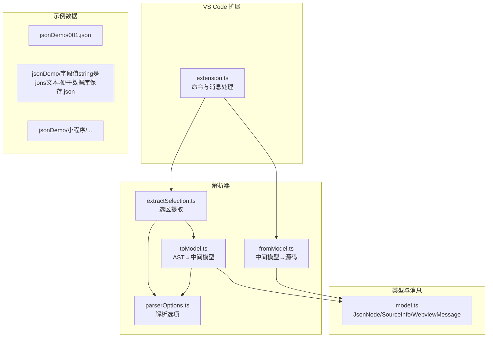
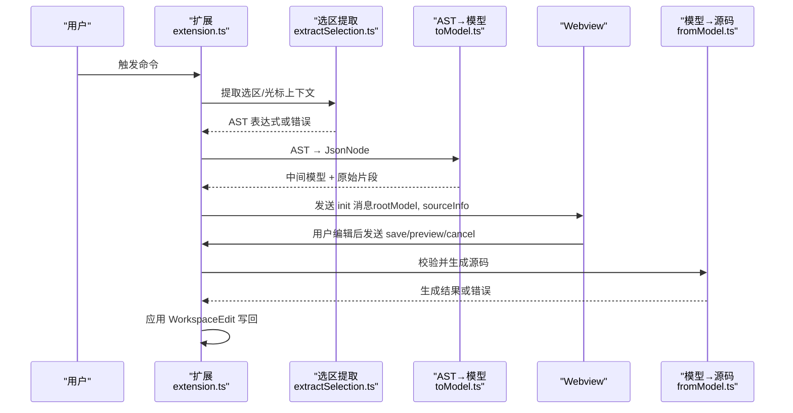
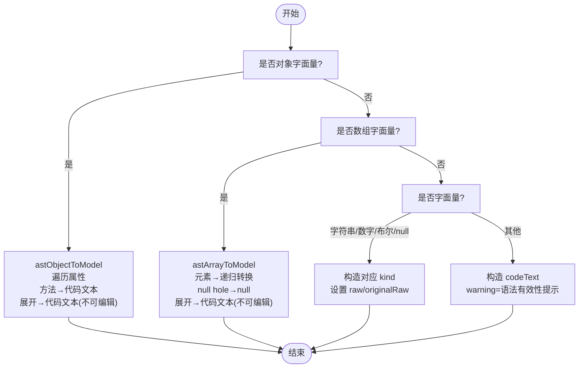
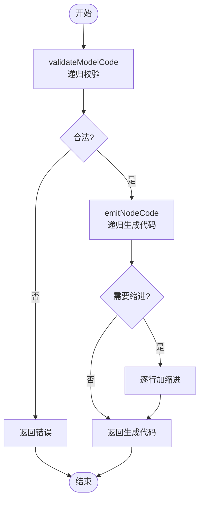
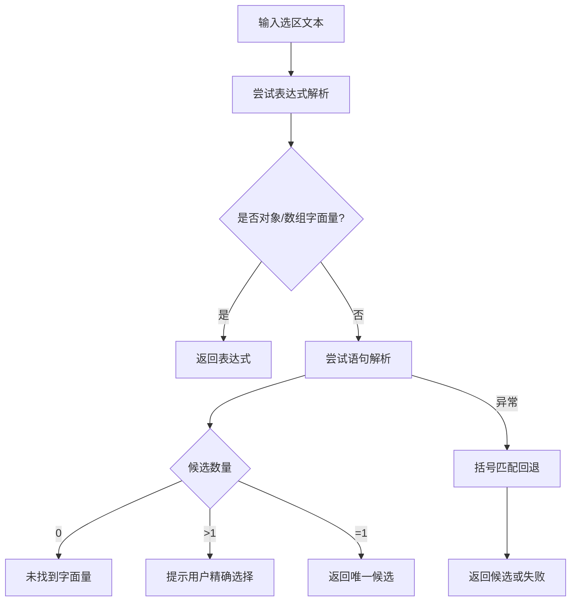
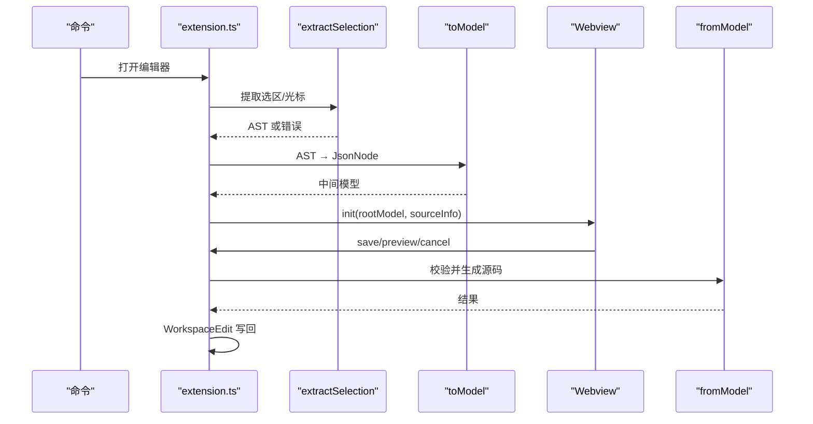
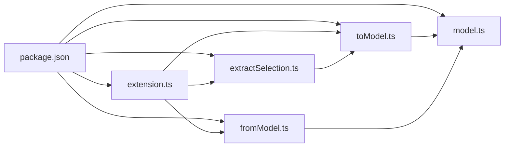

# 数据模型设计

<cite>
**本文引用的文件**
- [src/model.ts](file://src/model.ts)
- [src/parser/toModel.ts](file://src/parser/toModel.ts)
- [src/parser/fromModel.ts](file://src/parser/fromModel.ts)
- [src/parser/extractSelection.ts](file://src/parser/extractSelection.ts)
- [src/parser/parserOptions.ts](file://src/parser/parserOptions.ts)
- [src/extension.ts](file://src/extension.ts)
- [package.json](file://package.json)
- [tsconfig.json](file://tsconfig.json)
- [jsonDemo/001.json](file://jsonDemo/001.json)
- [jsonDemo/字段值string是jons文本-便于数据库保存.json](file://jsonDemo/字段值string是jons文本-便于数据库保存.json)
- [jsonDemo/小程序/preWx-getPreEmpMb-mbCode=bd_psndoc.json](file://jsonDemo/小程序/preWx-getPreEmpMb-mbCode=bd_psndoc.json)
</cite>

## 目录
1. [简介](#简介)
2. [项目结构](#项目结构)
3. [核心组件](#核心组件)
4. [架构总览](#架构总览)
5. [详细组件分析](#详细组件分析)
6. [依赖关系分析](#依赖关系分析)
7. [性能考量](#性能考量)
8. [故障排查指南](#故障排查指南)
9. [结论](#结论)
10. [附录](#附录)

## 简介
本设计文档围绕 JSONOKOK 的数据模型系统，系统性阐述中间模型（JsonNode）与元数据（SourceInfo）的设计理念、实现细节与使用方式。重点包括：
- JsonNode 节点类型的定义与属性，涵盖对象、数组、基本类型及代码文本节点
- SourceInfo 元数据的作用与字段含义：文件 URI、选区位置、缩进信息、原始行内容等
- 中间模型在 AST 与源代码之间的桥梁作用，以及如何保证数据的准确性与完整性
- 可编辑性标记、写入模式与数据验证机制
- 模型序列化与反序列化的处理流程
- 使用示例、最佳实践与扩展新数据类型的建议

## 项目结构
该仓库采用“扩展 + Webview + 解析器”的分层组织方式：
- 扩展入口负责提取选区、构建中间模型、与 Webview 通信、写回源码
- 解析器模块负责从 AST 到中间模型的转换、从中间模型到源码的生成与校验
- 类型定义集中于 model.ts，提供 JsonNode、SourceInfo 与消息协议
- 示例数据位于 jsonDemo，用于演示真实业务场景下的数据形态



图表来源
- [src/extension.ts:1-600](file://src/extension.ts#L1-L600)
- [src/parser/extractSelection.ts:1-385](file://src/parser/extractSelection.ts#L1-L385)
- [src/parser/toModel.ts:1-230](file://src/parser/toModel.ts#L1-L230)
- [src/parser/fromModel.ts:1-305](file://src/parser/fromModel.ts#L1-L305)
- [src/parser/parserOptions.ts:1-36](file://src/parser/parserOptions.ts#L1-L36)
- [src/model.ts:1-103](file://src/model.ts#L1-L103)

章节来源
- [src/extension.ts:1-600](file://src/extension.ts#L1-L600)
- [src/parser/extractSelection.ts:1-385](file://src/parser/extractSelection.ts#L1-L385)
- [src/parser/toModel.ts:1-230](file://src/parser/toModel.ts#L1-L230)
- [src/parser/fromModel.ts:1-305](file://src/parser/fromModel.ts#L1-L305)
- [src/parser/parserOptions.ts:1-36](file://src/parser/parserOptions.ts#L1-L36)
- [src/model.ts:1-103](file://src/model.ts#L1-L103)

## 核心组件
本节聚焦 JsonNode 与 SourceInfo 的设计与职责。

- JsonNode
  - 节点类型：对象、数组、字符串、数字、布尔、null、代码文本
  - 关键属性
    - kind：节点种类
    - value：运行时值（如字符串、数字、布尔、null）
    - raw/originalRaw：原始源码片段；originalRaw 用于写回安全检查
    - sourceKind：源类别（json/code/objectMethod/spread），用于保留非标准 JSON 形态
    - editable：是否可在表格 UI 中直接编辑
    - writeMode：写回模式（json/code），决定生成策略
    - warning：可选警告信息
    - children/items：对象/数组的子节点集合
- SourceInfo
  - uri：文件 URI
  - selectedText：选区文本
  - start/end：起止位置（行、列）
  - version：文档版本，用于并发保护
  - indent：缩进（空格数）
  - originalLines：写回安全检查所需的原始行内容

章节来源
- [src/model.ts:6-34](file://src/model.ts#L6-L34)
- [src/model.ts:39-54](file://src/model.ts#L39-L54)

## 架构总览
中间模型在扩展与 Webview 之间充当“数据中转站”，连接 AST 与源码：
- 选区提取：从用户选区或光标位置提取对象/数组字面量
- AST→中间模型：将 Babel AST 转换为 JsonNode，保留原始源码片段
- Webview 编辑：在表格 UI 中编辑 JsonNode
- 中间模型→源码：校验代码文本节点合法性，生成带缩进的源码
- 写回：基于 SourceInfo 定位范围，应用 WorkspaceEdit 写回



图表来源
- [src/extension.ts:46-378](file://src/extension.ts#L46-L378)
- [src/parser/extractSelection.ts:24-101](file://src/parser/extractSelection.ts#L24-L101)
- [src/parser/toModel.ts:10-90](file://src/parser/toModel.ts#L10-L90)
- [src/parser/fromModel.ts:20-57](file://src/parser/fromModel.ts#L20-L57)

## 详细组件分析

### JsonNode 数据模型
JsonNode 是 JSONOKOK 的核心数据结构，用于承载可编辑的数据树，并保留原始源码以便安全写回。

```mermaid
classDiagram
class JsonNode {
+kind : JsonNodeKind
+value : any
+raw? : string
+originalRaw? : string
+sourceKind? : "json"|"code"|"objectMethod"|"spread"
+editable : boolean
+writeMode : "json"|"code"
+warning? : string
+children? : Record~string, JsonNode~
+items? : JsonNode[]
}
class SourceInfo {
+uri : string
+selectedText : string
+start : {line : number, character : number}
+end : {line : number, character : number}
+version : number
+indent : string
+originalLines? : string[]
}
class WebviewMessage {
+type : "init"|"save"|"preview"|"cancel"
}
JsonNode --> SourceInfo : "写回时参考"
WebviewMessage --> JsonNode : "携带模型"
```

图表来源
- [src/model.ts:6-34](file://src/model.ts#L6-L34)
- [src/model.ts:39-54](file://src/model.ts#L39-L54)
- [src/model.ts:59-102](file://src/model.ts#L59-L102)

章节来源
- [src/model.ts:6-34](file://src/model.ts#L6-L34)
- [src/model.ts:39-54](file://src/model.ts#L39-L54)
- [src/model.ts:59-102](file://src/model.ts#L59-L102)

### AST 到中间模型转换（toModel）
- 支持的对象字面量：遍历属性，区分普通属性与方法，方法与展开语法以代码文本节点保留
- 支持的数组字面量：元素支持 null hole 与展开语法，其余元素递归转换
- 基本类型：字符串、数字、布尔、null，优先使用 AST 原始 raw 片段
- 其他表达式：统一作为代码文本节点，标记为不可直接编辑但可保留为 JavaScript 表达式



图表来源
- [src/parser/toModel.ts:10-90](file://src/parser/toModel.ts#L10-L90)
- [src/parser/toModel.ts:92-158](file://src/parser/toModel.ts#L92-L158)
- [src/parser/toModel.ts:160-209](file://src/parser/toModel.ts#L160-L209)
- [src/parser/toModel.ts:211-229](file://src/parser/toModel.ts#L211-L229)

章节来源
- [src/parser/toModel.ts:10-90](file://src/parser/toModel.ts#L10-L90)
- [src/parser/toModel.ts:92-158](file://src/parser/toModel.ts#L92-L158)
- [src/parser/toModel.ts:160-209](file://src/parser/toModel.ts#L160-L209)
- [src/parser/toModel.ts:211-229](file://src/parser/toModel.ts#L211-L229)

### 中间模型到源码生成与验证（fromModel）
- validateModelCode：递归校验所有 codeText 节点
  - 空字符串禁止
  - 对象方法：尝试包裹解析为对象方法
  - 其他代码文本：使用 Babel 表达式解析
- modelToCode：根据节点类型生成代码，支持缩进
  - 基本类型：按 JSON/JS 规则输出
  - 对象/数组：递归生成键值/项，处理多行与缩进
  - 代码文本：直接输出原始片段
- 辅助函数：格式化对象键、缩进、检测对象方法等



图表来源
- [src/parser/fromModel.ts:20-57](file://src/parser/fromModel.ts#L20-L57)
- [src/parser/fromModel.ts:67-90](file://src/parser/fromModel.ts#L67-L90)
- [src/parser/fromModel.ts:119-142](file://src/parser/fromModel.ts#L119-L142)
- [src/parser/fromModel.ts:144-180](file://src/parser/fromModel.ts#L144-L180)

章节来源
- [src/parser/fromModel.ts:20-57](file://src/parser/fromModel.ts#L20-L57)
- [src/parser/fromModel.ts:67-90](file://src/parser/fromModel.ts#L67-L90)
- [src/parser/fromModel.ts:119-142](file://src/parser/fromModel.ts#L119-L142)
- [src/parser/fromModel.ts:144-180](file://src/parser/fromModel.ts#L144-L180)

### 选区提取与光标定位（extractSelection）
- 直接表达式：尝试解析为表达式，若为对象/数组字面量则直接使用
- 语句级：解析为程序，提取变量声明/表达式语句中的字面量
- 多候选：若多个候选，提示用户精确选择
- 文本回退：对非 JS/TS 文件，使用括号匹配算法进行最佳努力定位



图表来源
- [src/parser/extractSelection.ts:34-101](file://src/parser/extractSelection.ts#L34-L101)
- [src/parser/extractSelection.ts:108-229](file://src/parser/extractSelection.ts#L108-L229)
- [src/parser/extractSelection.ts:237-343](file://src/parser/extractSelection.ts#L237-L343)

章节来源
- [src/parser/extractSelection.ts:34-101](file://src/parser/extractSelection.ts#L34-L101)
- [src/parser/extractSelection.ts:108-229](file://src/parser/extractSelection.ts#L108-L229)
- [src/parser/extractSelection.ts:237-343](file://src/parser/extractSelection.ts#L237-L343)

### 扩展与 Webview 协作（extension）
- 命令触发：注册打开编辑器命令
- 选区/光标提取：根据语言类型与 Markdown 代码块处理
- 初始化：向 Webview 发送 init 消息（rootModel, sourceInfo）
- 写回：校验文档版本、校验模型、生成源码、应用 WorkspaceEdit
- 错误处理：统一通过 ExtensionResponse 返回错误或成功



图表来源
- [src/extension.ts:46-378](file://src/extension.ts#L46-L378)
- [src/extension.ts:397-490](file://src/extension.ts#L397-L490)

章节来源
- [src/extension.ts:46-378](file://src/extension.ts#L46-L378)
- [src/extension.ts:397-490](file://src/extension.ts#L397-L490)

## 依赖关系分析
- 扩展依赖解析器模块与类型定义
- 解析器模块依赖 Babel Parser/Generator 与 @babel/types
- TypeScript 配置启用严格模式与声明文件生成
- 包配置声明 VS Code 激活事件、命令与菜单贡献



图表来源
- [package.json:1-93](file://package.json#L1-L93)
- [src/extension.ts:1-600](file://src/extension.ts#L1-L600)
- [src/parser/toModel.ts:1-230](file://src/parser/toModel.ts#L1-L230)
- [src/parser/fromModel.ts:1-305](file://src/parser/fromModel.ts#L1-L305)
- [src/parser/extractSelection.ts:1-385](file://src/parser/extractSelection.ts#L1-L385)
- [src/model.ts:1-103](file://src/model.ts#L1-L103)

章节来源
- [package.json:1-93](file://package.json#L1-L93)
- [tsconfig.json:1-25](file://tsconfig.json#L1-L25)

## 性能考量
- 选区提取的括号扫描限制了搜索窗口，避免对超大文件造成性能压力
- AST 遍历与递归生成遵循最小必要原则，仅在需要时进行表达式解析
- 缩进处理按行进行，避免不必要的字符串操作
- 建议：对超大文档优先使用光标定位而非全文件解析；对频繁写回场景缓存 SourceInfo 与中间模型

## 故障排查指南
- 选区为空或未识别：检查选区是否包含对象/数组字面量，或是否被 Markdown 代码块包围
- 多候选错误：精确定位到单一对象/数组字面量
- 语法错误：检查 codeText 节点是否为合法 JavaScript 表达式；对象方法需符合特定格式
- 并发写回失败：文档版本变化导致写回被拒绝，需重新打开编辑器
- 生成失败：查看错误消息中的具体原因，修正模型后再试

章节来源
- [src/parser/extractSelection.ts:34-101](file://src/parser/extractSelection.ts#L34-L101)
- [src/parser/fromModel.ts:67-117](file://src/parser/fromModel.ts#L67-L117)
- [src/extension.ts:420-490](file://src/extension.ts#L420-L490)

## 结论
JSONOKOK 的数据模型系统通过 JsonNode 与 SourceInfo 实现了对复杂 JavaScript 数据的可视化编辑与安全写回。AST→中间模型与中间模型→源码的双向转换保证了编辑体验与源码一致性，配合严格的校验与错误处理机制，提升了系统的可靠性与可用性。通过合理的扩展点与插件生态，未来可进一步支持更多数据类型与编辑能力。

## 附录

### 使用示例与最佳实践
- 在 VS Code 中右键选中对象/数组字面量，或在 Markdown 代码块内选择，即可打开 JSONOKOK 编辑器
- 对象方法与展开语法会以代码文本形式保留，避免丢失原有意图
- 编辑完成后点击保存，系统将自动应用 WorkspaceEdit 写回源文件
- 若遇到语法错误，先修复 codeText 节点，再尝试保存

章节来源
- [src/extension.ts:46-378](file://src/extension.ts#L46-L378)
- [src/parser/toModel.ts:113-145](file://src/parser/toModel.ts#L113-L145)
- [src/parser/fromModel.ts:92-117](file://src/parser/fromModel.ts#L92-L117)

### 数据模型序列化与反序列化
- 反序列化：从 AST 到 JsonNode，保留原始片段，便于后续写回
- 序列化：从 JsonNode 到源码，递归生成并应用缩进，确保格式一致
- 验证：在写回前对 codeText 节点进行语法校验，防止生成无效代码

章节来源
- [src/parser/toModel.ts:10-90](file://src/parser/toModel.ts#L10-L90)
- [src/parser/fromModel.ts:20-57](file://src/parser/fromModel.ts#L20-L57)

### 扩展支持新数据类型
- 新增节点类型：在 JsonNodeKind 中添加新类型，并在 toModel 与 fromModel 中分别处理
- 原始片段保留：为新类型提供原始源码片段，确保写回正确性
- 编辑控制：通过 editable 与 writeMode 控制 UI 可编辑性与写回策略
- 校验规则：在 validateModelCode 中增加针对新类型的校验逻辑

章节来源
- [src/model.ts:6-34](file://src/model.ts#L6-L34)
- [src/parser/toModel.ts:10-90](file://src/parser/toModel.ts#L10-L90)
- [src/parser/fromModel.ts:67-90](file://src/parser/fromModel.ts#L67-L90)