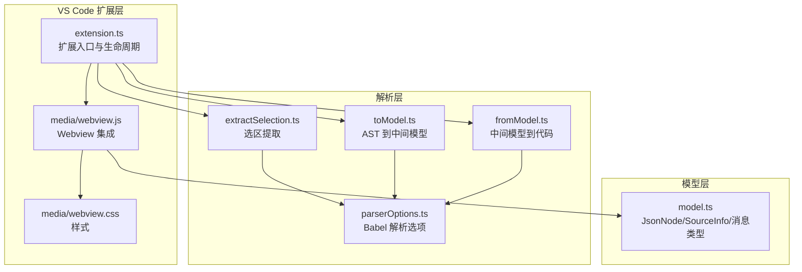
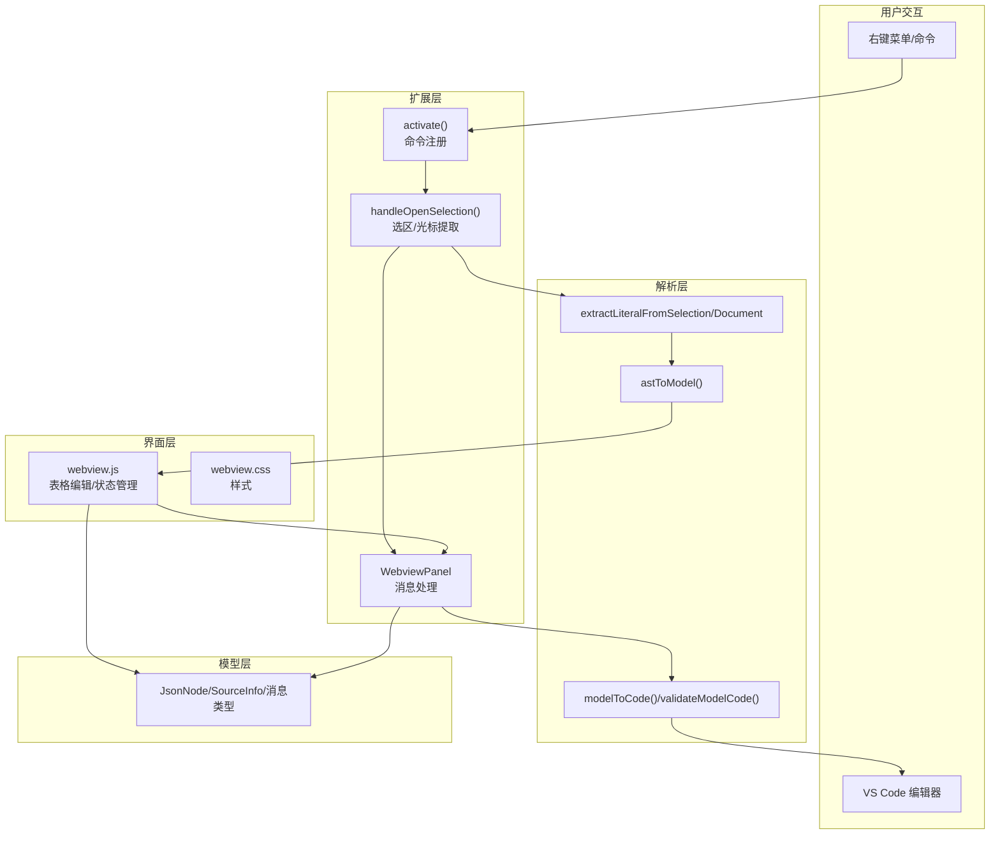
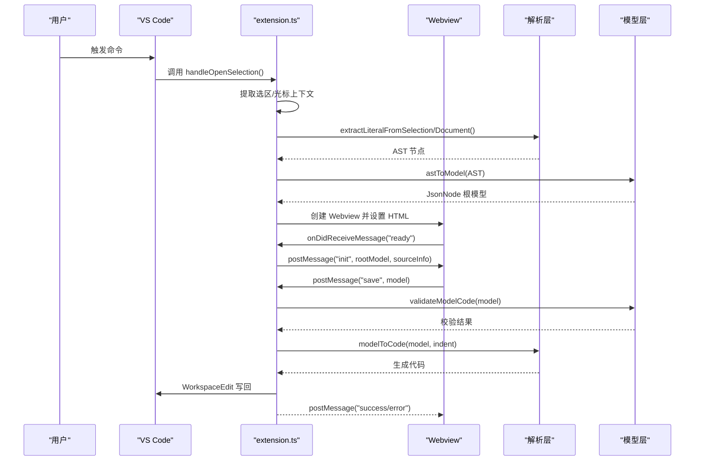
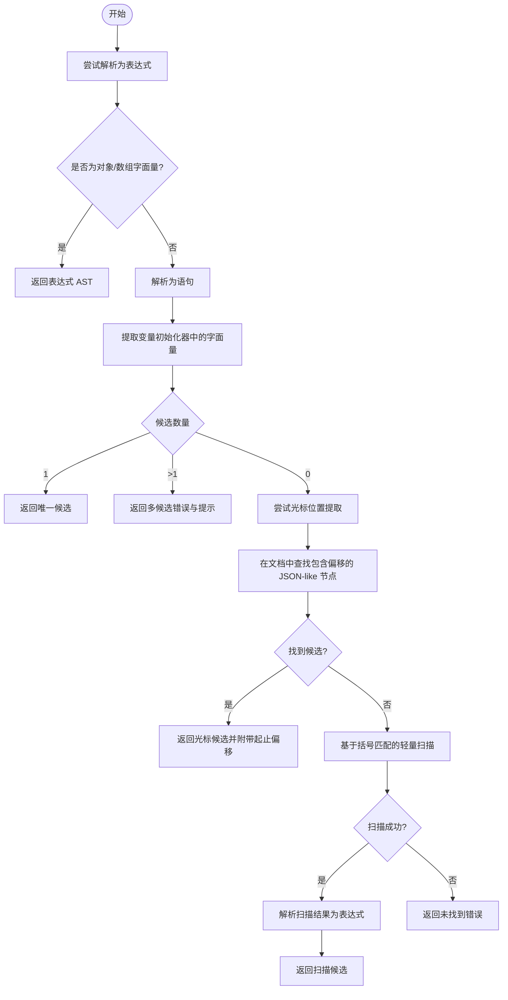
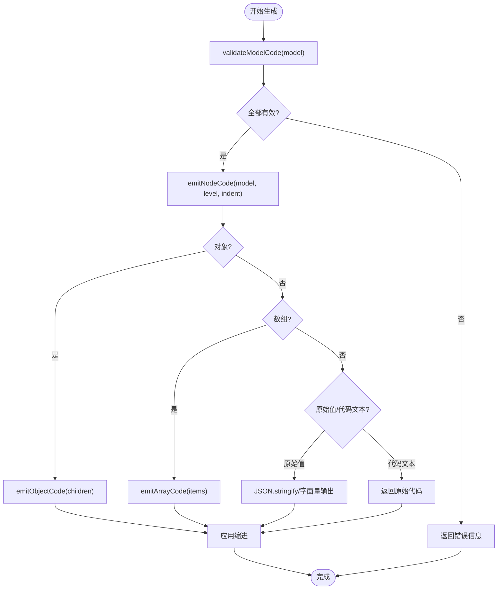
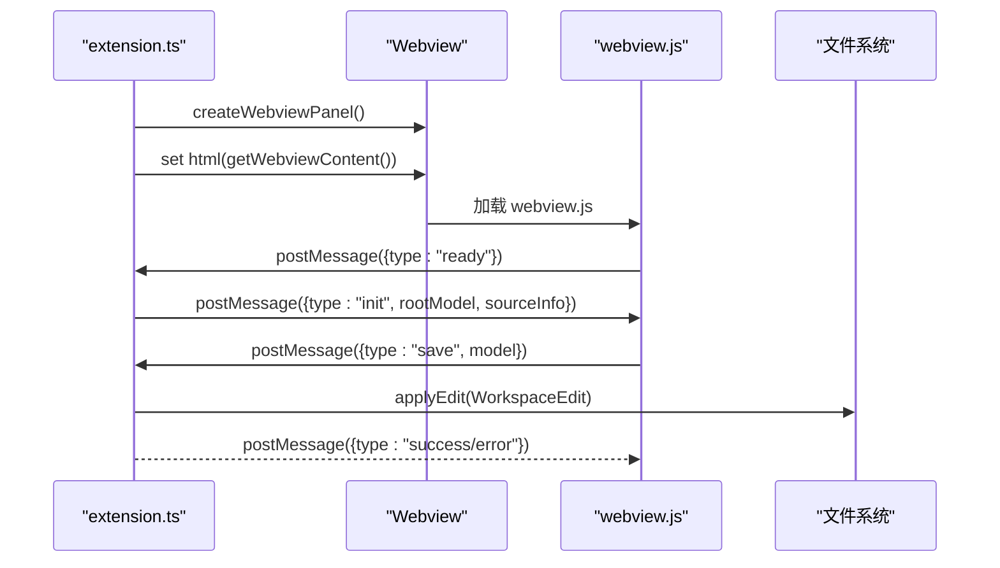
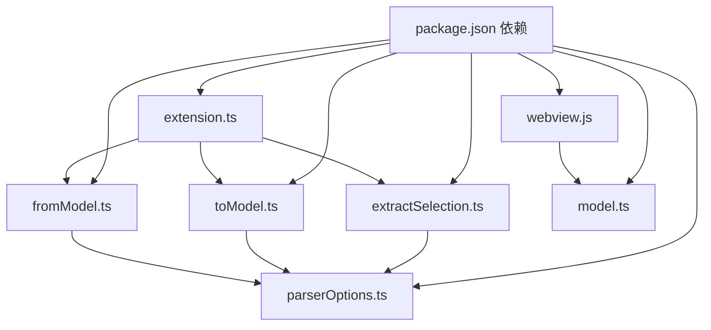

# 核心架构设计

<cite>
**本文档引用的文件**
- [package.json](file://package.json)
- [extension.ts](file://src/extension.ts)
- [model.ts](file://src/model.ts)
- [toModel.ts](file://src/parser/toModel.ts)
- [fromModel.ts](file://src/parser/fromModel.ts)
- [extractSelection.ts](file://src/parser/extractSelection.ts)
- [parserOptions.ts](file://src/parser/parserOptions.ts)
- [webview.js](file://media/webview.js)
- [webview.css](file://media/webview.css)
- [build-webview.ps1](file://tools/build-webview.ps1)
- [tsconfig.json](file://tsconfig.json)
</cite>

## 目录
1. [引言](#引言)
2. [项目结构](#项目结构)
3. [核心组件](#核心组件)
4. [架构总览](#架构总览)
5. [详细组件分析](#详细组件分析)
6. [依赖关系分析](#依赖关系分析)
7. [性能考量](#性能考量)
8. [故障排除指南](#故障排除指南)
9. [结论](#结论)
10. [附录](#附录)

## 引言
本项目为 wysJSON VS Code 扩展，旨在为 JavaScript/TypeScript 数据字面量提供表格化可视化编辑体验，并与 VS Code 编辑器深度集成。其核心目标是在不破坏原生语法的前提下，通过表格界面高效地编辑嵌套 JSON 结构，同时保持对复杂表达式的兼容性。

## 项目结构
项目采用模块化与分层设计：
- 扩展入口与生命周期管理：位于 src/extension.ts
- 中间模型与消息协议：位于 src/model.ts
- 解析与生成模块：位于 src/parser/ 下的 toModel.ts、fromModel.ts、extractSelection.ts、parserOptions.ts
- VS Code Webview 集成：位于 media/webview.js、media/webview.css
- 构建工具：tools/build-webview.ps1 将独立 HTML 编辑器转换为 VS Code 可用的 webview.js
- 配置：package.json 定义激活事件、命令、菜单、配置；tsconfig.json 定义编译选项



**图表来源**
- [extension.ts:19-600](file://src/extension.ts#L19-L600)
- [extractSelection.ts:1-385](file://src/parser/extractSelection.ts#L1-L385)
- [toModel.ts:1-230](file://src/parser/toModel.ts#L1-L230)
- [fromModel.ts:1-305](file://src/parser/fromModel.ts#L1-L305)
- [parserOptions.ts:1-36](file://src/parser/parserOptions.ts#L1-L36)
- [model.ts:1-103](file://src/model.ts#L1-L103)
- [webview.js:1-5209](file://media/webview.js#L1-L5209)
- [webview.css:1-1166](file://media/webview.css#L1-L1166)

**章节来源**
- [package.json:1-93](file://package.json#L1-L93)
- [tsconfig.json:1-25](file://tsconfig.json#L1-L25)

## 核心组件
- 扩展入口与生命周期：注册命令、处理用户触发、创建 Webview 面板、与 Webview 进行消息通信、执行代码回写。
- 中间模型 JsonNode：统一表示对象、数组、原始值及代码文本节点，承载可编辑性、写回模式、原始文本等元信息。
- 解析与生成：
  - 选区提取：从选中文本或光标位置提取对象/数组字面量，支持多种语言与容错策略。
  - AST 转模型：将 Babel AST 节点映射为 JsonNode，保留原始文本以便精确回写。
  - 模型转代码：校验代码文本节点有效性，生成符合源文件缩进与风格的代码。
- Webview 集成：通过 acquireVsCodeApi() 与扩展通信，实现初始化、保存、取消、语言切换等交互。

**章节来源**
- [extension.ts:19-600](file://src/extension.ts#L19-L600)
- [model.ts:1-103](file://src/model.ts#L1-L103)
- [extractSelection.ts:1-385](file://src/parser/extractSelection.ts#L1-L385)
- [toModel.ts:1-230](file://src/parser/toModel.ts#L1-L230)
- [fromModel.ts:1-305](file://src/parser/fromModel.ts#L1-L305)

## 架构总览
系统采用“扩展层 + 解析层 + 模型层 + 界面层”的分层架构：
- 扩展层负责 VS Code 生命周期、命令注册、Webview 创建与消息路由。
- 解析层负责从源码中提取字面量、将 AST 转换为中间模型、将中间模型还原为源码。
- 模型层提供 JsonNode、SourceInfo、消息类型等统一数据结构。
- 界面层负责表格化编辑体验与本地状态管理，通过 VS Code API 与扩展通信。



**图表来源**
- [extension.ts:19-600](file://src/extension.ts#L19-L600)
- [extractSelection.ts:1-385](file://src/parser/extractSelection.ts#L1-L385)
- [toModel.ts:1-230](file://src/parser/toModel.ts#L1-L230)
- [fromModel.ts:1-305](file://src/parser/fromModel.ts#L1-L305)
- [model.ts:1-103](file://src/model.ts#L1-L103)
- [webview.js:1-5209](file://media/webview.js#L1-L5209)

## 详细组件分析

### 扩展入口与生命周期管理
- 命令注册：注册 wysjson.openSelection 与 wysjson.openSelectionEnglish 两个命令，分别用于本地化与英文菜单项。
- 激活事件：基于 onCommand 的延迟激活，减少启动开销。
- 用户触发处理：handleOpenSelection() 统一处理选区与光标两种场景，支持 Markdown 代码块、JS/TS 文件与纯文本文件的结构化提取。
- Webview 创建：设置脚本启用与资源根目录，注入 CSP 与本地资源 URI。
- 消息通信：监听 ready 初始化消息，发送 init；处理 setLanguage、save、cancel 等消息。
- 写回安全：通过 SourceInfo 的版本号与原始行检查，防止并发修改导致的数据覆盖。



**图表来源**
- [extension.ts:46-490](file://src/extension.ts#L46-L490)
- [extractSelection.ts:34-229](file://src/parser/extractSelection.ts#L34-L229)
- [toModel.ts:10-90](file://src/parser/toModel.ts#L10-L90)
- [fromModel.ts:20-57](file://src/parser/fromModel.ts#L20-L57)
- [webview.js:4896-5201](file://media/webview.js#L4896-L5201)

**章节来源**
- [extension.ts:19-600](file://src/extension.ts#L19-L600)
- [model.ts:39-103](file://src/model.ts#L39-L103)

### 中间模型（JsonNode）设计理念
- 多态节点：支持对象、数组、字符串、数字、布尔、null、codeText 等类型，满足表格化展示与编辑需求。
- 原始文本保留：raw/originalRaw/sourceKind/writeMode/editable 等字段确保精确回写与风格保持。
- 递归结构：children/items 支持嵌套对象与数组，形成树形中间模型。
- 代码文本节点：对非 JSON 表达式（函数、方法、计算属性等）以 codeText 形式保留，允许用户在表格中以“代码”形式编辑，但需保证语法有效。

```mermaid
classDiagram
class JsonNode {
+kind : JsonNodeKind
+value : any
+raw? : string
+originalRaw? : string
+sourceKind? : "json"|"code"|"objectMethod"|"spread"
+editable : boolean
+writeMode : "json"|"code"
+warning? : string
+children? : Record~string, JsonNode~
+items? : JsonNode[]
}
class SourceInfo {
+uri : string
+selectedText : string
+start : {line, character}
+end : {line, character}
+version : number
+indent : string
+originalLines? : string[]
}
class InitMessage {
+type : "init"
+rootModel : JsonNode
+sourceInfo : SourceInfo
+readonlyWarnings? : string[]
}
class SaveMessage {
+type : "save"
+model : JsonNode
}
class CancelMessage {
+type : "cancel"
}
class ExtensionResponse {
+type : "success"|"error"|"preview"
+message? : string
+generatedCode? : string
}
JsonNode --> SourceInfo : "被写回时使用"
InitMessage --> JsonNode : "携带"
InitMessage --> SourceInfo : "携带"
SaveMessage --> JsonNode : "携带"
ExtensionResponse --> JsonNode : "可能携带生成代码"
```

**图表来源**
- [model.ts:6-103](file://src/model.ts#L6-L103)

**章节来源**
- [model.ts:1-103](file://src/model.ts#L1-L103)

### 解析层：选区提取与 AST 转模型
- 选区提取策略：
  - 直接解析表达式：优先尝试将选区作为表达式解析，若为对象/数组字面量则直接使用。
  - 语句解析：若表达式解析失败，解析为语句，提取变量声明中的初始化值，返回唯一候选。
  - 光标位置提取：在文档级解析中，优先变量初始化器，其次最外层字面量，最后回退到基于括号匹配的轻量扫描。
  - 容错与提示：多候选时提示用户精确选择；空选区、语法错误、未找到字面量时给出明确错误与建议。
- AST 转模型：
  - 对象：遍历属性，支持标识符、字符串、数值键与计算属性键；方法保留为 codeText；扩展运算符标记为不可编辑并警告。
  - 数组：支持 hole、扩展运算符标记为不可编辑并警告；元素递归转换。
  - 原始值：字符串、数字、布尔、null 直接映射；优先使用原始源码片段以保持格式。
  - 代码文本：非 JSON 表达式统一转换为 codeText，保留原始代码并标注写回模式为 code。
- 原始文本提取：getNodeRaw() 基于 AST 节点 start/end 与原始源码切片，确保精确回写。



**图表来源**
- [extractSelection.ts:34-229](file://src/parser/extractSelection.ts#L34-L229)

**章节来源**
- [extractSelection.ts:1-385](file://src/parser/extractSelection.ts#L1-L385)
- [toModel.ts:1-230](file://src/parser/toModel.ts#L1-L230)
- [parserOptions.ts:1-36](file://src/parser/parserOptions.ts#L1-L36)

### 生成层：模型到代码与校验
- 代码生成：
  - 递归 emitNodeCode：根据节点类型输出 JSON 或代码文本；对象/数组按层级缩进格式化。
  - 对象键格式化：合法标识符直接输出，否则使用 JSON.stringify 包裹。
  - 代码文本处理：保留原始代码，必要时进行换行缩进与块级缩进。
  - 对象方法检测：对看起来像对象方法的代码进行特殊处理，确保正确缩进与格式。
- 代码校验：
  - validateModelCode：递归校验 codeText 节点，确保非空且为有效 JavaScript 表达式。
  - 对象方法校验：将代码包裹在对象字面量中进行解析，验证其为合法对象方法。
- 缩进处理：根据 SourceInfo.indent 对生成代码进行逐行缩进，保持与源文件一致的缩进风格。



**图表来源**
- [fromModel.ts:20-305](file://src/parser/fromModel.ts#L20-L305)

**章节来源**
- [fromModel.ts:1-305](file://src/parser/fromModel.ts#L1-L305)
- [model.ts:39-54](file://src/model.ts#L39-L54)

### VS Code 扩展生命周期与 Webview 面板
- 生命周期：通过 package.json 的 activationEvents 与 commands 注册命令；在首次调用时激活扩展。
- Webview 面板：创建面板、注入 CSP、本地资源路径、HTML 内容；监听消息并处理初始化、保存、取消、语言切换。
- 本地构建：tools/build-webview.ps1 将独立 HTML 编辑器转换为 VS Code 可用的 webview.js，注入 acquireVsCodeApi()、状态同步、消息处理等适配。



**图表来源**
- [extension.ts:328-378](file://src/extension.ts#L328-L378)
- [webview.js:4896-5201](file://media/webview.js#L4896-L5201)
- [build-webview.ps1:1-370](file://tools/build-webview.ps1#L1-L370)

**章节来源**
- [extension.ts:19-600](file://src/extension.ts#L19-L600)
- [webview.js:1-5209](file://media/webview.js#L1-L5209)
- [build-webview.ps1:1-370](file://tools/build-webview.ps1#L1-L370)

## 依赖关系分析
- 外部依赖：
  - @babel/parser/@babel/generator/@babel/types：用于解析与生成 JavaScript/TypeScript 代码，支持 JSX、TS、装饰器、可选链、空值合并、BigInt、顶层 await、导入属性等丰富语法。
  - monaco-editor：在独立 HTML 版本中使用，VS Code 扩展通过 Webview 集成。
- 内部依赖：
  - extension.ts 依赖解析层与模型层；解析层依赖 parserOptions.ts；fromModel.ts 依赖 extractSelection.ts 的解析选项；webview.js 依赖 model.ts 的消息类型与状态。



**图表来源**
- [package.json:77-91](file://package.json#L77-L91)
- [extension.ts:1-16](file://src/extension.ts#L1-L16)
- [extractSelection.ts:1-11](file://src/parser/extractSelection.ts#L1-L11)
- [toModel.ts:1-8](file://src/parser/toModel.ts#L1-L8)
- [fromModel.ts:1-8](file://src/parser/fromModel.ts#L1-L8)
- [parserOptions.ts:1-17](file://src/parser/parserOptions.ts#L1-L17)
- [model.ts:1-103](file://src/model.ts#L1-L103)
- [webview.js:1-10](file://media/webview.js#L1-L10)

**章节来源**
- [package.json:77-91](file://package.json#L77-L91)

## 性能考量
- 选区提取的容错策略：当全文件解析失败时，采用基于括号匹配的轻量扫描，限制扫描窗口（默认 20000 字符），平衡准确性与性能。
- AST 转模型：仅处理对象、数组、原始值与代码文本，避免对大型 AST 的深度遍历造成性能问题。
- 代码生成：逐行应用缩进，避免一次性大字符串拼接；对多行代码文本进行块级缩进，减少格式化开销。
- Webview 本地状态：通过 localStorage 持久化 UI 状态，减少每次初始化的计算成本。

[本节为通用性能讨论，无需特定文件来源]

## 故障排除指南
- 选区为空或未识别：检查选区是否包含对象/数组字面量，或是否处于 Markdown 代码块内。
- 语法解析失败：确认选区为有效 JavaScript/TypeScript 代码；对于复杂表达式，考虑简化或拆分。
- 文档版本冲突：若在提取后编辑器内容发生变更，扩展会拒绝写回并提示重新打开编辑器。
- 代码文本无效：确保 codeText 节点为有效 JavaScript 表达式；对象方法需符合函数体格式。
- 语言切换失败：检查 VS Code 上下文键设置与全局状态更新是否成功。

**章节来源**
- [extension.ts:420-490](file://src/extension.ts#L420-L490)
- [fromModel.ts:67-117](file://src/parser/fromModel.ts#L67-L117)

## 结论
wysJSON 通过清晰的分层架构与中间模型，实现了从 VS Code 编辑器到表格化编辑再到精确代码回写的完整闭环。其核心优势在于：
- 使用 Babel AST 实现对现代 JavaScript/TypeScript 的高兼容性；
- 通过 JsonNode 中间模型精确保留原始文本与写回模式；
- 在 VS Code Webview 中提供本地化的表格编辑体验；
- 通过严格的校验与安全检查，保障写回的正确性与一致性。

该架构既适合日常 JSON 编辑，也能处理复杂的对象方法与表达式场景，具备良好的扩展性与维护性。

## 附录
- 技术决策与权衡：
  - 选择 Babel AST：因其对现代 JS/TS 语法的全面支持，能够准确解析 JSX、装饰器、可选链等特性，从而提升兼容性与准确性。
  - 中间模型设计：通过 JsonNode 统一抽象，兼顾表格化编辑与精确回写，避免直接操作 AST 的复杂性。
  - Webview 集成：通过 acquireVsCodeApi() 与扩展通信，实现双向消息传递与状态同步。
  - 大文件处理：选区提取采用容错策略与扫描窗口限制，避免全文件解析带来的性能问题。
- 开发与构建：
  - TypeScript 编译配置：严格类型检查与源码映射，便于调试与维护。
  - Webview 构建：通过 PowerShell 脚本自动化将独立 HTML 版本转换为 VS Code 可用的 webview.js，确保一致性与可维护性。

**章节来源**
- [tsconfig.json:1-25](file://tsconfig.json#L1-L25)
- [build-webview.ps1:1-370](file://tools/build-webview.ps1#L1-L370)