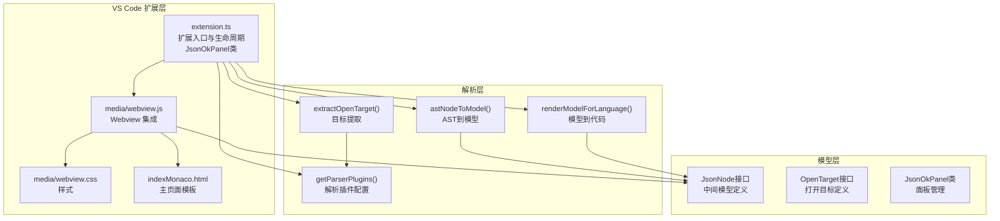
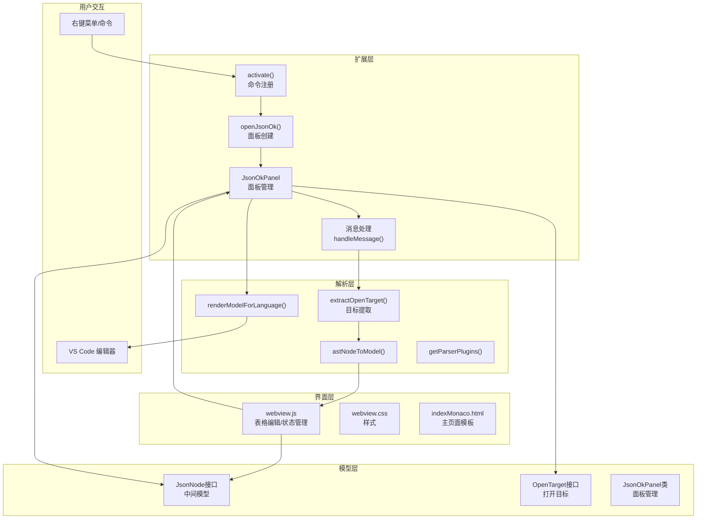
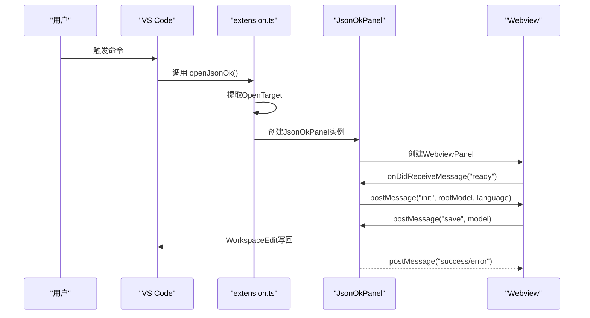
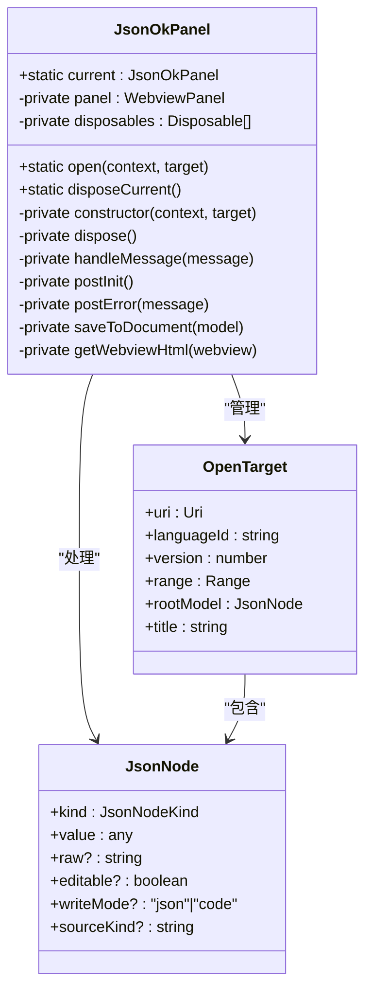
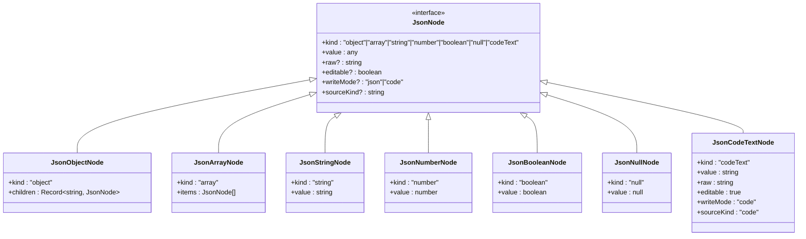
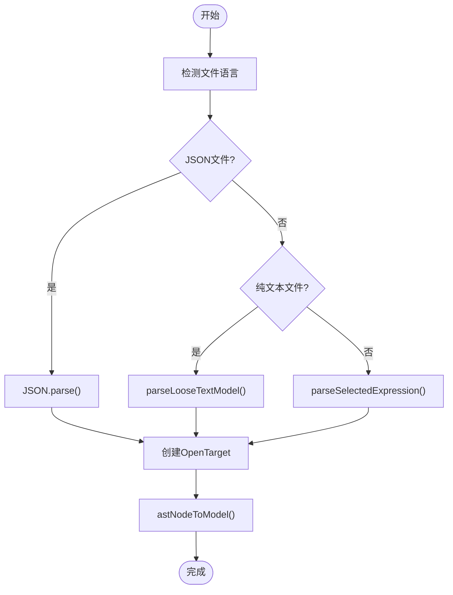
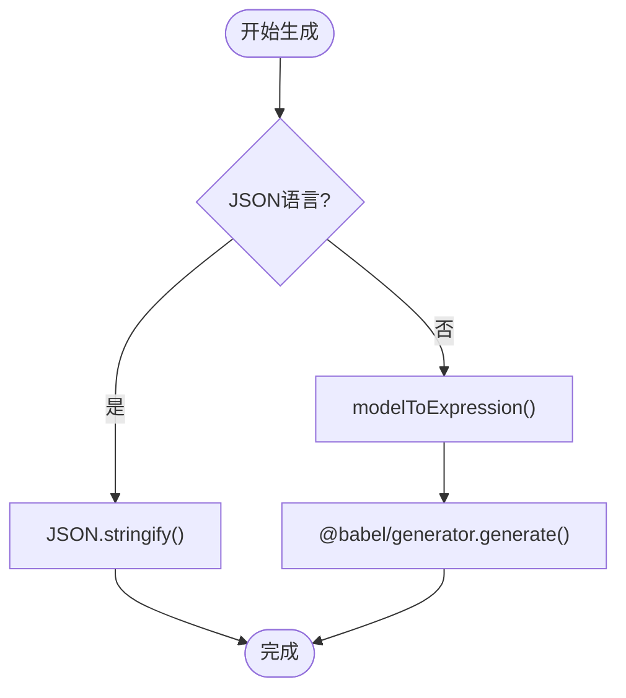
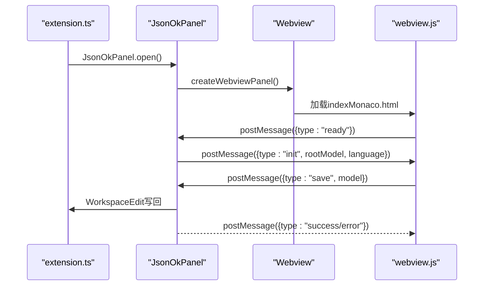
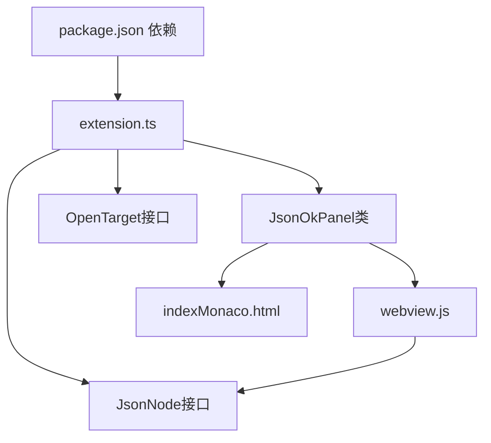

# 核心架构设计

<cite>
**本文档引用的文件**
- [extension.ts](file://部署方式/vscodeExtension/src/extension.ts)
- [indexMonaco.html](file://部署方式/vscodeExtension/indexMonaco.html)
- [package.json](file://部署方式/vscodeExtension/package.json)
- [tsconfig.json](file://部署方式/vscodeExtension/tsconfig.json)
- [webview.js](file://部署方式/vscodeExtension/media/webview.js)
- [webview.css](file://部署方式/vscodeExtension/media/webview.css)
- [babel-generator.d.ts](file://部署方式/vscodeExtension/src/babel-generator.d.ts)
</cite>

## 更新摘要
**所做更改**
- 更新了扩展入口文件，反映JSONOKOK的全新VSCode扩展实现
- 新增了JsonOkPanel类的完整架构设计
- 更新了Webview集成和消息通信协议
- 重构了中间模型设计和解析层架构
- 新增了完整的VS Code扩展生命周期管理

## 目录
1. [引言](#引言)
2. [项目结构](#项目结构)
3. [核心组件](#核心组件)
4. [架构总览](#架构总览)
5. [详细组件分析](#详细组件分析)
6. [依赖关系分析](#依赖关系分析)
7. [性能考量](#性能考量)
8. [故障排除指南](#故障排除指南)
9. [结论](#结论)
10. [附录](#附录)

## 引言
本项目为 JSONOKOK VS Code 扩展，旨在为 JavaScript/TypeScript 数据字面量提供表格化可视化编辑体验，并与 VS Code 编辑器深度集成。其核心目标是在不破坏原生语法的前提下，通过表格界面高效地编辑嵌套 JSON 结构，同时保持对复杂表达式的兼容性。

**更新** 本版本完全重构了扩展架构，采用全新的JsonOkPanel类管理Webview面板，实现了更完善的生命周期管理和消息通信机制。

## 项目结构
项目采用模块化与分层设计：
- 扩展入口与生命周期管理：位于 部署方式/vscodeExtension/src/extension.ts
- 中间模型与消息协议：位于扩展入口文件中定义的JsonNode接口
- 解析与生成模块：位于扩展入口文件中的各种解析函数
- VS Code Webview 集成：位于 部署方式/vscodeExtension/media/webview.js、部署方式/vscodeExtension/media/webview.css
- 主要HTML模板：位于 部署方式/vscodeExtension/indexMonaco.html
- 配置：部署方式/vscodeExtension/package.json 定义激活事件、命令、菜单、配置；tsconfig.json 定义编译选项

**图表来源**
- [extension.ts:1-1636](file://部署方式/vscodeExtension/src/extension.ts#L1-L1636)
- [webview.js:1-5209](file://部署方式/vscodeExtension/media/webview.js#L1-L5209)
- [webview.css:1-1166](file://部署方式/vscodeExtension/media/webview.css#L1-L1166)
- [indexMonaco.html:1-1000](file://部署方式/vscodeExtension/indexMonaco.html#L1-L1000)

**章节来源**
- [package.json:1-93](file://部署方式/vscodeExtension/package.json#L1-L93)
- [tsconfig.json:1-25](file://部署方式/vscodeExtension/tsconfig.json#L1-L25)

## 核心组件
- 扩展入口与生命周期：注册命令、处理用户触发、创建 JsonOkPanel 面板、与 Webview 进行消息通信、执行代码回写。
- JsonOkPanel 面板管理：全新的面板类，负责Webview生命周期管理、消息处理、状态持久化。
- 中间模型 JsonNode：统一表示对象、数组、原始值及代码文本节点，承载可编辑性、写回模式、原始文本等元信息。
- 解析与生成：
  - 目标提取：从选中文本或光标位置提取对象/数组字面量，支持多种语言与容错策略。
  - AST 转模型：将 Babel AST 节点映射为 JsonNode，保留原始文本以便精确回写。
  - 模型转代码：根据语言ID生成对应代码，支持JSON和JavaScript/TypeScript。
- Webview 集成：通过 acquireVsCodeApi() 与扩展通信，实现初始化、保存、取消等交互。

**更新** 新增了JsonOkPanel类的完整实现，替代了原有的简单Webview处理方式，提供了更好的状态管理和错误处理。

**章节来源**
- [extension.ts:97-116](file://部署方式/vscodeExtension/src/extension.ts#L97-L116)
- [extension.ts:141-336](file://部署方式/vscodeExtension/src/extension.ts#L141-L336)
- [extension.ts:582-699](file://部署方式/vscodeExtension/src/extension.ts#L582-L699)

## 架构总览
系统采用"扩展层 + 解析层 + 模型层 + 界面层"的分层架构：
- 扩展层负责 VS Code 生命周期、命令注册、JsonOkPanel 创建与消息路由。
- 解析层负责从源码中提取字面量、将 AST 转换为中间模型、将中间模型还原为源码。
- 模型层提供 JsonNode、OpenTarget、消息类型等统一数据结构。
- 界面层负责表格化编辑体验与本地状态管理，通过 VS Code API 与扩展通信。

**更新** 架构进行了重大重构，JsonOkPanel类成为扩展层的核心组件，负责完整的Webview生命周期管理。

**图表来源**
- [extension.ts:97-116](file://部署方式/vscodeExtension/src/extension.ts#L97-L116)
- [extension.ts:118-139](file://部署方式/vscodeExtension/src/extension.ts#L118-L139)
- [extension.ts:141-336](file://部署方式/vscodeExtension/src/extension.ts#L141-L336)
- [extension.ts:338-520](file://部署方式/vscodeExtension/src/extension.ts#L338-L520)

## 详细组件分析

### 扩展入口与生命周期管理
- 命令注册：注册 JSONOK.openSelection 与 JSONOK.openSelectionEnglish 两个命令，分别用于本地化与英文菜单项。
- 激活事件：基于 onCommand 的延迟激活，减少启动开销。
- 用户触发处理：openJsonOk() 统一处理选区与光标两种场景，支持多种语言文件的结构化提取。
- JsonOkPanel 创建：设置脚本启用与资源根目录，注入 CSP 与本地资源 URI。
- 消息通信：监听 ready 初始化消息，发送 init；处理 save、cancel 等消息。
- 写回安全：通过 OpenTarget 的版本号检查，防止并发修改导致的数据覆盖。

**更新** 完全重构了生命周期管理，新增了JsonOkPanel类来处理Webview的完整生命周期。

**图表来源**
- [extension.ts:118-139](file://部署方式/vscodeExtension/src/extension.ts#L118-L139)
- [extension.ts:141-336](file://部署方式/vscodeExtension/src/extension.ts#L141-L336)
- [extension.ts:206-234](file://部署方式/vscodeExtension/src/extension.ts#L206-L234)

**章节来源**
- [extension.ts:97-116](file://部署方式/vscodeExtension/src/extension.ts#L97-L116)
- [extension.ts:118-139](file://部署方式/vscodeExtension/src/extension.ts#L118-L139)
- [extension.ts:141-336](file://部署方式/vscodeExtension/src/extension.ts#L141-L336)

### JsonOkPanel 面板管理
- 面板生命周期：单例模式管理，确保同一时间只有一个面板活跃。
- Webview 创建：设置脚本启用、retainContextWhenHidden、localResourceRoots。
- 消息处理：handleMessage() 统一处理 ready、save、cancel 等消息类型。
- 错误处理：postError() 方法提供统一的错误消息格式。
- 状态管理：buildSaveDebugLog() 收集调试信息，restoreEmptyCodeTextNodes() 恢复空代码节点。

**更新** JsonOkPanel类是本次重构的核心，提供了完整的Webview面板管理功能。

**图表来源**
- [extension.ts:141-336](file://部署方式/vscodeExtension/src/extension.ts#L141-L336)
- [extension.ts:66-73](file://部署方式/vscodeExtension/src/extension.ts#L66-L73)
- [extension.ts:7-64](file://部署方式/vscodeExtension/src/extension.ts#L7-L64)

**章节来源**
- [extension.ts:141-336](file://部署方式/vscodeExtension/src/extension.ts#L141-L336)
- [extension.ts:66-73](file://部署方式/vscodeExtension/src/extension.ts#L66-L73)
- [extension.ts:7-64](file://部署方式/vscodeExtension/src/extension.ts#L7-L64)

### 中间模型（JsonNode）设计理念
- 多态节点：支持对象、数组、字符串、数字、布尔、null、codeText 等类型，满足表格化展示与编辑需求。
- 原始文本保留：kind、value、raw、editable、writeMode、sourceKind 等字段确保精确回写与风格保持。
- 递归结构：children、items 支持嵌套对象与数组，形成树形中间模型。
- 代码文本节点：对非 JSON 表达式（函数、方法、计算属性等）以 codeText 形式保留，允许用户在表格中以"代码"形式编辑。

**更新** 中间模型设计保持不变，但增加了sourceKind字段来区分不同类型的源代码。

**图表来源**
- [extension.ts:7-64](file://部署方式/vscodeExtension/src/extension.ts#L7-L64)

**章节来源**
- [extension.ts:7-64](file://部署方式/vscodeExtension/src/extension.ts#L7-L64)

### 解析层：目标提取与 AST 转模型
- 目标提取策略：
  - JSON文件：直接解析JSON，支持空选区插入空对象。
  - JavaScript/TypeScript文件：优先解析表达式，支持光标位置提取。
  - 纯文本文件：支持Markdown代码块和普通文本中的JSON提取。
- AST 转模型：
  - 对象：遍历属性，支持标识符、字符串、数值键与计算属性键。
  - 数组：支持hole、扩展运算符；元素递归转换。
  - 原始值：字符串、数字、布尔、null 直接映射。
  - 代码文本：非 JSON 表达式统一转换为 codeText。
- 语言插件：根据语言ID动态配置Babel解析插件。

**更新** 目标提取逻辑更加完善，支持更多文件类型和错误处理。

**图表来源**
- [extension.ts:338-520](file://部署方式/vscodeExtension/src/extension.ts#L338-L520)
- [extension.ts:1281-1291](file://部署方式/vscodeExtension/src/extension.ts#L1281-L1291)

**章节来源**
- [extension.ts:338-520](file://部署方式/vscodeExtension/src/extension.ts#L338-L520)
- [extension.ts:582-699](file://部署方式/vscodeExtension/src/extension.ts#L582-L699)
- [extension.ts:1443-1465](file://部署方式/vscodeExtension/src/extension.ts#L1443-L1465)

### 生成层：模型到代码与渲染
- 代码生成：
  - renderModelForLanguage()：根据语言ID生成对应代码。
  - JSON文档：使用JSON.stringify()格式化输出。
  - JavaScript/TypeScript：使用@babel/generator生成代码。
- 模型到表达式：modelToExpression() 将中间模型转换为Babel表达式AST。
- 代码文本处理：resolveCodeTextSource() 解析codeText节点的源代码。
- 空值恢复：restoreEmptyCodeTextNodes() 恢复空的codeText节点。

**更新** 代码生成逻辑更加健壮，支持更多语言和错误处理。

**图表来源**
- [extension.ts:701-711](file://部署方式/vscodeExtension/src/extension.ts#L701-L711)
- [extension.ts:739-776](file://部署方式/vscodeExtension/src/extension.ts#L739-L776)

**章节来源**
- [extension.ts:701-711](file://部署方式/vscodeExtension/src/extension.ts#L701-L711)
- [extension.ts:739-776](file://部署方式/vscodeExtension/src/extension.ts#L739-L776)
- [extension.ts:790-830](file://部署方式/vscodeExtension/src/extension.ts#L790-L830)

### VS Code 扩展生命周期与 Webview 面板
- 生命周期：通过 package.json 的 activationEvents 与 commands 注册命令；在首次调用时激活扩展。
- JsonOkPanel 面板：创建面板、注入 CSP、本地资源路径、HTML 内容；监听消息并处理初始化、保存、取消。
- Webview 集成：通过 acquireVsCodeApi() 与扩展通信，实现双向消息传递与状态同步。
- 本地构建：使用indexMonaco.html作为主页面模板，通过webview.js桥接VS Code和Webview。

**更新** Webview集成完全重构，使用JsonOkPanel类管理面板生命周期。

**图表来源**
- [extension.ts:163-191](file://部署方式/vscodeExtension/src/extension.ts#L163-L191)
- [extension.ts:301-336](file://部署方式/vscodeExtension/src/extension.ts#L301-L336)
- [extension.ts:206-234](file://部署方式/vscodeExtension/src/extension.ts#L206-L234)

**章节来源**
- [extension.ts:163-191](file://部署方式/vscodeExtension/src/extension.ts#L163-L191)
- [extension.ts:301-336](file://部署方式/vscodeExtension/src/extension.ts#L301-L336)
- [extension.ts:206-234](file://部署方式/vscodeExtension/src/extension.ts#L206-L234)

## 依赖关系分析
- 外部依赖：
  - @babel/parser/@babel/generator/@babel/types：用于解析与生成 JavaScript/TypeScript 代码。
  - VS Code API：提供编辑器集成、Webview管理、工作区编辑等功能。
- 内部依赖：
  - extension.ts 依赖各种解析函数和JsonNode接口；JsonOkPanel类依赖VS Code API；webview.js 依赖JsonNode接口。

**更新** 依赖关系更加清晰，JsonOkPanel类成为核心协调者。

**图表来源**
- [package.json:77-91](file://部署方式/vscodeExtension/package.json#L77-L91)
- [extension.ts:1-5](file://部署方式/vscodeExtension/src/extension.ts#L1-L5)
- [extension.ts:141-336](file://部署方式/vscodeExtension/src/extension.ts#L141-L336)

**章节来源**
- [package.json:77-91](file://部署方式/vscodeExtension/package.json#L77-L91)

## 性能考量
- 目标提取优化：针对不同文件类型采用最优解析策略，避免不必要的全文件解析。
- AST 转模型：仅处理对象、数组、原始值与代码文本，避免对大型 AST 的深度遍历造成性能问题。
- Webview 状态管理：通过单例模式管理面板，避免重复创建造成的内存浪费。
- 代码生成：使用@babel/generator进行增量更新，减少格式化开销。
- 错误处理：buildSaveDebugLog() 收集调试信息，便于性能分析和问题定位。

**更新** 性能优化集中在JsonOkPanel类的状态管理和目标提取策略上。

## 故障排除指南
- 面板无法创建：检查VS Code版本和扩展权限设置。
- 保存失败：确认文档版本未发生变化，检查WorkspaceEdit权限。
- 代码生成错误：验证codeText节点的有效性，检查语言插件配置。
- 目标提取失败：确认选区包含有效的JSON/JS表达式。
- Webview通信失败：检查acquireVsCodeApi()桥接脚本是否正确注入。

**更新** 故障排除指南针对JsonOkPanel类的新架构进行了更新。

**章节来源**
- [extension.ts:249-299](file://部署方式/vscodeExtension/src/extension.ts#L249-L299)
- [extension.ts:832-841](file://部署方式/vscodeExtension/src/extension.ts#L832-L841)

## 结论
JSONOKOK 通过全新的分层架构与中间模型，实现了从 VS Code 编辑器到表格化编辑再到精确代码回写的完整闭环。其核心优势在于：
- 使用 Babel AST 实现对现代 JavaScript/TypeScript 的高兼容性；
- 通过 JsonNode 中间模型精确保留原始文本与写回模式；
- 通过 JsonOkPanel 类提供稳定的 Webview 面板管理；
- 通过严格的校验与安全检查，保障写回的正确性与一致性；
- 通过单例模式管理面板生命周期，提升性能和用户体验。

**更新** 本次重构显著提升了系统的稳定性、性能和可维护性。

## 附录
- 技术决策与权衡：
  - 选择 Babel AST：因其对现代 JS/TS 语法的全面支持，能够准确解析 JSX、装饰器、可选链等特性。
  - JsonOkPanel 设计：通过类封装管理Webview生命周期，提供更好的错误处理和状态管理。
  - 单例模式：避免多个面板实例造成的资源浪费和状态冲突。
  - 动态插件配置：根据语言ID动态加载Babel插件，提升兼容性和性能。
- 开发与构建：
  - TypeScript 编译配置：严格类型检查与源码映射，便于调试与维护。
  - Webview 构建：使用indexMonaco.html作为模板，通过桥接脚本实现VS Code集成。

**更新** 附录内容反映了新架构的技术决策和开发实践。

**章节来源**
- [tsconfig.json:1-25](file://部署方式/vscodeExtension/tsconfig.json#L1-L25)
- [extension.ts:1443-1465](file://部署方式/vscodeExtension/src/extension.ts#L1443-L1465)
- [extension.ts:301-336](file://部署方式/vscodeExtension/src/extension.ts#L301-L336)