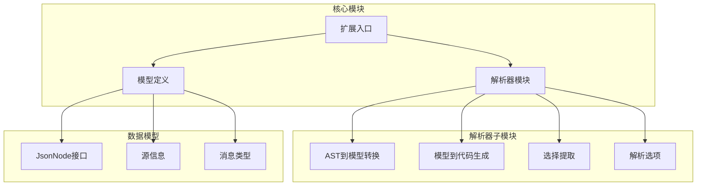
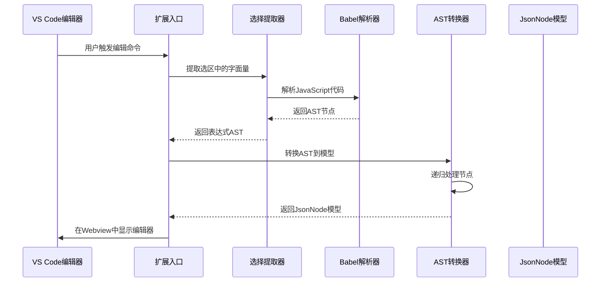
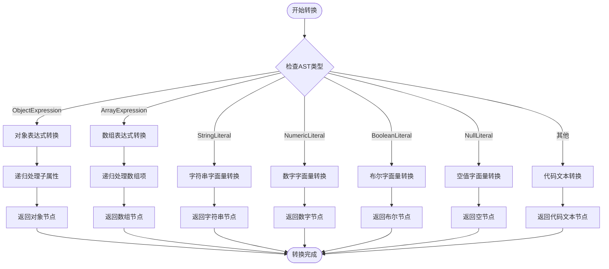
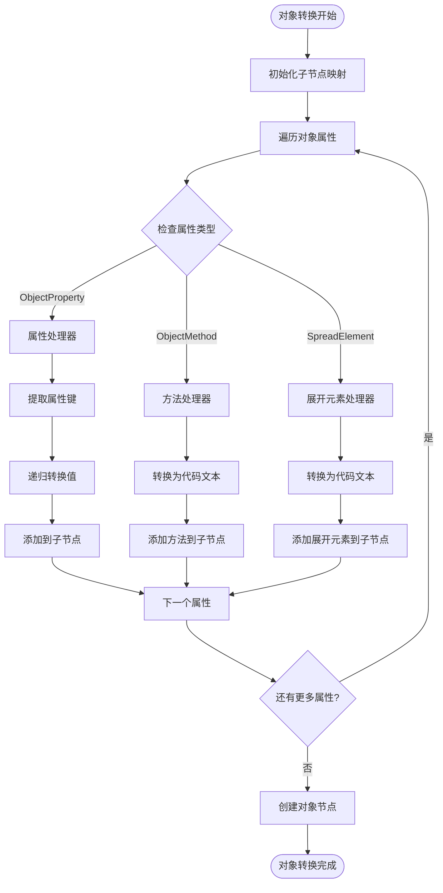
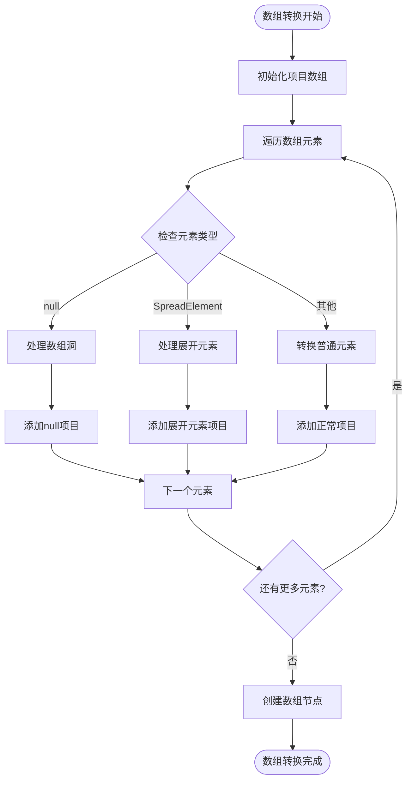
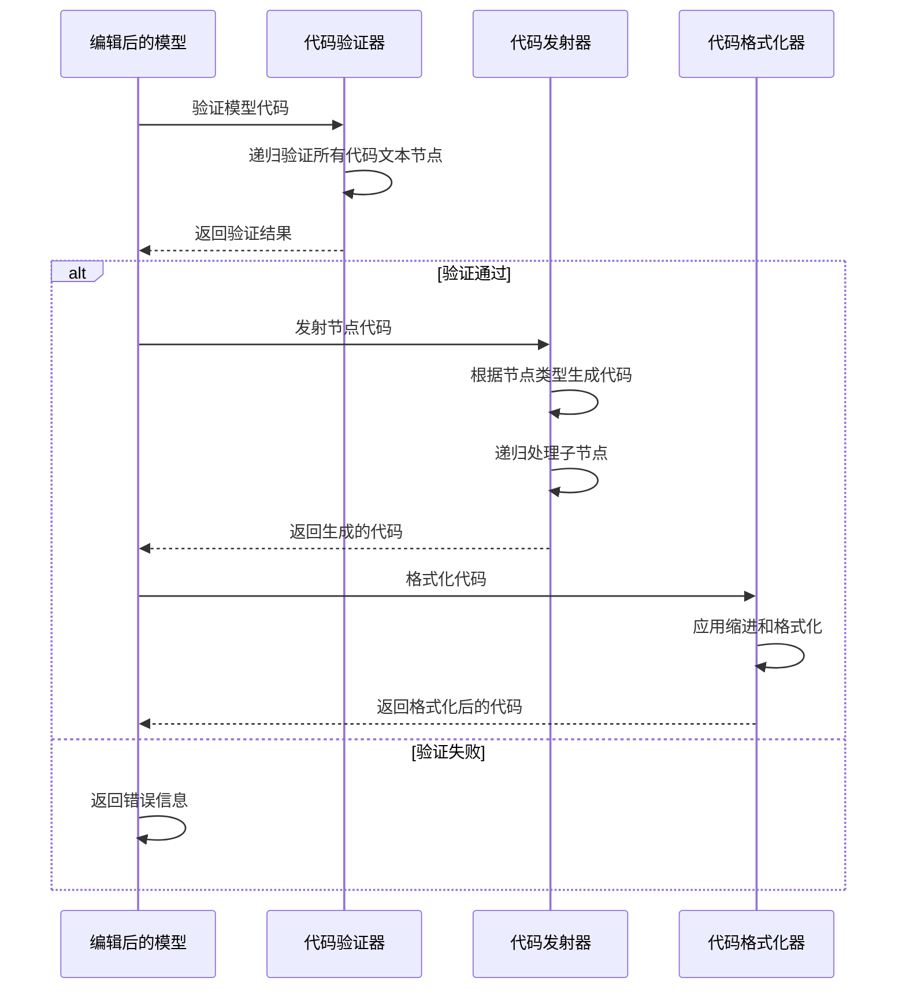
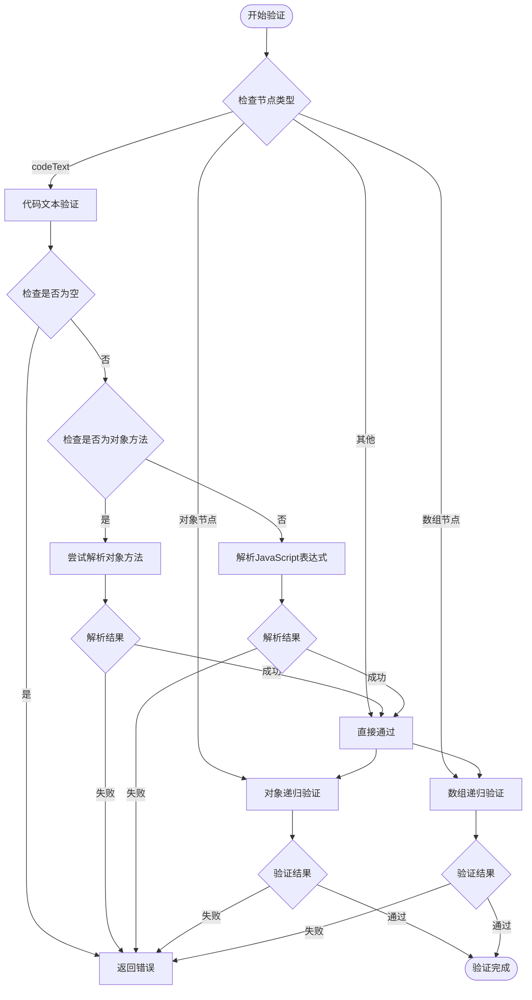
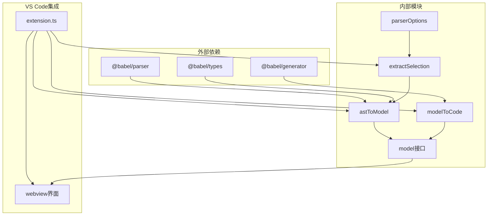
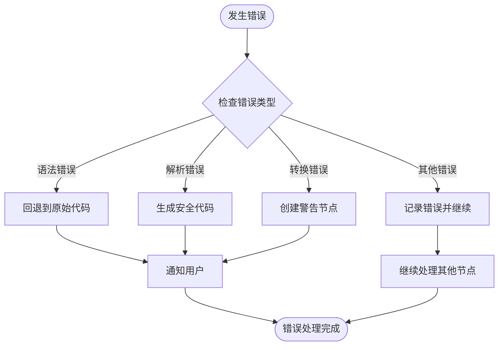

# AST 到模型转换技术文档

<cite>
**本文档中引用的文件**
- [toModel.ts](file://src/parser/toModel.ts)
- [model.ts](file://src/model.ts)
- [fromModel.ts](file://src/parser/fromModel.ts)
- [extractSelection.ts](file://src/parser/extractSelection.ts)
- [parserOptions.ts](file://src/parser/parserOptions.ts)
- [extension.ts](file://src/extension.ts)
</cite>

## 目录
1. [简介](#简介)
2. [项目结构概述](#项目结构概述)
3. [核心组件分析](#核心组件分析)
4. [架构概览](#架构概览)
5. [详细组件分析](#详细组件分析)
6. [依赖关系分析](#依赖关系分析)
7. [性能考虑](#性能考虑)
8. [故障排除指南](#故障排除指南)
9. [结论](#结论)

## 简介

JSONOKOK 是一个 VS Code 扩展，提供 JavaScript JSON 数据字面量的嵌套表格编辑器。本文档专注于其 AST 到中间模型转换模块，详细解释如何将 Babel AST 节点转换为中间模型 JsonNode 的过程。

该转换模块是整个 JSONOKOK 系统的核心，负责：
- 将 Babel AST 节点转换为可编辑的中间模型
- 维护原始源代码信息以便后续写回
- 处理各种 JavaScript 表达式类型
- 提供类型安全的转换机制

## 项目结构概述

JSONOKOK 项目采用模块化设计，主要包含以下关键目录和文件：



**图表来源**
- [toModel.ts:1-230](file://src/parser/toModel.ts#L1-L230)
- [model.ts:1-103](file://src/model.ts#L1-L103)
- [extension.ts:1-600](file://src/extension.ts#L1-L600)

**章节来源**
- [toModel.ts:1-230](file://src/parser/toModel.ts#L1-L230)
- [model.ts:1-103](file://src/model.ts#L1-L103)
- [extension.ts:1-600](file://src/extension.ts#L1-L600)

## 核心组件分析

### JsonNode 数据结构设计

JsonNode 是 JSONOKOK 的核心数据模型，设计用于表示可编辑的 JSON 值：

```mermaid
classDiagram
class JsonNode {
+JsonNodeKind kind
+any value
+string raw
+string originalRaw
+SourceKind sourceKind
+boolean editable
+WriteMode writeMode
+string warning
+Record~string, JsonNode~ children
+JsonNode[] items
}
class JsonNodeKind {
<<enumeration>>
"object"
"array"
"string"
"number"
"boolean"
"null"
"codeText"
}
class SourceKind {
<<enumeration>>
"json"
"code"
"objectMethod"
"spread"
}
class WriteMode {
<<enumeration>>
"json"
"code"
}
JsonNode --> JsonNodeKind
JsonNode --> SourceKind
JsonNode --> WriteMode
```

**图表来源**
- [model.ts:6-34](file://src/model.ts#L6-L34)

JsonNode 的设计特点：
- **类型安全**：通过枚举类型确保节点类型的正确性
- **元数据保留**：保留原始源代码信息用于写回操作
- **编辑控制**：通过 `editable` 和 `writeMode` 控制编辑行为
- **层级结构**：支持嵌套的对象和数组结构

**章节来源**
- [model.ts:6-34](file://src/model.ts#L6-L34)

## 架构概览

JSONOKOK 的 AST 到模型转换遵循以下架构模式：



**图表来源**
- [extension.ts:46-378](file://src/extension.ts#L46-L378)
- [extractSelection.ts:34-101](file://src/parser/extractSelection.ts#L34-L101)
- [toModel.ts:10-90](file://src/parser/toModel.ts#L10-L90)

## 详细组件分析

### AST 到模型转换器 (astToModel)

astToModel 函数是转换系统的核心，负责将 Babel AST 节点转换为 JsonNode：



**图表来源**
- [toModel.ts:10-90](file://src/parser/toModel.ts#L10-L90)

#### 对象表达式处理 (astObjectToModel)

对象表达式的处理是最复杂的部分，需要处理多种属性类型：



**图表来源**
- [toModel.ts:92-158](file://src/parser/toModel.ts#L92-L158)

#### 数组表达式处理 (astArrayToModel)

数组表达式的处理相对简单，但需要处理数组洞和展开元素：



**图表来源**
- [toModel.ts:160-209](file://src/parser/toModel.ts#L160-L209)

**章节来源**
- [toModel.ts:10-230](file://src/parser/toModel.ts#L10-L230)

### 模型到代码生成器 (modelToCode)

模型到代码生成器负责将编辑后的 JsonNode 转换回 JavaScript 源代码：



**图表来源**
- [fromModel.ts:20-57](file://src/parser/fromModel.ts#L20-L57)

**章节来源**
- [fromModel.ts:1-305](file://src/parser/fromModel.ts#L1-L305)

### 代码验证机制

代码验证系统确保转换后的代码保持语法有效性：



**图表来源**
- [fromModel.ts:67-90](file://src/parser/fromModel.ts#L67-L90)
- [fromModel.ts:92-117](file://src/parser/fromModel.ts#L92-L117)

**章节来源**
- [fromModel.ts:67-117](file://src/parser/fromModel.ts#L67-L117)

## 依赖关系分析

JSONOKOK 的 AST 到模型转换模块具有清晰的依赖关系：



**图表来源**
- [toModel.ts:6-8](file://src/parser/toModel.ts#L6-L8)
- [fromModel.ts:6-8](file://src/parser/fromModel.ts#L6-L8)
- [extension.ts:8-15](file://src/extension.ts#L8-L15)

**章节来源**
- [toModel.ts:6-8](file://src/parser/toModel.ts#L6-L8)
- [fromModel.ts:6-8](file://src/parser/fromModel.ts#L6-L8)
- [extension.ts:8-15](file://src/extension.ts#L8-L15)

## 性能考虑

### 内存优化策略

1. **延迟加载**：只在需要时转换子节点
2. **原始代码缓存**：保留原始源代码引用避免重复解析
3. **对象池模式**：重用 JsonNode 实例减少内存分配

### 时间复杂度分析

- **AST 到模型转换**：O(n)，其中 n 是 AST 节点数量
- **模型到代码生成**：O(m)，其中 m 是模型节点数量
- **代码验证**：O(k)，其中 k 是代码文本节点数量

### 错误恢复机制

系统实现了多层次的错误恢复：



## 故障排除指南

### 常见问题及解决方案

1. **转换失败**：检查输入的 JavaScript 代码是否符合语法规范
2. **模型验证失败**：确认所有 codeText 节点包含有效的 JavaScript 代码
3. **写回失败**：验证文档是否被其他用户修改过

### 调试技巧

- 使用 `originalRaw` 属性查看原始源代码
- 检查 `sourceKind` 属性了解节点的来源类型
- 利用 `warning` 属性获取转换过程中的警告信息

**章节来源**
- [toModel.ts:77-90](file://src/parser/toModel.ts#L77-L90)
- [fromModel.ts:24-57](file://src/parser/fromModel.ts#L24-L57)

## 结论

JSONOKOK 的 AST 到模型转换模块展现了优秀的软件工程实践：

1. **模块化设计**：清晰的职责分离和接口定义
2. **类型安全**：通过 TypeScript 枚举和接口确保运行时安全
3. **扩展性**：支持多种 JavaScript 表达式类型
4. **性能优化**：高效的递归处理和错误恢复机制
5. **用户体验**：无缝的 VS Code 集成和直观的编辑界面

该模块为 JSONOKOK 提供了坚实的基础，使其能够处理复杂的 JavaScript JSON 数据结构，同时保持良好的性能和可靠性。