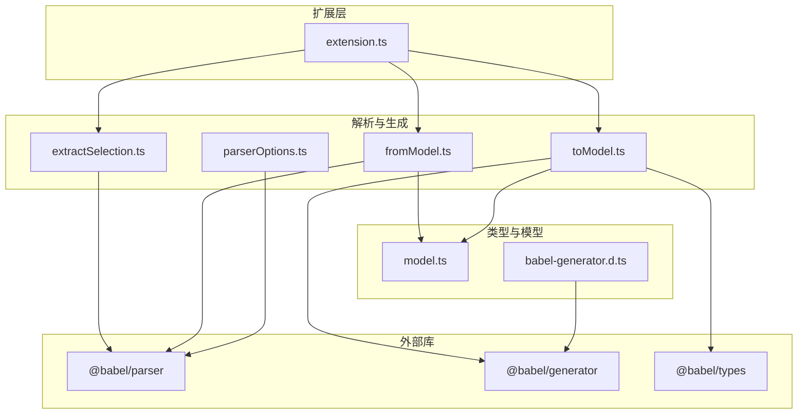
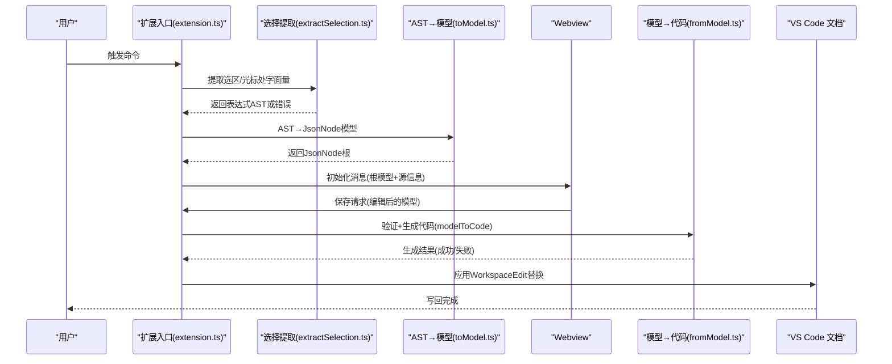
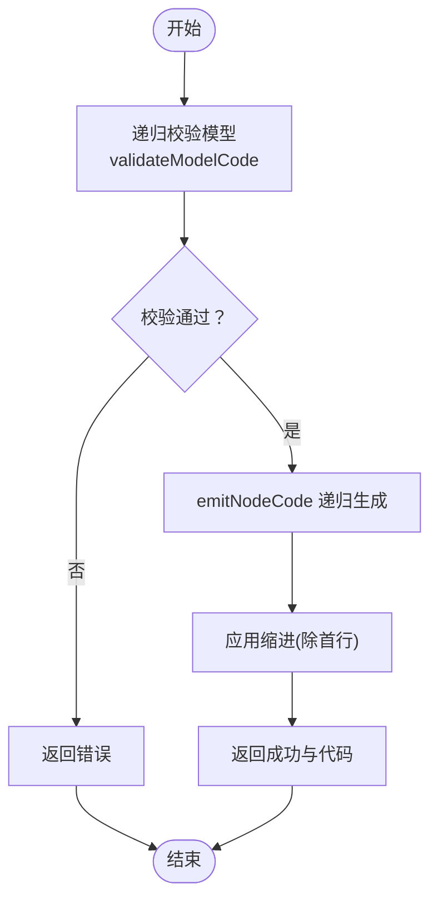
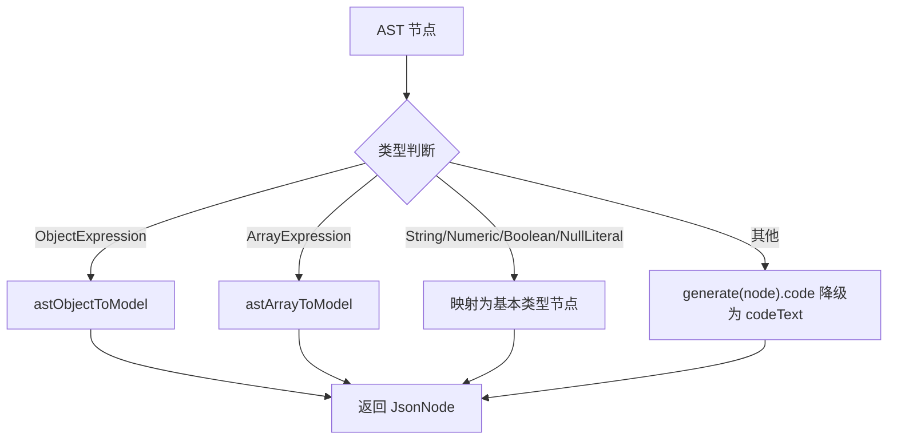
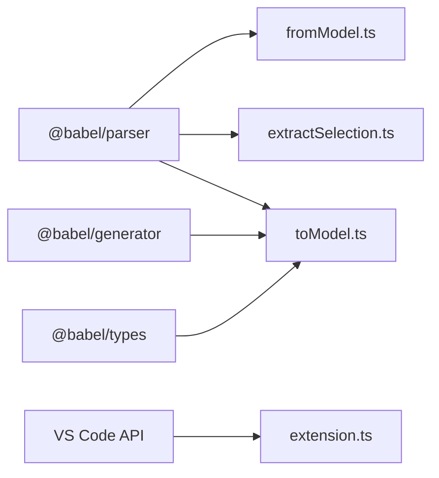

# 代码生成模块

<cite>
**本文引用的文件**
- [src/model.ts](file://src/model.ts)
- [src/parser/fromModel.ts](file://src/parser/fromModel.ts)
- [src/parser/toModel.ts](file://src/parser/toModel.ts)
- [src/parser/extractSelection.ts](file://src/parser/extractSelection.ts)
- [src/parser/parserOptions.ts](file://src/parser/parserOptions.ts)
- [src/extension.ts](file://src/extension.ts)
- [src/types/babel-generator.d.ts](file://src/types/babel-generator.d.ts)
- [package.json](file://package.json)
</cite>

## 目录
1. [简介](#简介)
2. [项目结构](#项目结构)
3. [核心组件](#核心组件)
4. [架构总览](#架构总览)
5. [详细组件分析](#详细组件分析)
6. [依赖分析](#依赖分析)
7. [性能考虑](#性能考虑)
8. [故障排查指南](#故障排查指南)
9. [结论](#结论)

## 简介
本文件聚焦于 JSONOKOK 的“代码生成模块”，系统性阐述如何将中间模型 JsonNode 转换回 JavaScript 源代码。内容涵盖：
- 使用 @babel/generator 的方式（用于 AST 到代码的回退生成）
- 从 JsonNode 到源码的递归生成策略（对象属性、数组元素、基本类型、特殊表达式）
- 语法验证机制（可解析性检查与错误处理）
- 缩进与换行管理、代码风格保持
- 性能优化（增量更新与缓存思路）、差异检测与最小化修改原则

## 项目结构
与代码生成直接相关的核心文件如下：
- 中间模型定义：src/model.ts
- 代码生成实现：src/parser/fromModel.ts
- AST 到模型转换（含 @babel/generator 使用）：src/parser/toModel.ts
- 选择提取与结构定位：src/parser/extractSelection.ts
- 公共解析选项：src/parser/parserOptions.ts
- 扩展入口与消息交互：src/extension.ts
- @babel/generator 类型声明：src/types/babel-generator.d.ts
- 依赖声明：package.json

图表来源
- [src/extension.ts:1-600](file://src/extension.ts#L1-L600)
- [src/parser/extractSelection.ts:1-385](file://src/parser/extractSelection.ts#L1-L385)
- [src/parser/toModel.ts:1-230](file://src/parser/toModel.ts#L1-L230)
- [src/parser/fromModel.ts:1-305](file://src/parser/fromModel.ts#L1-L305)
- [src/parser/parserOptions.ts:1-36](file://src/parser/parserOptions.ts#L1-L36)
- [src/model.ts:1-103](file://src/model.ts#L1-L103)
- [src/types/babel-generator.d.ts:1-28](file://src/types/babel-generator.d.ts#L1-L28)
- [package.json:77-91](file://package.json#L77-L91)

章节来源
- [src/extension.ts:1-600](file://src/extension.ts#L1-L600)
- [src/parser/extractSelection.ts:1-385](file://src/parser/extractSelection.ts#L1-L385)
- [src/parser/toModel.ts:1-230](file://src/parser/toModel.ts#L1-L230)
- [src/parser/fromModel.ts:1-305](file://src/parser/fromModel.ts#L1-L305)
- [src/parser/parserOptions.ts:1-36](file://src/parser/parserOptions.ts#L1-L36)
- [src/model.ts:1-103](file://src/model.ts#L1-L103)
- [src/types/babel-generator.d.ts:1-28](file://src/types/babel-generator.d.ts#L1-L28)
- [package.json:77-91](file://package.json#L77-L91)

## 核心组件
- JsonNode 中间模型：统一描述对象、数组、字符串、数字、布尔、null、以及“代码文本”等节点类型，并携带原始代码片段、来源类别、是否可编辑、写回模式等元信息。
- 代码生成器（fromModel）：负责将 JsonNode 递归转为 JavaScript 源码字符串，内置语法校验与缩进控制。
- AST 到模型转换器（toModel）：将 Babel AST 节点映射到 JsonNode，对非标准 JSON 值使用 @babel/generator 回退生成代码文本。
- 选择提取器（extractSelection）：从用户选区或光标位置提取对象/数组字面量，作为生成流程的输入。
- 解析选项（parserOptions）：统一 @babel/parser 的插件与解析参数。

章节来源
- [src/model.ts:6-34](file://src/model.ts#L6-L34)
- [src/parser/fromModel.ts:20-57](file://src/parser/fromModel.ts#L20-L57)
- [src/parser/toModel.ts:10-90](file://src/parser/toModel.ts#L10-L90)
- [src/parser/extractSelection.ts:34-101](file://src/parser/extractSelection.ts#L34-L101)
- [src/parser/parserOptions.ts:20-35](file://src/parser/parserOptions.ts#L20-L35)

## 架构总览
下图展示从用户触发到最终写回编辑器的端到端流程，重点标注代码生成与验证环节：

图表来源
- [src/extension.ts:420-490](file://src/extension.ts#L420-L490)
- [src/parser/extractSelection.ts:34-101](file://src/parser/extractSelection.ts#L34-L101)
- [src/parser/toModel.ts:10-90](file://src/parser/toModel.ts#L10-L90)
- [src/parser/fromModel.ts:20-57](file://src/parser/fromModel.ts#L20-L57)

## 详细组件分析

### 组件一：模型到代码生成（fromModel）
职责与流程
- 输入：JsonNode 根节点、基础缩进字符串
- 输出：GenerationResult（成功标志、生成代码或错误信息）
- 关键步骤：
  - 递归校验所有 codeText 节点的 JavaScript 可解析性
  - 递归生成各节点对应的代码片段
  - 应用缩进（除首行外逐行加缩进）

节点生成策略
- 基本类型：字符串、数字、布尔、null 直接序列化；数字对 NaN/Infinity 做兜底
- 对象：遍历 children，按属性名格式化键（标识符则原样，否则加引号），处理对象方法与展开语法的特殊分支
- 数组：遍历 items，逐项生成并换行分隔
- 代码文本：优先使用原始 raw，若为多行则进行缩进对齐；对对象方法与展开语法做专门处理

缩进与换行
- 通过层级 level 与 baseIndent 计算当前缩进
- 多行代码块统一缩进，首行不加缩进
- 属性值多行时，采用“属性前缀 + 第一行 + 后续行缩进”的布局

语法验证
- 对 codeText 节点：
  - 空白检查
  - 若疑似对象方法，尝试包裹为对象字面量解析
  - 否则以表达式解析，捕获异常即判定无效
- 递归验证整棵模型树

错误处理
- 任何一步抛错均返回失败与错误信息
- 生成阶段失败与解析阶段失败分别处理

图表来源
- [src/parser/fromModel.ts:20-57](file://src/parser/fromModel.ts#L20-L57)
- [src/parser/fromModel.ts:67-90](file://src/parser/fromModel.ts#L67-L90)
- [src/parser/fromModel.ts:119-142](file://src/parser/fromModel.ts#L119-L142)
- [src/parser/fromModel.ts:144-180](file://src/parser/fromModel.ts#L144-L180)
- [src/parser/fromModel.ts:194-225](file://src/parser/fromModel.ts#L194-L225)
- [src/parser/fromModel.ts:227-245](file://src/parser/fromModel.ts#L227-L245)

章节来源
- [src/parser/fromModel.ts:20-57](file://src/parser/fromModel.ts#L20-L57)
- [src/parser/fromModel.ts:67-90](file://src/parser/fromModel.ts#L67-L90)
- [src/parser/fromModel.ts:119-142](file://src/parser/fromModel.ts#L119-L142)
- [src/parser/fromModel.ts:144-180](file://src/parser/fromModel.ts#L144-L180)
- [src/parser/fromModel.ts:194-225](file://src/parser/fromModel.ts#L194-L225)
- [src/parser/fromModel.ts:227-245](file://src/parser/fromModel.ts#L227-L245)
- [src/parser/fromModel.ts:251-275](file://src/parser/fromModel.ts#L251-L275)
- [src/parser/fromModel.ts:277-300](file://src/parser/fromModel.ts#L277-L300)
- [src/parser/fromModel.ts:302-304](file://src/parser/fromModel.ts#L302-L304)

### 组件二：AST 到模型转换（toModel）与 @babel/generator 使用
职责与流程
- 输入：Babel AST 节点与原始源码片段
- 输出：JsonNode 中间模型
- 关键点：
  - 对象/数组/字面量类型直接映射为对应 JsonNode
  - 非标准 JSON 值（函数、日期、Symbol、调用、标识符等）统一降级为“代码文本”节点
  - 代码文本的 raw 来源优先使用原始片段，否则回退到 @babel/generator 生成

@babel/generator 的使用
- 在降级路径中调用 generate(node).code 获取代码字符串
- 该字符串作为 codeText 节点的 value/raw，供后续 fromModel 生成时直接复用

图表来源
- [src/parser/toModel.ts:10-90](file://src/parser/toModel.ts#L10-L90)
- [src/parser/toModel.ts:92-158](file://src/parser/toModel.ts#L92-L158)
- [src/parser/toModel.ts:160-209](file://src/parser/toModel.ts#L160-L209)
- [src/parser/toModel.ts:211-230](file://src/parser/toModel.ts#L211-L230)
- [src/types/babel-generator.d.ts:13-24](file://src/types/babel-generator.d.ts#L13-L24)

章节来源
- [src/parser/toModel.ts:10-90](file://src/parser/toModel.ts#L10-L90)
- [src/parser/toModel.ts:92-158](file://src/parser/toModel.ts#L92-L158)
- [src/parser/toModel.ts:160-209](file://src/parser/toModel.ts#L160-L209)
- [src/parser/toModel.ts:211-230](file://src/parser/toModel.ts#L211-L230)
- [src/types/babel-generator.d.ts:13-24](file://src/types/babel-generator.d.ts#L13-L24)

### 组件三：选择提取与结构定位（extractSelection）
职责与流程
- 从用户选区或光标位置提取对象/数组字面量
- 支持多种场景：纯字面量、变量声明初始化、文档级扫描、括号匹配回退
- 返回表达式 AST 与起止偏移，供 toModel 与 fromModel 使用

章节来源
- [src/parser/extractSelection.ts:34-101](file://src/parser/extractSelection.ts#L34-L101)
- [src/parser/extractSelection.ts:108-229](file://src/parser/extractSelection.ts#L108-L229)
- [src/parser/extractSelection.ts:237-343](file://src/parser/extractSelection.ts#L237-L343)

### 组件四：公共解析选项（parserOptions）
- 统一 @babel/parser 的插件集合与解析参数
- 表达式解析与完整程序解析共享同一套选项

章节来源
- [src/parser/parserOptions.ts:3-18](file://src/parser/parserOptions.ts#L3-L18)
- [src/parser/parserOptions.ts:20-35](file://src/parser/parserOptions.ts#L20-L35)

### 组件五：扩展入口与消息循环（extension）
- 接收来自 Webview 的保存请求
- 在写回前执行模型校验与代码生成
- 使用 WorkspaceEdit 将生成代码写回到文档指定范围

章节来源
- [src/extension.ts:420-490](file://src/extension.ts#L420-L490)
- [src/extension.ts:494-507](file://src/extension.ts#L494-L507)

## 依赖分析
- @babel/parser：用于表达式与程序解析、对象方法识别、括号匹配回退
- @babel/generator：用于非标准 JSON 值的代码回退生成
- @babel/types：类型判断辅助（如对象属性、方法、展开等）
- VS Code API：工作区编辑、文档版本校验、消息传递

图表来源
- [src/parser/extractSelection.ts:6-11](file://src/parser/extractSelection.ts#L6-L11)
- [src/parser/toModel.ts:6-8](file://src/parser/toModel.ts#L6-L8)
- [src/parser/fromModel.ts:6-8](file://src/parser/fromModel.ts#L6-L8)
- [src/extension.ts:6-15](file://src/extension.ts#L6-L15)
- [package.json:77-91](file://package.json#L77-L91)

章节来源
- [package.json:77-91](file://package.json#L77-L91)
- [src/parser/extractSelection.ts:6-11](file://src/parser/extractSelection.ts#L6-L11)
- [src/parser/toModel.ts:6-8](file://src/parser/toModel.ts#L6-L8)
- [src/parser/fromModel.ts:6-8](file://src/parser/fromModel.ts#L6-L8)
- [src/extension.ts:6-15](file://src/extension.ts#L6-L15)

## 性能考虑
- 生成策略
  - 递归生成：时间复杂度 O(N)，N 为节点总数；空间复杂度与递归深度相关
  - 多行代码块缩进：逐行拼接，注意长文本的内存占用
- 缓存与增量
  - 当前实现未显式缓存生成结果；可在上层 UI 层引入“脏标记”与“增量更新”策略：仅对变更节点重算，其余沿用缓存
- 选择提取
  - 文档级扫描限制窗口大小（例如固定上限），避免超大文件导致性能问题
- 解析选项
  - 统一插件列表减少重复配置开销

章节来源
- [src/parser/extractSelection.ts:242-243](file://src/parser/extractSelection.ts#L242-L243)
- [src/parser/fromModel.ts:119-142](file://src/parser/fromModel.ts#L119-L142)

## 故障排查指南
常见问题与定位
- 生成失败
  - 检查模型中是否存在非法 codeText 节点
  - 查看错误信息中的具体节点位置与类型
- 写回失败
  - 文档版本不一致：写回前会校验版本，若被修改需重新打开
  - WorkspaceEdit 应用失败：检查权限与编辑冲突
- 代码风格异常
  - 缩进与换行由生成器统一处理，若出现异常，检查传入的 baseIndent 是否正确

章节来源
- [src/parser/fromModel.ts:51-56](file://src/parser/fromModel.ts#L51-L56)
- [src/extension.ts:423-429](file://src/extension.ts#L423-L429)
- [src/extension.ts:481-486](file://src/extension.ts#L481-L486)

## 结论
- 代码生成模块以 JsonNode 为核心载体，结合 @babel/generator 的回退能力，实现了对标准 JSON 与 JavaScript 表达式的统一输出。
- 通过严格的语法验证与缩进控制，保证生成代码的可解析性与风格一致性。
- 在工程实践中，建议引入增量更新与缓存机制以提升大规模数据的编辑体验，并持续完善对对象方法、展开语法等特殊表达式的处理策略。