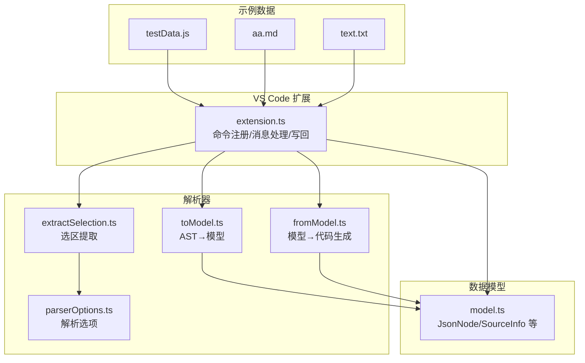
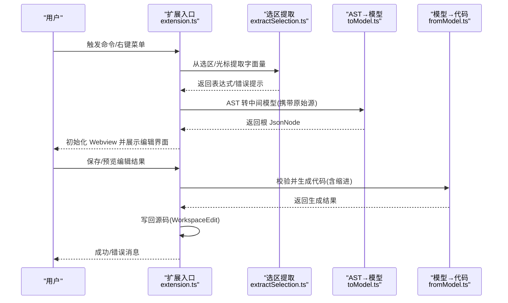
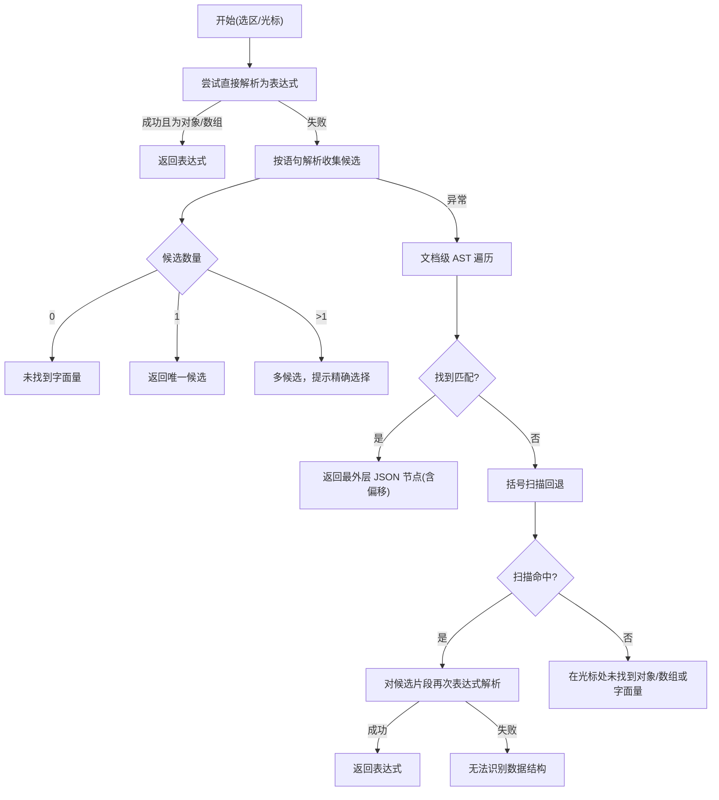
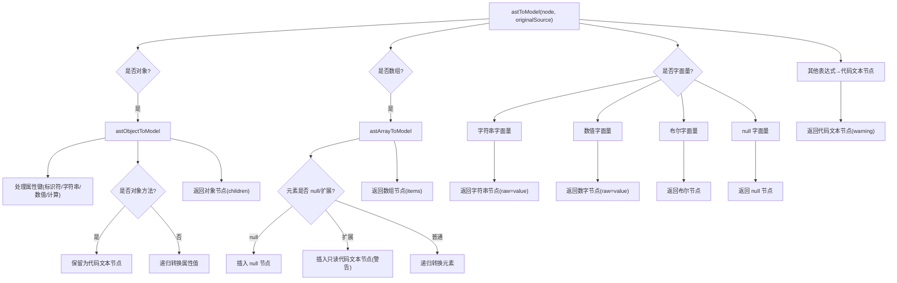
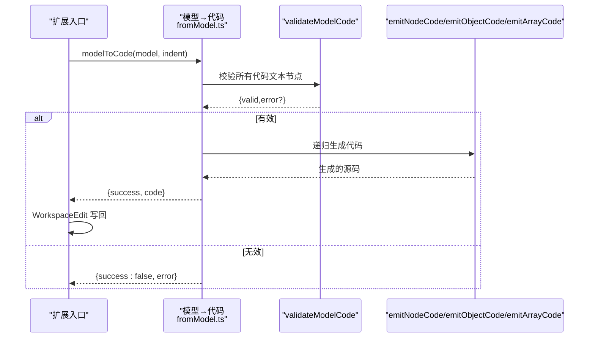
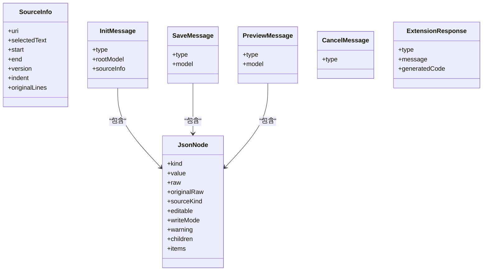
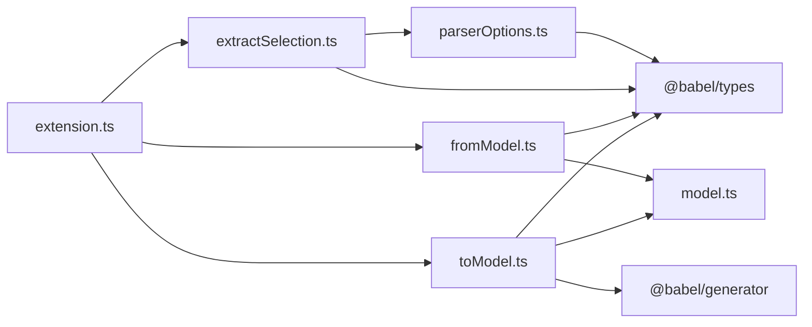

# 解析器架构

<cite>
**本文引用的文件**   
- [src/extension.ts](file://src/extension.ts)
- [src/model.ts](file://src/model.ts)
- [src/parser/extractSelection.ts](file://src/parser/extractSelection.ts)
- [src/parser/toModel.ts](file://src/parser/toModel.ts)
- [src/parser/fromModel.ts](file://src/parser/fromModel.ts)
- [src/parser/parserOptions.ts](file://src/parser/parserOptions.ts)
- [jsonDemo/testData.js](file://jsonDemo/testData.js)
- [jsonDemo/aa.md](file://jsonDemo/aa.md)
- [jsonDemo/text.txt](file://jsonDemo/text.txt)
- [package.json](file://package.json)
- [tsconfig.json](file://tsconfig.json)
- [todo.md](file://todo.md)
</cite>

## 目录
1. [引言](#引言)
2. [项目结构](#项目结构)
3. [核心组件](#核心组件)
4. [架构总览](#架构总览)
5. [详细组件分析](#详细组件分析)
6. [依赖关系分析](#依赖关系分析)
7. [性能考虑](#性能考虑)
8. [故障排查指南](#故障排查指南)
9. [结论](#结论)
10. [附录](#附录)

## 引言
本文件系统性阐述 JSONOKOK 的三层解析架构：选区提取层、AST 转模型层与代码生成层。文档面向不同技术背景读者，既提供高层概览，也给出代码级细节与可视化图示，帮助开发者理解并扩展该解析器。

## 项目结构
- 扩展入口与集成逻辑位于扩展文件中，负责从 VS Code 编辑器提取选区/光标上下文、调用解析器、与 Webview 通信以及最终写回源码。
- 解析器由四个模块组成：选区提取、AST 转模型、模型到代码生成、解析选项配置。
- 数据模型定义于统一的中间模型文件，用于承载 JSON 值与代码文本节点，并携带原始源信息以便回写。
- 示例数据位于 demo 目录，涵盖 JavaScript/TypeScript、Markdown 代码块与纯文本括号场景，便于验证解析策略。

图表来源
- [src/extension.ts:46-378](file://src/extension.ts#L46-L378)
- [src/parser/extractSelection.ts:34-101](file://src/parser/extractSelection.ts#L34-L101)
- [src/parser/toModel.ts:10-90](file://src/parser/toModel.ts#L10-L90)
- [src/parser/fromModel.ts:20-57](file://src/parser/fromModel.ts#L20-L57)
- [src/parser/parserOptions.ts:20-35](file://src/parser/parserOptions.ts#L20-L35)
- [src/model.ts:15-54](file://src/model.ts#L15-L54)
- [jsonDemo/testData.js:1-104](file://jsonDemo/testData.js#L1-L104)
- [jsonDemo/aa.md:1-30](file://jsonDemo/aa.md#L1-L30)
- [jsonDemo/text.txt:1-15](file://jsonDemo/text.txt#L1-L15)

章节来源
- [src/extension.ts:46-378](file://src/extension.ts#L46-L378)
- [src/model.ts:15-54](file://src/model.ts#L15-L54)
- [src/parser/extractSelection.ts:34-101](file://src/parser/extractSelection.ts#L34-L101)
- [src/parser/toModel.ts:10-90](file://src/parser/toModel.ts#L10-L90)
- [src/parser/fromModel.ts:20-57](file://src/parser/fromModel.ts#L20-L57)
- [src/parser/parserOptions.ts:20-35](file://src/parser/parserOptions.ts#L20-L35)
- [jsonDemo/testData.js:1-104](file://jsonDemo/testData.js#L1-L104)
- [jsonDemo/aa.md:1-30](file://jsonDemo/aa.md#L1-L30)
- [jsonDemo/text.txt:1-15](file://jsonDemo/text.txt#L1-L15)

## 核心组件
- 选区提取模块：从用户选区或光标位置提取对象/数组字面量，支持直接表达式、变量初始化、文档级包裹查找与括号扫描回退策略。
- AST 转模型模块：将 Babel AST 节点映射为中间 JsonNode，处理对象/数组、基本类型、代码文本节点与警告标记。
- 代码生成模块：校验模型合法性，将中间模型回写为带缩进的 JavaScript/JSON 源码，支持对象方法与多行代码文本的格式化。
- 解析选项模块：集中管理 Babel 解析器插件与通用选项，确保对 TS/JSX/装饰器等特性的一致支持。
- 中间模型：统一的数据结构，承载 kind/value/raw/originalRaw/sourceKind/editable/writeMode/warning/children/items 等字段。

章节来源
- [src/parser/extractSelection.ts:34-101](file://src/parser/extractSelection.ts#L34-L101)
- [src/parser/toModel.ts:10-90](file://src/parser/toModel.ts#L10-L90)
- [src/parser/fromModel.ts:20-57](file://src/parser/fromModel.ts#L20-L57)
- [src/parser/parserOptions.ts:20-35](file://src/parser/parserOptions.ts#L20-L35)
- [src/model.ts:15-54](file://src/model.ts#L15-L54)

## 架构总览
三层架构自下而上职责清晰：
- 选区提取层：面向“输入”——从编辑器文本中精准定位 JSON/JS 字面量，兼容多种文件类型与边界情况。
- AST 转模型层：面向“转换”——将 AST 映射为可编辑的中间模型，保留原始源码片段以便安全回写。
- 代码生成层：面向“输出”——将编辑后的中间模型生成合法的源码，进行语法校验、格式化与缩进处理。

图表来源
- [src/extension.ts:46-378](file://src/extension.ts#L46-L378)
- [src/parser/extractSelection.ts:34-101](file://src/parser/extractSelection.ts#L34-L101)
- [src/parser/toModel.ts:10-90](file://src/parser/toModel.ts#L10-L90)
- [src/parser/fromModel.ts:20-57](file://src/parser/fromModel.ts#L20-L57)

## 详细组件分析

### 选区提取层
- 设计目标：在不同文件类型中稳定提取对象/数组字面量，尽可能容忍语法错误与复杂上下文。
- 关键策略：
  - 直接表达式解析：优先尝试将选区作为表达式解析，若命中对象/数组字面量则直接返回。
  - 语句级解析：若直接解析失败，则按语句解析，收集所有对象/数组字面量，要求唯一性；多候选时提示用户精确选择。
  - 文档级包裹查找：在整篇文档中基于 AST 遍历，优先变量初始化器，再取最外层 JSON 类型节点；记录起止偏移以便回写。
  - 括号扫描回退：当全文件解析失败或不可行时，以光标为中心向两侧扫描匹配括号，限定窗口大小，跳过字符串与注释，最后对候选片段再次尝试表达式解析。
- 文件类型适配：
  - JavaScript/TypeScript：启用 JSX、TS、装饰器、可选链、空值合并、BigInt、顶层 await 等插件，确保广泛兼容。
  - Markdown：在围栏代码块内时，优先提取内部代码片段；光标在块内时，优先块内结构提取。
  - 纯文本：通过括号扫描实现结构提取，避免全文件解析开销。
- 错误与提示：对空选区、未找到字面量、多候选、语法错误等情况提供明确错误与提示信息，引导用户修正。

图表来源
- [src/parser/extractSelection.ts:34-101](file://src/parser/extractSelection.ts#L34-L101)
- [src/parser/extractSelection.ts:108-229](file://src/parser/extractSelection.ts#L108-L229)
- [src/parser/extractSelection.ts:237-343](file://src/parser/extractSelection.ts#L237-L343)

章节来源
- [src/parser/extractSelection.ts:34-101](file://src/parser/extractSelection.ts#L34-L101)
- [src/parser/extractSelection.ts:108-229](file://src/parser/extractSelection.ts#L108-L229)
- [src/parser/extractSelection.ts:237-343](file://src/parser/extractSelection.ts#L237-L343)
- [src/parser/parserOptions.ts:20-35](file://src/parser/parserOptions.ts#L20-L35)
- [src/extension.ts:66-108](file://src/extension.ts#L66-L108)
- [src/extension.ts:164-251](file://src/extension.ts#L164-L251)

### AST 转模型层
- 设计目标：将 Babel AST 节点映射为中间 JsonNode，保留原始源码片段，区分 JSON 与代码文本两类节点，标注可编辑性与写回模式。
- 数据类型映射：
  - 对象/数组：递归转换属性/元素，处理计算属性键、对象方法、扩展运算符等特殊情况。
  - 基本类型：字符串、数字、布尔、null，优先使用原始 raw 片段，否则回退到生成。
  - 其他表达式：函数、日期、符号、标识符、调用等，统一作为代码文本节点保留，标记 sourceKind 与 writeMode。
- 嵌套结构处理：对象属性名支持标识符、字符串字面量、数值字面量与计算属性；数组支持稀疏项与扩展运算符占位。
- 特殊表达式支持：对象方法保留为代码文本节点；扩展运算符以只读代码文本节点呈现并提示不支持编辑。
- 原始源码保留：通过 getNodeRaw 从原始文本截取节点范围，确保回写时尽量保持原格式。

图表来源
- [src/parser/toModel.ts:10-90](file://src/parser/toModel.ts#L10-L90)
- [src/parser/toModel.ts:92-158](file://src/parser/toModel.ts#L92-L158)
- [src/parser/toModel.ts:160-209](file://src/parser/toModel.ts#L160-L209)
- [src/parser/toModel.ts:211-229](file://src/parser/toModel.ts#L211-L229)

章节来源
- [src/parser/toModel.ts:10-90](file://src/parser/toModel.ts#L10-L90)
- [src/parser/toModel.ts:92-158](file://src/parser/toModel.ts#L92-L158)
- [src/parser/toModel.ts:160-209](file://src/parser/toModel.ts#L160-L209)
- [src/parser/toModel.ts:211-229](file://src/parser/toModel.ts#L211-L229)

### 代码生成层
- 设计目标：将中间模型安全地回写为源码，保证语法有效、格式正确、缩进一致。
- 语法校验：
  - 递归校验所有代码文本节点，支持对象方法的特殊判断与通用表达式解析。
  - 对空代码文本、无效表达式、对象方法不合法等情况返回错误。
- 格式化与缩进：
  - 统一缩进策略，支持按层级生成缩进；多行代码文本与属性值采用一致缩进规则。
  - 对对象键进行标识符判定，非标识符键使用 JSON 字符串形式。
- 写回流程：
  - 生成完整代码后应用 WorkspaceEdit 替换选区范围，结合版本检查避免覆盖修改。
  - 支持预览与保存两种消息类型，分别返回生成结果或执行写回。

图表来源
- [src/parser/fromModel.ts:20-57](file://src/parser/fromModel.ts#L20-L57)
- [src/parser/fromModel.ts:67-90](file://src/parser/fromModel.ts#L67-L90)
- [src/parser/fromModel.ts:119-180](file://src/parser/fromModel.ts#L119-L180)
- [src/extension.ts:420-490](file://src/extension.ts#L420-L490)

章节来源
- [src/parser/fromModel.ts:20-57](file://src/parser/fromModel.ts#L20-L57)
- [src/parser/fromModel.ts:67-90](file://src/parser/fromModel.ts#L67-L90)
- [src/parser/fromModel.ts:119-180](file://src/parser/fromModel.ts#L119-L180)
- [src/parser/fromModel.ts:182-304](file://src/parser/fromModel.ts#L182-L304)
- [src/extension.ts:420-490](file://src/extension.ts#L420-L490)

### 中间模型与数据流
- JsonNode 定义了统一的数据结构，支持对象、数组、字符串、数字、布尔、null 与代码文本七种 kind。
- SourceInfo 记录选区元信息，包括 URI、选中文本、行列坐标、文档版本、缩进与原始行，用于写回的安全性与一致性。
- Webview 消息协议：InitMessage/SaveMessage/PreviewMessage/CancelMessage 与 ExtensionResponse，支撑编辑器与 Webview 的双向通信。

图表来源
- [src/model.ts:15-54](file://src/model.ts#L15-L54)
- [src/model.ts:59-103](file://src/model.ts#L59-L103)

章节来源
- [src/model.ts:15-54](file://src/model.ts#L15-L54)
- [src/model.ts:59-103](file://src/model.ts#L59-L103)

## 依赖关系分析
- 扩展入口依赖解析器模块与中间模型，负责编排流程、消息处理与写回。
- 解析器内部模块低耦合：选区提取仅依赖解析选项；AST 转模型依赖 Babel Types 与生成器；代码生成依赖 Babel Parser 与解析选项。
- 外部依赖：@babel/parser/@babel/types/@babel/generator，提供解析、类型判断与代码生成能力。
- 语言与插件：解析选项集中开启 JSX、TS、类属性/私有成员、装饰器、展开、可选链、空值合并、BigInt、顶层 await、导入属性等插件，提升兼容性。

图表来源
- [src/extension.ts:9-15](file://src/extension.ts#L9-L15)
- [src/parser/extractSelection.ts:6-11](file://src/parser/extractSelection.ts#L6-L11)
- [src/parser/toModel.ts:6-8](file://src/parser/toModel.ts#L6-L8)
- [src/parser/fromModel.ts:6-8](file://src/parser/fromModel.ts#L6-L8)
- [src/parser/parserOptions.ts:1-1](file://src/parser/parserOptions.ts#L1-L1)

章节来源
- [src/extension.ts:9-15](file://src/extension.ts#L9-L15)
- [src/parser/extractSelection.ts:6-11](file://src/parser/extractSelection.ts#L6-L11)
- [src/parser/toModel.ts:6-8](file://src/parser/toModel.ts#L6-L8)
- [src/parser/fromModel.ts:6-8](file://src/parser/fromModel.ts#L6-L8)
- [src/parser/parserOptions.ts:1-1](file://src/parser/parserOptions.ts#L1-L1)

## 性能考虑
- 选区提取层：
  - 文档级遍历与括号扫描均限制扫描窗口，避免超大文件导致的性能问题。
  - 优先变量初始化器与最外层节点，减少不必要的递归深度。
- AST 转模型层：
  - 使用原始源码片段截取，避免重复生成造成额外开销。
  - 对扩展运算符与对象方法采用占位/保留策略，降低后续处理复杂度。
- 代码生成层：
  - 递归生成时按层级拼接缩进，避免频繁字符串拼接。
  - 对多行代码文本采用统一缩进策略，减少格式化成本。
- 内存管理：
  - 严格控制中间模型规模，避免深拷贝与冗余副本。
  - 在写回前进行一次性校验，减少多次往返。
- 可扩展性建议：
  - 对超大 JSON 采用延迟加载策略（参见任务清单），分层渲染与交互，未加载节点以占位提示代替真实字符串。

章节来源
- [src/parser/extractSelection.ts:242-244](file://src/parser/extractSelection.ts#L242-L244)
- [src/parser/extractSelection.ts:189-214](file://src/parser/extractSelection.ts#L189-L214)
- [src/parser/toModel.ts:211-229](file://src/parser/toModel.ts#L211-L229)
- [src/parser/fromModel.ts:302-304](file://src/parser/fromModel.ts#L302-L304)
- [todo.md:3-6](file://todo.md#L3-L6)

## 故障排查指南
- 选区提取失败：
  - 空选区：检查用户是否选择了有效内容。
  - 多候选：提示用户精确选择一个对象/数组字面量。
  - 未找到字面量：确认选区包含 {...} 或 [...] 或其初始化语句。
  - 语法错误：确保选区为有效 JavaScript/TypeScript 表达式。
- AST 转模型异常：
  - 检查原始源码片段是否可被截取（start/end 范围有效）。
  - 确认 AST 节点类型与 Babel 版本兼容。
- 代码生成失败：
  - 校验所有代码文本节点是否为有效表达式或合法对象方法。
  - 检查缩进参数是否传入，确保生成代码格式正确。
- 写回冲突：
  - 若文档版本发生变化，写回会被拒绝；需重新打开编辑器。
  - 写回失败时检查 WorkspaceEdit 权限与编辑范围。

章节来源
- [src/parser/extractSelection.ts:37-100](file://src/parser/extractSelection.ts#L37-L100)
- [src/parser/fromModel.ts:24-56](file://src/parser/fromModel.ts#L24-L56)
- [src/extension.ts:423-490](file://src/extension.ts#L423-L490)

## 结论
JSONOKOK 的三层解析架构以“稳健提取—可靠转换—安全生成”为核心设计原则，兼顾多文件类型与复杂表达式的兼容性。通过中间模型与原始源码保留机制，实现了从编辑到回写的高保真流程。未来可在超大 JSON 场景引入分层加载与增量渲染，进一步提升性能与用户体验。

## 附录
- 示例数据用途：
  - JavaScript/TypeScript：验证对象/数组、函数、箭头函数、对象方法、BigInt、Symbol 等混合场景。
  - Markdown：验证围栏代码块内的结构提取与光标定位。
  - 纯文本：验证括号扫描与回退策略的有效性。
- 开发与构建：
  - TypeScript 编译配置严格，启用声明与 SourceMap，便于调试与发布。
  - VS Code 扩展配置包含激活事件、命令、菜单与国际化配置。

章节来源
- [jsonDemo/testData.js:1-104](file://jsonDemo/testData.js#L1-L104)
- [jsonDemo/aa.md:1-30](file://jsonDemo/aa.md#L1-L30)
- [jsonDemo/text.txt:1-15](file://jsonDemo/text.txt#L1-L15)
- [package.json:23-66](file://package.json#L23-L66)
- [tsconfig.json:1-25](file://tsconfig.json#L1-L25)