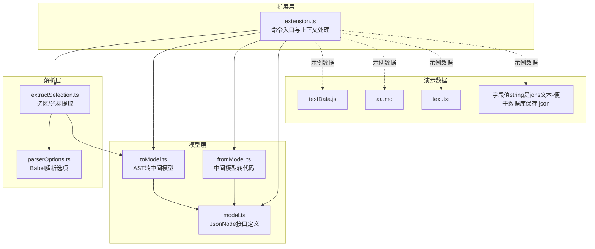
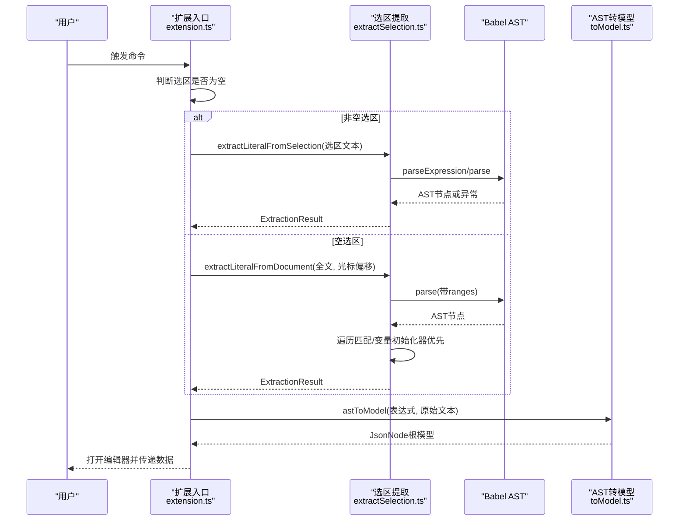
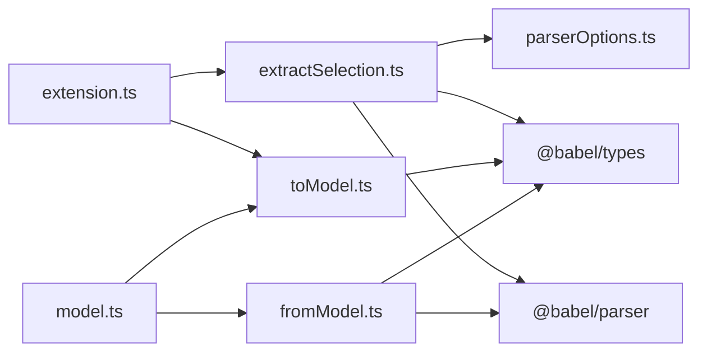

# 选区提取模块

<cite>
**本文引用的文件**
- [extractSelection.ts](file://src/parser/extractSelection.ts)
- [parserOptions.ts](file://src/parser/parserOptions.ts)
- [toModel.ts](file://src/parser/toModel.ts)
- [fromModel.ts](file://src/parser/fromModel.ts)
- [model.ts](file://src/model.ts)
- [extension.ts](file://src/extension.ts)
- [testData.js](file://jsonDemo/testData.js)
- [aa.md](file://jsonDemo/aa.md)
- [text.txt](file://jsonDemo/text.txt)
- [字段值string是jons文本-便于数据库保存.json](file://jsonDemo/字段值string是jons文本-便于数据库保存.json)
- [package.json](file://package.json)
</cite>

## 目录
1. [简介](#简介)
2. [项目结构](#项目结构)
3. [核心组件](#核心组件)
4. [架构总览](#架构总览)
5. [详细组件分析](#详细组件分析)
6. [依赖关系分析](#依赖关系分析)
7. [性能考量](#性能考量)
8. [故障排查指南](#故障排查指南)
9. [结论](#结论)
10. [附录](#附录)

## 简介
本文件聚焦于 JSONOKOK 的“选区提取模块”，系统性阐述其核心功能与实现细节：从用户选区或光标位置提取 JSON 对象/数组字面量。文档涵盖三大提取策略（直接表达式解析、语句解析、括号匹配回退）、多文件类型支持（JavaScript/TypeScript AST 解析、Markdown 代码块识别、纯文本括号匹配）、ExtractionResult 接口设计、光标位置提取算法、错误处理与性能优化策略，并通过实际示例文件加深理解。

## 项目结构
选区提取模块位于 src/parser/extractSelection.ts，围绕 Babel AST 进行解析与回退策略，配合扩展入口与中间模型转换共同完成从源码到可视化编辑器的数据流转。

图表来源
- [extension.ts:46-378](file://src/extension.ts#L46-L378)
- [extractSelection.ts:34-229](file://src/parser/extractSelection.ts#L34-L229)
- [parserOptions.ts:20-35](file://src/parser/parserOptions.ts#L20-L35)
- [toModel.ts:10-90](file://src/parser/toModel.ts#L10-L90)
- [fromModel.ts:20-57](file://src/parser/fromModel.ts#L20-L57)
- [model.ts:15-34](file://src/model.ts#L15-L34)

章节来源
- [extension.ts:46-378](file://src/extension.ts#L46-L378)
- [extractSelection.ts:34-229](file://src/parser/extractSelection.ts#L34-L229)
- [parserOptions.ts:20-35](file://src/parser/parserOptions.ts#L20-L35)
- [toModel.ts:10-90](file://src/parser/toModel.ts#L10-L90)
- [fromModel.ts:20-57](file://src/parser/fromModel.ts#L20-L57)
- [model.ts:15-34](file://src/model.ts#L15-L34)

## 核心组件
- ExtractionResult 接口：统一返回结构，包含成功标志、AST 表达式、错误信息与可选的起止偏移。
- extractLiteralFromSelection：基于选区文本的三阶段提取策略。
- extractLiteralFromDocument：基于光标位置的 AST 遍历与括号回退策略。
- findEnclosingLiteralByBraces：轻量括号扫描回退，适配非 JS/TS/Markdown 文件。
- 解析选项 getCommonParseOptions/getCommonExpressionParseOptions：统一 Babel 解析配置。
- 扩展入口 handleOpenSelection：根据语言环境与选区/光标情况调用相应提取函数。

章节来源
- [extractSelection.ts:13-22](file://src/parser/extractSelection.ts#L13-L22)
- [extractSelection.ts:34-101](file://src/parser/extractSelection.ts#L34-L101)
- [extractSelection.ts:108-229](file://src/parser/extractSelection.ts#L108-L229)
- [extractSelection.ts:237-343](file://src/parser/extractSelection.ts#L237-L343)
- [parserOptions.ts:20-35](file://src/parser/parserOptions.ts#L20-L35)
- [extension.ts:46-378](file://src/extension.ts#L46-L378)

## 架构总览
选区提取模块在扩展命令触发后，依据当前编辑器语言与选区状态选择合适的提取路径：
- 非空选区：优先尝试直接表达式解析；若失败则进行语句解析；仍失败则返回错误与提示。
- 空选区（仅光标）：在 JS/TS/Markdown 等语言中使用 AST 遍历定位最深 JSON 字面量；若失败则采用括号扫描回退策略。

图表来源
- [extension.ts:46-378](file://src/extension.ts#L46-L378)
- [extractSelection.ts:34-101](file://src/parser/extractSelection.ts#L34-L101)
- [extractSelection.ts:108-229](file://src/parser/extractSelection.ts#L108-L229)
- [toModel.ts:10-90](file://src/parser/toModel.ts#L10-L90)

## 详细组件分析

### ExtractionResult 接口设计
- 字段含义
  - success：布尔值，表示提取是否成功
  - expression：可选的 Babel AST 表达式节点（对象/数组/原始值等）
  - error：可选的错误信息
  - hint：可选的用户提示信息
  - start/end：可选的源文本偏移，用于后续写回定位
- 设计优点
  - 统一错误与成功返回形态，便于上层分支处理
  - 可选偏移支持精确写回，提升编辑体验
  - 支持多种表达式类型，便于后续模型转换

章节来源
- [extractSelection.ts:13-22](file://src/parser/extractSelection.ts#L13-L22)

### 选区提取策略：直接表达式解析（parseExpression）
- 目标：当选区恰好为对象/数组字面量时，直接解析并返回
- 处理流程
  - 去除空白后判断是否为空
  - 使用 parseExpression 解析
  - 若结果为对象/数组字面量，则返回成功
  - 否则进入下一轮尝试
- 错误处理：捕获解析异常并继续尝试

章节来源
- [extractSelection.ts:44-59](file://src/parser/extractSelection.ts#L44-L59)

### 选区提取策略：语句解析（parse）
- 目标：当选区包含变量声明或表达式语句时，提取其中的对象/数组字面量
- 处理流程
  - 使用 parse 获取 Program AST
  - 遍历 Program，收集所有对象/数组字面量
  - 单一候选：返回该字面量
  - 多个候选：返回错误与提示，引导用户精确选择
  - 无候选：返回错误与提示
  - 解析异常：返回错误与提示
- 关键点
  - 仅提取 JSON 字面量，不展开变量名或函数节点
  - 通过 extractLiteralsFromProgram 实现

章节来源
- [extractSelection.ts:61-95](file://src/parser/extractSelection.ts#L61-L95)
- [extractSelection.ts:355-384](file://src/parser/extractSelection.ts#L355-L384)

### 光标位置提取算法：AST 遍历与变量初始化器优先
- 目标：在光标处定位最深的 JSON 字面量，优先返回变量初始化器
- 处理流程
  - 使用 parse(带 ranges) 获取 AST
  - 遍历节点，收集包含光标的 JSON 类型节点（对象/数组/字符串/数字/布尔/null/模板）
  - 记录变量声明器（VariableDeclarator）的初始化器（initializer），若其为 JSON 类型且包含光标，则优先考虑
  - 若存在变量初始化器候选，按 start 偏移升序取最外层者
  - 否则在 JSON 类型候选中按 start 偏移升序取最外层
  - 若均未命中，执行括号扫描回退
- 性能与健壮性
  - 仅遍历 AST，避免全文件二次解析
  - 通过 ranges 字段快速判断节点范围

章节来源
- [extractSelection.ts:108-229](file://src/parser/extractSelection.ts#L108-L229)

### 括号匹配回退机制：findEnclosingLiteralByBraces
- 适用场景：非 JS/TS/Markdown 文件或 AST 解析失败时
- 处理流程
  - 限制左右扫描窗口（默认约 40KB），平衡准确性与性能
  - 从光标向左扫描，寻找可能的开括号（{ 或 [）
  - 使用栈匹配闭合括号，跳过字符串与注释
  - 匹配成功后截取候选文本，再次尝试 parseExpression 以确认为合法 JS 表达式
  - 返回成功并携带偏移
- 错误处理：若无匹配或二次解析失败，返回失败结果

章节来源
- [extractSelection.ts:237-343](file://src/parser/extractSelection.ts#L237-L343)

### 不同文件类型的 JSON 提取策略
- JavaScript/TypeScript
  - 使用 AST 解析（parseExpression/parse）与变量初始化器优先策略
  - 支持 JSX、TypeScript、装饰器、可选链、空合并、BigInt、顶层 await 等插件
- Markdown
  - 选区：若选区位于代码块内，仅提取代码块内部文本，再进行 AST 解析
  - 光标：若光标位于代码块内，提取代码块文本并进行 AST 解析；否则回退到全文 AST
- 纯文本/其他文件类型
  - 优先尝试 AST 解析；失败则使用括号扫描回退

章节来源
- [extension.ts:62-108](file://src/extension.ts#L62-L108)
- [extension.ts:164-251](file://src/extension.ts#L164-L251)
- [parserOptions.ts:3-18](file://src/parser/parserOptions.ts#L3-L18)

### 错误处理机制
- 选区为空：直接返回错误
- 选区解析失败：返回错误与提示
- 语句解析无候选：返回错误与提示
- 语句解析多个候选：返回错误与提示，引导用户精确选择
- AST 解析失败：尝试括号扫描回退；仍失败则返回错误
- 写回前校验：扩展层在保存前验证模型合法性，防止写回无效代码

章节来源
- [extractSelection.ts:37-42](file://src/parser/extractSelection.ts#L37-L42)
- [extractSelection.ts:74-88](file://src/parser/extractSelection.ts#L74-L88)
- [extractSelection.ts:89-95](file://src/parser/extractSelection.ts#L89-L95)
- [extractSelection.ts:220-228](file://src/parser/extractSelection.ts#L220-L228)
- [extension.ts:423-450](file://src/extension.ts#L423-L450)

### 性能优化策略
- 限制括号扫描窗口：默认约 40KB，避免长文本导致的线性扫描开销
- AST 遍历优先：仅在必要时进行括号扫描
- ranges 开关：在光标提取时启用 ranges，便于快速判断节点范围
- 插件集合：统一启用常用插件，减少重复配置成本

章节来源
- [extractSelection.ts:242-244](file://src/parser/extractSelection.ts#L242-L244)
- [extractSelection.ts:115](file://src/parser/extractSelection.ts#L115)
- [parserOptions.ts:3-18](file://src/parser/parserOptions.ts#L3-L18)

## 依赖关系分析

图表来源
- [extractSelection.ts:6-11](file://src/parser/extractSelection.ts#L6-L11)
- [parserOptions.ts:1-1](file://src/parser/parserOptions.ts#L1-L1)
- [toModel.ts:6-8](file://src/parser/toModel.ts#L6-L8)
- [fromModel.ts:6-8](file://src/parser/fromModel.ts#L6-L8)
- [extension.ts:8-15](file://src/extension.ts#L8-L15)
- [model.ts:6-34](file://src/model.ts#L6-L34)

章节来源
- [extractSelection.ts:6-11](file://src/parser/extractSelection.ts#L6-L11)
- [parserOptions.ts:1-1](file://src/parser/parserOptions.ts#L1-L1)
- [toModel.ts:6-8](file://src/parser/toModel.ts#L6-L8)
- [fromModel.ts:6-8](file://src/parser/fromModel.ts#L6-L8)
- [extension.ts:8-15](file://src/extension.ts#L8-L15)
- [model.ts:6-34](file://src/model.ts#L6-L34)

## 性能考量
- 括号扫描窗口控制：通过左右边界限制扫描范围，避免在超长文本中进行昂贵的线性搜索
- AST 遍历剪枝：仅收集包含光标的节点，减少无关节点遍历
- ranges 选项：在光标提取时启用，利用 AST 节点自带的 start/end 快速判断
- 插件预设：统一启用常用插件，减少解析器初始化与配置时间

章节来源
- [extractSelection.ts:242-244](file://src/parser/extractSelection.ts#L242-L244)
- [extractSelection.ts:115](file://src/parser/extractSelection.ts#L115)
- [parserOptions.ts:3-18](file://src/parser/parserOptions.ts#L3-L18)

## 故障排查指南
- 选区为空
  - 现象：返回错误“选区为空”
  - 处理：确保选择了包含对象/数组字面量的文本
- 选区包含多个字面量
  - 现象：返回错误“找到 N 个候选对象/数组字面量，请精确选择其中一个”
  - 处理：缩小选区，确保仅包含一个对象/数组字面量
- 选区未找到字面量
  - 现象：返回错误“选区内未找到对象或数组字面量”
  - 处理：检查选区是否包含 {...} 或 [...]，或包含它们的变量初始化语句
- 语法解析失败
  - 现象：返回错误“语法解析失败: ...”
  - 处理：修正选区中的语法错误，确保为有效的 JavaScript 代码
- 光标处未找到字面量
  - 现象：返回错误“在光标处未找到对象/数组或字面量”
  - 处理：将光标移动到对象/数组字面量内部；对于非 JS/TS/Markdown 文件，可尝试括号扫描回退
- 写回失败
  - 现象：保存时报错“写回编辑器失败: ...”
  - 处理：检查编辑后的模型是否包含无效代码；扩展层会进行合法性校验

章节来源
- [extractSelection.ts:37-42](file://src/parser/extractSelection.ts#L37-L42)
- [extractSelection.ts:74-88](file://src/parser/extractSelection.ts#L74-L88)
- [extractSelection.ts:89-95](file://src/parser/extractSelection.ts#L89-L95)
- [extractSelection.ts:216-219](file://src/parser/extractSelection.ts#L216-L219)
- [extension.ts:423-450](file://src/extension.ts#L423-L450)

## 结论
选区提取模块通过三层策略与多文件类型适配，实现了对用户选区与光标位置的稳健提取。其设计兼顾了准确性与性能：在 JS/TS/Markdown 环境中优先使用 AST 解析，在非结构化文本中采用括号扫描回退；通过统一的 ExtractionResult 接口与完善的错误提示，提升了用户体验。结合中间模型转换与写回校验，形成了从源码到可视化编辑再到安全写回的完整闭环。

## 附录

### 示例文件与用途
- JavaScript/TypeScript 示例：testData.js 展示了对象、数组、混合类型与复杂嵌套结构，适合测试选区提取与模型转换
- Markdown 示例：aa.md 包含多个代码块，适合测试选区与光标在代码块内的提取行为
- 纯文本示例：text.txt 为纯文本数组/对象片段，适合测试括号扫描回退
- JSON 示例：字段值string是jons文本-便于数据库保存.json 展示了字符串中嵌套 JSON 的场景，有助于理解写回与校验逻辑

章节来源
- [testData.js:1-104](file://jsonDemo/testData.js#L1-L104)
- [aa.md:1-30](file://jsonDemo/aa.md#L1-L30)
- [text.txt:1-15](file://jsonDemo/text.txt#L1-L15)
- [字段值string是jons文本-便于数据库保存.json:1-63](file://jsonDemo/字段值string是jons文本-便于数据库保存.json#L1-L63)