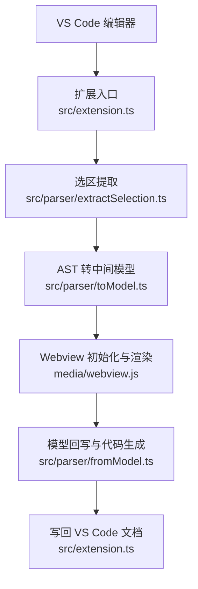
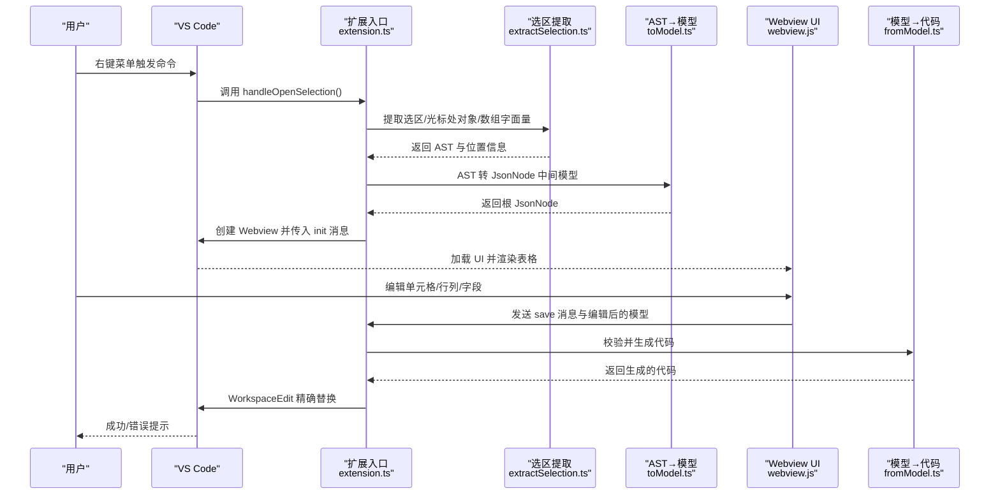
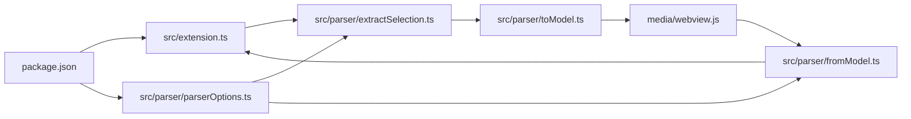

# 使用示例

<cite>
**本文引用的文件**   
- [package.json](file://package.json)
- [src/extension.ts](file://src/extension.ts)
- [src/model.ts](file://src/model.ts)
- [src/parser/extractSelection.ts](file://src/parser/extractSelection.ts)
- [src/parser/toModel.ts](file://src/parser/toModel.ts)
- [src/parser/fromModel.ts](file://src/parser/fromModel.ts)
- [src/parser/parserOptions.ts](file://src/parser/parserOptions.ts)
- [media/webview.js](file://media/webview.js)
- [测试计划.md](file://测试计划.md)
- [todo.md](file://todo.md)
- [jsonDemo/001.json](file://jsonDemo/001.json)
- [jsonDemo/超大json家庭地址.json](file://jsonDemo/超大json家庭地址.json)
- [jsonDemo/ncc表单demo-res.json](file://jsonDemo/ncc表单demo-res.json)
- [jsonDemo/小程序/preWx-getPreEmpMb-mbCode=bd_psndoc.json](file://jsonDemo/小程序/preWx-getPreEmpMb-mbCode=bd_psndoc.json)
</cite>

## 目录
1. [简介](#简介)
2. [项目结构](#项目结构)
3. [核心组件](#核心组件)
4. [架构总览](#架构总览)
5. [详细组件分析](#详细组件分析)
6. [依赖关系分析](#依赖关系分析)
7. [性能考虑](#性能考虑)
8. [故障排查指南](#故障排查指南)
9. [结论](#结论)
10. [附录](#附录)

## 简介
本文件面向 VS Code 用户，系统性地介绍 wysJSON 扩展的使用示例与最佳实践，覆盖从基础编辑到高级操作、从简单对象到复杂嵌套结构、从中小型数据到超大体量数据的多种场景，并给出与 VS Code 其他扩展协同使用的建议。

## 项目结构
- 扩展入口与生命周期管理：src/extension.ts
- 中间数据模型与消息协议：src/model.ts
- 选区提取与 AST 转换：src/parser/extractSelection.ts、src/parser/toModel.ts
- 模型回写与代码生成：src/parser/fromModel.ts、src/parser/parserOptions.ts
- Webview UI 与交互逻辑：media/webview.js
- 示例数据与测试计划：jsonDemo/*、测试计划.md、todo.md
- 扩展元信息与命令注册：package.json

**图表来源**
- [src/extension.ts:46-378](file://src/extension.ts#L46-L378)
- [src/parser/extractSelection.ts:34-101](file://src/parser/extractSelection.ts#L34-L101)
- [src/parser/toModel.ts:10-90](file://src/parser/toModel.ts#L10-L90)
- [media/webview.js:11-200](file://media/webview.js#L11-L200)
- [src/parser/fromModel.ts:20-57](file://src/parser/fromModel.ts#L20-L57)

**章节来源**
- [package.json:1-93](file://package.json#L1-L93)
- [src/extension.ts:19-44](file://src/extension.ts#L19-L44)

## 核心组件
- 扩展激活与命令注册：注册“打开 wysJSON”命令，注入右键菜单，暴露语言偏好设置。
- 选区提取器：支持直接表达式、变量初始化、容错多候选三种策略；在 Markdown 中自动识别代码块。
- AST 到中间模型：将对象/数组/字面量映射为 JsonNode，非 JSON 代码保留为 codeText 节点。
- 模型到代码：校验 codeText 语法，生成格式化 JavaScript 源码，支持缩进与换行。
- Webview UI：提供 Excel 风格表格、面包屑导航、语言切换、缩略图/快速跳转等能力。
- 写回机制：基于 SourceInfo 精确替换，防并发覆盖，支持预览与错误提示。

**章节来源**
- [src/extension.ts:23-38](file://src/extension.ts#L23-L38)
- [src/parser/extractSelection.ts:34-101](file://src/parser/extractSelection.ts#L34-L101)
- [src/parser/toModel.ts:10-90](file://src/parser/toModel.ts#L10-L90)
- [src/parser/fromModel.ts:20-57](file://src/parser/fromModel.ts#L20-L57)
- [media/webview.js:11-200](file://media/webview.js#L11-L200)

## 架构总览
以下时序图展示从“右键打开 wysJSON”到“写回 VS Code”的完整流程。

**图表来源**
- [src/extension.ts:46-378](file://src/extension.ts#L46-L378)
- [src/parser/extractSelection.ts:108-229](file://src/parser/extractSelection.ts#L108-L229)
- [src/parser/toModel.ts:10-90](file://src/parser/toModel.ts#L10-L90)
- [media/webview.js:11-200](file://media/webview.js#L11-L200)
- [src/parser/fromModel.ts:20-57](file://src/parser/fromModel.ts#L20-L57)

## 详细组件分析

### 基础编辑场景
- 简单对象编辑
  - 场景：在 JS/TS 文件中选择一个对象字面量，右键打开 wysJSON，编辑字段后保存。
  - 关键点：选区提取器优先匹配对象/数组字面量；若包裹在变量声明中，会提取初始化值。
  - 参考测试步骤：[测试计划.md:49-58](file://测试计划.md#L49-L58)
- 数组元素修改
  - 场景：选择数组字面量，打开编辑器后对某一项进行修改，保存后写回。
  - 参考测试步骤：[测试计划.md:87-94](file://测试计划.md#L87-L94)

**章节来源**
- [src/parser/extractSelection.ts:34-101](file://src/parser/extractSelection.ts#L34-L101)
- [测试计划.md:49-58](file://测试计划.md#L49-L58)
- [测试计划.md:87-94](file://测试计划.md#L87-L94)

### 高级操作技巧
- 批量编辑
  - 方法：在表格中使用鼠标拖拽选择区域，同时修改多个单元格；或通过上下文菜单插入/删除行/列。
  - 注意：当前版本未实现撤销/重做堆栈持久化，建议分步保存以防误操作。
  - 参考 UI 能力：[media/webview.js:11-200](file://media/webview.js#L11-L200)
- 复杂嵌套结构处理
  - 方法：通过面包屑导航定位到目标层级；展开/折叠子节点；对深层数组/对象进行增删改。
  - 参考测试步骤：[测试计划.md:59-68](file://测试计划.md#L59-L68)

**章节来源**
- [media/webview.js:11-200](file://media/webview.js#L11-L200)
- [测试计划.md:59-68](file://测试计划.md#L59-L68)

### 常见工作流程
- 从选区提取到表格编辑再到代码生成
  - 步骤：选中 JS/TS 中的对象/数组字面量 → 右键打开 wysJSON → 在表格中编辑 → 点击保存 → 扩展生成代码并写回。
  - 保障：写回前进行模型校验与版本检查，防止并发覆盖。
  - 参考实现：[src/extension.ts:420-490](file://src/extension.ts#L420-L490)、[src/parser/fromModel.ts:20-57](file://src/parser/fromModel.ts#L20-L57)

**章节来源**
- [src/extension.ts:420-490](file://src/extension.ts#L420-L490)
- [src/parser/fromModel.ts:20-57](file://src/parser/fromModel.ts#L20-L57)

### 不同类型 JSON 数据的编辑方法
- 简单对象
  - 示例：[jsonDemo/001.json](file://jsonDemo/001.json)
  - 操作：选择对象字面量，编辑字段值，保存。
- 复杂嵌套结构
  - 示例：[jsonDemo/ncc表单demo-res.json](file://jsonDemo/ncc表单demo-res.json)
  - 操作：展开 items 数组，逐条编辑字段；注意字段较多时使用面包屑与缩略图导航。
- 大型数据集
  - 示例：[jsonDemo/超大json家庭地址.json](file://jsonDemo/超大json家庭地址.json)
  - 建议：当前版本建议分层加载与懒加载策略（见 todo.md），避免一次性渲染导致卡顿。
- 特殊格式数据
  - 示例：[jsonDemo/小程序/preWx-getPreEmpMb-mbCode=bd_psndoc.json](file://jsonDemo/小程序/preWx-getPreEmpMb-mbCode=bd_psndoc.json)
  - 操作：该数据包含大量枚举与字段元信息，适合在表格中按列筛选与编辑。

**章节来源**
- [jsonDemo/001.json:1-23](file://jsonDemo/001.json#L1-L23)
- [jsonDemo/ncc表单demo-res.json:1-200](file://jsonDemo/ncc表单demo-res.json#L1-L200)
- [jsonDemo/超大json家庭地址.json:1-5](file://jsonDemo/超大json家庭地址.json#L1-L5)
- [jsonDemo/小程序/preWx-getPreEmpMb-mbCode=bd_psndoc.json:1-200](file://jsonDemo/小程序/preWx-getPreEmpMb-mbCode=bd_psndoc.json#L1-L200)
- [todo.md:3-6](file://todo.md#L3-L6)

### 与 VS Code 扩展的协同使用
- 与 Prettier/ESLint 协同
  - 建议：在保存后由 ESLint/Prettier 统一格式化，避免样式差异影响阅读。
- 与 Git/Source Control 协同
  - 建议：每次编辑后及时提交，配合扩展的“写回”机制，减少合并冲突。
- 与 Live Share/Remote 开发
  - 建议：在多人协作场景中，遵循“先提取再编辑”的流程，避免并发覆盖。

[本节为通用建议，无需特定文件引用]

## 依赖关系分析
- 扩展激活与贡献
  - package.json 注册命令、右键菜单、国际化标题与受支持语言列表。
- 核心依赖链
  - 选区提取 → AST 转中间模型 → Webview 渲染 → 模型回写 → 代码生成。
- 外部依赖
  - @babel/parser 与 @babel/generator 用于语法解析与代码生成。
  - monaco-editor 用于 VS Code 环境下的 Webview 渲染。

**图表来源**
- [package.json:27-67](file://package.json#L27-L67)
- [src/extension.ts:9-15](file://src/extension.ts#L9-L15)
- [src/parser/extractSelection.ts:6-11](file://src/parser/extractSelection.ts#L6-L11)
- [src/parser/toModel.ts:6-8](file://src/parser/toModel.ts#L6-L8)
- [src/parser/fromModel.ts:6-8](file://src/parser/fromModel.ts#L6-L8)
- [src/parser/parserOptions.ts:1-36](file://src/parser/parserOptions.ts#L1-L36)

**章节来源**
- [package.json:27-67](file://package.json#L27-L67)
- [src/extension.ts:9-15](file://src/extension.ts#L9-L15)

## 性能考虑
- 大数据集渲染
  - 建议：采用分层加载与懒加载策略，未加载部分显示占位提示，点击后再加载。
  - 参考规划：[todo.md:3-6](file://todo.md#L3-L6)
- 编辑器渲染
  - 建议：在超大对象/数组中优先使用面包屑与缩略图导航，避免一次性展开全部层级。
- 代码生成
  - 建议：尽量保持字段顺序与缩进风格一致，减少 diff。

[本节为通用建议，无需特定文件引用]

## 故障排查指南
- 无法识别选区中的数据结构
  - 现象：提示“未找到对象或数组字面量”或“找到多个候选对象/数组字面量”。
  - 处理：确保选区仅包含一个对象/数组字面量；若为变量声明，确保选中初始化部分。
  - 参考实现：[src/parser/extractSelection.ts:34-101](file://src/parser/extractSelection.ts#L34-L101)
- 文档已被修改，无法写回
  - 现象：写回时报错“文档已被修改，请重新打开编辑器以避免覆盖更改”。
  - 处理：重新打开编辑器，再次提取并编辑。
  - 参考实现：[src/extension.ts:424-430](file://src/extension.ts#L424-L430)
- 代码文本节点包含无效表达式
  - 现象：保存时报错“代码文本无效”。
  - 处理：修正为合法 JavaScript 表达式；对于函数/方法，确保语法正确。
  - 参考实现：[src/parser/fromModel.ts:92-117](file://src/parser/fromModel.ts#L92-L117)

**章节来源**
- [src/parser/extractSelection.ts:34-101](file://src/parser/extractSelection.ts#L34-L101)
- [src/extension.ts:424-430](file://src/extension.ts#L424-L430)
- [src/parser/fromModel.ts:92-117](file://src/parser/fromModel.ts#L92-L117)

## 结论
wysJSON 通过“选区提取 → AST 转模型 → Webview 表格编辑 → 模型回写”的清晰流程，为 VS Code 用户提供了直观、安全、可逆的 JSON/JS 数据编辑体验。结合示例数据与测试计划，用户可以在多种场景中高效完成数据编辑任务，并通过与 VS Code 生态的协同进一步提升开发效率。

## 附录
- 快速开始
  - 在 JS/TS 文件中选择对象/数组字面量 → 右键菜单选择“wysJSON: Open data in wysJSON editor” → 在表格中编辑 → 点击“保存” → 查看源文件被写回。
- 常用快捷键与功能
  - 语言切换：界面顶部语言选择器（自动/英文/中文）。
  - 缩略图/快速跳转：辅助导航与定位。
  - 清空 null：一键将 null 替换为空字符串。
- 参考文件
  - [测试计划.md](file://测试计划.md)、[todo.md](file://todo.md)