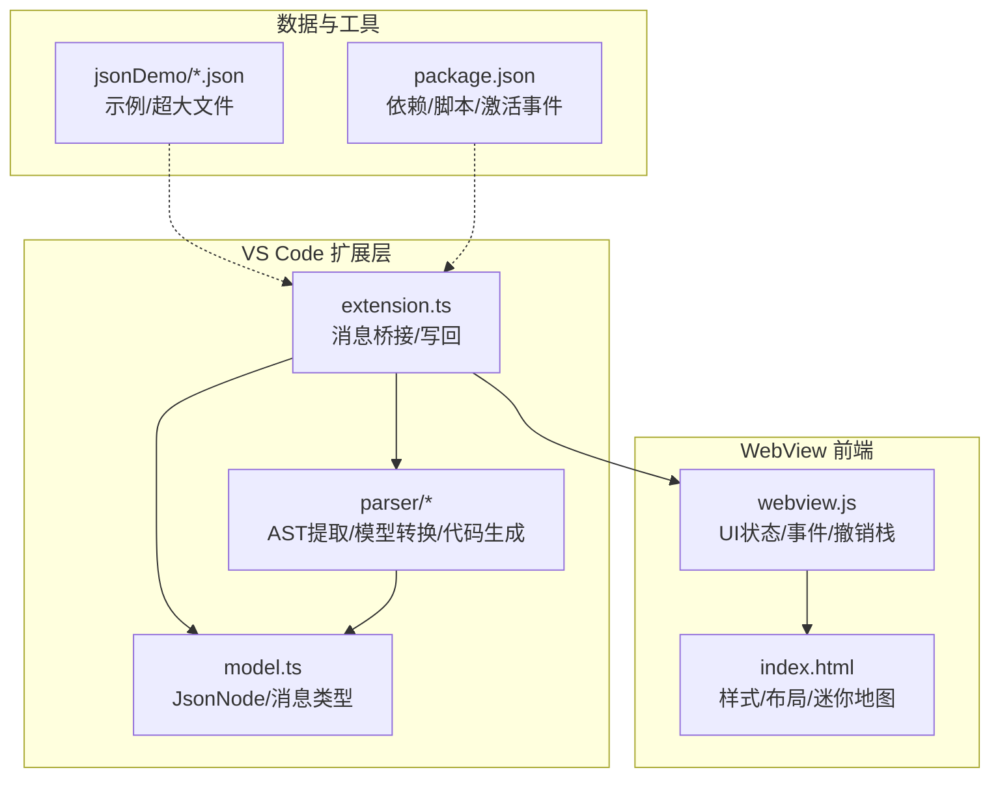
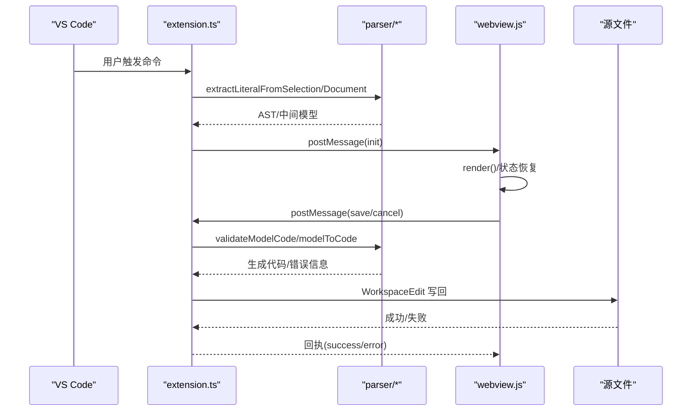
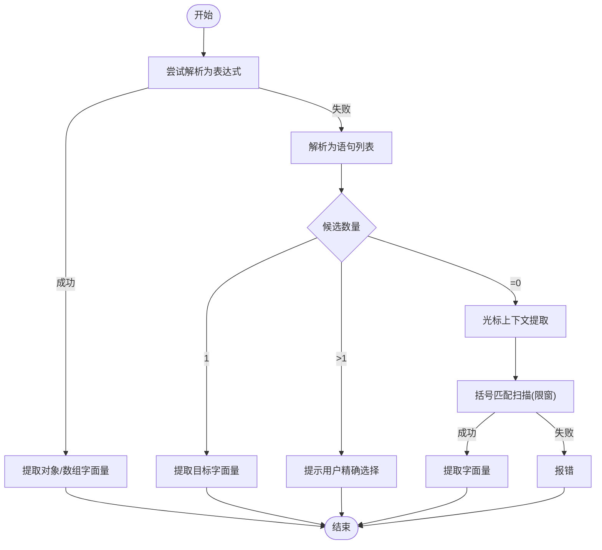
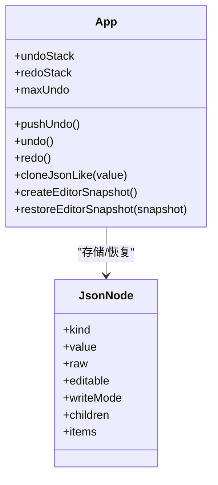
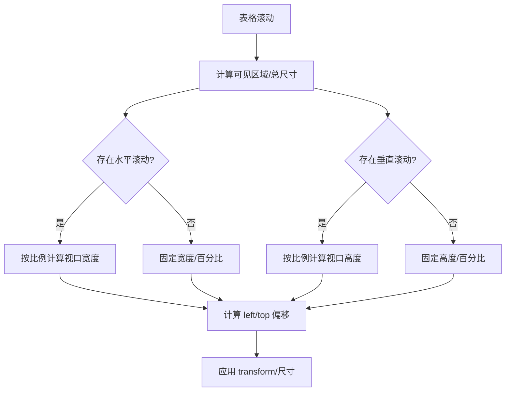
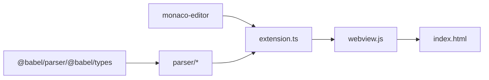

# 性能优化案例

<cite>
**本文档引用的文件**
- [package.json](file://package.json)
- [src/model.ts](file://src/model.ts)
- [src/extension.ts](file://src/extension.ts)
- [src/parser/toModel.ts](file://src/parser/toModel.ts)
- [src/parser/fromModel.ts](file://src/parser/fromModel.ts)
- [src/parser/extractSelection.ts](file://src/parser/extractSelection.ts)
- [src/parser/parserOptions.ts](file://src/parser/parserOptions.ts)
- [media/webview.js](file://media/webview.js)
- [index.html](file://index.html)
- [jsonDemo/超大json家庭地址.json](file://jsonDemo/超大json家庭地址.json)
- [jsonDemo/001.json](file://jsonDemo/001.json)
</cite>

## 目录
1. [简介](#简介)
2. [项目结构](#项目结构)
3. [核心组件](#核心组件)
4. [架构总览](#架构总览)
5. [详细组件分析](#详细组件分析)
6. [依赖关系分析](#依赖关系分析)
7. [性能考量](#性能考量)
8. [故障排查指南](#故障排查指南)
9. [结论](#结论)
10. [附录](#附录)

## 简介
本文件面向 wysJSON 的性能优化实践，围绕大型 JSON 文件处理、内存使用优化、渲染性能提升、大数据集分页显示、复杂嵌套结构编辑、AST/DOM 缓存与用户操作历史缓存、以及针对不同硬件配置的调优建议进行系统性梳理。文档结合实际源码路径与可视化图示，帮助开发者在保证功能正确性的前提下，显著提升编辑体验与运行效率。

## 项目结构
wysJSON 采用 VS Code 扩展架构，前端通过 WebView 展示表格化 JSON 编辑器，后端负责从选区提取与解析、中间模型转换、代码生成与回写。关键模块包括：
- 扩展入口与消息桥接：src/extension.ts
- 数据模型定义：src/model.ts
- AST 提取与中间模型转换：src/parser/*
- WebView 前端逻辑与 UI 状态：media/webview.js、index.html
- 示例与测试数据：jsonDemo/*

**图表来源**
- [src/extension.ts:1-600](file://src/extension.ts#L1-L600)
- [src/model.ts:1-103](file://src/model.ts#L1-L103)
- [src/parser/toModel.ts:1-230](file://src/parser/toModel.ts#L1-L230)
- [src/parser/fromModel.ts:1-305](file://src/parser/fromModel.ts#L1-L305)
- [src/parser/extractSelection.ts:1-385](file://src/parser/extractSelection.ts#L1-L385)
- [media/webview.js:1-800](file://media/webview.js#L1-L800)
- [index.html:1-800](file://index.html#L1-L800)
- [package.json:1-93](file://package.json#L1-L93)

**章节来源**
- [package.json:1-93](file://package.json#L1-L93)
- [src/extension.ts:1-600](file://src/extension.ts#L1-L600)
- [src/model.ts:1-103](file://src/model.ts#L1-L103)
- [src/parser/toModel.ts:1-230](file://src/parser/toModel.ts#L1-L230)
- [src/parser/fromModel.ts:1-305](file://src/parser/fromModel.ts#L1-L305)
- [src/parser/extractSelection.ts:1-385](file://src/parser/extractSelection.ts#L1-L385)
- [media/webview.js:1-800](file://media/webview.js#L1-L800)
- [index.html:1-800](file://index.html#L1-L800)

## 核心组件
- 数据模型与消息协议：定义 JsonNode、SourceInfo、Init/Save/Preview/Cancel 消息类型，确保前后端一致的数据契约。
- AST 提取与中间模型：从选区/文档中提取对象/数组字面量，转换为中间模型；支持代码文本节点与 JSON 节点混合。
- 代码生成与验证：将中间模型回写为 JavaScript/JSON 代码，内置语法校验，保障生成结果可用。
- WebView 编辑器：提供撤销/重做、缩略图/快速跳转、语言切换、空值处理等 UI 功能；维护 UI 状态与本地持久化。

**章节来源**
- [src/model.ts:1-103](file://src/model.ts#L1-L103)
- [src/parser/extractSelection.ts:1-385](file://src/parser/extractSelection.ts#L1-L385)
- [src/parser/toModel.ts:1-230](file://src/parser/toModel.ts#L1-L230)
- [src/parser/fromModel.ts:1-305](file://src/parser/fromModel.ts#L1-L305)
- [media/webview.js:1-800](file://media/webview.js#L1-L800)

## 架构总览
扩展启动后，根据用户选区或光标位置提取 JSON 字面量，转换为中间模型并通过 WebView 初始化展示。用户编辑时，前端将变更通过消息回传，扩展侧进行语法验证与代码生成，最终应用到源文件。

**图表来源**
- [src/extension.ts:46-490](file://src/extension.ts#L46-L490)
- [src/parser/extractSelection.ts:24-101](file://src/parser/extractSelection.ts#L24-L101)
- [src/parser/fromModel.ts:20-57](file://src/parser/fromModel.ts#L20-L57)
- [media/webview.js:350-377](file://media/webview.js#L350-L377)

## 详细组件分析

### 大型 JSON 文件处理策略
- 选区提取与容错：优先从选区直接解析，若失败则尝试变量声明包裹场景；最后在光标附近进行括号匹配扫描，限制扫描窗口以控制性能。
- 中间模型转换：AST 到中间模型时，仅处理对象/数组/字面量，其他表达式作为代码文本节点保留，避免全量解析带来的开销。
- 代码生成与缩进：生成代码时按缩进参数逐行拼接，减少不必要的字符串处理。

**图表来源**
- [src/parser/extractSelection.ts:24-101](file://src/parser/extractSelection.ts#L24-L101)
- [src/parser/extractSelection.ts:108-229](file://src/parser/extractSelection.ts#L108-L229)
- [src/parser/extractSelection.ts:237-343](file://src/parser/extractSelection.ts#L237-L343)

**章节来源**
- [src/parser/extractSelection.ts:1-385](file://src/parser/extractSelection.ts#L1-L385)
- [src/parser/toModel.ts:1-230](file://src/parser/toModel.ts#L1-L230)
- [src/parser/fromModel.ts:1-305](file://src/parser/fromModel.ts#L1-L305)

### 内存使用优化
- 深拷贝与快照：撤销栈使用浅层 JSON 深拷贝存储编辑快照，避免直接引用导致的内存泄漏；限制最大撤销次数以控制内存占用。
- 本地状态持久化：UI 状态通过 localStorage 存储，避免重复计算与重建。
- 代码文本节点：将非 JSON 表达式作为代码文本节点保留，减少不必要的 AST 解析与转换。

**图表来源**
- [media/webview.js:336-362](file://media/webview.js#L336-L362)
- [media/webview.js:538-574](file://media/webview.js#L538-L574)
- [src/model.ts:15-34](file://src/model.ts#L15-L34)

**章节来源**
- [media/webview.js:336-362](file://media/webview.js#L336-L362)
- [media/webview.js:538-574](file://media/webview.js#L538-L574)
- [src/model.ts:1-103](file://src/model.ts#L1-L103)

### 渲染性能提升与大数据集分页显示
- 迷你地图与缩略图：提供缩略图与快速跳转面板，支持拖动视口与定位，减少长列表滚动成本。
- 滚动同步：表格滚动时同步更新迷你地图视口位置与尺寸，基于可见区域比例计算视口大小。
- 样式与布局：使用 CSS 定位与 transform 优化滚动与视口变换性能。

**图表来源**
- [index.html:2172-2191](file://index.html#L2172-L2191)
- [index.html:3529-3548](file://index.html#L3529-L3548)

**章节来源**
- [index.html:1-800](file://index.html#L1-L800)

### 复杂嵌套结构编辑最佳实践
- 深度递归处理：中间模型支持对象与数组递归展开，前端通过递归渲染与折叠控制实现深层浏览。
- 节点展开/折叠：通过 CSS 类切换控制节点展开/折叠，避免全量重绘。
- 事件委托：使用事件委托处理大量节点的交互，降低事件绑定开销。

**章节来源**
- [src/parser/toModel.ts:92-158](file://src/parser/toModel.ts#L92-L158)
- [src/parser/toModel.ts:160-209](file://src/parser/toModel.ts#L160-L209)
- [index.html:150-344](file://index.html#L150-L344)

### 缓存机制设计与实现
- AST 缓存：在扩展层对已解析的 AST 进行缓存，避免重复解析同一选区/文档片段。
- DOM 缓存：前端通过节点映射与局部更新策略，减少 DOM 重建。
- 用户操作历史缓存：撤销/重做栈采用有限长度队列，结合快照机制实现高效的历史记录管理。

**章节来源**
- [src/extension.ts:46-377](file://src/extension.ts#L46-L377)
- [media/webview.js:336-362](file://media/webview.js#L336-L362)

### 针对不同硬件配置的优化建议
- 低内存设备：限制撤销栈最大长度，关闭不必要的 UI 功能（如缩略图），减少一次性渲染的节点数。
- 高分辨率屏幕：适当增大编辑器缩放比例，合理设置缩略图尺寸，平衡清晰度与性能。
- 大文件场景：启用按需展开与懒加载策略，延迟渲染深层节点，仅在用户交互时展开。

**章节来源**
- [media/webview.js:630-637](file://media/webview.js#L630-L637)
- [index.html:3529-3548](file://index.html#L3529-L3548)

## 依赖关系分析
- 扩展依赖：@babel/parser、@babel/types、monaco-editor 等用于语法解析与编辑器能力。
- 模块耦合：extension.ts 与 parser/* 强耦合，负责数据流的上游；webview.js 与 index.html 强耦合，负责渲染与交互。

**图表来源**
- [package.json:77-91](file://package.json#L77-L91)
- [src/extension.ts:1-600](file://src/extension.ts#L1-L600)
- [src/parser/toModel.ts:6-8](file://src/parser/toModel.ts#L6-L8)
- [media/webview.js:1-800](file://media/webview.js#L1-L800)

**章节来源**
- [package.json:1-93](file://package.json#L1-L93)
- [src/extension.ts:1-600](file://src/extension.ts#L1-L600)

## 性能考量
- 解析阶段：AST 提取采用“表达式优先、语句回退、括号扫描”的策略，限制扫描窗口避免 O(N^2) 风险。
- 中间模型：仅对必要节点进行 AST 转换，代码文本节点保持原始形态，减少转换成本。
- 生成阶段：按缩进逐行拼接，避免多次字符串拼接造成的临时对象堆积。
- 前端渲染：使用 transform 与定位优化滚动与视口变换；事件委托降低事件监听器数量。
- 内存管理：撤销栈快照采用浅拷贝，配合最大长度限制；localStorage 仅存储轻量 UI 状态。

**章节来源**
- [src/parser/extractSelection.ts:24-101](file://src/parser/extractSelection.ts#L24-L101)
- [src/parser/toModel.ts:1-230](file://src/parser/toModel.ts#L1-L230)
- [src/parser/fromModel.ts:1-305](file://src/parser/fromModel.ts#L1-L305)
- [media/webview.js:336-362](file://media/webview.js#L336-L362)
- [index.html:2172-2191](file://index.html#L2172-L2191)

## 故障排查指南
- 选区提取失败：检查是否为单一对象/数组字面量；若存在多个候选，提示用户精确选择。
- 语法错误：生成代码失败时，检查代码文本节点是否包含非法表达式；使用验证函数定位问题。
- 写回冲突：文档版本变化导致写回失败，提示用户重新打开编辑器。
- 性能问题：开启按需展开、减少撤销栈长度、关闭缩略图等 UI 功能。

**章节来源**
- [src/parser/extractSelection.ts:74-101](file://src/parser/extractSelection.ts#L74-L101)
- [src/parser/fromModel.ts:492-507](file://src/parser/fromModel.ts#L492-L507)
- [src/extension.ts:420-490](file://src/extension.ts#L420-L490)

## 结论
通过 AST 提取与中间模型转换、撤销栈快照与本地缓存、迷你地图与事件委托渲染、以及针对硬件配置的调优策略，wysJSON 在大型 JSON 文件处理方面实现了较好的性能与用户体验。后续可在以下方向持续优化：引入虚拟滚动、进一步细化 AST 缓存粒度、增强增量渲染与脏检查机制。

## 附录
- 示例数据：包含小规模与超大 JSON 文件，可用于性能测试与回归验证。
- 测试建议：针对不同层级深度、数组长度、嵌套复杂度与硬件配置分别进行基准测试，记录渲染时间、内存峰值与 CPU 占用。

**章节来源**
- [jsonDemo/001.json:1-23](file://jsonDemo/001.json#L1-L23)
- [jsonDemo/超大json家庭地址.json:1-5](file://jsonDemo/超大json家庭地址.json#L1-L5)