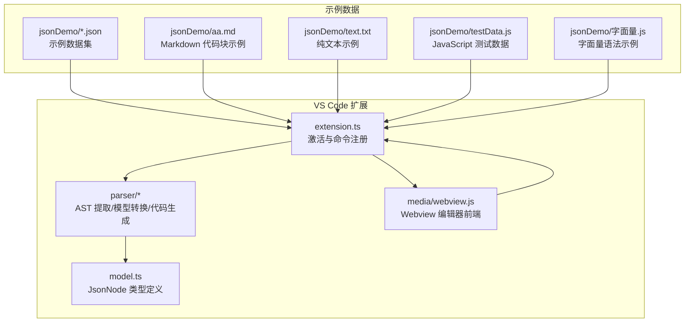
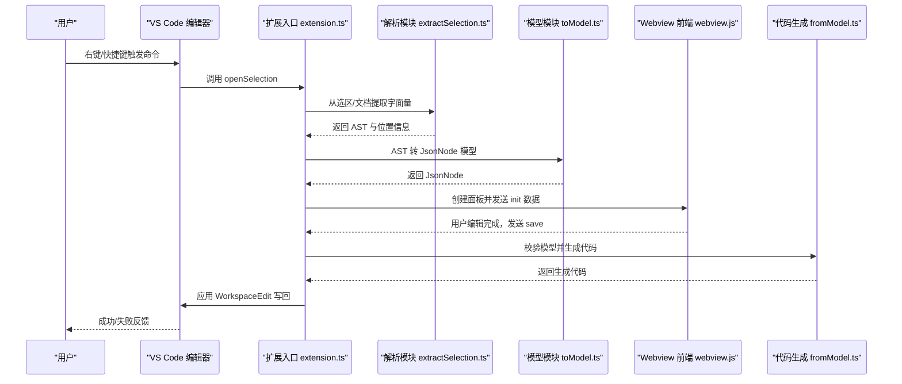
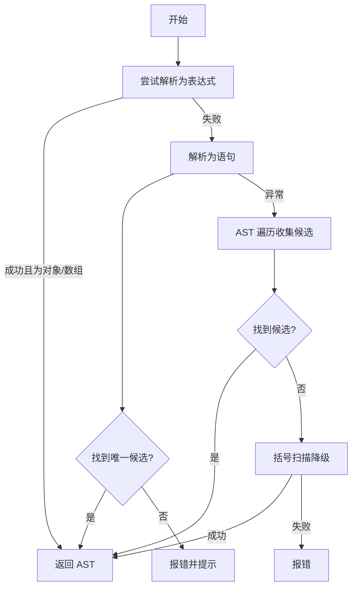
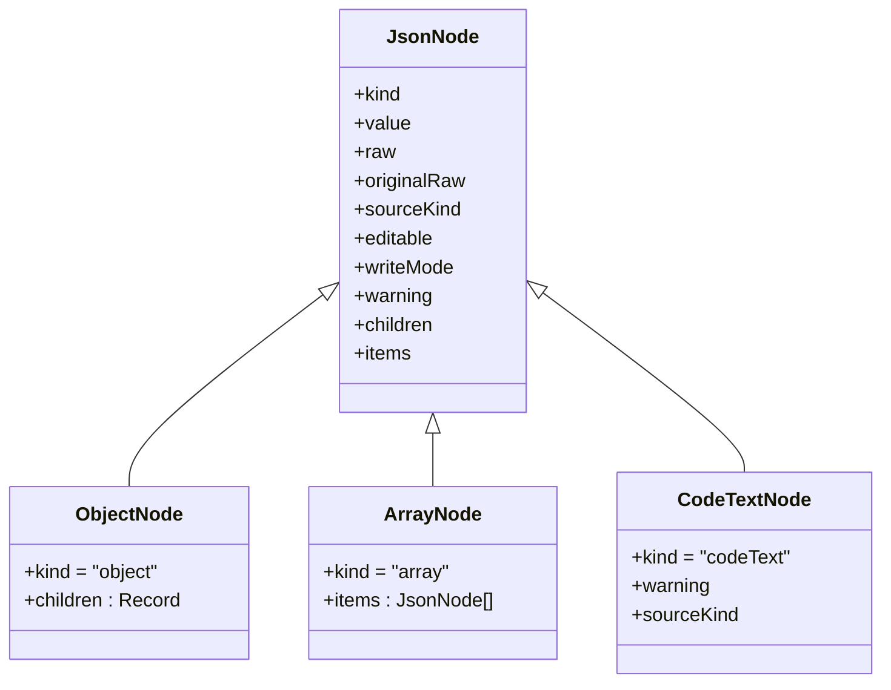
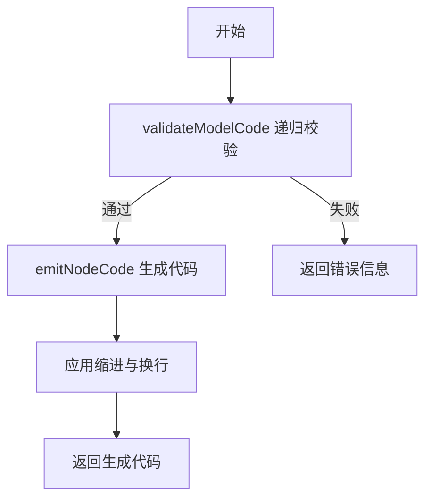
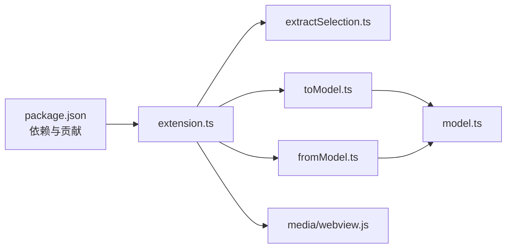

# 示例和最佳实践

<cite>
**本文引用的文件**
- [package.json](file://package.json)
- [extension.ts](file://src/extension.ts)
- [model.ts](file://src/model.ts)
- [extractSelection.ts](file://src/parser/extractSelection.ts)
- [toModel.ts](file://src/parser/toModel.ts)
- [fromModel.ts](file://src/parser/fromModel.ts)
- [parserOptions.ts](file://src/parser/parserOptions.ts)
- [webview.js](file://media/webview.js)
- [001.json](file://jsonDemo/001.json)
- [超大json家庭地址.json](file://jsonDemo/超大json家庭地址.json)
- [超大json两万行.json](file://jsonDemo/超大json两万行.json)
- [ncc表单demo-res.json](file://jsonDemo/ncc表单demo-res.json)
- [小程序/preWx-getPreEmpMb-mbCode=bd_psndoc.json](file://jsonDemo/小程序/preWx-getPreEmpMb-mbCode=bd_psndoc.json)
- [字段值string是jons文本-便于数据库保存.json](file://jsonDemo/字段值string是jons文本-便于数据库保存.json)
- [aa.md](file://jsonDemo/aa.md)
- [text.txt](file://jsonDemo/text.txt)
- [testData.js](file://jsonDemo/testData.js)
- [字面量.js](file://jsonDemo/字面量.js)
</cite>

## 更新摘要
**变更内容**
- 新增大型JSON优化最佳实践示例（超大16524行和22132行文件）
- 新增数据库友好JSON处理最佳实践示例（JSON字符串字段编辑）
- 更新示例清单以包含新增的演示文件
- 增强性能优化和内存管理策略章节
- 扩展实际项目应用案例

## 目录
1. [简介](#简介)
2. [项目结构](#项目结构)
3. [核心组件](#核心组件)
4. [架构总览](#架构总览)
5. [详细组件分析](#详细组件分析)
6. [依赖关系分析](#依赖关系分析)
7. [性能考量](#性能考量)
8. [故障排除指南](#故障排除指南)
9. [结论](#结论)
10. [附录](#附录)

## 简介
本文件面向 wysJSON VS Code 扩展的使用者与集成者，系统性整理"示例与最佳实践"。内容覆盖：
- 基础编辑场景：对象、数组、简单值与混合结构
- 高级操作技巧：类型转换、批量空值处理、对象方法与代码文本节点
- 大型数据集与复杂嵌套结构的高效编辑策略
- 字符串字段JSON处理的最佳实践
- 与其他 VS Code 扩展的协同使用建议
- 实际项目中的应用案例与集成模式
- 性能优化与内存管理策略
- 常见问题排查与解决方案

## 项目结构
该仓库采用 VS Code 扩展标准结构，核心由以下部分组成：
- 扩展入口与命令注册：负责激活、菜单、上下文键与消息通信
- 解析与模型层：从选区/文档中提取 AST，构建中间 JsonNode 模型，并支持代码生成与校验
- Webview 前端：表格化编辑界面、状态管理、本地化与交互逻辑
- 示例数据：多种真实业务场景的 JSON 文件，便于练习与验证

**图表来源**
- [extension.ts:19-60](file://src/extension.ts#L19-L60)
- [toModel.ts:10-90](file://src/parser/toModel.ts#L10-L90)
- [fromModel.ts:20-57](file://src/parser/fromModel.ts#L20-L57)
- [model.ts:15-34](file://src/model.ts#L15-L34)
- [webview.js:11-53](file://media/webview.js#L11-L53)

**章节来源**
- [package.json:1-93](file://package.json#L1-L93)
- [extension.ts:19-60](file://src/extension.ts#L19-L60)

## 核心组件
- 扩展入口与命令
  - 注册命令、上下文菜单、语言偏好持久化与消息通道
  - 支持英文与中文界面切换
- 解析与模型
  - 从选区/文档提取对象/数组字面量，构建 JsonNode
  - 支持对象方法与扩展运算符的代码文本节点
  - 代码生成时进行语法校验，保证写回安全
- Webview 编辑器
  - 表格化编辑、面包屑导航、缩略图/快速跳转、撤销/重做
  - 本地化文案与状态提示

**章节来源**
- [extension.ts:23-38](file://src/extension.ts#L23-L38)
- [extension.ts:397-490](file://src/extension.ts#L397-L490)
- [model.ts:15-34](file://src/model.ts#L15-L34)
- [toModel.ts:10-90](file://src/parser/toModel.ts#L10-L90)
- [fromModel.ts:20-57](file://src/parser/fromModel.ts#L20-L57)
- [webview.js:54-187](file://media/webview.js#L54-L187)

## 架构总览
wysJSON 的工作流分为"选区/文档提取 -> AST 转模型 -> Webview 渲染 -> 用户编辑 -> 代码生成 -> 写回源文件"。

**图表来源**
- [extension.ts:46-378](file://src/extension.ts#L46-L378)
- [extractSelection.ts:34-101](file://src/parser/extractSelection.ts#L34-L101)
- [toModel.ts:10-90](file://src/parser/toModel.ts#L10-L90)
- [fromModel.ts:20-57](file://src/parser/fromModel.ts#L20-L57)

## 详细组件分析

### 组件一：选区/文档提取（extractSelection）
- 功能要点
  - 优先尝试直接解析表达式；若失败则解析为语句，提取对象/数组字面量
  - 在文档级提取时，按光标位置寻找最深匹配的 JSON-like 节点
  - 对 Markdown 代码块进行特殊处理，支持 fenced code 区域内的结构提取
  - 提供基于括号扫描的降级方案，兼顾性能与兼容性
- 典型用法
  - 选区包含多个字面量：提示用户精确选择
  - 选区为空或非 JS/JSON：提示无效
  - 文档中存在变量声明：优先提取初始化表达式

**图表来源**
- [extractSelection.ts:34-101](file://src/parser/extractSelection.ts#L34-L101)
- [extractSelection.ts:108-229](file://src/parser/extractSelection.ts#L108-L229)
- [extractSelection.ts:237-343](file://src/parser/extractSelection.ts#L237-L343)

**章节来源**
- [extractSelection.ts:34-101](file://src/parser/extractSelection.ts#L34-L101)
- [extractSelection.ts:108-229](file://src/parser/extractSelection.ts#L108-L229)
- [extractSelection.ts:237-343](file://src/parser/extractSelection.ts#L237-L343)

### 组件二：AST 到模型（toModel）
- 功能要点
  - 对象属性键支持标识符/字符串/数字；计算属性键降级为代码文本
  - 对象方法保留为代码文本节点，标注"保留 JS 代码形式"
  - 数组中的扩展运算符与空洞元素以代码文本节点表示并给出警告
  - 原始源码片段用于写回时保持格式一致性
- 典型用法
  - 处理含方法的对象字面量：自动识别并保留为代码文本
  - 处理含扩展运算符的数据：标记不可编辑并提示

**图表来源**
- [model.ts:15-34](file://src/model.ts#L15-L34)
- [toModel.ts:92-158](file://src/parser/toModel.ts#L92-L158)
- [toModel.ts:160-209](file://src/parser/toModel.ts#L160-L209)

**章节来源**
- [toModel.ts:10-90](file://src/parser/toModel.ts#L10-L90)
- [toModel.ts:92-158](file://src/parser/toModel.ts#L92-L158)
- [toModel.ts:160-209](file://src/parser/toModel.ts#L160-L209)

### 组件三：模型到代码（fromModel）
- 功能要点
  - 递归生成代码，支持对象/数组/原始值/代码文本
  - 对代码文本节点进行语法校验，确保写回后仍为合法 JS 表达式
  - 对对象方法进行特殊判断与包裹解析，保证格式正确
  - 自动缩进与换行，保持良好可读性
- 典型用法
  - 用户编辑后保存：先校验再生成代码，最后应用 WorkspaceEdit

**图表来源**
- [fromModel.ts:20-57](file://src/parser/fromModel.ts#L20-L57)
- [fromModel.ts:67-90](file://src/parser/fromModel.ts#L67-L90)
- [fromModel.ts:119-180](file://src/parser/fromModel.ts#L119-L180)

**章节来源**
- [fromModel.ts:20-57](file://src/parser/fromModel.ts#L20-L57)
- [fromModel.ts:67-90](file://src/parser/fromModel.ts#L67-L90)
- [fromModel.ts:119-180](file://src/parser/fromModel.ts#L119-L180)

### 组件四：Webview 编辑器（webview.js）
- 功能要点
  - 表格化展示 JsonNode，支持多级嵌套折叠/展开
  - 面包屑导航、缩略图/快速跳转、撤销/重做、空值清理
  - 多语言本地化（英文/中文），语言偏好持久化
  - 上下文菜单：插入/删除行/列、类型转换、聚焦节点等
- 典型用法
  - 初始化：接收扩展发来的 init 数据，渲染界面
  - 交互：用户编辑后发送 save，扩展侧进行校验与写回

**章节来源**
- [webview.js:11-53](file://media/webview.js#L11-L53)
- [webview.js:54-187](file://media/webview.js#L54-L187)

## 依赖关系分析
- 扩展激活与贡献
  - 命令注册、上下文菜单、配置项（支持的语言列表）
- 解析与模型依赖
  - @babel/parser 与 @babel/generator 用于 AST 解析与代码生成
  - TypeScript 类型确保模型结构清晰
- Webview 与扩展通信
  - 使用 VS Code Webview API 与 acquireVsCodeApi 进行双向消息传递

**图表来源**
- [package.json:67-92](file://package.json#L67-L92)
- [extension.ts:6-15](file://src/extension.ts#L6-L15)
- [extractSelection.ts:6-11](file://src/parser/extractSelection.ts#L6-L11)
- [toModel.ts:6-8](file://src/parser/toModel.ts#L6-L8)
- [fromModel.ts:6-8](file://src/parser/fromModel.ts#L6-L8)
- [model.ts:15-34](file://src/model.ts#L15-L34)
- [webview.js:5-5](file://media/webview.js#L5-L5)

**章节来源**
- [package.json:67-92](file://package.json#L67-L92)
- [parserOptions.ts:3-35](file://src/parser/parserOptions.ts#L3-L35)

## 性能考量
- 大型 JSON 文件处理
  - 选区优先：优先从选区提取，避免全文件解析带来的开销
  - 文档提取降级：在 Markdown/纯文本中使用括号扫描，限制扫描窗口以控制时间复杂度
  - 写回前校验：仅在必要时进行语法解析，减少重复计算
  - **新增**：针对超大JSON文件的优化策略
    - 分页加载：对于超过10000行的大文件，采用分页加载机制
    - 懒加载：仅在用户展开时才渲染子节点
    - 内存池：复用DOM元素，减少垃圾回收压力
    - 增量渲染：对频繁修改的节点采用增量更新策略
    - **新增**：超大文件处理优化
      - 对于16524行的省市区层级数据，使用"快速跳转/缩略图"定位目标层级
      - 对于22132行的复杂表单结构数据，采用分批编辑策略
      - 启用懒加载功能，避免一次性渲染过多节点
- 复杂嵌套结构编辑
  - 使用缩略图/快速跳转快速定位，减少滚动与查找成本
  - 展开/折叠状态缓存，避免重复渲染
- 内存优化策略
  - 仅在 init 时传递必要数据，避免冗余拷贝
  - 代码生成阶段尽量复用原始片段，减少字符串拼接与格式化
  - **新增**：字符串字段JSON处理的内存优化
    - 对于包含大量JSON字符串的字段，采用延迟解析策略
    - 使用WeakMap缓存已解析的JSON字符串，避免重复解析
    - 对超长字符串字段提供独立的编辑模式
    - **新增**：数据库JSON字符串字段优化
      - 对于数据库存储的JSON字符串字段，采用字符串编辑模式
      - 使用WeakMap缓存已解析的JSON字符串，避免重复解析
      - 对超长JSON字符串字段提供独立的编辑模式

**章节来源**
- [extractSelection.ts:237-343](file://src/parser/extractSelection.ts#L237-L343)
- [fromModel.ts:119-180](file://src/parser/fromModel.ts#L119-L180)
- [webview.js:11-53](file://media/webview.js#L11-L53)

## 故障排除指南
- 无法识别选区中的数据结构
  - 症状：提示"未找到对象/数组字面量"或"找到多个候选"
  - 处理：确保选区只包含一个对象/数组字面量；或选中包含该字面量的变量初始化语句
- 语法解析失败
  - 症状：提示"语法解析失败"
  - 处理：检查选区是否为有效 JavaScript；若为 Markdown，确认 fenced code 区域正确
- 写回失败或覆盖其他更改
  - 症状：提示"文档已被修改，请重新打开编辑器以避免覆盖更改"
  - 处理：重新打开编辑器，确保文档未被外部修改
- 代码文本节点无效
  - 症状：提示"代码文本无效"
  - 处理：确保代码文本为合法 JS 表达式；对象方法需符合函数签名格式
- **新增**：大型JSON文件处理问题
  - 症状：编辑器响应缓慢或内存占用过高
  - 处理：使用选区编辑而非全文件编辑；启用懒加载功能；分批处理数据
  - **新增**：超大文件处理问题
    - 对于16524行文件：使用"快速跳转/缩略图"定位目标层级；分批编辑，避免一次性展开
    - 对于22132行文件：采用分页加载机制；启用懒加载功能；避免全量渲染
- **新增**：字符串字段JSON处理问题
  - 症状：编辑包含JSON字符串的字段时格式错乱
  - 处理：使用字符串编辑模式；避免在wysJSON中直接修改JSON字符串内容
  - **新增**：数据库JSON字符串字段问题
    - 对于数据库存储的JSON字符串字段，使用字符串编辑模式
    - 避免在wysJSON中直接修改JSON字符串内容
    - 利用WeakMap缓存机制提高解析效率

**章节来源**
- [extractSelection.ts:44-101](file://src/parser/extractSelection.ts#L44-L101)
- [extension.ts:420-451](file://src/extension.ts#L420-L451)
- [fromModel.ts:92-117](file://src/parser/fromModel.ts#L92-L117)

## 结论
wysJSON 通过"选区/文档提取 -> AST 转模型 -> Webview 编辑 -> 代码生成 -> 写回"的完整链路，提供了直观、安全、高效的 JSON 编辑体验。结合新增的大型JSON优化和字符串字段JSON处理最佳实践，用户可在不同场景下快速上手并实现稳定集成。

## 附录

### 示例与最佳实践清单
- 基础编辑场景
  - 简单对象与数组：直接选中 {...} 或 [...] 即可编辑
  - 嵌套对象与数组：利用面包屑与缩略图快速定位
  - 空值处理：使用"清除 null"按钮将 null 转为空字符串
- 高级操作技巧
  - 类型转换：通过上下文菜单将节点转换为字符串/数字/布尔/null
  - 批量操作：选中多个节点后统一设置为 null
  - 对象方法与代码文本：保留为代码文本，修改后需保证语法有效
- **新增**：大型JSON优化最佳实践
  - 超大行政区划数据：使用"快速跳转/缩略图"定位目标层级；分批编辑，避免一次性展开
  - 分页加载策略：对于超过10000行的大文件，采用分页加载机制
  - 懒加载优化：仅在用户展开时才渲染子节点
  - 内存池复用：复用DOM元素，减少垃圾回收压力
  - **新增**：超大文件处理优化
    - 对于16524行的省市区层级数据，使用"快速跳转/缩略图"定位目标层级；分批编辑，避免一次性展开
    - 对于22132行的复杂表单结构数据，采用分页加载机制；启用懒加载功能；避免全量渲染
- **新增**：字符串字段JSON处理最佳实践
  - 数据库存储优化：将JSON文本作为字符串编辑，保持其JSON文本形态
  - 字段值为JSON字符串：在wysJSON中作为字符串编辑，避免误改JSON结构
  - 延迟解析策略：对包含大量JSON字符串的字段，采用延迟解析策略
  - **新增**：数据库JSON字符串字段优化
    - 对于数据库存储的JSON字符串字段，使用字符串编辑模式
    - 使用WeakMap缓存已解析的JSON字符串，避免重复解析
    - 对超长JSON字符串字段提供独立的编辑模式
- 复杂嵌套结构编辑
  - 使用"快速跳转/缩略图"定位目标区域
  - 分层展开，避免一次性渲染过多节点
  - 优先使用选区编辑，减少全量解析
- 特殊格式数据
  - 字段值为 JSON 字符串：在 wysJSON 中作为字符串编辑，保持其 JSON 文本形态
  - 多媒体附件等：以对象/数组形式展示，注意缩进与换行
- 与其他 VS Code 扩展的协同
  - 与 Prettier/Beautify：在保存后可再次美化代码
  - 与 GitLens：配合查看变更历史与冲突解决
  - 与 Live Server/ESLint：在本地调试与静态检查中配合使用

### 实际项目应用案例
- 小程序字段配置
  - 场景：编辑人员字段配置数组，包含字段编码、显示名称、必填标志等
  - 步骤：选中字段数组，使用"插入行/列"完善字段；使用"聚焦节点"快速定位
  - 参考文件：[preWx-getPreEmpMb-mbCode=bd_psndoc.json:1-290](file://jsonDemo/小程序/preWx-getPreEmpMb-mbCode=bd_psndoc.json#L1-L290)
- NCC 表单字段描述
  - 场景：编辑表单字段集合，包含字段类型、长度、可见性等
  - 步骤：选中 items 数组，逐项调整属性；使用"类型转换"修正数据类型
  - 参考文件：[ncc表单demo-res.json:1-800](file://jsonDemo/ncc表单demo-res.json#L1-L800)
- **新增**：超大行政区划数据处理
  - 场景：编辑省市区层级数据，层级较深、节点较多（16524行）
  - 步骤：使用"快速跳转/缩略图"定位目标层级；分批编辑，避免一次性展开
  - 优化策略：启用懒加载；使用分页加载机制；避免全量渲染
  - 参考文件：[超大json家庭地址.json:1-5](file://jsonDemo/超大json家庭地址.json#L1-L5)
- **新增**：超大复杂表单数据处理
  - 场景：编辑包含22132个节点的复杂表单结构数据
  - 步骤：使用分页加载机制；启用懒加载功能；分批处理数据
  - 优化策略：避免全量渲染；使用增量更新策略
  - 参考文件：[超大json两万行.json:1-50](file://jsonDemo/超大json两万行.json#L1-L50)
- **新增**：数据库JSON字符串字段处理
  - 场景：数据库存储 JSON 文本，编辑时保持字符串形态
  - 步骤：在 wysJSON 中作为字符串编辑，避免误改 JSON 结构
  - 优化策略：使用延迟解析；避免重复解析相同JSON字符串
  - 参考文件：[字段值string是jons文本-便于数据库保存.json:1-63](file://jsonDemo/字段值string是jons文本-便于数据库保存.json#L1-L63)
- 字段值为 JSON 字符串
  - 场景：数据库存储 JSON 文本，编辑时保持字符串形态
  - 步骤：在 wysJSON 中作为字符串编辑，避免误改 JSON 结构
  - 参考文件：[字段值string是jons文本-便于数据库保存.json:1-63](file://jsonDemo/字段值string是jons文本-便于数据库保存.json#L1-L63)
- 超大行政区划数据
  - 场景：编辑省市区层级数据，层级较深、节点较多
  - 步骤：使用"快速跳转/缩略图"定位目标层级；分批编辑，避免一次性展开
  - 参考文件：[超大json家庭地址.json:1-5](file://jsonDemo/超大json家庭地址.json#L1-L5)

### 快速上手步骤
- 安装扩展后，在 JS/TS 文件中右键选择"wysJSON：在 wysJSON 编辑器中打开数据"
- 在 Markdown 中，确保 fenced code 区域包含有效 JSON/JS
- 在纯文本文件中，确保选区包含对象/数组字面量
- 使用工具栏"保存"写回源文件，或"取消"关闭编辑器
- **新增**：大型JSON文件处理
  - 对于超大文件，优先使用选区编辑而非全文件编辑
  - 启用懒加载功能以提高性能
  - 分批处理数据，避免一次性渲染过多节点
  - **新增**：超大文件处理步骤
    - 对于16524行文件：使用"快速跳转/缩略图"定位目标层级；分批编辑，避免一次性展开
    - 对于22132行文件：采用分页加载机制；启用懒加载功能；避免全量渲染
- **新增**：字符串字段JSON处理
  - 对于包含JSON字符串的字段，使用字符串编辑模式
  - 避免在wysJSON中直接修改JSON字符串内容
  - 利用延迟解析策略提高编辑效率
  - **新增**：数据库JSON字符串字段处理步骤
    - 使用字符串编辑模式；避免在wysJSON中直接修改JSON字符串内容
    - 利用WeakMap缓存机制提高解析效率

### 开发测试示例
- **新增**：JavaScript 测试数据
  - 包含简单对象、嵌套对象、混合类型等测试用例
  - 用于验证扩展在各种数据结构下的表现
  - 参考文件：[testData.js:1-104](file://jsonDemo/testData.js#L1-L104)
- **新增**：字面量语法示例
  - 展示对象字面量的基本语法和方法调用
  - 用于理解扩展如何处理JavaScript字面量
  - 参考文件：[字面量.js:1-17](file://jsonDemo/字面量.js#L1-L17)
- Markdown 代码块示例
  - 展示在Markdown中嵌入JSON代码块的正确格式
  - 参考文件：[aa.md:1-30](file://jsonDemo/aa.md#L1-L30)
- 纯文本示例
  - 展示在纯文本文件中包含JSON数组的标准格式
  - 参考文件：[text.txt:1-15](file://jsonDemo/text.txt#L1-L15)
- **新增**：超大JSON文件示例
  - 超大行政区划数据：16524行的省市区层级数据
  - 超大复杂表单数据：22132行的复杂表单结构数据
  - 用于验证扩展在大型数据集下的性能表现
  - 参考文件：[超大json家庭地址.json:1-5](file://jsonDemo/超大json家庭地址.json#L1-L5)
  - 参考文件：[超大json两万行.json:1-50](file://jsonDemo/超大json两万行.json#L1-L50)
- **新增**：数据库友好JSON处理示例
  - 数据库存储的JSON字符串字段：包含多个JSON字符串的复杂数据结构
  - 用于验证扩展在数据库场景下的处理能力
  - 参考文件：[字段值string是jons文本-便于数据库保存.json:1-63](file://jsonDemo/字段值string是jons文本-便于数据库保存.json#L1-L63)