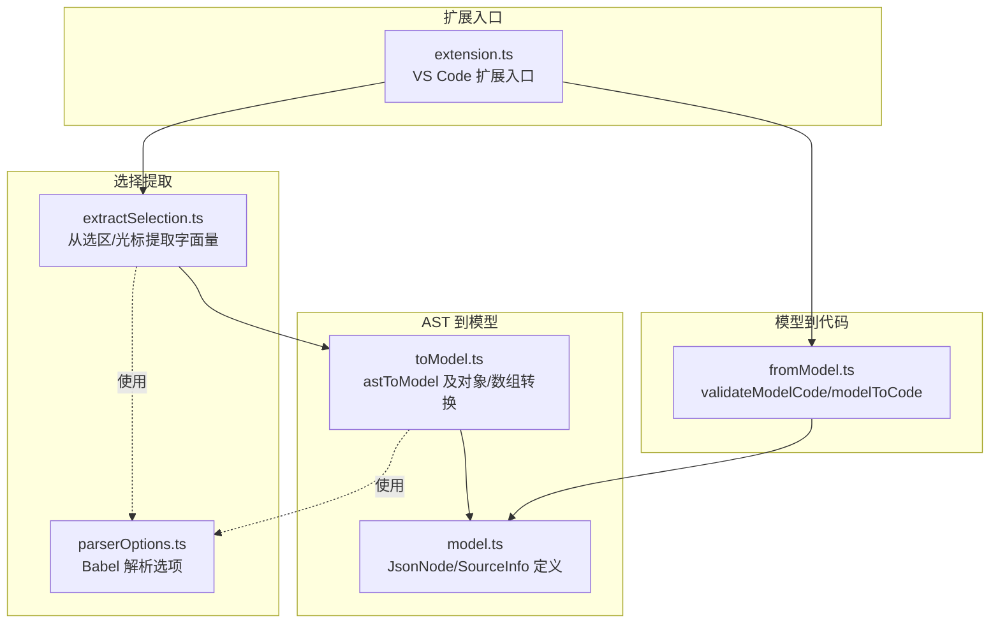
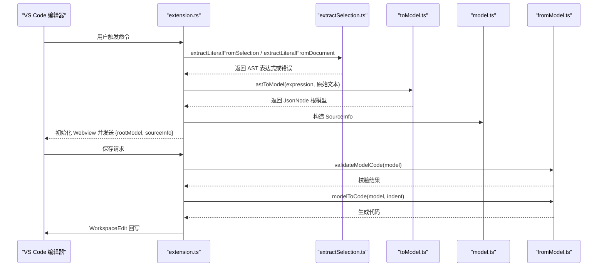
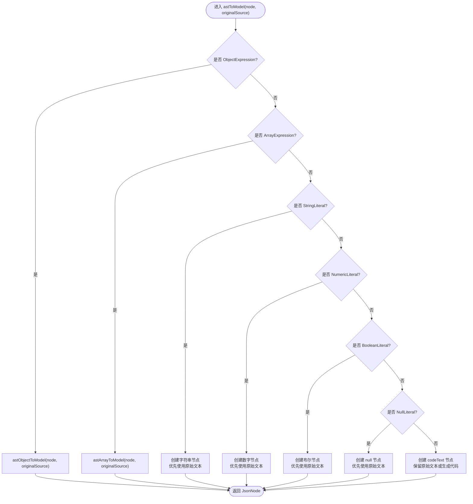
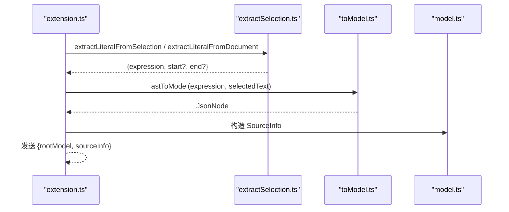
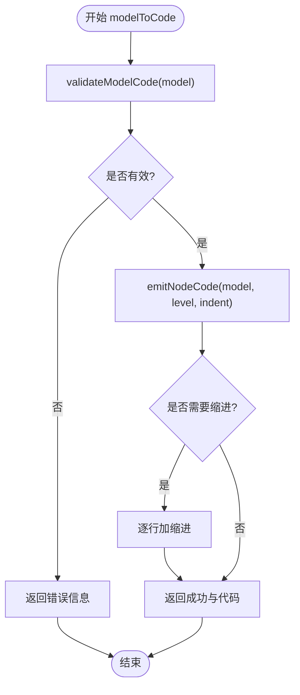
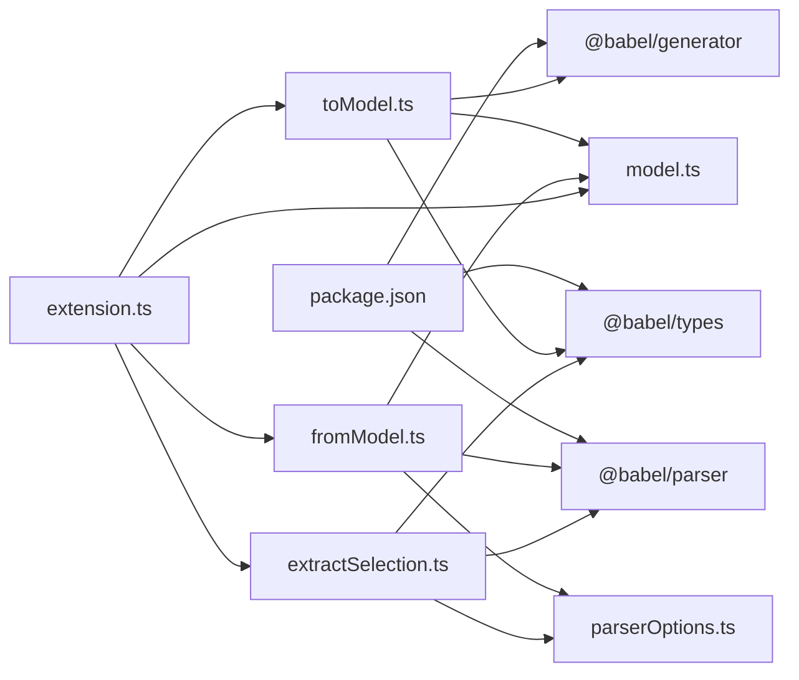

# AST 到模型转换

<cite>
**本文引用的文件**
- [src/model.ts](file://src/model.ts)
- [src/parser/toModel.ts](file://src/parser/toModel.ts)
- [src/parser/fromModel.ts](file://src/parser/fromModel.ts)
- [src/parser/extractSelection.ts](file://src/parser/extractSelection.ts)
- [src/parser/parserOptions.ts](file://src/parser/parserOptions.ts)
- [src/extension.ts](file://src/extension.ts)
- [package.json](file://package.json)
- [jsonDemo/testData.js](file://jsonDemo/testData.js)
</cite>

## 目录
1. [简介](#简介)
2. [项目结构](#项目结构)
3. [核心组件](#核心组件)
4. [架构总览](#架构总览)
5. [详细组件分析](#详细组件分析)
6. [依赖关系分析](#依赖关系分析)
7. [性能考量](#性能考量)
8. [故障排查指南](#故障排查指南)
9. [结论](#结论)
10. [附录](#附录)

## 简介
本文件面向 wysJSON 扩展的 AST 到中间模型转换模块，系统性阐述如何将 Babel AST 节点转换为 JsonNode 中间模型，并说明 JsonNode 的数据结构设计、节点类型映射规则与属性提取算法。文档还涵盖递归遍历策略、类型检查机制、错误恢复处理、SourceInfo 元数据生成与维护，以及对函数调用、模板字符串、注释等特殊表达式的处理方式。文中所有技术细节均基于仓库源码进行分析与总结。

## 项目结构
该模块位于 src/parser 目录下，配合 src/model.ts 定义的 JsonNode 类型与 SourceInfo 元数据，以及 src/extension.ts 的入口流程，共同完成从选区/光标位置提取对象/数组字面量，到 AST 转换为中间模型，再到代码生成回写的工作流。



图表来源
- [src/extension.ts:1-600](file://src/extension.ts#L1-L600)
- [src/parser/extractSelection.ts:1-385](file://src/parser/extractSelection.ts#L1-L385)
- [src/parser/parserOptions.ts:1-36](file://src/parser/parserOptions.ts#L1-L36)
- [src/parser/toModel.ts:1-230](file://src/parser/toModel.ts#L1-L230)
- [src/model.ts:1-103](file://src/model.ts#L1-L103)
- [src/parser/fromModel.ts:1-305](file://src/parser/fromModel.ts#L1-L305)

章节来源
- [src/extension.ts:1-600](file://src/extension.ts#L1-L600)
- [src/parser/extractSelection.ts:1-385](file://src/parser/extractSelection.ts#L1-L385)
- [src/parser/parserOptions.ts:1-36](file://src/parser/parserOptions.ts#L1-L36)
- [src/parser/toModel.ts:1-230](file://src/parser/toModel.ts#L1-L230)
- [src/model.ts:1-103](file://src/model.ts#L1-L103)
- [src/parser/fromModel.ts:1-305](file://src/parser/fromModel.ts#L1-L305)

## 核心组件
- JsonNode 中间模型：统一承载对象、数组、基本类型与代码文本节点，提供可编辑性、写回模式、原始文本与分类标记等元信息。
- SourceInfo 元数据：记录选区范围、文档版本、缩进、原始行等，用于安全回写与定位。
- AST 提取：从选区或光标位置提取对象/数组字面量，支持多种上下文（JS/TS、Markdown 代码块、纯文本）。
- AST 到模型转换：将 Babel AST 节点映射为 JsonNode，保留原始文本以便回写。
- 模型到代码生成：校验代码文本节点合法性并生成最终代码，支持缩进与多行格式化。

章节来源
- [src/model.ts:6-103](file://src/model.ts#L6-L103)
- [src/parser/extractSelection.ts:1-385](file://src/parser/extractSelection.ts#L1-L385)
- [src/parser/toModel.ts:1-230](file://src/parser/toModel.ts#L1-L230)
- [src/parser/fromModel.ts:1-305](file://src/parser/fromModel.ts#L1-L305)

## 架构总览
下图展示了从 VS Code 编辑器到 AST 提取、模型转换、代码生成与回写的完整流程。



图表来源
- [src/extension.ts:46-378](file://src/extension.ts#L46-L378)
- [src/parser/extractSelection.ts:34-101](file://src/parser/extractSelection.ts#L34-L101)
- [src/parser/toModel.ts:10-90](file://src/parser/toModel.ts#L10-L90)
- [src/model.ts:39-54](file://src/model.ts#L39-L54)
- [src/parser/fromModel.ts:20-57](file://src/parser/fromModel.ts#L20-L57)

## 详细组件分析

### JsonNode 数据结构设计
JsonNode 是中间模型的核心抽象，统一承载以下能力：
- 节点种类：对象、数组、字符串、数字、布尔、null、代码文本。
- 原始文本保留：raw/originalRaw 用于回写时保持原格式与注释。
- 分类标记：sourceKind 标识“json”、“code”、“objectMethod”、“spread”，用于区分写回策略。
- 可编辑性与写回模式：editable/writeMode 决定 UI 是否允许直接编辑及写回方式。
- 结构化子节点：对象节点 children，数组节点 items。
- 警告信息：warning 用于提示用户修改后的语法有效性。

```mermaid
classDiagram
class JsonNode {
+kind : JsonNodeKind
+value : any
+raw? : string
+originalRaw? : string
+sourceKind? : "json"|"code"|"objectMethod"|"spread"
+editable : boolean
+writeMode : "json"|"code"
+warning? : string
+children? : Record<string, JsonNode>
+items? : JsonNode[]
}
class SourceInfo {
+uri : string
+selectedText : string
+start : {line : number, character : number}
+end : {line : number, character : number}
+version : number
+indent : string
+originalLines? : string[]
}
JsonNode --> SourceInfo : "由扩展入口构造"
```

图表来源
- [src/model.ts:6-54](file://src/model.ts#L6-L54)

章节来源
- [src/model.ts:6-54](file://src/model.ts#L6-L54)

### AST 到 JsonNode 的类型映射与属性提取
- 对象字面量（ObjectExpression）
  - 遍历 properties，支持普通属性与方法（ObjectMethod），键名支持标识符、字符串字面量、数值字面量；计算属性降级为代码文本。
  - 方法节点以“objectMethod”分类保留为代码文本，数组中扩展运算符（SpreadElement）以“spread”分类并禁用编辑。
- 数组字面量（ArrayExpression）
  - 遍历 elements，空洞（holes）映射为 null 节点；扩展运算符映射为“spread”代码文本节点。
- 基本字面量
  - 字符串、数字、布尔、null 字面量分别映射为对应 kind，并优先使用原始文本（node.extra?.raw 或原始 source slice）。
- 其他表达式
  - 函数、日期、符号、标识符、调用表达式等统一封装为“codeText”，并设置 warning 提示语法有效性风险。



图表来源
- [src/parser/toModel.ts:10-90](file://src/parser/toModel.ts#L10-L90)
- [src/parser/toModel.ts:92-158](file://src/parser/toModel.ts#L92-L158)
- [src/parser/toModel.ts:160-209](file://src/parser/toModel.ts#L160-L209)

章节来源
- [src/parser/toModel.ts:10-90](file://src/parser/toModel.ts#L10-L90)
- [src/parser/toModel.ts:92-158](file://src/parser/toModel.ts#L92-L158)
- [src/parser/toModel.ts:160-209](file://src/parser/toModel.ts#L160-L209)

### 递归遍历策略与键名处理
- 对象属性遍历：支持标识符、字符串字面量、数值字面量作为键；计算属性通过 Babel 生成代码作为键名。
- 数组元素遍历：按索引顺序处理，空洞映射为 null 节点，扩展运算符映射为“spread”代码文本节点。
- 子树递归：对象与数组节点的 children/items 递归调用 astToModel，确保深层结构完整转换。

章节来源
- [src/parser/toModel.ts:92-158](file://src/parser/toModel.ts#L92-L158)
- [src/parser/toModel.ts:160-209](file://src/parser/toModel.ts#L160-L209)

### 原始文本提取与 SourceInfo 维护
- 原始文本提取：getNodeRaw(node, originalSource) 基于 node.start/end 在 originalSource 上切片，若越界则回退为生成代码。
- SourceInfo 构造：扩展入口在提取成功后构建 SourceInfo，包含 URI、选区文本、行列坐标、文档版本、缩进与原始行，用于后续安全回写与定位。



图表来源
- [src/extension.ts:126-147](file://src/extension.ts#L126-L147)
- [src/parser/toModel.ts:211-229](file://src/parser/toModel.ts#L211-L229)
- [src/parser/extractSelection.ts:108-229](file://src/parser/extractSelection.ts#L108-L229)

章节来源
- [src/parser/toModel.ts:211-229](file://src/parser/toModel.ts#L211-L229)
- [src/extension.ts:126-147](file://src/extension.ts#L126-L147)
- [src/parser/extractSelection.ts:108-229](file://src/parser/extractSelection.ts#L108-L229)

### 特殊表达式处理
- 函数调用、箭头函数、类、装饰器、模板字符串等：统一封装为“codeText”节点，保留原始文本或通过 Babel 生成代码，同时设置 warning 提示语法有效性风险。
- 对象方法：ObjectMethod 以“objectMethod”分类保留为代码文本，支持简单校验以判断是否为合法方法定义。
- 注释与模板字符串：在 AST 层面被解析为相应节点类型；转换为 JsonNode 时，注释不会被保留为结构化节点，但原始文本会尽可能保留以维持回写一致性。

章节来源
- [src/parser/toModel.ts:77-90](file://src/parser/toModel.ts#L77-L90)
- [src/parser/fromModel.ts:277-300](file://src/parser/fromModel.ts#L277-L300)

### 类型检查与错误恢复
- 模型到代码生成前的校验：validateModelCode 递归检查所有“codeText”节点，要求非空且能通过 Babel 表达式解析；对象方法通过 looksLikeObjectMethod 与 tryParseObjectMethod 辅助判断。
- 错误恢复：捕获异常并返回带错误信息的结果；SourceInfo 版本校验防止并发修改导致的覆盖冲突。



图表来源
- [src/parser/fromModel.ts:20-57](file://src/parser/fromModel.ts#L20-L57)
- [src/parser/fromModel.ts:67-90](file://src/parser/fromModel.ts#L67-L90)
- [src/parser/fromModel.ts:92-117](file://src/parser/fromModel.ts#L92-L117)

章节来源
- [src/parser/fromModel.ts:20-57](file://src/parser/fromModel.ts#L20-L57)
- [src/parser/fromModel.ts:67-117](file://src/parser/fromModel.ts#L67-L117)
- [src/extension.ts:420-490](file://src/extension.ts#L420-L490)

### 代码生成与回写
- 生成策略：根据 JsonNode.kind 选择对应 emit* 函数；对象与数组采用缩进格式化，键名自动判断是否需要引号；多行代码文本保持换行格式。
- 回写流程：扩展入口在保存时应用 WorkspaceEdit，替换 SourceInfo 指定范围内的文本，确保与文档版本一致。

章节来源
- [src/parser/fromModel.ts:119-180](file://src/parser/fromModel.ts#L119-L180)
- [src/parser/fromModel.ts:182-245](file://src/parser/fromModel.ts#L182-L245)
- [src/extension.ts:420-490](file://src/extension.ts#L420-L490)

## 依赖关系分析
- 外部库依赖：@babel/parser、@babel/generator、@babel/types。
- 内部模块依赖：toModel.ts 依赖 @babel/types 与 @babel/generator；fromModel.ts 依赖 @babel/parser 与 toModel.ts 的类型；extractSelection.ts 依赖 @babel/parser 与 @babel/types；parserOptions.ts 提供通用解析选项。



图表来源
- [package.json:77-91](file://package.json#L77-L91)
- [src/parser/toModel.ts:6-8](file://src/parser/toModel.ts#L6-L8)
- [src/parser/fromModel.ts:6-8](file://src/parser/fromModel.ts#L6-L8)
- [src/parser/extractSelection.ts:6-11](file://src/parser/extractSelection.ts#L6-L11)
- [src/parser/parserOptions.ts:1-36](file://src/parser/parserOptions.ts#L1-L36)
- [src/extension.ts:8-15](file://src/extension.ts#L8-L15)

章节来源
- [package.json:77-91](file://package.json#L77-L91)
- [src/parser/toModel.ts:6-8](file://src/parser/toModel.ts#L6-L8)
- [src/parser/fromModel.ts:6-8](file://src/parser/fromModel.ts#L6-L8)
- [src/parser/extractSelection.ts:6-11](file://src/parser/extractSelection.ts#L6-L11)
- [src/parser/parserOptions.ts:1-36](file://src/parser/parserOptions.ts#L1-L36)
- [src/extension.ts:8-15](file://src/extension.ts#L8-L15)

## 性能考量
- AST 遍历复杂度：对象与数组节点的遍历复杂度为 O(N)，其中 N 为属性/元素数量；整体复杂度与 AST 节点总数成正比。
- 原始文本切片：getNodeRaw 仅进行字符串切片，时间复杂度 O(L)，L 为切片长度；越界保护避免无效操作。
- 代码生成：emitNodeCode 递归遍历模型，时间复杂度 O(M)，M 为 JsonNode 节点数；缩进与换行处理为线性扫描。
- 解析选项复用：parserOptions.ts 提供统一的解析插件与选项，减少重复配置开销。

[本节为一般性指导，无需特定文件来源]

## 故障排查指南
- 选区提取失败
  - 症状：提示“选区为空”、“未找到对象或数组字面量”、“找到多个候选对象/数组字面量”。
  - 排查：确认选区是否为对象/数组字面量或包含其的变量声明；避免包含多个字面量。
  - 参考路径：[src/parser/extractSelection.ts:34-101](file://src/parser/extractSelection.ts#L34-L101)
- AST 转模型失败
  - 症状：转换模型失败的错误消息。
  - 排查：检查传入的 AST 是否为对象/数组字面量；确认 originalSource 与 node.start/end 匹配。
  - 参考路径：[src/parser/toModel.ts:10-90](file://src/parser/toModel.ts#L10-L90)
- 代码生成失败
  - 症状：代码生成失败或包含无效的代码文本。
  - 排查：检查 JsonNode 中“codeText”节点内容是否为空或语法无效；对象方法需符合合法定义。
  - 参考路径：[src/parser/fromModel.ts:20-57](file://src/parser/fromModel.ts#L20-L57), [src/parser/fromModel.ts:67-117](file://src/parser/fromModel.ts#L67-L117)
- 并发修改冲突
  - 症状：提示“文档已被修改，请重新打开编辑器以避免覆盖更改”。
  - 排查：保存时比较 SourceInfo.version 与当前文档版本，不一致则拒绝回写。
  - 参考路径：[src/extension.ts:420-490](file://src/extension.ts#L420-L490)

章节来源
- [src/parser/extractSelection.ts:34-101](file://src/parser/extractSelection.ts#L34-L101)
- [src/parser/toModel.ts:10-90](file://src/parser/toModel.ts#L10-L90)
- [src/parser/fromModel.ts:20-57](file://src/parser/fromModel.ts#L20-L57)
- [src/extension.ts:420-490](file://src/extension.ts#L420-L490)

## 结论
本模块通过清晰的数据结构与严格的类型映射，实现了从 Babel AST 到 JsonNode 中间模型的稳健转换。它兼顾了 JSON 与 JavaScript 表达式的兼容性，保留原始文本以确保回写的准确性，并通过 SourceInfo 与版本控制保障并发安全。配套的类型检查与错误恢复机制进一步提升了用户体验与可靠性。

[本节为总结性内容，无需特定文件来源]

## 附录
- 示例数据参考：jsonDemo/testData.js 展示了混合 JSON 与函数、箭头函数、对象方法、BigInt、Symbol 等表达式，可用于验证转换与生成逻辑。
- 关键实现路径参考：
  - AST 到模型：[src/parser/toModel.ts:10-229](file://src/parser/toModel.ts#L10-L229)
  - 模型到代码：[src/parser/fromModel.ts:20-305](file://src/parser/fromModel.ts#L20-L305)
  - 选区提取：[src/parser/extractSelection.ts:34-385](file://src/parser/extractSelection.ts#L34-L385)
  - 类型定义：[src/model.ts:6-103](file://src/model.ts#L6-L103)
  - 扩展入口：[src/extension.ts:46-378](file://src/extension.ts#L46-L378)

章节来源
- [jsonDemo/testData.js:1-104](file://jsonDemo/testData.js#L1-L104)
- [src/parser/toModel.ts:10-229](file://src/parser/toModel.ts#L10-L229)
- [src/parser/fromModel.ts:20-305](file://src/parser/fromModel.ts#L20-L305)
- [src/parser/extractSelection.ts:34-385](file://src/parser/extractSelection.ts#L34-L385)
- [src/model.ts:6-103](file://src/model.ts#L6-L103)
- [src/extension.ts:46-378](file://src/extension.ts#L46-L378)