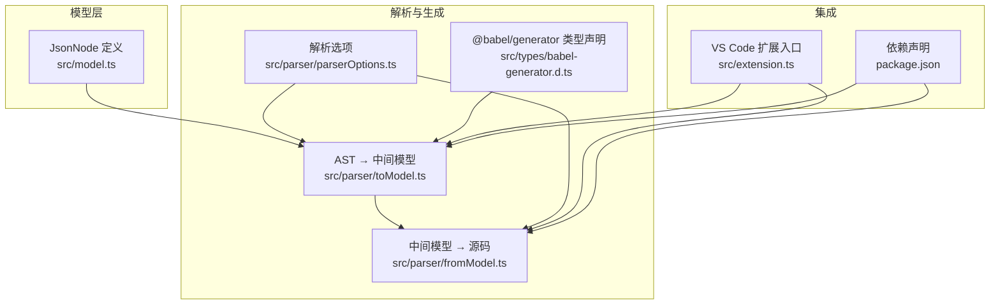
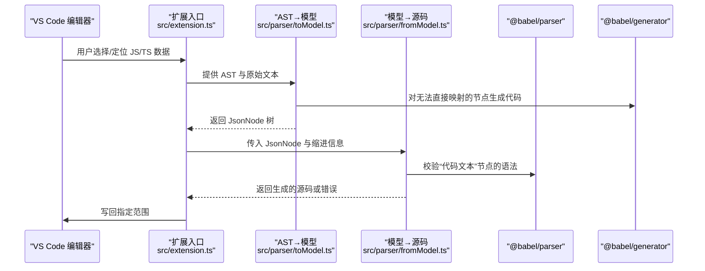
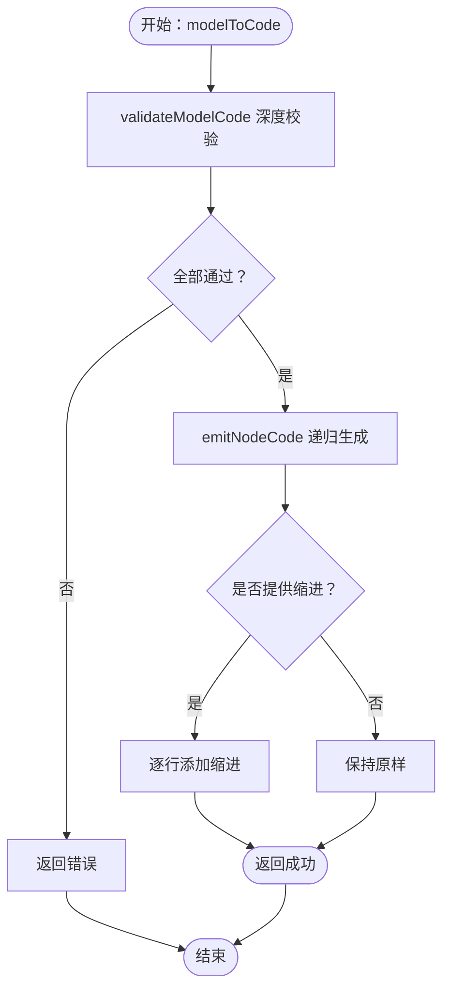
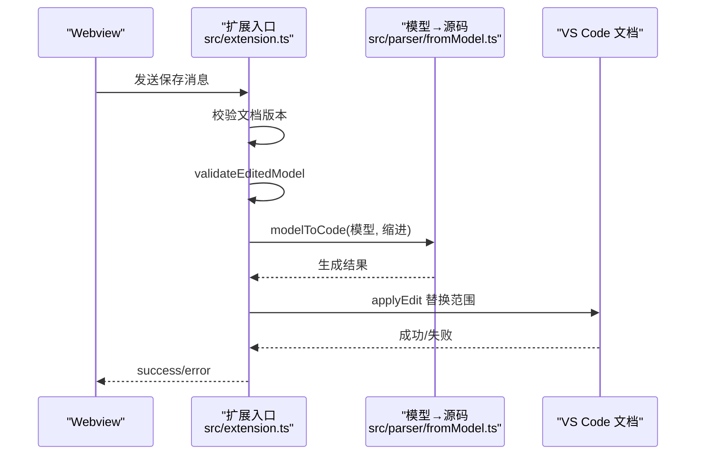
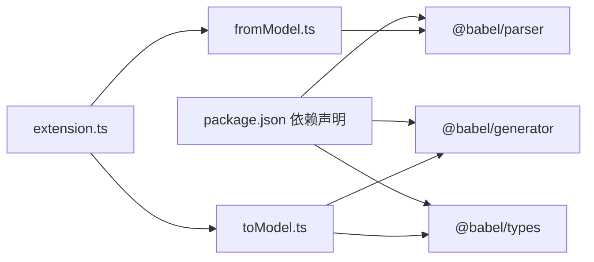

# 代码生成模块

<cite>
**本文引用的文件**
- [src/model.ts](file://src/model.ts)
- [src/parser/fromModel.ts](file://src/parser/fromModel.ts)
- [src/parser/toModel.ts](file://src/parser/toModel.ts)
- [src/parser/parserOptions.ts](file://src/parser/parserOptions.ts)
- [src/times/babel-generator.d.ts](file://src/types/babel-generator.d.ts)
- [src/extension.ts](file://src/extension.ts)
- [package.json](file://package.json)
- [jsonDemo/001.json](file://jsonDemo/001.json)
- [jsonDemo/testData.js](file://jsonDemo/testData.js)
</cite>

## 目录
1. [简介](#简介)
2. [项目结构](#项目结构)
3. [核心组件](#核心组件)
4. [架构总览](#架构总览)
5. [详细组件分析](#详细组件分析)
6. [依赖关系分析](#依赖关系分析)
7. [性能考量](#性能考量)
8. [故障排查指南](#故障排查指南)
9. [结论](#结论)
10. [附录](#附录)

## 简介
本文件系统性阐述 wysJSON 代码生成模块的设计与实现，重点说明如何将中间模型（JsonNode）逆向转换为可编译的 JavaScript 代码。内容涵盖：
- 使用 @babel/generator 进行 AST 到代码的生成策略与注意事项
- JsonNode 到 AST 节点的逆向转换流程（对象属性、数组元素、基本类型）
- 代码生成策略、格式化规则、缩进与换行控制
- 特殊字符转义、语法验证与错误处理机制
- 回退策略与可读性保障

## 项目结构
与代码生成直接相关的模块分布如下：
- 中间模型定义：src/model.ts
- AST 到中间模型转换：src/parser/toModel.ts（使用 @babel/generator）
- 中间模型到源码生成：src/parser/fromModel.ts（使用 @babel/parser 验证）
- 公共解析选项：src/parser/parserOptions.ts
- 类型声明：src/types/babel-generator.d.ts
- 扩展入口与写回逻辑：src/extension.ts
- 依赖声明：package.json
- 示例数据：jsonDemo/*.json, jsonDemo/*.js

图表来源
- [src/model.ts:1-103](file://src/model.ts#L1-L103)
- [src/parser/toModel.ts:1-230](file://src/parser/toModel.ts#L1-L230)
- [src/parser/fromModel.ts:1-305](file://src/parser/fromModel.ts#L1-L305)
- [src/parser/parserOptions.ts:1-36](file://src/parser/parserOptions.ts#L1-L36)
- [src/types/babel-generator.d.ts:1-28](file://src/types/babel-generator.d.ts#L1-L28)
- [src/extension.ts:1-600](file://src/extension.ts#L1-L600)
- [package.json:1-93](file://package.json#L1-L93)

章节来源
- [src/model.ts:1-103](file://src/model.ts#L1-L103)
- [src/parser/toModel.ts:1-230](file://src/parser/toModel.ts#L1-L230)
- [src/parser/fromModel.ts:1-305](file://src/parser/fromModel.ts#L1-L305)
- [src/parser/parserOptions.ts:1-36](file://src/parser/parserOptions.ts#L1-L36)
- [src/types/babel-generator.d.ts:1-28](file://src/types/babel-generator.d.ts#L1-L28)
- [src/extension.ts:1-600](file://src/extension.ts#L1-L600)
- [package.json:1-93](file://package.json#L1-L93)

## 核心组件
- JsonNode 中间模型：统一表示对象、数组、字符串、数字、布尔、null、以及“代码文本”等节点类型，并携带原始代码片段、来源类别、是否可编辑、写回模式等元信息。
- AST 到中间模型（toModel）：基于 @babel/types 识别节点类型，将对象属性、数组元素、基本字面量映射为 JsonNode；对非 JSON 表达式（函数、日期、符号、标识符、调用等）保留为“代码文本”节点，以便后续编辑与回写。
- 中间模型到源码（fromModel）：递归遍历 JsonNode，按 kind 输出对应代码；对“代码文本”节点进行语法校验；支持对象/数组的多行格式化与缩进；提供统一的错误返回与回退策略。

章节来源
- [src/model.ts:6-34](file://src/model.ts#L6-L34)
- [src/parser/toModel.ts:10-90](file://src/parser/toModel.ts#L10-L90)
- [src/parser/fromModel.ts:10-57](file://src/parser/fromModel.ts#L10-L57)

## 架构总览
从 AST 到源码的端到端流程如下：

图表来源
- [src/extension.ts:420-490](file://src/extension.ts#L420-L490)
- [src/parser/toModel.ts:77-90](file://src/parser/toModel.ts#L77-L90)
- [src/parser/fromModel.ts:20-57](file://src/parser/fromModel.ts#L20-L57)

## 详细组件分析

### 组件一：AST 到中间模型（toModel）
职责与策略：
- 基于 @babel/types 区分对象、数组、字符串、数值、布尔、null 等字面量，构造对应的 JsonNode，并尽可能保留原始 raw 文本。
- 对对象属性键（key）进行识别：标识符、字符串字面量、数值字面量；其他（计算属性等）通过 @babel/generator 生成代码作为键。
- 对对象方法（ObjectMethod）与扩展运算符（SpreadElement）分别处理：前者保留为“代码文本”节点并标注 sourceKind 为 objectMethod；后者保留为“代码文本”节点并标注 sourceKind 为 spread，且不可编辑。
- 对数组中的空洞（hole）构造 kind 为 null 的节点；扩展运算符同上处理。
- 其他无法直接映射的节点（函数、Date、Symbol、Identifier、CallExpression 等）统一保留为 kind 为 codeText 的节点，写回模式为 code，并附带警告提示。

关键实现要点：
- getNodeRaw：优先从原始文本中截取节点范围，保证写回时尽量复用原格式。
- generate：用于无法直接映射节点的代码生成，确保“代码文本”节点具备可回写的源码。

章节来源
- [src/parser/toModel.ts:10-90](file://src/parser/toModel.ts#L10-L90)
- [src/parser/toModel.ts:92-158](file://src/parser/toModel.ts#L92-L158)
- [src/parser/toModel.ts:160-209](file://src/parser/toModel.ts#L160-L209)
- [src/parser/toModel.ts:211-230](file://src/parser/toModel.ts#L211-L230)

### 组件二：中间模型到源码（fromModel）
职责与策略：
- 顶层 modelToCode：先递归校验所有“代码文本”节点的语法有效性，再生成代码；支持传入基础缩进，对生成结果逐行添加缩进。
- validateModelCode：深度遍历模型，遇到 codeText 节点时，先判断是否为“对象方法”形式，若是则尝试包裹解析；否则使用 @babel/parser 的表达式解析器进行语法校验。
- emitNodeCode：根据 kind 输出对应代码；字符串使用 JSON.stringify；数字对无穷大/NaN 做兜底；布尔与 null 直接输出；codeText 输出原始 raw 或 value；对象与数组进入专门的 emitObjectCode/emitArrayCode。
- 对象与数组的格式化：使用 getIndent 计算当前层级与子层级缩进，逐项拼接逗号与换行，形成美观的多行结构；对“代码文本”节点内含换行的情况，采用缩进块处理，保持可读性。
- 辅助函数：
  - formatObjectKey：若键为合法标识符则直接输出，否则使用 JSON.stringify 包裹。
  - indentCodeTextProperty/indentRawBlock：对多行“代码文本”属性与块进行缩进对齐。
  - looksLikeObjectMethod/tryParseObjectMethod：识别并验证对象方法形式的代码文本。
  - getIndent：基于基础缩进与层级计算缩进字符串。

图表来源
- [src/parser/fromModel.ts:20-57](file://src/parser/fromModel.ts#L20-L57)
- [src/parser/fromModel.ts:67-90](file://src/parser/fromModel.ts#L67-L90)
- [src/parser/fromModel.ts:119-142](file://src/parser/fromModel.ts#L119-L142)
- [src/parser/fromModel.ts:144-180](file://src/parser/fromModel.ts#L144-L180)
- [src/parser/fromModel.ts:255-275](file://src/parser/fromModel.ts#L255-L275)

章节来源
- [src/parser/fromModel.ts:10-57](file://src/parser/fromModel.ts#L10-L57)
- [src/parser/fromModel.ts:67-117](file://src/parser/fromModel.ts#L67-L117)
- [src/parser/fromModel.ts:119-180](file://src/parser/fromModel.ts#L119-L180)
- [src/parser/fromModel.ts:255-304](file://src/parser/fromModel.ts#L255-L304)

### 组件三：公共解析选项（parserOptions）
- 统一的 @babel/parser 插件集合，覆盖 JSX、TypeScript、类属性/私有成员/私有方法、装饰器、对象展开、可选链、空合并、BigInt、顶层 await、import attributes 等特性，确保解析兼容性。
- 表达式解析与完整程序解析共享同一组插件配置，便于跨场景使用。

章节来源
- [src/parser/parserOptions.ts:3-18](file://src/parser/parserOptions.ts#L3-L18)
- [src/parser/parserOptions.ts:20-35](file://src/parser/parserOptions.ts#L20-L35)

### 组件四：类型声明（babel-generator）
- 为 @babel/generator 提供类型声明，明确 generate 函数签名与返回值结构，便于 TypeScript 推断与静态检查。

章节来源
- [src/types/babel-generator.d.ts:1-28](file://src/types/babel-generator.d.ts#L1-L28)

### 组件五：扩展集成与写回（extension）
- 在保存流程中，先对编辑后的模型执行 validateEditedModel（即 validateModelCode），通过后再调用 modelToCode 生成代码，最后通过 WorkspaceEdit 将生成代码写回到文档指定范围。
- 若文档版本发生变化或写回失败，会通过消息通道反馈错误。

图表来源
- [src/extension.ts:420-490](file://src/extension.ts#L420-L490)
- [src/parser/fromModel.ts:20-57](file://src/parser/fromModel.ts#L20-L57)

章节来源
- [src/extension.ts:420-490](file://src/extension.ts#L420-L490)

## 依赖关系分析
- @babel/generator：用于将 AST 节点转换为代码字符串，广泛用于 toModel 中对“无法直接映射”的节点生成代码。
- @babel/parser：用于 fromModel 中对“代码文本”节点进行语法校验，确保生成的代码有效。
- @babel/types：用于 toModel 中对 AST 节点进行类型判断与属性访问。
- package.json 声明了上述依赖版本，确保工具链一致性。

图表来源
- [package.json:77-91](file://package.json#L77-L91)
- [src/parser/toModel.ts:6-8](file://src/parser/toModel.ts#L6-L8)
- [src/parser/fromModel.ts:6-8](file://src/parser/fromModel.ts#L6-L8)
- [src/extension.ts:8-14](file://src/extension.ts#L8-L14)

章节来源
- [package.json:77-91](file://package.json#L77-L91)
- [src/parser/toModel.ts:6-8](file://src/parser/toModel.ts#L6-L8)
- [src/parser/fromModel.ts:6-8](file://src/parser/fromModel.ts#L6-L8)
- [src/extension.ts:8-14](file://src/extension.ts#L8-L14)

## 性能考量
- 递归遍历：fromModel 的 emitNodeCode 与 validateModelCode 为 O(N) 遍历，N 为节点总数；对象/数组的多行格式化为线性拼接，整体复杂度可控。
- 缩进与换行：逐行 split/join 的方式在大对象/数组上可能产生较多临时字符串；建议在大规模数据场景下考虑批量拼接或流式缓冲优化。
- 语法校验：对每个 codeText 节点进行 @babel/parser 表达式解析，复杂度与节点代码长度成正比；可通过缓存或延迟校验减少重复开销。
- 原始文本复用：toModel 的 getNodeRaw 优先从原始文本截取，避免不必要的 generate 调用，有助于减少格式漂移与性能损耗。

## 故障排查指南
常见问题与处理：
- “代码文本节点包含无效的 JavaScript 代码”
  - 触发点：fromModel.validateModelCode 校验失败
  - 处理：检查节点的 raw/value 是否为空；确认是否为对象方法形式但解析失败；修正语法后重试
- “代码生成失败”
  - 触发点：fromModel 顶层 try/catch 捕获异常
  - 处理：查看具体错误消息；确认中间模型结构是否完整；避免在对象/数组中混入非法节点
- “写回编辑器失败”
  - 触发点：applyEdit 返回失败或文档版本不一致
  - 处理：提示用户重新打开编辑器；避免在写回期间频繁修改文档；检查 WorkspaceEdit 范围是否正确

章节来源
- [src/parser/fromModel.ts:24-56](file://src/parser/fromModel.ts#L24-L56)
- [src/extension.ts:424-486](file://src/extension.ts#L424-L486)

## 结论
代码生成模块通过“AST→中间模型→源码”的双阶段设计，既保证了对复杂 JavaScript 表达式的兼容性，又提供了良好的可编辑性与可读性。借助 @babel/generator 与 @babel/parser 的强大力量，系统实现了：
- 对 JSON 与非 JSON 的统一建模
- 对对象方法与扩展运算符的特殊处理
- 多行格式化、缩进与换行的可控输出
- 语法验证与错误回退机制
- 与 VS Code 的无缝集成与安全写回

## 附录

### 示例数据参考
- 简单 JSON 对象与嵌套数组：[jsonDemo/001.json](file://jsonDemo/001.json)
- 复杂混合数据（函数、箭头函数、对象方法、BigInt、Symbol 等）：[jsonDemo/testData.js](file://jsonDemo/testData.js)

章节来源
- [jsonDemo/001.json:1-23](file://jsonDemo/001.json#L1-L23)
- [jsonDemo/testData.js:1-104](file://jsonDemo/testData.js#L1-L104)