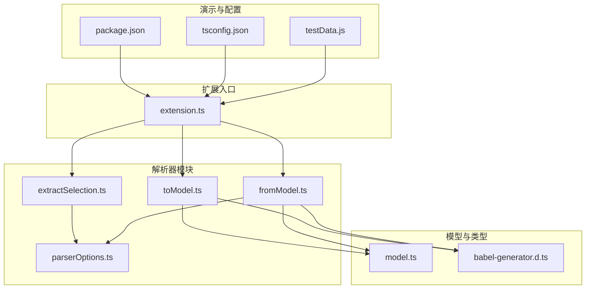
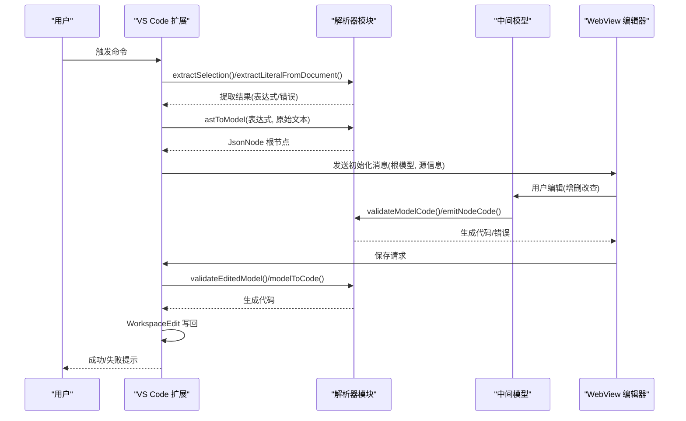
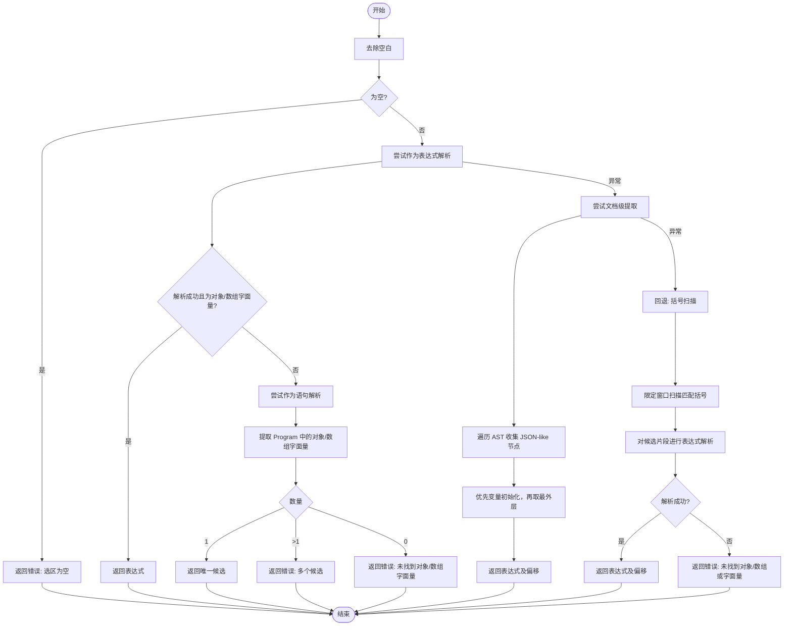
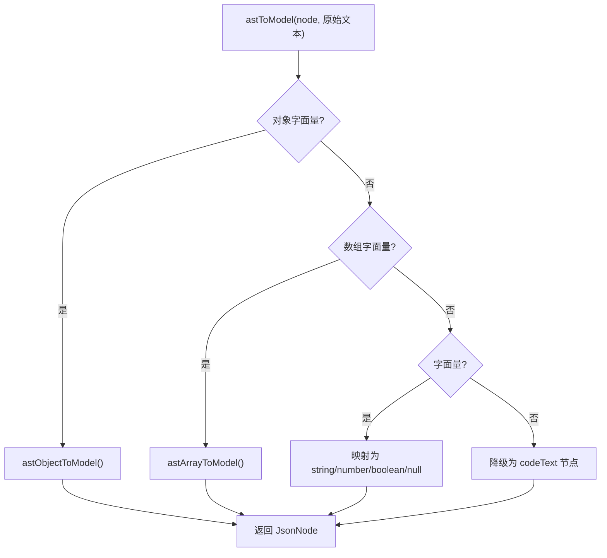
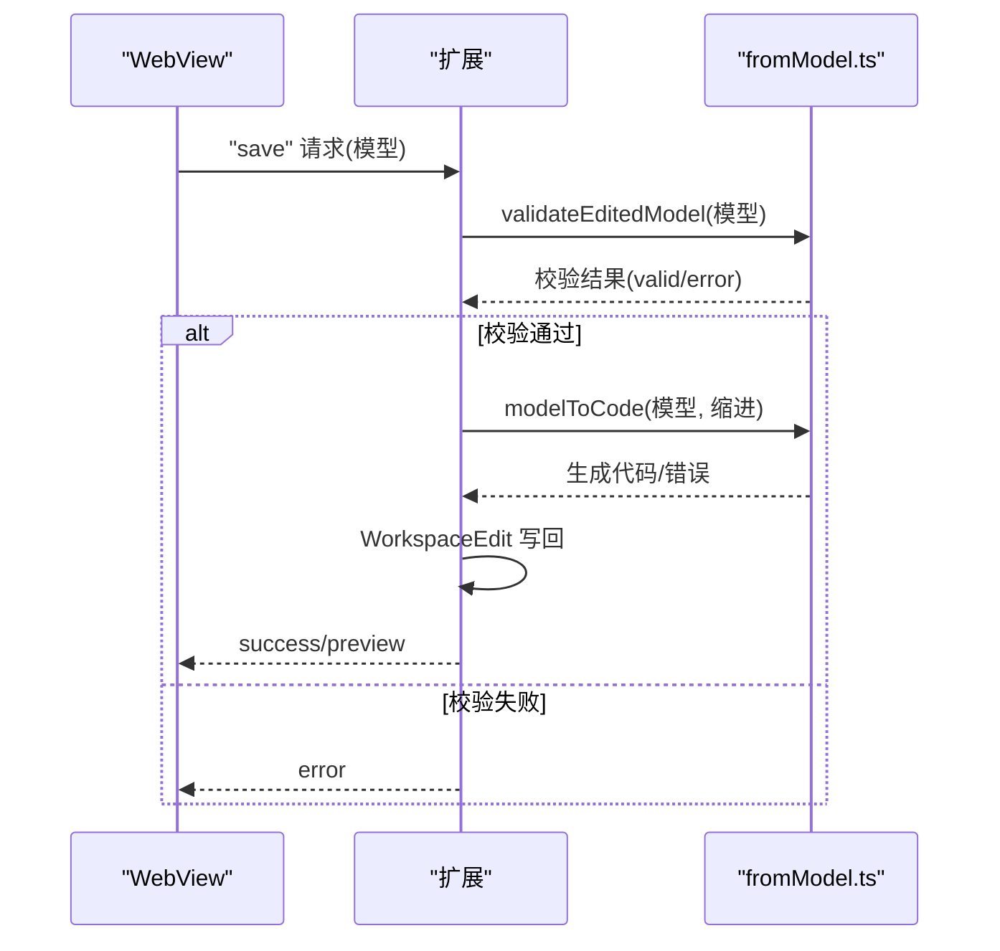
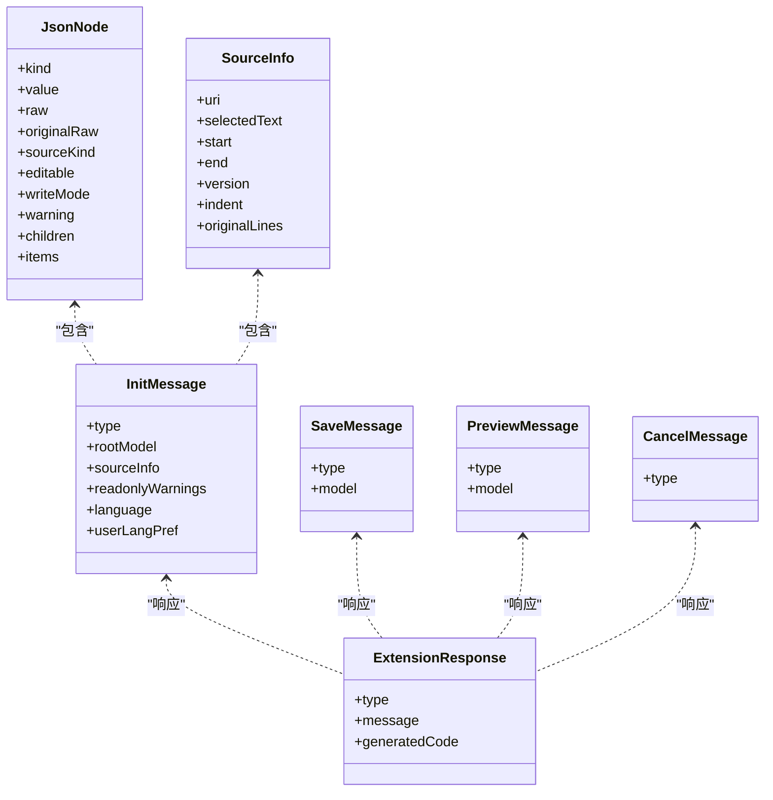
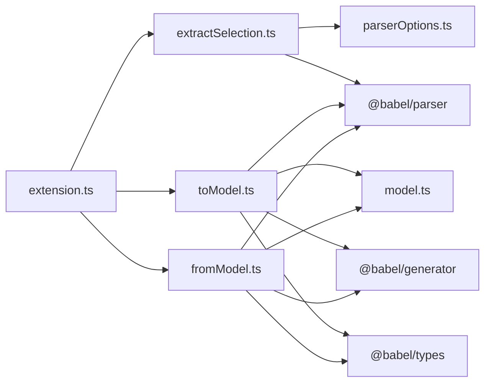

# 解析器模块详解

<cite>
**本文档引用的文件**
- [extractSelection.ts](file://src/parser/extractSelection.ts)
- [toModel.ts](file://src/parser/toModel.ts)
- [fromModel.ts](file://src/parser/fromModel.ts)
- [model.ts](file://src/model.ts)
- [parserOptions.ts](file://src/parser/parserOptions.ts)
- [extension.ts](file://src/extension.ts)
- [babel-generator.d.ts](file://src/types/babel-generator.d.ts)
- [package.json](file://package.json)
- [tsconfig.json](file://tsconfig.json)
- [testData.js](file://jsonDemo/testData.js)
</cite>

## 目录
1. [简介](#简介)
2. [项目结构](#项目结构)
3. [核心组件](#核心组件)
4. [架构总览](#架构总览)
5. [详细组件分析](#详细组件分析)
6. [依赖分析](#依赖分析)
7. [性能考量](#性能考量)
8. [故障排查指南](#故障排查指南)
9. [结论](#结论)
10. [附录](#附录)

## 简介
本技术文档围绕 JSONOKOK 扩展的解析器模块展开，系统性阐述三大核心解析器的功能与实现：
- 选区提取模块：从源代码中识别并提取 JSON 字面量（对象/数组），支持多种上下文（选区、光标位置、Markdown 代码块等）
- AST 到模型转换模块：将 Babel AST 节点转换为中间 JsonNode 模型，保留原始源码信息以便回写
- 代码生成模块：将中间模型转换回可编译的 JavaScript 代码，同时进行语法验证与格式化

文档还解释了 Babel AST 解析原理、数据类型映射规则、语法验证机制、错误处理策略、性能优化技术与扩展性考虑，并提供模块间协作关系与数据流图示。

## 项目结构
该仓库采用按功能域划分的目录结构，解析器相关代码集中在 src/parser 下，核心数据模型位于 src/model.ts，VS Code 扩展入口在 src/extension.ts，类型声明与构建配置分别在 src/types 与根目录 tsconfig.json、package.json 中。

图表来源
- [extension.ts:1-600](file://src/extension.ts#L1-L600)
- [extractSelection.ts:1-385](file://src/parser/extractSelection.ts#L1-L385)
- [toModel.ts:1-230](file://src/parser/toModel.ts#L1-L230)
- [fromModel.ts:1-305](file://src/parser/fromModel.ts#L1-L305)
- [parserOptions.ts:1-36](file://src/parser/parserOptions.ts#L1-L36)
- [model.ts:1-103](file://src/model.ts#L1-L103)
- [babel-generator.d.ts:1-28](file://src/types/babel-generator.d.ts#L1-L28)
- [package.json:1-93](file://package.json#L1-L93)
- [tsconfig.json:1-25](file://tsconfig.json#L1-L25)
- [testData.js:1-104](file://jsonDemo/testData.js#L1-L104)

章节来源
- [extension.ts:1-600](file://src/extension.ts#L1-L600)
- [package.json:1-93](file://package.json#L1-L93)
- [tsconfig.json:1-25](file://tsconfig.json#L1-L25)

## 核心组件
- 选区提取模块：提供两种提取策略
  - 基于选区的直接提取：优先尝试作为表达式解析，若失败则解析为语句并提取对象/数组字面量
  - 基于文档的光标定位提取：深度遍历 AST，优先返回最外层匹配节点；若全解析失败，则采用基于括号匹配的轻量回退策略
- AST 到模型转换模块：将 Babel AST 节点映射到 JsonNode 模型，支持对象、数组、字符串、数字、布尔、空值与代码文本节点；对对象方法与扩展运算符进行特殊处理
- 代码生成模块：将 JsonNode 模型回写为 JavaScript 源码，包含语法验证（表达式/对象方法）、缩进控制与格式化输出

章节来源
- [extractSelection.ts:24-101](file://src/parser/extractSelection.ts#L24-L101)
- [extractSelection.ts:108-229](file://src/parser/extractSelection.ts#L108-L229)
- [toModel.ts:10-90](file://src/parser/toModel.ts#L10-L90)
- [toModel.ts:92-209](file://src/parser/toModel.ts#L92-L209)
- [fromModel.ts:20-57](file://src/parser/fromModel.ts#L20-L57)
- [fromModel.ts:67-90](file://src/parser/fromModel.ts#L67-L90)

## 架构总览
解析器模块在 VS Code 扩展中通过命令触发，从当前编辑器中提取选区或光标位置的数据，转换为中间模型并在 WebView 中可视化编辑，最终将模型回写为源码。

图表来源
- [extension.ts:46-378](file://src/extension.ts#L46-L378)
- [extractSelection.ts:34-101](file://src/parser/extractSelection.ts#L34-L101)
- [extractSelection.ts:108-229](file://src/parser/extractSelection.ts#L108-L229)
- [toModel.ts:10-90](file://src/parser/toModel.ts#L10-L90)
- [fromModel.ts:20-57](file://src/parser/fromModel.ts#L20-L57)

## 详细组件分析

### 选区提取模块（extractSelection.ts）
- 功能概述
  - 支持三种提取场景：纯表达式、变量初始化、函数体/脚本范围
  - 光标定位提取：遍历 AST，优先返回最外层 JSON-like 节点；若全解析失败，采用基于括号匹配的回退策略
  - 回退策略：限定扫描窗口，忽略字符串、注释，正确处理转义字符，再对候选片段进行 Babel 表达式解析
- 关键流程
  - 直接表达式解析失败时，回退到语句解析并提取对象/数组字面量
  - 文档级提取：遍历节点收集 JSON-like 节点，优先变量初始化，再取最外层节点
  - 回退括号扫描：从光标向两侧扫描，寻找匹配的大括号/方括号，再尝试解析候选片段
- 错误处理
  - 返回统一的 ExtractionResult 结构，包含 success、error、hint、可选的 expression 与 start/end 偏移
  - 对空选区、多候选、无候选、语法错误等情况给出明确提示
- 性能优化
  - 回退扫描限制窗口大小，避免长文档全量扫描
  - 遍历 AST 时跳过 loc/start/end/range 等元信息字段，减少无效递归
- 使用模式
  - 在 VS Code 扩展中根据是否选区为空决定调用 extractLiteralFromSelection 或 extractLiteralFromDocument
  - 对 Markdown 文件支持围栏代码块内的提取与坐标转换

图表来源
- [extractSelection.ts:34-101](file://src/parser/extractSelection.ts#L34-L101)
- [extractSelection.ts:108-229](file://src/parser/extractSelection.ts#L108-L229)
- [extractSelection.ts:237-343](file://src/parser/extractSelection.ts#L237-L343)

章节来源
- [extractSelection.ts:24-101](file://src/parser/extractSelection.ts#L24-L101)
- [extractSelection.ts:108-229](file://src/parser/extractSelection.ts#L108-L229)
- [extractSelection.ts:237-343](file://src/parser/extractSelection.ts#L237-L343)

### AST 到模型转换模块（toModel.ts）
- 功能概述
  - 将 Babel AST 节点映射为 JsonNode，保留原始源码片段用于回写
  - 对对象属性键进行兼容处理（标识符、字符串字面量、数值字面量），对计算属性降级为代码文本
  - 对对象方法与扩展运算符进行特殊标记与警告
- 数据类型映射规则
  - 对象/数组：生成对应的 object/array 节点，children/items 递归转换
  - 字面量：string/number/boolean/null 直接映射，保留原始 raw
  - 其他表达式：降级为 codeText 节点，保留原始代码或通过 @babel/generator 生成
- 原始源码保留
  - 通过 getNodeRaw(node, originalSource) 从原始文本中截取对应片段，确保回写时尽可能保持原格式
- 使用模式
  - 在扩展入口中，将 extractSelection 的表达式传入 astToModel，并结合 SourceInfo 传递给 WebView

图表来源
- [toModel.ts:10-90](file://src/parser/toModel.ts#L10-L90)
- [toModel.ts:92-209](file://src/parser/toModel.ts#L92-L209)

章节来源
- [toModel.ts:10-90](file://src/parser/toModel.ts#L10-L90)
- [toModel.ts:92-209](file://src/parser/toModel.ts#L92-L209)
- [babel-generator.d.ts:1-28](file://src/types/babel-generator.d.ts#L1-L28)

### 代码生成模块（fromModel.ts）
- 功能概述
  - 将 JsonNode 模型回写为 JavaScript 源码，支持缩进控制与格式化
  - 语法验证：对 codeText 节点进行表达式解析校验，支持对象方法的特殊判断
- 关键流程
  - validateModelCode：递归校验所有 codeText 节点的有效性
  - emitNodeCode：根据节点类型生成代码，对象/数组递归处理子项
  - 对象键格式化：合法标识符直接输出，否则使用 JSON.stringify 包裹
  - 对象方法检测：通过 looksLikeObjectMethod 与 tryParseObjectMethod 判断并保留
- 输出控制
  - 支持缩进参数，逐行添加缩进
  - 对多行 codeText 进行块级缩进处理
- 使用模式
  - 在扩展入口中，接收 WebView 的保存请求，先 validateEditedModel，再 modelToCode，最后应用 WorkspaceEdit

图表来源
- [extension.ts:397-490](file://src/extension.ts#L397-L490)
- [fromModel.ts:20-57](file://src/parser/fromModel.ts#L20-L57)
- [fromModel.ts:67-90](file://src/parser/fromModel.ts#L67-L90)

章节来源
- [fromModel.ts:20-57](file://src/parser/fromModel.ts#L20-L57)
- [fromModel.ts:67-90](file://src/parser/fromModel.ts#L67-L90)
- [fromModel.ts:119-180](file://src/parser/fromModel.ts#L119-L180)
- [fromModel.ts:194-245](file://src/parser/fromModel.ts#L194-L245)
- [fromModel.ts:277-300](file://src/parser/fromModel.ts#L277-L300)

### 中间模型与数据类型（model.ts）
- JsonNode 定义
  - kind：节点类型（object/array/string/number/boolean/null/codeText）
  - value/raw/originalRaw：值与原始源码，用于回写与显示
  - sourceKind：源类别（json/code/objectMethod/spread），用于保留非 JSON 形态
  - editable/writeMode：是否可编辑与写回方式（json/code）
  - children/items：结构化节点的子节点集合
- SourceInfo 与消息协议
  - SourceInfo：记录选区位置、版本、缩进、原始行等信息
  - WebviewMessage/ExtensionResponse：扩展与 WebView 的消息契约

图表来源
- [model.ts:15-34](file://src/model.ts#L15-L34)
- [model.ts:39-54](file://src/model.ts#L39-L54)
- [model.ts:59-93](file://src/model.ts#L59-L93)
- [model.ts:98-103](file://src/model.ts#L98-L103)

章节来源
- [model.ts:15-34](file://src/model.ts#L15-L34)
- [model.ts:39-54](file://src/model.ts#L39-L54)
- [model.ts:59-93](file://src/model.ts#L59-L93)
- [model.ts:98-103](file://src/model.ts#L98-L103)

### 解析选项与 Babel 集成（parserOptions.ts）
- 统一的 Babel 解析选项
  - getCommonParseOptions/getCommonExpressionParseOptions：设置 sourceType 为 module，允许 import/export 出现在任意位置，启用 JSX、TypeScript、类属性、装饰器、对象展开、可选链、空值合并、BigInt、顶层 await、import attributes 等插件
- 作用范围
  - 选区提取模块与代码生成模块均复用这些解析选项，确保解析一致性

章节来源
- [parserOptions.ts:3-35](file://src/parser/parserOptions.ts#L3-L35)

## 依赖分析
- 外部依赖
  - @babel/parser：语法解析，支持多种语言特性
  - @babel/generator：代码生成，用于将 AST 或编辑后的节点还原为源码
  - @babel/types：AST 类型断言与节点判断
- 内部依赖
  - 扩展入口依赖解析器模块与模型定义
  - 解析器模块依赖解析选项与类型声明
- 潜在循环依赖
  - 当前模块间为单向依赖，无循环导入风险

图表来源
- [extension.ts:1-600](file://src/extension.ts#L1-L600)
- [extractSelection.ts:1-385](file://src/parser/extractSelection.ts#L1-L385)
- [toModel.ts:1-230](file://src/parser/toModel.ts#L1-L230)
- [fromModel.ts:1-305](file://src/parser/fromModel.ts#L1-L305)
- [parserOptions.ts:1-36](file://src/parser/parserOptions.ts#L1-L36)
- [model.ts:1-103](file://src/model.ts#L1-L103)
- [babel-generator.d.ts:1-28](file://src/types/babel-generator.d.ts#L1-L28)

章节来源
- [package.json:77-91](file://package.json#L77-L91)
- [extension.ts:1-600](file://src/extension.ts#L1-L600)

## 性能考量
- 选区提取
  - 全文档解析失败时采用回退策略，限定扫描窗口（默认 20000 字符），避免长文档全量解析带来的性能问题
  - 遍历 AST 时跳过 loc/start/end/range 等元信息字段，减少无效递归
- AST 转模型
  - 对对象属性键进行快速判断，计算属性降级为代码文本，避免复杂键名的额外处理
  - 仅在必要时调用 @babel/generator，优先使用原始源码片段
- 代码生成
  - 递归生成时按层级添加缩进，避免一次性拼接大量字符串
  - 对多行 codeText 进行块级缩进，提升可读性
- 并发与缓存
  - 可在扩展层引入缓存策略（如最近一次提取结果缓存），减少重复解析
  - 对大型文档建议分段处理或延迟解析

[本节为通用性能指导，无需特定文件来源]

## 故障排查指南
- 选区提取失败
  - 症状：返回“未找到对象/数组字面量”或“多个候选”
  - 排查：确认选区是否包含 {...} 或 [...]，或包含它们的变量初始化语句；避免包含函数体等非字面量内容
  - 参考路径：[extractSelection.ts:74-88](file://src/parser/extractSelection.ts#L74-L88)
- 文档级提取失败
  - 症状：全文件解析失败，回退到括号扫描仍失败
  - 排查：检查文件是否包含语法错误；对于 Markdown 围栏代码块，确认光标处于围栏内部
  - 参考路径：[extractSelection.ts:220-228](file://src/parser/extractSelection.ts#L220-L228)
- 模型转换异常
  - 症状：转换模型失败
  - 排查：确认传入的是对象/数组字面量；检查原始文本是否与 AST 节点范围一致
  - 参考路径：[extension.ts:126-131](file://src/extension.ts#L126-L131)
- 代码生成失败
  - 症状：生成代码失败或写回失败
  - 排查：检查模型中是否存在无效的 codeText 节点；确认缩进参数是否合理；确认文档版本未被修改
  - 参考路径：[fromModel.ts:51-56](file://src/parser/fromModel.ts#L51-L56)，[extension.ts:423-429](file://src/extension.ts#L423-L429)
- 语法验证失败
  - 症状：保存时报错“代码文本节点包含无效的 JavaScript 代码”
  - 排查：检查对象方法是否符合语法；确保表达式片段可被 Babel 解析
  - 参考路径：[fromModel.ts:108-116](file://src/parser/fromModel.ts#L108-L116)，[fromModel.ts:285-299](file://src/parser/fromModel.ts#L285-L299)

章节来源
- [extractSelection.ts:74-88](file://src/parser/extractSelection.ts#L74-L88)
- [extractSelection.ts:220-228](file://src/parser/extractSelection.ts#L220-L228)
- [extension.ts:126-131](file://src/extension.ts#L126-L131)
- [fromModel.ts:51-56](file://src/parser/fromModel.ts#L51-L56)
- [extension.ts:423-429](file://src/extension.ts#L423-L429)
- [fromModel.ts:108-116](file://src/parser/fromModel.ts#L108-L116)
- [fromModel.ts:285-299](file://src/parser/fromModel.ts#L285-L299)

## 结论
本解析器模块通过“选区提取—AST 转模型—代码生成”的三段式设计，实现了对 JavaScript JSON 字面量的精准识别、稳健转换与安全回写。模块间职责清晰、耦合度低，具备良好的扩展性与健壮性。通过对 Babel 的深入集成与合理的回退策略，系统能够在多种文件类型与复杂语法场景下稳定运行。未来可在缓存、增量解析与可视化编辑方面进一步优化，以提升用户体验与性能表现。

[本节为总结性内容，无需特定文件来源]

## 附录
- 使用示例与模式
  - 选区提取：在 VS Code 中右键选择 JSON 字面量，触发 JSONOKOK.openSelection 命令，自动提取并打开 WebView
  - 文档级提取：在光标位置无选区时，系统尝试定位最近的 JSON-like 节点
  - 混合内容处理：对象方法与扩展运算符将以 codeText 形式保留，编辑时需注意语法有效性
- 相关演示数据
  - 测试数据文件展示了简单对象、嵌套对象、混合类型（函数、Date、BigInt、Symbol）与数组等多种场景
  - 参考路径：[testData.js:1-104](file://jsonDemo/testData.js#L1-L104)

章节来源
- [extension.ts:46-378](file://src/extension.ts#L46-L378)
- [testData.js:1-104](file://jsonDemo/testData.js#L1-L104)