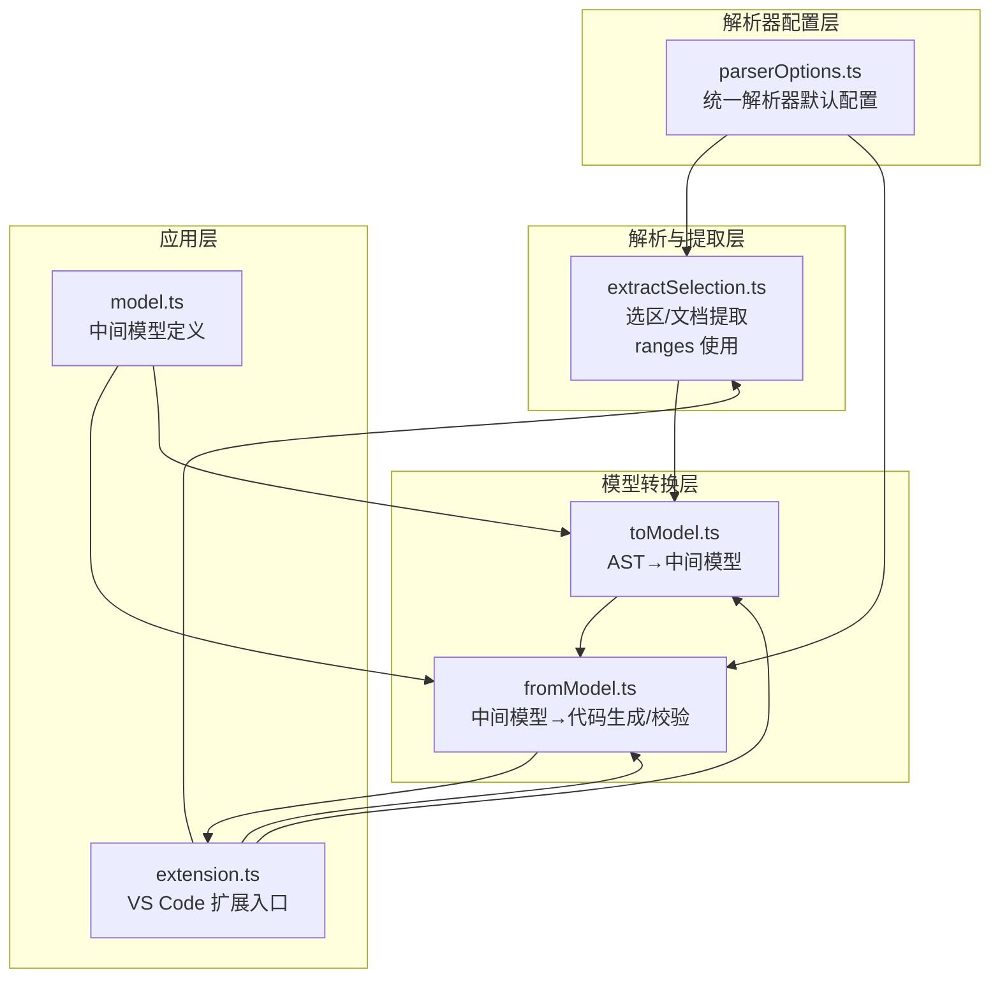
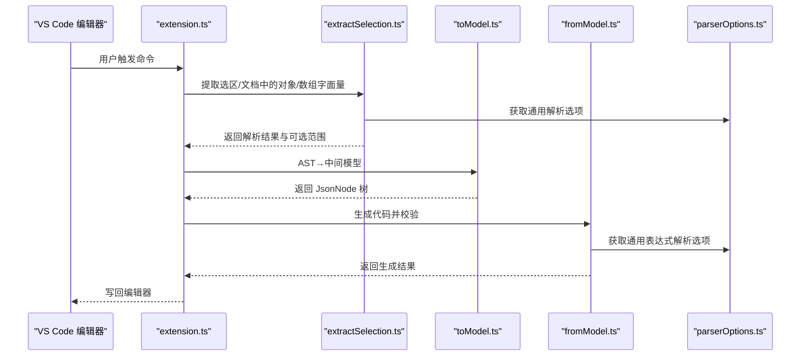
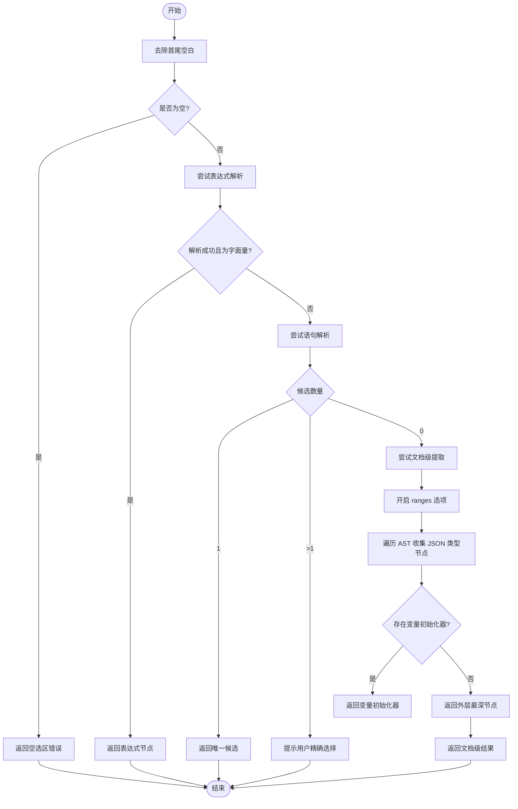
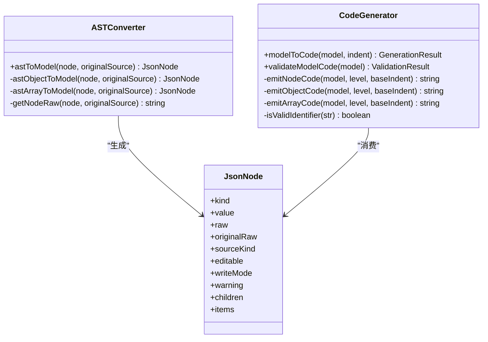
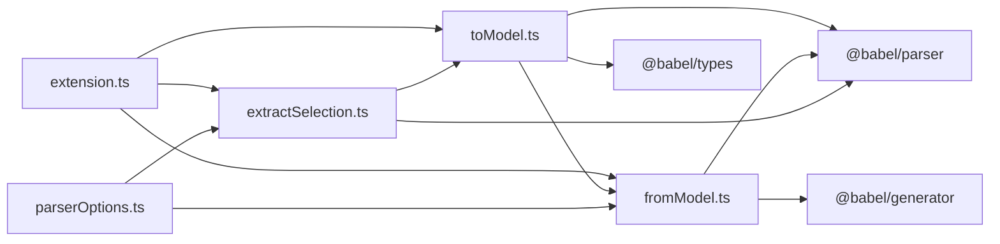

# 解析器配置选项

<cite>
**本文引用的文件**
- [parserOptions.ts](file://src/parser/parserOptions.ts)
- [extractSelection.ts](file://src/parser/extractSelection.ts)
- [fromModel.ts](file://src/parser/fromModel.ts)
- [toModel.ts](file://src/parser/toModel.ts)
- [extension.ts](file://src/extension.ts)
- [model.ts](file://src/model.ts)
- [babel-generator.d.ts](file://src/types/babel-generator.d.ts)
- [package.json](file://package.json)
</cite>

## 目录
1. [简介](#简介)
2. [项目结构](#项目结构)
3. [核心组件](#核心组件)
4. [架构总览](#架构总览)
5. [详细组件分析](#详细组件分析)
6. [依赖关系分析](#依赖关系分析)
7. [性能考量](#性能考量)
8. [故障排查指南](#故障排查指南)
9. [结论](#结论)
10. [附录：配置示例与最佳实践](#附录配置示例与最佳实践)

## 简介
本技术文档聚焦于解析器配置选项模块，系统性阐述 Babel 解析器在 JSONOKOK 扩展中的配置策略与实现细节。重点包括：
- getCommonExpressionParseOptions 与 getCommonParseOptions 的设计目的与使用场景
- 关键配置项 sourceType、plugins、ranges 的作用与影响
- 面向不同文件类型与使用场景的配置示例
- 配置对解析性能与准确性的权衡
- 扩展性设计与未来增强方向

## 项目结构
该模块位于 src/parser 下，围绕“从源码到中间模型再到回写”的完整流程展开，解析器配置贯穿以下文件：
- parserOptions.ts：统一的解析器默认配置工厂
- extractSelection.ts：选区/文档级结构化提取，涉及 ranges 选项
- fromModel.ts：中间模型到代码的生成与校验
- toModel.ts：AST 到中间模型的转换
- extension.ts：VS Code 扩展入口，协调解析与回写
- model.ts：中间模型定义
- babel-generator.d.ts：Babel 生成器类型声明
- package.json：依赖与语言能力声明

图表来源
- [parserOptions.ts:1-36](file://src/parser/parserOptions.ts#L1-L36)
- [extractSelection.ts:1-385](file://src/parser/extractSelection.ts#L1-L385)
- [fromModel.ts:1-305](file://src/parser/fromModel.ts#L1-L305)
- [toModel.ts:1-230](file://src/parser/toModel.ts#L1-L230)
- [extension.ts:1-600](file://src/extension.ts#L1-L600)
- [model.ts:1-103](file://src/model.ts#L1-L103)

章节来源
- [parserOptions.ts:1-36](file://src/parser/parserOptions.ts#L1-L36)
- [extractSelection.ts:1-385](file://src/parser/extractSelection.ts#L1-L385)
- [fromModel.ts:1-305](file://src/parser/fromModel.ts#L1-L305)
- [toModel.ts:1-230](file://src/parser/toModel.ts#L1-L230)
- [extension.ts:1-600](file://src/extension.ts#L1-L600)
- [model.ts:1-103](file://src/model.ts#L1-L103)

## 核心组件
- 统一解析器配置工厂
  - getCommonBabelParserPlugins：集中管理 Babel 插件集合，覆盖 JSX、TypeScript、类属性/私有成员、装饰器、展开/可选链、BigInt、顶层 await、import attributes 等
  - getCommonParseOptions：返回通用解析选项，固定 sourceType 为 module，允许 import/export 出现在任意位置，并注入上述插件集合；支持通过额外选项进行覆盖
  - getCommonExpressionParseOptions：复用通用解析选项，用于表达式级解析
- 选区/文档提取
  - extractLiteralFromSelection：尝试直接解析表达式或作为语句解析，提取对象/数组字面量
  - extractLiteralFromDocument：基于 ranges 选项进行全文档解析，定位嵌套层级最深的 JSON 类型节点
- 中间模型与代码生成
  - astToModel：将 AST 节点映射为 JsonNode，保留原始源码片段，区分 JSON 与代码两类写回方式
  - modelToCode：将中间模型生成代码，含校验与缩进处理
- VS Code 扩展入口
  - 协调选区提取、模型转换、代码生成与回写，提供语言偏好与安全检查

章节来源
- [parserOptions.ts:3-35](file://src/parser/parserOptions.ts#L3-L35)
- [extractSelection.ts:34-101](file://src/parser/extractSelection.ts#L34-L101)
- [extractSelection.ts:108-229](file://src/parser/extractSelection.ts#L108-L229)
- [toModel.ts:10-90](file://src/parser/toModel.ts#L10-L90)
- [fromModel.ts:20-57](file://src/parser/fromModel.ts#L20-L57)
- [extension.ts:46-378](file://src/extension.ts#L46-L378)

## 架构总览
下图展示了从 VS Code 选区到中间模型再到回写的端到端流程，以及解析器配置在其中的关键位置。

图表来源
- [extension.ts:46-378](file://src/extension.ts#L46-L378)
- [extractSelection.ts:34-101](file://src/parser/extractSelection.ts#L34-L101)
- [extractSelection.ts:108-229](file://src/parser/extractSelection.ts#L108-L229)
- [toModel.ts:10-90](file://src/parser/toModel.ts#L10-L90)
- [fromModel.ts:20-57](file://src/parser/fromModel.ts#L20-L57)
- [parserOptions.ts:20-35](file://src/parser/parserOptions.ts#L20-L35)

## 详细组件分析

### 组件一：解析器配置工厂（parserOptions.ts）
- 设计目的
  - 提供统一、可复用的 Babel 解析器默认配置，减少重复设置与潜在不一致
  - 通过插件集合覆盖现代 JS/TS 特性，提升解析兼容性
- 关键函数
  - getCommonBabelParserPlugins：返回一组常用插件列表
  - getCommonParseOptions：返回包含 sourceType、allowImportExportEverywhere、plugins 的默认解析选项，并支持额外覆盖
  - getCommonExpressionParseOptions：复用通用解析选项，适用于表达式解析场景
- 使用场景
  - 表达式解析：如校验代码文本节点、识别对象方法等
  - 语句解析：如从完整文档中提取字面量
- 配置项说明
  - sourceType：固定为 module，使解析器接受模块语法（如 import/export），并与 allowImportExportEverywhere 配合，允许在任意位置出现导入导出
  - plugins：启用 JSX、TypeScript、类属性/私有成员、装饰器、展开/可选链、BigInt、顶层 await、import attributes 等特性，满足复杂 JS/TS 数据字面量的解析需求
  - ranges：在文档级提取时使用，开启后 AST 节点携带起止偏移，便于精确定位与回写

章节来源
- [parserOptions.ts:3-35](file://src/parser/parserOptions.ts#L3-L35)

### 组件二：选区/文档提取（extractSelection.ts）
- 功能概述
  - 从用户选区或光标位置提取对象/数组字面量，支持多种输入形态（纯字面量、变量声明、函数体等）
  - 在文档级提取时启用 ranges，结合 AST 遍历与回退机制（括号扫描）提升鲁棒性
- 关键流程
  - 直接表达式解析：优先尝试 parseExpression，若命中对象/数组字面量则直接返回
  - 语句解析：若表达式解析失败，尝试 parse 整个文本，提取 Program 中的字面量候选
  - 文档级提取：parse 带 ranges，遍历 AST 收集 JSON 类型节点，优先变量初始化器，再取外层节点；失败时回退到括号扫描
- ranges 的作用
  - 在文档级提取时开启，使 AST 节点携带 start/end 偏移，便于后续根据光标位置定位最深匹配节点
  - 与回写逻辑配合，确保替换范围精准

图表来源
- [extractSelection.ts:34-101](file://src/parser/extractSelection.ts#L34-L101)
- [extractSelection.ts:108-229](file://src/parser/extractSelection.ts#L108-L229)

章节来源
- [extractSelection.ts:34-101](file://src/parser/extractSelection.ts#L34-L101)
- [extractSelection.ts:108-229](file://src/parser/extractSelection.ts#L108-L229)

### 组件三：中间模型与代码生成（fromModel.ts、toModel.ts）
- AST→中间模型（toModel.ts）
  - 对象/数组字面量：构建 JsonNode 树，保留 children/items
  - 字面量：记录原始 raw 与 value，sourceKind 标记为 json
  - 其他表达式：降级为 codeText 节点，标记为 code，writeMode 为 code，提示用户保持语法有效
  - getNodeRaw：利用 AST 节点的 start/end（由 ranges 选项提供）从原始文本中切片，尽可能保留原始格式
- 中间模型→代码（fromModel.ts）
  - modelToCode：递归生成代码，处理缩进与换行
  - validateModelCode：校验 codeText 节点是否为合法 JavaScript 表达式；对对象方法进行特殊判断与包装解析
  - isValidIdentifier：验证标识符合法性
  - getCommonExpressionParseOptions：用于表达式解析与标识符校验

图表来源
- [toModel.ts:10-90](file://src/parser/toModel.ts#L10-L90)
- [toModel.ts:92-209](file://src/parser/toModel.ts#L92-L209)
- [toModel.ts:211-230](file://src/parser/toModel.ts#L211-L230)
- [fromModel.ts:20-57](file://src/parser/fromModel.ts#L20-L57)
- [fromModel.ts:67-90](file://src/parser/fromModel.ts#L67-L90)
- [fromModel.ts:119-142](file://src/parser/fromModel.ts#L119-L142)
- [fromModel.ts:182-192](file://src/parser/fromModel.ts#L182-L192)

章节来源
- [toModel.ts:10-90](file://src/parser/toModel.ts#L10-L90)
- [toModel.ts:92-209](file://src/parser/toModel.ts#L92-L209)
- [toModel.ts:211-230](file://src/parser/toModel.ts#L211-L230)
- [fromModel.ts:20-57](file://src/parser/fromModel.ts#L20-L57)
- [fromModel.ts:67-90](file://src/parser/fromModel.ts#L67-L90)
- [fromModel.ts:119-142](file://src/parser/fromModel.ts#L119-L142)
- [fromModel.ts:182-192](file://src/parser/fromModel.ts#L182-L192)

### 组件四：VS Code 扩展入口（extension.ts）
- 选区提取与模型转换
  - 处理 Markdown 代码块内外的选区，调用 extractLiteralFromSelection 或 extractLiteralFromDocument
  - 将表达式转换为 JsonNode，构造 SourceInfo（包含 URI、选区、版本、缩进、原始行等）
- 回写逻辑
  - validateEditedModel：在保存前校验中间模型
  - modelToCode：生成最终代码
  - WorkspaceEdit：按 SourceInfo 的范围替换原文本
- 语言偏好与菜单控制
  - 通过全局状态维护用户语言偏好，动态设置上下文键以控制菜单显示

章节来源
- [extension.ts:46-378](file://src/extension.ts#L46-L378)

## 依赖关系分析
- 内部依赖
  - extractSelection.ts 依赖 parserOptions.ts 提供的默认解析选项
  - fromModel.ts 依赖 parserOptions.ts 提供的表达式解析选项
  - toModel.ts 依赖 @babel/types 与 @babel/generator
- 外部依赖
  - @babel/parser：解析器核心
  - @babel/types：AST 类型断言与工具
  - @babel/generator：代码生成
  - VS Code API：命令注册、编辑器交互、工作区编辑

图表来源
- [parserOptions.ts:1-36](file://src/parser/parserOptions.ts#L1-L36)
- [extractSelection.ts:1-12](file://src/parser/extractSelection.ts#L1-L12)
- [fromModel.ts:6-8](file://src/parser/fromModel.ts#L6-L8)
- [toModel.ts:6-8](file://src/parser/toModel.ts#L6-L8)
- [extension.ts:8-15](file://src/extension.ts#L8-L15)

章节来源
- [package.json:77-91](file://package.json#L77-L91)

## 性能考量
- ranges 选项
  - 在文档级提取时启用 ranges，使 AST 节点携带 start/end，便于快速定位与回写，但会增加解析开销
  - 在仅需表达式解析的场景（如 validateModelCode、isValidIdentifier）无需 ranges，可降低解析成本
- 插件集合
  - 启用较多插件可提升兼容性，但也可能增加解析时间；应根据实际数据类型权衡
- 回退机制
  - 当全文档解析失败时采用括号扫描回退，限制扫描窗口（例如最大 20000 字符）以控制性能
- 代码生成
  - 生成代码时按需缩进与换行，避免不必要的字符串拼接与正则处理

章节来源
- [extractSelection.ts:113-116](file://src/parser/extractSelection.ts#L113-L116)
- [extractSelection.ts:242-243](file://src/parser/extractSelection.ts#L242-L243)
- [fromModel.ts:182-192](file://src/parser/fromModel.ts#L182-L192)

## 故障排查指南
- 选区为空或未找到字面量
  - 检查选区是否为对象/数组字面量或包含它们的变量初始化语句
  - 若多个候选，提示用户精确选择
- 语法解析失败
  - 确认 sourceType 与 plugins 是否正确；必要时在调用处传入额外选项覆盖
  - 对于表达式解析，确认 allowImportExportEverywhere 已启用
- 文档被修改导致回写失败
  - 扩展会在保存前检查文档版本，若不一致则拒绝写回并提示重新打开
- 代码生成失败
  - 校验中间模型中的 codeText 节点是否仍为合法 JavaScript 表达式
  - 检查缩进与换行是否符合预期

章节来源
- [extractSelection.ts:34-101](file://src/parser/extractSelection.ts#L34-L101)
- [extractSelection.ts:108-229](file://src/parser/extractSelection.ts#L108-L229)
- [extension.ts:424-430](file://src/extension.ts#L424-L430)
- [fromModel.ts:20-57](file://src/parser/fromModel.ts#L20-L57)

## 结论
解析器配置选项模块通过统一的工厂函数与明确的使用边界，实现了对 Babel 解析器的标准化封装。getCommonParseOptions 与 getCommonExpressionParseOptions 分别服务于语句与表达式解析场景，配合 ranges 选项与插件集合，在保证解析准确性的同时兼顾性能与扩展性。未来可在以下方向进一步增强：
- 配置分层：按文件类型（JS/TS/JSX/TSX）与语言版本动态选择插件集合
- 条件启用：根据数据规模与复杂度动态启用 ranges 与部分插件
- 缓存策略：对频繁使用的解析结果进行缓存，减少重复解析
- 可观测性：在关键路径输出解析耗时与候选数量统计，辅助性能优化

## 附录：配置示例与最佳实践
- 面向 JS/TS 文件（推荐）
  - 使用 getCommonParseOptions 或 getCommonExpressionParseOptions
  - 保持 plugins 完整，sourceType 为 module，allowImportExportEverywhere 为 true
- 面向 Markdown/纯文本（谨慎启用 ranges）
  - 在文档级提取时启用 ranges，以便精确定位
  - 若性能受限，可考虑关闭 ranges 并依赖括号扫描回退
- 面向表达式校验（最小化配置）
  - 仅启用必要的插件，避免不必要的解析开销
  - 不启用 ranges，减少 AST 节点元信息计算
- 面向复杂数据（高兼容性）
  - 启用所有插件，确保对现代 JS/TS 特性的全面支持
  - 在大规模数据上评估性能，必要时拆分解析批次

章节来源
- [parserOptions.ts:20-35](file://src/parser/parserOptions.ts#L20-L35)
- [extractSelection.ts:113-116](file://src/parser/extractSelection.ts#L113-L116)
- [fromModel.ts:182-192](file://src/parser/fromModel.ts#L182-L192)