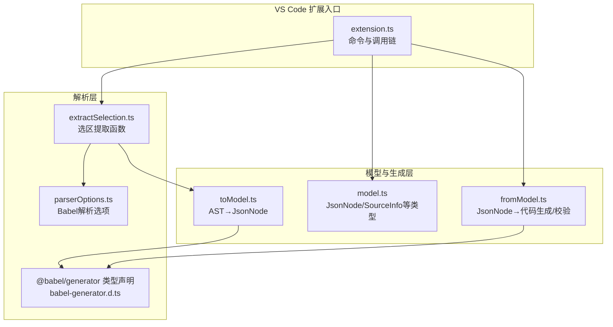
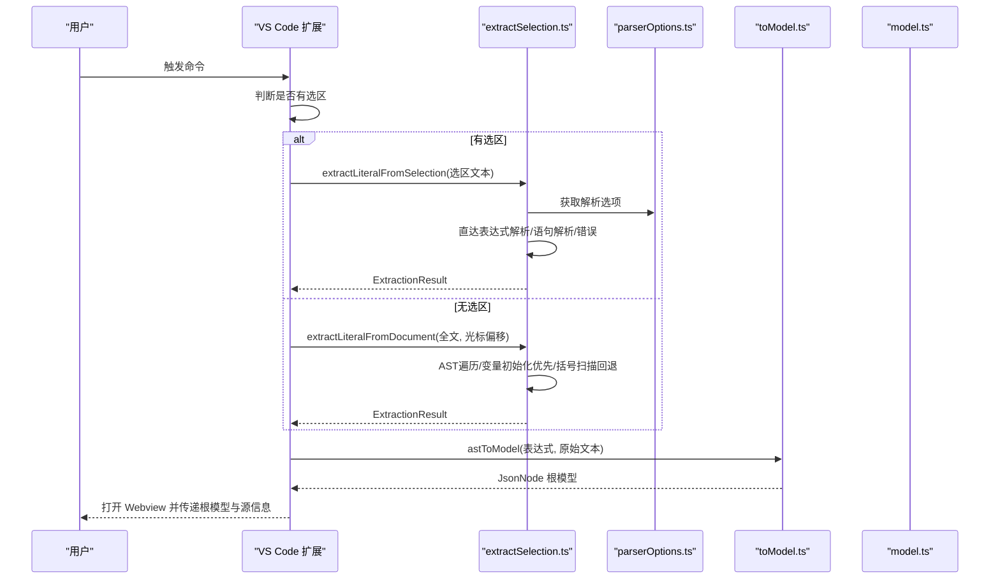
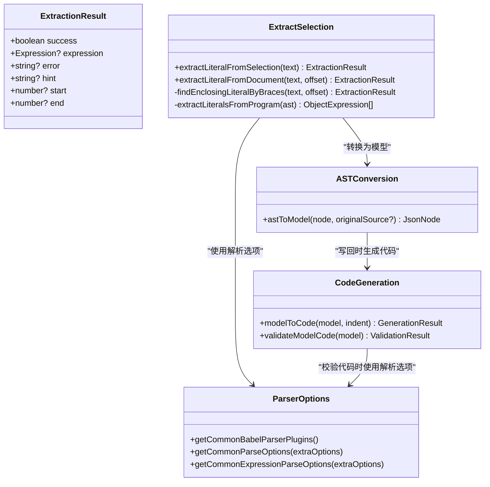

# 选区提取模块

<cite>
**本文引用的文件**
- [extractSelection.ts](file://src/parser/extractSelection.ts)
- [parserOptions.ts](file://src/parser/parserOptions.ts)
- [model.ts](file://src/model.ts)
- [babel-generator.d.ts](file://src/types/babel-generator.d.ts)
- [toModel.ts](file://src/parser/toModel.ts)
- [fromModel.ts](file://src/parser/fromModel.ts)
- [extension.ts](file://src/extension.ts)
- [001.json](file://jsonDemo/001.json)
- [字段值string是jons文本-便于数据库保存.json](file://jsonDemo/字段值string是jons文本-便于数据库保存.json)
- [字面量.js](file://jsonDemo/字面量.js)
</cite>

## 目录
1. [简介](#简介)
2. [项目结构](#项目结构)
3. [核心组件](#核心组件)
4. [架构总览](#架构总览)
5. [详细组件分析](#详细组件分析)
6. [依赖关系分析](#依赖关系分析)
7. [性能考量](#性能考量)
8. [故障排查指南](#故障排查指南)
9. [结论](#结论)
10. [附录](#附录)

## 简介
本技术文档聚焦于 VS Code 扩展中的“选区提取模块”，系统性阐述如何从用户选区与光标位置中稳健地提取 JSON 字面量（对象与数组），并给出三种提取策略：直接表达式解析、语句级解析、以及括号匹配回退机制。文档还解释了 Babel 解析选项配置、AST 节点遍历算法、错误处理策略，并通过接口设计与使用模式说明 ExtractionResult 的职责边界。最后提供性能优化建议，包括扫描窗口限制与递归深度控制等。

## 项目结构
选区提取模块位于 src/parser/extractSelection.ts，围绕以下关键文件协同工作：
- 提取逻辑：extractSelection.ts
- 解析选项：parserOptions.ts
- 数据模型：model.ts
- 代码生成类型声明：babel-generator.d.ts
- AST 到模型转换：toModel.ts
- 模型到代码生成与校验：fromModel.ts
- VS Code 扩展入口与调用链：extension.ts
- 示例数据：jsonDemo 下的 JSON 与 JS 文件

图表来源
- [extractSelection.ts:1-385](file://src/parser/extractSelection.ts#L1-L385)
- [parserOptions.ts:1-36](file://src/parser/parserOptions.ts#L1-L36)
- [babel-generator.d.ts:1-28](file://src/types/babel-generator.d.ts#L1-L28)
- [toModel.ts:1-230](file://src/parser/toModel.ts#L1-L230)
- [fromModel.ts:1-305](file://src/parser/fromModel.ts#L1-L305)
- [model.ts:1-103](file://src/model.ts#L1-L103)
- [extension.ts:1-600](file://src/extension.ts#L1-L600)

章节来源
- [extractSelection.ts:1-385](file://src/parser/extractSelection.ts#L1-L385)
- [parserOptions.ts:1-36](file://src/parser/parserOptions.ts#L1-L36)
- [model.ts:1-103](file://src/model.ts#L1-L103)
- [babel-generator.d.ts:1-28](file://src/types/babel-generator.d.ts#L1-L28)
- [toModel.ts:1-230](file://src/parser/toModel.ts#L1-L230)
- [fromModel.ts:1-305](file://src/parser/fromModel.ts#L1-L305)
- [extension.ts:1-600](file://src/extension.ts#L1-L600)

## 核心组件
- ExtractionResult 接口：统一承载提取结果、错误信息、提示信息与可选的起止偏移，用于向调用方反馈提取状态与上下文。
- extractLiteralFromSelection：针对用户选区的三阶段提取策略，优先直接解析表达式，其次解析语句并收集字面量，最终兜底返回错误。
- extractLiteralFromDocument：基于整篇文档的光标定位提取，采用 AST 遍历与变量初始化优先策略，并在失败时回退到括号扫描。
- findEnclosingLiteralByBraces：轻量级括号扫描回退机制，限定扫描窗口，跳过字符串与注释，使用栈匹配括号，再对候选片段进行表达式解析。
- Babel 解析选项：统一的插件集与解析参数，确保对现代 JS/TS 的兼容性与跨语言场景的健壮性。

章节来源
- [extractSelection.ts:13-22](file://src/parser/extractSelection.ts#L13-L22)
- [extractSelection.ts:34-101](file://src/parser/extractSelection.ts#L34-L101)
- [extractSelection.ts:108-229](file://src/parser/extractSelection.ts#L108-L229)
- [extractSelection.ts:237-343](file://src/parser/extractSelection.ts#L237-L343)
- [parserOptions.ts:3-18](file://src/parser/parserOptions.ts#L3-L18)
- [parserOptions.ts:20-35](file://src/parser/parserOptions.ts#L20-L35)

## 架构总览
选区提取模块在 VS Code 扩展中作为“命令处理器”的一部分被调用。当用户执行命令时，扩展会根据是否存在选区决定走“选区提取”或“文档光标提取”。前者直接对选区文本尝试三种策略；后者对整篇文档进行 AST 遍历或括号扫描回退。无论哪种路径，最终都会将 AST 转换为中间模型，供 Webview 编辑器渲染。

图表来源
- [extension.ts:46-378](file://src/extension.ts#L46-L378)
- [extractSelection.ts:34-101](file://src/parser/extractSelection.ts#L34-L101)
- [extractSelection.ts:108-229](file://src/parser/extractSelection.ts#L108-L229)
- [parserOptions.ts:20-35](file://src/parser/parserOptions.ts#L20-L35)
- [toModel.ts:10-90](file://src/parser/toModel.ts#L10-L90)

## 详细组件分析

### ExtractionResult 接口与使用模式
ExtractionResult 统一承载提取结果与上下文信息，包含：
- success：是否成功
- expression：提取到的 Babel 表达式节点（对象/数组/原始）
- error/hint：错误与提示信息
- start/end：可选的源文本偏移，用于后续写回定位

使用模式：
- 在扩展入口中，若提取失败则弹出错误与提示；成功则继续转换为 JsonNode 并传递给 Webview。
- 在文档光标提取中，若 AST 成功但未找到字面量，则回退到括号扫描；若仍失败则返回错误。

章节来源
- [extractSelection.ts:13-22](file://src/parser/extractSelection.ts#L13-L22)
- [extension.ts:111-119](file://src/extension.ts#L111-L119)
- [extension.ts:285-307](file://src/extension.ts#L285-L307)

### 直接表达式解析策略
流程要点：
- 对选区文本进行 trim 后，优先尝试 parseExpression（仅表达式，非完整语句）。
- 若解析成功且节点为对象或数组字面量，则直接返回该表达式与成功标记。
- 失败则进入语句级解析策略。

复杂度与性能：
- 时间复杂度近似 O(n)，空间复杂度 O(n)，取决于输入长度与解析器内部栈。
- 由于仅解析表达式，通常比完整语句解析更快。

章节来源
- [extractSelection.ts:44-59](file://src/parser/extractSelection.ts#L44-L59)

### 语句级解析策略
流程要点：
- 使用 parse 对选区文本进行完整语句解析。
- 遍历 Program，收集所有对象/数组字面量候选。
- 若候选唯一，返回该表达式；若多个，返回错误与提示；若零个，返回未找到字面量的错误。
- 异常时返回通用语法错误提示。

适用场景：
- 用户选区包含变量声明或函数体等更宽范围内容，但仍希望提取其中的字面量。

章节来源
- [extractSelection.ts:61-95](file://src/parser/extractSelection.ts#L61-L95)
- [extractSelection.ts:355-384](file://src/parser/extractSelection.ts#L355-L384)

### 括号匹配回退机制
流程要点：
- 当 AST 解析失败或未找到字面量时，采用轻量级括号扫描。
- 限定扫描窗口（默认 ±20000 字符），避免超长文档导致性能问题。
- 扫描过程中跳过字符串与注释，使用栈匹配括号，找到最内层匹配后截取候选。
- 对候选再次进行表达式解析，若成功则返回；否则继续尝试更外层的左括号。

复杂度与性能：
- 时间复杂度 O(W)，W 为扫描窗口大小；空间复杂度 O(W)。
- 通过窗口限制与栈匹配，避免全量扫描带来的性能损耗。

章节来源
- [extractSelection.ts:237-343](file://src/parser/extractSelection.ts#L237-L343)
- [extractSelection.ts:242-244](file://src/parser/extractSelection.ts#L242-L244)
- [extractSelection.ts:247-319](file://src/parser/extractSelection.ts#L247-L319)

### 文档光标提取与 AST 遍历
流程要点：
- 对整篇文档进行 AST 解析，开启 ranges 以便获取节点偏移。
- 遍历 AST，收集包含光标的 JSON 类型节点（对象/数组/字符串/数字/布尔/null/模板字面量）。
- 若存在变量初始化（VariableDeclarator）且其 initializer 为 JSON 类型，且光标落在该初始化器范围内，则优先选择该 initializer。
- 若无变量初始化候选，返回最外层（start 最小）的 JSON 类型节点。
- 若仍未找到，回退到括号扫描。

复杂度与性能：
- 遍历 AST 的时间复杂度 O(N)，N 为节点数；空间复杂度 O(N)。
- 通过优先变量初始化与排序，提升提取准确性。

章节来源
- [extractSelection.ts:108-229](file://src/parser/extractSelection.ts#L108-L229)
- [extractSelection.ts:133-185](file://src/parser/extractSelection.ts#L133-L185)
- [extractSelection.ts:189-211](file://src/parser/extractSelection.ts#L189-L211)

### Babel 解析选项配置
- 插件集：启用 JSX、TypeScript、类属性、装饰器、展开、可选链、空合并、BigInt、顶层 await、import attributes 等，确保对现代 JS/TS 的兼容。
- 解析参数：sourceType 为 module，allowImportExportEverywhere 为 true，便于在任意位置解析导入导出。
- 表达式解析复用相同选项，保证一致性。

章节来源
- [parserOptions.ts:3-18](file://src/parser/parserOptions.ts#L3-L18)
- [parserOptions.ts:20-35](file://src/parser/parserOptions.ts#L20-L35)

### 错误处理策略
- 明确的错误分类：空选区、语法解析失败、未找到字面量、多候选冲突、未知错误。
- 友好的提示信息：hint 字段用于引导用户精确选择。
- 回退机制：AST 解析失败时尝试括号扫描；文档光标提取失败时同样回退。

章节来源
- [extractSelection.ts:37-42](file://src/parser/extractSelection.ts#L37-L42)
- [extractSelection.ts:89-95](file://src/parser/extractSelection.ts#L89-L95)
- [extractSelection.ts:220-228](file://src/parser/extractSelection.ts#L220-L228)

### 具体用例与示例
- 对象字面量：字面量.js 中的示例展示了对象字面量的创建与方法定义，适合验证对象字面量提取。
- 数组字面量：001.json 展示了嵌套数组与对象的组合，适合验证复杂嵌套结构的提取。
- 字段值为 JSON 字符串：字段值string是jons文本-便于数据库保存.json 展示了将 JSON 作为字符串存储的场景，适合验证字符串字面量与 JSON 写回的边界。

章节来源
- [字面量.js:1-17](file://jsonDemo/字面量.js#L1-L17)
- [001.json:1-23](file://jsonDemo/001.json#L1-L23)
- [字段值string是jons文本-便于数据库保存.json:1-63](file://jsonDemo/字段值string是jons文本-便于数据库保存.json#L1-L63)

## 依赖关系分析

图表来源
- [extractSelection.ts:13-22](file://src/parser/extractSelection.ts#L13-L22)
- [parserOptions.ts:3-18](file://src/parser/parserOptions.ts#L3-L18)
- [toModel.ts:10-90](file://src/parser/toModel.ts#L10-L90)
- [fromModel.ts:20-57](file://src/parser/fromModel.ts#L20-L57)

章节来源
- [extractSelection.ts:1-385](file://src/parser/extractSelection.ts#L1-L385)
- [parserOptions.ts:1-36](file://src/parser/parserOptions.ts#L1-L36)
- [toModel.ts:1-230](file://src/parser/toModel.ts#L1-L230)
- [fromModel.ts:1-305](file://src/parser/fromModel.ts#L1-L305)

## 性能考量
- 扫描窗口限制：findEnclosingLiteralByBraces 默认 ±20000 字符，避免超长文档导致的线性扫描成本过高。
- 递归深度控制：AST 遍历采用显式递归（walk 函数），通过遍历键集合与数组元素控制深度；在大型 AST 中应避免深层嵌套的重复遍历。
- 解析选项优化：统一的插件集与解析参数减少重复配置开销，提高解析稳定性。
- 回退策略：优先 AST 解析，失败才进行括号扫描，兼顾准确性和性能。
- 写回定位：通过 start/end 或节点 ranges 定位，减少二次扫描。

章节来源
- [extractSelection.ts:242-244](file://src/parser/extractSelection.ts#L242-L244)
- [extractSelection.ts:133-185](file://src/parser/extractSelection.ts#L133-L185)
- [parserOptions.ts:20-35](file://src/parser/parserOptions.ts#L20-L35)

## 故障排查指南
常见问题与解决思路：
- 选区为空：检查用户是否选择了有效文本。
- 语法解析失败：确认选区是否为合法 JavaScript 表达式或语句；必要时缩小选区范围。
- 未找到对象/数组字面量：确认选区包含 {...} 或 [...]，或包含这些字面量的变量初始化语句。
- 多候选冲突：提示用户精确选择一个字面量，避免包含多个对象/数组字面量的语句块。
- 文档光标提取失败：检查光标是否处于 JSON 类型节点内；若处于注释或字符串中，可能被跳过。
- 括号扫描回退失败：确认候选片段为合法表达式；检查字符串转义与注释是否正确处理。

章节来源
- [extractSelection.ts:37-42](file://src/parser/extractSelection.ts#L37-L42)
- [extractSelection.ts:82-88](file://src/parser/extractSelection.ts#L82-L88)
- [extractSelection.ts:216-219](file://src/parser/extractSelection.ts#L216-L219)
- [extractSelection.ts:329-338](file://src/parser/extractSelection.ts#L329-L338)

## 结论
选区提取模块通过“直接表达式解析 + 语句级解析 + 括号匹配回退”的三层策略，在 VS Code 扩展中实现了对对象/数组字面量的稳健提取。结合统一的 Babel 解析选项、AST 遍历与回退机制，以及清晰的错误处理与性能优化，能够在多种语言与文件类型中稳定工作。配合 AST 到模型与模型到代码的转换链路，最终实现从选区到可视化编辑器的无缝衔接。

## 附录
- VS Code 扩展入口与调用链：命令触发、选区/光标提取、模型转换、Webview 初始化与消息处理。
- 示例数据：对象字面量、数组字面量、字符串化 JSON 的典型场景，便于验证提取与写回行为。

章节来源
- [extension.ts:46-378](file://src/extension.ts#L46-L378)
- [字面量.js:1-17](file://jsonDemo/字面量.js#L1-L17)
- [001.json:1-23](file://jsonDemo/001.json#L1-L23)
- [字段值string是jons文本-便于数据库保存.json:1-63](file://jsonDemo/字段值string是jons文本-便于数据库保存.json#L1-L63)