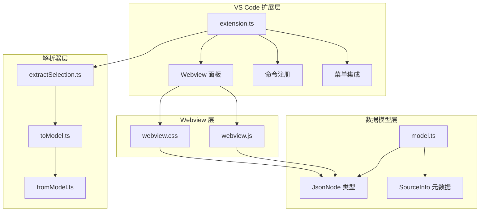
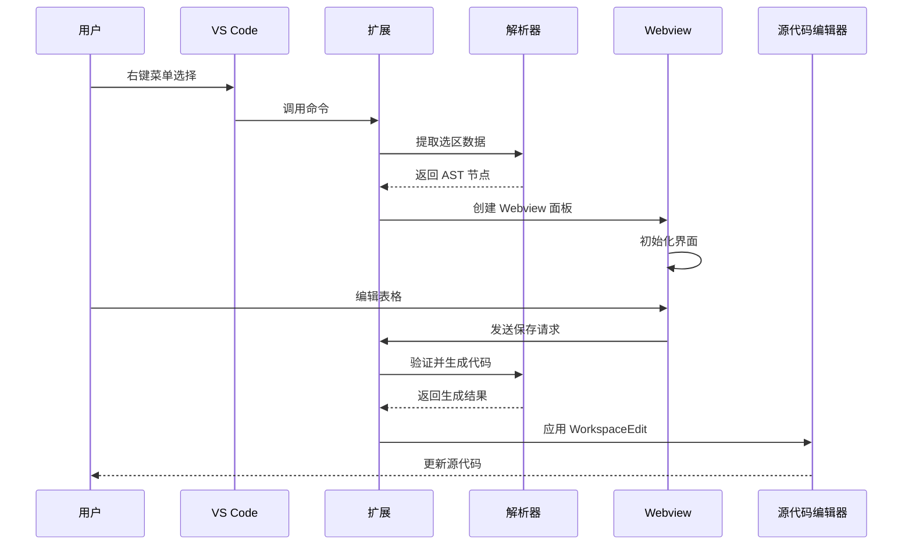
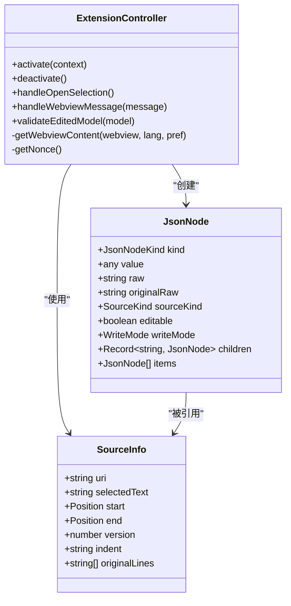
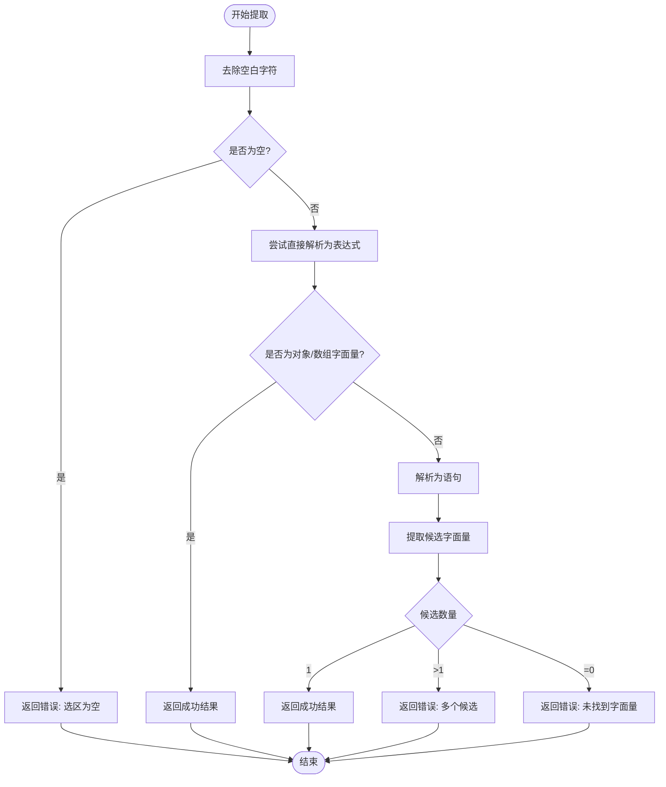
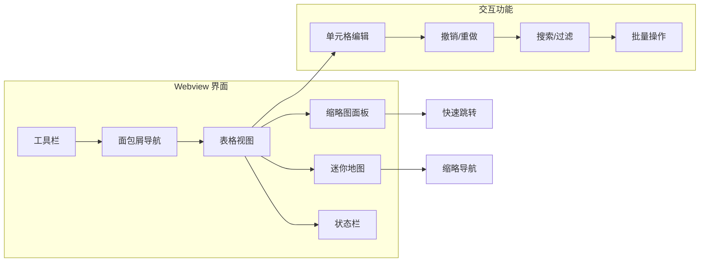

# 项目概述

<cite>
**本文档引用的文件**
- [package.json](file://package.json)
- [部署方式/vscodeExtension/package.json](file://部署方式/vscodeExtension/package.json)
- [部署方式/vscodeExtension/src/extension.ts](file://部署方式/vscodeExtension/src/extension.ts)
- [src/help/jsonokok.html](file://src/help/jsonokok.html)
- [README.md](file://README.md)
- [部署方式/vscodeExtension/README.md](file://部署方式/vscodeExtension/README.md)
- [部署方式/网页部署/README.md](file://部署方式/网页部署/README.md)
- [测试计划.md](file://测试计划.md)
- [todo.md](file://todo.md)
- [package.nls.json](file://package.nls.json)
- [package.nls.zh-CN.json](file://package.nls.zh-CN.json)
</cite>

## 更新摘要
**变更内容**
- 品牌名称从"wysJSON"正式升级为"JSONOKOK"
- 扩展名称从"JSONOK"更新为"JSONOKOK"
- 统一了所有相关文件中的品牌标识
- 更新了项目介绍和功能描述中的品牌名称

## 目录
1. [简介](#简介)
2. [项目结构](#项目结构)
3. [核心组件](#核心组件)
4. [架构概览](#架构概览)
5. [详细组件分析](#详细组件分析)
6. [依赖关系分析](#依赖关系分析)
7. [性能考虑](#性能考虑)
8. [故障排除指南](#故障排除指南)
9. [结论](#结论)
10. [附录](#附录)

## 简介

**JSONOKOK** 是一个专为 VS Code 设计的 JSON 数据可视化编辑器扩展。该项目的核心价值在于将复杂的 JSON 数据以表格形式呈现，提供类似 Excel 的编辑体验，让开发者能够直观地编辑嵌套的 JSON 结构。

### 主要功能特性

- **Excel 风格表格编辑**：将 JSON 数据转换为可编辑的表格界面
- **智能选区提取**：自动识别并提取 JavaScript/TypeScript 文件中的 JSON 字面量
- **双向数据绑定**：实时同步表格编辑与源代码
- **多语言支持**：支持中英文界面切换
- **安全编辑**：基于 AST 分析，确保代码安全性
- **版本控制**：防止并发编辑冲突

### 目标用户群体

- **前端开发者**：需要频繁编辑配置文件、API 响应数据的开发者
- **后端开发者**：处理 JSON 数据的工程师
- **数据分析师**：需要可视化编辑 JSON 数据的专业人士
- **系统管理员**：维护配置文件的技术人员

## 项目结构

项目采用模块化架构设计，主要分为以下几个核心模块：



**图表来源**
- [部署方式/vscodeExtension/src/extension.ts:1-1636](file://部署方式/vscodeExtension/src/extension.ts#L1-L1636)
- [src/help/jsonokok.html:1-16](file://src/help/jsonokok.html#L1-L16)

**章节来源**
- [package.json:1-93](file://package.json#L1-L93)
- [部署方式/vscodeExtension/package.json:1-132](file://部署方式/vscodeExtension/package.json#L1-L132)

## 核心组件

### VS Code 扩展主入口

扩展的激活和停用逻辑由主入口文件负责，实现了完整的生命周期管理。

### 数据解析器模块

项目包含三个核心解析器，分别负责不同的数据处理阶段：

1. **选区提取器**：从用户选区中提取 JSON 字面量
2. **AST 转换器**：将 AST 节点转换为中间模型
3. **代码生成器**：将编辑后的模型转换回源代码

### Webview 用户界面

提供完整的表格编辑界面，支持 Excel 风格的操作体验。

**章节来源**
- [部署方式/vscodeExtension/src/extension.ts:97-139](file://部署方式/vscodeExtension/src/extension.ts#L97-L139)
- [src/help/jsonokok.html:1-16](file://src/help/jsonokok.html#L1-L16)

## 架构概览

JSONOKOK 采用了分层架构设计，确保了代码的可维护性和扩展性：



**图表来源**
- [部署方式/vscodeExtension/src/extension.ts:118-139](file://部署方式/vscodeExtension/src/extension.ts#L118-L139)
- [部署方式/vscodeExtension/src/extension.ts:249-299](file://部署方式/vscodeExtension/src/extension.ts#L249-L299)

### 技术架构理念

1. **静态分析优先**：完全基于 AST 分析，不执行任何代码，确保安全性
2. **中间模型设计**：通过 JsonNode 中间层，便于调试和扩展
3. **可逆性设计**：保留原始代码文本，支持可逆转换
4. **版本控制**：防止并发编辑冲突

**章节来源**
- [部署方式/vscodeExtension/src/extension.ts:582-699](file://部署方式/vscodeExtension/src/extension.ts#L582-L699)
- [部署方式/vscodeExtension/src/extension.ts:701-776](file://部署方式/vscodeExtension/src/extension.ts#L701-L776)

## 详细组件分析

### 扩展主控制器

扩展的主控制器负责协调各个组件的工作，实现了完整的编辑流程：



**图表来源**
- [部署方式/vscodeExtension/src/extension.ts:7-80](file://部署方式/vscodeExtension/src/extension.ts#L7-L80)
- [部署方式/vscodeExtension/src/extension.ts:522-580](file://部署方式/vscodeExtension/src/extension.ts#L522-L580)

### 数据提取算法

选区提取器实现了三层容错策略，确保能够准确识别各种类型的 JSON 字面量：



**图表来源**
- [部署方式/vscodeExtension/src/extension.ts:338-520](file://部署方式/vscodeExtension/src/extension.ts#L338-L520)

### AST 到模型转换

AST 转换器将 Babel AST 节点转换为 JsonNode 中间模型，支持多种数据类型的处理：

**章节来源**
- [部署方式/vscodeExtension/src/extension.ts:582-699](file://部署方式/vscodeExtension/src/extension.ts#L582-L699)
- [部署方式/vscodeExtension/src/extension.ts:701-776](file://部署方式/vscodeExtension/src/extension.ts#L701-L776)

### Webview 用户界面

Webview 提供了完整的表格编辑界面，支持 Excel 风格的操作：



**图表来源**
- [src/help/jsonokok.html:1-16](file://src/help/jsonokok.html#L1-L16)

**章节来源**
- [src/help/jsonokok.html:1-16](file://src/help/jsonokok.html#L1-L16)

## 依赖关系分析

项目依赖关系清晰明确，遵循了模块化设计原则：

```mermaid
graph TB
subgraph "外部依赖"
A[@babel/parser] --> B[语法解析]
C[@babel/generator] --> D[代码生成]
E[monaco-editor] --> F[编辑器支持]
end
subgraph "内部模块"
G[extension.ts] --> H[parser/*]
G --> I[model.ts]
G --> J[webview.js]
H --> K[extractSelection.ts]
H --> L[toModel.ts]
H --> M[fromModel.ts]
end
A --> K
C --> L
C --> M
E --> J
```

**图表来源**
- [package.json:77-91](file://package.json#L77-L91)
- [部署方式/vscodeExtension/package.json:125-130](file://部署方式/vscodeExtension/package.json#L125-L130)

### 核心依赖说明

- **@babel/parser**：用于解析 JavaScript/TypeScript 代码为 AST
- **@babel/generator**：用于将 AST 转换回代码
- **monaco-editor**：提供 VS Code 风格的编辑器体验

**章节来源**
- [package.json:77-91](file://package.json#L77-L91)
- [部署方式/vscodeExtension/package.json:125-130](file://部署方式/vscodeExtension/package.json#L125-L130)

## 性能考虑

### 内存管理

项目采用了多项内存优化策略：

1. **增量加载**：对于大型 JSON 数据，支持按需加载
2. **缓存机制**：使用 localStorage 缓存用户界面状态
3. **虚拟滚动**：对于超大数据集，实现虚拟滚动优化

### 处理效率

1. **AST 缓存**：避免重复解析相同代码
2. **增量更新**：只更新发生变化的部分
3. **异步处理**：耗时操作采用异步执行

## 故障排除指南

### 常见问题及解决方案

#### 1. 无法识别选区中的数据结构

**症状**：右键菜单不可用或弹出错误提示

**原因分析**：
- 选区包含多个 JSON 字面量
- 选区不是有效的 JavaScript 代码
- 选区为空

**解决方法**：
- 精确选择单个 JSON 字面量
- 确保选区包含有效的 JavaScript 代码
- 检查文件编码格式

#### 2. 保存失败

**症状**：点击保存按钮后出现错误提示

**可能原因**：
- 文档版本已更新，防止覆盖冲突
- 代码文本节点包含无效的 JavaScript 代码
- 源代码格式不正确

**解决方法**：
- 重新打开编辑器获取最新版本
- 检查代码文本节点的语法
- 修复源代码格式问题

#### 3. Webview 加载缓慢

**症状**：Webview 页面加载时间过长

**优化建议**：
- 减少 JSON 数据大小
- 使用虚拟滚动功能
- 关闭不必要的面板

**章节来源**
- [部署方式/vscodeExtension/src/extension.ts:249-299](file://部署方式/vscodeExtension/src/extension.ts#L249-L299)
- [测试计划.md:103-122](file://测试计划.md#L103-L122)

## 结论

JSONOKOK VS Code 扩展是一个设计精良、功能完善的 JSON 数据编辑工具。它成功地将复杂的 JSON 数据以表格形式呈现，提供了类似 Excel 的编辑体验，同时保持了高度的安全性和可靠性。

### 项目优势

1. **安全性**：基于 AST 分析，完全不执行代码
2. **易用性**：提供直观的表格编辑界面
3. **可靠性**：完善的错误处理和版本控制
4. **可扩展性**：模块化设计便于功能扩展

### 技术亮点

- **智能选区提取**：支持多种 JSON 字面量识别
- **双向数据绑定**：实时同步表格与源代码
- **多语言支持**：中英文界面切换
- **性能优化**：针对大型数据集的优化处理

### 发展前景

项目目前处于早期版本，但仍具备完整的功能框架。未来版本计划包括：

- 代码节点的语法高亮支持
- 撤销/重做堆栈持久化
- 更丰富的数据类型支持
- 性能优化（虚拟滚动）

## 附录

### 版本信息

- **当前版本**：0.1.0（VS Code 扩展）
- **当前版本**：0.1.1（VS Code 扩展 - 官方发布版）
- **开发状态**：Alpha 版本
- **目标平台**：VS Code 1.85.0+

### 许可证信息

项目采用 MIT 许可证，允许自由使用、修改和分发。

### 开发者指南

#### 快速开始

1. 克隆项目到本地
2. 安装依赖：`npm install`
3. 编译项目：`npm run compile`
4. 在 VS Code 中按 F5 启动扩展开发宿主

#### 测试数据

项目包含丰富的测试数据，位于 `jsonDemo/` 目录中，涵盖各种 JSON 结构和边界情况。

**章节来源**
- [测试计划.md:39-101](file://测试计划.md#L39-L101)
- [部署方式/vscodeExtension/README.md:1-40](file://部署方式/vscodeExtension/README.md#L1-L40)
- [部署方式/网页部署/README.md:1-80](file://部署方式/网页部署/README.md#L1-L80)