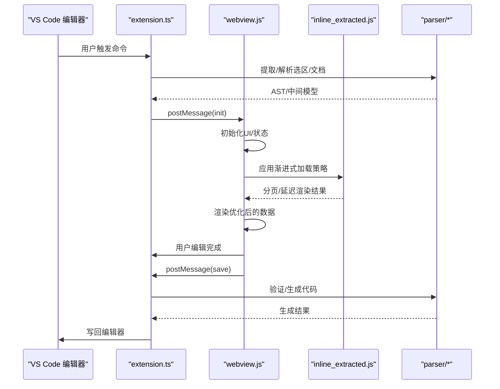
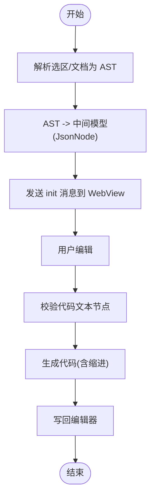
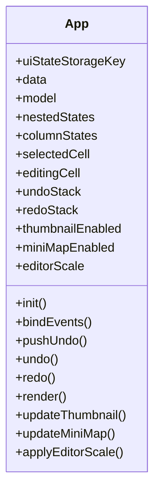
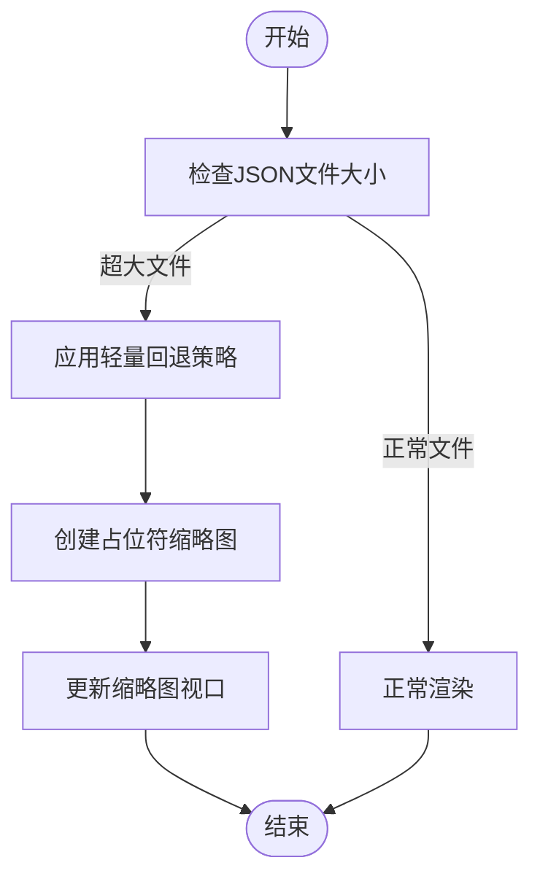
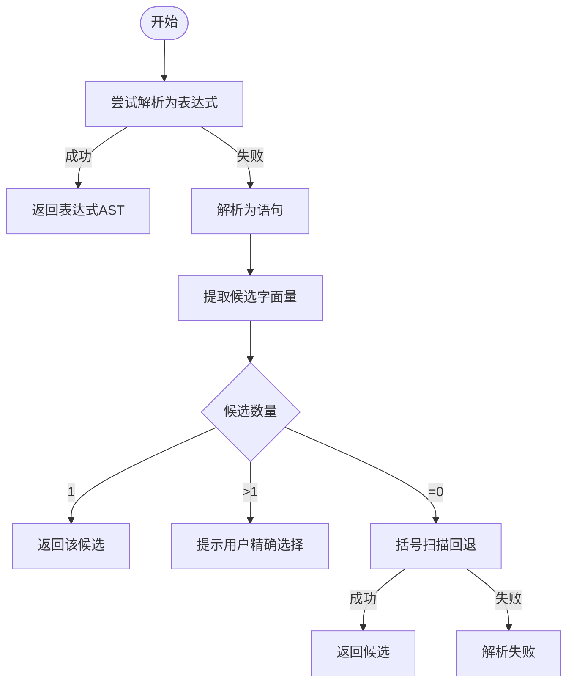
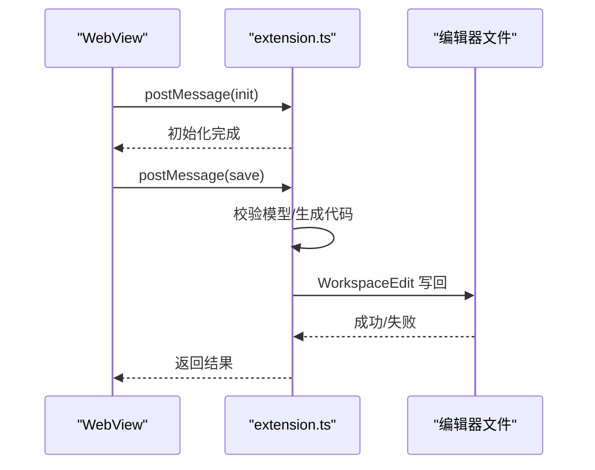
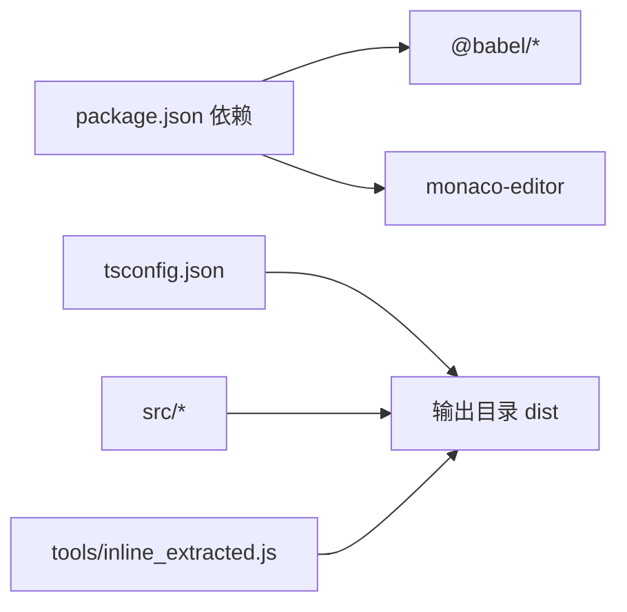

# 性能优化

<cite>
**本文引用的文件**
- [package.json](file://package.json)
- [tsconfig.json](file://tsconfig.json)
- [src/model.ts](file://src/model.ts)
- [src/extension.ts](file://src/extension.ts)
- [src/parser/parserOptions.ts](file://src/parser/parserOptions.ts)
- [src/parser/extractSelection.ts](file://src/parser/extractSelection.ts)
- [src/parser/toModel.ts](file://src/parser/toModel.ts)
- [src/parser/fromModel.ts](file://src/parser/fromModel.ts)
- [media/webview.js](file://media/webview.js)
- [index.html](file://index.html)
- [jsonDemo/超大json家庭地址.json](file://jsonDemo/超大json家庭地址.json)
- [jsonDemo/001.json](file://jsonDemo/001.json)
- [tools/inline_extracted.js](file://tools/inline_extracted.js)
</cite>

## 更新摘要
**所做更改**
- 新增大型JSON渐进式加载优化章节，涵盖分页加载、延迟渲染和按需加载机制
- 更新内存使用优化部分，增加超大文件处理的轻量回退策略
- 完善渲染性能提升方案，包含虚拟滚动和DOM优化的具体实现
- 新增性能监控与瓶颈识别方法，针对超大文件场景的专门优化
- 更新性能测试指南，包含16,000+行超大JSON文件的测试场景

## 目录
1. [简介](#简介)
2. [项目结构](#项目结构)
3. [核心组件](#核心组件)
4. [架构总览](#架构总览)
5. [详细组件分析](#详细组件分析)
6. [依赖关系分析](#依赖关系分析)
7. [性能考量与优化建议](#性能考量与优化建议)
8. [故障排查指南](#故障排查指南)
9. [结论](#结论)
10. [附录：性能测试与基准测试](#附录性能测试与基准测试)

## 简介
本文件围绕 JSONOKOK 在大文件处理、内存管理、渲染性能、AST 解析与数据模型优化等方面的性能优化进行系统化梳理，并结合现有代码实现给出可视化架构图、流程图与优化建议。特别针对新增的大型JSON渐进式加载优化功能，包括分页加载、延迟渲染和按需加载机制，支持超大JSON文件处理（16,000+行）。目标读者既包括开发者也包括对技术细节感兴趣的非专业用户。

## 项目结构
项目采用 VS Code 扩展 + WebView 前端的双层架构：扩展负责解析与消息编排，WebView 负责交互与渲染。核心模块包括：
- 扩展入口与消息编排：src/extension.ts
- 数据模型与消息协议：src/model.ts
- AST 解析与转换：src/parser/*
- WebView 交互逻辑与状态管理：media/webview.js
- 渐进式加载优化：tools/inline_extracted.js
- 样例与大文件：jsonDemo/*

```mermaid
graph TB
subgraph "VS Code 扩展层"
EXT["extension.ts<br/>消息编排/写回"]
MODEL["model.ts<br/>消息协议/数据模型"]
PARSER["parser/*<br/>AST 解析/生成"]
END
subgraph "WebView 前端层"
WEBVIEW["webview.js<br/>状态/事件/渲染"]
INLINE["inline_extracted.js<br/>渐进式加载优化"]
HTML["index.html<br/>样式/布局"]
END
EXT --> MODEL
EXT --> PARSER
EXT <- --> WEBVIEW
WEBVIEW --> INLINE
WEBVIEW --> HTML
```

**图表来源**
- [src/extension.ts](file://src/extension.ts)
- [src/model.ts](file://src/model.ts)
- [src/parser/toModel.ts](file://src/parser/toModel.ts)
- [src/parser/fromModel.ts](file://src/parser/fromModel.ts)
- [media/webview.js](file://media/webview.js)
- [tools/inline_extracted.js](file://tools/inline_extracted.js)
- [index.html](file://index.html)

**章节来源**
- [src/extension.ts](file://src/extension.ts)
- [src/model.ts](file://src/model.ts)
- [src/parser/extractSelection.ts](file://src/parser/extractSelection.ts)
- [src/parser/toModel.ts](file://src/parser/toModel.ts)
- [src/parser/fromModel.ts](file://src/parser/fromModel.ts)
- [media/webview.js](file://media/webview.js)
- [tools/inline_extracted.js](file://tools/inline_extracted.js)
- [index.html](file://index.html)

## 核心组件
- 消息协议与数据模型：定义了扩展与 WebView 之间的消息类型、初始化数据、保存/预览/取消等交互协议，以及中间模型 JsonNode 的结构与元信息。
- AST 解析与生成：基于 Babel 的解析器配置与解析流程，支持对象/数组/原始值/代码文本节点的双向转换，并在生成阶段进行语法校验。
- 选择提取与容错：在多种上下文中（选区、Markdown 代码块、光标位置）提取 JSON/JS 字面量，具备容错与回退策略。
- WebView 状态与渲染：管理 UI 状态、撤销栈、缩略图/快速跳转、缩放与滚动同步等前端性能相关能力。
- 渐进式加载优化：实现分页加载、延迟渲染和按需加载机制，支持超大JSON文件的高效处理。

**章节来源**
- [src/model.ts](file://src/model.ts)
- [src/parser/parserOptions.ts](file://src/parser/parserOptions.ts)
- [src/parser/extractSelection.ts](file://src/parser/extractSelection.ts)
- [src/parser/toModel.ts](file://src/parser/toModel.ts)
- [src/parser/fromModel.ts](file://src/parser/fromModel.ts)
- [media/webview.js](file://media/webview.js)
- [tools/inline_extracted.js](file://tools/inline_extracted.js)

## 架构总览
扩展与 WebView 的交互通过 postMessage 实现，扩展负责：
- 提取选区/文档中的 JSON/JS 字面量
- 将 AST 转换为中间模型并发送给 WebView
- 接收 WebView 的保存请求，验证并生成代码写回编辑器

WebView 负责：
- 初始化 UI、绑定事件、维护撤销栈
- 渲染表格、缩略图、快速跳转
- 处理用户输入、键盘快捷键、语言切换
- 实施渐进式加载优化策略



**图表来源**
- [src/extension.ts](file://src/extension.ts)
- [src/parser/extractSelection.ts](file://src/parser/extractSelection.ts)
- [src/parser/toModel.ts](file://src/parser/toModel.ts)
- [src/parser/fromModel.ts](file://src/parser/fromModel.ts)
- [media/webview.js](file://media/webview.js)
- [tools/inline_extracted.js](file://tools/inline_extracted.js)

## 详细组件分析

### 组件一：AST 解析与中间模型转换
- 解析器配置：统一的 Babel 解析选项，启用 JSX、TypeScript、装饰器、可选链、空值合并、BigInt、顶层 await、import attributes 等插件，确保对复杂 JS/TS 的兼容性。
- AST 到中间模型：递归遍历 AST，将对象/数组/原始值映射为 JsonNode；对于函数/方法/展开等不支持的节点，降级为"代码文本节点"，并保留原始代码以便后续生成。
- 中间模型到代码：对代码文本节点进行语法校验，再按层级生成缩进良好的代码；对对象/数组/原始值分别处理，支持换行与嵌套缩进。



**图表来源**
- [src/parser/extractSelection.ts](file://src/parser/extractSelection.ts)
- [src/parser/toModel.ts](file://src/parser/toModel.ts)
- [src/parser/fromModel.ts](file://src/parser/fromModel.ts)
- [src/parser/parserOptions.ts](file://src/parser/parserOptions.ts)

**章节来源**
- [src/parser/parserOptions.ts](file://src/parser/parserOptions.ts)
- [src/parser/extractSelection.ts](file://src/parser/extractSelection.ts)
- [src/parser/toModel.ts](file://src/parser/toModel.ts)
- [src/parser/fromModel.ts](file://src/parser/fromModel.ts)

### 组件二：WebView 状态管理与渲染
- 状态存储：本地存储 UI 状态（缩略图/快速跳转开关、尺寸、位置），避免每次重载重建。
- 撤销/重做：维护固定长度的撤销栈，限制内存占用；快照包含 data 与 model，便于回滚。
- 缩放与滚动：通过 zoom 与滚动事件同步缩略图/快速跳转视窗，减少重绘。
- 事件绑定：集中绑定表格点击、双击、拖拽、粘贴、键盘、滚轮等事件，统一处理选择、编辑、填充等交互。



**图表来源**
- [media/webview.js](file://media/webview.js)

**章节来源**
- [media/webview.js](file://media/webview.js)

### 组件三：渐进式加载优化（新增）
- 分页加载机制：实现完整的分页状态管理，包括页码计算、页面大小控制和索引范围确定。
- 延迟渲染策略：针对超大JSON文件实施轻量回退，避免大量DOM查询和计算。
- 按需加载实现：支持路径定位和局部重渲染，结合撤销栈机制仅回滚受影响区域。



**图表来源**
- [tools/inline_extracted.js](file://tools/inline_extracted.js)

**章节来源**
- [tools/inline_extracted.js](file://tools/inline_extracted.js)

### 组件四：选择提取与容错策略
- 优先尝试直接解析表达式；若失败则解析为语句，提取变量声明/初始化中的字面量。
- 对于文档级提取，使用深度优先遍历收集候选节点，优先变量初始化器，其次最外层字面量。
- 若全解析失败，采用"括号扫描"回退策略，在限定窗口内匹配括号并尝试解析，兼顾性能与可用性。



**图表来源**
- [src/parser/extractSelection.ts](file://src/parser/extractSelection.ts)

**章节来源**
- [src/parser/extractSelection.ts](file://src/parser/extractSelection.ts)

### 组件五：消息协议与写回流程
- 初始化：扩展将根模型与源信息发送给 WebView，WebView 初始化 UI 并进入就绪状态。
- 保存：WebView 发送保存消息，扩展进行模型校验与代码生成，再通过 WorkspaceEdit 写回编辑器，最后关闭面板。



**图表来源**
- [src/extension.ts](file://src/extension.ts)
- [src/model.ts](file://src/model.ts)

**章节来源**
- [src/extension.ts](file://src/extension.ts)
- [src/model.ts](file://src/model.ts)

## 依赖关系分析
- 运行时依赖：@babel/parser、@babel/generator、@babel/types、monaco-editor（用于 VS Code 集成）。
- 构建配置：tsconfig 指定 ES2020 目标、严格模式、SourceMap、声明文件等，便于调试与发布。



**图表来源**
- [package.json](file://package.json)
- [tsconfig.json](file://tsconfig.json)

**章节来源**
- [package.json](file://package.json)
- [tsconfig.json](file://tsconfig.json)

## 性能考量与优化建议

### 大型JSON渐进式加载优化（新增）
- 分页加载与延迟渲染
  - 实现完整的分页状态管理系统，支持动态页面大小调整和页码导航。
  - 针对超大JSON文件（16,000+行）实施轻量回退策略，避免DOM查询和计算开销。
  - 通过字符数阈值（约200KB）和元素数量双重条件判断，智能触发优化策略。
- 增量更新
  - 使用路径定位与局部重渲染，避免整表重绘；结合撤销栈的快照机制，仅回滚受影响区域。
  - 支持页面级别的增量更新，提高大文件操作响应速度。
- 选择提取的性能边界
  - 文档级提取已限制扫描窗口，避免全文件解析带来的性能问题；可在更大文件场景下进一步限制解析深度或采用流式策略。

**章节来源**
- [tools/inline_extracted.js](file://tools/inline_extracted.js)
- [src/parser/extractSelection.ts](file://src/parser/extractSelection.ts)
- [media/webview.js](file://media/webview.js)

### 内存使用优化
- 对象池与复用
  - 当前未见显式的对象池实现。建议对频繁创建的 DOM 片段、节点映射表、缩略图块等进行缓存与复用。
  - 针对超大JSON文件，实施轻量回退策略，减少DOM节点数量和内存占用。
- 撤销栈大小控制
  - 固定最大撤销次数，避免无限增长；必要时对快照进行浅拷贝或结构化克隆以降低内存压力。
- 本地存储与持久化
  - UI 状态已使用 localStorage，建议对大模型数据采用惰性加载与分片存储策略。

**章节来源**
- [media/webview.js](file://media/webview.js)
- [tools/inline_extracted.js](file://tools/inline_extracted.js)

### 渲染性能提升
- 虚拟滚动与 DOM 优化
  - 引入虚拟列表/网格，仅渲染可见行/列；合并重排与重绘，减少强制同步布局。
  - 针对超大JSON文件，实施轻量缩略图渲染，避免遍历所有表格节点。
- 缩放与滚动同步
  - 使用 transform 缩放与滚动事件同步视窗，避免频繁 DOM 改变。
- 重绘最小化
  - 将计算密集型任务拆分为微任务，使用 requestIdleCallback 或 Web Worker 分担主线程压力。

**章节来源**
- [index.html](file://index.html)
- [media/webview.js](file://media/webview.js)
- [tools/inline_extracted.js](file://tools/inline_extracted.js)

### AST 解析性能优化
- 缓存机制
  - 对已解析的表达式/程序结果进行缓存，命中则直接复用，避免重复解析。
- 并行处理
  - 对独立分支或大数组元素，考虑使用 Web Workers 并行解析与校验。
- 解析器配置调优
  - 仅启用必要的插件，减少解析开销；对只读场景可禁用某些特性（如装饰器）。

**章节来源**
- [src/parser/parserOptions.ts](file://src/parser/parserOptions.ts)
- [src/parser/extractSelection.ts](file://src/parser/extractSelection.ts)

### 数据模型优化
- 树结构压缩
  - 对深层嵌套进行扁平化或分层缓存，减少遍历成本。
- 索引与查询
  - 为常用访问路径建立索引，支持 O(1) 快速定位；对数组按索引建立映射。
- 查询优化
  - 使用惰性求值与记忆化，避免重复计算同一节点的属性。

**章节来源**
- [src/model.ts](file://src/model.ts)
- [media/webview.js](file://media/webview.js)

### 性能监控与瓶颈识别
- 监控工具
  - 使用浏览器性能面板记录帧率、内存、CPU 占用；在 WebView 中埋点统计关键路径耗时（解析、渲染、写回）。
  - 针对超大文件场景，监控缩略图渲染时间和DOM节点数量。
- 指标分析
  - 关注首屏时间、交互延迟、内存峰值、GC 次数与暂停时长。
  - 监控分页加载的页面切换响应时间和内存使用情况。
- 瓶颈识别
  - 结合火焰图与调用栈，定位解析慢、渲染卡顿、写回阻塞等环节。
  - 重点关注超大文件处理的轻量回退策略效果。

**章节来源**
- [media/webview.js](file://media/webview.js)
- [tools/inline_extracted.js](file://tools/inline_extracted.js)

### 移动端适配、网络优化与资源加载
- 移动端适配
  - 使用响应式布局与触摸手势；在 WebView 中针对小屏设备优化字体与间距。
  - 针对移动设备优化分页加载体验，调整页面大小和导航控件。
- 网络优化
  - 对远程资源采用缓存与 CDN；对增量更新采用 ETag/Last-Modified。
- 资源加载
  - 按需加载脚本与样式，避免一次性注入大量资源。

**章节来源**
- [index.html](file://index.html)
- [media/webview.js](file://media/webview.js)

## 故障排查指南
- 选区/光标提取失败
  - 检查是否处于 Markdown 代码块内；确认选区包含合法对象/数组字面量；必要时使用"括号扫描"回退。
- 保存失败
  - 确认文档未被其他进程修改；检查代码文本节点的语法有效性；查看写回编辑器的错误信息。
- 渲染卡顿
  - 检查是否存在大量同步布局；确认缩放与滚动事件未触发频繁重绘；适当减少撤销栈深度。
- 超大文件处理异常
  - 检查轻量回退策略是否正确触发；确认字符数阈值和元素数量条件设置合理。
  - 验证分页加载状态是否正确更新，页面大小是否在有效范围内。

**章节来源**
- [src/parser/extractSelection.ts](file://src/parser/extractSelection.ts)
- [src/extension.ts](file://src/extension.ts)
- [media/webview.js](file://media/webview.js)
- [tools/inline_extracted.js](file://tools/inline_extracted.js)

## 结论
当前实现已具备良好的 AST 解析与双向生成能力，并通过 WebView 的状态管理与 UI 交互提供了较好的用户体验。新增的大型JSON渐进式加载优化功能显著提升了超大文件处理能力，包括分页加载、延迟渲染和按需加载机制，支持16,000+行的超大JSON文件处理。为进一步提升整体性能，建议继续完善虚拟滚动、对象池与缓存、并行解析与写回优化等策略，并配合性能监控与指标分析持续迭代。

## 附录：性能测试与基准测试
- 测试目标
  - 首屏加载时间、解析耗时、渲染帧率、内存峰值、撤销/重做响应时间、写回成功率。
  - 分页加载性能：页面切换时间、内存使用量、DOM节点数量。
  - 轻量回退策略效果：缩略图渲染时间、DOM查询次数、内存占用对比。
- 测试数据
  - 使用样例文件与超大文件进行对比测试，覆盖不同嵌套深度与节点数量。
  - 超大JSON文件：16,524行的"超大json家庭地址.json"作为基准测试数据。
- 基准测试步骤
  - 准备测试环境（相同硬件与浏览器版本）；运行多次取平均值；记录关键指标。
  - 针对不同页面大小（50、100、200、500）测试分页加载性能。
  - 比较轻量回退策略与完整渲染策略的性能差异。
- 优化建议
  - 针对热点路径进行重构；引入缓存与并行；减少不必要的 DOM 操作与重排。
  - 根据实际使用场景调整轻量回退策略的触发条件和页面大小参数。
  - 优化分页状态管理，提高页面切换的响应速度和内存效率。

**章节来源**
- [jsonDemo/001.json](file://jsonDemo/001.json)
- [jsonDemo/超大json家庭地址.json](file://jsonDemo/超大json家庭地址.json)
- [media/webview.js](file://media/webview.js)
- [tools/inline_extracted.js](file://tools/inline_extracted.js)