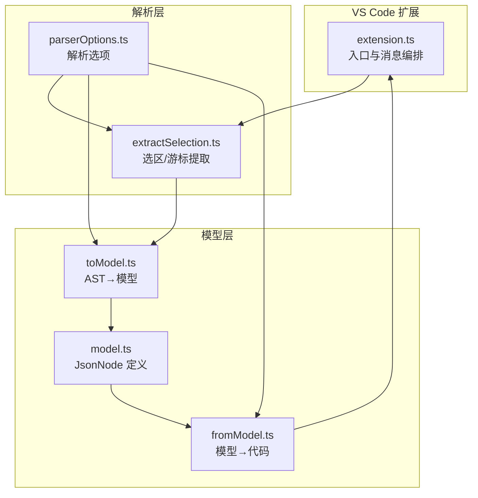
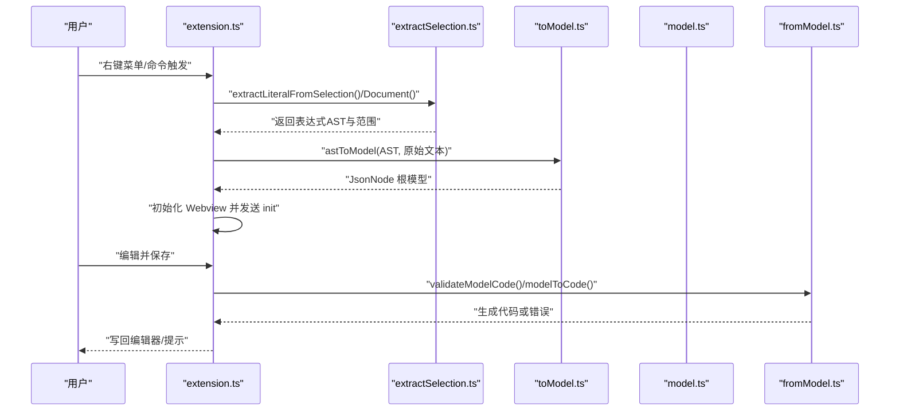
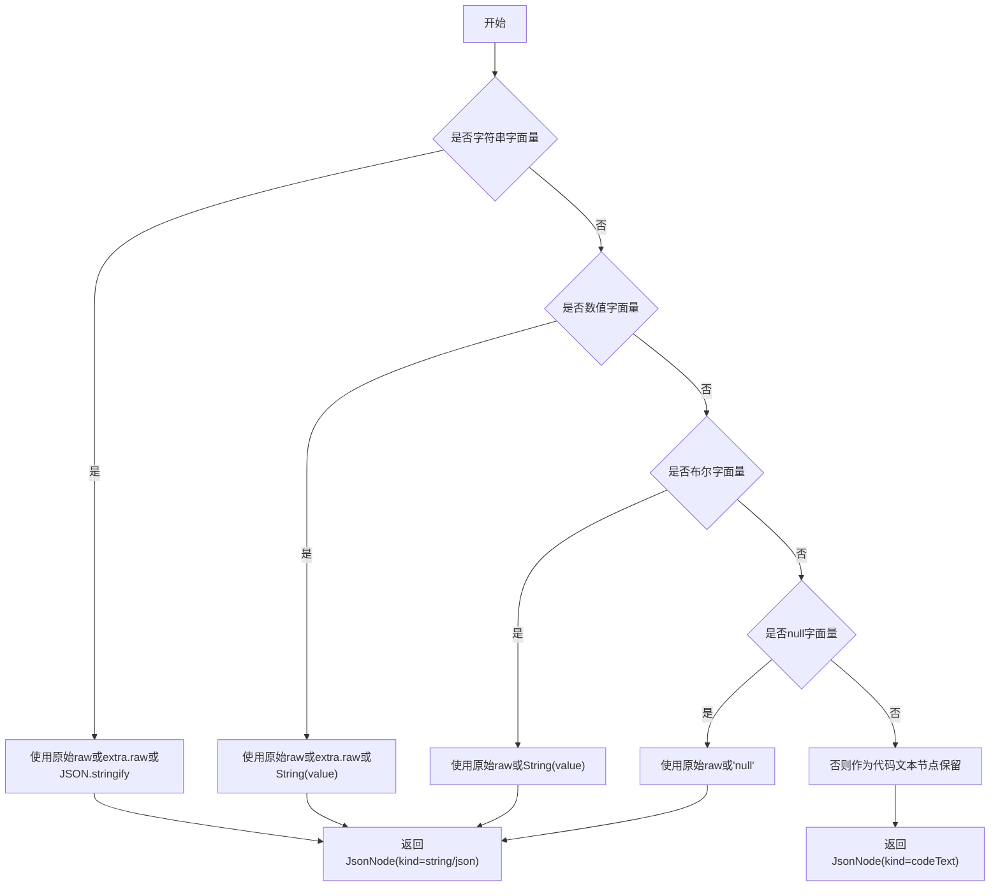
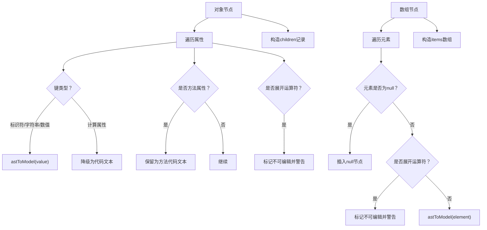
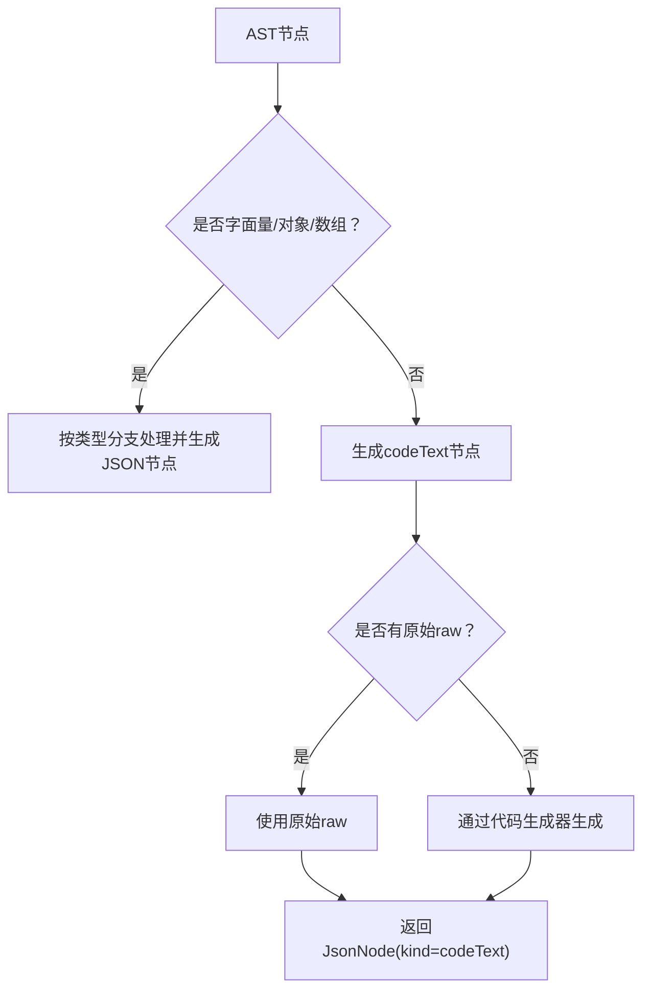
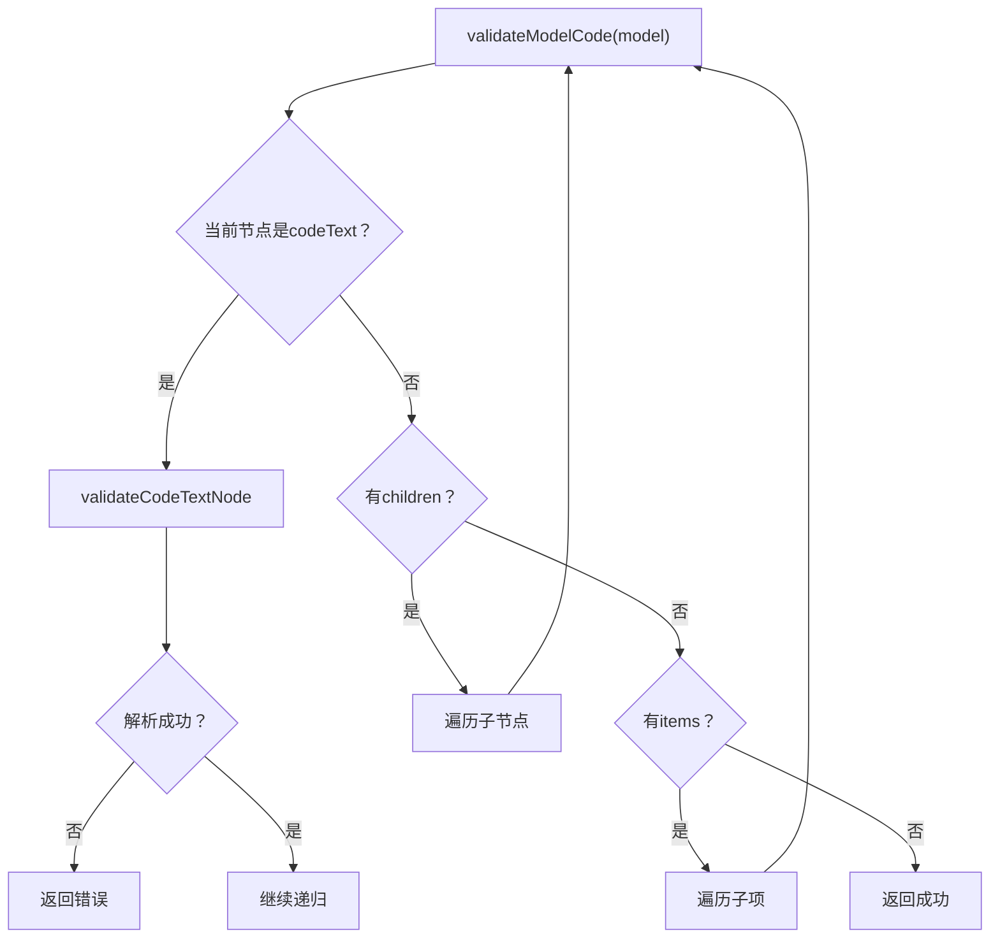
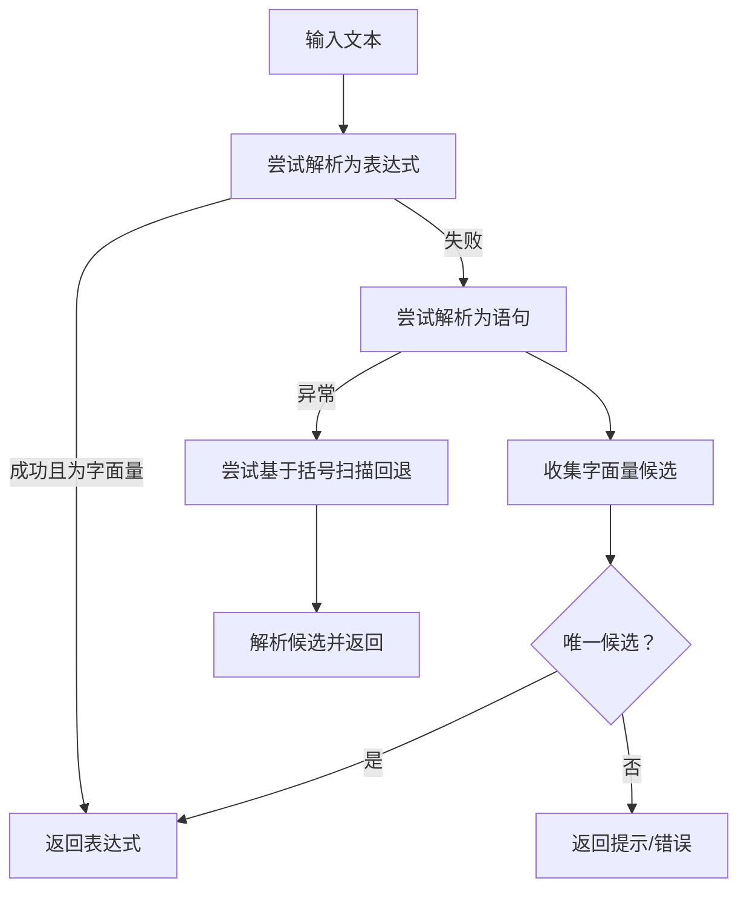
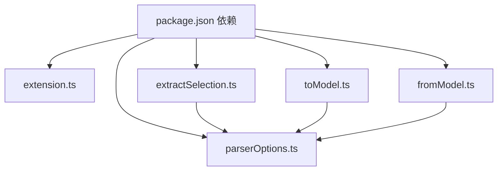

# 数据类型处理

<cite>
**本文引用的文件**   
- [src/model.ts](file://src/model.ts)
- [src/extension.ts](file://src/extension.ts)
- [src/parser/toModel.ts](file://src/parser/toModel.ts)
- [src/parser/fromModel.ts](file://src/parser/fromModel.ts)
- [src/parser/extractSelection.ts](file://src/parser/extractSelection.ts)
- [src/parser/parserOptions.ts](file://src/parser/parserOptions.ts)
- [package.json](file://package.json)
- [jsonDemo/testData.js](file://jsonDemo/testData.js)
- [jsonDemo/字段值string是jons文本-便于数据库保存.json](file://jsonDemo/字段值string是jons文本-便于数据库保存.json)
- [jsonDemo/字面量.js](file://jsonDemo/字面量.js)
</cite>

## 目录
1. [简介](#简介)
2. [项目结构](#项目结构)
3. [核心组件](#核心组件)
4. [架构总览](#架构总览)
5. [详细组件分析](#详细组件分析)
6. [依赖关系分析](#依赖关系分析)
7. [性能考量](#性能考量)
8. [故障排查指南](#故障排查指南)
9. [结论](#结论)
10. [附录](#附录)

## 简介
本文件聚焦于 JSONOKOK 的“数据类型处理”能力，系统性阐述以下内容：
- 基本数据类型的处理机制：字符串、数字、布尔值、空值的转换与保留策略
- 复杂数据结构的处理：对象属性提取、数组元素遍历、嵌套结构的递归处理
- 特殊表达式的处理：函数、日期、符号等非字面量类型的代码文本保留机制
- 数据类型映射规则、原始代码保留策略与语法验证机制
- 边界情况处理、错误恢复策略与性能优化建议
- 结合真实示例路径，展示不同数据类型的处理流程

## 项目结构
本项目采用分层设计：
- 扩展入口与消息编排：VS Code 扩展主逻辑负责提取选区、构建中间模型、与 Webview 通信
- 解析层：从选区文本中提取对象/数组字面量，或基于游标定位进行结构化提取
- 模型层：定义 JsonNode 及其元信息，统一承载 JSON 与代码文本节点
- 生成层：将编辑后的模型回写为源码，包含语法校验与缩进处理

**图示来源**
- [src/extension.ts:19-378](file://src/extension.ts#L19-L378)
- [src/parser/extractSelection.ts:34-101](file://src/parser/extractSelection.ts#L34-L101)
- [src/parser/parserOptions.ts:20-35](file://src/parser/parserOptions.ts#L20-L35)
- [src/model.ts:6-34](file://src/model.ts#L6-L34)
- [src/parser/toModel.ts:10-90](file://src/parser/toModel.ts#L10-L90)
- [src/parser/fromModel.ts:20-57](file://src/parser/fromModel.ts#L20-L57)

**章节来源**
- [src/extension.ts:19-378](file://src/extension.ts#L19-L378)
- [src/parser/extractSelection.ts:34-101](file://src/parser/extractSelection.ts#L34-L101)
- [src/parser/parserOptions.ts:20-35](file://src/parser/parserOptions.ts#L20-L35)
- [src/model.ts:6-34](file://src/model.ts#L6-L34)
- [src/parser/toModel.ts:10-90](file://src/parser/toModel.ts#L10-L90)
- [src/parser/fromModel.ts:20-57](file://src/parser/fromModel.ts#L20-L57)

## 核心组件
- JsonNode 类型与元信息：统一承载基础类型与代码文本节点，支持原始代码保留、来源类别标记、可编辑性与写回模式
- AST 到模型转换：针对对象、数组、字面量与特殊表达式进行分类处理
- 模型到代码生成：在写回前进行语法校验，按缩进格式化输出
- 选区/游标提取：容错地从用户选区或光标位置提取对象/数组字面量

**章节来源**
- [src/model.ts:6-34](file://src/model.ts#L6-L34)
- [src/parser/toModel.ts:10-90](file://src/parser/toModel.ts#L10-L90)
- [src/parser/fromModel.ts:20-57](file://src/parser/fromModel.ts#L20-L57)
- [src/parser/extractSelection.ts:34-101](file://src/parser/extractSelection.ts#L34-L101)

## 架构总览
下图展示了从选区提取到模型生成的端到端流程。

**图示来源**
- [src/extension.ts:46-378](file://src/extension.ts#L46-L378)
- [src/parser/extractSelection.ts:34-101](file://src/parser/extractSelection.ts#L34-L101)
- [src/parser/toModel.ts:10-90](file://src/parser/toModel.ts#L10-L90)
- [src/parser/fromModel.ts:20-57](file://src/parser/fromModel.ts#L20-L57)

## 详细组件分析

### 基本数据类型处理
- 字符串、数字、布尔值、空值：通过 Babel 类型判断，优先使用原始文本片段（raw）进行保留；若不可得则回退到 JSON 序列化或字面量字符串
- 写回模式：这些节点标记为 JSON 模式，直接序列化输出
- 可编辑性：默认可编辑，便于表格界面直接修改

**图示来源**
- [src/parser/toModel.ts:19-75](file://src/parser/toModel.ts#L19-L75)

**章节来源**
- [src/parser/toModel.ts:19-75](file://src/parser/toModel.ts#L19-L75)

### 复杂数据结构处理
- 对象属性提取：
  - 支持标识符、字符串字面量、数值字面量作为键；计算属性键降级为代码文本
  - 方法属性（对象方法）单独保留为代码文本节点，并标注来源类别
  - 展开运算符（...）不支持，标记为不可编辑的代码文本节点并给出警告
- 数组元素遍历：
  - 支持稀疏洞位（hole），以 null 节点表示
  - 展开运算符（...）不支持，标记为不可编辑的代码文本节点并给出警告
- 嵌套结构递归：
  - 对象与数组的 children/items 递归调用 astToModel，保持层级关系

**图示来源**
- [src/parser/toModel.ts:92-158](file://src/parser/toModel.ts#L92-L158)
- [src/parser/toModel.ts:160-209](file://src/parser/toModel.ts#L160-L209)

**章节来源**
- [src/parser/toModel.ts:92-158](file://src/parser/toModel.ts#L92-L158)
- [src/parser/toModel.ts:160-209](file://src/parser/toModel.ts#L160-L209)

### 特殊表达式处理
- 非字面量类型（函数、Date、Symbol、模板等）一律作为代码文本节点保留
- 保留策略：
  - 优先使用原始文本片段（getNodeRaw）
  - 若无原始片段，则通过代码生成器生成
- 写回模式：标记为 code 模式，写回时直接输出原始代码文本
- 警告提示：对代码文本节点提示修改后需保证语法有效

**图示来源**
- [src/parser/toModel.ts:77-90](file://src/parser/toModel.ts#L77-L90)
- [src/parser/toModel.ts:211-229](file://src/parser/toModel.ts#L211-L229)

**章节来源**
- [src/parser/toModel.ts:77-90](file://src/parser/toModel.ts#L77-L90)
- [src/parser/toModel.ts:211-229](file://src/parser/toModel.ts#L211-L229)

### 数据类型映射规则与原始代码保留
- 映射规则：
  - 字面量 → JSON 节点（kind: string/number/boolean/null）
  - 对象/数组 → 结构化节点（kind: object/array），children/items 递归
  - 其他表达式 → 代码文本节点（kind: codeText）
- 原始代码保留：
  - 通过 getNodeRaw 计算 start/end 截取原始文本
  - 未命中时回退到 Babel 生成器
- 来源类别与写回模式：
  - sourceKind 标记 json/code/objectMethod/spread
  - writeMode 标记 json/code，决定序列化方式

**章节来源**
- [src/parser/toModel.ts:10-90](file://src/parser/toModel.ts#L10-L90)
- [src/parser/toModel.ts:211-229](file://src/parser/toModel.ts#L211-L229)
- [src/model.ts:15-34](file://src/model.ts#L15-L34)

### 语法验证与错误恢复
- 写回前验证：
  - 递归检查所有 codeText 节点，确保可解析为 JavaScript 表达式
  - 对象方法的特殊判定：通过包裹解析与 AST 类型确认
- 错误恢复：
  - 任何节点解析失败均返回错误信息，阻止写回
  - 生成阶段捕获异常并返回失败结果
- 编辑器侧提示：
  - 对不可编辑节点（如展开运算符）提供明确警告

**图示来源**
- [src/parser/fromModel.ts:67-90](file://src/parser/fromModel.ts#L67-L90)
- [src/parser/fromModel.ts:92-117](file://src/parser/fromModel.ts#L92-L117)

**章节来源**
- [src/parser/fromModel.ts:67-90](file://src/parser/fromModel.ts#L67-L90)
- [src/parser/fromModel.ts:92-117](file://src/parser/fromModel.ts#L92-L117)

### 选区与游标提取的边界处理
- 选区精确匹配对象/数组字面量：直接使用
- 包裹初始化语句（const x = {...}）：提取右侧值
- 文档游标提取：优先变量初始化器，其次最外层字面量
- 文本回退：在全解析失败时，基于括号匹配扫描并尝试解析

**图示来源**
- [src/parser/extractSelection.ts:34-101](file://src/parser/extractSelection.ts#L34-L101)
- [src/parser/extractSelection.ts:108-229](file://src/parser/extractSelection.ts#L108-L229)
- [src/parser/extractSelection.ts:237-343](file://src/parser/extractSelection.ts#L237-L343)

**章节来源**
- [src/parser/extractSelection.ts:34-101](file://src/parser/extractSelection.ts#L34-L101)
- [src/parser/extractSelection.ts:108-229](file://src/parser/extractSelection.ts#L108-L229)
- [src/parser/extractSelection.ts:237-343](file://src/parser/extractSelection.ts#L237-L343)

### 实际代码示例路径（不含具体代码内容）
- 基本类型处理示例路径
  - 字符串字面量处理：[src/parser/toModel.ts:19-33](file://src/parser/toModel.ts#L19-L33)
  - 数值字面量处理：[src/parser/toModel.ts:35-49](file://src/parser/toModel.ts#L35-L49)
  - 布尔字面量处理：[src/parser/toModel.ts:51-62](file://src/parser/toModel.ts#L51-L62)
  - null 字面量处理：[src/parser/toModel.ts:64-75](file://src/parser/toModel.ts#L64-L75)
- 复杂结构处理示例路径
  - 对象属性提取与方法保留：[src/parser/toModel.ts:92-158](file://src/parser/toModel.ts#L92-L158)
  - 数组元素遍历与洞位处理：[src/parser/toModel.ts:160-209](file://src/parser/toModel.ts#L160-L209)
- 特殊表达式处理示例路径
  - 非字面量统一转为代码文本：[src/parser/toModel.ts:77-90](file://src/parser/toModel.ts#L77-L90)
  - 原始代码保留与回退生成：[src/parser/toModel.ts:211-229](file://src/parser/toModel.ts#L211-L229)
- 语法验证与生成示例路径
  - 写回前验证与错误返回：[src/parser/fromModel.ts:20-57](file://src/parser/fromModel.ts#L20-L57)
  - 代码文本节点验证与对象方法判定：[src/parser/fromModel.ts:67-117](file://src/parser/fromModel.ts#L67-L117)
  - 生成缩进与多行格式化：[src/parser/fromModel.ts:119-180](file://src/parser/fromModel.ts#L119-L180)
- 选区/游标提取示例路径
  - 精确选区提取：[src/parser/extractSelection.ts:34-101](file://src/parser/extractSelection.ts#L34-L101)
  - 文档游标提取与变量初始化器优先：[src/parser/extractSelection.ts:108-229](file://src/parser/extractSelection.ts#L108-L229)
  - 括号扫描回退与解析：[src/parser/extractSelection.ts:237-343](file://src/parser/extractSelection.ts#L237-L343)

**章节来源**
- [src/parser/toModel.ts:19-90](file://src/parser/toModel.ts#L19-L90)
- [src/parser/toModel.ts:92-209](file://src/parser/toModel.ts#L92-L209)
- [src/parser/toModel.ts:211-229](file://src/parser/toModel.ts#L211-L229)
- [src/parser/fromModel.ts:20-180](file://src/parser/fromModel.ts#L20-L180)
- [src/parser/extractSelection.ts:34-343](file://src/parser/extractSelection.ts#L34-L343)

## 依赖关系分析
- 外部依赖：Babel Parser/Generator/Types 用于 AST 解析与代码生成
- VS Code 扩展：通过命令注册、Webview 通信、WorkspaceEdit 写回
- 语言支持：通过解析选项启用 JSX、TypeScript、装饰器、展开运算符等

**图示来源**
- [package.json:77-91](file://package.json#L77-L91)
- [src/extension.ts:8-15](file://src/extension.ts#L8-L15)
- [src/parser/extractSelection.ts:6-11](file://src/parser/extractSelection.ts#L6-L11)
- [src/parser/toModel.ts:6-8](file://src/parser/toModel.ts#L6-L8)
- [src/parser/fromModel.ts:6-8](file://src/parser/fromModel.ts#L6-L8)
- [src/parser/parserOptions.ts:3-17](file://src/parser/parserOptions.ts#L3-L17)

**章节来源**
- [package.json:77-91](file://package.json#L77-L91)
- [src/extension.ts:8-15](file://src/extension.ts#L8-L15)
- [src/parser/extractSelection.ts:6-11](file://src/parser/extractSelection.ts#L6-L11)
- [src/parser/toModel.ts:6-8](file://src/parser/toModel.ts#L6-L8)
- [src/parser/fromModel.ts:6-8](file://src/parser/fromModel.ts#L6-L8)
- [src/parser/parserOptions.ts:3-17](file://src/parser/parserOptions.ts#L3-L17)

## 性能考量
- 选区提取的回退策略：当全文件解析失败时，采用括号扫描回退，限制扫描窗口以控制时间复杂度
- 生成缩进：仅在提供缩进参数时逐行加前缀，避免不必要的字符串拼接
- 递归验证：对每个 codeText 节点进行解析，注意在大型树上可能成为瓶颈，建议在 UI 层做节流或延迟验证

**章节来源**
- [src/parser/extractSelection.ts:242-343](file://src/parser/extractSelection.ts#L242-L343)
- [src/parser/fromModel.ts:35-46](file://src/parser/fromModel.ts#L35-L46)
- [src/parser/fromModel.ts:67-90](file://src/parser/fromModel.ts#L67-L90)

## 故障排查指南
- 选区为空或无法识别：检查选区是否包含对象/数组字面量或变量初始化语句
- 语法解析失败：确认选区为合法 JavaScript；对于 Markdown 代码块，确保在围栏内
- 写回失败：检查是否存在无效的代码文本节点；编辑器会显示错误消息
- 文档被修改：写回前会检查版本，若不一致则拒绝写回并提示重新打开

**章节来源**
- [src/extension.ts:111-119](file://src/extension.ts#L111-L119)
- [src/extension.ts:424-430](file://src/extension.ts#L424-L430)
- [src/parser/fromModel.ts:20-57](file://src/parser/fromModel.ts#L20-L57)

## 结论
JSONOKOK 的数据类型处理以“尽可能保留原始代码”为核心原则，结合 AST 提取与 Babel 工具链，实现了对 JSON 与 JavaScript 表达式的统一建模与安全回写。通过严格的语法验证与错误恢复策略，保障了编辑体验与数据一致性。复杂结构的递归处理与边界情况的容错设计，使得该工具在多种实际场景中具备良好的可用性与稳定性。

## 附录
- 示例数据参考
  - 复杂混合数据示例：[jsonDemo/testData.js:37-62](file://jsonDemo/testData.js#L37-L62)
  - 字段值为 JSON 字符串的场景：[jsonDemo/字段值string是jons文本-便于数据库保存.json:1-63](file://jsonDemo/字段值string是jons文本-便于数据库保存.json#L1-L63)
  - 对象字面量示例：[jsonDemo/字面量.js:3-9](file://jsonDemo/字面量.js#L3-L9)