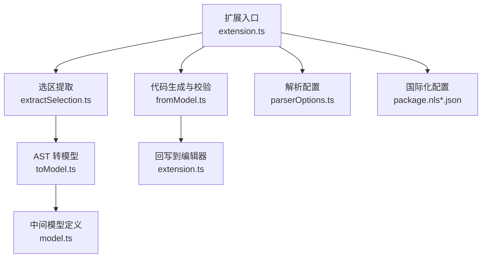
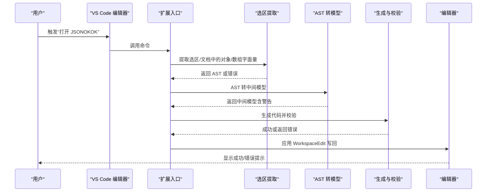
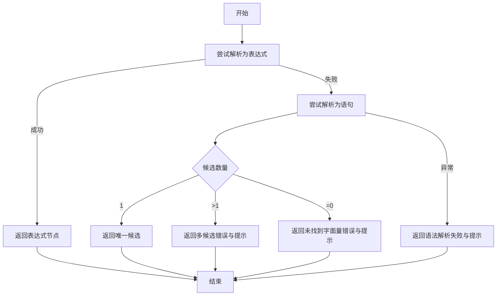
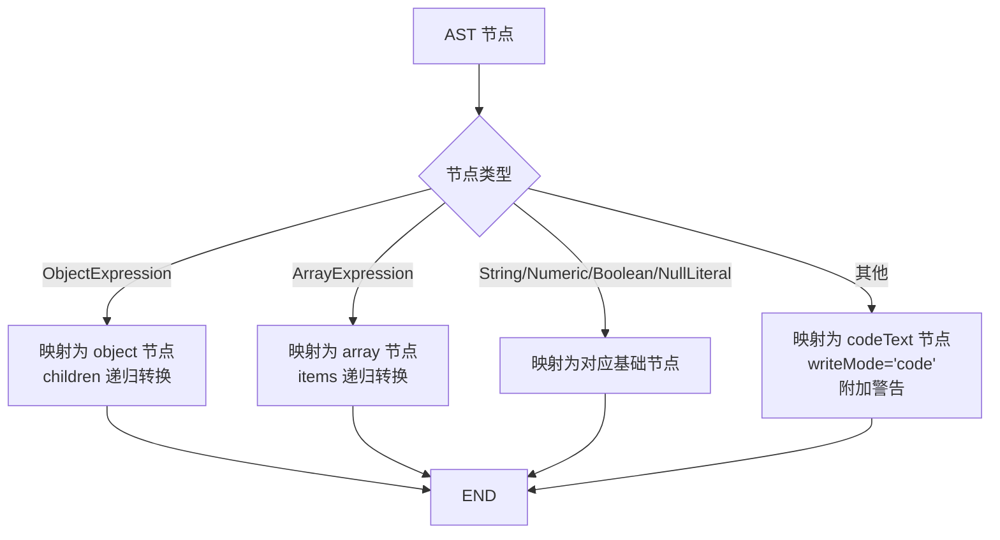
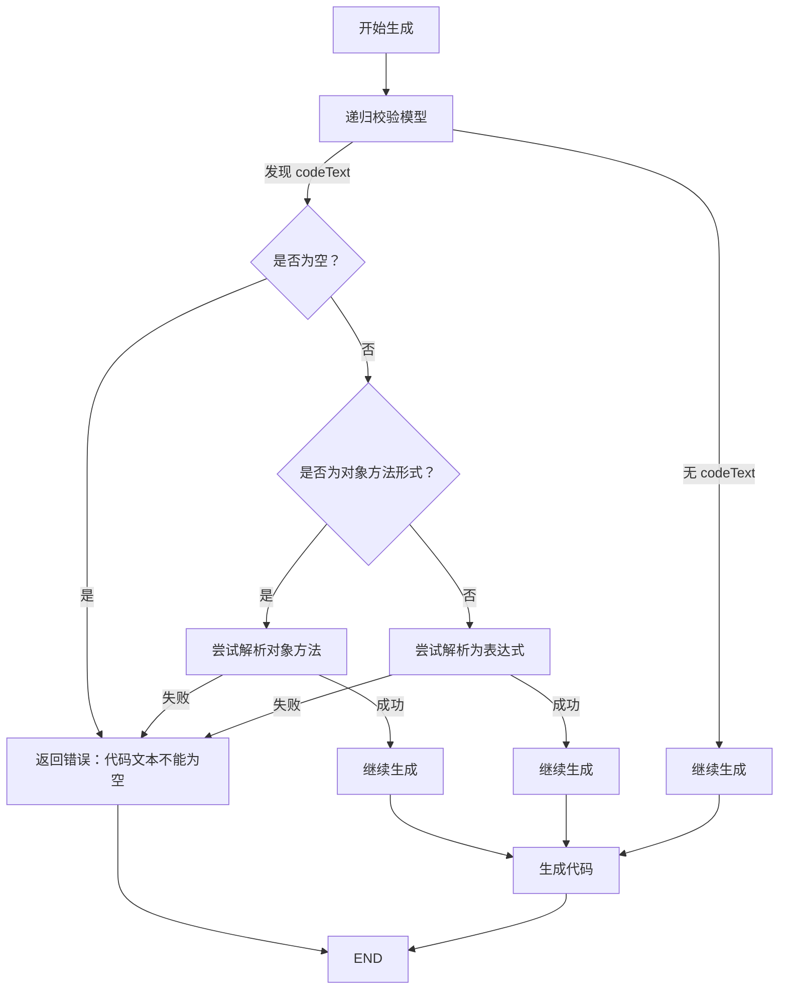
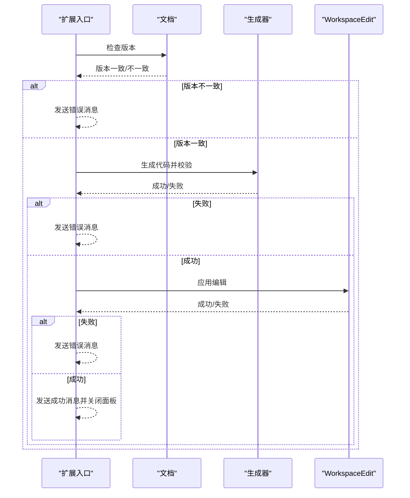
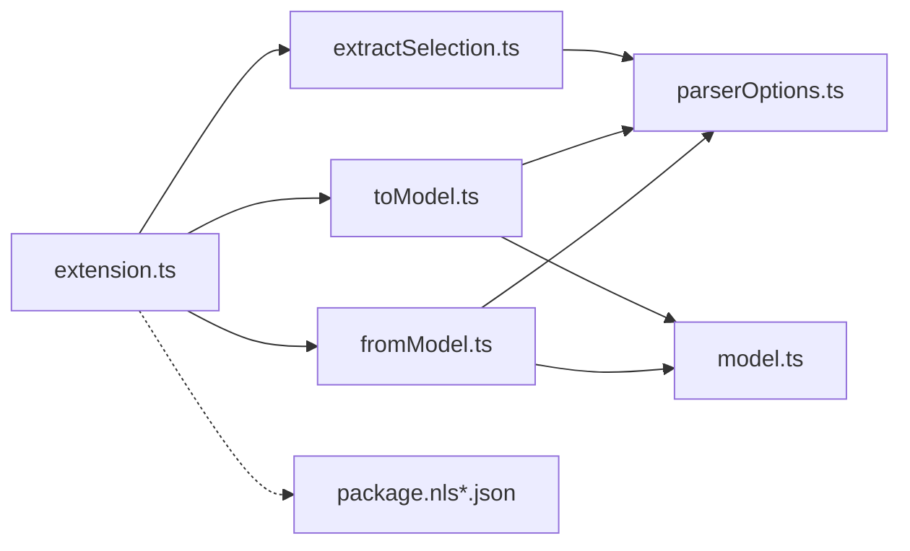

# 数据验证与错误处理

<cite>
**本文引用的文件**
- [src/extension.ts](file://src/extension.ts)
- [src/model.ts](file://src/model.ts)
- [src/parser/extractSelection.ts](file://src/parser/extractSelection.ts)
- [src/parser/toModel.ts](file://src/parser/toModel.ts)
- [src/parser/fromModel.ts](file://src/parser/fromModel.ts)
- [src/parser/parserOptions.ts](file://src/parser/parserOptions.ts)
- [package.json](file://package.json)
- [package.nls.json](file://package.nls.json)
- [package.nls.zh-CN.json](file://package.nls.zh-CN.json)
- [jsonDemo/001.json](file://jsonDemo/001.json)
- [jsonDemo/testData.js](file://jsonDemo/testData.js)
- [jsonDemo/ncc表单demo-res.json](file://jsonDemo/ncc表单demo-res.json)
- [jsonDemo/超大json家庭地址.json](file://jsonDemo/超大json家庭地址.json)
</cite>

## 目录
1. [简介](#简介)
2. [项目结构](#项目结构)
3. [核心组件](#核心组件)
4. [架构总览](#架构总览)
5. [详细组件分析](#详细组件分析)
6. [依赖关系分析](#依赖关系分析)
7. [性能考量](#性能考量)
8. [故障排查指南](#故障排查指南)
9. [结论](#结论)
10. [附录](#附录)

## 简介
本文件聚焦于 JSONOKOK 在 VS Code 扩展中的“数据验证与错误处理”能力，系统梳理从选区提取、AST 转中间模型、再到代码生成与回写过程中的验证策略、错误恢复与容错机制、异常处理与用户提示、警告系统设计、调试工具与最佳实践。目标是帮助开发者与使用者在复杂 JSON/JS 数据编辑场景中获得稳定、可预期且用户友好的体验。

## 项目结构
围绕数据验证与错误处理的关键模块如下：
- 扩展入口与命令：负责激活、注册命令、接收编辑器上下文、触发解析与回写流程
- 解析层：从选区/文档中提取对象/数组字面量，容错处理多种边界情况
- 中间模型：统一抽象 JSON/JS 值，区分可编辑与代码文本节点，并携带警告信息
- 代码生成与回写：在写回前进行语法与结构验证，失败时给出明确错误提示
- 国际化与本地化：通过语言偏好控制菜单与提示文案

**图表来源**
- [src/extension.ts:19-378](file://src/extension.ts#L19-L378)
- [src/parser/extractSelection.ts:34-101](file://src/parser/extractSelection.ts#L34-L101)
- [src/parser/toModel.ts:10-90](file://src/parser/toModel.ts#L10-L90)
- [src/model.ts:15-54](file://src/model.ts#L15-L54)
- [src/parser/fromModel.ts:20-57](file://src/parser/fromModel.ts#L20-L57)
- [src/parser/parserOptions.ts:20-35](file://src/parser/parserOptions.ts#L20-L35)
- [package.nls.json:1-4](file://package.nls.json#L1-L4)
- [package.nls.zh-CN.json:1-4](file://package.nls.zh-CN.json#L1-L4)

**章节来源**
- [src/extension.ts:19-378](file://src/extension.ts#L19-L378)
- [src/parser/extractSelection.ts:34-101](file://src/parser/extractSelection.ts#L34-L101)
- [src/parser/toModel.ts:10-90](file://src/parser/toModel.ts#L10-L90)
- [src/parser/fromModel.ts:20-57](file://src/parser/fromModel.ts#L20-L57)
- [src/model.ts:15-54](file://src/model.ts#L15-L54)
- [src/parser/parserOptions.ts:20-35](file://src/parser/parserOptions.ts#L20-L35)
- [package.nls.json:1-4](file://package.nls.json#L1-L4)
- [package.nls.zh-CN.json:1-4](file://package.nls.zh-CN.json#L1-L4)

## 核心组件
- 验证与错误处理贯穿以下环节：
  - 选区提取阶段：对空选区、多候选、无候选、语法失败等情况进行分类与提示
  - AST 转模型阶段：将对象/数组/字面量映射为中间模型，非 JSON 表达式作为代码文本节点并附带警告
  - 编辑后生成阶段：对所有代码文本节点执行语法校验，拒绝无效代码
  - 写回阶段：版本一致性检查、应用编辑、异常捕获与错误提示

**章节来源**
- [src/parser/extractSelection.ts:34-101](file://src/parser/extractSelection.ts#L34-L101)
- [src/parser/toModel.ts:10-90](file://src/parser/toModel.ts#L10-L90)
- [src/parser/fromModel.ts:67-117](file://src/parser/fromModel.ts#L67-L117)
- [src/extension.ts:420-490](file://src/extension.ts#L420-L490)

## 架构总览
整体流程从 VS Code 编辑器出发，经由选区提取与 AST 解析，构建中间模型，再生成代码并回写。关键验证点均在“生成前”和“写回前”执行，确保输出始终可解析、可回写。

**图表来源**
- [src/extension.ts:46-378](file://src/extension.ts#L46-L378)
- [src/parser/extractSelection.ts:108-229](file://src/parser/extractSelection.ts#L108-L229)
- [src/parser/toModel.ts:10-90](file://src/parser/toModel.ts#L10-L90)
- [src/parser/fromModel.ts:20-57](file://src/parser/fromModel.ts#L20-L57)

## 详细组件分析

### 1) 选区提取与语法验证
- 支持直接表达式解析与语句解析两种路径；若语句中存在多个对象/数组字面量，明确提示用户精确选择
- 对空选区、语法失败、未找到字面量等情形分别返回错误与提示
- 文档级提取采用 AST 遍历优先匹配，若失败则回退到基于括号的轻量扫描，兼顾性能与可用性

**图表来源**
- [src/parser/extractSelection.ts:34-101](file://src/parser/extractSelection.ts#L34-L101)

**章节来源**
- [src/parser/extractSelection.ts:34-101](file://src/parser/extractSelection.ts#L34-L101)
- [src/parser/extractSelection.ts:108-229](file://src/parser/extractSelection.ts#L108-L229)

### 2) AST 到中间模型转换与类型检查
- 对象/数组/字符串/数字/布尔/null 分别映射为对应 kind 的节点
- 非 JSON 表达式（函数、日期、符号、标识符、调用等）统一作为“代码文本节点”，并设置 writeMode 为 code，同时附加警告提示
- 对象属性键为计算属性时，回退为代码文本；扩展运算符（...）标记为不可编辑并附警告
- 数组中的空洞被映射为 null 节点，扩展运算符同样标记为不可编辑并附警告

**图表来源**
- [src/parser/toModel.ts:10-90](file://src/parser/toModel.ts#L10-L90)
- [src/parser/toModel.ts:92-209](file://src/parser/toModel.ts#L92-L209)

**章节来源**
- [src/parser/toModel.ts:10-90](file://src/parser/toModel.ts#L10-L90)
- [src/parser/toModel.ts:92-209](file://src/parser/toModel.ts#L92-L209)

### 3) 代码生成与结构完整性验证
- 生成前对模型进行递归校验：若存在 codeText 节点，需满足以下条件之一：
  - 为空（不允许）
  - 为对象方法形式（包裹在 {} 中），可被解析为对象方法
  - 可作为 JS 表达式被解析
- 生成过程中对对象键进行合法性判断（合法标识符可省略引号），数组/对象块级缩进与换行处理
- 生成结果支持按原始缩进进行统一缩进

**图表来源**
- [src/parser/fromModel.ts:67-117](file://src/parser/fromModel.ts#L67-L117)
- [src/parser/fromModel.ts:119-180](file://src/parser/fromModel.ts#L119-L180)

**章节来源**
- [src/parser/fromModel.ts:20-57](file://src/parser/fromModel.ts#L20-L57)
- [src/parser/fromModel.ts:67-117](file://src/parser/fromModel.ts#L67-L117)
- [src/parser/fromModel.ts:119-180](file://src/parser/fromModel.ts#L119-L180)

### 4) 写回流程与版本一致性检查
- 写回前检查文档版本是否变化，若变化则提示用户重新打开编辑器，避免覆盖更改
- 生成代码后进行 WorkspaceEdit 应用，失败时捕获异常并提示
- 成功后短延迟关闭面板并提示用户

**图表来源**
- [src/extension.ts:420-490](file://src/extension.ts#L420-L490)

**章节来源**
- [src/extension.ts:420-490](file://src/extension.ts#L420-L490)

### 5) 错误恢复策略与容错机制
- 选区提取阶段：
  - 多候选：提示用户精确选择
  - 无候选：提示选择对象/数组字面量或其初始化语句
  - 语法失败：提示选区为有效 JS 代码
- AST 转模型阶段：
  - 非 JSON 表达式转为 codeText 并警告，保证编辑器仍可继续工作
  - 扩展运算符标记为不可编辑并警告，避免生成不可解析代码
- 生成阶段：
  - 对空代码文本直接拒绝
  - 对对象方法形式进行特殊解析，提升兼容性
  - 对表达式解析失败给出具体错误信息

**章节来源**
- [src/parser/extractSelection.ts:34-101](file://src/parser/extractSelection.ts#L34-L101)
- [src/parser/toModel.ts:113-145](file://src/parser/toModel.ts#L113-L145)
- [src/parser/fromModel.ts:92-117](file://src/parser/fromModel.ts#L92-L117)

### 6) 异常处理与用户提示
- 全局 try/catch 包裹关键流程（模型转换、代码生成、写回应用）
- 使用 VS Code API 展示错误/信息消息，确保用户可见
- 写回阶段失败时包含详细错误信息，便于定位问题

**章节来源**
- [src/extension.ts:126-131](file://src/extension.ts#L126-L131)
- [src/extension.ts:213-220](file://src/extension.ts#L213-L220)
- [src/extension.ts:454-486](file://src/extension.ts#L454-L486)

### 7) 警告系统设计
- 中间模型节点支持 warning 字段，用于承载兼容性、语法或编辑限制提示
- 对象方法、扩展运算符、非 JSON 表达式等场景均附加相应警告
- 警告在 UI 中呈现，帮助用户理解当前节点的编辑限制与潜在风险

**章节来源**
- [src/model.ts:28-34](file://src/model.ts#L28-L34)
- [src/parser/toModel.ts:113-145](file://src/parser/toModel.ts#L113-L145)
- [src/parser/toModel.ts:180-194](file://src/parser/toModel.ts#L180-L194)

### 8) 调试工具与诊断
- 日志记录：扩展入口与消息处理中使用 console 输出关键状态与错误
- 堆栈跟踪：捕获异常时保留错误消息，便于定位问题
- 诊断建议：
  - 选区提取失败时检查选区是否为有效 JS 代码
  - 生成失败时检查是否存在空的 codeText 节点或非法表达式
  - 写回失败时确认文档未被外部修改导致版本不一致

**章节来源**
- [src/extension.ts:310-311](file://src/extension.ts#L310-L311)
- [src/extension.ts:454-486](file://src/extension.ts#L454-L486)

## 依赖关系分析
- 扩展入口依赖解析模块与模型定义
- 解析模块依赖 @babel/parser 与 @babel/types 进行语法解析与类型判断
- 代码生成模块依赖 @babel/parser 进行表达式校验
- 国际化配置通过 package.nls*.json 控制菜单标题与语言偏好

**图表来源**
- [src/extension.ts:1-16](file://src/extension.ts#L1-L16)
- [src/parser/extractSelection.ts:6-11](file://src/parser/extractSelection.ts#L6-L11)
- [src/parser/toModel.ts:6-8](file://src/parser/toModel.ts#L6-L8)
- [src/parser/fromModel.ts:6-8](file://src/parser/fromModel.ts#L6-L8)
- [src/parser/parserOptions.ts:1-1](file://src/parser/parserOptions.ts#L1-L1)
- [package.json:78-91](file://package.json#L78-L91)

**章节来源**
- [src/extension.ts:1-16](file://src/extension.ts#L1-L16)
- [src/parser/extractSelection.ts:6-11](file://src/parser/extractSelection.ts#L6-L11)
- [src/parser/toModel.ts:6-8](file://src/parser/toModel.ts#L6-L8)
- [src/parser/fromModel.ts:6-8](file://src/parser/fromModel.ts#L6-L8)
- [src/parser/parserOptions.ts:1-1](file://src/parser/parserOptions.ts#L1-L1)
- [package.json:78-91](file://package.json#L78-L91)

## 性能考量
- 选区提取的回退策略限制扫描窗口大小，避免对超大文档造成性能负担
- 生成阶段对缩进与换行进行逐行处理，保持可读性的同时尽量减少内存占用
- 通过版本检查避免不必要的写回尝试，减少无效操作

**章节来源**
- [src/parser/extractSelection.ts:242-243](file://src/parser/extractSelection.ts#L242-L243)
- [src/parser/fromModel.ts:35-45](file://src/parser/fromModel.ts#L35-L45)

## 故障排查指南
- 常见错误场景与解决步骤：
  - 选区为空：检查编辑器中是否有选区，确保选区为对象/数组字面量或其初始化语句
  - 多个候选对象/数组：重新选择，确保选区内仅包含一个对象/数组字面量
  - 未找到对象/数组字面量：确认选区包含 {...} 或 [...]，或包含它们的变量初始化
  - 语法解析失败：确保选区为有效 JavaScript 代码
  - 代码文本为空：为 codeText 节点填入有效表达式或删除该节点
  - 对象方法解析失败：确保方法形式符合要求（包裹在 {} 中）
  - 文档版本不一致：重新打开编辑器以避免覆盖更改
  - 写回应用失败：检查编辑器是否被外部修改，或权限/锁定问题

- 预防措施：
  - 在复杂 JS 文件中优先使用“选择对象/数组字面量”的方式
  - 对非 JSON 表达式保持谨慎，必要时将其改为安全的 JSON 形式
  - 定期保存并避免在编辑器中同时进行多处修改

**章节来源**
- [src/parser/extractSelection.ts:34-101](file://src/parser/extractSelection.ts#L34-L101)
- [src/parser/fromModel.ts:92-117](file://src/parser/fromModel.ts#L92-L117)
- [src/extension.ts:420-490](file://src/extension.ts#L420-L490)

## 结论
JSONOKOK 在数据验证与错误处理方面形成了“提取—转换—生成—回写”的闭环验证体系：在每个关键节点进行类型与语法校验，结合警告提示与用户提示，确保输出始终可解析、可回写。通过容错与回退策略，系统在面对复杂或不规范输入时仍能提供稳定体验。配合国际化与本地化支持，进一步提升了跨语言用户的可用性。

## 附录
- 示例数据参考：
  - [jsonDemo/001.json:1-23](file://jsonDemo/001.json#L1-L23)
  - [jsonDemo/testData.js:1-104](file://jsonDemo/testData.js#L1-L104)
  - [jsonDemo/ncc表单demo-res.json:1-800](file://jsonDemo/ncc表单demo-res.json#L1-L800)
  - [jsonDemo/超大json家庭地址.json:1-5](file://jsonDemo/超大json家庭地址.json#L1-L5)

**章节来源**
- [jsonDemo/001.json:1-23](file://jsonDemo/001.json#L1-L23)
- [jsonDemo/testData.js:1-104](file://jsonDemo/testData.js#L1-L104)
- [jsonDemo/ncc表单demo-res.json:1-800](file://jsonDemo/ncc表单demo-res.json#L1-L800)
- [jsonDemo/超大json家庭地址.json:1-5](file://jsonDemo/超大json家庭地址.json#L1-L5)