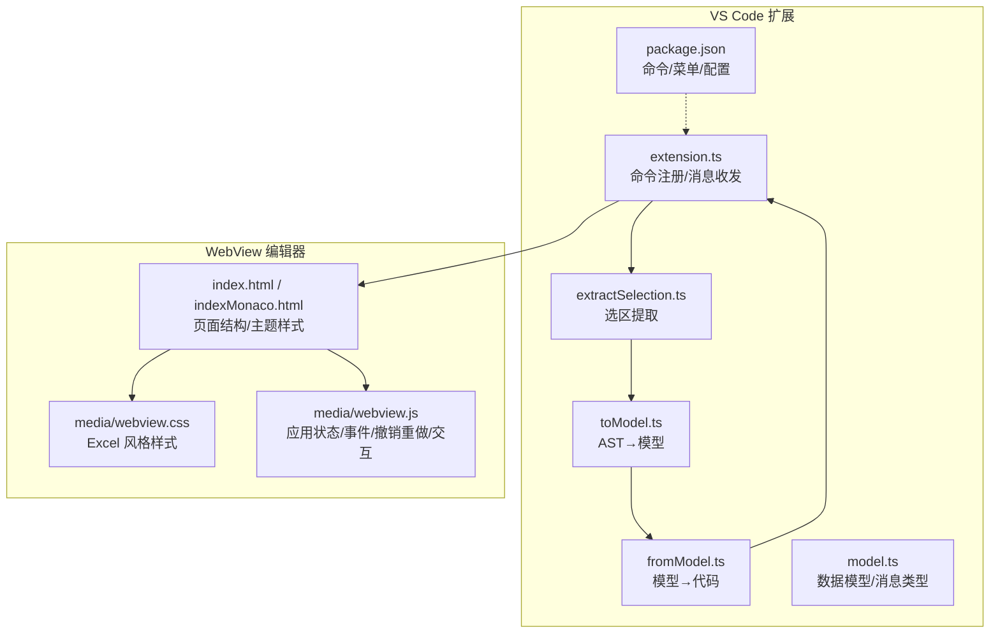
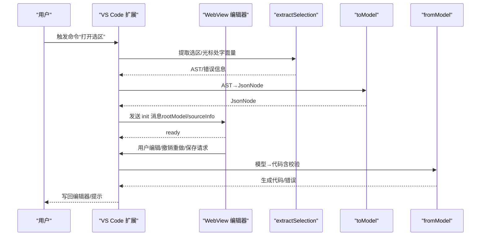
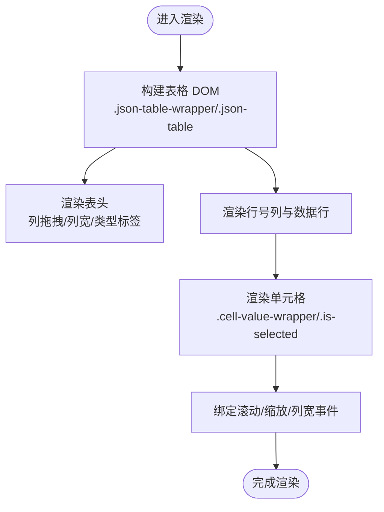
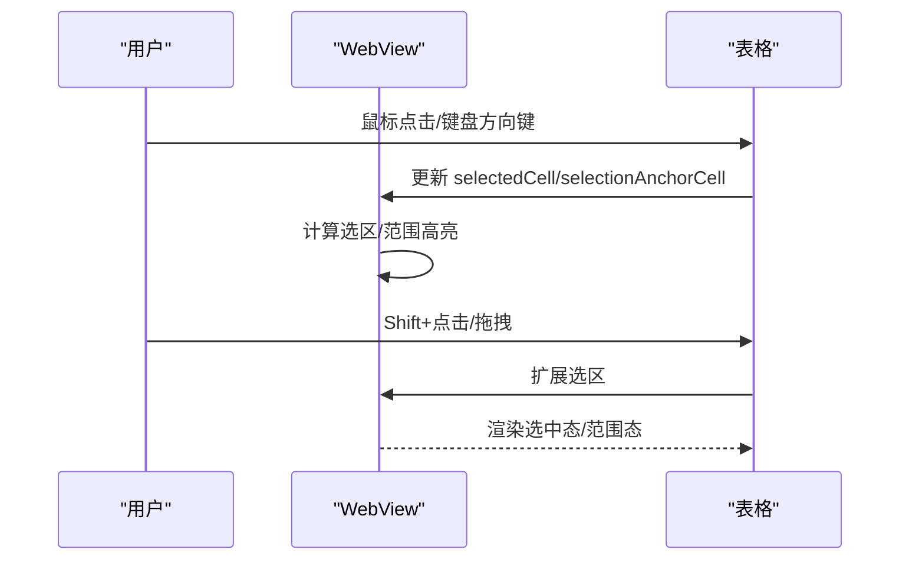
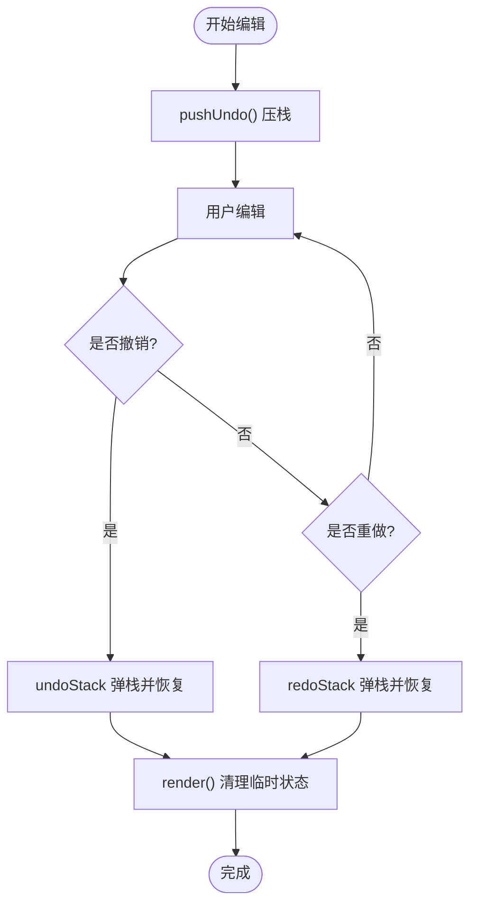
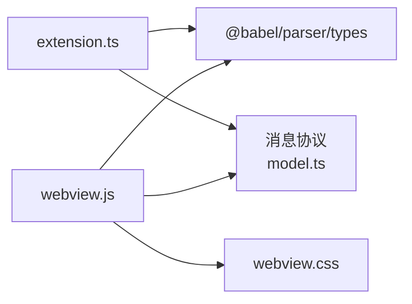

# 编辑器功能

<cite>
**本文引用的文件**
- [index.html](file://index.html)
- [indexMonaco.html](file://indexMonaco.html)
- [media/webview.js](file://media/webview.js)
- [media/webview.css](file://media/webview.css)
- [src/extension.ts](file://src/extension.ts)
- [src/model.ts](file://src/model.ts)
- [src/parser/extractSelection.ts](file://src/parser/extractSelection.ts)
- [src/parser/toModel.ts](file://src/parser/toModel.ts)
- [src/parser/fromModel.ts](file://src/parser/fromModel.ts)
- [src/parser/parserOptions.ts](file://src/parser/parserOptions.ts)
- [package.json](file://package.json)
- [jsonDemo/001.json](file://jsonDemo/001.json)
- [jsonDemo/ncc表单demo-res.json](file://jsonDemo/ncc表单demo-res.json)
- [jsonDemo/超大json家庭地址.json](file://jsonDemo/超大json家庭地址.json)
</cite>

## 目录
1. [简介](#简介)
2. [项目结构](#项目结构)
3. [核心组件](#核心组件)
4. [架构总览](#架构总览)
5. [详细组件分析](#详细组件分析)
6. [依赖关系分析](#依赖关系分析)
7. [性能考虑](#性能考虑)
8. [故障排查指南](#故障排查指南)
9. [结论](#结论)
10. [附录](#附录)

## 简介
本文件面向 wysJSON 的编辑器功能，系统性阐述其 Excel 风格表格实现机制与交互体系，涵盖单元格渲染、行列操作、表格布局策略、导航与选择、批量编辑、撤销重做、快捷键与上下文菜单、界面定制、性能优化与响应式设计、无障碍支持以及用户操作指南与最佳实践。

## 项目结构
仓库采用“VS Code 扩展 + WebView 内嵌编辑器”的双层架构：VS Code 扩展负责提取选区、构建中间模型、与编辑器通信；WebView 层负责表格渲染、交互事件处理、状态管理与持久化。

图表来源
- [src/extension.ts](file://src/extension.ts)
- [src/parser/extractSelection.ts](file://src/parser/extractSelection.ts)
- [src/parser/toModel.ts](file://src/parser/toModel.ts)
- [src/parser/fromModel.ts](file://src/parser/fromModel.ts)
- [src/model.ts](file://src/model.ts)
- [package.json](file://package.json)
- [index.html](file://index.html)
- [indexMonaco.html](file://indexMonaco.html)
- [media/webview.css](file://media/webview.css)
- [media/webview.js](file://media/webview.js)

章节来源
- [src/extension.ts](file://src/extension.ts)
- [src/parser/extractSelection.ts](file://src/parser/extractSelection.ts)
- [src/parser/toModel.ts](file://src/parser/toModel.ts)
- [src/parser/fromModel.ts](file://src/parser/fromModel.ts)
- [src/model.ts](file://src/model.ts)
- [package.json](file://package.json)
- [index.html](file://index.html)
- [indexMonaco.html](file://indexMonaco.html)
- [media/webview.css](file://media/webview.css)
- [media/webview.js](file://media/webview.js)

## 核心组件
- 数据模型与消息协议
  - JsonNode 及其 kind（object/array/string/number/boolean/null/codeText），children/items/sourceKind/writeMode 等字段承载可视化与编辑能力。
  - WebviewMessage/InitMessage/SaveMessage/PreviewMessage/CancelMessage 定义扩展与 WebView 的消息契约。
- 选区提取与 AST 转换
  - extractSelection：从选区/光标位置提取对象/数组字面量，支持 Markdown 代码块与 JS/TS/纯文本场景。
  - toModel：将 AST 节点映射为 JsonNode，保留原始代码以便回写。
  - fromModel：将编辑后的 JsonNode 生成代码，含语法校验与缩进处理。
- 扩展与 WebView 通信
  - extension.ts 注册命令、构造 webview、发送/接收消息、写回编辑器。
  - media/webview.js 维护应用状态、事件绑定、撤销重做、UI 状态持久化、国际化与工具栏交互。

章节来源
- [src/model.ts](file://src/model.ts)
- [src/parser/extractSelection.ts](file://src/parser/extractSelection.ts)
- [src/parser/toModel.ts](file://src/parser/toModel.ts)
- [src/parser/fromModel.ts](file://src/parser/fromModel.ts)
- [src/extension.ts](file://src/extension.ts)
- [media/webview.js](file://media/webview.js)

## 架构总览
编辑器采用“选区提取 → AST 转模型 → WebView 渲染 → 用户编辑 → 代码生成 → 写回 VS Code”的闭环流程。

图表来源
- [src/extension.ts](file://src/extension.ts)
- [src/parser/extractSelection.ts](file://src/parser/extractSelection.ts)
- [src/parser/toModel.ts](file://src/parser/toModel.ts)
- [src/parser/fromModel.ts](file://src/parser/fromModel.ts)
- [media/webview.js](file://media/webview.js)

## 详细组件分析

### Excel 风格表格与单元格渲染
- 表格结构
  - 使用 .json-table-wrapper/.json-table 实现 Excel 风格网格，表头固定吸顶，行列边框与悬停/选中态通过 CSS 控制。
  - 行号列、列头、数据单元格分别对应 .row-num-header、th、td，支持列宽调整、列拖拽排序、嵌套展开/折叠。
- 单元格渲染
  - 单元格内容通过 .cell-value-wrapper 包裹，支持选中态、编辑态、范围选择态的视觉反馈。
  - 嵌套内容使用 .nested-content 与 .nested-badge 辅助标识。
- 列宽与缩放
  - 通过 .col-resizer 与列宽缓存 columnWidthCache 支持拖拽调整列宽；缩放通过 editorScale 与缩放容器实现。
- 响应式与滚动
  - editor-canvas 使用 max-content/min-width/min-height 适配内容尺寸；滚动联动缩略图/小地图位置更新。

图表来源
- [media/webview.css](file://media/webview.css)
- [media/webview.js](file://media/webview.js)

章节来源
- [media/webview.css](file://media/webview.css)
- [media/webview.js](file://media/webview.js)

### 行列操作与布局策略
- 插入/删除行/列
  - 通过上下文菜单与工具栏触发，涉及 modelNodeMap 重建、focusPath 更新、渲染刷新。
- 列排序与拖拽
  - 支持列头拖拽排序，拖拽过程中显示拖拽指示与目标位置提示。
- 嵌套展开/折叠
  - 通过 columnStates/nestedStates 记录展开状态，支持按路径聚焦与返回根。
- 布局策略
  - editor-canvas 最小尺寸适配，右侧预留滚动条空间；缩略图/小地图独立定位，滚动时同步更新视口。

章节来源
- [media/webview.js](file://media/webview.js)

### 导航与选择（键盘/鼠标/多选）
- 键盘导航
  - 支持方向键移动、Home/End、PageUp/PageDown、Tab/Shift+Tab、Enter 进入编辑、Esc 退出编辑。
  - 全局撤销/重做快捷键 Ctrl/Cmd+Z/Y。
- 鼠标交互
  - 单击选择、双击进入编辑、拖拽选择范围、拖拽填充柄进行批量填充。
  - 右键上下文菜单提供常用操作。
- 多选与范围选择
  - 通过 selectionAnchorCell 与 selectedRangeCells 维护选区，支持连续区域与非连续区域的组合选择。
- 焦点与面包屑
  - 面包屑展示当前聚焦路径，支持点击快速定位；焦点态高亮对应列/行头。

图表来源
- [media/webview.js](file://media/webview.js)

章节来源
- [media/webview.js](file://media/webview.js)

### 批量编辑（复制/粘贴/拖拽/批量修改）
- 复制/粘贴
  - 支持跨单元格/跨行/跨列的复制与粘贴，粘贴时根据选区大小与形状进行矩阵填充。
- 拖拽填充
  - 通过填充柄（selection-fill-handle）拖拽，自动推断递增/重复模式并批量写入。
- 批量修改
  - 选区内的批量类型转换、批量置空、批量替换 null 等操作通过上下文菜单触发。

章节来源
- [media/webview.js](file://media/webview.js)

### 撤销/重做机制
- 状态快照
  - pushUndo/createEditorSnapshot/restoreEditorSnapshot 维护编辑器状态快照，包含 data 与 model。
- 历史栈
  - undoStack/redoStack 固定最大长度（maxUndo），超出时移除最早快照。
- 状态恢复
  - 撤销/重做时清理临时状态（编辑中单元格、悬停、选区等），重新渲染并同步 textarea（扩展模式下为占位）。

图表来源
- [media/webview.js](file://media/webview.js)

章节来源
- [media/webview.js](file://media/webview.js)

### 快捷键系统、上下文菜单与界面定制
- 快捷键
  - Ctrl/Cmd+Z 撤销、Ctrl/Cmd+Y 重做；方向键/Home/End/PageUp/PageDown 导航；Enter 开始编辑；Esc 结束编辑。
- 上下文菜单
  - 支持插入行/列、删除行/列/节点、聚焦节点、类型转换、批量置空等。
- 界面定制
  - 工具栏包含保存、撤销/重做、清除 null、null 作为字符串开关、缩略图/快速跳转开关、语言切换等。
  - UI 状态通过 localStorage 持久化（缩略图/快速跳转开关、宽度、偏移等）。

章节来源
- [media/webview.js](file://media/webview.js)
- [media/webview.css](file://media/webview.css)

### 性能优化与响应式设计
- 渲染优化
  - 使用虚拟滚动思想（实际为内容自适应），仅渲染可视区域相关节点；列宽缓存减少重排；缩放通过 zoom 减少重绘。
- 事件节流
  - 滚动事件联动缩略图/小地图位置更新，避免频繁 DOM 查询。
- 响应式布局
  - editor-canvas 与 table-view 自适应容器尺寸；小地图/缩略图独立定位，不影响主表格布局。
- 大数据适配
  - 通过分页/懒加载思路（当前实现为一次性渲染）结合虚拟化策略可进一步优化超大数据集。

章节来源
- [media/webview.css](file://media/webview.css)
- [media/webview.js](file://media/webview.js)

### 无障碍支持
- 键盘可达性
  - 支持 Tab/Shift+Tab 导航、Enter 编辑、Esc 退出、方向键移动、Home/End、PageUp/PageDown。
- 屏幕阅读器友好
  - 表格结构语义化良好，行号列与列头具备明确角色与标题关联。
- 高对比度与颜色感知
  - 选中态、悬停态、范围选择态通过边框/背景色区分，满足色觉障碍用户的视觉需求。

章节来源
- [media/webview.css](file://media/webview.css)
- [media/webview.js](file://media/webview.js)

## 依赖关系分析
- 扩展层依赖
  - @babel/parser/@babel/types 用于语法解析与 AST 转换。
  - VS Code API 用于命令注册、消息收发、工作区编辑应用。
- WebView 层依赖
  - 本地资源（CSS/JS）通过 webview.asWebviewUri 注入，遵循 CSP 策略。
  - 本地存储用于 UI 状态持久化。

图表来源
- [src/extension.ts](file://src/extension.ts)
- [src/model.ts](file://src/model.ts)
- [src/parser/parserOptions.ts](file://src/parser/parserOptions.ts)
- [media/webview.js](file://media/webview.js)
- [media/webview.css](file://media/webview.css)

章节来源
- [src/extension.ts](file://src/extension.ts)
- [src/model.ts](file://src/model.ts)
- [src/parser/parserOptions.ts](file://src/parser/parserOptions.ts)
- [media/webview.js](file://media/webview.js)
- [media/webview.css](file://media/webview.css)

## 性能考虑
- 渲染层面
  - 避免全量重绘：通过最小化 DOM 更新与缓存列宽，减少布局抖动。
  - 缩放与滚动：使用 transform/zoom 与事件去抖，降低重排成本。
- 数据层面
  - 撤销栈容量限制（maxUndo）控制内存占用；快照采用浅拷贝策略，必要时进行深拷贝以避免共享引用问题。
- 大数据场景
  - 当前实现为一次性渲染，建议引入虚拟滚动与分页策略，按需渲染可见区域。

## 故障排查指南
- 无法识别选区/光标处数据结构
  - 检查选区是否为对象/数组字面量或包含它们的变量声明；Markdown 代码块需正确使用围栏标记。
- 保存失败/写回冲突
  - 若文档版本发生变化，扩展会拒绝写回；请重新打开编辑器以避免覆盖更改。
- 代码生成错误
  - 模型中存在无效的 JavaScript 代码文本节点会导致生成失败；检查上下文菜单中的警告信息并修正。
- UI 状态异常
  - 清理 localStorage 中的 UI 状态键（如缩略图/快速跳转开关、宽度、偏移）后重启编辑器。

章节来源
- [src/extension.ts](file://src/extension.ts)
- [src/parser/fromModel.ts](file://src/parser/fromModel.ts)
- [media/webview.js](file://media/webview.js)

## 结论
wysJSON 编辑器以 VS Code 扩展为入口，结合 WebView 内嵌表格，实现了从选区提取、AST 转模型、到可视化编辑与代码生成的完整链路。其 Excel 风格表格具备完善的导航、选择、批量编辑与撤销重做能力，并通过本地存储与国际化提升用户体验。针对大数据场景，建议引入虚拟滚动与分页策略以进一步优化性能。

## 附录
- 示例数据
  - [jsonDemo/001.json](file://jsonDemo/001.json)
  - [jsonDemo/ncc表单demo-res.json](file://jsonDemo/ncc表单demo-res.json)
  - [jsonDemo/超大json家庭地址.json](file://jsonDemo/超大json家庭地址.json)
- 页面与样式
  - [index.html](file://index.html)
  - [indexMonaco.html](file://indexMonaco.html)
  - [media/webview.css](file://media/webview.css)
- 扩展与模型
  - [src/extension.ts](file://src/extension.ts)
  - [src/model.ts](file://src/model.ts)
  - [package.json](file://package.json)