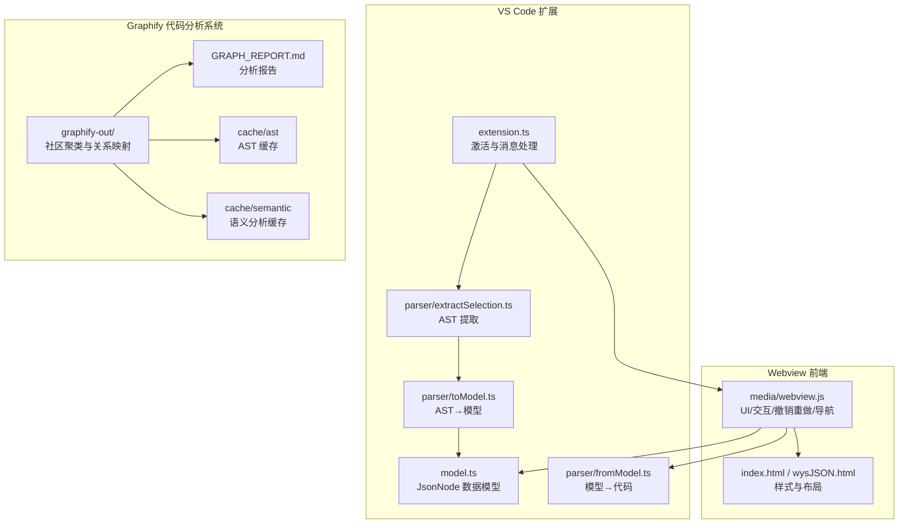
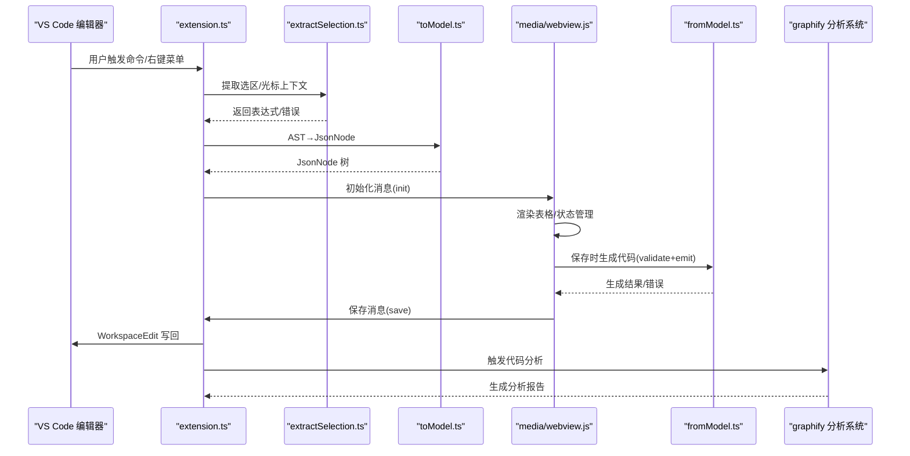
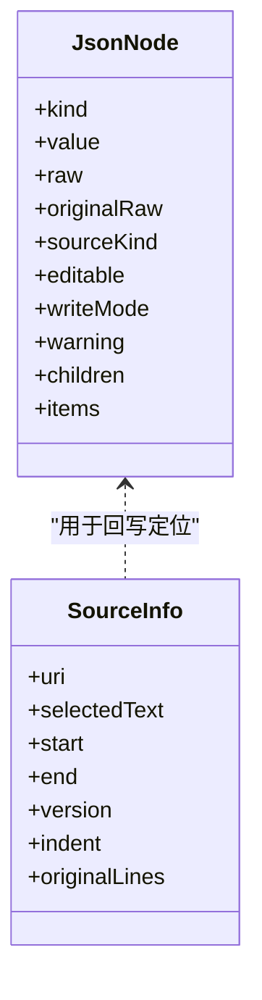
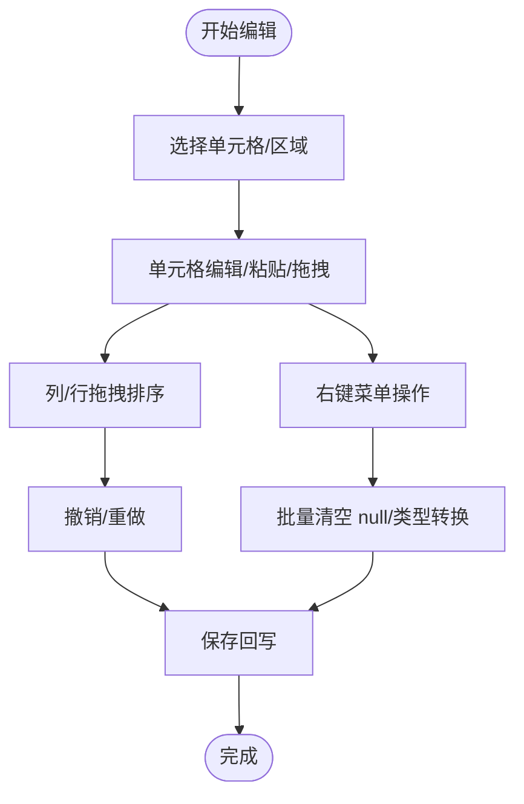
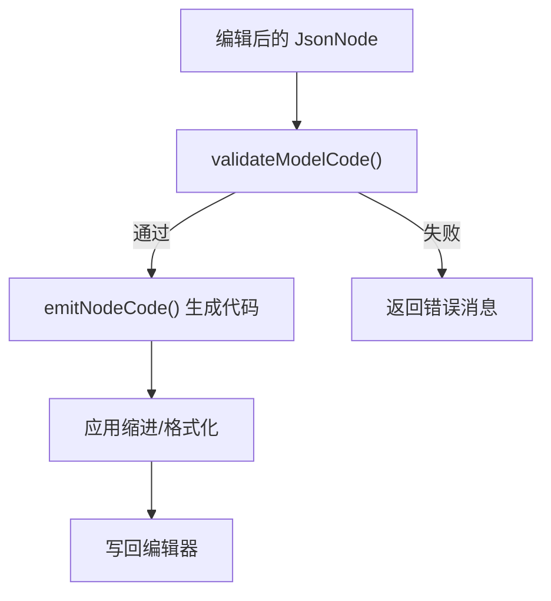
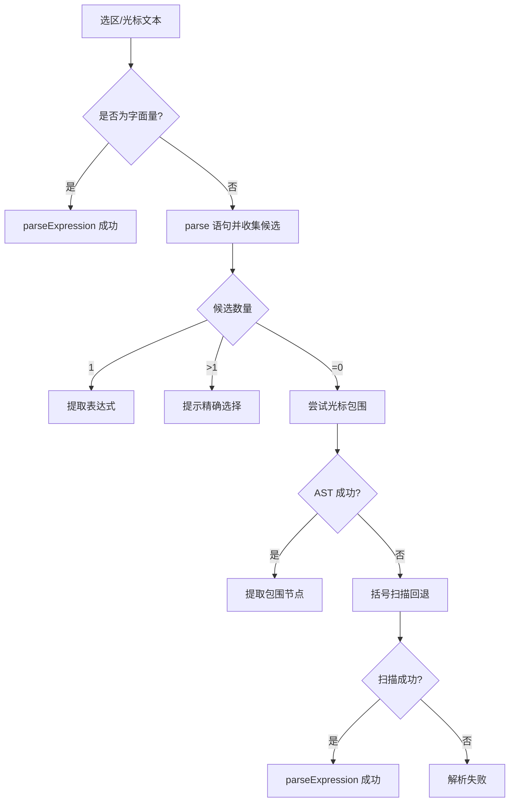
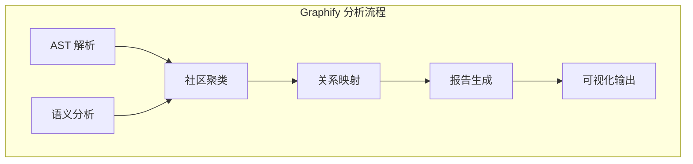
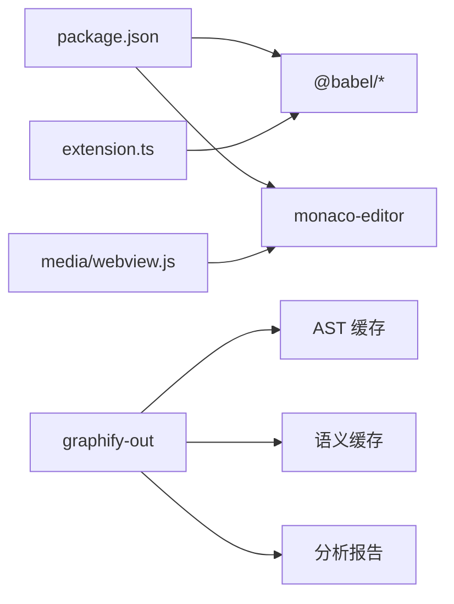

# 高级功能特性

<cite>
**本文引用的文件**
- [package.json](file://package.json)
- [extension.ts](file://src/extension.ts)
- [model.ts](file://src/model.ts)
- [extractSelection.ts](file://src/parser/extractSelection.ts)
- [toModel.ts](file://src/parser/toModel.ts)
- [fromModel.ts](file://src/parser/fromModel.ts)
- [webview.js](file://media/webview.js)
- [index.html](file://index.html)
- [wysJSON.html](file://wysJSON.html)
- [GRAPH_REPORT.md](file://graphify-out/GRAPH_REPORT.md)
- [GRAPH_REPORT.md](file://graphify-out/2026-06-05/GRAPH_REPORT.md)
- [graph.json](file://graphify-out/2026-06-05/graph.json)
- [manifest.json](file://graphify-out/2026-06-05/manifest.json)
</cite>

## 更新摘要
**所做更改**
- 新增 graphify 代码分析系统功能章节，涵盖社区聚类、关系映射和语义分析报告
- 更新架构总览图，增加代码分析系统集成
- 新增代码分析工作流程和最佳实践指导
- 扩展性能考量章节，包含大文件处理策略

## 目录
1. [简介](#简介)
2. [项目结构](#项目结构)
3. [核心组件](#核心组件)
4. [架构总览](#架构总览)
5. [详细组件分析](#详细组件分析)
6. [依赖关系分析](#依赖关系分析)
7. [性能考量](#性能考量)
8. [故障排查指南](#故障排查指南)
9. [结论](#结论)
10. [附录](#附录)

## 简介
本文件面向 wysJSON 的高级用户与集成开发者，系统性阐述其"高级功能特性"，涵盖复杂数据类型处理机制、编辑器功能（表格导航与选择、批量编辑、撤销重做、键盘快捷键）、性能优化策略（大文件处理、内存与渲染优化）、数据验证与错误恢复、高级使用技巧与工作流优化，以及性能监控与调试建议。**新增** graphify 代码分析系统功能，提供全面的代码库可视化分析，包括社区聚类、关系映射和语义分析报告。内容基于仓库源码进行深度解析，并辅以可视化图示帮助理解。

## 项目结构
该工程采用 VS Code 扩展与 Webview 前端分离的架构：VS Code 扩展负责提取选区/光标上下文、构建中间模型、与编辑器交互；Webview 前端负责表格渲染、交互与状态管理；解析器模块负责 AST 提取与模型转换。**新增** graphify 代码分析系统，提供独立的代码库分析能力。

**图表来源**
- [extension.ts:1-600](file://src/extension.ts#L1-L600)
- [model.ts:1-103](file://src/model.ts#L1-L103)
- [extractSelection.ts:1-385](file://src/parser/extractSelection.ts#L1-L385)
- [toModel.ts:1-230](file://src/parser/toModel.ts#L1-L230)
- [fromModel.ts:1-305](file://src/parser/fromModel.ts#L1-L305)
- [webview.js:1-2000](file://media/webview.js#L1-L2000)
- [index.html:1-800](file://index.html#L1-L800)
- [wysJSON.html:1-800](file://wysJSON.html#L1-L800)
- [GRAPH_REPORT.md:1-1600](file://graphify-out/GRAPH_REPORT.md#L1-L1600)

**章节来源**
- [package.json:1-93](file://package.json#L1-L93)
- [extension.ts:1-600](file://src/extension.ts#L1-L600)
- [model.ts:1-103](file://src/model.ts#L1-L103)

## 核心组件
- 数据模型与消息契约
  - JsonNode：统一表示对象、数组、字符串、数字、布尔、null、代码文本等节点类型，支持 children/items、原始 raw 文本、sourceKind、writeMode 等元信息。
  - SourceInfo：记录源文件位置、版本、缩进、原始行等，用于安全回写。
  - Webview 消息：InitMessage、SaveMessage、PreviewMessage、CancelMessage 及 ExtensionResponse。
- 解析与建模
  - 从选区/光标提取 JS/JSON 字面量，容错处理多语言与 Markdown 代码块。
  - AST 到 JsonNode 的转换，保留原始文本以便回写与校验。
- 代码生成与校验
  - 将 JsonNode 生成标准 JSON 或 JavaScript 代码，对 codeText 节点进行语法校验。
- Webview 编辑器
  - 表格渲染、面包屑导航、缩略图/快速跳转小地图、撤销重做栈、键盘快捷键、右键菜单、列宽记忆与拖拽排序等。
- **新增** Graphify 分析系统
  - 社区聚类：基于节点相似性和连接密度的模块化分析。
  - 关系映射：识别跨模块调用和依赖关系，标注高介数中心性节点。
  - 语义分析：基于 AST 和语义缓存的数据结构分析。
  - 报告生成：自动生成详细的分析报告和可视化图表。

**章节来源**
- [model.ts:1-103](file://src/model.ts#L1-L103)
- [extractSelection.ts:1-385](file://src/parser/extractSelection.ts#L1-L385)
- [toModel.ts:1-230](file://src/parser/toModel.ts#L1-L230)
- [fromModel.ts:1-305](file://src/parser/fromModel.ts#L1-L305)
- [webview.js:1-2000](file://media/webview.js#L1-L2000)
- [GRAPH_REPORT.md:1-1600](file://graphify-out/GRAPH_REPORT.md#L1-L1600)

## 架构总览
下图展示从 VS Code 选区到 Webview 表格编辑，再到回写的完整链路，**新增** graphify 代码分析系统的集成。

**图表来源**
- [extension.ts:46-490](file://src/extension.ts#L46-L490)
- [extractSelection.ts:34-229](file://src/parser/extractSelection.ts#L34-L229)
- [toModel.ts:10-90](file://src/parser/toModel.ts#L10-L90)
- [fromModel.ts:20-117](file://src/parser/fromModel.ts#L20-L117)
- [webview.js:363-524](file://media/webview.js#L363-L524)
- [GRAPH_REPORT.md:1-1600](file://graphify-out/GRAPH_REPORT.md#L1-L1600)

## 详细组件分析

### 复杂数据类型处理机制
- 基本数据类型
  - 字符串/数字/布尔/null 直接映射为 JsonNode，保留原始 raw 与 sourceKind=json，writeMode=json。
- 复杂对象结构
  - 对象节点 children 收集属性，支持标识符、字符串字面量、数值字面量作为键；计算属性键降级为代码文本。
  - 方法属性（ObjectMethod）保留为 codeText，sourceKind=objectMethod，writeMode=code。
- 数组嵌套
  - items 递归建模；holes 以 null 节点表示；扩展运算符（SpreadElement）标记为 codeText 并不可编辑。
- 特殊表达式
  - 其他 JS 表达式（函数、Date、Symbol 等）统一为 codeText，sourceKind=code，writeMode=code，并在保存时进行语法校验。
- 原始文本保留与回写
  - getNodeRaw 优先使用原始源文本片段，确保回写时保持原格式与注释风格（在可行范围内）。

**图表来源**
- [model.ts:15-54](file://src/model.ts#L15-L54)
- [toModel.ts:92-209](file://src/parser/toModel.ts#L92-L209)
- [fromModel.ts:119-180](file://src/parser/fromModel.ts#L119-L180)

**章节来源**
- [toModel.ts:10-230](file://src/parser/toModel.ts#L10-L230)
- [fromModel.ts:1-305](file://src/parser/fromModel.ts#L1-L305)
- [model.ts:1-103](file://src/model.ts#L1-L103)

### 编辑器功能详解
- 表格导航与选择
  - 面包屑：路径分段解析与高亮，支持点击返回任意层级。
  - 快速跳转小地图：聚焦当前节点，支持 Ctrl+点击聚焦父/子，拖动面板与视口。
  - 缩略图：滚动联动视口，拖动视口平滑定位，支持拖动面板与调整宽度。
- 批量编辑与结构操作
  - 行/列拖拽排序：支持数组行与对象列的拖拽，更新模型并渲染。
  - 列宽记忆：列头拖拽调整宽度，本地存储记忆，刷新后恢复。
  - 批量清空 null：一键将 null 转为空字符串。
- 撤销/重做机制
  - 基于快照的栈式管理，最大容量限制；撤销/重做时重建编辑器状态与模型映射。
- 键盘快捷键
  - 全局 Ctrl/Cmd+Z 撤销、Ctrl/Cmd+Y 或 Ctrl/Cmd+Shift+Z 重做。
  - Ctrl 滚轮缩放编辑区，自动语义聚焦/回退。
- 右键菜单与上下文操作
  - 单元格/行/列菜单：新增、删除、类型转换、聚焦节点、设置为 null 等。
- 输入面板与格式化
  - 导入/导出/格式化/压缩 JSON，便于手工编辑与对比。

**图表来源**
- [webview.js:363-524](file://media/webview.js#L363-L524)
- [webview.js:1594-2008](file://media/webview.js#L1594-L2008)
- [webview.js:2010-2400](file://media/webview.js#L2010-L2400)

**章节来源**
- [webview.js:1-2000](file://media/webview.js#L1-L2000)

### 代码生成与校验
- 生成策略
  - 根据节点类型 emitNodeCode：字符串 JSON 转义、数字/布尔/空值直写、对象/数组递归换行缩进。
  - codeText 与 objectMethod 特殊处理：保留换行与缩进，必要时包裹对象字面量进行合法性判断。
- 校验策略
  - validateModelCode 递归校验 codeText 节点，支持对象方法包裹校验与表达式解析。
  - 保存前统一校验，失败时返回错误消息，阻止写回。

**图表来源**
- [fromModel.ts:67-117](file://src/parser/fromModel.ts#L67-L117)
- [fromModel.ts:119-180](file://src/parser/fromModel.ts#L119-L180)

**章节来源**
- [fromModel.ts:1-305](file://src/parser/fromModel.ts#L1-L305)

### 选区提取与容错策略
- 选区模式
  - 精确选中对象/数组字面量：直接解析表达式。
  - 包裹初始化语句：提取变量声明中的字面量。
  - 多候选/无候选：提示用户精确选择或提供错误信息。
- 光标模式
  - 在任意语言文件中按偏移查找最深包围的 JSON-like 节点；Markdown 中优先匹配代码块。
  - 失败时回退到基于括号匹配的轻量扫描，限定窗口大小以控制性能。
- 安全回写
  - 记录 SourceInfo（位置、版本、缩进、原始行），保存前检查文档版本一致性，避免覆盖修改。

**图表来源**
- [extractSelection.ts:34-229](file://src/parser/extractSelection.ts#L34-L229)

**章节来源**
- [extractSelection.ts:1-385](file://src/parser/extractSelection.ts#L1-L385)
- [extension.ts:420-490](file://src/extension.ts#L420-L490)

### **新增** Graphify 代码分析系统

#### 社区聚类分析
Graphify 通过社区检测算法识别代码库中的功能模块，基于节点间的连接强度和内部紧密度进行聚类。每个社区代表一个相对独立的功能域，具有高内聚低耦合的特征。

- **凝聚度评估**：使用社区内边数与可能的最大边数的比值计算凝聚度分数
- **节点分配**：根据相似性度量将节点分配到最合适的社区
- **模块化识别**：发现主要功能模块和辅助功能模块

#### 关系映射与依赖分析
系统能够识别跨模块的调用关系和数据依赖，特别关注高介数中心性的桥接节点。

- **跨社区连接**：识别连接不同社区的关键节点
- **高介数节点**：识别在网络中起到桥梁作用的重要节点
- **依赖路径分析**：追踪数据流向和控制依赖关系

#### 语义分析与报告生成
基于 AST 缓存和语义分析结果生成详细的分析报告。

- **节点属性分析**：分析节点的类型、用途和重要性
- **关系标签**：为连接添加语义标签（如调用关系、继承关系等）
- **可视化图表**：生成可交互的网络图和统计图表

**图表来源**
- [GRAPH_REPORT.md:1-1600](file://graphify-out/GRAPH_REPORT.md#L1-L1600)
- [graph.json:1-500](file://graphify-out/2026-06-05/graph.json#L1-L500)

**章节来源**
- [GRAPH_REPORT.md:1-1600](file://graphify-out/GRAPH_REPORT.md#L1-L1600)
- [graph.json:1-500](file://graphify-out/2026-06-05/graph.json#L1-L500)
- [manifest.json:1-200](file://graphify-out/2026-06-05/manifest.json#L1-L200)

## 依赖关系分析
- 运行时依赖
  - @babel/parser/@generator：AST 解析与代码生成。
  - monaco-editor：VS Code 扩展内嵌编辑器（在发布版中使用）。
- 扩展配置
  - activationEvents：命令激活。
  - commands：右键菜单命令。
  - menus：编辑器上下文菜单。
  - configuration：支持的语言列表。
- **新增** Graphify 依赖
  - 分析引擎：基于社区检测和网络分析算法
  - 缓存系统：AST 和语义分析结果的持久化存储
  - 可视化组件：交互式图表和报告生成

**图表来源**
- [package.json:86-91](file://package.json#L86-L91)
- [extension.ts:6-15](file://src/extension.ts#L6-L15)
- [GRAPH_REPORT.md:1-1600](file://graphify-out/GRAPH_REPORT.md#L1-L1600)

**章节来源**
- [package.json:1-93](file://package.json#L1-L93)

## 性能考量
- 大文件与长文本
  - 选区提取：括号扫描回退限定窗口大小，避免全文件解析带来的开销。
  - Webview 渲染：按需展开列/折叠嵌套，缩略图与小地图仅在启用时渲染。
  - **新增** Graphify 分析：AST 缓存机制避免重复分析，增量更新支持大文件处理。
- 内存优化
  - 撤销栈快照采用浅拷贝克隆，避免深层复制；最大容量限制防止无限增长。
  - 列宽缓存与 UI 状态持久化到本地存储，减少重复计算。
  - **新增** 分析缓存：AST 和语义分析结果缓存，支持跨会话复用。
- 渲染性能
  - 表格渲染采用增量更新与最小 DOM 操作；缩略图/小地图使用 requestAnimationFrame 控制拖拽帧率。
  - Ctrl 滚轮缩放编辑区，自动语义聚焦/回退，减少频繁重排。
  - **新增** 可视化优化：Graphify 图表使用虚拟化渲染，支持大规模网络图的流畅交互。
- 代码生成
  - 仅在保存时进行一次性生成与校验，避免实时解析造成的卡顿。
  - **新增** 分析异步化：代码分析在后台线程执行，不影响主界面响应。

**章节来源**
- [extractSelection.ts:242-343](file://src/parser/extractSelection.ts#L242-L343)
- [webview.js:534-624](file://media/webview.js#L534-L624)
- [webview.js:1320-1489](file://media/webview.js#L1320-L1489)
- [GRAPH_REPORT.md:1-1600](file://graphify-out/GRAPH_REPORT.md#L1-L1600)

## 故障排查指南
- 无法识别选区/光标
  - 现象：提示"未找到对象/数组或字面量"或"选区内未找到对象/数组字面量"。
  - 排查：确认选区是否包含 {...}/[...] 字面量；Markdown 中是否位于代码块内；多候选时是否精确选择。
- 保存失败
  - 现象：提示"编辑后的数据包含无效的代码"或"代码生成失败"。
  - 排查：检查 codeText 节点是否为合法 JS 表达式；对象方法是否正确包裹；语法错误修正后重试。
- 覆盖冲突
  - 现象：提示"文档已被修改，请重新打开编辑器以避免覆盖更改"。
  - 排查：确认保存时文档版本未变化；若被其他编辑器修改，需重新打开编辑器。
- 语言与本地化
  - 现象：菜单显示英文或非预期语言。
  - 排查：通过语言选择器切换；确认 VS Code 上下文键设置是否生效。
- **新增** Graphify 分析问题
  - 现象：分析报告生成失败或显示不完整。
  - 排查：检查 AST 缓存完整性；确认有足够的磁盘空间；清理缓存后重新分析。

**章节来源**
- [extractSelection.ts:74-101](file://src/parser/extractSelection.ts#L74-L101)
- [fromModel.ts:67-117](file://src/parser/fromModel.ts#L67-L117)
- [extension.ts:420-490](file://src/extension.ts#L420-L490)
- [webview.js:418-438](file://media/webview.js#L418-L438)
- [GRAPH_REPORT.md:1-1600](file://graphify-out/GRAPH_REPORT.md#L1-L1600)

## 结论
wysJSON 通过"选区提取—AST 建模—Webview 表格—代码生成"的清晰流水线，实现了对复杂 JSON/JS 数据的可视化编辑。其高级特性包括：健壮的多场景选区提取、完整的数据类型建模、完善的撤销重做与键盘快捷键、高效的缩略图/小地图导航、严格的保存前校验与安全回写。**新增的 graphify 代码分析系统**进一步增强了项目的分析能力，提供社区聚类、关系映射和语义分析报告，帮助开发者更好地理解和优化代码库结构。配合性能优化策略，可在大型数据集上保持良好体验。建议在团队协作中结合"格式化/导出/导入"、"撤销重做"和"代码分析报告"形成标准化工作流，进一步提升效率与质量。

## 附录
- 集成最佳实践
  - 在 CI 中对关键 JSON/JS 配置进行保存前校验，确保生成代码合法。
  - 使用"批量清空 null"与"null as string"选项统一空值表现，减少下游处理成本。
  - 利用"缩略图/快速跳转"在大型对象树中快速定位，结合 Ctrl+滚轮缩放进行语义聚焦。
  - **新增** 定期运行 graphify 分析，监控代码库结构变化和潜在的模块化问题。
- 高级使用技巧
  - 对混合数组采用"简单视图"逐项编辑，避免列合并导致的歧义。
  - 对包含函数/日期等 codeText 的节点，尽量保留为代码文本并在保存时确保语法有效。
  - 使用列宽记忆与拖拽排序提升批量结构调整效率。
  - **新增** 结合 Graphify 报告识别代码库中的薄弱模块，制定重构计划。
- **新增** Graphify 使用指南
  - 使用 `graphify update .` 命令更新分析结果，无需额外 API 费用。
  - 通过 `graphify query` 探索孤立节点和弱连接模块。
  - 关注高介数中心性节点，这些通常是系统的关键依赖点。
  - 利用凝聚度评分识别需要重构的模块边界。