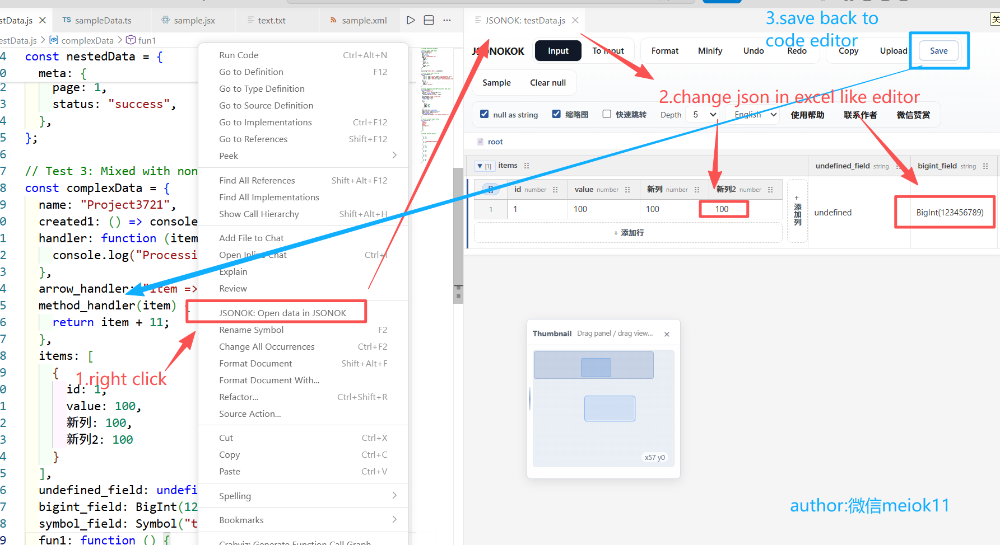

# JSONOKOK

JSONOKOK（www.jsonOKOK.com） 是一个类 Excel 的 JSON 可视化编辑器，适合查看深层的 object / array 结构、快速定位节点，并在表格里直接编辑值和类型。 (JSONOKOK is an Excel-like JSON visual editor suitable for viewing deep object/array structures, quickly locating nodes, and directly editing values and types in a table.)

## 特性 (Features)

- 支持 JSON / JSONC / JS / TS。 (Supports JSON / JSONC / JS / TS.)
- 表格化编辑，像 Excel 一样操作字段和值。 (Table-style editing; operate fields and values like Excel.)
- 面包屑与聚焦，可快速查看子树并返回上层。 (Breadcrumbs and focus allow quick viewing of subtrees and returning to the parent.)
- 支持超大 JSON 分层查看与按需展开。 (Supports layered viewing and on-demand expansion for very large JSON files.)

## 快速开始 (Quick Start)

1. 在 VS Code 中打开 JSON / JS / TS 文件。 (Open a JSON / JS / TS file in VS Code.)
2. 右键文件或编辑器内容，选择 `JSONOK` 打开；也支持拖拽本地文件或在输入面板粘贴数据。 (Right-click the file or editor content and choose `JSONOK` to open; you can also drag local files or paste data into the input panel.)

## 导航 (Navigation)

- 小地图可快速定位大画布内的任意区域。 (A mini-map lets you quickly locate any area within the canvas.)
- 右键节点可聚焦当前子树；使用面包屑回退到上级。 (Right-click a node to focus the current subtree; use breadcrumbs to go back up.)
- 支持 Ctrl+拖拽框选、拖动画布与字段拖拽重排。 (Supports Ctrl+drag selection, panning the canvas, and dragging fields to reorder.)

## 搜索定位 (Search & Locate)

- 使用浏览器内搜索（`Ctrl + F`）或快速跳转窗口按 key / value / path 搜索并定位。 (Use in-browser search (`Ctrl + F`) or the quick-jump window to search by key/value/path and locate items.)

## 可视化编辑 (Visual Editing)

- 单元格可切换为对象、数组、字符串、数字、布尔或 null。 (Cells can be switched to object, array, string, number, boolean, or null.)
- 支持将字符串形式保存的 JSON 自动解析为节点并展开。 (Supports automatically parsing JSON stored as a string into nodes and expanding them.)
- 支持增加/删除行列、双击修改列标题、拖拽调整列顺序。 (Supports adding/removing rows and columns, double-click to edit column headers, and dragging to reorder columns.)

## 性能优化 (Performance)

- 通过层级限制与“显示下一层”按需展开，减小渲染范围以提高大 JSON 的响应能力。 (Use depth limits and "show next level" to expand on demand, reducing rendering scope to improve responsiveness for large JSON files.)

更多使用说明与截图见扩展内帮助页面：`[www.jsonOKOK.com](http://www.jsonOKOK.com)`。 (For more instructions and screenshots, see the extension help page: `[www.jsonOKOK.com](http://www.jsonOKOK.com)`.)
